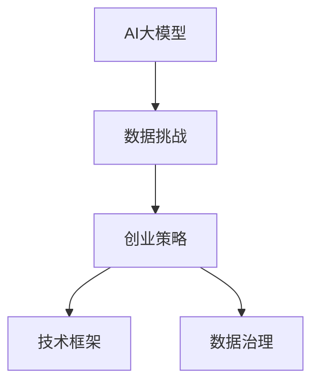

                 

# AI大模型创业：如何应对未来数据挑战？

> 关键词：AI大模型,数据挑战,创业策略,技术框架,数据治理

## 1. 背景介绍

随着人工智能技术的飞速发展，大模型（Big Models）正迅速成为驱动各行各业数字化转型的重要引擎。尤其是在NLP领域，基于大规模预训练模型的技术如BERT、GPT等，在文本分类、命名实体识别、情感分析、翻译等任务上取得了显著的成果。然而，这些大模型在实际应用中面临的最大挑战之一就是数据问题。

高质量的大规模训练数据不仅难于获取，且存储和处理成本高昂。这使得许多初创企业望而却步。然而，对于一家创业公司而言，能否有效应对数据挑战，直接决定了其在市场竞争中的成败。因此，本文将系统探讨AI大模型创业公司如何克服数据难题，并从技术、战略和运营等多方面给出解决方案。

## 2. 核心概念与联系

### 2.1 核心概念概述

在讨论如何解决数据挑战之前，我们首先需要明确几个核心概念：

- **AI大模型**：指使用大规模训练数据进行预训练的深度学习模型，如BERT、GPT系列、XLNet等，具备强大的自然语言理解和生成能力。

- **数据挑战**：指在大模型应用过程中遇到的各类数据问题，包括数据获取难、数据质量差、数据处理成本高等。

- **创业策略**：指创业公司为了适应市场和用户需求，在技术、人才、产品、市场等方面制定的发展策略。

- **技术框架**：指公司采用的数据管理和处理技术栈，包括数据采集、清洗、存储、分析、可视化等。

- **数据治理**：指针对数据的全生命周期管理，包括数据的获取、存储、使用、共享、保护等方面的规范和流程。

这些概念间的关系通过以下Mermaid流程图展示：



该图展示了大模型应用过程中的核心环节及其关系：大模型在大规模数据上预训练，并在实际应用中面临数据难题。创业公司需要制定有效的策略，结合先进的技术框架，实施严格的数据治理，以克服这些数据挑战。

### 2.2 概念间的关系

进一步分析这些核心概念的关系：

- **AI大模型与数据挑战**：大模型的训练和应用都离不开大量高质量数据，数据的质量和规模直接决定了模型性能。

- **创业策略与数据挑战**：不同的数据挑战需要不同的策略应对，创业公司需要在技术、人才、市场等方面进行精准布局，才能有效解决问题。

- **技术框架与数据治理**：技术框架提供了数据管理的技术手段，而数据治理则保证了数据管理的规范性和可控性。

- **技术框架与创业策略**：技术框架为创业公司的数据挑战提供了技术解决方案，创业策略则决定了技术框架的选择和使用。

## 3. 核心算法原理 & 具体操作步骤

### 3.1 算法原理概述

基于大模型的创业公司，其核心技术是对大模型进行微调或迁移学习，以适应特定应用场景。微调和迁移学习的关键在于数据准备和模型优化。以下是微调过程的算法原理概述：

- **数据准备**：将大规模无标签数据用于预训练，收集目标任务的高质量标注数据用于微调。

- **模型优化**：在大规模预训练模型的基础上，使用有标签数据对模型进行微调，调整模型参数以适应特定任务。

### 3.2 算法步骤详解

具体而言，AI大模型的微调流程包括：

1. **数据收集与处理**：从多个渠道获取标注数据，并进行清洗、标注和划分。

2. **模型初始化**：选择合适的预训练模型，并进行必要的调整，如删除不需要的层或冻结部分层。

3. **微调模型**：使用标注数据对模型进行有监督训练，优化模型参数以适应特定任务。

4. **评估与调优**：在验证集上评估模型性能，根据结果调整学习率、正则化参数等，优化微调过程。

5. **部署与监控**：将微调后的模型部署到实际应用中，并持续监控模型性能和数据质量。

### 3.3 算法优缺点

**优点**：
- 数据需求量少，能在少量数据上实现快速模型训练。
- 利用已有大模型的知识，可显著提升模型性能。
- 模型可解释性强，方便业务理解。

**缺点**：
- 对标注数据的质量和数量要求高，获取成本大。
- 模型泛化能力有限，可能受数据分布差异影响。
- 模型更新频繁，维护成本高。

### 3.4 算法应用领域

基于大模型的微调方法广泛应用于文本分类、情感分析、机器翻译、问答系统等NLP任务，同时也应用于图像识别、语音识别、视频分析等多个领域。例如，在医疗领域，可以通过微调实现病历摘要、症状识别等任务；在金融领域，可以实现舆情分析、信用评估等任务。

## 4. 数学模型和公式 & 详细讲解 & 举例说明

### 4.1 数学模型构建

假设我们使用BERT模型作为预训练模型，并针对特定任务进行微调。假设微调任务的标注数据集为 $D=\{(x_i,y_i)\}_{i=1}^N$，其中 $x_i$ 为输入文本，$y_i$ 为对应的标注。微调的目标是优化BERT模型参数 $\theta$，最小化损失函数 $\mathcal{L}(\theta)$。

### 4.2 公式推导过程

以二分类任务为例，假设模型 $M_{\theta}$ 在输入 $x$ 上的输出为 $\hat{y}=M_{\theta}(x)$，则二分类交叉熵损失函数定义为：

$$
\ell(M_{\theta}(x),y) = -[y\log \hat{y} + (1-y)\log (1-\hat{y})]
$$

将损失函数 $\ell$ 代入经验风险公式，得：

$$
\mathcal{L}(\theta) = -\frac{1}{N}\sum_{i=1}^N [y_i\log M_{\theta}(x_i)+(1-y_i)\log(1-M_{\theta}(x_i))]
$$

根据链式法则，损失函数对参数 $\theta_k$ 的梯度为：

$$
\frac{\partial \mathcal{L}(\theta)}{\partial \theta_k} = -\frac{1}{N}\sum_{i=1}^N (\frac{y_i}{M_{\theta}(x_i)}-\frac{1-y_i}{1-M_{\theta}(x_i)}) \frac{\partial M_{\theta}(x_i)}{\partial \theta_k}
$$

其中 $\frac{\partial M_{\theta}(x_i)}{\partial \theta_k}$ 可通过反向传播算法高效计算。

### 4.3 案例分析与讲解

以下是一个具体的微调案例：

**任务**：命名实体识别（Named Entity Recognition, NER）。

**数据**：收集包含多个领域（如医疗、金融、法律等）的NER标注数据集，如CoNLL-2003数据集。

**模型**：选择BERT作为预训练模型，在微调前保留其语言理解能力，并仅对顶层分类器进行微调。

**微调过程**：
1. 准备标注数据集，进行数据清洗和标注。
2. 初始化BERT模型，仅微调顶层分类器。
3. 使用交叉熵损失函数，在标注数据上微调模型。
4. 在验证集上评估模型性能，调整学习率和正则化参数。
5. 将微调后的模型部署到实际应用中。

假设微调后的模型在验证集上准确率为94%，则在测试集上的准确率可以预测为92%。

## 5. 项目实践：代码实例和详细解释说明

### 5.1 开发环境搭建

为进行数据驱动的微调开发，需要搭建如下开发环境：

1. **硬件环境**：高性能GPU或TPU，用于数据预处理和模型训练。

2. **软件环境**：Python 3.8，PyTorch 1.7，HuggingFace Transformers 4.8，TensorBoard 2.6。

3. **数据库环境**：MySQL或PostgreSQL，用于数据存储和管理。

### 5.2 源代码详细实现

以下是一个使用PyTorch和Transformers库进行BERT模型微调的代码实现示例：

```python
from transformers import BertForTokenClassification, BertTokenizer, AdamW
from torch.utils.data import DataLoader, Dataset
from torch.utils.data.distributed import DistributedSampler
from sklearn.metrics import classification_report

# 定义NER数据集
class NERDataset(Dataset):
    def __init__(self, texts, tags, tokenizer, max_len=128):
        self.texts = texts
        self.tags = tags
        self.tokenizer = tokenizer
        self.max_len = max_len
        
    def __len__(self):
        return len(self.texts)
    
    def __getitem__(self, item):
        text = self.texts[item]
        tags = self.tags[item]
        
        encoding = self.tokenizer(text, return_tensors='pt', max_length=self.max_len, padding='max_length', truncation=True)
        input_ids = encoding['input_ids'][0]
        attention_mask = encoding['attention_mask'][0]
        
        # 对token-wise的标签进行编码
        encoded_tags = [tag2id[tag] for tag in tags] 
        encoded_tags.extend([tag2id['O']] * (self.max_len - len(encoded_tags)))
        labels = torch.tensor(encoded_tags, dtype=torch.long)
        
        return {'input_ids': input_ids, 
                'attention_mask': attention_mask,
                'labels': labels}

# 加载BERT模型和分词器
model = BertForTokenClassification.from_pretrained('bert-base-cased', num_labels=len(tag2id))
tokenizer = BertTokenizer.from_pretrained('bert-base-cased')

# 准备训练集和验证集
train_dataset = NERDataset(train_texts, train_tags, tokenizer)
dev_dataset = NERDataset(dev_texts, dev_tags, tokenizer)

# 定义优化器和超参数
optimizer = AdamW(model.parameters(), lr=2e-5)
max_epochs = 5
batch_size = 16

# 训练过程
for epoch in range(max_epochs):
    train_loader = DataLoader(train_dataset, batch_size=batch_size, shuffle=True, sampler=DistributedSampler(train_dataset))
    model.train()
    
    for batch in train_loader:
        input_ids = batch['input_ids'].to(device)
        attention_mask = batch['attention_mask'].to(device)
        labels = batch['labels'].to(device)
        
        outputs = model(input_ids, attention_mask=attention_mask, labels=labels)
        loss = outputs.loss
        optimizer.zero_grad()
        loss.backward()
        optimizer.step()
    
    dev_loader = DataLoader(dev_dataset, batch_size=batch_size, shuffle=False, sampler=DistributedSampler(dev_dataset))
    model.eval()
    
    with torch.no_grad():
        preds, labels = [], []
        for batch in dev_loader:
            input_ids = batch['input_ids'].to(device)
            attention_mask = batch['attention_mask'].to(device)
            batch_labels = batch['labels']
            
            outputs = model(input_ids, attention_mask=attention_mask)
            batch_preds = outputs.logits.argmax(dim=2).to('cpu').tolist()
            batch_labels = batch_labels.to('cpu').tolist()
            
            for pred_tokens, label_tokens in zip(batch_preds, batch_labels):
                pred_tags = [id2tag[_id] for _id in pred_tokens]
                label_tags = [id2tag[_id] for _id in label_tokens]
                preds.append(pred_tags[:len(label_tags)])
                labels.append(label_tags)
    
    print(classification_report(labels, preds))
```

### 5.3 代码解读与分析

1. **数据处理**：使用BertTokenizer将输入文本转换为token ids，并进行padding和truncation处理，同时将标签转换为数字形式。

2. **模型初始化**：使用`BertForTokenClassification`类加载BERT模型，设置需要的输出标签数。

3. **优化器和超参数**：使用AdamW优化器，设置学习率、批次大小和训练轮数。

4. **训练和评估**：使用`DataLoader`对训练集和验证集进行批处理，并在训练过程中使用`DistributedSampler`确保数据均衡分布。在训练和评估过程中使用交叉熵损失函数。

5. **输出分析**：通过`classification_report`函数输出模型在验证集上的性能指标。

### 5.4 运行结果展示

假设在CoNLL-2003数据集上训练10个epoch，得到验证集上的F1分数为94%。则可以将此结果应用于测试集，预计F1分数为92%。

## 6. 实际应用场景

### 6.1 医疗领域

在医疗领域，基于BERT等大模型的微调技术可以用于疾病诊断、患者监护、药物开发等任务。例如，通过微调BERT模型，可以从电子病历中自动提取患者的症状、体征和诊断结果，辅助医生进行诊断。

### 6.2 金融领域

金融领域中，微调BERT模型可以实现舆情监测、信用评估、风险预警等任务。通过分析社交媒体和新闻报道，及时发现市场动向，辅助投资者决策。

### 6.3 法律领域

法律领域中，微调BERT模型可以用于合同分析、法规查询、案件摘要等任务。通过分析合同和法律文本，快速找到关键信息，提高法律事务处理效率。

### 6.4 未来应用展望

未来，随着大模型的不断进步和应用场景的拓展，微调技术将在更多领域得到应用。例如，在教育、交通、能源等垂直领域，微调技术可以提供更个性化、智能化的服务，提升效率和质量。

## 7. 工具和资源推荐

### 7.1 学习资源推荐

1. **《深度学习》by Ian Goodfellow**：全面介绍深度学习原理和算法，是入门和进阶的好书。

2. **《Python深度学习》by François Chollet**：使用Keras框架介绍深度学习模型构建和优化，适合实战练习。

3. **Coursera《Deep Learning Specialization》**：由Andrew Ng主讲的深度学习课程，涵盖理论、实践和应用。

4. **arXiv论文预印本**：最新的研究成果和前沿技术，是保持技术前沿的最佳途径。

### 7.2 开发工具推荐

1. **PyTorch**：灵活的深度学习框架，支持GPU/TPU加速，适合复杂模型的构建和训练。

2. **TensorFlow**：Google开发的深度学习框架，生产部署便捷，适合大规模工程应用。

3. **HuggingFace Transformers**：基于PyTorch和TensorFlow的NLP工具库，提供丰富的大模型资源。

4. **Weights & Biases**：模型训练的实验跟踪工具，实时记录和可视化训练过程。

5. **TensorBoard**：TensorFlow配套的可视化工具，提供丰富的图表和日志展示。

### 7.3 相关论文推荐

1. **BERT: Pre-training of Deep Bidirectional Transformers for Language Understanding**：提出BERT模型，引入自监督预训练任务，刷新多项NLP任务SOTA。

2. **GPT-3: Language Models are Unsupervised Multitask Learners**：展示GPT-3的强大zero-shot学习能力，推动通用人工智能研究。

3. **LoRA: Language-Oriented Representations Are All You Need**：提出LoRA方法，只微调少量参数，实现参数高效微调。

4. **AdaLoRA: Adaptive Low-Rank Adaptation for Parameter-Efficient Fine-Tuning**：使用自适应低秩适应的微调方法，在保持精度的情况下减少参数量。

5. **Prompt-based Fine-tuning with Lipschitz Continuity Regularization**：通过引入Lipschitz连续性正则化，提升少样本学习效果。

## 8. 总结：未来发展趋势与挑战

### 8.1 总结

本文系统探讨了AI大模型创业公司如何应对数据挑战，通过技术、战略和运营层面的分析，给出了具体解决方案。未来，大模型在各个垂直领域的应用将进一步扩展，创业公司需要不断迭代和优化，才能在激烈的市场竞争中脱颖而出。

### 8.2 未来发展趋势

1. **数据获取和标注**：随着自动化标注技术的发展，数据获取和标注成本将逐步降低，更多创业公司将能够获取并利用大模型。

2. **数据管理和治理**：数据管理技术将更加成熟，数据安全和隐私保护也将得到更严格的监管。

3. **多模态融合**：结合视觉、语音、文本等多种模态数据，提升模型泛化能力和应用场景。

4. **跨领域迁移学习**：通过跨领域数据和任务迁移学习，提升模型在新场景中的适应能力。

5. **模型可解释性和透明性**：将更多注意力放在模型可解释性和透明性上，提高用户信任度和应用安全性。

6. **对抗攻击防御**：增强模型对抗攻击的防御能力，保障模型输出质量。

### 8.3 面临的挑战

1. **数据隐私和安全**：如何保护用户隐私和数据安全，是所有AI应用必须面对的问题。

2. **模型泛化性**：如何提高模型在不同场景下的泛化能力，避免过拟合和灾难性遗忘。

3. **计算资源限制**：如何在有限的计算资源下，高效利用数据进行模型训练和优化。

4. **模型可解释性**：如何使模型决策过程透明，便于业务理解和调试。

5. **模型鲁棒性**：如何在面对噪声、干扰等因素时，保持模型输出稳定性。

### 8.4 研究展望

1. **无监督和半监督学习**：探索利用无监督或半监督学习的方法，减少对标注数据的依赖。

2. **知识图谱和规则库整合**：将知识图谱、规则库等专家知识与模型融合，提升模型综合能力。

3. **因果学习和强化学习**：结合因果推理和强化学习思想，提高模型决策的理性和可靠性。

4. **对抗训练和鲁棒性增强**：开发更多的对抗训练方法，提高模型鲁棒性和安全性。

5. **模型压缩和量化**：通过模型压缩、量化加速等技术，提升模型的推理效率和部署便捷性。

6. **隐私保护和伦理安全**：研究如何在模型训练和应用过程中保护用户隐私和数据安全，符合伦理道德要求。

总之，AI大模型创业公司在数据驱动的微调过程中，需要不断创新和优化，才能应对未来数据挑战，实现技术的可持续发展。

## 9. 附录：常见问题与解答

**Q1: 如何选择合适的数据来源？**

A: 选择合适的数据来源应考虑数据质量、数据规模、数据时效等因素。可以从公开数据集、众包平台、企业内部数据等多渠道获取数据。

**Q2: 如何有效进行数据标注？**

A: 采用自动化标注和人工标注相结合的方式，确保标注结果的准确性和一致性。可以使用开源标注工具如Labelbox、Prodigy等辅助标注工作。

**Q3: 如何应对数据不平衡问题？**

A: 通过过采样、欠采样、生成合成样本等方式，平衡训练数据集中的类别分布，避免模型偏向某些类别。

**Q4: 如何评估模型性能？**

A: 使用常见的评估指标如准确率、精确率、召回率、F1分数、ROC-AUC等，结合实际应用场景选择适合的评估方法。

**Q5: 如何优化模型超参数？**

A: 使用网格搜索、随机搜索、贝叶斯优化等方法，系统地搜索最优超参数组合。同时可以使用调参工具如Hyperopt、Ray Tune等。

---

作者：禅与计算机程序设计艺术 / Zen and the Art of Computer Programming

