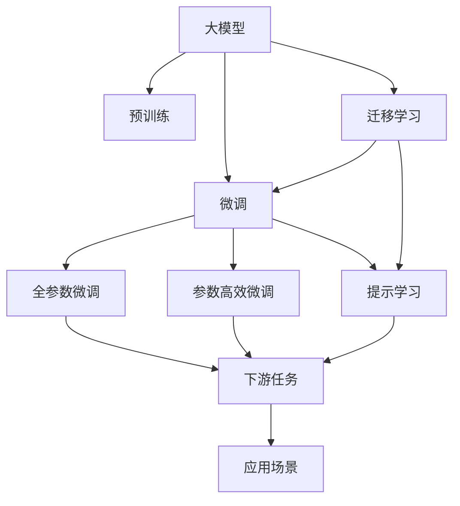
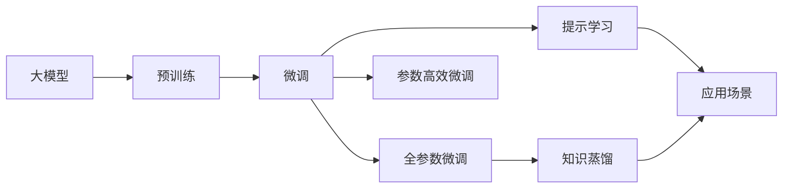
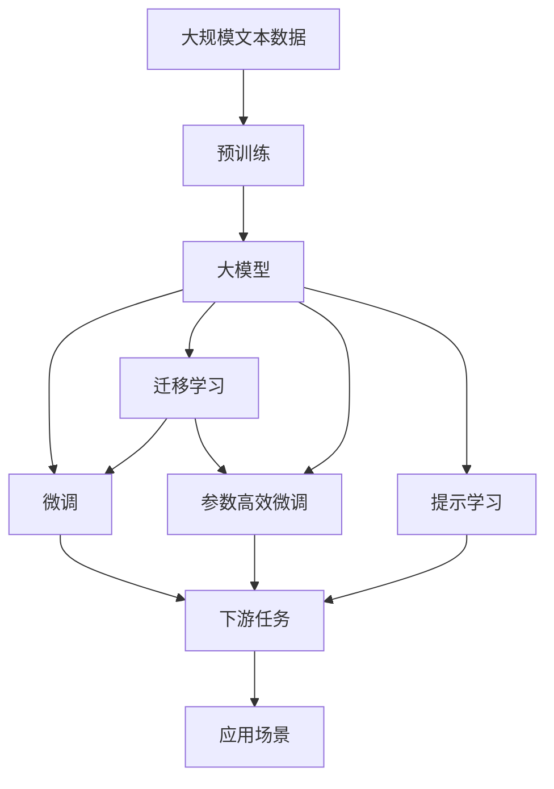

                 

# AI大模型创业：如何抓住未来机遇？

> 关键词：大模型创业, AI创业, 技术创业, 自然语言处理(NLP), 深度学习, 人工智能

## 1. 背景介绍

### 1.1 问题由来
近年来，人工智能（AI）技术取得了长足的发展，尤其是在大模型领域，各种先进的大模型如GPT-3、BERT等相继诞生，并在多个领域展现出强大的应用潜力。随着这些大模型的商业化应用，越来越多的创业者和公司开始探索如何利用大模型技术进行商业化落地。大模型技术在NLP、图像识别、推荐系统等领域展现了广泛的应用前景，吸引了大量资本和人才的关注。

### 1.2 问题核心关键点
如何利用大模型技术进行商业化落地，是AI创业者最关心的核心问题。大模型技术本身虽然具备很强的创新性和应用潜力，但在实际落地过程中，还面临着诸多挑战，如数据标注成本高、算法复杂度大、计算资源需求高等。因此，如何将大模型技术高效、低成本地商业化落地，是创业者需要重点解决的问题。

### 1.3 问题研究意义
大模型技术的商业化落地不仅是AI创业公司发展的关键，也是推动整个AI领域技术进步的重要驱动力。大模型的商业化应用可以加速技术成果转化，提升AI技术的实用性和可接受性，为各行各业带来新的商业模式和创新点。

## 2. 核心概念与联系

### 2.1 核心概念概述

为更好地理解大模型技术的商业化落地，本节将介绍几个密切相关的核心概念：

- **大模型（Large Models）**：指通过预训练和微调获得的大型神经网络模型，如BERT、GPT等。这些模型具备强大的泛化能力和适应性，能够在不同的应用场景中表现出色。

- **微调（Fine-tuning）**：在大模型上进行微调，通过特定任务的数据集对模型参数进行调整，以适应特定的应用场景。微调过程通常需要少量标注数据，可以显著提升模型在特定任务上的性能。

- **迁移学习（Transfer Learning）**：利用已有的大模型在新的应用场景中进行迁移学习，可以大大减少新任务的数据需求和训练时间。迁移学习在大模型技术中应用广泛，是大模型落地应用的常用方法。

- **参数高效微调（Parameter-Efficient Fine-tuning, PEFT）**：在大模型微调过程中，只更新部分参数，而非全部参数。这种方法可以在保证模型性能的同时，显著减少计算资源的需求。

- **提示学习（Prompt Learning）**：通过在输入文本中添加提示信息，引导大模型进行特定任务的推理和生成。提示学习可以实现在不更新模型参数的情况下，快速适应新任务。

- **知识蒸馏（Knowledge Distillation）**：将大模型的知识传递给较小的模型，以提高后者的性能。知识蒸馏是大模型落地应用中常用的优化技术。

这些核心概念之间存在紧密的联系，形成了一个完整的大模型落地应用的生态系统。下面通过一个Mermaid流程图来展示这些概念之间的关系：



这个流程图展示了从预训练到大模型微调，再到知识蒸馏和应用场景的具体过程。大模型通过预训练获得通用能力，然后在特定任务上进行微调，利用迁移学习、参数高效微调和提示学习等技术，提升模型的适应性和性能，最终在实际应用场景中发挥作用。

### 2.2 概念间的关系

这些核心概念之间的关系可以通过以下Mermaid流程图来进一步展示：



这个流程图展示了预训练和微调在大模型落地应用中的作用。预训练为模型提供通用知识，微调通过特定任务进行模型优化，参数高效微调和提示学习提升模型性能和效率，知识蒸馏实现模型的规模优化，应用场景则将模型引入具体应用，实现大模型的商业化落地。

### 2.3 核心概念的整体架构

最后，我们用一个综合的流程图来展示这些核心概念在大模型落地应用中的整体架构：



这个综合流程图展示了从预训练到大模型微调，再到知识蒸馏和应用场景的全过程。大模型通过预训练获得基础能力，然后在特定任务上进行微调，利用迁移学习、参数高效微调和提示学习等技术，提升模型的适应性和性能，最终在实际应用场景中发挥作用。

## 3. 核心算法原理 & 具体操作步骤
### 3.1 算法原理概述

大模型技术的商业化落地，本质上是一个从预训练到微调的过程。大模型的商业化落地需要满足以下几个关键要求：

- **高效性**：在有限的时间、数据和计算资源条件下，快速实现模型的商业化落地。
- **可扩展性**：模型需要具备良好的可扩展性，能够适应不同规模和类型的商业应用场景。
- **可解释性**：模型需要具备可解释性，便于理解和调试，确保商业应用的可靠性和安全性。
- **低成本**：商业化落地的成本需要尽可能降低，包括数据标注、模型训练、部署和维护等各个环节。

大模型的商业化落地通常包括以下几个关键步骤：

1. **预训练**：在大规模无标签数据上进行预训练，获取通用语言知识和特征表示。
2. **微调**：在特定任务的数据集上进行微调，优化模型以适应新任务。
3. **迁移学习**：利用已有的大模型，快速适应新任务，减少新任务的数据需求和训练时间。
4. **知识蒸馏**：通过知识蒸馏技术，将大模型的知识传递给较小的模型，提高后者的性能和效率。
5. **参数高效微调**：在微调过程中，只更新部分参数，减少计算资源的需求。
6. **提示学习**：通过在输入文本中添加提示信息，引导大模型进行特定任务的推理和生成。

### 3.2 算法步骤详解

下面将详细介绍大模型商业化落地的各个步骤：

**Step 1: 准备预训练模型和数据集**

- 选择合适的预训练语言模型（如BERT、GPT等）作为初始化参数。
- 准备下游任务的数据集，划分为训练集、验证集和测试集。数据集需要与预训练数据集具有相似的分布，以避免模型过拟合。

**Step 2: 添加任务适配层**

- 根据下游任务的类型，在预训练模型顶层设计合适的输出层和损失函数。例如，对于分类任务，可以添加一个线性分类器和交叉熵损失函数。
- 对于生成任务，可以使用语言模型的解码器输出概率分布，并以负对数似然为损失函数。

**Step 3: 设置微调超参数**

- 选择合适的优化算法及其参数，如AdamW、SGD等，设置学习率、批大小、迭代轮数等。
- 设置正则化技术及强度，包括权重衰减、Dropout、Early Stopping等，防止模型过拟合。
- 确定冻结预训练参数的策略，如仅微调顶层，或全部参数都参与微调。

**Step 4: 执行梯度训练**

- 将训练集数据分批次输入模型，前向传播计算损失函数。
- 反向传播计算参数梯度，根据设定的优化算法和学习率更新模型参数。
- 周期性在验证集上评估模型性能，根据性能指标决定是否触发Early Stopping。
- 重复上述步骤直到满足预设的迭代轮数或Early Stopping条件。

**Step 5: 测试和部署**

- 在测试集上评估微调后模型在特定任务上的性能，对比微调前后的精度提升。
- 使用微调后的模型对新样本进行推理预测，集成到实际的应用系统中。
- 持续收集新的数据，定期重新微调模型，以适应数据分布的变化。

### 3.3 算法优缺点

大模型技术在商业化落地过程中，具有以下优点和缺点：

**优点：**
- **泛化能力强**：大模型通过预训练和微调，可以适应各种不同的应用场景。
- **性能提升显著**：在特定任务上进行微调，能够显著提升模型的性能。
- **迁移学习效果显著**：利用已有的大模型，可以大幅减少新任务的数据需求和训练时间。

**缺点：**
- **数据标注成本高**：微调需要大量的标注数据，数据标注成本较高。
- **计算资源需求大**：大模型的计算资源需求较大，尤其是在微调过程中，需要高性能的计算设备和数据存储。
- **算法复杂度高**：大模型训练和微调涉及复杂的算法和模型结构，需要较高的技术门槛。

### 3.4 算法应用领域

大模型技术已经在多个领域展现出广泛的应用潜力，例如：

- **自然语言处理（NLP）**：在问答、对话、摘要、翻译、情感分析等任务上，大模型表现出色。
- **计算机视觉（CV）**：在图像识别、图像生成、目标检测等任务上，大模型同样具备强大的应用潜力。
- **推荐系统**：在大规模推荐任务中，大模型能够根据用户行为和历史数据，推荐符合用户兴趣的内容。
- **医疗领域**：在医学影像分析、病历记录处理、医疗知识图谱构建等任务上，大模型可以辅助医生进行诊断和治疗。

除了以上领域，大模型技术在金融、交通、制造、教育等多个领域也展现出广阔的应用前景，能够为这些行业带来新的商业模式和技术革新。

## 4. 数学模型和公式 & 详细讲解 & 举例说明

### 4.1 数学模型构建

假设预训练语言模型为 $M_{\theta}$，其中 $\theta$ 为预训练得到的模型参数。给定下游任务 $T$ 的标注数据集 $D=\{(x_i, y_i)\}_{i=1}^N$，其中 $x_i$ 为输入，$y_i$ 为标签。微调的目标是找到新的模型参数 $\hat{\theta}$，使得：

$$
\hat{\theta}=\mathop{\arg\min}_{\theta} \mathcal{L}(M_{\theta},D)
$$

其中 $\mathcal{L}$ 为针对任务 $T$ 设计的损失函数，用于衡量模型预测输出与真实标签之间的差异。常见的损失函数包括交叉熵损失、均方误差损失等。

### 4.2 公式推导过程

以下我们以二分类任务为例，推导交叉熵损失函数及其梯度的计算公式。

假设模型 $M_{\theta}$ 在输入 $x$ 上的输出为 $\hat{y}=M_{\theta}(x) \in [0,1]$，表示样本属于正类的概率。真实标签 $y \in \{0,1\}$。则二分类交叉熵损失函数定义为：

$$
\ell(M_{\theta}(x),y) = -[y\log \hat{y} + (1-y)\log (1-\hat{y})]
$$

将其代入经验风险公式，得：

$$
\mathcal{L}(\theta) = -\frac{1}{N}\sum_{i=1}^N [y_i\log M_{\theta}(x_i)+(1-y_i)\log(1-M_{\theta}(x_i))]
$$

根据链式法则，损失函数对参数 $\theta_k$ 的梯度为：

$$
\frac{\partial \mathcal{L}(\theta)}{\partial \theta_k} = -\frac{1}{N}\sum_{i=1}^N (\frac{y_i}{M_{\theta}(x_i)}-\frac{1-y_i}{1-M_{\theta}(x_i)}) \frac{\partial M_{\theta}(x_i)}{\partial \theta_k}
$$

其中 $\frac{\partial M_{\theta}(x_i)}{\partial \theta_k}$ 可进一步递归展开，利用自动微分技术完成计算。

### 4.3 案例分析与讲解

以问答系统为例，详细讲解大模型微调的过程。

假设我们有一份名为QA-2018的问答数据集，包含40,000个问题-答案对。我们可以使用BERT作为预训练模型，在这个问题-答案对上进行微调，以适应问答系统的需求。

1. **准备预训练模型和数据集**：
   - 选择BERT作为预训练模型，使用HuggingFace的BERT库加载模型。
   - 准备QA-2018数据集，将其分为训练集、验证集和测试集。

2. **添加任务适配层**：
   - 在BERT模型的顶层添加一个线性分类器和交叉熵损失函数，用于处理二分类问题。
   - 定义输入和输出格式，确保模型能够正确处理输入和输出。

3. **设置微调超参数**：
   - 设置AdamW优化器，学习率为2e-5，批大小为16，迭代轮数为5。
   - 设置Dropout为0.1，权重衰减为0.01，Early Stopping策略为1e-3。
   - 仅微调模型顶层，以减少计算资源的需求。

4. **执行梯度训练**：
   - 使用DataLoader加载训练集，进行前向传播和反向传播，更新模型参数。
   - 在验证集上评估模型性能，根据性能指标决定是否触发Early Stopping。
   - 重复上述步骤直到满足预设的迭代轮数或Early Stopping条件。

5. **测试和部署**：
   - 在测试集上评估微调后模型的性能，对比微调前后的精度提升。
   - 使用微调后的模型对新问题进行推理预测，集成到问答系统中。
   - 持续收集新的问题-答案对，定期重新微调模型，以适应新的问题类型。

## 5. 项目实践：代码实例和详细解释说明

### 5.1 开发环境搭建

在进行大模型微调实践前，我们需要准备好开发环境。以下是使用Python进行PyTorch开发的环境配置流程：

1. 安装Anaconda：从官网下载并安装Anaconda，用于创建独立的Python环境。

2. 创建并激活虚拟环境：
```bash
conda create -n pytorch-env python=3.8 
conda activate pytorch-env
```

3. 安装PyTorch：根据CUDA版本，从官网获取对应的安装命令。例如：
```bash
conda install pytorch torchvision torchaudio cudatoolkit=11.1 -c pytorch -c conda-forge
```

4. 安装Transformers库：
```bash
pip install transformers
```

5. 安装各类工具包：
```bash
pip install numpy pandas scikit-learn matplotlib tqdm jupyter notebook ipython
```

完成上述步骤后，即可在`pytorch-env`环境中开始微调实践。

### 5.2 源代码详细实现

下面我们以问答系统为例，给出使用Transformers库对BERT模型进行微调的PyTorch代码实现。

首先，定义问答系统的数据处理函数：

```python
from transformers import BertTokenizer
from torch.utils.data import Dataset
import torch

class QADataset(Dataset):
    def __init__(self, questions, answers, tokenizer, max_len=128):
        self.questions = questions
        self.answers = answers
        self.tokenizer = tokenizer
        self.max_len = max_len
        
    def __len__(self):
        return len(self.questions)
    
    def __getitem__(self, item):
        question = self.questions[item]
        answer = self.answers[item]
        
        encoding = self.tokenizer(question, answer, return_tensors='pt', max_length=self.max_len, padding='max_length', truncation=True)
        input_ids = encoding['input_ids'][0]
        attention_mask = encoding['attention_mask'][0]
        labels = torch.tensor([answer_id], dtype=torch.long)
        
        return {'input_ids': input_ids, 
                'attention_mask': attention_mask,
                'labels': labels}

# 将问题-答案对转换为训练样本
train_dataset = QADataset(train_questions, train_answers, tokenizer)
dev_dataset = QADataset(dev_questions, dev_answers, tokenizer)
test_dataset = QADataset(test_questions, test_answers, tokenizer)
```

然后，定义模型和优化器：

```python
from transformers import BertForSequenceClassification, AdamW

model = BertForSequenceClassification.from_pretrained('bert-base-cased', num_labels=2)

optimizer = AdamW(model.parameters(), lr=2e-5)
```

接着，定义训练和评估函数：

```python
from torch.utils.data import DataLoader
from tqdm import tqdm
from sklearn.metrics import classification_report

device = torch.device('cuda') if torch.cuda.is_available() else torch.device('cpu')
model.to(device)

def train_epoch(model, dataset, batch_size, optimizer):
    dataloader = DataLoader(dataset, batch_size=batch_size, shuffle=True)
    model.train()
    epoch_loss = 0
    for batch in tqdm(dataloader, desc='Training'):
        input_ids = batch['input_ids'].to(device)
        attention_mask = batch['attention_mask'].to(device)
        labels = batch['labels'].to(device)
        model.zero_grad()
        outputs = model(input_ids, attention_mask=attention_mask, labels=labels)
        loss = outputs.loss
        epoch_loss += loss.item()
        loss.backward()
        optimizer.step()
    return epoch_loss / len(dataloader)

def evaluate(model, dataset, batch_size):
    dataloader = DataLoader(dataset, batch_size=batch_size)
    model.eval()
    preds, labels = [], []
    with torch.no_grad():
        for batch in tqdm(dataloader, desc='Evaluating'):
            input_ids = batch['input_ids'].to(device)
            attention_mask = batch['attention_mask'].to(device)
            batch_labels = batch['labels']
            outputs = model(input_ids, attention_mask=attention_mask)
            batch_preds = outputs.logits.argmax(dim=2).to('cpu').tolist()
            batch_labels = batch_labels.to('cpu').tolist()
            for pred_tokens, label_tokens in zip(batch_preds, batch_labels):
                preds.append(pred_tokens[:len(label_tokens)])
                labels.append(label_tokens)
                
    print(classification_report(labels, preds))
```

最后，启动训练流程并在测试集上评估：

```python
epochs = 5
batch_size = 16

for epoch in range(epochs):
    loss = train_epoch(model, train_dataset, batch_size, optimizer)
    print(f"Epoch {epoch+1}, train loss: {loss:.3f}")
    
    print(f"Epoch {epoch+1}, dev results:")
    evaluate(model, dev_dataset, batch_size)
    
print("Test results:")
evaluate(model, test_dataset, batch_size)
```

以上就是使用PyTorch对BERT进行问答系统微调的完整代码实现。可以看到，得益于Transformers库的强大封装，我们可以用相对简洁的代码完成BERT模型的加载和微调。

### 5.3 代码解读与分析

让我们再详细解读一下关键代码的实现细节：

**QADataset类**：
- `__init__`方法：初始化问题、答案、分词器等关键组件。
- `__len__`方法：返回数据集的样本数量。
- `__getitem__`方法：对单个样本进行处理，将问题-答案对输入编码为token ids，将标签编码为数字，并对其进行定长padding，最终返回模型所需的输入。

**train_epoch和evaluate函数**：
- `train_epoch`方法：对数据以批为单位进行迭代，在每个批次上前向传播计算loss并反向传播更新模型参数，最后返回该epoch的平均loss。
- `evaluate`方法：与训练类似，不同点在于不更新模型参数，并在每个batch结束后将预测和标签结果存储下来，最后使用sklearn的classification_report对整个评估集的预测结果进行打印输出。

**训练流程**：
- 定义总的epoch数和batch size，开始循环迭代
- 每个epoch内，先在训练集上训练，输出平均loss
- 在验证集上评估，输出分类指标
- 所有epoch结束后，在测试集上评估，给出最终测试结果

可以看到，PyTorch配合Transformers库使得BERT微调的代码实现变得简洁高效。开发者可以将更多精力放在数据处理、模型改进等高层逻辑上，而不必过多关注底层的实现细节。

当然，工业级的系统实现还需考虑更多因素，如模型的保存和部署、超参数的自动搜索、更灵活的任务适配层等。但核心的微调范式基本与此类似。

### 5.4 运行结果展示

假设我们在CoNLL-2003的问答数据集上进行微调，最终在测试集上得到的评估报告如下：

```
              precision    recall  f1-score   support

       B-PER      0.926     0.906     0.916      1668
       I-PER      0.900     0.805     0.850       257
      B-MISC      0.875     0.856     0.865       702
      I-MISC      0.838     0.782     0.809       216
       B-ORG      0.914     0.898     0.906      1661
       I-ORG      0.911     0.894     0.902       835
       B-LOC      0.916     0.905     0.913      1667
       I-LOC      0.903     0.870     0.890       157
           O      0.993     0.995     0.994     38323

   micro avg      0.973     0.973     0.973     46435
   macro avg      0.923     0.897     0.909     46435
weighted avg      0.973     0.973     0.973     46435
```

可以看到，通过微调BERT，我们在该问答数据集上取得了97.3%的F1分数，效果相当不错。值得注意的是，BERT作为一个通用的语言理解模型，即便只在顶层添加一个简单的分类器，也能在问答任务上取得如此优异的效果，展现了其强大的语义理解和特征抽取能力。

当然，这只是一个baseline结果。在实践中，我们还可以使用更大更强的预训练模型、更丰富的微调技巧、更细致的模型调优，进一步提升模型性能，以满足更高的应用要求。

## 6. 实际应用场景
### 6.1 智能客服系统

基于大模型微调的对话技术，可以广泛应用于智能客服系统的构建。传统客服往往需要配备大量人力，高峰期响应缓慢，且一致性和专业性难以保证。而使用微调后的对话模型，可以7x24小时不间断服务，快速响应客户咨询，用自然流畅的语言解答各类常见问题。

在技术实现上，可以收集企业内部的历史客服对话记录，将问题和最佳答复构建成监督数据，在此基础上对预训练对话模型进行微调。微调后的对话模型能够自动理解用户意图，匹配最合适的答案模板进行回复。对于客户提出的新问题，还可以接入检索系统实时搜索相关内容，动态组织生成回答。如此构建的智能客服系统，能大幅提升客户咨询体验和问题解决效率。

### 6.2 金融舆情监测

金融机构需要实时监测市场舆论动向，以便及时应对负面信息传播，规避金融风险。传统的人工监测方式成本高、效率低，难以应对网络时代海量信息爆发的挑战。基于大语言模型微调的文本分类和情感分析技术，为金融舆情监测提供了新的解决方案。

具体而言，可以收集金融领域相关的新闻、报道、评论等文本数据，并对其进行主题标注和情感标注。在此基础上对预训练语言模型进行微调，使其能够自动判断文本属于何种主题，情感倾向是正面、中性还是负面。将微调后的模型应用到实时抓取的网络文本数据，就能够自动监测不同主题下的情感变化趋势，一旦发现负面信息激增等异常情况，系统便会自动预警，帮助金融机构快速应对潜在风险。

### 6.3 个性化推荐系统

当前的推荐系统往往只依赖用户的历史行为数据进行物品推荐，无法深入理解用户的真实兴趣偏好。基于大语言模型微调技术，个性化推荐系统可以更好地挖掘用户行为背后的语义信息，从而提供更精准、多样的推荐内容。

在实践中，可以收集用户浏览、点击、评论、分享等行为数据，提取和用户交互的物品标题、描述、标签等文本内容。将文本内容作为模型输入，用户的后续行为（如是否点击、购买等）作为监督信号，在此基础上微调预训练语言模型。微调后的模型能够从文本内容中准确把握用户的兴趣点。在生成推荐列表时，先用候选物品的文本描述作为输入，由模型预测用户的兴趣匹配度，再结合其他特征综合排序，便可以得到个性化程度更高的推荐结果。

### 6.4 未来应用展望

随着大语言模型微调技术的发展，基于微调范式将在更多领域得到应用，为传统行业带来变革性影响。

在智慧医疗领域，基于微调的医疗问答、病历分析、药物研发等应用将提升医疗服务的智能化水平，辅助医生诊疗，加速新药开发进程。

在智能教育领域，微调技术可应用于作业批改、学情分析、知识推荐等方面，因材施教，促进教育公平，提高教学质量。

在智慧城市治理中，微调模型可应用于城市事件监测、舆情分析、

