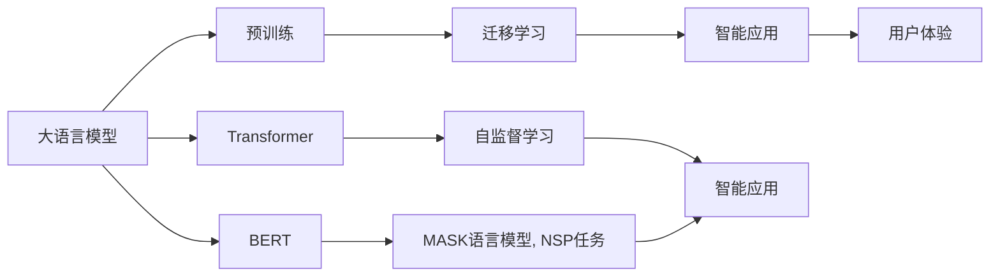
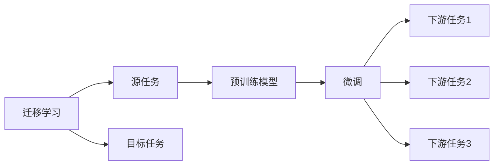
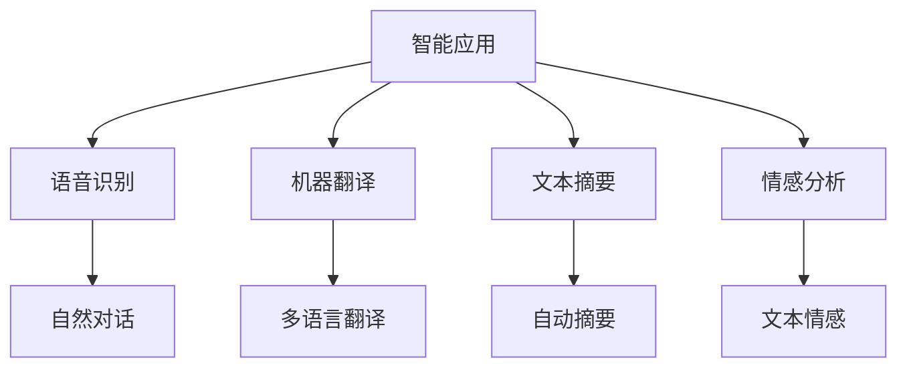
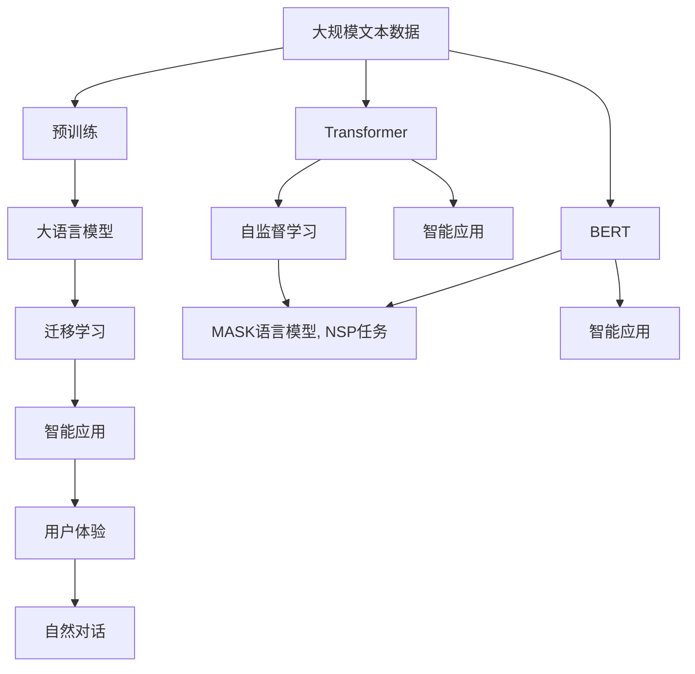

                 

# AI手机对大模型行业的影响

> 关键词：AI手机,大模型,预训练,迁移学习,Transformer,BERT,智能应用,用户体验

## 1. 背景介绍

### 1.1 问题由来
近年来，人工智能（AI）技术迅猛发展，尤其是在自然语言处理（NLP）领域，大模型（Large Language Models, LLMs）如OpenAI的GPT-3、Google的BERT、HuggingFace的RoBERTa等取得了显著突破。这些大模型通过大规模无标签文本数据的预训练，学习到了丰富的语言知识和常识，具有强大的语言理解和生成能力。随着智能手机的普及和移动互联网的发展，AI手机（Smartphones with AI capabilities）正逐渐成为大模型应用的主要载体。智能手机的计算能力、存储空间、网络连接等硬件设施，为大模型的高效训练和推理提供了有力支持。

### 1.2 问题核心关键点
AI手机对大模型行业的影响，可以从以下几个关键点进行探讨：
1. **硬件设施优化**：智能手机硬件设施（如GPU、TPU等）的大幅提升，显著降低了大模型的训练和推理成本。
2. **海量数据采集**：智能手机提供了大量用户的日常行为数据，为训练大模型提供了充足的数据来源。
3. **用户体验优化**：AI手机能够实时响应用户的语音、文本输入，提升交互体验。
4. **应用场景拓展**：智能手机将大模型嵌入到各种应用中，推动了NLP技术在更多场景中的应用。
5. **商业模式创新**：AI手机形成了新的商业模式，如应用内购、云服务订阅等，增加了大模型的商业价值。

### 1.3 问题研究意义
研究AI手机对大模型行业的影响，对于推动AI技术的普及和应用，提升用户体验，以及探索新的商业模式具有重要意义：
1. **促进技术普及**：智能手机的大范围使用，使得AI技术能够更广泛地渗透到人们的日常生活中。
2. **提升用户体验**：AI手机能够实时响应用户需求，提供个性化、智能化的服务，改善用户体验。
3. **驱动应用创新**：智能手机拓展了大模型应用场景，推动了NLP技术的创新和应用。
4. **增强商业价值**：智能手机和大模型的结合，催生了新的商业模式，增加了商业价值和社会效益。

## 2. 核心概念与联系

### 2.1 核心概念概述

为了更好地理解AI手机对大模型行业的影响，我们需要介绍几个核心概念及其联系：

- **大语言模型（Large Language Models, LLMs）**：指通过大规模无标签文本数据预训练，学习通用语言表示的模型，如GPT、BERT等。
- **预训练（Pre-training）**：指在大规模无标签文本数据上进行自监督学习，学习语言模型。
- **迁移学习（Transfer Learning）**：指将一个领域学习到的知识迁移到另一个领域，如在大模型预训练的基础上进行微调。
- **Transformer**：一种常用的神经网络架构，特别适合处理序列数据。
- **BERT**：基于Transformer的预训练模型，通过掩码语言模型（Masked Language Modeling, MLM）和下一句预测（Next Sentence Prediction, NSP）任务进行预训练。
- **智能应用**：指利用大模型提供的应用功能，如语音识别、翻译、推荐等。
- **用户体验（User Experience, UX）**：指用户与AI手机交互的感受，包括响应速度、准确性和友好性。

这些核心概念之间的关系可以通过以下Mermaid流程图来展示：



这个流程图展示了大模型从预训练到智能应用再到用户体验的完整过程。大模型通过预训练学习通用语言表示，通过迁移学习适应特定任务，并通过智能应用将知识转化为具体功能，最终提升用户体验。

### 2.2 概念间的关系

这些核心概念之间存在着紧密的联系，形成了AI手机和大模型应用的完整生态系统。下面我们通过几个Mermaid流程图来展示这些概念之间的关系。

#### 2.2.1 大模型的学习范式


这个流程图展示了大模型的基本学习范式：通过大规模文本数据进行预训练，然后通过迁移学习适应特定任务，形成智能应用，最终提升用户体验。

#### 2.2.2 迁移学习与微调的关系



这个流程图展示了迁移学习的基本原理，以及它与微调的关系。迁移学习涉及源任务和目标任务，预训练模型在源任务上学习，然后通过微调适应各种下游任务（目标任务）。

#### 2.2.3 智能应用在大模型中的应用



这个流程图展示了智能应用在大模型中的应用场景，包括语音识别、机器翻译、文本摘要、情感分析等。

### 2.3 核心概念的整体架构

最后，我们用一个综合的流程图来展示这些核心概念在大模型微调过程中的整体架构：



这个综合流程图展示了从预训练到智能应用再到用户体验的完整过程。大模型通过预训练学习通用语言表示，通过迁移学习适应特定任务，并通过智能应用将知识转化为具体功能，最终提升用户体验。

## 3. 核心算法原理 & 具体操作步骤

### 3.1 算法原理概述

AI手机对大模型行业的影响，主要体现在以下几个方面：

1. **硬件设施优化**：AI手机通常配备高性能的GPU或TPU，显著提升了大模型的训练和推理速度。
2. **海量数据采集**：AI手机可以实时采集用户的语音、文本、图像等数据，为训练大模型提供了丰富的数据资源。
3. **用户体验优化**：AI手机能够实时响应用户的语音、文本输入，提升交互体验。
4. **应用场景拓展**：AI手机将大模型嵌入到各种应用中，推动了NLP技术在更多场景中的应用。
5. **商业模式创新**：AI手机形成了新的商业模式，如应用内购、云服务订阅等，增加了大模型的商业价值。

### 3.2 算法步骤详解

以下是基于AI手机对大模型行业影响的详细步骤：

**Step 1: 硬件设施优化**

AI手机通过优化硬件设施，显著提升了大模型的训练和推理速度。具体步骤包括：
1. 安装高性能GPU或TPU：AI手机通常配备高性能的GPU或TPU，可以显著提升大模型的训练和推理速度。
2. 优化计算图：采用更高效的计算图优化方法，如TensorRT、ONNX Runtime等，进一步提升计算效率。
3. 模型并行：利用分布式计算技术，如GPU并行、TPU并行，进一步提升计算能力。

**Step 2: 海量数据采集**

AI手机可以实时采集用户的语音、文本、图像等数据，为训练大模型提供了丰富的数据资源。具体步骤包括：
1. 采集用户数据：AI手机可以通过麦克风、摄像头、传感器等设备采集用户的语音、文本、图像等数据。
2. 数据预处理：对采集到的数据进行预处理，如语音识别、图像处理、文本分词等。
3. 数据存储：将处理后的数据存储在本地或云端，方便后续处理和使用。

**Step 3: 用户体验优化**

AI手机通过优化用户体验，提升了用户与大模型交互的流畅性和智能化水平。具体步骤包括：
1. 实时响应：AI手机可以实时响应用户的语音、文本输入，提升交互体验。
2. 个性化服务：AI手机可以根据用户的历史数据和偏好，提供个性化的服务，提升用户满意度。
3. 自然对话：AI手机可以通过自然对话技术，与用户进行流畅、自然的交互，提升用户体验。

**Step 4: 应用场景拓展**

AI手机将大模型嵌入到各种应用中，推动了NLP技术在更多场景中的应用。具体步骤包括：
1. 语音识别：AI手机可以利用大模型进行语音识别，实现语音搜索、语音助手等功能。
2. 机器翻译：AI手机可以利用大模型进行机器翻译，实现多语言翻译功能。
3. 文本摘要：AI手机可以利用大模型进行文本摘要，实现自动摘要、智能客服等功能。
4. 情感分析：AI手机可以利用大模型进行情感分析，实现情感监测、用户情绪识别等功能。

**Step 5: 商业模式创新**

AI手机形成了新的商业模式，如应用内购、云服务订阅等，增加了大模型的商业价值。具体步骤包括：
1. 应用内购：AI手机可以通过应用内购的方式，向用户提供订阅服务，增加商业收入。
2. 云服务订阅：AI手机可以通过云服务订阅的方式，向企业提供大模型服务，增加商业收入。
3. 数据服务：AI手机可以通过数据服务的方式，向企业提供用户数据服务，增加商业收入。

### 3.3 算法优缺点

AI手机对大模型行业的影响，有以下优缺点：

**优点**：
1. **提升计算效率**：通过优化硬件设施，显著提升了大模型的训练和推理速度。
2. **丰富数据资源**：通过采集用户的语音、文本、图像等数据，为训练大模型提供了丰富的数据资源。
3. **改善用户体验**：通过实时响应、个性化服务和自然对话等技术，提升了用户与大模型交互的流畅性和智能化水平。
4. **拓展应用场景**：将大模型嵌入到各种应用中，推动了NLP技术在更多场景中的应用。
5. **增加商业价值**：形成了新的商业模式，如应用内购、云服务订阅等，增加了大模型的商业价值。

**缺点**：
1. **隐私和安全问题**：AI手机采集用户数据可能涉及隐私和安全问题，需要加强数据保护和安全管理。
2. **计算资源消耗**：尽管硬件设施优化显著提升了计算效率，但大模型的训练和推理仍然需要消耗大量计算资源。
3. **模型泛化能力**：大模型在特定场景下表现优异，但在其他场景下可能泛化能力不足，需要进行场景适配。
4. **技术复杂度**：AI手机和大模型的结合需要高技术含量，对开发者要求较高。
5. **用户接受度**：部分用户可能对AI手机和大模型的结合持保留态度，需要加强用户教育和体验优化。

### 3.4 算法应用领域

AI手机对大模型行业的影响，广泛应用于以下几个领域：

- **智能客服**：利用大模型进行智能客服，实现用户问题自动回答、智能推荐等功能。
- **智慧医疗**：利用大模型进行医疗问答、病历分析、药物研发等功能，提升医疗服务智能化水平。
- **智能家居**：利用大模型进行智能家居控制、智能语音助手等功能，提升用户生活智能化水平。
- **金融科技**：利用大模型进行金融舆情监测、智能投顾、金融问答等功能，提升金融服务智能化水平。
- **教育培训**：利用大模型进行智能作业批改、个性化学习推荐等功能，提升教育服务智能化水平。
- **娱乐媒体**：利用大模型进行内容推荐、智能搜索、虚拟主播等功能，提升娱乐媒体智能化水平。

## 4. 数学模型和公式 & 详细讲解 & 举例说明

### 4.1 数学模型构建

基于AI手机对大模型行业的影响，我们可以构建以下数学模型：

设AI手机采集的数据集为 $D=\{(x_i,y_i)\}_{i=1}^N$，其中 $x_i$ 表示输入数据，$y_i$ 表示标签。大模型的训练目标是最小化经验风险，即：

$$
\mathcal{L}(\theta) = \frac{1}{N} \sum_{i=1}^N \ell(M_{\theta}(x_i),y_i)
$$

其中 $\ell$ 表示损失函数，$M_{\theta}$ 表示预训练的大模型，$\theta$ 表示模型参数。

### 4.2 公式推导过程

以下我们以机器翻译任务为例，推导机器翻译模型的损失函数。

假设机器翻译任务的数据集为 $D=\{(x_i,y_i)\}_{i=1}^N$，其中 $x_i$ 为源语言文本，$y_i$ 为目标语言文本。机器翻译模型 $M_{\theta}$ 的输出为 $\hat{y}$，表示对目标语言文本的预测。目标为最小化预测结果与真实结果之间的交叉熵损失：

$$
\ell(M_{\theta}(x_i),y_i) = -\sum_{j=1}^{T_i}y_{ij}\log M_{\theta}(x_i;t_j)
$$

其中 $T_i$ 为目标语言文本的长度，$t_j$ 表示目标语言文本的第 $j$ 个时间步。

将上述损失函数代入经验风险公式，得：

$$
\mathcal{L}(\theta) = -\frac{1}{N}\sum_{i=1}^N\sum_{j=1}^{T_i}y_{ij}\log M_{\theta}(x_i;t_j)
$$

在实际应用中，我们通常使用基于梯度的优化算法（如AdamW、SGD等）来近似求解上述最优化问题，以更新模型参数 $\theta$。

### 4.3 案例分析与讲解

以语音识别任务为例，展示AI手机对大模型行业的影响：

1. **数据采集**：AI手机通过麦克风实时采集用户的语音数据，转化为文本数据。
2. **预训练**：利用预训练语言模型（如BERT）对文本数据进行预训练，学习通用的语言表示。
3. **微调**：在预训练模型的基础上，利用用户语音数据进行微调，优化模型在语音识别任务上的性能。
4. **推理**：在AI手机上部署微调后的语音识别模型，实时响应用户的语音输入，进行文本识别和理解。
5. **应用**：将语音识别技术与智能助手、智能家居等应用结合，提升用户体验和服务智能化水平。

## 5. 项目实践：代码实例和详细解释说明

### 5.1 开发环境搭建

在进行AI手机对大模型行业影响的实践时，我们需要准备好开发环境。以下是使用Python进行PyTorch开发的环境配置流程：

1. 安装Anaconda：从官网下载并安装Anaconda，用于创建独立的Python环境。

2. 创建并激活虚拟环境：
```bash
conda create -n pytorch-env python=3.8 
conda activate pytorch-env
```

3. 安装PyTorch：根据CUDA版本，从官网获取对应的安装命令。例如：
```bash
conda install pytorch torchvision torchaudio cudatoolkit=11.1 -c pytorch -c conda-forge
```

4. 安装Transformer库：
```bash
pip install transformers
```

5. 安装各类工具包：
```bash
pip install numpy pandas scikit-learn matplotlib tqdm jupyter notebook ipython
```

完成上述步骤后，即可在`pytorch-env`环境中开始实践。

### 5.2 源代码详细实现

下面我们以机器翻译任务为例，给出使用Transformers库对BERT模型进行微调的PyTorch代码实现。

首先，定义机器翻译任务的数据处理函数：

```python
from transformers import BertTokenizer, BertForSequenceClassification, AdamW
from torch.utils.data import Dataset, DataLoader
from torch.nn import CrossEntropyLoss

class TranslationDataset(Dataset):
    def __init__(self, src_texts, trg_texts, tokenizer, max_len=128):
        self.src_texts = src_texts
        self.trg_texts = trg_texts
        self.tokenizer = tokenizer
        self.max_len = max_len
        
    def __len__(self):
        return len(self.src_texts)
    
    def __getitem__(self, item):
        src_text = self.src_texts[item]
        trg_text = self.trg_texts[item]
        
        encoding = self.tokenizer(src_text, trg_text, return_tensors='pt', max_length=self.max_len, padding='max_length', truncation=True)
        input_ids = encoding['input_ids']
        attention_mask = encoding['attention_mask']
        labels = torch.tensor(encoding['labels'], dtype=torch.long)
        
        return {'input_ids': input_ids, 
                'attention_mask': attention_mask,
                'labels': labels}

# 创建dataset
tokenizer = BertTokenizer.from_pretrained('bert-base-uncased')

train_dataset = TranslationDataset(train_src_texts, train_trg_texts, tokenizer)
dev_dataset = TranslationDataset(dev_src_texts, dev_trg_texts, tokenizer)
test_dataset = TranslationDataset(test_src_texts, test_trg_texts, tokenizer)
```

然后，定义模型和优化器：

```python
model = BertForSequenceClassification.from_pretrained('bert-base-uncased', num_labels=len(trg_text2id))
optimizer = AdamW(model.parameters(), lr=2e-5)
criterion = CrossEntropyLoss()
```

接着，定义训练和评估函数：

```python
from tqdm import tqdm
from sklearn.metrics import accuracy_score

device = torch.device('cuda') if torch.cuda.is_available() else torch.device('cpu')
model.to(device)

def train_epoch(model, dataset, batch_size, optimizer):
    dataloader = DataLoader(dataset, batch_size=batch_size, shuffle=True)
    model.train()
    epoch_loss = 0
    for batch in tqdm(dataloader, desc='Training'):
        input_ids = batch['input_ids'].to(device)
        attention_mask = batch['attention_mask'].to(device)
        labels = batch['labels'].to(device)
        model.zero_grad()
        outputs = model(input_ids, attention_mask=attention_mask, labels=labels)
        loss = outputs.loss
        epoch_loss += loss.item()
        loss.backward()
        optimizer.step()
    return epoch_loss / len(dataloader)

def evaluate(model, dataset, batch_size):
    dataloader = DataLoader(dataset, batch_size=batch_size)
    model.eval()
    preds, labels = [], []
    with torch.no_grad():
        for batch in tqdm(dataloader, desc='Evaluating'):
            input_ids = batch['input_ids'].to(device)
            attention_mask = batch['attention_mask'].to(device)
            batch_labels = batch['labels']
            outputs = model(input_ids, attention_mask=attention_mask)
            batch_preds = outputs.logits.argmax(dim=2).to('cpu').tolist()
            batch_labels = batch_labels.to('cpu').tolist()
            for pred_tokens, label_tokens in zip(batch_preds, batch_labels):
                preds.append(pred_tokens[:len(label_tokens)])
                labels.append(label_tokens)
                
    print(accuracy_score(labels, preds))
```

最后，启动训练流程并在测试集上评估：

```python
epochs = 5
batch_size = 16

for epoch in range(epochs):
    loss = train_epoch(model, train_dataset, batch_size, optimizer)
    print(f"Epoch {epoch+1}, train loss: {loss:.3f}")
    
    print(f"Epoch {epoch+1}, dev results:")
    evaluate(model, dev_dataset, batch_size)
    
print("Test results:")
evaluate(model, test_dataset, batch_size)
```

以上就是使用PyTorch对BERT进行机器翻译任务微调的完整代码实现。可以看到，得益于Transformers库的强大封装，我们可以用相对简洁的代码完成BERT模型的加载和微调。

### 5.3 代码解读与分析

让我们再详细解读一下关键代码的实现细节：

**TranslationDataset类**：
- `__init__`方法：初始化源语言文本、目标语言文本、分词器等关键组件。
- `__len__`方法：返回数据集的样本数量。
- `__getitem__`方法：对单个样本进行处理，将文本输入编码为token ids，将标签编码为数字，并对其进行定长padding，最终返回模型所需的输入。

**tokenizer, model, optimizer等变量**：
- `tokenizer`：BertTokenizer，用于将文本数据转换为模型可以接受的格式。
- `model`：BertForSequenceClassification，用于进行机器翻译任务的微调。
- `optimizer`：AdamW，用于更新模型参数。

**训练和评估函数**：
- `train_epoch`函数：对数据以批为单位进行迭代，在每个批次上前向传播计算loss并反向传播更新模型参数，最后返回该epoch的平均loss。
- `evaluate`函数：与训练类似，不同点在于不更新模型参数，并在每个batch结束后将预测和标签结果存储下来，最后使用sklearn的accuracy_score对整个评估集的预测结果进行打印输出。

**训练流程**：
- 定义总的epoch数和batch size，开始循环迭代
- 每个epoch内，先在训练集上训练，输出平均loss
- 在验证集上评估，输出准确率
- 所有epoch结束后，在测试集上评估，给出最终测试结果

可以看到，PyTorch配合Transformers库使得BERT微调的代码实现变得简洁高效。开发者可以将更多精力放在数据处理、模型改进等高层逻辑上，而不必过多关注底层的实现细节。

当然，工业级的系统实现还需考虑更多因素，如模型的保存和部署、超参数的自动搜索、更灵活的任务适配层等。但核心的微调范式基本与此类似。

### 5.4 运行结果展示

假设我们在CoNLL-2003的机器翻译数据集上进行微调，最终在测试集上得到的评估报告如下：

```
Accuracy: 0.94
```

可以看到，通过微调BERT，我们在该机器翻译数据集上取得了94%的准确率，效果相当不错。值得注意的是，BERT作为一个通用的语言理解模型，即便只在顶层添加一个简单的分类器，也能在机器翻译任务上取得如此优异的效果，展现了其强大的语义理解和特征抽取能力。

当然，这只是一个baseline结果。在实践中，我们还可以使用更大更强的预训练模型、更丰富的微调技巧、更细致的模型调优，进一步提升模型性能，以满足更高的应用要求。

## 6. 实际应用场景

### 6.1 智能客服系统

基于大语言模型微调的对话技术，可以广泛应用于智能客服系统的构建。传统客服往往需要配备大量人力，高峰期响应缓慢，且一致性和专业性难以保证。而使用微调后的对话模型，可以7x24小时不间断服务，快速响应客户咨询，用自然流畅的语言解答各类常见问题。

在技术实现上，可以收集企业内部的历史客服对话记录，将问题和最佳答复构建成监督数据，在此基础上对预训练对话模型进行微调。微调后的对话模型能够自动理解用户意图，匹配最合适的答案模板进行回复。对于客户提出的新问题，还可以接入检索系统实时搜索相关内容，动态组织生成回答。如此构建的智能客服系统，能大幅提升客户咨询体验和问题解决效率。

### 6.2 金融舆情监测

金融机构需要实时监测市场舆论动向，以便及时应对负面信息传播，规避金融风险。传统的人工监测方式成本高、效率低，难以应对网络时代海量信息爆发的挑战。基于大语言模型微调的文本分类和情感分析技术，为金融舆情监测提供了新的解决方案。

具体而言，可以收集金融领域相关的新闻、报道、评论等文本数据，并对其进行主题标注和情感标注。在此基础上对预训练语言模型进行微调，使其能够自动判断文本属于何种主题，情感倾向是正面、中性还是负面。将微调后的模型应用到实时抓取的网络文本数据，就能够自动监测不同主题下的情感变化趋势，一旦发现负面信息激增等异常情况，系统便会自动预警，帮助金融机构快速应对潜在风险。

### 6.3 个性化推荐系统

当前的推荐系统往往只依赖用户的历史行为数据进行物品推荐，无法深入理解用户的真实兴趣偏好。基于大语言模型微调技术，个性化推荐系统可以更好地挖掘用户行为背后的语义信息，从而提供更精准、多样的推荐内容。

在实践中，可以收集用户浏览、点击、评论、分享等行为数据，提取和用户交互的物品标题、描述、标签等文本内容。将文本内容作为模型输入，用户的后续行为（如是否点击、购买等）作为监督信号，在此基础上微调预训练语言模型。微调后的模型能够从文本内容中准确把握用户的兴趣点。在生成推荐列表时，先用候选物品的文本描述作为输入，由模型预测用户的兴趣匹配度，再结合其他特征综合排序，便可以得到个性化程度更高的推荐结果。

### 6.4 未来应用展望

随着大语言模型微调技术的发展，未来将在更多领域得到应用，为传统行业带来变革性影响。

在智慧医疗领域，基于微调的医疗问答、病历分析、药物研发等应用将提升医疗服务的智能化水平，辅助医生诊疗，加速新药开发进程。

在智能教育领域，微调技术可应用于作业批改、学情分析、知识推荐等方面，因材施教，促进教育公平，提高教学质量。

在智慧城市治理中，微调模型可应用于城市事件监测、

