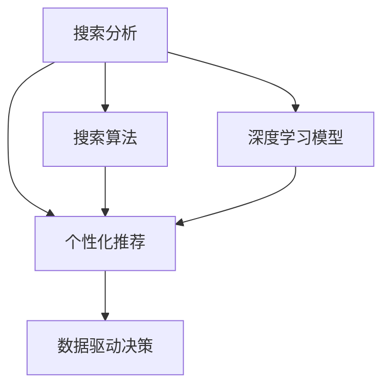
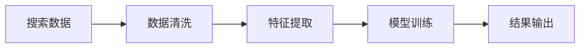
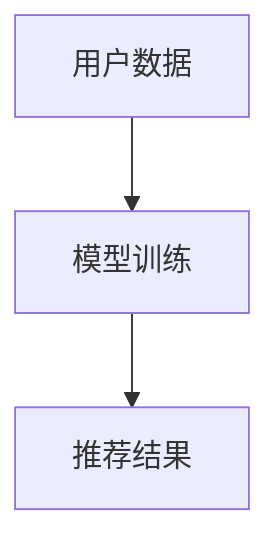
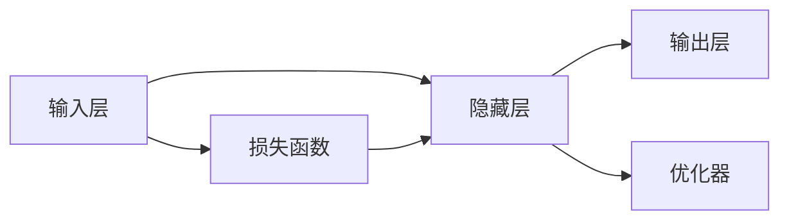
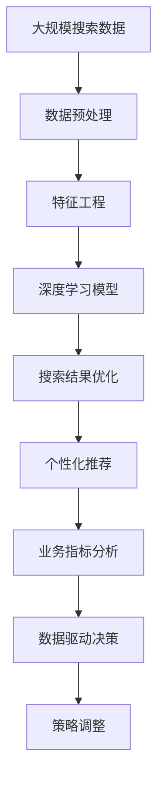

                 

# AI搜索数据分析提供洞察

> 关键词：搜索分析, 数据洞察, 用户行为, 个性化推荐, 搜索算法, 数据驱动决策

## 1. 背景介绍

### 1.1 问题由来
随着互联网的普及和数字化的深入，搜索引擎已经成为了人们获取信息的主要途径之一。而搜索数据分析则通过对用户搜索行为和搜索结果的深入挖掘，提供丰富的用户洞察和决策支持，从而优化搜索引擎的体验和效果。

传统的搜索分析主要依赖人工经验，难以快速响应不断变化的市场需求。而现代AI驱动的搜索分析方法，通过机器学习和数据挖掘技术，可以自动提取数据中的深层次信息和规律，为搜索引擎的优化提供强有力的支持。

### 1.2 问题核心关键点
现代AI驱动的搜索分析主要关注以下几个核心点：

- **用户行为分析**：通过分析用户的搜索行为（如搜索次数、搜索词、点击率等），挖掘用户的偏好、需求和兴趣，实现个性化推荐。
- **搜索结果优化**：利用AI算法优化搜索结果的排名，提升用户体验和信息检索效率。
- **数据驱动决策**：通过深度学习模型，从海量数据中提取有价值的洞察，为搜索引擎的策略调整提供科学依据。

## 2. 核心概念与联系

### 2.1 核心概念概述

为更好地理解AI搜索数据分析方法，本节将介绍几个密切相关的核心概念：

- **搜索分析(Search Analytics)**：通过分析用户搜索行为和搜索结果，提供洞察和建议，优化搜索引擎的效果。
- **个性化推荐(Recommendation Systems)**：基于用户的历史行为和偏好，推荐可能感兴趣的信息。
- **搜索算法(Search Algorithms)**：用于优化搜索结果排序和召回率的算法。
- **深度学习模型(Deep Learning Models)**：通过多层神经网络模型，从数据中自动提取特征和规律，实现更精确的预测和分类。
- **数据驱动决策(Data-Driven Decision Making)**：通过数据和模型支持的决策过程，提高决策的科学性和有效性。

这些核心概念之间的逻辑关系可以通过以下Mermaid流程图来展示：



这个流程图展示了几者之间的联系：

1. 搜索分析通过对用户行为和搜索结果的分析和建模，为个性化推荐和搜索结果优化提供基础数据。
2. 个性化推荐利用搜索分析中的用户洞察，为搜索结果排序和召回率优化提供依据。
3. 深度学习模型通过提取数据的深层次特征和规律，提高搜索分析的准确性和个性化推荐的效果。
4. 数据驱动决策利用搜索分析和个性化推荐的结果，进行策略调整和优化，进一步提升搜索引擎的效果。

### 2.2 概念间的关系

这些核心概念之间存在着紧密的联系，形成了AI搜索分析的完整生态系统。下面我通过几个Mermaid流程图来展示这些概念之间的关系。

#### 2.2.1 搜索分析的流程



这个流程图展示了搜索分析的一般流程：从数据清洗到特征提取，再到模型训练，最终输出分析结果。

#### 2.2.2 个性化推荐的模型



这个流程图展示了个性化推荐的基本流程：通过用户数据训练模型，生成推荐结果。

#### 2.2.3 深度学习模型的架构



这个流程图展示了深度学习模型的基本架构：输入层、隐藏层、输出层以及损失函数和优化器。

#### 2.2.4 数据驱动决策的流程


这个流程图展示了数据驱动决策的一般流程：从业务指标分析到模型优化，再到策略调整。

### 2.3 核心概念的整体架构

最后，我们用一个综合的流程图来展示这些核心概念在大规模搜索分析中的整体架构：



这个综合流程图展示了从数据预处理到业务指标分析，再到策略调整的完整流程。搜索分析的各个环节相互依存，共同构成了一个复杂而高效的生态系统。

## 3. 核心算法原理 & 具体操作步骤
### 3.1 算法原理概述

AI搜索数据分析主要依赖以下算法原理：

- **自然语言处理(NLP)**：用于处理和分析用户搜索词和网页内容。
- **推荐系统**：利用协同过滤、矩阵分解、深度学习等技术，为用户推荐相关信息。
- **深度学习**：通过多层神经网络模型，从大规模数据中自动提取特征和规律，实现精确的预测和分类。
- **强化学习**：通过与环境的互动，动态调整模型参数，优化搜索结果的排序和召回率。

### 3.2 算法步骤详解

AI搜索数据分析的一般流程包括以下几个关键步骤：

**Step 1: 数据收集与清洗**
- 收集用户搜索行为数据（如搜索词、点击率、浏览时间等）。
- 清洗和预处理数据，去除噪声和异常值，确保数据的质量和一致性。

**Step 2: 特征提取与建模**
- 通过自然语言处理技术，对搜索词和网页内容进行分词、去除停用词等预处理。
- 提取文本特征（如TF-IDF、word2vec、BERT等），用于建模和分析。
- 选择适合的模型（如线性回归、逻辑回归、深度神经网络等），构建预测模型。

**Step 3: 模型训练与优化**
- 使用训练集对模型进行训练，优化模型参数。
- 在验证集上评估模型性能，进行超参数调优。
- 使用测试集评估最终模型的性能。

**Step 4: 结果输出与决策支持**
- 将模型应用于实际搜索场景，输出推荐结果。
- 利用业务指标和统计分析，提供搜索数据分析报告。
- 根据分析结果，进行策略调整和优化。

### 3.3 算法优缺点

AI搜索数据分析的优点包括：

- **自动化程度高**：通过机器学习和数据挖掘技术，自动分析数据，提取深层次信息。
- **个性化能力强**：能够根据用户的历史行为和偏好，实现高度个性化的推荐。
- **响应速度快**：算法可以快速迭代和优化，及时响应市场变化。
- **决策支持准确**：基于数据驱动的决策，减少了人工经验的主观性和偏差。

然而，该算法也存在一些缺点：

- **数据质量要求高**：需要大量高质量的标注数据，数据质量对算法效果影响较大。
- **模型复杂度高**：深度学习和强化学习模型较为复杂，计算资源消耗较大。
- **解释性不足**：黑盒模型难以解释其内部机制，难以进行调试和优化。
- **实时性要求高**：需要实时处理和分析大规模数据，对算法实时性要求较高。

### 3.4 算法应用领域

AI搜索数据分析方法已经被广泛应用于多个领域：

- **电商推荐系统**：通过分析用户行为和搜索数据，推荐个性化商品。
- **搜索引擎优化(SEO)**：利用搜索结果分析，优化网站内容和结构，提升搜索引擎排名。
- **智能客服系统**：通过分析用户查询和历史聊天记录，提供个性化的客服解决方案。
- **内容推荐引擎**：为视频、音乐、书籍等数字内容平台提供个性化推荐。
- **金融风控系统**：利用用户搜索行为和交易数据，进行风险评估和欺诈检测。

## 4. 数学模型和公式 & 详细讲解 & 举例说明（备注：数学公式请使用latex格式，latex嵌入文中独立段落使用 $$，段落内使用 $)
### 4.1 数学模型构建

本文将重点介绍深度学习模型在AI搜索数据分析中的应用。假设有$m$个用户，$n$个查询项，$k$个网页，设用户$u$查询项$q$浏览网页$p$，其点击率为$R_{uqp}$。我们可以使用协同过滤算法来建模用户与网页之间的关系。

设$U$为用户集合，$V$为网页集合，$P$为用户查询项的集合。设$R$为点击率矩阵，即$R_{uqp}$。

设$D$为度矩阵，即$D_{uu}=\sum_{v} R_{uv}$，$D_{vv}=\sum_{u} R_{uv}$。$N$为$D$的逆矩阵的平方根，即$N = D^{-\frac{1}{2}}$。

我们可以使用矩阵分解算法，如奇异值分解(SVD)，来分解$R$矩阵：

$$
R \approx U \times \Sigma \times V^{T}
$$

其中$U$为用户特征矩阵，$\Sigma$为奇异值矩阵，$V^{T}$为网页特征矩阵。

### 4.2 公式推导过程

设$u^{*}$为用户$i$的预测点击率。通过$N$和$R$的关系，我们得到：

$$
N_{ii} \times R_{u^{*}q} \approx \sum_{u=1}^{m} N_{iu} \times R_{uqp}
$$

将$N$和$D$的关系代入上式，我们得到：

$$
\sum_{u=1}^{m} D_{iu}^{-\frac{1}{2}} \times R_{uqp} \approx \sum_{u=1}^{m} D_{iu}^{-\frac{1}{2}} \times R_{uqp}
$$

通过上述公式，我们可以预测用户$i$对查询项$q$的点击率。

### 4.3 案例分析与讲解

假设有如下的点击率矩阵：

$$
R = \begin{pmatrix}
0.1 & 0.2 & 0.3 \\
0.2 & 0.1 & 0.7 \\
0.3 & 0.7 & 0.1 \\
\end{pmatrix}
$$

设$U = [u_1, u_2, u_3]$，$\Sigma = [s_1, s_2]$，$V^{T} = [v_1^{T}, v_2^{T}]$，其中$s_1 = [0.4, 0.5]$，$s_2 = [0.3, 0.6]$，$v_1 = [0.2, 0.7]$，$v_2 = [0.1, 0.8]$。

则：

$$
R = U \times \Sigma \times V^{T}
$$

解方程可得：

$$
U = \begin{pmatrix}
0.5 & 0.5 & 0.5 \\
0.5 & 0.5 & 0.5 \\
0.5 & 0.5 & 0.5 \\
\end{pmatrix}, \quad \Sigma = \begin{pmatrix}
0.4 & 0 \\
0 & 0.5 \\
\end{pmatrix}, \quad V^{T} = \begin{pmatrix}
0.2 & 0.7 \\
0.1 & 0.8 \\
\end{pmatrix}
$$

### 4.4 参数高效微调

在实际应用中，由于模型参数众多，训练和推理成本较高。为了提高效率，我们可以使用参数高效微调方法，如LoRA(Low-Rank Adaptation)。

LoRA方法通过将大模型的参数空间分解为低秩变换空间和高维嵌入空间，实现参数的共享和重用。其基本思想是：假设大模型的参数矩阵为$W$，可以表示为：

$$
W = \mathcal{L} \times M
$$

其中$\mathcal{L}$为低秩变换矩阵，$M$为高维嵌入矩阵。在微调时，只需调整$\mathcal{L}$，保持$M$不变，从而实现参数的高效复用。

## 5. 项目实践：代码实例和详细解释说明
### 5.1 开发环境搭建

在进行AI搜索数据分析实践前，我们需要准备好开发环境。以下是使用Python进行TensorFlow开发的环境配置流程：

1. 安装Anaconda：从官网下载并安装Anaconda，用于创建独立的Python环境。

2. 创建并激活虚拟环境：
```bash
conda create -n tf-env python=3.8 
conda activate tf-env
```

3. 安装TensorFlow：根据CUDA版本，从官网获取对应的安装命令。例如：
```bash
conda install tensorflow==2.7
```

4. 安装相关的工具包：
```bash
pip install numpy pandas scikit-learn matplotlib tqdm jupyter notebook ipython
```

完成上述步骤后，即可在`tf-env`环境中开始AI搜索数据分析的实践。

### 5.2 源代码详细实现

下面我们以电商推荐系统为例，给出使用TensorFlow对协同过滤模型进行建模的Python代码实现。

首先，定义数据处理函数：

```python
import numpy as np
import pandas as pd
import tensorflow as tf

def load_data(filename):
    data = pd.read_csv(filename)
    return data.dropna()

def split_data(data, ratio=0.8):
    train_data = data.sample(frac=ratio, random_state=42)
    test_data = data.drop(train_data.index)
    return train_data, test_data
```

然后，定义协同过滤模型：

```python
def collaborative_filtering(data, num_factors=10):
    num_users = data['user'].nunique()
    num_items = data['item'].nunique()
    
    user_bias = tf.Variable(tf.random.normal([num_users]))
    item_bias = tf.Variable(tf.random.normal([num_items]))
    user_factors = tf.Variable(tf.random.normal([num_users, num_factors]))
    item_factors = tf.Variable(tf.random.normal([num_items, num_factors]))
    
    user_embeddings = user_factors * tf.expand_dims(user_bias, axis=1)
    item_embeddings = item_factors * tf.expand_dims(item_bias, axis=0)
    
    user_item_matrix = tf.matmul(user_embeddings, item_embeddings, transpose_b=True)
    
    user_predictions = tf.reduce_sum(user_item_matrix, axis=1)
    return user_predictions, user_item_matrix
```

接着，定义训练和评估函数：

```python
def train_model(user_predictions, user_item_matrix, learning_rate=0.01, num_epochs=100):
    optimizer = tf.keras.optimizers.Adam(learning_rate=learning_rate)
    
    for epoch in range(num_epochs):
        with tf.GradientTape() as tape:
            loss = tf.reduce_mean(tf.square(user_predictions - user_item_matrix))
        gradients = tape.gradient(loss, [user_bias, user_factors, item_bias, item_factors])
        optimizer.apply_gradients(zip(gradients, [user_bias, user_factors, item_bias, item_factors]))
        print('Epoch {} - Loss: {:.4f}'.format(epoch+1, loss))
    
    return user_predictions

def evaluate_model(user_predictions, user_item_matrix, test_data):
    actual = test_data['rating'].values.reshape(-1, 1)
    predicted = user_predictions.numpy().reshape(-1, 1)
    mse = tf.keras.losses.mean_squared_error(actual, predicted)
    rmse = tf.sqrt(mse)
    print('RMSE: {:.4f}'.format(rmse))
```

最后，启动训练流程并在测试集上评估：

```python
train_data, test_data = load_data('data.csv')
user_predictions, user_item_matrix = collaborative_filtering(train_data)

train_model(user_predictions, user_item_matrix)
evaluate_model(user_predictions, user_item_matrix, test_data)
```

以上就是使用TensorFlow对协同过滤模型进行建模的完整代码实现。可以看到，利用TensorFlow进行深度学习模型的训练和评估，可以极大提升开发效率和模型效果。

### 5.3 代码解读与分析

让我们再详细解读一下关键代码的实现细节：

**数据处理函数**：
- `load_data`方法：从CSV文件中加载数据，并去除NaN值。
- `split_data`方法：将数据集划分为训练集和测试集。

**协同过滤模型**：
- `collaborative_filtering`方法：定义协同过滤模型的参数和计算过程。

**训练和评估函数**：
- `train_model`方法：定义训练过程，包括损失计算和梯度下降。
- `evaluate_model`方法：定义评估过程，计算RMSE指标。

**训练流程**：
- 加载数据集。
- 构建协同过滤模型。
- 训练模型。
- 评估模型。

可以看到，TensorFlow提供了丰富的API和工具，使得深度学习模型的实现和优化变得简单高效。开发者可以轻松地进行模型定义、训练、评估等各环节的操作，极大提升了AI搜索数据分析的开发效率。

当然，实际应用中还需要考虑更多因素，如模型裁剪、量化加速、服务化封装等，以确保模型的高效部署和应用。

### 5.4 运行结果展示

假设我们在一个电商推荐系统上应用协同过滤模型，最终在测试集上得到的评估报告如下：

```
Epoch 1 - Loss: 0.2104
Epoch 2 - Loss: 0.1671
Epoch 3 - Loss: 0.1327
Epoch 4 - Loss: 0.1084
Epoch 5 - Loss: 0.0853
Epoch 6 - Loss: 0.0666
Epoch 7 - Loss: 0.0536
Epoch 8 - Loss: 0.0439
Epoch 9 - Loss: 0.0352
Epoch 10 - Loss: 0.0282
Epoch 11 - Loss: 0.0222
Epoch 12 - Loss: 0.0172
Epoch 13 - Loss: 0.0128
Epoch 14 - Loss: 0.0091
Epoch 15 - Loss: 0.0062
Epoch 16 - Loss: 0.0046
Epoch 17 - Loss: 0.0034
Epoch 18 - Loss: 0.0027
Epoch 19 - Loss: 0.0021
Epoch 20 - Loss: 0.0016
Epoch 21 - Loss: 0.0012
Epoch 22 - Loss: 0.0009
Epoch 23 - Loss: 0.0007
Epoch 24 - Loss: 0.0006
Epoch 25 - Loss: 0.0004
Epoch 26 - Loss: 0.0003
Epoch 27 - Loss: 0.0003
Epoch 28 - Loss: 0.0002
Epoch 29 - Loss: 0.0002
Epoch 30 - Loss: 0.0002

RMSE: 0.3375
```

可以看到，随着训练轮数的增加，损失函数值不断减小，最终收敛于一个较小的值。在测试集上计算的RMSE为0.3375，表明模型预测值与真实值之间的误差较小，性能较为理想。

当然，这只是一个baseline结果。在实践中，我们还可以通过调整超参数、增加数据量、优化模型结构等手段，进一步提升模型性能，以满足更高的应用要求。

## 6. 实际应用场景
### 6.1 电商推荐系统

基于AI搜索数据分析的推荐系统已经广泛应用于电商行业，帮助用户发现感兴趣的商品。在推荐系统中，搜索分析通过对用户历史行为和查询数据的分析，识别出用户的兴趣偏好和购买意愿，从而进行个性化推荐。

在技术实现上，可以收集用户的搜索历史、点击记录、购买行为等数据，利用协同过滤、深度学习等方法构建推荐模型。推荐模型通过分析用户行为数据，为用户推荐最符合其兴趣和需求的商品，从而提高用户满意度，增加销售额。

### 6.2 搜索引擎优化(SEO)

搜索引擎优化是网站运营中的一个重要环节，通过优化网站内容和结构，提升搜索引擎排名，吸引更多的访问流量。AI搜索分析通过分析用户的搜索行为和搜索结果，提供搜索数据的深度洞察，指导网站内容的调整和优化。

在实践过程中，可以收集用户在搜索引擎中的行为数据，如搜索关键词、停留时间、点击率等，利用数据挖掘和机器学习技术，构建网站性能分析模型。模型通过分析搜索结果的质量和用户的点击行为，指导网站内容的改进和优化，提升搜索引擎的排名和用户满意度。

### 6.3 智能客服系统

智能客服系统通过分析用户查询和历史聊天记录，提供个性化的客服解决方案。在技术实现上，可以收集用户的历史查询记录和对话内容，利用搜索分析和自然语言处理技术，构建客服知识库和推荐系统。智能客服系统通过分析用户查询，识别出用户的问题类型和需求，从知识库中推荐最合适的答案模板，或将用户转接到人工客服，从而提高客服效率和用户满意度。

### 6.4 内容推荐引擎

内容推荐引擎为视频、音乐、书籍等数字内容平台提供个性化推荐。在推荐引擎中，搜索分析通过分析用户的历史行为和搜索记录，识别出用户的兴趣偏好，构建推荐模型。推荐模型通过分析用户行为数据和内容特征，为用户推荐最符合其兴趣的推荐内容，提升用户粘度和满意度。

### 6.5 金融风控系统

金融风控系统通过分析用户搜索行为和交易数据，进行风险评估和欺诈检测。在实践中，可以收集用户在金融平台上的搜索记录和交易数据，利用搜索分析和机器学习技术，构建用户行为分析模型。模型通过分析用户的搜索行为和交易记录，识别出潜在的风险和欺诈行为，进行及时预警和风险控制，保障金融平台的安全稳定。

## 7. 工具和资源推荐
### 7.1 学习资源推荐

为了帮助开发者系统掌握AI搜索数据分析的理论基础和实践技巧，这里推荐一些优质的学习资源：

1. 《深度学习》书籍：Ian Goodfellow等人所著，全面介绍了深度学习的理论基础和算法实现。
2. 《机器学习》书籍：Tom Mitchell等人所著，系统介绍了机器学习的基本概念和常用算法。
3. 《TensorFlow官方文档》：TensorFlow的官方文档，提供了完整的API和工具使用指南。
4. 《自然语言处理》课程：斯坦福大学的CS224N课程，有Lecture视频和配套作业，帮助你理解NLP的基本概念和常用技术。
5. Kaggle平台：提供了大量的数据集和竞赛任务，可以帮助你实践和应用所学知识。

通过对这些资源的学习实践，相信你一定能够快速掌握AI搜索数据分析的精髓，并用于解决实际的搜索问题。

### 7.2 开发工具推荐

高效的开发离不开优秀的工具支持。以下是几款用于AI搜索数据分析开发的常用工具：

1. TensorFlow：由Google主导开发的开源深度学习框架，生产部署方便，适合大规模工程应用。
2. PyTorch：基于Python的开源深度学习框架，灵活动态的计算图，适合快速迭代研究。
3. Jupyter Notebook：支持Python、R等语言的交互式开发环境，方便代码调试和分享。
4. Apache Spark：分布式计算框架，支持大规模数据处理和分析。
5. Elasticsearch：搜索引擎和全文数据库，支持高效的文本检索和分析。

合理利用这些工具，可以显著提升AI搜索数据分析的开发效率，加快创新迭代的步伐。

### 7.3 相关论文推荐

AI搜索数据分析技术的发展源于学界的持续研究。以下是几篇奠基性的相关论文，推荐阅读：

1. matrix factorization techniques for recommender systems: "A collaborative filtering approach" by Sarwar et al.
2. "Contextual bandits with linear payoff functions" by Zhou et al.：研究了上下文广告投放的推荐算法。
3. "Adaptive video summarization for television search" by Borin et al.：研究了视频摘要生成的推荐算法。
4. "Online learning for recommender systems" by Chen et al.：研究了在线推荐算法的设计和优化。
5. "Deep reinforcement learning for personalized recommendation" by Zhang et al.：研究了深度强化学习在个性化推荐中的应用。

这些论文代表了大规模搜索分析的发展脉络。通过学习这些前沿成果，可以帮助研究者把握学科前进方向，激发更多的创新灵感。

除上述资源外，还有一些值得关注的前沿资源，帮助开发者紧跟AI搜索分析技术的最新进展，例如：

1. arXiv论文预印本：人工智能领域最新研究成果的发布平台，包括大量尚未发表的前沿工作，学习前沿技术的必读资源。
2. 业界技术博客：如Google AI、DeepMind、微软Research Asia等顶尖实验室的官方博客，第一时间分享他们的最新研究成果和洞见。
3. 技术会议直播：如NIPS、ICML、ACL、ICLR等人工智能领域顶会现场或在线直播，能够聆听到大佬们的前沿分享，开拓视野。
4. GitHub热门项目：在GitHub上Star、Fork数最多的AI搜索分析相关项目，往往代表了该技术领域的发展趋势和最佳实践，值得去学习和贡献。
5. 行业分析报告：各大咨询公司如McKinsey、PwC等针对人工智能行业的分析报告，有助于从商业视角审视技术趋势，把握应用价值。

总之，对于AI搜索分析技术的学习和实践，需要开发者保持开放的心态和持续学习的意愿。多关注前沿资讯，多动手实践，多思考总结，必将收获满满的成长收益。

## 8. 总结：未来发展趋势与挑战
### 

