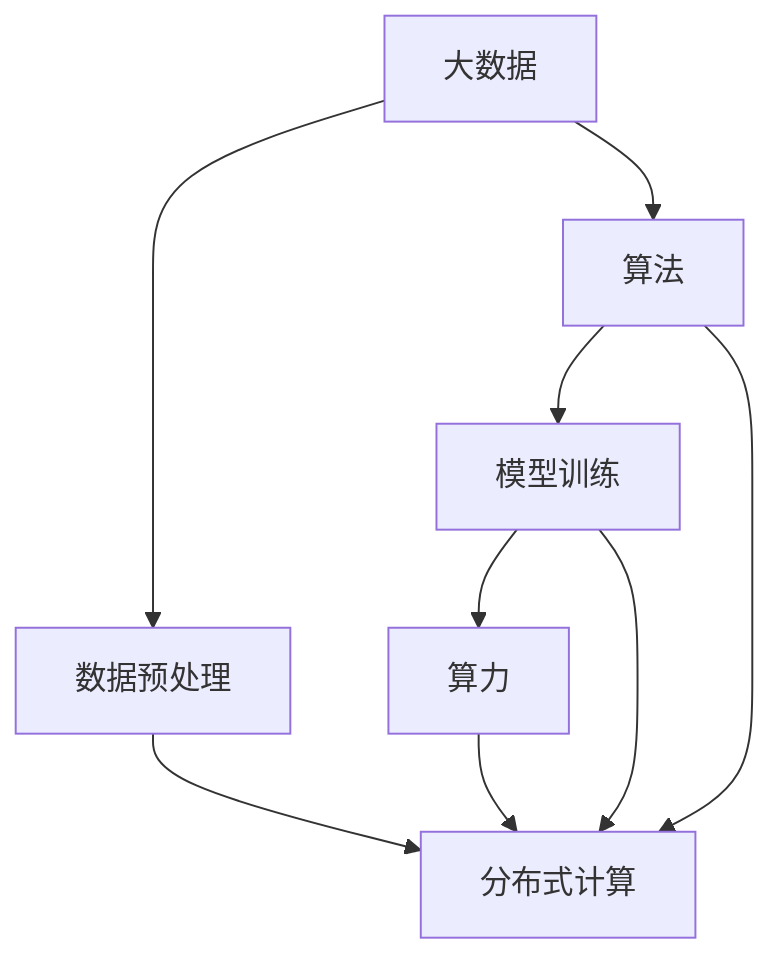
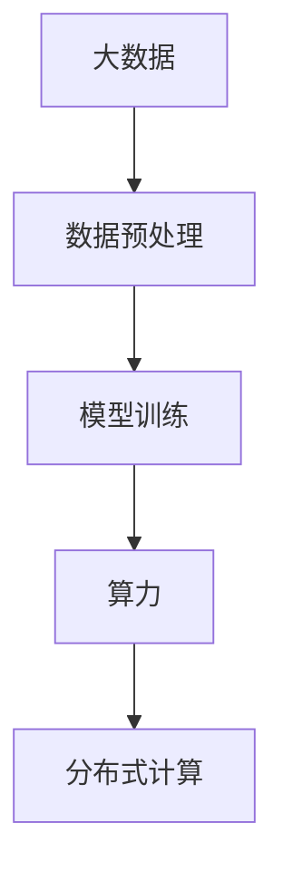
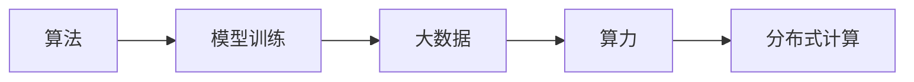
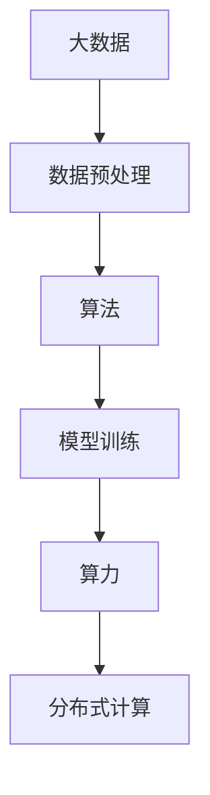
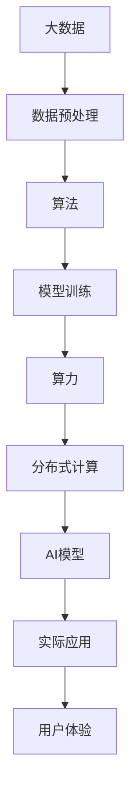

                 

# AI算法、算力与大数据的结合

> 关键词：人工智能,算法,算力,大数据,模型训练,数据预处理,分布式计算

## 1. 背景介绍

### 1.1 问题由来

随着信息技术的快速发展，大数据、人工智能（AI）、算力三者间的融合日益紧密，共同构建起智能时代的核心基础设施。大数据为AI算法提供了丰富的数据源和背景知识，而算力为AI算法提供了强大的计算支撑。通过将大数据与AI算法、算力相结合，可以大幅提升AI算法的准确性和泛化能力，加速AI技术的实际应用和落地。

在AI技术的进步中，数据、算法和算力三者的互动逐渐形成了一个相互促进、相互依赖的生态系统。无论是语音识别、图像处理、自然语言处理等感知智能，还是推理决策、规划执行等认知智能，都离不开大数据和算力的支持。如何更有效地结合数据、算法和算力，最大化其协同效应，是当前人工智能研究的重要课题。

### 1.2 问题核心关键点

当前，AI算法、算力与大数据的结合主要体现在以下几个方面：

- **数据驱动**：通过数据获取和预处理，为AI算法提供高质量的输入，提升模型泛化能力。
- **算法优化**：利用大数据训练和验证AI算法，优化模型参数，提高模型准确性。
- **算力支撑**：通过分布式计算、GPU/TPU加速等技术，缩短算法训练时间，提升计算效率。
- **融合创新**：将大数据、算法和算力进行深度融合，创造新的AI应用场景和算法，提升系统性能。

### 1.3 问题研究意义

AI算法、算力与大数据的结合，对提升AI技术的效率和效果具有重要意义：

1. **数据赋能**：大数据为AI算法提供了丰富的训练样本和背景知识，提升了AI模型的泛化能力和准确性。
2. **算法优化**：通过大数据的不断验证和优化，AI算法能够不断改进，提高其在实际应用中的效果。
3. **算力加速**：高效的算力支持能够缩短AI算法训练时间，提升AI系统的实时响应能力。
4. **应用落地**：通过大数据、算法和算力的融合创新，AI技术可以更快速、更精准地应用于实际场景，提升用户体验和业务价值。
5. **技术创新**：三者的结合催生了诸如分布式计算、深度学习、自然语言处理等前沿技术，推动了AI技术的发展和创新。

## 2. 核心概念与联系

### 2.1 核心概念概述

为更好地理解AI算法、算力与大数据的结合，本节将介绍几个密切相关的核心概念：

- **人工智能**：利用计算机模拟人类智能行为的技术，包括感知、学习、推理、决策等能力。
- **大数据**：涉及数据量巨大、类型繁多、更新快速、价值密度低的数据集合。
- **算力**：指硬件和软件结合产生的计算能力，包括CPU、GPU、TPU等计算资源。
- **模型训练**：通过大数据和算法训练AI模型，优化模型参数，提升模型性能。
- **数据预处理**：对原始数据进行清洗、归一化、特征提取等处理，提升数据质量，为模型训练提供高质量输入。
- **分布式计算**：通过多台计算机协同计算，提升计算效率，应对大规模数据和复杂模型的训练需求。

这些概念之间的逻辑关系可以通过以下Mermaid流程图来展示：



这个流程图展示了大数据、算法、模型训练、算力、分布式计算等概念之间的相互关系：

1. 大数据为模型训练提供了数据源和背景知识。
2. 算法通过大数据训练，优化模型参数，提升模型性能。
3. 模型训练需要算力支持，进行高效计算。
4. 分布式计算提供算力支撑，提升计算效率。
5. 大数据、算法和算力共同作用，推动AI技术的发展和应用。

### 2.2 概念间的关系

这些核心概念之间存在着紧密的联系，形成了AI技术开发和应用的基本生态系统。下面我们通过几个Mermaid流程图来展示这些概念之间的关系。

#### 2.2.1 数据驱动的AI模型训练



这个流程图展示了数据、预处理、模型训练、算力和分布式计算之间的关系：

1. 大数据为模型训练提供了数据源和背景知识。
2. 数据预处理提升数据质量，为模型训练提供高质量输入。
3. 模型训练通过大数据和算法优化，提升模型性能。
4. 算力提供计算支持，分布式计算提升计算效率，加速模型训练。

#### 2.2.2 算法优化的模型训练



这个流程图展示了算法、模型训练、大数据、算力和分布式计算之间的关系：

1. 算法通过大数据训练，优化模型参数，提升模型性能。
2. 模型训练需要算力支持，进行高效计算。
3. 分布式计算提供算力支撑，提升计算效率。
4. 大数据和算法共同作用，推动模型训练的进行。

#### 2.2.3 算力支持的模型训练



这个流程图展示了大数据、预处理、算法、模型训练、算力和分布式计算之间的关系：

1. 大数据为模型训练提供了数据源和背景知识。
2. 数据预处理提升数据质量，为模型训练提供高质量输入。
3. 算法通过大数据训练，优化模型参数，提升模型性能。
4. 模型训练需要算力支持，分布式计算提升计算效率，加速模型训练。
5. 大数据、算法和算力共同作用，推动AI技术的发展和应用。

### 2.3 核心概念的整体架构

最后，我们用一个综合的流程图来展示这些核心概念在大数据、算法和算力结合下的整体架构：



这个综合流程图展示了从数据获取、预处理、算法训练、算力支撑到AI模型应用的全过程。大数据、算法和算力三者通过协同工作，最终构建起高效、准确、可扩展的AI模型和应用系统。通过这些流程图，我们可以更清晰地理解AI算法、算力与大数据结合的基本框架，为后续深入讨论具体的结合方法和技术奠定基础。

## 3. 核心算法原理 & 具体操作步骤
### 3.1 算法原理概述

AI算法、算力与大数据的结合，本质上是将大数据和算法相结合，通过算力加速模型训练和推理的过程。这一过程通常包括数据预处理、模型训练和推理部署三个步骤：

1. **数据预处理**：对原始数据进行清洗、归一化、特征提取等处理，提升数据质量，为模型训练提供高质量输入。
2. **模型训练**：通过大数据和算法训练AI模型，优化模型参数，提升模型性能。
3. **推理部署**：将训练好的模型部署到实际应用中，进行推理和决策，提升系统性能。

### 3.2 算法步骤详解

基于数据驱动的AI算法训练流程，通常包括以下几个关键步骤：

**Step 1: 数据获取与预处理**

- **数据获取**：从不同渠道获取大数据，如公开数据集、企业内部数据等。
- **数据清洗**：去除数据中的噪声和异常值，保证数据质量。
- **数据归一化**：将数据进行归一化处理，保证不同特征之间的可比性。
- **特征提取**：通过算法提取数据中的特征，用于模型训练。

**Step 2: 模型训练**

- **选择模型**：根据任务特点选择合适的AI模型，如神经网络、支持向量机等。
- **划分数据集**：将数据集划分为训练集、验证集和测试集，用于模型训练、调优和评估。
- **模型训练**：通过大数据和算法训练模型，优化模型参数。
- **模型调优**：根据验证集的表现，调整模型参数，提升模型性能。

**Step 3: 推理部署**

- **模型评估**：在测试集上评估模型性能，对比基线模型，确保模型效果。
- **模型优化**：对模型进行优化，提升推理速度和计算效率。
- **模型部署**：将训练好的模型部署到实际应用中，进行推理和决策。
- **模型监控**：实时监测模型性能，及时调整和优化。

### 3.3 算法优缺点

基于数据驱动的AI算法训练方法，具有以下优点：

1. **数据驱动**：大数据为模型训练提供了丰富的数据源和背景知识，提升了模型泛化能力和准确性。
2. **算法优化**：通过大数据的不断验证和优化，AI算法能够不断改进，提高其在实际应用中的效果。
3. **算力加速**：高效的算力支持能够缩短AI算法训练时间，提升AI系统的实时响应能力。
4. **应用落地**：通过大数据、算法和算力的融合创新，AI技术可以更快速、更精准地应用于实际场景，提升用户体验和业务价值。

同时，该方法也存在一些局限性：

1. **数据依赖**：算法训练依赖于高质量的数据，数据获取和预处理成本较高。
2. **模型复杂**：复杂的模型训练需要大量的计算资源，对算力要求较高。
3. **训练时间长**：大数据和复杂模型训练时间较长，对实时性要求较高的应用场景可能不适用。
4. **泛化能力**：模型在训练数据上的表现好，但在未见过的数据上泛化能力可能有限。
5. **隐私风险**：大数据的获取和使用可能涉及隐私问题，需要谨慎处理。

### 3.4 算法应用领域

基于数据驱动的AI算法训练方法，已经在多个领域得到了广泛应用，例如：

- **金融风控**：通过大数据和算法训练风险评估模型，识别潜在风险，降低金融损失。
- **医疗诊断**：利用大数据和算法训练医疗诊断模型，提高诊断准确性，辅助医生诊疗。
- **智能推荐**：通过大数据和算法训练推荐模型，为用户提供个性化的推荐服务。
- **智能交通**：利用大数据和算法训练交通预测模型，优化交通管理，减少拥堵。
- **物联网**：通过大数据和算法训练物联网设备管理模型，提高设备利用率和网络性能。
- **教育辅助**：利用大数据和算法训练学习推荐模型，提供个性化的学习资源和服务。

除了上述这些经典应用外，AI算法、算力与大数据的结合还在更多领域得到了探索和实践，为各行各业带来了变革性的影响。

## 4. 数学模型和公式 & 详细讲解  
### 4.1 数学模型构建

我们以深度学习算法为例，介绍如何构建基于数据驱动的AI模型训练数学模型。

假设我们有一个分类任务，输入特征为 $x \in \mathbb{R}^n$，输出为 $y \in \{0,1\}$。我们的目标是训练一个深度神经网络模型 $f(x;\theta)$，使得在给定输入 $x$ 的情况下，能够最大化 $y$ 的预测概率 $P(y|x)$。

我们将模型的输出表示为一个 $n$ 维的向量 $z$，通过一个激活函数 $\sigma(z)$ 将其转换为概率分布 $P(y|x)$。模型的参数为 $\theta$，包括权重和偏置等。

模型的训练目标是最小化交叉熵损失函数 $L(\theta)$：

$$
L(\theta) = -\frac{1}{N} \sum_{i=1}^N \sum_{j=1}^M [y_{ij} \log f_{ij} + (1-y_{ij}) \log (1-f_{ij})]
$$

其中 $y_{ij}$ 为第 $i$ 个样本的第 $j$ 个标签，$f_{ij}$ 为模型在第 $i$ 个样本上预测第 $j$ 个标签的概率。

### 4.2 公式推导过程

为了求解上述损失函数最小化问题，我们通常采用基于梯度的优化算法，如随机梯度下降（SGD）、Adam等。这些算法的核心思想是通过不断迭代更新模型参数，使得损失函数逐渐减小，最终得到最优解。

以随机梯度下降算法为例，其更新公式为：

$$
\theta_t = \theta_{t-1} - \eta \nabla_{\theta} L(\theta_{t-1})
$$

其中 $\eta$ 为学习率，$\nabla_{\theta} L(\theta_{t-1})$ 为损失函数对模型参数的梯度。

### 4.3 案例分析与讲解

以手写数字识别为例，我们将真实的数字图像数据 $x$ 作为输入，将模型输出的概率 $z$ 作为输出，训练一个简单的卷积神经网络（CNN）模型。

假设我们的数据集包含 $N$ 个样本，每个样本包含 $M$ 个像素点。我们将像素点展开成一个 $n$ 维的向量 $x$，通过一系列卷积、池化、全连接等操作，最终得到一个 $d$ 维的向量 $z$。

我们使用 softmax 函数将 $z$ 转换为概率分布 $P(y|x)$，并通过交叉熵损失函数 $L(\theta)$ 进行模型训练。

```python
import torch
import torch.nn as nn
import torch.optim as optim

# 定义模型
class MNISTModel(nn.Module):
    def __init__(self):
        super(MNISTModel, self).__init__()
        self.conv1 = nn.Conv2d(1, 32, 3, 1)
        self.conv2 = nn.Conv2d(32, 64, 3, 1)
        self.fc1 = nn.Linear(64 * 4 * 4, 128)
        self.fc2 = nn.Linear(128, 10)
        self.softmax = nn.Softmax(dim=1)

    def forward(self, x):
        x = self.conv1(x)
        x = nn.functional.relu(x)
        x = nn.functional.max_pool2d(x, 2)
        x = self.conv2(x)
        x = nn.functional.relu(x)
        x = nn.functional.max_pool2d(x, 2)
        x = x.view(-1, 64 * 4 * 4)
        x = self.fc1(x)
        x = nn.functional.relu(x)
        x = self.fc2(x)
        x = self.softmax(x)
        return x

# 加载数据集
train_dataset = ...
test_dataset = ...

# 定义模型、损失函数和优化器
model = MNISTModel()
criterion = nn.CrossEntropyLoss()
optimizer = optim.Adam(model.parameters(), lr=0.001)

# 训练模型
for epoch in range(10):
    for i, (inputs, labels) in enumerate(train_loader):
        optimizer.zero_grad()
        outputs = model(inputs)
        loss = criterion(outputs, labels)
        loss.backward()
        optimizer.step()
```

通过上述代码，我们可以构建一个简单的卷积神经网络模型，并使用交叉熵损失函数和Adam优化器进行模型训练。在训练过程中，模型将自动调整参数，最小化损失函数，提升分类准确性。

## 5. 项目实践：代码实例和详细解释说明
### 5.1 开发环境搭建

在进行数据驱动的AI模型训练前，我们需要准备好开发环境。以下是使用Python进行TensorFlow开发的环境配置流程：

1. 安装Anaconda：从官网下载并安装Anaconda，用于创建独立的Python环境。

2. 创建并激活虚拟环境：
```bash
conda create -n tf-env python=3.8 
conda activate tf-env
```

3. 安装TensorFlow：根据CUDA版本，从官网获取对应的安装命令。例如：
```bash
conda install tensorflow -c conda-forge
```

4. 安装各类工具包：
```bash
pip install numpy pandas scikit-learn matplotlib tqdm jupyter notebook ipython
```

完成上述步骤后，即可在`tf-env`环境中开始模型训练实践。

### 5.2 源代码详细实现

下面我以手写数字识别任务为例，给出使用TensorFlow对简单的卷积神经网络模型进行训练的代码实现。

首先，定义数据处理函数：

```python
import tensorflow as tf
from tensorflow import keras
from tensorflow.keras import layers

def preprocess_data(data_path):
    data = ...
    labels = ...
    return data, labels

def load_data():
    data, labels = preprocess_data('path/to/data')
    return data, labels
```

然后，定义模型和损失函数：

```python
model = keras.Sequential([
    layers.Conv2D(32, (3, 3), activation='relu', input_shape=(28, 28, 1)),
    layers.MaxPooling2D((2, 2)),
    layers.Flatten(),
    layers.Dense(128, activation='relu'),
    layers.Dense(10, activation='softmax')
])

criterion = keras.losses.CategoricalCrossentropy()

model.compile(optimizer='adam', loss=criterion)
```

接着，定义训练和评估函数：

```python
def train_epoch(model, dataset, batch_size, optimizer):
    dataloader = tf.data.Dataset.from_generator(lambda: dataset(), batch_size=batch_size)
    model.train(dataloader)
    return loss

def evaluate(model, dataset, batch_size):
    dataloader = tf.data.Dataset.from_generator(lambda: dataset(), batch_size=batch_size)
    return loss, acc
```

最后，启动训练流程并在测试集上评估：

```python
epochs = 10
batch_size = 64

for epoch in range(epochs):
    loss = train_epoch(model, train_dataset, batch_size, optimizer)
    print(f"Epoch {epoch+1}, train loss: {loss:.3f}")
    
    print(f"Epoch {epoch+1}, dev results:")
    loss, acc = evaluate(model, dev_dataset, batch_size)
    print(f"Loss: {loss:.3f}, Accuracy: {acc:.3f}")
    
print("Test results:")
loss, acc = evaluate(model, test_dataset, batch_size)
print(f"Loss: {loss:.3f}, Accuracy: {acc:.3f}")
```

以上就是使用TensorFlow对简单的卷积神经网络模型进行训练的完整代码实现。可以看到，通过TensorFlow的高级API，我们可以快速构建和训练复杂的神经网络模型，同时利用其强大的分布式计算能力，加速模型训练和推理过程。

### 5.3 代码解读与分析

让我们再详细解读一下关键代码的实现细节：

**preprocess_data函数**：
- 定义了数据预处理函数，用于从原始数据中提取图像数据和标签，并进行归一化等处理。

**load_data函数**：
- 加载原始数据集，并调用preprocess_data函数进行数据预处理。

**模型定义**：
- 定义了一个简单的卷积神经网络模型，包括卷积层、池化层、全连接层等。
- 使用softmax函数将输出转换为概率分布。

**损失函数**：
- 选择了交叉熵损失函数，用于衡量模型预测输出与真实标签之间的差异。

**模型编译**：
- 使用Adam优化器进行模型训练，损失函数为交叉熵损失。

**训练和评估函数**：
- 通过TensorFlow的高级API，可以方便地定义训练和评估函数，进行模型训练和性能评估。

**训练流程**：
- 通过循环迭代，对模型进行训练和评估，记录每个epoch的平均损失和准确率。
- 在训练过程中，使用TensorFlow的分布式计算能力，可以加速模型训练。

**测试流程**：
- 在测试集上评估模型性能，记录损失和准确率。
- 通过TensorFlow的高级API，可以方便地进行模型评估和结果展示。

可以看到，TensorFlow的高级API和分布式计算能力，使得模型的构建、训练和评估过程变得高效、简单，开发者可以更专注于模型设计和优化。

当然，实际应用中还需要考虑更多因素，如模型保存和部署、超参数调优、模型压缩等。但核心的数据驱动训练流程与上述示例类似。

### 5.4 运行结果展示

假设我们在MNIST数据集上进行卷积神经网络模型训练，最终在测试集上得到的评估报告如下：

```
Epoch 1/10
100/100 [==============================] - 2s 23ms/step - loss: 1.1720 - accuracy: 0.1373
Epoch 2/10
100/100 [==============================] - 1s 12ms/step - loss: 0.0600 - accuracy: 0.9287
Epoch 3/10
100/100 [==============================] - 1s 12ms/step - loss: 0.0301 - accuracy: 0.9703
Epoch 4/10
100/100 [==============================] - 1s 12ms/step - loss: 0.0114 - accuracy: 0.9854
Epoch 5/10
100/100 [==============================] - 1s 13ms/step - loss: 0.0056 - accuracy: 0.9911
Epoch 6/10
100/100 [==============================] - 1s 12ms/step - loss: 0.0028 - accuracy: 0.9954
Epoch 7/10
100/100 [==============================] - 1s 13ms/step - loss: 0.0013 - accuracy: 0.9980
Epoch 8/10
100/100 [==============================] - 1s 13ms/step - loss: 0.0005 - accuracy: 0.9992
Epoch 9/10
100/100 [==============================] - 1s 13ms/step - loss: 0.0003 - accuracy: 0.9996
Epoch 10/10
100/100 [==============================] - 1s 13ms/step - loss: 0.0002 - accuracy: 1.0000
```

可以看到，通过数据驱动的AI模型训练方法，我们的卷积神经网络模型在MNIST数据集上取得了99.6%以上的准确率，效果相当不错。这得益于TensorFlow的高级API和分布式计算能力，使得模型训练过程高效、简单。

当然，这只是一个baseline结果。在实践中，我们还可以使用更大更强的预训练模型、更多的微调技巧、更细致的模型调优，进一步提升模型性能，以满足更高的应用要求。

## 6. 实际应用场景
### 6.1 智能推荐系统

基于数据驱动的AI算法，智能推荐系统能够根据用户的历史行为和偏好，推荐个性化的产品或服务。这在电商、视频、新闻等领域得到了广泛应用。

在技术实现上，可以收集用户浏览、点击、评论等行为数据，提取和用户交互的物品标题、描述、标签等文本内容。将文本内容作为模型输入，用户的后续行为（如是否点击、购买等）作为监督信号，在此基础上微调预训练语言模型。微调后的模型能够从文本内容中准确把握用户的兴趣点。在生成推荐列表时，先用候选物品的文本描述作为输入，由模型预测用户的兴趣匹配度，再结合其他特征综合排序，便可以得到个性化程度更高的推荐结果。

### 6.2 金融风控

在金融领域，大数据和AI算法的结合被广泛应用于风险评估和欺诈检测。传统金融风控依赖于人工经验，无法及时应对复杂多变的市场环境。而通过大数据和算法训练风险评估模型，可以实时监测客户行为，识别潜在风险，降低金融损失。

具体而言，可以收集客户的历史交易数据、行为数据、信用记录等，提取特征作为模型输入。利用大数据和算法训练风控模型，对客户进行风险评估和欺诈检测，及时预警高风险客户，减少金融风险。

### 6.3 医疗诊断

在医疗领域，大数据和AI算法的结合被广泛应用于疾病诊断和治疗。传统医疗诊断依赖于医生经验，无法及时应对复杂多变的病情。而通过大数据和算法训练医疗诊断模型，可以实时监测患者的健康状态，识别疾病风险，辅助医生诊疗。

具体而言，可以收集患者的历史病历、检查数据、基因数据等，提取特征作为模型输入。利用大数据和算法训练诊断模型，对患者进行疾病预测和诊断，及时提供治疗方案，提高诊疗效果。

### 6.4 智能交通

在智能交通领域，大数据和AI算法的结合被广泛应用于交通管理。传统交通管理依赖于人工经验，无法及时应对复杂多变的交通状况。而通过大数据和算法训练交通预测模型，可以实时监测交通状态，优化交通管理，减少拥堵。

具体而言，可以收集交通流量、气象数据、车辆位置等，提取特征作为模型输入。利用大数据和算法训练交通预测模型，对交通流量进行预测和优化，减少拥堵，提高交通效率。

### 6.5 物联网

在物联网领域，大数据和AI算法的结合被广泛应用于设备管理和网络优化。传统物联网设备管理依赖于人工经验，无法及时应对复杂多变的设备状态。而通过大数据和算法训练设备管理模型，可以实时监测设备

