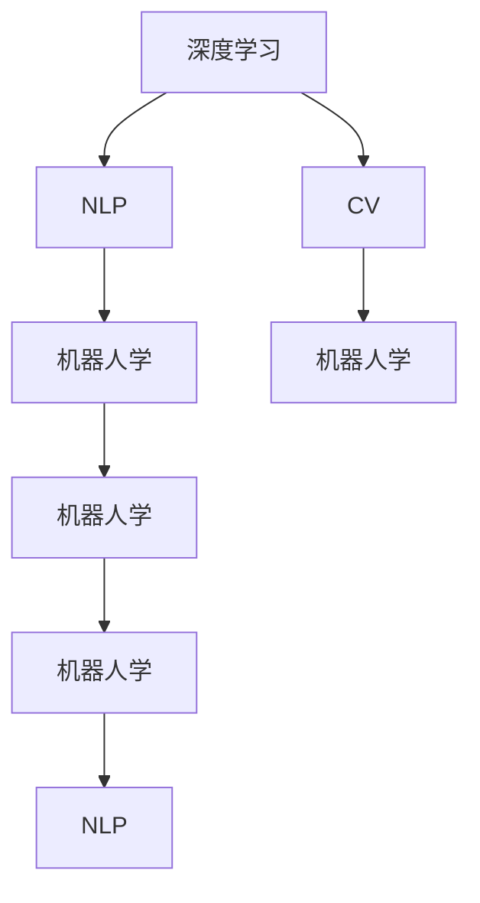

                 

# AI进展的意义与未来展望

## 1. 背景介绍

### 1.1 问题由来
人工智能（AI）作为21世纪最前沿的科技之一，正在以前所未有的速度和深度改变着世界。从最初的符号主义到机器学习，再到深度学习，人工智能技术历经多次迭代，呈现出蓬勃的生命力。当前，AI正进入一个更加智能化、自动化和普适化的新阶段，影响着从医疗、金融到教育、娱乐等众多行业。

### 1.2 问题核心关键点
AI进展的意义不仅在于技术本身，更在于其对人类社会、经济、文化等方面的深远影响。本文旨在深入探讨AI进展在多个领域的应用与影响，并对未来AI技术的发展趋势和面临的挑战进行展望。

### 1.3 问题研究意义
深入理解AI进展的意义与未来展望，对于把握AI技术的最新动态，指导相关领域的应用，推动AI技术的发展，具有重要意义。

## 2. 核心概念与联系

### 2.1 核心概念概述

1. **人工智能（Artificial Intelligence, AI）**：指通过计算机程序和算法实现人类智能行为的科技。包括机器学习、深度学习、自然语言处理（NLP）、计算机视觉（CV）、机器人学等诸多子领域。

2. **深度学习（Deep Learning）**：一类基于神经网络的机器学习算法，通过多层次的非线性变换，从大规模数据中自动学习到复杂特征表示。其核心在于构建具有深层神经网络的模型，如卷积神经网络（CNN）、循环神经网络（RNN）、变分自编码器（VAE）等。

3. **自然语言处理（NLP）**：研究如何让计算机理解和处理人类语言的技术。包括文本分类、信息检索、机器翻译、问答系统、文本生成等任务。

4. **计算机视觉（CV）**：研究如何让计算机“看”和理解图像和视频的技术。包括图像分类、目标检测、人脸识别、场景理解等任务。

5. **机器人学（Robotics）**：结合机械工程、计算机科学和人工智能等多学科，研究如何让机器人具备感知、规划、执行和决策等智能行为。

### 2.2 核心概念间的关系

AI的核心概念之间相互联系，构成了一个庞大的科技生态系统。深度学习作为AI的重要子领域，通过学习复杂特征表示，为NLP和CV等领域提供了强大的技术支持。NLP和CV的进展又进一步推动了深度学习模型的改进和应用。机器人学则将AI技术与机械工程结合，使得AI在现实世界中能够实际应用。这些技术领域的协同进步，共同推动了AI技术的全面发展。

以下是一个简化的Mermaid流程图，展示核心概念之间的关系：



## 3. 核心算法原理 & 具体操作步骤

### 3.1 算法原理概述

AI的核心算法包括深度学习、强化学习、遗传算法等。本文主要介绍深度学习算法，特别是在NLP和CV领域的应用。深度学习模型通过多层非线性变换，自动学习特征表示，通过反向传播算法进行训练，最终能够高效处理复杂数据。

### 3.2 算法步骤详解

深度学习算法的步骤主要包括：

1. **数据预处理**：将原始数据转化为模型可处理的形式。如将文本转换为词向量，将图像转换为像素矩阵。

2. **模型构建**：选择合适的网络结构，如卷积神经网络（CNN）、循环神经网络（RNN）、Transformer等，构建深度学习模型。

3. **模型训练**：使用反向传播算法，通过梯度下降等优化算法，最小化损失函数，更新模型参数。

4. **模型评估**：使用测试集数据评估模型性能，如准确率、召回率、F1分数等。

5. **模型优化**：通过超参数调优、正则化、数据增强等手段，进一步提高模型性能。

### 3.3 算法优缺点

深度学习算法的优点包括：

- **自动特征提取**：能够自动学习复杂特征表示，减少了手动设计特征的需要。
- **处理非结构化数据**：适用于文本、图像、视频等多种非结构化数据的处理。
- **高效泛化能力**：通过大规模数据训练，能够有效泛化到新数据上。

其缺点包括：

- **计算资源需求高**：需要大规模计算资源进行训练和推理。
- **模型复杂度大**：模型结构复杂，难以解释和调试。
- **过拟合风险高**：在训练过程中容易出现过拟合现象。

### 3.4 算法应用领域

深度学习算法在多个领域得到了广泛应用，包括但不限于：

- **计算机视觉**：图像分类、目标检测、人脸识别、场景理解等。
- **自然语言处理**：文本分类、信息检索、机器翻译、问答系统、文本生成等。
- **语音识别**：语音转文本、语音生成、语音情感识别等。
- **游戏AI**：游戏对战、机器人导航、路径规划等。
- **推荐系统**：个性化推荐、广告定向等。

## 4. 数学模型和公式 & 详细讲解

### 4.1 数学模型构建

深度学习模型通常采用神经网络结构，其核心是多层神经元的组合。以卷积神经网络（CNN）为例，其结构可以表示为：

$$
\mathbf{X} \rightarrow \text{卷积层} \rightarrow \text{池化层} \rightarrow \cdots \rightarrow \mathbf{Y}
$$

其中，$\mathbf{X}$ 表示输入数据，$\mathbf{Y}$ 表示输出结果。通过多层卷积、池化等操作，模型自动学习到数据的特征表示。

### 4.2 公式推导过程

以卷积神经网络为例，其前向传播过程可以表示为：

$$
h_l = \sigma(W_lh_{l-1}+b_l)
$$

其中，$h_l$ 表示第 $l$ 层的输出，$W_l$ 和 $b_l$ 分别表示第 $l$ 层的权重和偏置，$\sigma$ 表示激活函数，通常采用ReLU函数。

### 4.3 案例分析与讲解

以图像分类为例，我们设计一个简单的CNN模型，其结构如图1所示。模型通过多层卷积和池化操作，逐步提取图像特征，最终输出分类结果。在训练过程中，使用交叉熵损失函数进行优化，通过反向传播算法更新模型参数。训练完成后，使用测试集数据评估模型性能。


## 5. 项目实践：代码实例和详细解释说明

### 5.1 开发环境搭建

在进行项目实践前，我们需要准备好开发环境。以下是使用Python进行TensorFlow开发的环境配置流程：

1. 安装Anaconda：从官网下载并安装Anaconda，用于创建独立的Python环境。

2. 创建并激活虚拟环境：
```bash
conda create -n tf-env python=3.8 
conda activate tf-env
```

3. 安装TensorFlow：根据CUDA版本，从官网获取对应的安装命令。例如：
```bash
conda install tensorflow -c conda-forge
```

4. 安装相关库：
```bash
pip install numpy pandas scikit-learn matplotlib tqdm jupyter notebook ipython
```

完成上述步骤后，即可在`tf-env`环境中开始实践。

### 5.2 源代码详细实现

下面以图像分类为例，给出使用TensorFlow实现卷积神经网络的代码实现。

```python
import tensorflow as tf
from tensorflow.keras import datasets, layers, models

# 加载数据集
(train_images, train_labels), (test_images, test_labels) = datasets.cifar10.load_data()

# 数据预处理
train_images, test_images = train_images / 255.0, test_images / 255.0

# 定义模型
model = models.Sequential()
model.add(layers.Conv2D(32, (3, 3), activation='relu', input_shape=(32, 32, 3)))
model.add(layers.MaxPooling2D((2, 2)))
model.add(layers.Conv2D(64, (3, 3), activation='relu'))
model.add(layers.MaxPooling2D((2, 2)))
model.add(layers.Conv2D(64, (3, 3), activation='relu'))

# 添加全连接层
model.add(layers.Flatten())
model.add(layers.Dense(64, activation='relu'))

# 添加输出层
model.add(layers.Dense(10, activation='softmax'))

# 编译模型
model.compile(optimizer='adam',
              loss='sparse_categorical_crossentropy',
              metrics=['accuracy'])

# 训练模型
model.fit(train_images, train_labels, epochs=10, 
          validation_data=(test_images, test_labels))

# 评估模型
model.evaluate(test_images, test_labels, verbose=2)
```

### 5.3 代码解读与分析

以上代码展示了使用TensorFlow构建和训练卷积神经网络的过程。

- 首先，加载CIFAR-10数据集，并进行预处理，将像素值归一化到[0,1]。
- 接着，定义卷积神经网络模型，包括卷积层、池化层和全连接层。
- 然后，编译模型，选择Adam优化器和交叉熵损失函数。
- 最后，训练模型，并在测试集上评估模型性能。

## 6. 实际应用场景

### 6.1 智能医疗诊断

人工智能在医疗领域的应用非常广泛，其中智能医疗诊断是一个重要方向。通过深度学习算法，可以对医学影像、电子病历等数据进行自动分析和诊断，辅助医生进行决策。

以医学影像分析为例，深度学习模型可以对X光片、CT、MRI等医学影像进行分类和分割，识别出病变区域和病变类型。通过与医生协作，可以辅助诊断，提高诊疗效率和准确率。

### 6.2 金融风控

金融领域应用深度学习算法，可以实现风险评估、欺诈检测、信用评分等任务。通过分析交易数据、用户行为数据等，构建复杂的风险模型，预测风险事件的发生概率，及时预警并采取措施。

以信用评分为例，深度学习模型可以学习到用户的信用行为特征，构建高维特征向量，进行多分类预测。通过与传统信用评估方法结合，可以提升信用评估的准确性和效率。

### 6.3 智能推荐

推荐系统是人工智能在电商、社交、视频等领域的常见应用。通过深度学习算法，可以对用户行为数据进行建模，预测用户对商品的兴趣，推荐个性化商品。

以电商推荐为例，深度学习模型可以学习到用户的购物行为、浏览记录、评分记录等，构建用户画像，预测用户可能感兴趣的商品。通过与电商平台的商品数据结合，可以显著提升推荐效果。

### 6.4 未来应用展望

随着深度学习技术的不断进步，未来AI将在更多领域得到应用，为社会带来深远影响。以下是对未来AI应用的展望：

1. **自动驾驶**：深度学习算法可以用于自动驾驶技术，实现自动驾驶汽车对路况的感知和决策，提高交通安全和效率。

2. **智能制造**：通过深度学习算法，可以实现智能制造和工业自动化，提高生产效率和产品质量。

3. **智慧城市**：深度学习算法可以应用于智慧城市建设，实现城市交通管理、环境监测、公共安全等应用。

4. **虚拟助手**：通过自然语言处理和计算机视觉技术，可以实现智能虚拟助手，提升人机交互体验。

## 7. 工具和资源推荐

### 7.1 学习资源推荐

为了帮助开发者系统掌握深度学习技术，这里推荐一些优质的学习资源：

1. 《深度学习》系列书籍：Ian Goodfellow等著，系统介绍深度学习理论、算法和应用。

2. 《动手学深度学习》在线课程：李沐等人主讲的深度学习课程，包含丰富的代码实现和实验。

3. 《CS231n: 卷积神经网络与视觉识别》课程：斯坦福大学开设的计算机视觉课程，涵盖卷积神经网络、图像分类、目标检测等内容。

4. 《NLP with PyTorch》书籍：李沐等人编写，介绍自然语言处理技术在深度学习中的实现。

5. 《TensorFlow官方文档》：TensorFlow官方文档，提供详细的使用指南和示例代码。

### 7.2 开发工具推荐

高效的开发离不开优秀的工具支持。以下是几款用于深度学习开发的常用工具：

1. TensorFlow：由Google主导开发的深度学习框架，生产部署方便，适合大规模工程应用。

2. PyTorch：由Facebook主导开发的深度学习框架，灵活动态，适合快速迭代研究。

3. Keras：高层次的深度学习框架，易于使用，支持多种后端引擎。

4. Jupyter Notebook：基于Web的交互式编程环境，支持Python和R语言，方便展示代码和实验结果。

5. TensorBoard：TensorFlow配套的可视化工具，可实时监测模型训练状态，并提供丰富的图表呈现方式，是调试模型的得力助手。

### 7.3 相关论文推荐

深度学习技术的发展源于学界的持续研究。以下是几篇奠基性的相关论文，推荐阅读：

1. ImageNet Classification with Deep Convolutional Neural Networks：Alex Krizhevsky等著，提出卷积神经网络模型，在ImageNet数据集上取得优异表现。

2. Convolutional Neural Networks for Natural Language Processing：Kim Y.等著，提出卷积神经网络用于自然语言处理任务，取得很好的效果。

3. Attention is All You Need：Vaswani等著，提出Transformer模型，在自然语言处理领域取得突破性进展。

4. ImageNet Large Scale Visual Recognition Challenge：Jia Y.等著，介绍ImageNet大规模视觉识别挑战赛及其对深度学习技术发展的推动作用。

## 8. 总结：未来发展趋势与挑战

### 8.1 研究成果总结

深度学习技术在多个领域取得了显著进展，推动了AI应用的普及。以下是对当前研究成果的总结：

1. **深度学习模型**：从简单的多层感知机（MLP）到卷积神经网络（CNN）、循环神经网络（RNN）、Transformer等，不断优化模型结构和算法。

2. **数据集和预训练模型**：构建了多种数据集和预训练模型，如ImageNet、COCO、BERT等，推动了深度学习算法的发展。

3. **应用领域**：深度学习技术在图像处理、自然语言处理、语音识别等领域得到了广泛应用，提升了多个行业的智能化水平。

### 8.2 未来发展趋势

展望未来，深度学习技术将呈现以下几个发展趋势：

1. **模型规模持续增大**：随着算力成本的下降和数据规模的扩张，深度学习模型的参数量还将持续增长。超大规模模型蕴含的丰富知识，有望支撑更加复杂多变的任务。

2. **模型泛化能力提升**：通过更好的正则化、数据增强、迁移学习等技术，提升深度学习模型的泛化能力和鲁棒性。

3. **跨模态融合**：将深度学习技术与多模态数据融合，实现视觉、语音、文本等多种模态数据的协同建模。

4. **强化学习与深度学习结合**：将强化学习与深度学习技术结合，实现更加智能化的决策和规划。

5. **自动化与可解释性**：通过自动化超参数调优、自动化模型优化等技术，提升深度学习的自动化水平。同时加强模型可解释性，提升模型的透明度和可信度。

### 8.3 面临的挑战

尽管深度学习技术取得了显著进展，但在迈向更加智能化、普适化应用的过程中，仍面临诸多挑战：

1. **数据依赖**：深度学习算法依赖大量标注数据，获取高质量标注数据成本高昂。如何降低数据依赖，是一个重要问题。

2. **计算资源**：深度学习模型需要大规模计算资源进行训练和推理，如何优化计算资源，提高模型效率，是一个关键问题。

3. **模型泛化性**：深度学习模型在泛化能力和鲁棒性方面仍有提升空间，如何构建更加鲁棒的模型，是一个难点。

4. **模型可解释性**：深度学习模型通常是“黑盒”系统，难以解释其内部工作机制和决策逻辑，如何赋予模型更强的可解释性，是一个研究方向。

### 8.4 研究展望

面对深度学习面临的挑战，未来的研究需要在以下几个方面寻求新的突破：

1. **无监督学习和自监督学习**：摆脱对大规模标注数据的依赖，利用无监督和自监督学习范式，最大化利用非结构化数据。

2. **迁移学习与模型适配**：将预训练模型与特定任务结合，通过迁移学习技术，提升模型在特定任务上的性能。

3. **模型压缩与优化**：通过模型压缩、量化等技术，优化深度学习模型的计算效率和推理速度。

4. **多模态学习**：将深度学习技术与多模态数据融合，实现视觉、语音、文本等多种模态数据的协同建模。

5. **模型优化与自动化**：通过自动化超参数调优、自动化模型优化等技术，提升深度学习的自动化水平。

6. **模型可解释性与透明性**：通过可解释性技术，提升深度学习模型的透明性和可信度，保障模型输出符合伦理道德。

这些研究方向的发展，必将推动深度学习技术进一步拓展应用边界，提升AI技术的智能化水平。总之，深度学习技术的发展需要全社会共同努力，从数据、算法、工程、伦理等多个方面协同发力，方能实现AI技术的全面突破。

## 9. 附录：常见问题与解答

**Q1: 深度学习算法有哪些缺点？**

A: 深度学习算法的缺点包括：

- **计算资源需求高**：需要大规模计算资源进行训练和推理。
- **模型复杂度大**：模型结构复杂，难以解释和调试。
- **过拟合风险高**：在训练过程中容易出现过拟合现象。
- **数据依赖**：依赖大量标注数据，获取高质量标注数据成本高昂。

**Q2: 深度学习算法在哪些领域得到了广泛应用？**

A: 深度学习算法在多个领域得到了广泛应用，包括但不限于：

- **计算机视觉**：图像分类、目标检测、人脸识别、场景理解等。
- **自然语言处理**：文本分类、信息检索、机器翻译、问答系统、文本生成等。
- **语音识别**：语音转文本、语音生成、语音情感识别等。
- **游戏AI**：游戏对战、机器人导航、路径规划等。
- **推荐系统**：个性化推荐、广告定向等。

**Q3: 如何提高深度学习模型的泛化能力？**

A: 提高深度学习模型的泛化能力，可以从以下几个方面入手：

- **数据增强**：通过数据增强技术，扩充训练集多样性。
- **正则化**：使用L2正则、Dropout、Early Stopping等技术，防止过拟合。
- **迁移学习**：通过迁移学习技术，将预训练模型与特定任务结合，提升模型泛化能力。
- **自监督学习**：利用无监督和自监督学习范式，最大化利用非结构化数据，提升模型泛化能力。

**Q4: 深度学习算法的核心思想是什么？**

A: 深度学习算法的核心思想是通过多层非线性变换，自动学习数据的高维特征表示，通过反向传播算法进行模型训练和优化。通过深度学习模型，可以处理高维、复杂的数据，提升模型泛化能力和预测精度。

**Q5: 深度学习算法的优点有哪些？**

A: 深度学习算法的优点包括：

- **自动特征提取**：能够自动学习复杂特征表示，减少了手动设计特征的需要。
- **处理非结构化数据**：适用于文本、图像、视频等多种非结构化数据的处理。
- **高效泛化能力**：通过大规模数据训练，能够有效泛化到新数据上。

以上是对深度学习技术及其应用领域的系统介绍和展望，希望能对广大开发者和研究者提供帮助。深度学习技术作为21世纪最重要的科技之一，必将在未来持续推动人类社会的进步和发展。

