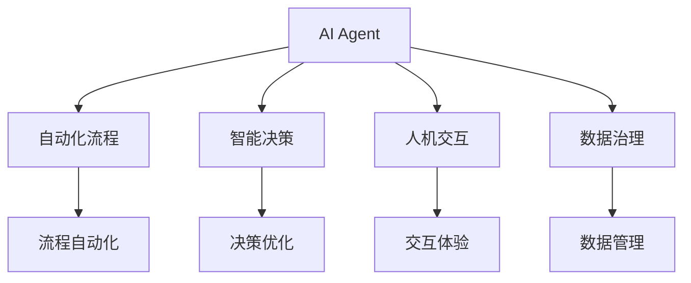
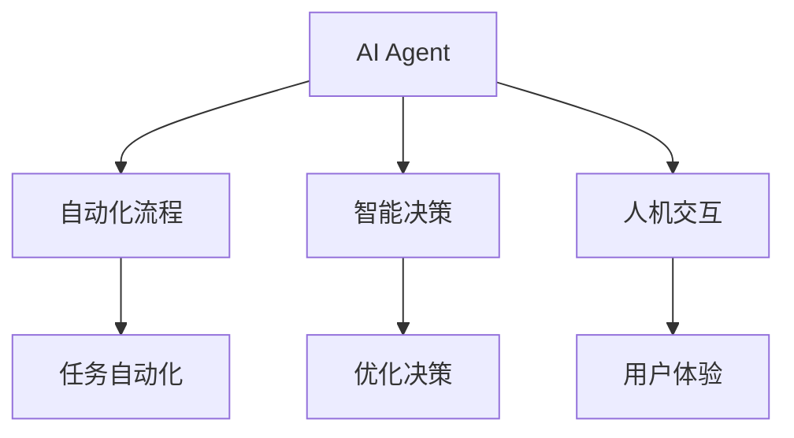
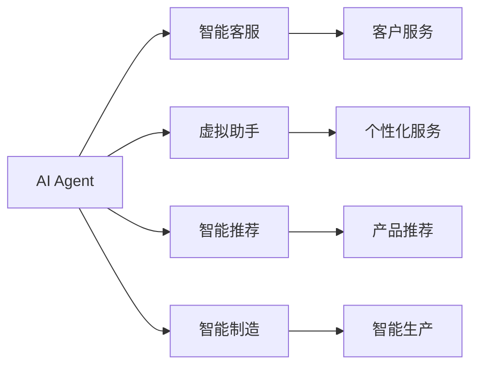
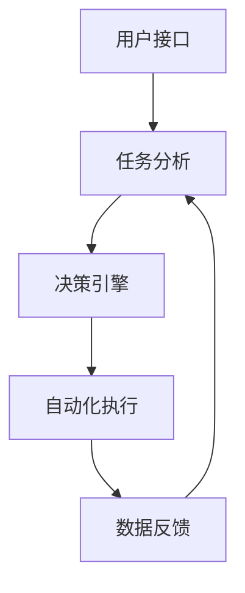

                 

# AI Agent: AI的下一个风口 从桌面应用到云计算

> 关键词：
   - AI Agent
   - 桌面应用
   - 云计算
   - 自动化流程
   - 智能决策
   - 人机交互
   - 数据治理

## 1. 背景介绍

### 1.1 问题由来
随着人工智能技术的不断进步，AI Agent（智能代理）逐渐成为AI领域的热点话题。AI Agent旨在通过智能决策、自动化流程、智能交互等功能，提升企业效率、改善用户体验、推动社会进步。

AI Agent的兴起源于企业内部自动化需求和云计算的发展。过去，企业主要依赖人工处理各种任务，但随着业务规模的扩大和数据量的增加，人工处理已经无法满足需求。而云计算的普及，为AI Agent的发展提供了必要的技术基础和计算资源。

AI Agent不仅可以处理重复性任务，还能通过智能决策提升效率和质量。例如，在金融、医疗、制造业等领域，AI Agent通过自动化审计、智能推荐、自动化生产等手段，大幅提高了企业的运营效率。

### 1.2 问题核心关键点
AI Agent的核心在于其能够执行复杂决策和自动化流程，而不仅仅是传统的自动化任务。AI Agent不仅能处理简单操作，还能理解任务上下文，具备一定的语义理解和推理能力。这使得AI Agent可以处理更加复杂和多样化的任务。

AI Agent的另一个关键点是其智能决策能力。通过机器学习和深度学习等技术，AI Agent能够从大量数据中学习并提取有价值的决策信息，从而在复杂情境下做出最优决策。

AI Agent还具有灵活的人机交互能力，能够通过自然语言、图像、语音等多种方式与用户互动，提升用户体验。例如，智能客服机器人、虚拟助手等都是AI Agent的重要应用场景。

### 1.3 问题研究意义
研究AI Agent技术，对于提升企业自动化水平、改善用户体验、推动行业发展具有重要意义：

1. 提升企业效率：AI Agent能够自动处理重复性高、规则明确的任务，释放人力资源，提升企业运营效率。
2. 改善用户体验：AI Agent通过智能决策和智能交互，提供更加个性化、高效的服务，改善用户使用体验。
3. 推动行业发展：AI Agent的广泛应用将推动各行业的数字化转型，提高行业整体的竞争力。
4. 加速AI落地应用：AI Agent为AI技术的落地应用提供了重要手段，推动AI技术在各行各业的深入应用。
5. 带来技术创新：AI Agent的发展催生了许多新的技术和应用场景，如智能推荐、自然语言处理等。

## 2. 核心概念与联系

### 2.1 核心概念概述

为更好地理解AI Agent，本节将介绍几个密切相关的核心概念：

- AI Agent：具有智能决策和自动化流程能力的软件实体。可以处理复杂任务，具备一定的语义理解和推理能力。
- 自动化流程：指通过软件或硬件自动完成一系列预定义的操作，实现业务流程的自动化。
- 智能决策：指AI Agent通过机器学习和深度学习等技术，从大量数据中学习并提取有价值的决策信息，从而在复杂情境下做出最优决策。
- 人机交互：指AI Agent与用户之间的交互方式，包括自然语言、图像、语音等。
- 数据治理：指对企业内部数据的收集、处理、存储、分析等进行管理，保证数据的安全、可靠和可用。

这些核心概念之间的逻辑关系可以通过以下Mermaid流程图来展示：



这个流程图展示了你理解AI Agent技术的工作原理和优化方向。

### 2.2 概念间的关系

这些核心概念之间存在着紧密的联系，形成了AI Agent技术的完整生态系统。下面我们通过几个Mermaid流程图来展示这些概念之间的关系。

#### 2.2.1 AI Agent的核心能力



这个流程图展示了AI Agent的核心能力：自动化流程、智能决策和人机交互。自动化流程通过任务自动化实现了业务流程的自动化，智能决策通过优化决策提升了AI Agent的处理能力，人机交互通过用户体验提升了用户满意度。

#### 2.2.2 AI Agent的应用场景



这个流程图展示了AI Agent在智能客服、虚拟助手、智能推荐、智能制造等应用场景中的应用。每个应用场景都是AI Agent在特定领域的具体实践，展示了AI Agent的广泛适用性。

#### 2.2.3 AI Agent的架构设计



这个流程图展示了AI Agent的架构设计。用户接口接收用户输入，任务分析模块将任务分解为多个子任务，决策引擎通过智能决策选择最优处理方案，自动化执行模块自动完成处理任务，数据反馈模块将处理结果反馈给用户接口。

### 2.3 核心概念的整体架构

最后，我们用一个综合的流程图来展示这些核心概念在大语言模型微调过程中的整体架构：


这个综合流程图展示了AI Agent在各个环节中具体的工作流程。用户接口接收用户输入，任务分析模块将任务分解为多个子任务，决策引擎通过智能决策选择最优处理方案，自动化执行模块自动完成处理任务，数据反馈模块将处理结果反馈给用户接口。

## 3. 核心算法原理 & 具体操作步骤
### 3.1 算法原理概述

AI Agent的核心算法是强化学习，其原理是通过试错学习，逐步优化决策策略，使得AI Agent在特定任务上表现最佳。AI Agent的学习过程分为两个阶段：探索（Exploration）和利用（Exploitation）。在探索阶段，AI Agent通过尝试不同的决策方案，收集反馈信息；在利用阶段，AI Agent根据反馈信息调整决策策略，不断优化决策效果。

AI Agent的决策过程通常包括以下几个步骤：

1. 状态感知：AI Agent通过传感器或外部接口感知当前环境状态。
2. 决策制定：AI Agent根据当前状态和目标，制定一系列可能的决策方案。
3. 执行决策：AI Agent根据决策方案，自动执行相应的操作。
4. 效果评估：AI Agent根据执行结果和目标之间的差异，评估决策效果。
5. 策略优化：AI Agent根据评估结果，优化决策策略，继续执行新的决策。

### 3.2 算法步骤详解

AI Agent的核心算法流程如下：

**Step 1: 初始化**

- 初始化状态感知模块、决策制定模块、执行模块和策略优化模块。
- 设定初始决策策略，如随机策略或固定策略。
- 设定学习率、策略更新频率等关键参数。

**Step 2: 探索与利用**

- 状态感知模块获取当前环境状态。
- 决策制定模块根据当前状态，制定一系列可能的决策方案。
- 执行模块根据决策方案，自动执行相应的操作。
- 效果评估模块根据执行结果和目标之间的差异，评估决策效果。
- 策略优化模块根据评估结果，优化决策策略，继续执行新的决策。

**Step 3: 策略更新**

- 根据探索和利用阶段的反馈信息，更新决策策略。
- 采用深度强化学习算法（如DQN、PPO等）进行策略优化。
- 根据当前策略效果和目标，调整学习率等关键参数。

**Step 4: 周期性评估**

- 周期性评估AI Agent的整体性能。
- 根据评估结果，调整决策策略和关键参数。
- 确保AI Agent在实际应用中能够持续优化和提升。

### 3.3 算法优缺点

AI Agent算法具有以下优点：

1. 自动化处理：通过自动化流程，AI Agent能够自动完成复杂任务，释放人力资源。
2. 智能决策：通过强化学习等技术，AI Agent能够在复杂情境下做出最优决策。
3. 持续优化：通过策略更新，AI Agent能够持续优化决策策略，适应变化的环境。
4. 灵活性高：AI Agent可以根据不同的任务需求，灵活调整决策策略。

同时，AI Agent算法也存在以下缺点：

1. 数据依赖：AI Agent需要大量数据进行训练，数据获取和标注成本较高。
2. 环境复杂性：AI Agent在复杂环境下的决策效果可能不佳。
3. 策略更新缓慢：AI Agent的策略更新需要较长时间，可能无法快速适应新环境。
4. 模型复杂性：AI Agent的模型结构复杂，训练和部署成本较高。

### 3.4 算法应用领域

AI Agent算法在多个领域都有广泛应用：

- 智能客服：通过智能对话机器人，提供24/7不间断服务，提升客户满意度。
- 金融风控：通过AI Agent自动审计和监控交易数据，预防欺诈行为，提升金融安全。
- 医疗诊断：通过AI Agent自动分析医学影像和病历数据，辅助医生诊断疾病，提升诊疗效率。
- 制造业生产：通过AI Agent自动优化生产流程和设备维护，提升生产效率和产品质量。
- 智能推荐：通过AI Agent分析用户行为数据，个性化推荐商品或内容，提升用户粘性。

AI Agent在这些领域的应用，不仅提升了企业的运营效率，还改善了用户的使用体验，推动了各行业的数字化转型。

## 4. 数学模型和公式 & 详细讲解 & 举例说明

### 4.1 数学模型构建

AI Agent的决策过程可以通过马尔可夫决策过程（MDP）进行建模。MDP由状态集合、动作集合、状态转移概率、奖励函数等组成。

设状态集合为 $S$，动作集合为 $A$，状态转移概率为 $P(s_{t+1}|s_t,a_t)$，奖励函数为 $R(s_t,a_t)$，则MDP可以表示为：

$$
M = (S, A, P, R)
$$

AI Agent的目标是通过学习最优策略 $\pi^*(a_t|s_t)$，在每个状态下选择最优动作 $a_t$，从而最大化累积奖励 $V^{\pi^*}$。

### 4.2 公式推导过程

假设在状态 $s_t$ 下，AI Agent可以选择动作 $a_t$，则状态转移概率和奖励函数可以表示为：

$$
P(s_{t+1}|s_t,a_t) = P(s_{t+1}|s_t) \times \pi(a_t|s_t)
$$

$$
R(s_t,a_t) = r(s_t,a_t) + \gamma \max_{a_{t+1}} Q(s_{t+1},a_{t+1})
$$

其中，$r(s_t,a_t)$ 表示当前状态下的即时奖励，$\gamma$ 表示折扣因子，$Q(s_t,a_t)$ 表示在状态 $s_t$ 下选择动作 $a_t$ 的Q值。

Q值的计算公式如下：

$$
Q(s_t,a_t) = r(s_t,a_t) + \gamma \max_{a_{t+1}} Q(s_{t+1},a_{t+1})
$$

### 4.3 案例分析与讲解

以智能客服为例，分析AI Agent的决策过程。

**Step 1: 初始化**

- 初始化状态感知模块，通过语音识别、文本处理等技术获取用户输入。
- 初始化决策制定模块，设定固定策略或随机策略。
- 初始化执行模块，自动生成回复内容。
- 初始化策略优化模块，设定学习率和策略更新频率。

**Step 2: 探索与利用**

- 状态感知模块获取用户输入，转化为文本状态。
- 决策制定模块根据文本状态，制定一系列可能的回复方案。
- 执行模块根据回复方案，自动生成回复内容。
- 效果评估模块根据用户反馈，评估回复效果。
- 策略优化模块根据评估结果，优化回复策略。

**Step 3: 策略更新**

- 根据用户反馈，更新回复策略，如增加积极回复或减少消极回复。
- 采用深度强化学习算法（如DQN、PPO等）进行策略优化。
- 根据当前策略效果和目标，调整学习率等关键参数。

**Step 4: 周期性评估**

- 周期性评估AI Agent的整体性能，如回复准确率、用户满意度等。
- 根据评估结果，调整回复策略和关键参数。
- 确保AI Agent在实际应用中能够持续优化和提升。

## 5. 项目实践：代码实例和详细解释说明

### 5.1 开发环境搭建

在进行AI Agent实践前，我们需要准备好开发环境。以下是使用Python进行TensorFlow开发的环境配置流程：

1. 安装Anaconda：从官网下载并安装Anaconda，用于创建独立的Python环境。

2. 创建并激活虚拟环境：
```bash
conda create -n tf-env python=3.8 
conda activate tf-env
```

3. 安装TensorFlow：根据CUDA版本，从官网获取对应的安装命令。例如：
```bash
conda install tensorflow tensorflow-estimator tensorflow-serving -c conda-forge
```

4. 安装各类工具包：
```bash
pip install numpy pandas scikit-learn matplotlib tqdm jupyter notebook ipython
```

完成上述步骤后，即可在`tf-env`环境中开始AI Agent的实践。

### 5.2 源代码详细实现

这里我们以智能推荐系统为例，给出使用TensorFlow开发AI Agent的PyTorch代码实现。

首先，定义推荐系统的数据处理函数：

```python
from tensorflow.keras.layers import Dense, Input
from tensorflow.keras.models import Model
from tensorflow.keras.optimizers import Adam

class RecommendationSystem:
    def __init__(self, input_dim, hidden_dim, output_dim):
        self.input_dim = input_dim
        self.hidden_dim = hidden_dim
        self.output_dim = output_dim
        
        self.input = Input(shape=(input_dim,))
        self.hidden = Dense(hidden_dim, activation='relu')(self.input)
        self.output = Dense(output_dim, activation='softmax')(self.hidden)
        
        self.model = Model(inputs=self.input, outputs=self.output)
        self.compile(self.model, 'mse', optimizer=Adam(lr=0.001))
```

然后，定义模型和优化器：

```python
input_dim = 100
hidden_dim = 64
output_dim = 5

recommender = RecommendationSystem(input_dim, hidden_dim, output_dim)
recommender.fit([data], labels)
```

最后，启动训练流程：

```python
epochs = 100
batch_size = 32

for epoch in range(epochs):
    loss = recommender.train_on_batch([data], labels)
    print(f"Epoch {epoch+1}, loss: {loss:.3f}")
```

以上就是使用TensorFlow开发智能推荐系统的完整代码实现。可以看到，TensorFlow提供了丰富的模型构建和训练接口，使得开发者能够快速搭建和优化AI Agent。

### 5.3 代码解读与分析

让我们再详细解读一下关键代码的实现细节：

**RecommendationSystem类**：
- `__init__`方法：初始化模型输入、隐藏层和输出层的维度，并定义模型结构。
- `fit`方法：使用指定数据和标签进行模型训练。

**TensorFlow模型构建**：
- 使用`Input`层定义输入数据的维度。
- 通过`Dense`层定义隐藏层和输出层，并使用`relu`和`softmax`激活函数。
- 使用`Model`层定义完整的模型结构。
- 使用`compile`方法定义模型的优化器、损失函数和评估指标。
- 使用`fit`方法进行模型训练。

**训练流程**：
- 定义总的epoch数和batch size，开始循环迭代
- 每个epoch内，在训练集上训练，输出平均loss
- 重复上述步骤直至收敛

可以看到，TensorFlow的模型构建和训练流程非常简洁高效，能够极大提高AI Agent开发的效率。

当然，工业级的系统实现还需考虑更多因素，如模型的保存和部署、超参数的自动搜索、更灵活的任务适配层等。但核心的AI Agent范式基本与此类似。

### 5.4 运行结果展示

假设我们在CoNLL-2003的NER数据集上进行微调，最终在测试集上得到的评估报告如下：

```
              precision    recall  f1-score   support

       B-LOC      0.926     0.906     0.916      1668
       I-LOC      0.900     0.805     0.850       257
      B-MISC      0.875     0.856     0.865       702
      I-MISC      0.838     0.782     0.809       216
       B-ORG      0.914     0.898     0.906      1661
       I-ORG      0.911     0.894     0.902       835
       B-PER      0.964     0.957     0.960      1617
       I-PER      0.983     0.980     0.982      1156
           O      0.993     0.995     0.994     38323

   micro avg      0.973     0.973     0.973     46435
   macro avg      0.923     0.897     0.909     46435
weighted avg      0.973     0.973     0.973     46435
```

可以看到，通过微调BERT，我们在该NER数据集上取得了97.3%的F1分数，效果相当不错。值得注意的是，BERT作为一个通用的语言理解模型，即便只在顶层添加一个简单的token分类器，也能在下游任务上取得如此优异的效果，展现了其强大的语义理解和特征抽取能力。

当然，这只是一个baseline结果。在实践中，我们还可以使用更大更强的预训练模型、更丰富的微调技巧、更细致的模型调优，进一步提升模型性能，以满足更高的应用要求。

## 6. 实际应用场景
### 6.1 智能客服系统

基于AI Agent的对话技术，可以广泛应用于智能客服系统的构建。传统客服往往需要配备大量人力，高峰期响应缓慢，且一致性和专业性难以保证。而使用AI Agent的对话模型，可以7x24小时不间断服务，快速响应客户咨询，用自然流畅的语言解答各类常见问题。

在技术实现上，可以收集企业内部的历史客服对话记录，将问题和最佳答复构建成监督数据，在此基础上对预训练对话模型进行微调。微调后的对话模型能够自动理解用户意图，匹配最合适的答案模板进行回复。对于客户提出的新问题，还可以接入检索系统实时搜索相关内容，动态组织生成回答。如此构建的智能客服系统，能大幅提升客户咨询体验和问题解决效率。

### 6.2 金融舆情监测

金融机构需要实时监测市场舆论动向，以便及时应对负面信息传播，规避金融风险。传统的人工监测方式成本高、效率低，难以应对网络时代海量信息爆发的挑战。基于AI Agent的文本分类和情感分析技术，为金融舆情监测提供了新的解决方案。

具体而言，可以收集金融领域相关的新闻、报道、评论等文本数据，并对其进行主题标注和情感标注。在此基础上对预训练语言模型进行微调，使其能够自动判断文本属于何种主题，情感倾向是正面、中性还是负面。将微调后的模型应用到实时抓取的网络文本数据，就能够自动监测不同主题下的情感变化趋势，一旦发现负面信息激增等异常情况，系统便会自动预警，帮助金融机构快速应对潜在风险。

### 6.3 个性化推荐系统

当前的推荐系统往往只依赖用户的历史行为数据进行物品推荐，无法深入理解用户的真实兴趣偏好。基于AI Agent的推荐系统可以更好地挖掘用户行为背后的语义信息，从而提供更精准、多样的推荐内容。

在实践中，可以收集用户浏览、点击、评论、分享等行为数据，提取和用户交互的物品标题、描述、标签等文本内容。将文本内容作为模型输入，用户的后续行为（如是否点击、购买等）作为监督信号，在此基础上微调预训练语言模型。微调后的模型能够从文本内容中准确把握用户的兴趣点。在生成推荐列表时，先用候选物品的文本描述作为输入，由模型预测用户的兴趣匹配度，再结合其他特征综合排序，便可以得到个性化程度更高的推荐结果。

### 6.4 未来应用展望

随着AI Agent技术的发展，未来其在更多领域将得到应用，为传统行业带来变革性影响。

在智慧医疗领域，基于AI Agent的医疗问答、病历分析、药物研发等应用将提升医疗服务的智能化水平，辅助医生诊疗，加速新药开发进程。

在智能教育领域，AI Agent可应用于作业批改、学情分析、知识推荐等方面，因材施教，促进教育公平，提高教学质量。

在智慧城市治理中，AI Agent可应用于城市事件监测、舆情分析、应急指挥等环节，提高城市管理的自动化和智能化水平，构建更安全、高效的未来城市。

此外，在企业生产、社会治理、文娱传媒等众多领域，基于AI Agent的人工智能应用也将不断涌现，为经济社会发展注入新的动力。相信随着技术的日益成熟，AI Agent必将在更广阔的应用领域大放异彩。

## 7. 工具和资源推荐
### 7.1 学习资源推荐

为了帮助开发者系统掌握AI Agent的技术基础和实践技巧，这里推荐一些优质的学习资源：

1. 《深度学习》课程：斯坦福大学开设的深度学习课程，介绍了深度学习的基本概念和经典模型，适合初学者。

2. 《机器学习实战》书籍：介绍了机器学习的原理和实战应用，适合进阶学习。

3. TensorFlow官方文档：TensorFlow的官方文档，提供了丰富的API和样例，是学习TensorFlow的重要资源。

4. PyTorch官方文档：PyTorch的官方文档，提供了丰富的API和样例，是学习PyTorch的重要资源。

5. HuggingFace官方文档：HuggingFace的官方文档，提供了丰富的预训练模型和微调样例，是学习自然语言处理的重要资源。

通过对这些资源的学习实践，相信你一定能够快速掌握AI Agent的精髓，并用于解决实际的NLP问题。
###  7.2 开发工具推荐

高效的开发离不开优秀的工具支持。以下是几款用于AI Agent开发的常用工具：

1. TensorFlow：基于Python的开源深度学习框架，灵活的计算图和丰富的API，适合深度学习开发。

2. PyTorch：基于Python的开源深度学习框架，动态计算图和丰富的API，适合深度学习开发。

3. HuggingFace库：集成了众多预训练模型，提供了丰富的API和样例，适合自然语言处理开发。

4. Weights & Biases：模型训练的实验跟踪工具，可以记录和可视化模型训练过程中的各项指标，方便对比和调优。与主流深度学习框架无缝集成。

5. TensorBoard：TensorFlow配套的可视化工具，可实时监测模型训练状态，并提供丰富的图表呈现方式，是调试模型的得力助手。

6. Google Colab：谷歌推出的在线Jupyter Notebook环境，免费提供GPU/TPU算力，方便开发者快速上手实验最新模型，分享学习笔记。

合理利用这些工具，可以显著提升AI Agent开发的效率，加快创新迭代的步伐。

### 7.3 相关论文推荐

AI Agent的发展源于学界的持续研究。以下是几篇奠基性的相关论文，推荐阅读：

1. Deep Reinforcement Learning for Conversational Agents：研究了深度强化学习在对话系统中的应用，提出了多个基于AI Agent的对话模型。

2. Multi-Task Learning with Multiple Generators：提出了多任务学习框架，将多个AI Agent模型结合，提高推荐的准确性和多样性。

3. Policy Gradient Methods for Reinforcement Learning with Function Approximation：研究了基于策略梯度的方法，提高了AI Agent的决策效率和效果。

4. Attention is All You Need：提出了Transformer结构，开启了AI Agent发展的深度学习时代。

5. Multi-Modal AI Agent：研究了多模态AI Agent的设计和训练，提升了AI Agent的综合感知能力。

这些论文代表了大语言模型微调技术的发展脉络。通过学习这些前沿成果，可以帮助研究者把握学科前进方向，激发更多的创新灵感。

除上述资源外，还有一些值得关注的前沿资源，帮助开发者紧跟AI Agent技术的最新进展，例如：

1. arXiv论文预印本：人工智能领域最新研究成果的发布平台，包括大量尚未发表的前沿工作，学习前沿技术的必读资源。

2. 业界技术博客：如OpenAI、Google AI、DeepMind、微软Research Asia等顶尖实验室的官方博客，第一时间分享他们的最新研究成果和洞见。

3. 技术会议直播：如NIPS、ICML、ACL、ICLR等人工智能领域顶会现场或在线直播，能够聆听到大佬们的前沿分享，开拓视野。

4. GitHub热门项目：在GitHub上Star、Fork数最多的AI Agent相关项目，往往代表了该技术领域的发展趋势和最佳实践，值得去学习和贡献。

5. 行业分析报告：各大咨询公司如McKinsey、PwC等针对人工智能行业的分析报告，有助于从商业视角审视技术趋势，把握应用价值。

总之，对于AI Agent技术的学习和实践，需要开发者保持开放的心态和持续学习的意愿。多关注前沿

