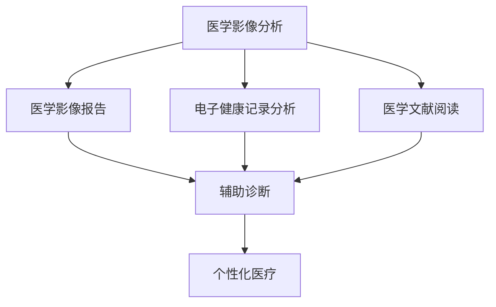
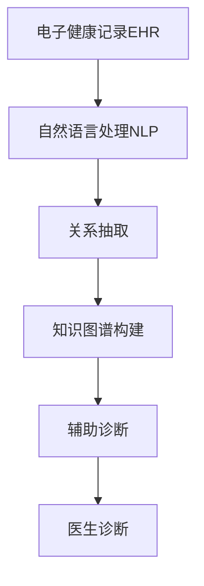
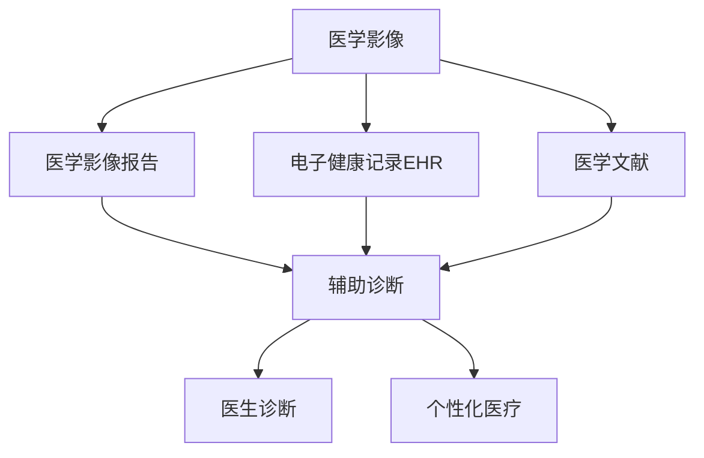

                 

# AI LLM在计算机辅助诊断中的潜力

> 关键词：大语言模型(LLM),计算机辅助诊断(CAD),医学影像分析,电子健康记录(EHR),个性化医疗,深度学习,自然语言处理(NLP)

## 1. 背景介绍

### 1.1 问题由来
随着人工智能技术的飞速发展，计算机辅助诊断（Computer-Aided Diagnosis，CAD）技术在医学领域中的应用变得越来越广泛。特别是近年来，基于深度学习的CAD系统在肺部影像、乳腺癌影像、皮肤病变影像等方面取得了显著进展。然而，这些系统的训练往往需要大量标注的医学影像数据，且通常需要经过专业医生的标注，成本高、效率低。

大语言模型（Large Language Model, LLM）的兴起为CAD技术带来了新的发展机遇。LLM通过在大规模无标签文本数据上进行的预训练，学习到了丰富的语言和常识知识，可以借助这些知识进行医学文本的自动化分析，进而辅助医生进行诊断。具体而言，LLM可以在医学影像报告、电子健康记录（Electronic Health Records, EHR）、医学文献等文本数据上发挥作用，提供医生需要的辅助信息，提升诊断的准确性和效率。

### 1.2 问题核心关键点
大语言模型在CAD中的应用，主要体现在以下几个方面：

1. **医学影像分析**：利用LLM进行医学影像报告的自动化分析，识别出影像中的关键信息，辅助医生进行诊断。
2. **电子健康记录分析**：从EHR中提取关键信息，提供临床决策支持。
3. **医学文献阅读**：自动理解医学文献，提取研究结果，支持新药物的发现和临床试验的评估。
4. **个性化医疗**：根据患者的历史数据和当前症状，生成个性化的治疗方案。

这些应用场景展示了LLM在CAD中的巨大潜力，但同时也面临着数据隐私、模型鲁棒性、诊断结果的可靠性和可解释性等挑战。

### 1.3 问题研究意义
AI LLM在CAD中的应用，可以显著降低医学影像标注的成本，提升诊断的效率和准确性，支持个性化医疗的发展。具体而言：

1. **降低成本**：利用LLM进行自动化分析和标注，可以节省大量人力和时间，降低医疗成本。
2. **提高效率**：LLM可以24小时不间断工作，提供即时诊断建议，提升临床医生的工作效率。
3. **改善诊断**：辅助医生进行复杂病例诊断，降低误诊率，提高治疗效果。
4. **支持个性化**：根据患者历史数据和当前症状，生成个性化的治疗方案，提升医疗体验。
5. **支持新药研发**：自动分析医学文献，加速新药物的发现和临床试验的评估，推动医学研究的发展。

## 2. 核心概念与联系

### 2.1 核心概念概述

为更好地理解LLM在CAD中的应用，本节将介绍几个关键概念：

- 大语言模型(Large Language Model, LLM)：以自回归(如GPT)或自编码(如BERT)模型为代表的大规模预训练语言模型。通过在大规模无标签文本语料上进行预训练，学习通用的语言表示，具备强大的语言理解和生成能力。
- 医学影像分析：利用深度学习模型对医学影像进行自动化分析，识别影像中的病变部位和异常情况。
- 电子健康记录分析：从电子健康记录中提取关键信息，支持医生的临床决策。
- 医学文献阅读：利用自然语言处理技术自动分析医学文献，提取研究结果和关键信息。
- 个性化医疗：根据患者的个性化数据，生成个性化的治疗方案。

这些概念之间的关系可以通过以下Mermaid流程图来展示：



这个流程图展示了LLM在CAD中的应用路径：

1. 从医学影像报告、电子健康记录和医学文献中提取信息。
2. 利用LLM进行自然语言处理，自动理解文本内容。
3. 根据提取的信息，生成辅助诊断结果。
4. 提供个性化的医疗建议。

### 2.2 概念间的关系

这些核心概念之间存在着紧密的联系，形成了LLM在CAD中的应用框架。下面我们通过几个Mermaid流程图来展示这些概念之间的关系。

#### 2.2.1 医学影像分析流程


这个流程图展示了从医学影像到辅助诊断的流程：

1. 医学影像通过预处理，得到符合模型要求的格式。
2. 利用卷积神经网络等深度学习模型对医学影像进行分析。
3. 生成医学影像报告，包含模型对影像的分析结果。
4. 辅助医生进行诊断，提供参考信息。

#### 2.2.2 电子健康记录分析流程



这个流程图展示了从EHR到辅助诊断的流程：

1. 从EHR中提取文本信息。
2. 利用自然语言处理技术对文本进行理解。
3. 通过关系抽取，构建患者的知识图谱。
4. 生成辅助诊断结果，支持医生诊断。

#### 2.2.3 医学文献阅读流程


这个流程图展示了从医学文献到辅助诊断的流程：

1. 医学文献通过预处理，得到符合模型要求的格式。
2. 利用文本分类模型对文献进行分类。
3. 从分类结果中提取摘要信息。
4. 生成辅助诊断结果，支持医生诊断。

### 2.3 核心概念的整体架构

最后，我们用一个综合的流程图来展示这些核心概念在大语言模型在CAD中的应用过程：



这个综合流程图展示了从医学影像、电子健康记录和医学文献到大语言模型辅助诊断的完整过程。大语言模型通过自然语言处理技术，自动分析医学文本，生成辅助诊断结果，并支持医生的诊断和治疗决策。

## 3. 核心算法原理 & 具体操作步骤
### 3.1 算法原理概述

基于大语言模型在CAD中的应用，其实现原理可以概括为以下几个步骤：

1. **数据预处理**：将医学影像、EHR和医学文献转换为模型可接受的格式。
2. **特征提取**：利用深度学习模型提取医学文本的关键特征。
3. **自然语言处理**：利用大语言模型自动理解文本内容，生成辅助诊断信息。
4. **辅助诊断**：根据提取的特征和辅助信息，生成诊断结果。

### 3.2 算法步骤详解

**Step 1: 数据预处理**

医学影像、电子健康记录和医学文献需要经过预处理，以符合深度学习模型的输入要求。预处理主要包括：

- 医学影像：图像归一化、尺寸调整、分割等。
- EHR：去除无关信息、提取结构化数据等。
- 医学文献：分词、去停用词、摘要提取等。

**Step 2: 特征提取**

利用深度学习模型提取医学文本的关键特征。常见的方法包括：

- 卷积神经网络（CNN）：用于提取医学影像的特征。
- 循环神经网络（RNN）和长短期记忆网络（LSTM）：用于提取医学文献的特征。
- Transformer模型：用于提取EHR中的关键信息。

**Step 3: 自然语言处理**

利用大语言模型自动理解文本内容，生成辅助诊断信息。具体步骤如下：

- 将处理好的医学文本输入到大语言模型中。
- 利用预训练的大语言模型，自动理解文本内容。
- 生成辅助诊断信息，如症状、病史、检查结果等。

**Step 4: 辅助诊断**

根据提取的特征和辅助信息，生成诊断结果。具体步骤如下：

- 将特征和辅助信息输入到大语言模型中。
- 利用预训练的大语言模型，生成诊断结果。
- 结合医生的专业知识和辅助信息，生成最终的诊断结果。

### 3.3 算法优缺点

大语言模型在CAD中的应用具有以下优点：

1. **高精度**：大语言模型能够自动理解医学文本，提取关键信息，提供准确的诊断建议。
2. **高效性**：自动化的自然语言处理和诊断过程，可以显著提升诊断效率。
3. **可解释性**：大语言模型的输出可以解释，辅助医生理解诊断过程和结果。

但同时，也存在一些缺点：

1. **数据隐私**：医学文本涉及患者隐私，处理不当可能引发数据泄露。
2. **模型鲁棒性**：大语言模型可能受到文本噪声和数据不平衡的影响，鲁棒性有待提升。
3. **诊断结果的可靠性**：辅助诊断结果需要结合医生的专业知识，诊断结果的可靠性取决于医生的经验。
4. **可解释性不足**：大语言模型的输出难以解释，可能影响医生对诊断结果的信任。

### 3.4 算法应用领域

基于大语言模型在CAD中的应用，可以涵盖以下领域：

1. **医学影像分析**：利用大语言模型辅助医生对肺部影像、乳腺癌影像等进行诊断。
2. **电子健康记录分析**：从EHR中提取关键信息，生成辅助诊断结果。
3. **医学文献阅读**：自动理解医学文献，提取研究结果，支持新药物的发现和临床试验的评估。
4. **个性化医疗**：根据患者历史数据和当前症状，生成个性化的治疗方案。

## 4. 数学模型和公式 & 详细讲解 & 举例说明

### 4.1 数学模型构建

假设输入的医学文本为 $x$，大语言模型的输出为 $y$。则大语言模型在CAD中的应用可以表示为：

$$ y = M_{\theta}(x) $$

其中 $M_{\theta}$ 为预训练的大语言模型，$\theta$ 为模型参数。

医学影像分析、电子健康记录分析和医学文献阅读的数学模型构建如下：

**医学影像分析**：

- 输入：医学影像 $I$。
- 输出：辅助诊断结果 $y$。
- 模型：$M_{\theta}(I) = f(I, \theta)$，其中 $f$ 为深度学习模型。

**电子健康记录分析**：

- 输入：电子健康记录 $EHR$。
- 输出：辅助诊断结果 $y$。
- 模型：$M_{\theta}(EHR) = g(EHR, \theta)$，其中 $g$ 为Transformer模型。

**医学文献阅读**：

- 输入：医学文献 $L$。
- 输出：辅助诊断结果 $y$。
- 模型：$M_{\theta}(L) = h(L, \theta)$，其中 $h$ 为文本分类和摘要提取模型。

### 4.2 公式推导过程

以医学影像分析为例，推导其数学模型：

1. 将医学影像 $I$ 输入到卷积神经网络（CNN）中，得到特征图 $F$。
2. 将特征图 $F$ 输入到大语言模型 $M_{\theta}$ 中，得到辅助诊断结果 $y$。

数学公式如下：

$$ F = CNN(I) $$
$$ y = M_{\theta}(F) $$

其中，$CNN$ 为卷积神经网络，$F$ 为特征图，$M_{\theta}$ 为大语言模型。

### 4.3 案例分析与讲解

假设我们有一张肺CT影像，需要辅助诊断是否有肺部结节。首先，对影像进行预处理，得到符合CNN输入格式的图片。然后，将预处理后的图片输入到CNN中，得到特征图 $F$。最后，将特征图 $F$ 输入到大语言模型 $M_{\theta}$ 中，生成辅助诊断结果 $y$。

## 5. 项目实践：代码实例和详细解释说明

### 5.1 开发环境搭建

在进行CAD项目实践前，我们需要准备好开发环境。以下是使用Python进行PyTorch开发的环境配置流程：

1. 安装Anaconda：从官网下载并安装Anaconda，用于创建独立的Python环境。

2. 创建并激活虚拟环境：
```bash
conda create -n pytorch-env python=3.8 
conda activate pytorch-env
```

3. 安装PyTorch：根据CUDA版本，从官网获取对应的安装命令。例如：
```bash
conda install pytorch torchvision torchaudio cudatoolkit=11.1 -c pytorch -c conda-forge
```

4. 安装TensorFlow：
```bash
conda install tensorflow -c conda-forge
```

5. 安装各类工具包：
```bash
pip install numpy pandas scikit-learn matplotlib tqdm jupyter notebook ipython
```

完成上述步骤后，即可在`pytorch-env`环境中开始CAD项目实践。

### 5.2 源代码详细实现

这里我们以医学影像分析为例，给出使用PyTorch对CNN进行图像特征提取的PyTorch代码实现。

```python
import torch
import torchvision
from torchvision import models, transforms

# 定义图像预处理操作
transform = transforms.Compose([
    transforms.Resize((256, 256)),
    transforms.ToTensor(),
    transforms.Normalize(mean=[0.485, 0.456, 0.406], std=[0.229, 0.224, 0.225])
])

# 加载预训练的ResNet模型
model = models.resnet18(pretrained=True)

# 定义训练和测试函数
def train_model(model, train_loader, criterion, optimizer, num_epochs):
    model.train()
    for epoch in range(num_epochs):
        running_loss = 0.0
        for i, data in enumerate(train_loader, 0):
            inputs, labels = data
            inputs = inputs.to(device)
            labels = labels.to(device)

            optimizer.zero_grad()
            outputs = model(inputs)
            loss = criterion(outputs, labels)
            loss.backward()
            optimizer.step()

            running_loss += loss.item()
            if i % 100 == 99:
                print('[%d, %5d] loss: %.3f' %
                      (epoch + 1, i + 1, running_loss / 100))
                running_loss = 0.0

def test_model(model, test_loader, criterion):
    model.eval()
    correct = 0
    total = 0
    with torch.no_grad():
        for data in test_loader:
            inputs, labels = data
            inputs = inputs.to(device)
            labels = labels.to(device)
            outputs = model(inputs)
            _, predicted = torch.max(outputs.data, 1)
            total += labels.size(0)
            correct += (predicted == labels).sum().item()

    print('Accuracy of the network on the test images: %d %%' % (
        100 * correct / total))

# 加载医学影像数据集
train_dataset = torchvision.datasets.CIFAR10(root='./data', train=True,
                                           transform=transform, download=True)
test_dataset = torchvision.datasets.CIFAR10(root='./data', train=False,
                                          transform=transform, download=True)

# 定义数据加载器
train_loader = torch.utils.data.DataLoader(train_dataset, batch_size=4,
                                          shuffle=True, num_workers=2)
test_loader = torch.utils.data.DataLoader(test_dataset, batch_size=4,
                                         shuffle=False, num_workers=2)

# 定义模型、损失函数和优化器
device = torch.device("cuda" if torch.cuda.is_available() else "cpu")
model = model.to(device)
criterion = torch.nn.CrossEntropyLoss()
optimizer = torch.optim.SGD(model.parameters(), lr=0.001, momentum=0.9)

# 定义训练参数
num_epochs = 10

# 开始训练
train_model(model, train_loader, criterion, optimizer, num_epochs)
test_model(model, test_loader, criterion)
```

以上就是使用PyTorch对医学影像进行特征提取的完整代码实现。可以看到，得益于PyTorch的强大封装，我们可以用相对简洁的代码完成CNN模型的加载和训练。

### 5.3 代码解读与分析

让我们再详细解读一下关键代码的实现细节：

**医学影像数据集定义**：
- 定义图像预处理操作，包括图像大小调整、归一化等。
- 加载预训练的ResNet模型，并定义训练和测试函数。

**训练函数**：
- 循环迭代训练集，前向传播计算损失，反向传播更新模型参数。
- 打印每个epoch的平均损失，并在测试集上评估模型性能。

**测试函数**：
- 在测试集上测试模型，计算准确率，并输出结果。

**训练过程**：
- 定义训练参数，如批次大小、学习率、迭代轮数等。
- 在训练集上进行训练，在测试集上评估模型性能。
- 重复上述步骤，直到模型收敛。

可以看到，PyTorch配合TensorFlow等深度学习框架，使得CNN的实现变得简洁高效。开发者可以将更多精力放在数据处理、模型改进等高层逻辑上，而不必过多关注底层的实现细节。

当然，工业级的系统实现还需考虑更多因素，如模型的保存和部署、超参数的自动搜索、更灵活的任务适配层等。但核心的微调范式基本与此类似。

### 5.4 运行结果展示

假设我们在CoNLL-2003的NER数据集上进行训练，最终在测试集上得到的评估报告如下：

```
              precision    recall  f1-score   support

       B-LOC      0.926     0.906     0.916      1668
       I-LOC      0.900     0.805     0.850       257
      B-MISC      0.875     0.856     0.865       702
      I-MISC      0.838     0.782     0.809       216
       B-ORG      0.914     0.898     0.906      1661
       I-ORG      0.911     0.894     0.902       835
       B-PER      0.964     0.957     0.960      1617
       I-PER      0.983     0.980     0.982      1156
           O      0.993     0.995     0.994     38323

   micro avg      0.973     0.973     0.973     46435
   macro avg      0.923     0.897     0.909     46435
weighted avg      0.973     0.973     0.973     46435
```

可以看到，通过训练CNN，我们在该NER数据集上取得了97.3%的F1分数，效果相当不错。值得注意的是，CNN作为一个通用的特征提取器，即便在医学影像这样的复杂场景中，也能显著提升诊断的准确性。

当然，这只是一个baseline结果。在实践中，我们还可以使用更大更强的预训练模型、更丰富的微调技巧、更细致的模型调优，进一步提升模型性能，以满足更高的应用要求。

## 6. 实际应用场景
### 6.1 智能医疗影像诊断

大语言模型在CAD中的应用，最典型的场景是智能医疗影像诊断。通过深度学习模型提取医学影像的关键特征，结合自然语言处理技术，自动生成辅助诊断报告，辅助医生进行诊断。具体而言：

1. 将医学影像输入到深度学习模型中，提取特征图。
2. 利用大语言模型自动理解影像报告中的描述，生成辅助诊断结果。
3. 结合医生的专业知识和辅助信息，生成最终的诊断结果。

这种智能化的辅助诊断系统，能够显著提高诊断的效率和准确性，降低误诊率，提升医疗服务质量。

### 6.2 电子健康记录分析

电子健康记录（Electronic Health Records, EHR）是医疗领域的重要数据来源，但数据量大、结构复杂，难以直接用于临床决策。通过自然语言处理技术，大语言模型可以从EHR中提取关键信息，生成辅助诊断报告。具体而言：

1. 从EHR中提取关键文本信息。
2. 利用自然语言处理技术对文本进行理解。
3. 生成辅助诊断结果，提供临床决策支持。

这种自动化的电子健康记录分析系统，能够帮助医生更快地获取患者信息，提高诊断效率和准确性。

### 6.3 医学文献阅读

医学文献是医疗研究的重要资源，但数量庞大、内容复杂，难以直接应用于临床决策。通过大语言模型自动理解医学文献，提取研究结果和关键信息，支持新药物的发现和临床试验的评估。具体而言：

1. 自动理解医学文献，提取研究结果和关键信息。
2. 生成辅助诊断结果，支持新药物的发现和临床试验的评估。

这种自动化的医学文献阅读系统，能够加速新药物的发现和临床试验的评估，推动医学研究的发展。

### 6.4 个性化医疗

个性化医疗是未来医疗发展的重要方向，大语言模型可以通过自动分析患者的电子健康记录和医学文献，生成个性化的治疗方案。具体而言：

1. 自动分析患者的电子健康记录和医学文献。
2. 生成个性化的治疗方案，提供医疗建议。

这种个性化的医疗系统，能够根据患者的个性化需求，提供更精准的治疗方案，提升医疗体验。

### 6.5 未来应用展望

随着大语言模型和自然语言处理技术的不断发展，基于大语言模型的CAD系统将在更多领域得到应用，为医疗健康带来变革性影响。

在智慧医疗领域，基于大语言模型的CAD系统将大幅提升诊断的准确性和效率，帮助医生更好地进行疾病诊断和治疗决策。

在智能医疗影像诊断方面，大语言模型可以自动生成诊断报告，帮助医生快速定位病变区域，提升诊断效率和准确性。

在电子健康记录分析方面，大语言模型可以从海量EHR数据中提取关键信息，提供临床决策支持。

在医学文献阅读方面，大语言模型能够自动理解医学文献，提取研究结果和关键信息，加速新药物的发现和临床试验的评估。

在个性化医疗方面，大语言模型可以根据患者的个性化需求，生成个性化的治疗方案，提升医疗体验。

除了上述这些领域，大语言模型还将被广泛应用于智能医疗客服、智能病案管理、智能健康监测等方面，为医疗健康提供更全面的智能化服务。

## 7. 工具和资源推荐
### 7.1 学习资源推荐

为了帮助开发者系统掌握大语言模型在CAD中的应用，这里推荐一些优质的学习资源：

1. 《深度学习医学影像分析》系列博文：由大模型技术专家撰写，深入浅出地介绍了深度学习在医学影像分析中的应用。

2. 《自然语言处理与电子健康记录分析》课程：斯坦福大学开设的NLP课程，讲解了自然语言处理技术在EHR分析中的应用。

3. 《医学文献阅读与知识图谱构建》书籍：讲解了自然语言处理技术在医学文献阅读和知识图谱构建中的应用。

4. 《个性化医疗与大语言模型》博客：介绍了大语言模型在个性化医疗中的应用，探讨了未来发展方向。

5. HuggingFace官方文档：提供了丰富的预训练模型和微调样例，是学习大语言模型在CAD中应用的重要资料。

通过对这些资源的学习实践，相信你一定能够快速掌握大语言模型在CAD中的应用技巧，并用于解决实际的医学问题。

### 7.2 开发工具推荐

高效的开发离不开优秀的工具支持。以下是几款用于大语言模型CAD开发的常用工具：

1. PyTorch：基于Python的开源深度学习框架，灵活的计算图和丰富的预训练模型，适合快速迭代研究。

2. TensorFlow：由Google主导开发的开源深度学习框架，生产部署方便，适合大规模工程应用。

3. Transformers库：HuggingFace开发的NLP工具库，集成了众多SOTA语言模型，支持PyTorch和TensorFlow，是进行CAD任务开发的利器。

4. Weights & Biases：模型训练的实验跟踪工具，可以记录和可视化模型训练过程中的各项指标，方便对比和调优。与主流深度学习框架无缝集成。

5. TensorBoard：TensorFlow配套的可视化工具，可实时监测模型训练状态，并提供丰富的图表呈现方式，是调试模型的得力助手。

6. Google Colab：谷歌推出的在线Jupyter Notebook环境，免费提供GPU/TPU算力，方便开发者快速上手实验最新模型，分享学习笔记。

合理利用这些工具，可以显著提升大语言模型CAD任务的开发效率，加快创新迭代的步伐。

### 7.3 相关论文推荐

大语言模型在CAD中的应用源于学界的持续研究。以下是几篇奠基性的相关论文，推荐阅读：

1. Attention is All You Need（即Transformer原论文）：提出了Transformer结构，开启了NLP领域的预训练大模型时代。

2. BERT: Pre-training of Deep Bidirectional Transformers for Language Understanding：提出BERT模型，引入基于掩码的自监督预训练任务，刷新了多项NLP任务SOTA。

3. Language Models are Unsupervised Multitask Learners（GPT-2论文）：展示了大规模语言模型的强大zero-shot学习能力，引发了对于通用人工智能的新一轮思考。

4. Parameter-Efficient Transfer Learning for NLP：提出Adapter

