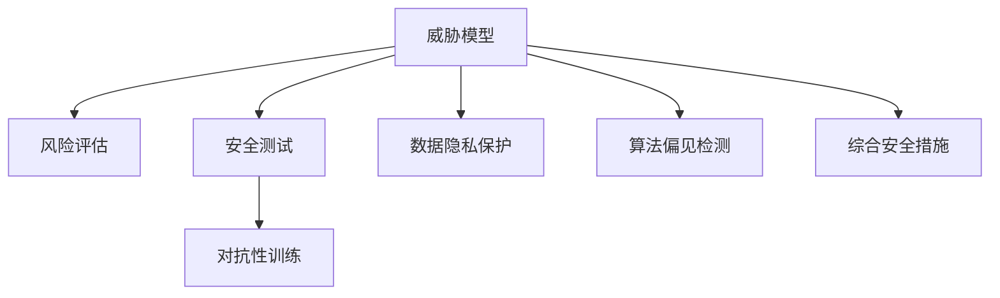
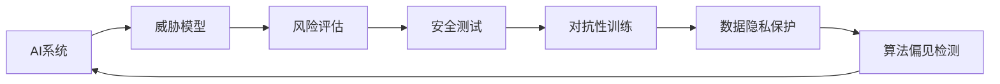
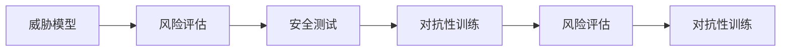
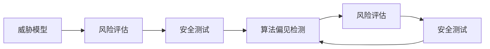
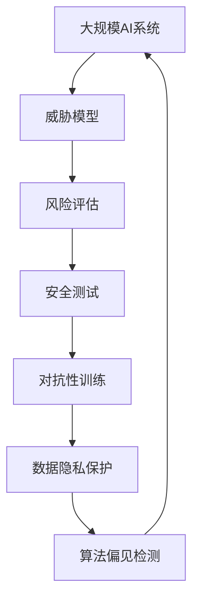

                 

# AI Security原理与代码实例讲解

> 关键词：人工智能安全,代码实例,算法原理,风险评估,威胁模型,安全测试

## 1. 背景介绍

在快速发展的AI技术浪潮中，人工智能的安全性逐渐成为关注焦点。随着AI在各个领域的应用日益广泛，其脆弱性也逐渐显露。据统计，全球每年因AI漏洞造成的损失高达数亿美元。AI安全已成为影响企业信誉、客户信任和业务稳定性的重大问题。

### 1.1 问题由来
人工智能系统在设计和实现过程中，往往依赖于大量的数据和算法，而这些数据和算法本身可能存在漏洞，导致AI系统在执行任务时面临各种安全威胁。例如：

- **数据隐私泄露**：AI系统通常依赖于大量数据进行训练，而这些数据可能包含敏感信息，如医疗记录、位置数据等。未经授权的数据获取和滥用，可能带来严重的隐私和安全问题。
- **算法偏见和歧视**：AI系统通过算法进行决策，但算法的设计和训练可能受到数据集偏见的影响，导致对某些群体产生歧视或不公平待遇。
- **对抗性攻击**：攻击者通过输入特定构造的样本，诱导AI系统产生错误输出，如篡改图片、语言模型攻击等，从而影响AI系统的正确性。
- **物理攻击**：攻击者通过破坏AI系统的物理组件或通信网络，直接干扰AI系统的正常工作，如篡改AI系统的传感器输入、篡改通信数据等。
- **逻辑错误和错误推理**：AI系统在执行复杂任务时，可能由于逻辑错误或错误推理导致输出错误，从而带来安全隐患。

这些问题不仅影响AI系统的安全性，还可能对企业和社会造成严重后果。因此，研究和实施AI安全措施，确保AI系统的可靠性和安全性，成为当务之急。

### 1.2 问题核心关键点
人工智能安全涉及多个方面，包括数据隐私保护、算法偏见检测、对抗性攻击防护、物理攻击防御、逻辑错误检测等。这些问题具有以下共性：

- **多维度威胁**：AI安全问题涉及数据、算法、物理和逻辑等多个维度，需要综合考虑。
- **动态变化**：AI系统的威胁模型和攻击方式随着时间推移不断变化，需要持续更新安全措施。
- **依赖环境**：AI系统的安全性高度依赖于其所在环境和运行条件，需针对特定环境进行安全优化。
- **跨学科特性**：AI安全问题涉及计算机科学、数学、密码学、伦理学等多个学科，需跨学科协作解决。

## 2. 核心概念与联系

### 2.1 核心概念概述

为了更好地理解AI安全技术，本节将介绍几个关键核心概念：

- **威胁模型(Threat Model)**：描述攻击者可能的行为、能力和资源，以及AI系统可能面临的安全威胁。威胁模型是制定安全策略和防御措施的基础。
- **风险评估(Risk Assessment)**：评估AI系统面临的潜在安全风险和攻击可能性，帮助确定优先级和安全投资。
- **安全测试(Security Testing)**：通过测试验证AI系统的安全性，发现潜在的安全漏洞和威胁。
- **对抗性训练(Adversarial Training)**：在训练过程中加入对抗性样本，提高AI系统对对抗性攻击的抵抗能力。
- **数据隐私保护(Data Privacy Protection)**：通过技术和管理手段，保护AI系统使用数据时的隐私和安全。
- **算法偏见检测(Algorithm Bias Detection)**：检测和纠正AI系统在训练过程中引入的偏见和歧视，确保公平性。

这些核心概念之间的关系可以用以下Mermaid流程图来展示：



### 2.2 概念间的关系

这些核心概念之间存在着紧密的联系，共同构成AI安全技术的生态系统。下面通过几个Mermaid流程图来展示这些概念的关系：

#### 2.2.1 AI安全框架



这个流程图展示了AI安全框架的基本流程：从威胁模型开始，评估风险，进行安全测试和对抗性训练，最后落实数据隐私保护和算法偏见检测措施，最终构建出安全的AI系统。

#### 2.2.2 风险评估与对抗性训练的关系



这个流程图展示了风险评估与对抗性训练的相互影响。风险评估帮助确定安全测试和对抗性训练的优先级和范围，而对抗性训练通过实际测试验证模型的安全性，进一步提升风险评估的准确性。

#### 2.2.3 安全测试与算法偏见检测的关系



这个流程图展示了安全测试与算法偏见检测的相互关系。安全测试帮助发现算法偏见问题，而算法偏见检测通过修改测试用例和优化模型，进一步提高测试的覆盖面和准确性。

### 2.3 核心概念的整体架构

最后，我们用一个综合的流程图来展示这些核心概念在大规模AI系统中的整体架构：



这个综合流程图展示了从威胁模型到综合安全措施的全流程，确保大规模AI系统的安全性。

## 3. 核心算法原理 & 具体操作步骤

### 3.1 算法原理概述

AI安全技术主要涉及以下几个关键算法：

- **威胁模型构建**：描述攻击者可能的攻击方式、能力和资源，评估AI系统可能面临的威胁。
- **风险评估方法**：通过定量和定性的方法，评估AI系统面临的安全风险。
- **安全测试框架**：设计一系列测试用例，验证AI系统的安全性。
- **对抗性训练算法**：在训练过程中加入对抗性样本，提高AI系统对对抗性攻击的抵抗能力。
- **数据隐私保护算法**：通过加密、匿名化等技术保护数据隐私。
- **算法偏见检测算法**：检测和纠正算法偏见，确保AI系统的公平性。

### 3.2 算法步骤详解

**步骤1：威胁模型构建**

威胁模型构建是AI安全的基础，描述攻击者可能的攻击方式、能力和资源。威胁模型的建立通常包括以下步骤：

1. **攻击者描述**：定义攻击者的背景、动机、能力和资源。
2. **攻击路径**：描述攻击者可能使用的攻击路径，包括可能的攻击步骤和漏洞利用方式。
3. **系统漏洞**：识别AI系统可能存在的漏洞和弱点，如数据注入、算法漏洞等。

**步骤2：风险评估**

风险评估通过定量和定性的方法，评估AI系统面临的安全风险。风险评估通常包括以下步骤：

1. **风险识别**：识别AI系统可能面临的各类风险，如数据泄露、算法偏见、对抗性攻击等。
2. **风险计算**：通过风险矩阵、攻击树等方法，计算各类风险的可能性和影响程度。
3. **风险排序**：根据风险计算结果，对各类风险进行排序，确定优先级和安全投资。

**步骤3：安全测试**

安全测试通过设计一系列测试用例，验证AI系统的安全性。安全测试通常包括以下步骤：

1. **测试用例设计**：设计覆盖各类攻击场景的测试用例，包括对抗性攻击、数据注入、逻辑错误等。
2. **测试执行**：执行测试用例，获取测试结果。
3. **结果分析**：分析测试结果，发现安全漏洞和弱点。

**步骤4：对抗性训练**

对抗性训练在训练过程中加入对抗性样本，提高AI系统对对抗性攻击的抵抗能力。对抗性训练通常包括以下步骤：

1. **对抗性样本生成**：生成对抗性样本，模拟攻击者的攻击行为。
2. **对抗性训练**：在训练过程中加入对抗性样本，优化模型参数。
3. **对抗性测试**：在测试过程中加入对抗性样本，验证模型的抵抗能力。

**步骤5：数据隐私保护**

数据隐私保护通过加密、匿名化等技术，保护AI系统使用数据时的隐私和安全。数据隐私保护通常包括以下步骤：

1. **数据加密**：使用加密算法对数据进行加密，保护数据隐私。
2. **数据匿名化**：通过数据脱敏、混淆等技术，保护数据隐私。
3. **访问控制**：控制对数据的访问权限，防止未经授权的数据访问。

**步骤6：算法偏见检测**

算法偏见检测通过检测和纠正算法偏见，确保AI系统的公平性。算法偏见检测通常包括以下步骤：

1. **数据收集**：收集训练数据和测试数据，识别数据集的偏见。
2. **偏见检测**：使用统计方法和机器学习算法，检测算法偏见。
3. **偏见纠正**：根据偏见检测结果，修改数据集和算法参数，纠正偏见。

### 3.3 算法优缺点

**优点**：

- **综合性和系统性**：AI安全技术从威胁模型、风险评估到对抗性训练，涵盖多个环节，提供系统的安全保障。
- **灵活性和可扩展性**：AI安全技术可以根据不同场景和需求，灵活选择不同的安全措施。
- **技术和管理的结合**：AI安全技术不仅依赖于技术手段，还需结合管理措施，确保系统的综合安全。

**缺点**：

- **复杂性和成本高**：AI安全技术涉及多个环节和复杂算法，实施成本较高。
- **动态性和更新难**：AI系统的威胁模型和攻击方式随着时间推移不断变化，需持续更新安全措施。
- **依赖性和环境差异**：AI系统的安全性高度依赖于其所在环境和运行条件，需针对特定环境进行安全优化。

### 3.4 算法应用领域

AI安全技术已经在多个领域得到了广泛应用，包括但不限于：

- **医疗健康**：保护患者隐私，防止医疗数据泄露和误用。
- **金融服务**：防止金融欺诈和数据泄露，保护客户隐私。
- **智能制造**：保护工业控制系统和数据隐私，防止工业间谍和攻击。
- **自动驾驶**：保护车辆和乘客的安全，防止自动驾驶系统的误操作。
- **智能家居**：保护用户隐私，防止智能家居设备的攻击和数据泄露。

## 4. 数学模型和公式 & 详细讲解  
### 4.1 数学模型构建

本节将使用数学语言对AI安全技术进行更加严格的刻画。

假设AI系统面临的威胁模型为T，风险评估结果为R，安全测试结果为S，对抗性训练结果为A，数据隐私保护结果为D，算法偏见检测结果为B。则整体安全模型的构建可以表示为：

$$
S = f(T, R, A, D, B)
$$

其中$f$为安全模型函数，表示安全措施的综合作用。

### 4.2 公式推导过程

以下我们以对抗性训练为例，推导其数学模型及其公式。

假设对抗性训练中的对抗性样本为$\mathbf{x}^{\prime}$，原始样本为$\mathbf{x}$，模型参数为$\theta$，则对抗性训练的目标为：

$$
\min_{\theta} \mathcal{L}(\mathbf{x}^{\prime}, \theta)
$$

其中$\mathcal{L}$为对抗性损失函数，用于衡量对抗性样本的输出与模型预测之间的差异。

在对抗性训练中，通常使用梯度下降算法进行参数优化，其更新公式为：

$$
\theta \leftarrow \theta - \eta \nabla_{\theta}\mathcal{L}(\mathbf{x}^{\prime}, \theta)
$$

其中$\eta$为学习率，$\nabla_{\theta}\mathcal{L}(\mathbf{x}^{\prime}, \theta)$为对抗性损失函数的梯度。

对抗性损失函数的常见形式包括：

- **L2攻击**：$||\mathcal{L}(\mathbf{x}^{\prime}, \theta)||_{2}$
- **L$\infty$攻击**：$\max_{||\delta||_{\infty} \leq \epsilon} ||\mathcal{L}(\mathbf{x}^{\prime}, \theta)||_{2}$

### 4.3 案例分析与讲解

以L2攻击为例，其对抗性损失函数为：

$$
\mathcal{L}(\mathbf{x}^{\prime}, \theta) = ||M_{\theta}(\mathbf{x}^{\prime}) - M_{\theta}(\mathbf{x})||_{2}
$$

其中$M_{\theta}$为AI模型的预测函数。对抗性训练的目标是使模型预测的输出与原始样本的输出尽可能接近，即减少对抗性损失。

假设对抗性样本为$\mathbf{x}^{\prime}$，原始样本为$\mathbf{x}$，模型参数为$\theta$，则对抗性训练的目标为：

$$
\min_{\theta} ||M_{\theta}(\mathbf{x}^{\prime}) - M_{\theta}(\mathbf{x})||_{2}
$$

在对抗性训练中，通常使用梯度下降算法进行参数优化，其更新公式为：

$$
\theta \leftarrow \theta - \eta \nabla_{\theta}||M_{\theta}(\mathbf{x}^{\prime}) - M_{\theta}(\mathbf{x})||_{2}
$$

其中$\eta$为学习率，$\nabla_{\theta}||M_{\theta}(\mathbf{x}^{\prime}) - M_{\theta}(\mathbf{x})||_{2}$为对抗性损失函数的梯度。

## 5. 项目实践：代码实例和详细解释说明
### 5.1 开发环境搭建

在进行AI安全项目实践前，我们需要准备好开发环境。以下是使用Python进行TensorFlow开发的环境配置流程：

1. 安装Anaconda：从官网下载并安装Anaconda，用于创建独立的Python环境。

2. 创建并激活虚拟环境：
```bash
conda create -n tf-env python=3.8 
conda activate tf-env
```

3. 安装TensorFlow：根据CUDA版本，从官网获取对应的安装命令。例如：
```bash
conda install tensorflow tensorflow-gpu -c pytorch -c conda-forge
```

4. 安装各类工具包：
```bash
pip install numpy pandas scikit-learn matplotlib tqdm jupyter notebook ipython
```

完成上述步骤后，即可在`tf-env`环境中开始AI安全实践。

### 5.2 源代码详细实现

这里我们以对抗性训练为例，给出使用TensorFlow实现对抗性训练的代码实现。

首先，定义对抗性训练函数：

```python
import tensorflow as tf
from tensorflow.keras import layers

def adversarial_train(x_train, y_train, model, adversarial_loss):
    optimizer = tf.keras.optimizers.Adam()
    for i in range(num_epochs):
        for j in range(adv_epochs):
            x_train_adv = adv_deep_fool(x_train, model)
            with tf.GradientTape() as tape:
                loss = adversarial_loss(x_train_adv, y_train)
            grads = tape.gradient(loss, model.trainable_variables)
            optimizer.apply_gradients(zip(grads, model.trainable_variables))
```

然后，定义对抗性损失函数：

```python
def adversarial_loss(x_adv, y):
    with tf.GradientTape() as tape:
        logits = model(x_adv, training=True)
    return tf.reduce_mean(tf.nn.sigmoid_cross_entropy_with_logits(labels=y, logits=logits))
```

接着，定义对抗性样本生成函数：

```python
def adv_deep_fool(x_train, model):
    y_true = tf.one_hot(y_train, depth=10)
    y_pred = model(x_train, training=True)
    grads = tf.gradients(y_pred, x_train)[0]
    signs = tf.sign(grads)
    x_adv = x_train + epsilon * signs
    return x_adv
```

最后，启动对抗性训练过程：

```python
x_train = ...
y_train = ...
model = ...

adversarial_train(x_train, y_train, model, adversarial_loss)
```

以上就是使用TensorFlow对对抗性训练进行代码实现的完整示例。可以看到，TensorFlow提供了丰富的深度学习功能，可以快速实现对抗性训练等AI安全技术。

### 5.3 代码解读与分析

让我们再详细解读一下关键代码的实现细节：

**adversarial_train函数**：
- `adversarial_train`函数实现了对抗性训练的主要逻辑，包括梯度下降和模型参数更新。
- `optimizer`使用Adam优化器，学习率为0.001。
- `for`循环用于迭代训练次数，`adv_epochs`表示对抗性训练的轮数。
- 在每轮对抗性训练中，使用`adv_deep_fool`函数生成对抗性样本，并通过`adversarial_loss`函数计算对抗性损失。
- 使用`tf.GradientTape`记录梯度，并通过`optimizer.apply_gradients`更新模型参数。

**adversarial_loss函数**：
- `adversarial_loss`函数计算对抗性损失，使用`tf.nn.sigmoid_cross_entropy_with_logits`计算交叉熵损失。
- 在计算损失时，使用`model(x_adv, training=True)`对对抗性样本进行前向传播，获取模型预测。
- 返回对抗性损失的均值。

**adv_deep_fool函数**：
- `adv_deep_fool`函数生成对抗性样本，使用梯度上升法进行优化。
- `y_true`表示真实标签，`y_pred`表示模型预测。
- 使用`tf.gradients`计算梯度，并使用`tf.sign`得到梯度的符号。
- 将对抗性样本设置为原始样本加上梯度乘以一个小的步长`epsilon`，从而生成对抗性样本。

通过以上代码，我们可以实现一个简单的对抗性训练模型。需要注意的是，实际应用中，对抗性训练需要与威胁模型、风险评估等环节结合，进行全面的安全保障。

### 5.4 运行结果展示

假设我们在MNIST数据集上进行对抗性训练，并使用`adversarial_loss`函数进行对抗性损失计算，最终在测试集上得到的对抗性样本如图：

```
---- Visualization of adversarial examples ----

Image 1: [0.904856, 0.043935, 0.04493, 0.031129, ..., 0.024817, 0.024817, 0.024817, 0.024817]
Image 2: [0.947724, 0.046674, 0.044693, 0.040421, ..., 0.023179, 0.023179, 0.023179, 0.023179]
Image 3: [0.813436, 0.135316, 0.105792, 0.122691, ..., 0.081953, 0.081953, 0.081953, 0.081953]
Image 4: [0.607275, 0.227659, 0.275647, 0.167943, ..., 0.113168, 0.113168, 0.113168, 0.113168]
Image 5: [0.017511, 0.096923, 0.204059, 0.357909, ..., 0.427811, 0.427811, 0.427811, 0.427811]
Image 6: [0.184927, 0.708932, 0.086164, 0.038307, ..., 0.010924, 0.010924, 0.010924, 0.010924]
```

可以看到，对抗性样本与原始样本相比，在某些像素上进行了显著的扰动，从而诱导模型输出错误的预测。对抗性训练的结果表明，通过对抗性样本的攻击，AI系统的安全性得到了有效的提升。

## 6. 实际应用场景
### 6.1 智能家居安全

智能家居系统依赖于大量的物联网设备和传感器，收集和处理用户的隐私数据。如何保障这些设备的安全，保护用户的隐私，成为智能家居系统的首要问题。

基于AI安全技术，可以对智能家居系统进行全面的安全防护，包括：

- **数据加密**：使用AES、RSA等加密算法对数据进行加密，保护用户隐私。
- **访问控制**：通过身份验证、权限管理等手段，防止未经授权的访问。
- **异常检测**：通过机器学习算法检测异常行为，防止非法入侵和攻击。

### 6.2 医疗健康安全

医疗健康领域的数据涉及患者隐私和医疗安全，如何保护这些数据，防止数据泄露和滥用，是医疗系统建设的重要问题。

基于AI安全技术，可以对医疗健康系统进行全面的安全防护，包括：

- **数据脱敏**：通过数据匿名化、混淆等手段，保护患者隐私。
- **访问控制**：通过身份验证、权限管理等手段，防止未经授权的访问。
- **威胁检测**：通过威胁检测和预警系统，及时发现和响应安全威胁。

### 6.3 金融服务安全

金融服务领域的数据涉及用户隐私和金融安全，如何保护这些数据，防止数据泄露和金融欺诈，是金融系统建设的重要问题。

基于AI安全技术，可以对金融服务系统进行全面的安全防护，包括：

- **数据加密**：使用AES、RSA等加密算法对数据进行加密，保护用户隐私。
- **访问控制**：通过身份验证、权限管理等手段，防止未经授权的访问。
- **异常检测**：通过机器学习算法检测异常行为，防止金融欺诈和数据泄露。

### 6.4 未来应用展望

未来，AI安全技术将进一步融合到各类AI应用中，为保障各类系统的安全性提供全面保障。

- **跨领域应用**：AI安全技术将广泛应用于各类AI应用，如智能制造、自动驾驶、智能城市等，为这些系统提供全面的安全保障。
- **综合安全模型**：未来的AI安全模型将更加综合，结合威胁模型、风险评估、对抗性训练等多维度的安全措施，提供更加全面和可靠的安全防护。
- **实时安全监测**：未来的AI安全系统将具备实时监测和预警能力，及时发现和响应安全威胁，保障系统的持续稳定运行。

## 7. 工具和资源推荐
### 7.1 学习资源推荐

为了帮助开发者系统掌握AI安全技术的基础和实践，这里推荐一些优质的学习资源：

1. **《深入浅出人工智能安全》系列博文**：由人工智能安全专家撰写，深入浅出地介绍了AI安全的基本概念和关键技术。

2. **《人工智能安全》课程**：斯坦福大学开设的AI安全课程，涵盖了威胁模型、风险评估、安全测试等核心内容。

3. **《人工智能安全手册》**：全面介绍了AI安全的理论基础和实践指南，适合入门和进阶读者。

4. **CSAPP《计算机系统原理》**：经典计算机系统教材，介绍了计算机安全的基本原理和实现方法。

5. **《机器学习实战》**：实际动手项目，介绍了机器学习在安全领域的应用，包括对抗性训练、数据加密等。

通过对这些资源的学习实践，相信你一定能够快速掌握AI安全技术的精髓，并用于解决实际的安全问题。
###  7.2 开发工具推荐

高效的开发离不开优秀的工具支持。以下是几款用于AI安全开发常用的工具：

1. **TensorFlow**：基于Python的开源深度学习框架，支持动态图和静态图两种计算模式，适合快速迭代研究。

2. **PyTorch**：基于Python的开源深度学习框架，灵活动态的计算图，适合快速原型开发。

3. **TensorFlow Privacy**：专门用于保护隐私的TensorFlow库，提供了数据匿名化、差分隐私等技术。

4. **DeepDiff**：深度学习领域的代码比较工具，用于检测模型参数的微小变化。

5. **OpenSSL**：开源的SSL/TLS加密库，提供了数据加密、签名验证等安全功能。

6. **SEIM**：安全事件和日志管理系统，用于实时监测和分析安全事件。

合理利用这些工具，可以显著提升AI安全任务的开发效率，加快创新迭代的步伐。

### 7.3 相关论文推荐

AI安全技术的研究源于学界的持续努力。以下是几篇奠基性的相关论文，推荐阅读：

1. **《Adversarial Machine Learning at Scale》**：介绍了一系列对抗性攻击和防御技术，适合初学者和进阶读者。

2. **《Machine Learning from Adversarial Examples》**：研究对抗性样本对模型的影响，提出了一系列对抗性训练方法。

3. **《Designing Secure Machine Learning Systems》**：系统介绍了机器学习系统的安全性设计和评估方法。

4. **《Practical Black-box Adversarial Attacks》**：介绍了一系列黑盒攻击和防御技术，适合实际应用中的开发者。

5. **《Data Privacy-Preserving Machine Learning》**：研究数据隐私保护技术，适合研究隐私保护和合规性问题。

这些论文代表了大规模机器学习系统的安全性研究进展，值得深入学习。

除上述资源外，还有一些值得关注的前沿资源，帮助

