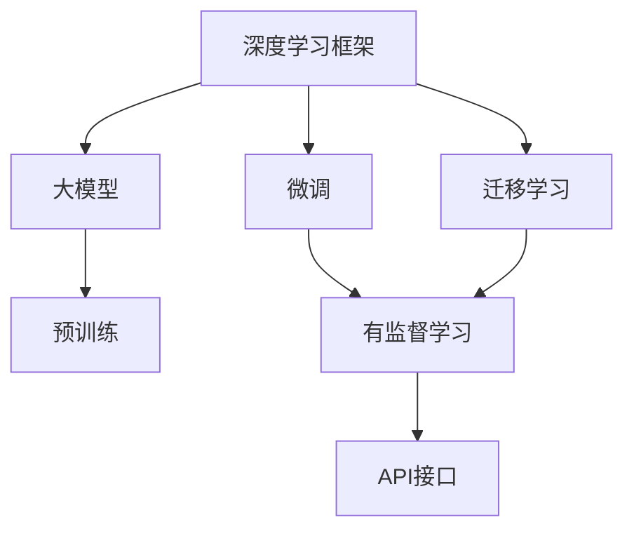

                 

# AI 大模型创业：如何利用创新优势？

大模型技术的快速发展不仅推动了AI的落地应用，也催生了大量创业机会。但如何在大模型领域取得突破，构建具有竞争力的创业项目，仍是许多创业者的难题。本文将深入探讨AI大模型创业的战略与策略，详细分析如何在激烈的市场竞争中利用技术创新优势，成功打造可持续发展的AI大模型创业企业。

## 1. 背景介绍

### 1.1 大模型技术背景

大模型技术是基于大规模训练数据和先进算法，构建出的具有广泛通用性和强大自适应能力的AI模型。这些模型可以应用于自然语言处理（NLP）、计算机视觉（CV）、语音识别（ASR）等多个领域，并且在各种任务上取得了显著的性能提升。其中，语言模型（如BERT、GPT）、视觉模型（如ResNet、Inception）、生成模型（如GAN、VAE）是当前最具代表性和应用前景的大模型。

大模型的核心优势在于其极高的通用性和广泛适用性。这些模型经过预训练，在处理新数据时，可以快速进行微调，实现对特定任务的适配。这种能力使得大模型成为了AI应用的重要基石，也为大模型创业提供了广阔的市场空间。

### 1.2 大模型创业市场

随着大模型技术的逐渐成熟，越来越多的创业项目开始涌现。从NLP的中文情感分析、医疗影像分析、智能客服系统，到CV的自动驾驶、工业视觉检测、医疗影像分析，再到ASR的智能语音助手、语音转写等，大模型应用在各行各业中崭露头角。据市场研究数据显示，2021年全球AI市场规模达到1676亿美元，预计2026年将达到3900亿美元。其中，大模型技术在NLP、CV、ASR等领域的应用前景尤为广阔。

同时，市场竞争也日益激烈。大模型技术涉及算法、数据、硬件等多个维度，创业企业需要在多个环节上进行创新才能脱颖而出。如何在大模型创业中取得优势，成为创业者亟需解决的难题。

## 2. 核心概念与联系

### 2.1 核心概念概述

为了更好地理解大模型创业，我们需要理解几个关键概念：

- **大模型**：指通过大规模数据训练，构建出的具有通用性的AI模型。大模型如BERT、GPT、ResNet等，能够在多种任务上取得优异性能。
- **微调**：指在大模型基础上，针对特定任务进行参数更新，使其更好地适应该任务。微调可以通过少量标注数据，显著提升模型在特定任务上的表现。
- **迁移学习**：指通过已有模型在特定领域的学习经验，迁移到新领域，提升新领域模型的性能。
- **深度学习框架**：如TensorFlow、PyTorch、MXNet等，提供了丰富的深度学习工具，加速模型开发和训练。
- **API接口**：指应用软件与其它程序或者操作系统数据交互、控制命令执行等功能的接口。API接口的使用，使得大模型更容易部署到各种应用中。

### 2.2 概念间的关系

这些核心概念之间存在紧密的联系，构成了大模型创业的基础。大模型通过深度学习框架进行预训练，获得通用性表示；微调和迁移学习技术使得模型能够适应特定任务；API接口的应用则大大简化了模型的部署和使用。下面通过Mermaid流程图展示这些概念之间的联系：



大模型的预训练是所有技术的基础，微调和迁移学习技术确保模型适应各种特定任务，而API接口使得大模型易于部署到实际应用中。这些概念之间的相互作用，构成了大模型创业的关键链条。

## 3. 核心算法原理 & 具体操作步骤

### 3.1 算法原理概述

大模型创业的核心在于如何构建高质量的模型，并在特定任务上进行微调，使其具备出色性能。这涉及到深度学习框架的选择、大模型的预训练、微调技术的实现等多个方面。

- **深度学习框架**：选择合适的深度学习框架，能够显著提高模型开发效率和性能。TensorFlow和PyTorch是最受欢迎的两个框架，TensorFlow具有强大的分布式计算能力，适合大规模模型训练；PyTorch则更加灵活，易于调试和优化。
- **大模型预训练**：预训练是大模型构建的基础，需要选择合适的数据集和预训练任务。常用的大模型如BERT、GPT、ResNet等，在预训练过程中需要大量的计算资源和时间。
- **微调技术**：微调是提升模型特定任务性能的关键，通过少量标注数据，微调模型能够获得更好的效果。微调过程中，需要选择合适的学习率、正则化方法、优化器等。

### 3.2 算法步骤详解

以下是详细的大模型创业步骤：

**Step 1: 选择合适的深度学习框架和预训练模型**

- 根据项目需求和数据集规模，选择合适的深度学习框架。
- 根据任务类型，选择预训练模型。例如，对于NLP任务，可以选择BERT或GPT；对于CV任务，可以选择ResNet或Inception。

**Step 2: 进行数据准备和预训练**

- 收集和处理训练数据集。
- 使用深度学习框架进行预训练，获得通用性表示。

**Step 3: 设计和实施微调策略**

- 根据任务类型，设计合适的微调目标和损失函数。
- 选择合适的优化算法和超参数。
- 使用少量的标注数据进行微调，不断迭代优化模型。

**Step 4: 部署API接口**

- 将微调后的模型封装成API接口，便于在各种应用中调用。
- 提供易于使用的开发文档和SDK，帮助开发者快速集成模型。

**Step 5: 持续改进和优化**

- 收集用户反馈和应用数据，持续改进模型。
- 关注最新的算法和技术进展，不断优化模型性能。

### 3.3 算法优缺点

**优点：**
- 通用性强，大模型能够适应多种任务。
- 预训练速度快，微调效率高。
- 参数高效微调技术能够显著减少计算资源消耗。

**缺点：**
- 需要大量的标注数据，收集和处理成本较高。
- 大模型训练和微调对计算资源要求高。
- 微调和迁移学习效果受数据集影响较大。

### 3.4 算法应用领域

大模型创业可以应用于多个领域，例如：

- **自然语言处理（NLP）**：如情感分析、机器翻译、文本摘要、问答系统等。
- **计算机视觉（CV）**：如图像分类、目标检测、语义分割、图像生成等。
- **语音识别（ASR）**：如语音转写、语音情感分析、语音指令识别等。
- **医疗影像分析**：如病理图像分析、疾病诊断等。
- **智能客服**：如智能对话、客户咨询、客服辅助等。

## 4. 数学模型和公式 & 详细讲解 & 举例说明

### 4.1 数学模型构建

大模型的数学模型通常基于神经网络结构。以BERT为例，其模型结构包括多个Transformer编码层和池化层，通过自监督学习任务（如掩码语言模型）进行预训练，获得语言表示能力。在微调时，通常需要添加任务特定的分类器，并使用交叉熵损失函数进行优化。

### 4.2 公式推导过程

以下是BERT模型在微调时的公式推导过程：

假设BERT的预训练模型为 $M_{\theta}$，在微调任务 $T$ 上的训练集为 $D=\{(x_i, y_i)\}_{i=1}^N$，其中 $x_i$ 表示输入文本，$y_i$ 表示标签。微调的目标是最小化损失函数：

$$
\mathcal{L}(\theta) = -\frac{1}{N}\sum_{i=1}^N \ell(M_{\theta}(x_i), y_i)
$$

其中 $\ell$ 表示交叉熵损失函数，$M_{\theta}(x_i)$ 表示模型在输入 $x_i$ 上的输出。

对于分类任务，模型输出的最后一层通常是全连接层，输出大小为 $C$，表示类别数。交叉熵损失函数可以表示为：

$$
\ell(M_{\theta}(x_i), y_i) = -y_i \log \text{softmax}(M_{\theta}(x_i))
$$

其中 $\text{softmax}$ 表示输出层的激活函数，$\text{softmax}(M_{\theta}(x_i))$ 表示模型在输入 $x_i$ 上的类别概率分布。

### 4.3 案例分析与讲解

以情感分析任务为例，以下是使用BERT进行微调的详细步骤：

1. 准备数据集：收集包含情感标签的文本数据集，并将其划分为训练集、验证集和测试集。
2. 预训练BERT模型：使用大量无标签文本数据对BERT模型进行预训练。
3. 添加分类器：在BERT模型顶层添加全连接层和softmax激活函数，输出情感分类概率分布。
4. 定义损失函数：使用交叉熵损失函数，计算模型预测输出与真实标签的差异。
5. 进行微调：使用训练集对模型进行微调，不断优化参数，提升模型性能。
6. 在测试集上评估：在测试集上评估模型性能，判断微调效果。

## 5. 项目实践：代码实例和详细解释说明

### 5.1 开发环境搭建

大模型创业项目开发环境搭建通常需要以下步骤：

1. 安装Python环境：推荐使用Anaconda或Miniconda创建虚拟环境。
2. 安装深度学习框架：使用pip或conda安装TensorFlow或PyTorch。
3. 安装数据处理库：安装NumPy、Pandas、Scikit-learn等数据处理库。
4. 安装模型封装库：安装Transformers库，用于大模型封装和API接口生成。

以下是详细的安装命令：

```bash
# 安装Anaconda
wget https://repo.anaconda.com/miniconda/Miniconda3-latest-Linux-x86_64.sh
bash Miniconda3-latest-Linux-x86_64.sh

# 创建虚拟环境
conda create -n my_env python=3.8
conda activate my_env

# 安装深度学习框架
conda install pytorch torchvision torchaudio cudatoolkit=11.1 -c pytorch -c conda-forge
conda install tensorflow
conda install tensorflow-hub tensorflow-text

# 安装数据处理库
conda install numpy pandas scikit-learn

# 安装模型封装库
conda install transformers
```

### 5.2 源代码详细实现

以下是使用TensorFlow和BERT进行情感分析任务的代码实现：

```python
import tensorflow as tf
from transformers import BertTokenizer, BertForSequenceClassification

# 初始化BERT模型和分词器
tokenizer = BertTokenizer.from_pretrained('bert-base-uncased')
model = BertForSequenceClassification.from_pretrained('bert-base-uncased', num_labels=2)

# 加载数据集
train_dataset = tf.data.Dataset.from_tensor_slices(train_data)
train_dataset = train_dataset.shuffle(buffer_size=10000).batch(batch_size)

# 定义损失函数和优化器
loss_fn = tf.keras.losses.SparseCategoricalCrossentropy(from_logits=True)
optimizer = tf.keras.optimizers.Adam()

# 训练模型
for epoch in range(num_epochs):
    for batch in train_dataset:
        input_ids = batch['input_ids']
        attention_mask = batch['attention_mask']
        labels = batch['labels']
        with tf.GradientTape() as tape:
            logits = model(input_ids, attention_mask=attention_mask)
            loss = loss_fn(labels, logits)
        gradients = tape.gradient(loss, model.trainable_variables)
        optimizer.apply_gradients(zip(gradients, model.trainable_variables))

# 评估模型
test_dataset = tf.data.Dataset.from_tensor_slices(test_data)
test_dataset = test_dataset.batch(batch_size)
eval_loss = 0
eval_acc = 0
for batch in test_dataset:
    input_ids = batch['input_ids']
    attention_mask = batch['attention_mask']
    labels = batch['labels']
    logits = model(input_ids, attention_mask=attention_mask)
    loss = loss_fn(labels, logits)
    eval_loss += loss.numpy()
    predictions = tf.argmax(logits, axis=1)
    eval_acc += tf.reduce_sum(tf.cast(predictions == labels, tf.int32)).numpy()
```

### 5.3 代码解读与分析

以上代码展示了使用TensorFlow和BERT进行情感分析任务的详细实现过程：

1. 初始化BERT模型和分词器。
2. 加载数据集，并进行预处理。
3. 定义损失函数和优化器，并使用随机梯度下降（SGD）优化模型参数。
4. 进行模型训练，迭代优化模型参数。
5. 在测试集上评估模型性能，计算损失和准确率。

## 6. 实际应用场景

### 6.1 情感分析

情感分析是自然语言处理中的一项重要任务，用于判断文本的情感倾向。大模型如BERT、GPT等在情感分析任务上表现出色，能够对大量文本数据进行情感分类。例如，电商平台的评论情感分析，可以帮助商家了解用户对产品的评价，从而优化产品和服务。

### 6.2 图像分类

图像分类是大模型在计算机视觉中的重要应用，用于对图像进行分类和识别。大模型如ResNet、Inception等，通过预训练和微调，能够在图像分类任务上取得优异表现。例如，自动驾驶系统中的路况识别，可以通过图像分类技术进行智能判断。

### 6.3 语音识别

语音识别是大模型在语音处理中的重要应用，用于将语音信号转化为文本。大模型如Wav2Vec、BERT等，通过预训练和微调，能够在语音识别任务上取得优异表现。例如，智能语音助手可以通过语音识别技术进行人机交互。

### 6.4 医疗影像分析

医疗影像分析是大模型在医疗领域的重要应用，用于辅助医生进行疾病诊断和病理分析。大模型如ResNet、Inception等，通过预训练和微调，能够在医疗影像分析任务上取得优异表现。例如，病理图像分析系统可以通过图像分类技术进行疾病识别和分类。

## 7. 工具和资源推荐

### 7.1 学习资源推荐

以下是一些推荐的学习资源，有助于理解大模型创业的原理和实践：

1. 《深度学习》书籍：Ian Goodfellow著，全面介绍深度学习的理论基础和实践技巧。
2. 《TensorFlow官方文档》：TensorFlow的官方文档，提供了丰富的API和样例代码，适合快速上手。
3. 《PyTorch官方文档》：PyTorch的官方文档，提供了完整的深度学习框架和API接口。
4. 《自然语言处理入门》课程：斯坦福大学自然语言处理入门课程，介绍了NLP的基本概念和经典模型。
5. 《计算机视觉基础》课程：斯坦福大学计算机视觉基础课程，介绍了CV的基本概念和经典模型。

### 7.2 开发工具推荐

以下是一些推荐的大模型创业开发工具：

1. TensorFlow：由Google开发的深度学习框架，提供强大的分布式计算能力和丰富的API接口。
2. PyTorch：由Facebook开发的深度学习框架，灵活性和易用性较高。
3. Transformers：由HuggingFace开发的NLP工具库，集成了多种预训练模型和微调技术。
4. TensorBoard：TensorFlow配套的可视化工具，实时监测模型训练状态，提供丰富的图表和指标。
5. Weights & Biases：模型训练的实验跟踪工具，记录和可视化模型训练过程，方便调试和优化。

### 7.3 相关论文推荐

以下是一些推荐的大模型创业相关论文，有助于深入理解大模型创业的理论和实践：

1. "BERT: Pre-training of Deep Bidirectional Transformers for Language Understanding"：BERT模型的介绍，展示了预训练语言模型的强大性能。
2. "Deep Residual Learning for Image Recognition"：ResNet模型的介绍，展示了深度卷积神经网络的结构和性能。
3. "Generative Adversarial Nets"：GAN模型的介绍，展示了生成模型的基本原理和应用。
4. "Attention is All You Need"：Transformer模型的介绍，展示了自注意力机制的基本原理和应用。
5. "A Survey on Multi-Task Learning"：多任务学习的介绍，展示了多任务学习在大模型中的应用。

## 8. 总结：未来发展趋势与挑战

### 8.1 研究成果总结

大模型创业在近年来取得了显著的进展，通过深度学习框架的持续优化和大模型的不断改进，使得大模型创业项目在各种任务上取得了优异的表现。然而，大模型创业也面临诸多挑战，如数据获取成本高、计算资源消耗大、模型泛化能力弱等。因此，未来的大模型创业需要不断创新和优化，才能实现可持续发展。

### 8.2 未来发展趋势

未来大模型创业将继续呈现以下几个发展趋势：

1. **技术进步**：深度学习框架和算法将持续优化，大模型性能将进一步提升。
2. **应用拓展**：大模型将进一步拓展应用领域，如智能客服、医疗影像分析、自动驾驶等。
3. **算法融合**：大模型将与其他算法和技术进行深度融合，如强化学习、迁移学习等。
4. **业务应用**：大模型将更多地应用于实际业务场景，提升业务效率和用户体验。
5. **跨行业合作**：不同行业的大模型创业项目将更多地进行合作，形成联合生态。

### 8.3 面临的挑战

大模型创业在发展过程中面临以下几个挑战：

1. **数据获取成本高**：大模型创业需要大量高质量的标注数据，数据获取成本较高。
2. **计算资源消耗大**：大模型训练和微调需要大量的计算资源，资源消耗较大。
3. **模型泛化能力弱**：大模型在特定任务上的泛化能力有待提升。
4. **技术门槛高**：大模型创业需要较高的技术门槛，团队成员需要具备深厚的AI背景。
5. **业务落地难**：大模型创业项目需要找到合适的应用场景，并进行业务落地。

### 8.4 研究展望

未来大模型创业需要关注以下几个方向：

1. **技术创新**：不断探索新的深度学习算法和技术，提升模型性能和泛化能力。
2. **数据优化**：通过数据增强、数据筛选等方法，降低数据获取成本，提升数据质量。
3. **资源优化**：采用分布式计算、模型压缩等方法，降低计算资源消耗，提升模型部署效率。
4. **跨行业合作**：与其他行业的大模型创业项目进行深度合作，形成联合生态，推动技术进步。
5. **业务应用**：探索大模型在更多行业中的应用场景，提升业务效率和用户体验。

总之，大模型创业在大模型技术快速发展的背景下，面临着诸多机遇和挑战。只有不断创新和优化，才能在激烈的市场竞争中脱颖而出，实现可持续发展。

---

作者：禅与计算机程序设计艺术 / Zen and the Art of Computer Programming

