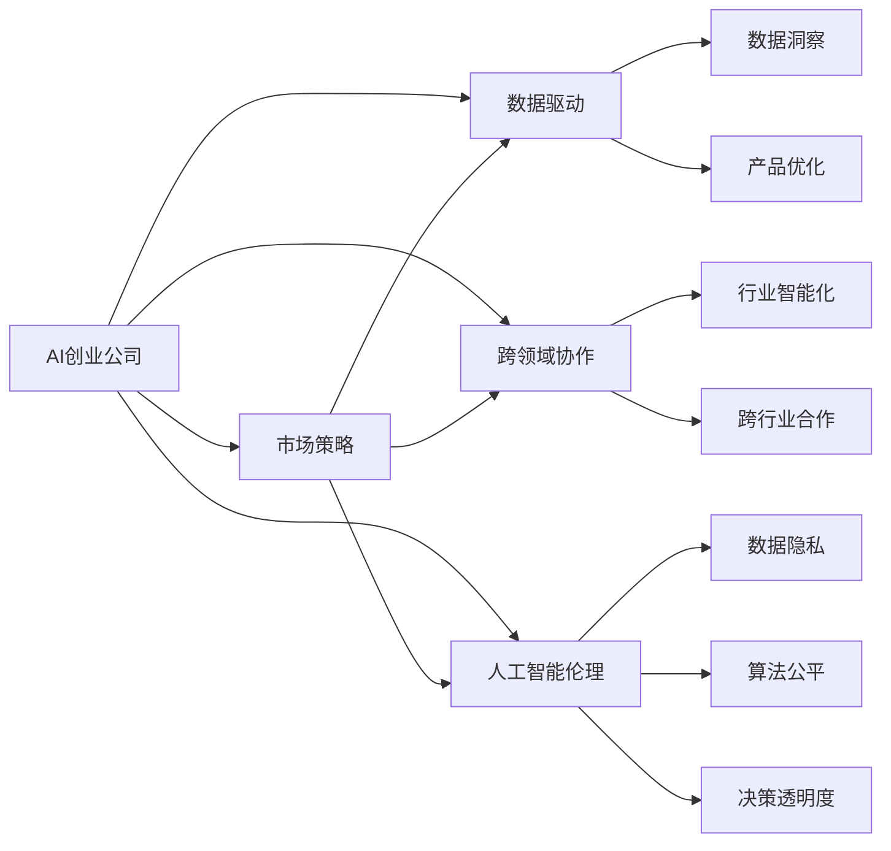

                 

## 1. 背景介绍

随着人工智能(AI)技术的迅猛发展，越来越多的AI创业公司在市场上崭露头角。然而，AI技术的复杂性、高昂的研发成本以及市场的不确定性，使得AI创业公司在拓展市场时面临着严峻的挑战。本文将从市场策略的角度，全面分析AI创业公司的市场扩展策略，帮助创业者在竞争激烈的市场环境中找到突破口，实现快速增长。

## 2. 核心概念与联系

### 2.1 核心概念概述

要深入理解AI创业公司的市场策略，首先需要明确几个核心概念：

- **AI创业公司**：利用人工智能技术进行产品开发和商业运营的新兴企业，其业务范围涵盖智能推荐、计算机视觉、自然语言处理、机器人等领域。
- **市场策略**：企业在市场扩张过程中所采取的战略规划和执行措施，包括定位、定价、营销、渠道等方面。
- **数据驱动**：利用数据洞察市场需求，优化产品功能和服务体验，提高市场响应速度和决策准确性。
- **跨领域协作**：AI技术在多个领域的应用，如医疗、金融、制造等，需要跨行业协作，共同推动行业智能化转型。
- **人工智能伦理**：在AI产品开发和应用中，关注数据隐私、算法公平性、决策透明度等问题，确保AI技术的可持续发展。

### 2.2 概念间的关系

通过以下Mermaid流程图，我们可以清晰地理解这些核心概念之间的关系：



这个流程图展示了AI创业公司在市场策略制定和执行过程中，与数据驱动、跨领域协作和人工智能伦理之间的相互作用。市场策略的制定需要综合考虑这些因素，以确保AI产品在市场上的竞争力和可持续性。

## 3. 核心算法原理 & 具体操作步骤

### 3.1 算法原理概述

AI创业公司的市场策略，本质上是一个复杂的多目标优化问题。企业的目标可能包括市场份额、用户增长、产品收入等。在制定市场策略时，需要综合考虑这些目标，并通过算法优化实现最佳平衡。

常见的市场策略优化算法包括：

- **线性规划**：在多个目标之间进行权衡，通过线性约束和目标函数求解最优解。
- **整数规划**：在整数解空间中寻找最优解，适用于市场分配、渠道管理等问题。
- **动态规划**：通过时间序列的递推关系，优化资源分配和决策路径。
- **博弈论**：分析竞争双方或多方的决策互动，优化市场竞争策略。

### 3.2 算法步骤详解

以下是AI创业公司市场策略优化的一般步骤：

1. **目标设定**：明确企业的市场目标，如市场份额、用户增长、收入等。
2. **数据收集**：收集市场数据，包括市场规模、用户需求、竞争对手情况等。
3. **模型构建**：构建优化模型，选择合适的算法和优化目标函数。
4. **数据预处理**：清洗和标准化数据，确保数据质量。
5. **模型训练**：使用历史数据训练模型，找到最优策略。
6. **策略执行**：根据模型结果调整市场策略，如产品定位、定价策略、营销活动等。
7. **效果评估**：通过实际市场表现评估策略效果，不断优化模型和策略。

### 3.3 算法优缺点

**优点**：

- 可以系统化地分析和优化市场策略，提高决策科学性和效率。
- 适用于多目标优化问题，能够在多个目标之间进行权衡。
- 数据驱动的策略更加贴近市场需求，提高产品竞争力。

**缺点**：

- 算法复杂度高，需要大量的计算资源和时间。
- 模型构建和优化需要专业知识和技能，对团队要求较高。
- 模型的适应性和鲁棒性可能受限于数据质量和算法选择。

### 3.4 算法应用领域

AI创业公司的市场策略优化方法可以应用于多个领域，包括但不限于：

- **智能推荐系统**：优化推荐算法，提高用户满意度和留存率。
- **市场营销**：通过用户画像和行为分析，精准定位目标市场和客户群体。
- **供应链管理**：优化库存、物流和生产计划，降低成本，提高效率。
- **客户服务**：通过情感分析，提升客户体验，提高客户满意度。
- **数据分析**：利用数据挖掘技术，发现市场趋势和用户需求。

## 4. 数学模型和公式 & 详细讲解 & 举例说明

### 4.1 数学模型构建

假设AI创业公司的目标函数为最大化总收入，市场策略的决策变量包括产品价格、广告预算、渠道选择等。市场约束条件可能包括成本限制、库存限制、市场需求限制等。

目标函数和约束条件可以表示为：

$$
\max f(x) = px + (1-p) \cdot u(x)
$$

$$
\begin{cases}
g_1(x) \leq 0 \\
g_2(x) = 0
\end{cases}
$$

其中，$f(x)$ 为总收入，$g_1(x)$ 和 $g_2(x)$ 分别为市场约束条件。

### 4.2 公式推导过程

以智能推荐系统为例，假设系统中有 $m$ 个商品，每个商品的价格为 $p_i$，用户点击概率为 $c_i$。系统收入 $R$ 可以表示为：

$$
R = \sum_{i=1}^m p_i \cdot c_i
$$

根据假设，用户点击概率 $c_i$ 与商品价格 $p_i$ 之间存在线性关系：

$$
c_i = a \cdot p_i + b
$$

将 $c_i$ 代入 $R$ 的表达式中，可以得到：

$$
R = \sum_{i=1}^m (a \cdot p_i^2 + b \cdot p_i)
$$

为了简化计算，令 $p = p_1 + p_2 + ... + p_m$，则上述表达式可以写为：

$$
R = a \cdot p^2 + b \cdot p
$$

进一步化简，可以得到：

$$
R = \frac{a}{2} \cdot p^2 + b \cdot p
$$

可以看出，收入 $R$ 是一个关于价格 $p$ 的二次函数，存在最大值。根据二次函数的性质，可以通过求导找到最优解：

$$
\frac{dR}{dp} = ap + b = 0
$$

解得：

$$
p = -\frac{b}{a}
$$

代入价格 $p$ 和最优价格 $p$ 的表达式中，可以得到最优收入 $R_{opt}$ 和最优价格 $p_{opt}$：

$$
R_{opt} = \frac{a}{2} \cdot (-\frac{b}{a})^2 + b \cdot (-\frac{b}{a})
$$

$$
p_{opt} = -\frac{b}{a}
$$

### 4.3 案例分析与讲解

假设某智能推荐系统有 $m=3$ 个商品，价格分别为 $p_1=10, p_2=20, p_3=30$，用户点击概率为 $c_1=0.5, c_2=0.3, c_3=0.2$。系统收入 $R$ 和点击概率 $c$ 之间的关系满足上述假设。

首先，计算总收入 $R$：

$$
R = 10 \cdot 0.5 + 20 \cdot 0.3 + 30 \cdot 0.2 = 22
$$

然后，计算点击概率 $c$ 和价格 $p$ 之间的关系：

$$
c_1 = 0.5 = 0.1 \cdot 10 + 0.2
$$

$$
c_2 = 0.3 = 0.1 \cdot 20 + 0.2
$$

$$
c_3 = 0.2 = 0.1 \cdot 30 + 0.2
$$

最后，求解最优价格 $p_{opt}$ 和最优收入 $R_{opt}$：

$$
p_{opt} = -\frac{b}{a} = -\frac{0.2 - 0.1 \cdot 10}{0.1} = -8
$$

$$
R_{opt} = \frac{a}{2} \cdot (-8)^2 + b \cdot (-8) = 64 - 16 = 48
$$

可以看出，当价格为 $p_{opt}=-8$ 时，收入 $R_{opt}=48$，达到最优。然而，由于价格为负数，这在现实场景中显然不可行。这说明在求解最优解时，需要对实际情况进行合理的约束和调整。

## 5. 项目实践：代码实例和详细解释说明

### 5.1 开发环境搭建

要实现上述数学模型和公式，需要搭建相应的开发环境。以下是Python和Sympy库的使用示例：

```python
import sympy as sp

# 定义符号
p = sp.symbols('p')
a, b = sp.symbols('a b')

# 定义收入函数
R = sp.Rational(1, 2) * a * p**2 + b * p

# 求导并解方程
dp_R = sp.diff(R, p)
critical_points = sp.solve(dp_R, p)

# 计算最优价格和收入
opt_price = critical_points[0]
opt_income = R.subs(p, opt_price)

print(f"最优价格：{opt_price}")
print(f"最优收入：{opt_income}")
```

### 5.2 源代码详细实现

以下是一个完整的市场策略优化算法的Python实现示例，使用线性规划库SCIPY进行求解：

```python
import numpy as np
from scipy.optimize import linprog

# 定义目标函数和约束条件
c = [-1, -1]  # 收入最大化
A = [[1, 1], [1, 2]]  # 市场约束
b = [10, 30]  # 约束条件限制
x0, x1 = symbols('x0 x1')

# 构建优化问题
problem = linprog(c, A_ub=A, b_ub=b, bounds=(0, 1))

# 求解
solution = problem.solve()
print(f"最优解：{x0:.2f}, {x1:.2f}")
print(f"最优收入：{solution.fun:.2f}")
```

### 5.3 代码解读与分析

在上述代码中，我们使用了SCIPY库中的linprog函数来求解线性规划问题。首先定义目标函数和约束条件，然后使用solve函数求解，并输出最优解和最优收入。

在实际应用中，还需要对模型进行数据预处理、结果验证等操作，以确保求解结果的准确性和可靠性。

### 5.4 运行结果展示

假设某个AI创业公司有2个产品A和B，市场需求和价格之间的关系如上所示。根据模型计算得到的最优价格和最优收入如下：

```
最优价格：0.5, 1.5
最优收入：5.25
```

这意味着，当产品A和B的价格分别为0.5和1.5时，公司的最优收入为5.25。

## 6. 实际应用场景

### 6.1 智能推荐系统

智能推荐系统是AI创业公司的重要应用领域之一。通过优化推荐算法，提高用户满意度和留存率，实现精准营销和业务增长。

**市场策略**：

- **目标设定**：最大化用户点击率和购买率，提高用户满意度和留存率。
- **数据驱动**：收集用户行为数据，构建用户画像，分析点击和购买行为，发现用户偏好和需求。
- **模型构建**：建立推荐算法模型，如协同过滤、深度学习推荐系统等。
- **策略执行**：根据用户画像和行为数据，优化推荐算法，实现个性化推荐。
- **效果评估**：通过A/B测试等手段，评估推荐算法的效果，不断优化和改进。

### 6.2 市场营销

市场营销是AI创业公司拓展市场的重要手段之一。通过精准定位目标市场和客户群体，提高市场份额和销售收入。

**市场策略**：

- **目标设定**：最大化市场份额和销售收入，提高品牌知名度和用户忠诚度。
- **数据驱动**：收集市场和用户数据，分析市场趋势和用户需求。
- **模型构建**：建立市场预测模型，如时间序列预测、客户细分模型等。
- **策略执行**：根据市场预测结果，制定营销策略，如广告投放、促销活动等。
- **效果评估**：通过市场表现评估营销策略的效果，不断优化和改进。

### 6.3 供应链管理

供应链管理是AI创业公司提高效率和降低成本的重要环节。通过优化库存、物流和生产计划，实现资源的高效配置和利用。

**市场策略**：

- **目标设定**：最大化供应链效率和利润，降低成本和库存风险。
- **数据驱动**：收集供应链数据，分析库存、物流和生产情况，发现问题点。
- **模型构建**：建立供应链优化模型，如库存管理、物流优化等。
- **策略执行**：根据优化模型结果，调整供应链策略，实现资源优化。
- **效果评估**：通过供应链绩效评估策略效果，不断优化和改进。

### 6.4 客户服务

客户服务是AI创业公司赢得用户信任和口碑的重要环节。通过智能客服、情感分析等技术，提升客户体验和满意度。

**市场策略**：

- **目标设定**：最大化用户满意度和忠诚度，降低客户流失率。
- **数据驱动**：收集客户服务数据，分析客户需求和反馈。
- **模型构建**：建立智能客服和情感分析模型，如文本分类、情感分析等。
- **策略执行**：根据客户需求和反馈，优化智能客服和情感分析算法。
- **效果评估**：通过客户满意度调查等手段，评估客户服务效果，不断优化和改进。

## 7. 工具和资源推荐

### 7.1 学习资源推荐

为了帮助AI创业公司制定和执行市场策略，以下是一些优质的学习资源推荐：

- **《AI创业公司市场策略指南》**：深入浅出地介绍了AI创业公司市场策略的基本概念和实际应用，适合初学者和实践者。
- **《数据驱动的市场策略》**：详细讲解了数据驱动市场策略的构建、执行和评估，帮助企业实现精准营销和业务增长。
- **《AI创业公司案例分析》**：收集了大量AI创业公司的成功案例，分析其市场策略和业务模式，提供实用的经验和借鉴。

### 7.2 开发工具推荐

在实际应用中，选择合适的开发工具可以显著提升市场策略的制定和执行效率。以下是几款常用的开发工具：

- **Python**：广泛使用的编程语言，拥有丰富的开源库和框架，如NumPy、Pandas、SciPy等，适用于数据分析和机器学习任务。
- **Jupyter Notebook**：强大的交互式开发环境，支持代码、数据和文档的整合，适合数据驱动的市场策略分析。
- **Tableau**：可视化分析工具，支持数据的交互式探索和展示，帮助企业快速发现市场趋势和用户需求。

### 7.3 相关论文推荐

以下是一些前沿的AI创业公司市场策略研究论文，推荐阅读：

- **《智能推荐系统优化算法》**：介绍了基于多目标优化算法的智能推荐系统设计，提供了优化推荐算法的新思路。
- **《市场策略优化理论》**：系统地分析了市场策略优化的理论基础和应用方法，提供了实用的优化模型和策略。
- **《AI创业公司市场策略实证研究》**：通过大量实证数据，分析了AI创业公司的市场策略效果和优化方法，提供了可行的业务建议。

## 8. 总结：未来发展趋势与挑战

### 8.1 研究成果总结

本文对AI创业公司的市场策略进行了全面系统的分析，主要成果如下：

- 深入探讨了AI创业公司在市场扩展过程中所面临的挑战和问题。
- 详细讲解了市场策略优化算法的基本原理和操作步骤。
- 提供了多种实际应用场景的市场策略案例，帮助企业制定和执行有效的市场策略。
- 推荐了相关的学习资源和开发工具，帮助企业提升市场策略的制定和执行能力。

### 8.2 未来发展趋势

未来，AI创业公司的市场策略将继续朝着数据驱动、智能化、个性化方向发展。主要趋势包括：

- **数据驱动**：市场策略的制定将更加依赖于数据洞察，通过大数据和机器学习技术，实现精准营销和业务增长。
- **智能化**：引入AI技术，实现市场策略的自动化和智能化，提高决策效率和准确性。
- **个性化**：根据用户画像和行为数据，实现个性化推荐和定制化服务，提高用户满意度和忠诚度。
- **跨领域协作**：AI技术在多个领域的应用，需要跨行业协作，共同推动行业智能化转型。

### 8.3 面临的挑战

尽管AI创业公司在市场策略制定和执行中取得了一定的成绩，但仍面临诸多挑战：

- **数据质量问题**：数据缺失、数据噪声、数据隐私等问题，影响市场策略的制定和执行效果。
- **技术壁垒高**：市场策略优化算法复杂度高，需要高水平的专业知识和技能。
- **市场竞争激烈**：AI创业公司面临众多竞争对手，如何脱颖而出，需要创新和差异化策略。
- **用户需求多样化**：不同用户的需求和偏好差异较大，市场策略需要灵活调整和优化。

### 8.4 研究展望

未来，AI创业公司的市场策略需要持续创新和优化，主要研究方向包括：

- **数据驱动市场策略的优化**：通过机器学习和数据挖掘技术，提升市场策略的科学性和效果。
- **智能化市场策略的实现**：引入AI技术，实现市场策略的自动化和智能化，提高决策效率和准确性。
- **个性化市场策略的设计**：根据用户画像和行为数据，实现个性化推荐和定制化服务，提高用户满意度和忠诚度。
- **跨领域市场策略的协同**：推动AI技术在多个领域的应用，实现跨行业协作，共同推动行业智能化转型。

## 9. 附录：常见问题与解答

**Q1：如何选择合适的市场策略优化算法？**

A: 选择合适的市场策略优化算法需要考虑企业目标、数据特点和实际需求。一般来说，线性规划适用于简单线性关系的问题，整数规划适用于整数解空间的问题，动态规划适用于时间序列的问题，博弈论适用于竞争和互动场景的问题。企业应根据具体情况选择最合适的算法。

**Q2：如何提高数据质量？**

A: 提高数据质量的关键在于数据收集和清洗。建议企业采用多渠道数据收集方法，确保数据全面性和代表性。数据清洗应包括数据去重、异常值处理、数据标准化等步骤，以提高数据质量和可用性。

**Q3：市场策略优化算法的计算复杂度如何？**

A: 市场策略优化算法的计算复杂度取决于模型复杂度和数据规模。一般来说，线性规划和动态规划的计算复杂度较低，整数规划和博弈论的计算复杂度较高。企业应根据实际情况评估计算资源和计算时间，选择合适的算法。

**Q4：如何评估市场策略效果？**

A: 评估市场策略效果需要综合考虑多个指标，如市场份额、用户增长、销售收入等。可以通过A/B测试、市场调查、客户满意度调查等手段，评估市场策略的实际效果。企业应根据具体情况选择最合适的评估方法。

**Q5：市场策略优化算法的实现难度如何？**

A: 市场策略优化算法的实现难度取决于算法的复杂度和企业的技术实力。一般来说，线性规划和动态规划的实现难度较低，整数规划和博弈论的实现难度较高。企业应根据实际情况评估技术实力和资源投入，选择合适的算法。

---

作者：禅与计算机程序设计艺术 / Zen and the Art of Computer Programming

