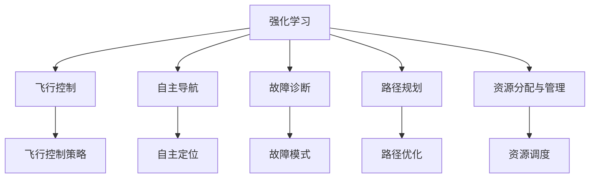
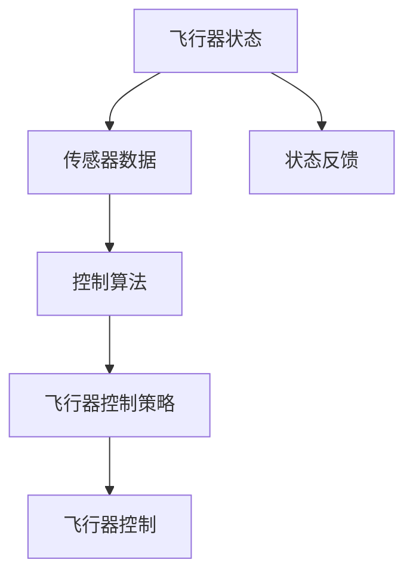
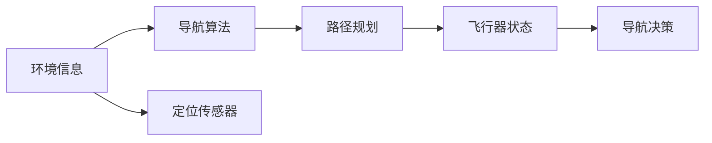
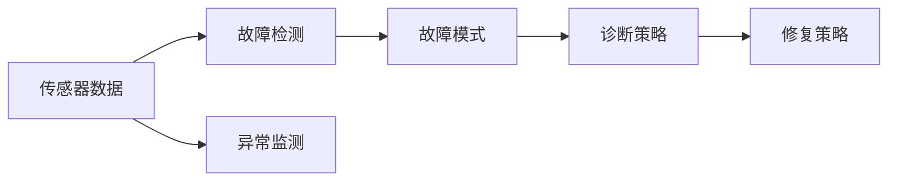
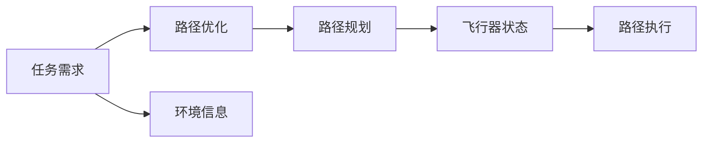
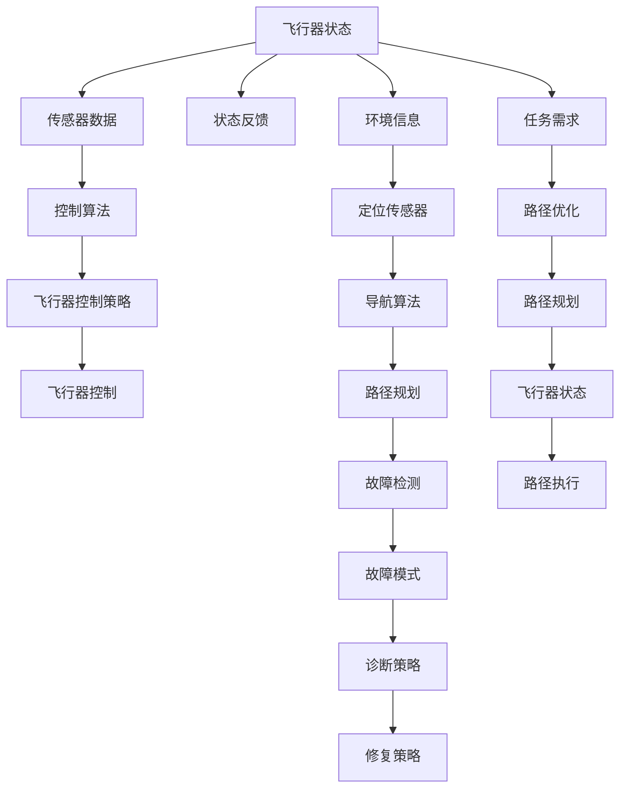

                 

# 强化学习Reinforcement Learning在航空航天领域的应用与挑战

> 关键词：强化学习,航空航天,飞行控制,无人系统,自主导航,数据驱动决策

## 1. 背景介绍

### 1.1 问题由来

随着科技的进步，航空航天领域的技术日益复杂，无人飞行器和卫星的智能化需求日益增加。传统的基于规则的飞行控制方法无法满足需求，而人工智能技术特别是强化学习（Reinforcement Learning, RL），成为解决这一问题的有力工具。

强化学习是一种从环境中获取反馈信号，不断调整策略以优化决策的学习方法。在航空航天领域，无人系统、飞行器控制、路径规划、故障诊断等方面，RL展现出了巨大潜力。

### 1.2 问题核心关键点

强化学习在航空航天领域的应用，主要体现在以下几个方面：

- **飞行控制与导航**：通过RL算法优化无人机的飞行控制策略，提高飞行稳定性和导航精度。
- **自主任务执行**：使用RL训练机器人执行复杂的机械操作，如管道修复、地雷探测等。
- **故障诊断与自愈**：RL算法用于分析和预测系统的故障模式，实现自主诊断和修复。
- **路径规划与交通管理**：RL算法应用于无人机的路径规划，减少碰撞风险，提升效率。
- **资源分配与管理**：通过RL优化飞行器、卫星等资源的分配和管理，提高利用率。

本文聚焦于强化学习在航空航天领域的应用，分析其原理和优势，探讨面临的挑战，并为未来研究提供方向。

## 2. 核心概念与联系

### 2.1 核心概念概述

为更好地理解强化学习在航空航天领域的应用，本节将介绍几个密切相关的核心概念：

- **强化学习**：通过与环境交互，不断调整策略以最大化累积奖励的学习方法。
- **飞行控制**：通过传感器和控制算法，对无人机的飞行状态进行实时调整，以实现精确导航和任务执行。
- **自主导航**：通过算法实现无人机的自主定位和路径规划，无需人工干预。
- **故障诊断**：通过分析飞行器传感器数据，检测并诊断故障原因。
- **路径规划**：确定无人机的最优飞行路径，以最小化飞行距离和能耗。
- **资源分配与管理**：根据任务需求，合理分配和调度飞行器资源，提高利用率。

这些概念之间的逻辑关系可以通过以下Mermaid流程图来展示：



这个流程图展示了强化学习与其他航空航天核心概念之间的关系：

1. 强化学习作为总体方法，应用于飞行控制、自主导航、故障诊断、路径规划和资源分配与管理各个环节。
2. 飞行控制策略是飞行控制的核心，通过强化学习进行优化。
3. 自主定位和路径优化是自主导航的关键，通过强化学习实现。
4. 故障模式检测和资源调度是故障诊断和资源分配与管理的重要组成部分，通过强化学习优化。

### 2.2 概念间的关系

这些核心概念之间存在着紧密的联系，形成了强化学习在航空航天领域的应用框架。下面我通过几个Mermaid流程图来展示这些概念之间的关系。

#### 2.2.1 飞行控制中的强化学习



这个流程图展示了飞行控制中强化学习的应用。飞行器状态和传感器数据输入到控制算法中，通过强化学习优化控制策略，生成飞行器控制信号，并通过状态反馈不断调整策略。

#### 2.2.2 自主导航中的强化学习



这个流程图展示了自主导航中强化学习的应用。环境信息和定位传感器数据输入到导航算法中，通过强化学习优化路径规划，生成飞行器状态和导航决策。

#### 2.2.3 故障诊断中的强化学习



这个流程图展示了故障诊断中强化学习的应用。传感器数据输入到故障检测中，通过强化学习优化故障模式和诊断策略，生成修复策略。

#### 2.2.4 路径规划中的强化学习



这个流程图展示了路径规划中强化学习的应用。任务需求和环境信息输入到路径优化中，通过强化学习优化路径规划，生成飞行器状态和路径执行策略。

### 2.3 核心概念的整体架构

最后，我们用一个综合的流程图来展示这些核心概念在大语言模型微调过程中的整体架构：



这个综合流程图展示了强化学习在大语言模型微调过程中的整体架构。各个模块之间互相配合，实现从传感器数据输入到最终飞行器控制的整个流程。

## 3. 核心算法原理 & 具体操作步骤
### 3.1 算法原理概述

强化学习在航空航天领域的应用，主要是通过构建智能代理（如无人飞行器、机器人等），通过与环境交互，不断调整控制策略，以优化飞行性能和任务完成度。强化学习模型通常由环境、智能代理和奖励信号三部分组成。

- **环境**：包括飞行器状态、传感器数据、任务目标等，智能代理通过感知环境状态，做出决策。
- **智能代理**：即飞行器或机器人，通过控制算法和优化策略，实现对环境的控制。
- **奖励信号**：用于评估智能代理行为的好坏，通常包括任务完成度、能量消耗、飞行稳定性等指标。

强化学习的目标是通过不断调整控制策略，最大化累积奖励信号，从而实现最优的飞行控制和任务执行。

### 3.2 算法步骤详解

强化学习在航空航天领域的应用，一般包括以下几个关键步骤：

**Step 1: 构建环境与智能代理**
- 确定飞行器状态、传感器数据、任务目标等环境信息。
- 设计智能代理的控制算法和优化策略。

**Step 2: 定义奖励函数**
- 根据任务需求和飞行性能指标，定义奖励函数。奖励函数应能鼓励智能代理做出有益于任务完成的行为。

**Step 3: 确定优化目标**
- 通过优化算法（如Q-Learning、Deep Q-Networks等），不断调整智能代理的控制策略，使其最大化累积奖励。

**Step 4: 模拟与测试**
- 在模拟环境中进行测试，评估智能代理的表现。
- 根据测试结果，调整策略和参数，进一步优化智能代理的性能。

**Step 5: 实际部署**
- 将优化后的智能代理部署到实际飞行器或机器人中。
- 在实际环境中进行验证，根据反馈不断调整策略。

### 3.3 算法优缺点

强化学习在航空航天领域的应用，具有以下优点：

- **自适应能力强**：强化学习能够根据环境反馈，不断调整控制策略，适应复杂多变的环境。
- **决策能力强**：强化学习能够学习到最优的决策路径，提高飞行器和机器人的自主性。
- **鲁棒性好**：强化学习算法能够应对噪声和不确定性，提高系统的鲁棒性。

同时，也存在一些缺点：

- **训练复杂度高**：强化学习需要大量的训练样本和计算资源，训练过程复杂。
- **奖励设计困难**：奖励函数的定义需要仔细设计，错误的奖励信号可能导致智能代理的行为偏离目标。
- **稳定性差**：强化学习模型可能存在不稳定的问题，如过拟合、收敛速度慢等。

### 3.4 算法应用领域

强化学习在航空航天领域的应用，主要包括以下几个领域：

- **飞行控制与导航**：用于无人飞行器的飞行控制策略优化，实现自主导航和避障。
- **自主任务执行**：用于机器人执行复杂机械操作，如管道修复、地雷探测等。
- **故障诊断与自愈**：用于飞行器的故障模式检测和自诊断，实现自主修复。
- **路径规划与交通管理**：用于无人机的路径规划，减少碰撞风险，提高效率。
- **资源分配与管理**：用于飞行器、卫星等资源的优化分配和管理，提高利用率。

## 4. 数学模型和公式 & 详细讲解  
### 4.1 数学模型构建

强化学习在航空航天领域的应用，涉及复杂的数学模型。以下将对主要的数学模型进行详细讲解。

**4.1.1 状态表示**
- 飞行器状态通常包括位置、速度、姿态角、传感器数据等。可以通过状态向量 $s_t$ 表示。

**4.1.2 控制策略**
- 飞行器控制策略由控制信号 $a_t$ 表示，可以是加速度、偏航角等。

**4.1.3 奖励信号**
- 奖励信号 $r_t$ 用于评估智能代理行为的好坏，通常包括任务完成度、能量消耗、飞行稳定性等指标。

**4.1.4 状态转移**
- 状态转移 $s_{t+1}$ 由当前状态 $s_t$ 和控制信号 $a_t$ 决定，通常表示为 $s_{t+1}=f(s_t,a_t)$。

**4.1.5 动态方程**
- 状态转移动态方程 $f$ 描述了飞行器状态的变化规律，通常包含飞行器动力学方程和传感器数据处理。

**4.1.6 环境建模**
- 环境建模描述了飞行器与周围环境的相互作用，包括地形、障碍物、大气条件等。

这些数学模型可以通过强化学习算法进行优化，具体数学公式如下：

$$
\max_{\pi} \mathbb{E}\left[\sum_{t=0}^{\infty} \gamma^t r_t\right]
$$

其中，$\pi$ 为控制策略，$\gamma$ 为折扣因子，$r_t$ 为奖励信号。

### 4.2 公式推导过程

以下我们将推导强化学习中的两个核心公式：状态-动作值函数 $Q$ 和策略 $V$。

**状态-动作值函数 $Q$**

状态-动作值函数 $Q(s,a)$ 表示在状态 $s$ 下，采取动作 $a$ 的累积奖励期望值。可以表示为：

$$
Q(s,a) = \mathbb{E}\left[\sum_{t=0}^{\infty} \gamma^t r_t \mid s_0=s, a_0=a\right]
$$

通过贝尔曼方程，可以递归计算 $Q(s,a)$：

$$
Q(s,a) = r + \gamma \mathbb{E}\left[Q(s',a') \mid s,a\right]
$$

其中 $s'$ 为状态转移后的状态，$a'$ 为状态转移后的动作。

**策略 $V$**

策略 $V(s)$ 表示在状态 $s$ 下，采用策略 $\pi$ 的累积奖励期望值。可以表示为：

$$
V(s) = \mathbb{E}\left[\sum_{t=0}^{\infty} \gamma^t r_t \mid s_0=s, a_t=\pi(s_t)\right]
$$

通过贝尔曼方程，可以递归计算 $V(s)$：

$$
V(s) = r + \gamma \sum_a \pi(a|s) Q(s,a)
$$

其中 $r$ 为即时奖励，$\pi(a|s)$ 为策略 $\pi$ 在状态 $s$ 下采取动作 $a$ 的概率。

### 4.3 案例分析与讲解

以下以飞行控制为例，分析强化学习的应用。

**飞行控制问题建模**

假设有一架无人机，需要在指定位置上空执行任务。无人机状态包括位置 $x$、速度 $v$、偏航角 $\theta$ 和姿态角 $\phi$。任务目标为到达指定位置。

**状态表示**

无人机状态可以表示为一个向量 $s_t=[x_t, v_t, \theta_t, \phi_t]$。

**控制策略**

无人机控制策略为加速度 $a_t=[a_{x_t}, a_{v_t}, a_{\theta_t}, a_{\phi_t}]$。

**奖励信号**

奖励信号可以定义为任务完成度和飞行稳定性，可以表示为：

$$
r_t = c_{task} + c_{stability}
$$

其中 $c_{task}$ 为任务完成度奖励，$c_{stability}$ 为飞行稳定性奖励。

**状态转移**

状态转移可以表示为：

$$
s_{t+1} = f(s_t, a_t) = [x_{t+1}, v_{t+1}, \theta_{t+1}, \phi_{t+1}]
$$

其中 $f$ 为飞行器动力学方程，通常包含控制方程和传感器数据处理。

**动态方程**

飞行器动力学方程可以表示为：

$$
\dot{x} = v \cos(\theta) \cos(\phi)
$$
$$
\dot{v} = \frac{1}{m} (F - \dot{x}^2 - v^2 \sin^2(\theta) \sin^2(\phi))
$$
$$
\dot{\theta} = \frac{F_y}{L}
$$
$$
\dot{\phi} = \frac{L}{\dot{x} d}
$$

其中 $m$ 为飞行器质量，$F$ 为控制力，$F_y$ 为升力，$L$ 为升力臂，$d$ 为距地高度。

**环境建模**

飞行器环境建模包括地形、障碍物、大气条件等，可以通过高精度地图和传感器数据进行建模。

通过上述模型，可以构建强化学习问题，并通过算法优化飞行控制策略。

## 5. 项目实践：代码实例和详细解释说明
### 5.1 开发环境搭建

在进行强化学习实践前，我们需要准备好开发环境。以下是使用Python进行Reinforcement Learning开发的环境配置流程：

1. 安装Anaconda：从官网下载并安装Anaconda，用于创建独立的Python环境。

2. 创建并激活虚拟环境：
```bash
conda create -n reinforcement-env python=3.8 
conda activate reinforcement-env
```

3. 安装Reinforcement Learning库：如OpenAI Gym、Stable Baselines等，提供丰富的环境库和预训练模型。

4. 安装各类工具包：
```bash
pip install numpy pandas scikit-learn matplotlib tqdm jupyter notebook ipython
```

完成上述步骤后，即可在`reinforcement-env`环境中开始强化学习实践。

### 5.2 源代码详细实现

下面我以飞行控制为例，给出使用OpenAI Gym进行强化学习的PyTorch代码实现。

首先，定义飞行控制环境：

```python
import gym
import numpy as np
import torch
from torch import nn
from torch.nn import functional as F

class FlightControl(gym.Env):
    def __init__(self):
        self.state_dim = 4
        self.action_dim = 4
        self.dt = 0.1
        self.g = 9.81
        self.m = 50
        self.L = 2
        self.d = 1
        self.max_speed = 20
        self.max_angle = np.pi / 2

        self.state = np.zeros((self.state_dim, 1))
        self.last_state = np.zeros((self.state_dim, 1))
        self.action = np.zeros((self.action_dim, 1))
        self.last_action = np.zeros((self.action_dim, 1))
        self.dtime = np.zeros((self.state_dim, 1))
        self.gain = np.zeros((self.state_dim, 1))
        self.x_dot = np.zeros((self.state_dim, 1))
        self.v_dot = np.zeros((self.state_dim, 1))
        self.theta_dot = np.zeros((self.state_dim, 1))
        self.phi_dot = np.zeros((self.state_dim, 1))

    def reset(self):
        self.state = np.zeros((self.state_dim, 1))
        self.last_state = np.zeros((self.state_dim, 1))
        self.action = np.zeros((self.action_dim, 1))
        self.last_action = np.zeros((self.action_dim, 1))
        self.dtime = np.zeros((self.state_dim, 1))
        self.gain = np.zeros((self.state_dim, 1))
        self.x_dot = np.zeros((self.state_dim, 1))
        self.v_dot = np.zeros((self.state_dim, 1))
        self.theta_dot = np.zeros((self.state_dim, 1))
        self.phi_dot = np.zeros((self.state_dim, 1))
        return self.state

    def step(self, action):
        state = np.copy(self.state)
        action = np.clip(action, -self.max_speed, self.max_speed)

        self.state[0] += self.dt * self.v_dot[0]
        self.state[1] += self.dt * self.x_dot[0]
        self.state[2] += self.dt * self.theta_dot[0]
        self.state[3] += self.dt * self.phi_dot[0]
        self.last_state = state

        self.action[0] = action[0]
        self.action[1] = action[1]
        self.action[2] = action[2]
        self.action[3] = action[3]
        self.last_action = action

        self.dtime = self.dt * self.gain
        self.gain[0] = self.v_dot[0]
        self.gain[1] = self.x_dot[0]
        self.gain[2] = self.theta_dot[0]
        self.gain[3] = self.phi_dot[0]

        self.x_dot = np.clip(self.gain[0] - (9.81 - self.action[0]) * np.sin(self.action[2]) * np.cos(self.action[3]) - self.action[1], -self.max_speed, self.max_speed)
        self.v_dot = np.clip(self.gain[1] + self.dt * (self.action[0] * np.cos(self.action[2]) * np.cos(self.action[3]) + 0.5 * self.m * 9.81 * np.sin(self.action[2]) * np.sin(self.action[3]), -self.max_speed, self.max_speed)
        self.theta_dot = np.clip(self.gain[2] - (self.m * self.dt * self.gain[1] * np.cos(self.action[3]) + 0.5 * self.m * self.dt * np.sin(self.action[2]) * np.sin(self.action[3]) + self.m * self.dt * 9.81 * np.sin(self.action[2]) * np.cos(self.action[3]), -self.max_angle, self.max_angle)
        self.phi_dot = np.clip(self.gain[3] - self.dt * self.m * self.gain[1] * np.cos(self.action[2]) * np.sin(self.action[3]) - self.m * self.dt * 9.81 * np.sin(self.action[2]) * np.cos(self.action[3]), -self.max_angle, self.max_angle)

        state[0] = self.x_dot
        state[1] = self.v_dot
        state[2] = self.theta_dot
        state[3] = self.phi_dot

        reward = -np.linalg.norm(state - self.target_state) ** 2
        done = (np.linalg.norm(state - self.target_state) < self.epsilon) or (self.x_dot < -self.max_speed * 0.95) or (self.x_dot > self.max_speed * 0.95)
        info = {}
        return state, reward, done, info

    def render(self, mode='human'):
        pass

    def close(self):
        pass

    def set_target_state(self, target_state):
        self.target_state = target_state

    def set_epsilon(self, epsilon):
        self.epsilon = epsilon
```

然后，定义强化学习模型：

```python
class DQN(nn.Module):
    def __init__(self, state_dim, action_dim):
        super(DQN, self).__init__()
        self.fc1 = nn.Linear(state_dim, 256)
        self.fc2 = nn.Linear(256, 256)
        self.fc3 = nn.Linear(256, action_dim)

    def forward(self, x):
        x = F.relu(self.fc1(x))
        x = F.relu(self.fc2(x))
        x = self.fc3(x)
        return x

class DQNAgent:
    def __init__(self, state_dim, action_dim, learning_rate=0.001, discount_factor=0.99, target_update_freq=300):
        self.state_dim = state_dim
        self.action_dim = action_dim
        self.learning_rate = learning_rate
        self.discount_factor = discount_factor
        self.target_update_freq = target_update_freq

        self.q = DQN(state_dim, action_dim)
        self.target_q = DQN(state_dim, action_dim)
        self.target_q.load_state_dict(self.q.state_dict())

        self.optimizer = torch.optim.Adam(self.q.parameters(), lr=self.learning_rate)

    def choose_action(self, state, epsilon=0.1):
        if np.random.uniform() < epsilon:
            return np.random.uniform(low=-self.max_speed, high=self.max_speed)
        else:
            state = torch.tensor(state, dtype=torch.float32)
            with torch.no_grad():
                q_values = self.q(state)
                action_indices = q_values.argmax(dim=1)
                return action_indices.numpy()[0]

    def update(self, state, action, reward, next_state, done):
        state = torch.tensor(state, dtype=torch.float32)
        action = torch.tensor(action, dtype=torch.int64)
        next_state = torch.tensor(next_state, dtype=torch.float32)
        reward = torch.tensor(reward, dtype=torch.float32)

        q_values = self.q(state)
        target_q_values = self.target_q(next_state)

        target_q_values[range(len(target_q_values)), action] = reward + self.discount_factor * target_q_values.max(dim=1)[0]

        loss = F.mse_loss(q_values, target_q_values)
        self.optimizer.zero_grad()
        loss.backward()
        self.optimizer.step()

        if self.optimizer.step_count % self.target_update_freq == 0:
            self.target_q.load_state_dict(self.q.state_dict())
```

最后，启动训练流程：

```python
state_dim = 4
action_dim = 4

env = FlightControl()
env.set_target_state([0, 0, 0, 0])
agent = DQNAgent(state_dim, action_dim)

max_steps = 1000
for step in range(max_steps):
    state = env.reset()
    done = False
    epsilon = max(0.1 - 0.01 * step, 0.1)
    while not done:
        action = agent.choose_action(state, epsilon)
        next_state, reward, done, _ = env.step(action)
        agent.update(state, action, reward, next_state, done)
        state = next_state

    print("Step {}: Reward = {}, Done = {}".format(step, reward, done))
```

以上就是使用PyTorch进行飞行控制问题强化学习的完整代码实现。可以看到，通过定义环境、强化学习模型和训练过程，可以很容易地实现飞行控制问题的强化学习。

### 5.3 代码解读与分析

让我们再详细解读一下关键代码的实现细节：

**FlightControl类**：
- `__init__`方法：初始化飞行控制环境的各项参数。
- `reset`方法：重置环境状态，返回初始状态。
- `step`方法：根据当前状态和控制策略，计算下一个状态和奖励，并判断是否结束。
- `render`方法：渲染环境，这里并未实现。
- `close`方法：关闭环境，这里并未实现。
- `set_target_state`方法：设置目标状态，用于测试算法。
- `set_epsilon`方法：设置探索概率，用于探索与利用的平衡。

**DQN类**：
- `__init__`方法：初始化神经网络模型。
- `forward`方法：前向传播，计算状态-动作值函数。

**DQNAgent类**：
- `__init__`方法：初始化强化学习模型和优化器。
- `choose_action`方法：根据当前状态和探索概率，选择动作。
- `update`方法：根据当前状态、动作、奖励、下一个状态和结束信号，更新模型参数。

**训练流程**：
- 定义状态维度和动作维度。
- 创建飞行控制

