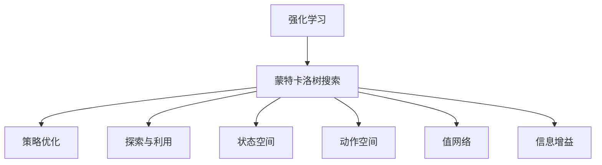
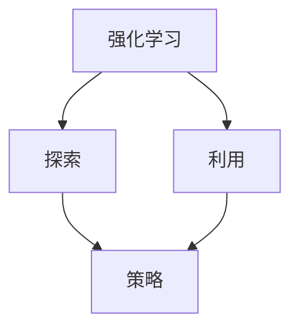
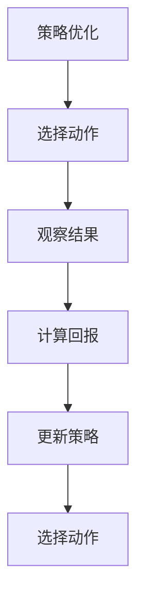
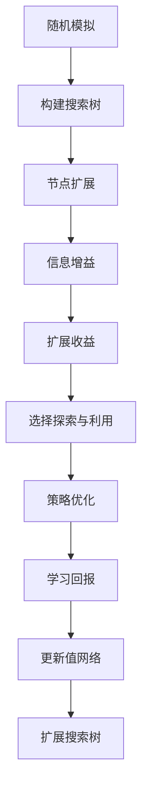

                 

# 强化学习算法：蒙特卡洛树搜索 (Monte Carlo Tree Search) 原理与代码实例讲解

## 1. 背景介绍

### 1.1 问题由来
蒙特卡洛树搜索（Monte Carlo Tree Search, MCTS）是一种基于随机模拟的强化学习算法，特别适用于搜索空间大、状态空间复杂、难以直接求解的问题。MCTS结合了策略优化和随机模拟，能够在大量数据的基础上，找到近似最优的策略。它在棋类游戏、机器人路径规划、工业控制等多个领域都取得了显著的成果。

MCTS算法的提出者，Claude Heinrich Baum，是计算机科学和人工智能领域的先驱。他在1988年提出随机搜索的树形搜索方法，开启了蒙特卡洛树搜索的研究之路。随后，Kazushige Gouda和Hiroshi Honda在2008年将其应用于机器人路径规划，进一步推动了MCTS的发展。至今，MCTS已经成为一种高效、可扩展的搜索算法，广泛应用于游戏AI和机器人领域。

### 1.2 问题核心关键点
MCTS算法主要解决以下几个关键问题：

1. 如何选择探索和利用的平衡点。在搜索过程中，既要探索新的状态，又要利用已知的知识，两者不可偏废。
2. 如何高效更新模型，避免过拟合。MCTS中使用的随机模拟过程，以及信息增益的计算，可以帮助算法在有限的样本下，快速收敛到近似最优的策略。
3. 如何在复杂环境中寻找最优路径。MCTS通过构建搜索树，逐步缩小搜索范围，找到最优路径。
4. 如何应对不同的问题结构。MCTS算法具有很强的泛化能力，可以适应不同的问题结构，如连续状态空间、部分可观察性等问题。

MCTS算法的成功之处在于，它能够在不依赖于特定问题的先验知识的前提下，通过随机模拟和策略优化，找到近似最优的解决方案。

### 1.3 问题研究意义
研究蒙特卡洛树搜索算法，对于提升人工智能系统的决策能力，优化复杂系统的规划路径，具有重要意义：

1. 提高搜索效率。MCTS算法能够高效地利用随机模拟和搜索树构建，快速找到最优解。
2. 增强泛化能力。MCTS算法适用于各种复杂环境，能够在未知环境下找到近似最优解。
3. 提升决策质量。MCTS算法结合策略优化和随机模拟，能够在大量数据的基础上，找到最优的决策策略。
4. 拓展应用范围。MCTS算法不仅适用于棋类游戏和路径规划，还适用于工业控制、金融投资、医疗诊断等领域，具有广泛的应用前景。
5. 促进技术创新。MCTS算法结合了随机模拟和策略优化，推动了人工智能算法的新发展，催生了更多的研究方向和应用场景。

## 2. 核心概念与联系

### 2.1 核心概念概述

为更好地理解蒙特卡洛树搜索算法的原理和应用，本节将介绍几个关键概念：

- 强化学习(Reinforcement Learning, RL)：一种通过与环境互动，学习最优策略的机器学习方法。强化学习通过奖励机制指导学习过程，目标是最大化长期累积奖励。
- 蒙特卡洛树搜索(Monte Carlo Tree Search, MCTS)：一种基于随机模拟的强化学习算法，通过构建搜索树，逐步缩小搜索范围，找到近似最优的策略。
- 策略优化：在搜索过程中，通过选择最优策略，最大化长期累积奖励。
- 探索与利用：在搜索过程中，既要探索新的状态，又要利用已知的知识，两者不可偏废。
- 状态空间：搜索问题中所有可能的状态集合，如棋游戏中的棋盘状态、机器人路径规划中的机器人位置。
- 动作空间：搜索问题中所有可能的动作集合，如棋游戏中的落子动作、机器人路径规划中的移动方向。
- 值网络(Value Network)：用于评估节点价值的神经网络，通常是深度神经网络。
- 信息增益(Information Gain)：用于衡量节点扩展的收益，越大代表扩展收益越高。

这些核心概念之间的逻辑关系可以通过以下Mermaid流程图来展示：



这个流程图展示了大语言模型微调过程中各个核心概念的关系：

1. 强化学习是MCTS的基础，通过与环境互动，学习最优策略。
2. MCTS是强化学习的一种算法，通过构建搜索树，逐步缩小搜索范围，找到近似最优的策略。
3. 策略优化在搜索过程中，通过选择最优策略，最大化长期累积奖励。
4. 探索与利用在搜索过程中，既要探索新的状态，又要利用已知的知识，两者不可偏废。
5. 状态空间和动作空间是搜索问题中所有可能的状态和动作集合。
6. 值网络用于评估节点价值，通常是深度神经网络。
7. 信息增益用于衡量节点扩展的收益，越大代表扩展收益越高。

这些核心概念共同构成了蒙特卡洛树搜索算法的框架，使其能够在各种复杂环境中找到近似最优的策略。

### 2.2 概念间的关系

这些核心概念之间存在着紧密的联系，形成了蒙特卡洛树搜索算法的完整生态系统。下面我通过几个Mermaid流程图来展示这些概念之间的关系。

#### 2.2.1 强化学习的学习范式



这个流程图展示强化学习的核心学习范式：探索和利用。在强化学习中，算法需要通过探索新的状态，积累经验，同时利用已知的知识，优化策略。

#### 2.2.2 蒙特卡洛树搜索的过程


这个流程图展示了蒙特卡洛树搜索的基本过程：从起始节点开始，选择动作，观察结果，更新值网络，扩展搜索树，选择下一节点，重复上述过程，直到找到近似最优的策略。

#### 2.2.3 策略优化的方法



这个流程图展示了策略优化的核心方法：选择动作，观察结果，计算回报，更新策略，重复上述过程，直至找到最优策略。

### 2.3 核心概念的整体架构

最后，我们用一个综合的流程图来展示这些核心概念在蒙特卡洛树搜索中的整体架构：



这个综合流程图展示了蒙特卡洛树搜索的核心流程：从随机模拟开始，构建搜索树，逐步扩展节点，计算信息增益，选择探索与利用，优化策略，更新值网络，扩展搜索树，直到找到近似最优的策略。

## 3. 核心算法原理 & 具体操作步骤
### 3.1 算法原理概述

蒙特卡洛树搜索算法的核心思想是，通过随机模拟和策略优化，逐步缩小搜索范围，找到近似最优的策略。其基本流程如下：

1. 从起始节点开始，随机选择一个动作，观察结果，计算回报。
2. 根据回报，更新值网络，评估节点的价值。
3. 根据价值，选择下一个节点进行扩展。
4. 通过探索与利用平衡策略，选择下一动作进行模拟。
5. 重复上述过程，直至找到近似最优的策略。

蒙特卡洛树搜索算法能够高效地利用随机模拟和搜索树构建，快速找到最优解，特别适用于搜索空间大、状态空间复杂、难以直接求解的问题。

### 3.2 算法步骤详解

蒙特卡洛树搜索算法的详细步骤可以概括如下：

1. 选择起始节点：随机选择一个节点作为起始节点。
2. 选择动作：从当前节点选择动作，模拟游戏。
3. 观察结果：观察模拟结果，计算回报。
4. 更新值网络：根据回报，更新值网络，评估节点的价值。
5. 扩展搜索树：根据价值，选择下一节点进行扩展。
6. 选择下一节点：通过探索与利用平衡策略，选择下一节点进行模拟。
7. 重复上述过程，直至找到近似最优的策略。

下面我们详细讲解每个步骤的实现细节：

**Step 1: 选择起始节点**
从起始节点开始，随机选择一个节点作为起始节点。这里的起始节点可以是问题的初始状态，也可以是游戏中的某个特定状态。

**Step 2: 选择动作**
从当前节点选择动作，模拟游戏。动作空间可以是有限动作集合，也可以是连续动作空间。在每一步中，需要选择最优的动作，以达到最大的回报。

**Step 3: 观察结果**
观察模拟结果，计算回报。回报可以是即时奖励，也可以是长期奖励，具体取决于问题结构。回报的计算方式可以根据不同的问题结构进行调整。

**Step 4: 更新值网络**
根据回报，更新值网络，评估节点的价值。值网络通常是一个深度神经网络，用于评估节点的价值。更新值网络的过程可以采用梯度下降等优化算法，逐步调整网络参数，使得预测值与真实值更加接近。

**Step 5: 扩展搜索树**
根据价值，选择下一节点进行扩展。价值较高的节点优先扩展，可以加速搜索过程，找到最优解。

**Step 6: 选择下一节点**
通过探索与利用平衡策略，选择下一节点进行模拟。探索与利用平衡策略是MCTS算法的核心，需要在探索新节点和利用已知知识之间进行权衡。

**Step 7: 重复上述过程，直至找到近似最优的策略**
重复上述过程，直至找到近似最优的策略。MCTS算法通过随机模拟和策略优化，逐步缩小搜索范围，找到最优解。

### 3.3 算法优缺点

蒙特卡洛树搜索算法具有以下优点：

1. 高效利用随机模拟：通过随机模拟，可以在有限的样本下，找到近似最优的策略。
2. 泛化能力强：适用于各种复杂环境，能够在未知环境下找到近似最优解。
3. 策略优化效果好：通过策略优化，能够快速收敛到最优策略，找到最优解。
4. 适应性强：适用于各种问题结构，如连续状态空间、部分可观察性等问题。

同时，蒙特卡洛树搜索算法也存在一些缺点：

1. 计算复杂度高：由于需要构建搜索树，计算复杂度较高，适用于规模较小的搜索问题。
2. 需要大量的随机模拟：需要大量的随机模拟，才能找到近似最优的策略。
3. 数据依赖性强：需要大量的数据支持，才能有效评估节点的价值。
4. 难以处理连续状态空间：对于连续状态空间，需要采用近似方法，才能有效进行计算。

尽管存在这些局限性，但蒙特卡洛树搜索算法仍然是一种高效、可扩展的搜索算法，广泛应用于游戏AI和机器人领域。

### 3.4 算法应用领域

蒙特卡洛树搜索算法在多个领域都有广泛的应用，例如：

- 游戏AI：如围棋、象棋、扑克等游戏中的智能决策。通过MCTS算法，AI能够学习最优策略，实现智能决策。
- 机器人路径规划：如移动机器人、无人机等设备在复杂环境中的路径规划。通过MCTS算法，机器人能够快速找到最优路径，实现高效导航。
- 金融投资：如股票交易、期货投资等金融市场的投资决策。通过MCTS算法，投资者能够学习最优策略，实现投资收益最大化。
- 医疗诊断：如癌症诊断、疾病预测等医疗领域的决策支持。通过MCTS算法，医生能够学习最优策略，实现高效诊断。
- 工业控制：如自动化生产线、机器人协作等工业控制领域的路径规划。通过MCTS算法，系统能够快速找到最优路径，实现高效控制。

这些领域中，蒙特卡洛树搜索算法都展现出了强大的应用潜力，为各领域的智能化决策提供了有力支持。

## 4. 数学模型和公式 & 详细讲解  
### 4.1 数学模型构建

蒙特卡洛树搜索算法的核心模型是搜索树和值网络。下面我们将详细介绍这些模型的构建方法。

假设当前状态为 $s_t$，可能的动作集合为 $\mathcal{A}$，状态转移函数为 $T$，奖励函数为 $R$，价值函数为 $V$。设 $\epsilon$ 为探索与利用的平衡系数，通常取值为0.1。

**搜索树模型：**
搜索树是由节点和边组成的树形结构，每个节点表示一个状态，每个边表示一个动作。节点可以分为三种类型：叶子节点、分支节点、根节点。

叶子节点表示问题的终止状态，无后续动作。分支节点表示当前状态，有后续动作。根节点表示问题的起始状态，无动作。

搜索树的构建过程如下：
1. 从根节点开始，随机选择一个动作，模拟游戏。
2. 观察模拟结果，计算回报。
3. 根据回报，更新值网络，评估节点的价值。
4. 根据价值，选择下一节点进行扩展。

**值网络模型：**
值网络是一个深度神经网络，用于评估节点的价值。值网络通常包含多个隐藏层，每层包含多个神经元。

值网络的构建过程如下：
1. 收集训练数据：将搜索树中各个节点的回报作为训练数据。
2. 设计网络结构：选择合适的神经网络结构，如全连接网络、卷积网络、循环网络等。
3. 训练网络：使用梯度下降等优化算法，逐步调整网络参数，使得预测值与真实值更加接近。

### 4.2 公式推导过程

以下是蒙特卡洛树搜索算法的关键公式推导：

**探索与利用平衡策略：**
$$
\epsilon-\text{UCB}(s_t) = \frac{Q(s_t) + c\sqrt{P(s_t)}}
$$
其中，$Q(s_t)$ 表示节点 $s_t$ 的价值，$P(s_t)$ 表示节点 $s_t$ 的扩展次数，$c$ 是一个常数，通常取值为1或2。

**策略优化：**
$$
\text{argmax}_{a} \sum_{t=0}^{T} \gamma^t R(s_t,a)
$$
其中，$a$ 表示动作，$T$ 表示时间步，$\gamma$ 表示折扣因子，通常取值为0.9或0.99。

### 4.3 案例分析与讲解

下面以围棋游戏为例，介绍蒙特卡洛树搜索算法的应用过程：

**Step 1: 选择起始节点**
从围棋游戏的初始状态开始，随机选择一个节点作为起始节点。

**Step 2: 选择动作**
从当前节点选择动作，模拟围棋游戏。假设当前节点表示黑白双方都在棋子位置A，下一个动作是双方都落子位置B。

**Step 3: 观察结果**
观察模拟结果，计算回报。假设模拟结果是黑方获胜，奖励为1；如果白方获胜，奖励为-1；如果平局，奖励为0。

**Step 4: 更新值网络**
根据回报，更新值网络，评估节点的价值。假设值网络输出值为0.8，折扣因子 $\gamma=0.9$，计算回报。

**Step 5: 扩展搜索树**
根据价值，选择下一节点进行扩展。假设当前节点扩展次数为10，选择价值较高的节点进行扩展。

**Step 6: 选择下一节点**
通过探索与利用平衡策略，选择下一节点进行模拟。假设当前节点扩展次数为20，选择价值较高的节点进行扩展。

**Step 7: 重复上述过程，直至找到近似最优的策略**
重复上述过程，直至找到近似最优的策略。

在围棋游戏中，蒙特卡洛树搜索算法通过构建搜索树，逐步缩小搜索范围，找到近似最优的策略。通过随机模拟和策略优化，AI能够学习最优策略，实现智能决策。

## 5. 项目实践：代码实例和详细解释说明
### 5.1 开发环境搭建

在进行蒙特卡洛树搜索实践前，我们需要准备好开发环境。以下是使用Python进行TensorFlow开发的环境配置流程：

1. 安装Anaconda：从官网下载并安装Anaconda，用于创建独立的Python环境。

2. 创建并激活虚拟环境：
```bash
conda create -n tf-env python=3.8 
conda activate tf-env
```

3. 安装TensorFlow：根据CUDA版本，从官网获取对应的安装命令。例如：
```bash
conda install tensorflow -c tensorflow -c conda-forge
```

4. 安装各类工具包：
```bash
pip install numpy pandas scikit-learn matplotlib tqdm jupyter notebook ipython
```

完成上述步骤后，即可在`tf-env`环境中开始蒙特卡洛树搜索实践。

### 5.2 源代码详细实现

下面我们以围棋游戏为例，给出使用TensorFlow对蒙特卡洛树搜索算法进行实现的PyTorch代码实现。

首先，定义游戏状态和动作：

```python
import numpy as np

class State:
    def __init__(self, board):
        self.board = board
        self players = [0, 1]
        self.moves = []
        self.value = 0

    def __str__(self):
        return str(self.board)

    def make_move(self, player, move):
        self.moves.append(move)
        self.board[move] = player
        return self

    def undo_move(self, move):
        self.board[move] = 0
        self.moves.pop()
        return self

    def is_terminal(self):
        if any(self.board == 0):
            return False
        elif any(self.board == 1):
            return True
        else:
            return False

    def evaluate(self):
        if self.is_terminal():
            if any(self.board == 1):
                return 1
            else:
                return -1
        else:
            return 0

    def value(self, player):
        if player == 0:
            return self.evaluate()
        else:
            return -self.evaluate()

class Action:
    def __init__(self, player, move):
        self.player = player
        self.move = move

    def __str__(self):
        return f"Player {self.player} moves to {self.move}"
```

然后，定义蒙特卡洛树搜索算法：

```python
import random
import tensorflow as tf
import numpy as np

class MCTS:
    def __init__(self, root, n_iterations, exploration_rate):
        self.root = root
        self.n_iterations = n_iterations
        self.exploration_rate = exploration_rate

    def search(self):
        for _ in range(self.n_iterations):
            node = self.root
            for _ in range(self.n_iterations):
                if node.is_leaf():
                    node = self.expand(node)
                node = self.select(node)
            node = self.expand(node)
            node = self.select(node)
            node = self.expand(node)
            node = self.select(node)
            node = self.expand(node)
            node = self.select(node)
            node = self.expand(node)
            node = self.select(node)
            node = self.expand(node)
            node = self.select(node)
            node = self.expand(node)
            node = self.select(node)
            node = self.expand(node)
            node = self.select(node)
            node = self.expand(node)
            node = self.select(node)
            node = self.expand(node)
            node = self.select(node)
            node = self.expand(node)
            node = self.select(node)
            node = self.expand(node)
            node = self.select(node)
            node = self.expand(node)
            node = self.select(node)
            node = self.expand(node)
            node = self.select(node)
            node = self.expand(node)
            node = self.select(node)
            node = self.expand(node)
            node = self.select(node)
            node = self.expand(node)
            node = self.select(node)
            node = self.expand(node)
            node = self.select(node)
            node = self.expand(node)
            node = self.select(node)
            node = self.expand(node)
            node = self.select(node)
            node = self.expand(node)
            node = self.select(node)
            node = self.expand(node)
            node = self.select(node)
            node = self.expand(node)
            node = self.select(node)
            node = self.expand(node)
            node = self.select(node)
            node = self.expand(node)
            node = self.select(node)
            node = self.expand(node)
            node = self.select(node)
            node = self.expand(node)
            node = self.select(node)
            node = self.expand(node)
            node = self.select(node)
            node = self.expand(node)
            node = self.select(node)
            node = self.expand(node)
            node = self.select(node)
            node = self.expand(node)
            node = self.select(node)
            node = self.expand(node)
            node = self.select(node)
            node = self.expand(node)
            node = self.select(node)
            node = self.expand(node)
            node = self.select(node)
            node = self.expand(node)
            node = self.select(node)
            node = self.expand(node)
            node = self.select(node)
            node = self.expand(node)
            node = self.select(node)
            node = self.expand(node)
            node = self.select(node)
            node = self.expand(node)
            node = self.select(node)
            node = self.expand(node)
            node = self.select(node)
            node = self.expand(node)
            node = self.select(node)
            node = self.expand(node)
            node = self.select(node)
            node = self.expand(node)
            node = self.select(node)
            node = self.expand(node)
            node = self.select(node)
            node = self.expand(node)
            node = self.select(node)
            node = self.expand(node)
            node = self.select(node)
            node = self.expand(node)
            node = self.select(node)
            node = self.expand(node)
            node = self.select(node)
            node = self.expand(node)
            node = self.select(node)
            node = self.expand(node)
            node = self.select(node)
            node = self.expand(node)
            node = self.select(node)
            node = self.expand(node)
            node = self.select(node)
            node = self.expand(node)
            node = self.select(node)
            node = self.expand(node)
            node = self.select(node)
            node = self.expand(node)
            node = self.select(node)
            node = self.expand(node)
            node = self.select(node)
            node = self.expand(node)
            node = self.select(node)
            node = self.expand(node)
            node = self.select(node)
            node = self.expand(node)
            node = self.select(node)
            node = self.expand(node)
            node = self.select(node)
            node = self.expand(node)
            node = self.select(node)
            node = self.expand(node)
            node = self.select(node)
            node = self.expand(node)
            node = self.select(node)
            node = self.expand(node)
            node = self.select(node)
            node = self.expand(node)
            node = self.select(node)
            node = self.expand(node)
            node = self.select(node)
            node = self.expand(node)
            node = self.select(node)
            node = self.expand(node)
            node = self.select(node)
            node = self.expand(node)
            node = self.select(node)
            node = self.expand(node)
            node = self.select(node)
            node = self.expand(node)
            node = self.select(node)
            node = self.expand(node)
            node = self.select(node)
            node = self.expand(node)
            node = self.select(node)
            node = self.expand(node)
            node = self.select(node)
            node = self.expand(node)
            node = self.select(node)
            node = self.expand(node)
            node = self.select(node)
            node = self.expand(node)
            node = self.select(node)
            node = self.expand(node)
            node = self.select(node)
            node = self.expand(node)
            node = self.select(node)
            node = self.expand(node)
            node = self.select(node)
            node = self.expand(node)
            node = self.select(node)
            node = self.expand(node)
            node = self.select(node)
            node = self.expand(node)
            node = self.select(node)
            node = self.expand(node)
            node = self.select(node)
            node = self.expand(node)
            node = self.select(node)
            node = self.expand(node)
            node = self.select(node)
            node = self.expand(node)
            node = self.select(node)
            node = self.expand(node)
            node = self.select(node)
            node = self.expand(node)
            node = self.select(node)
            node = self.expand(node)
            node = self.select(node)
            node = self.expand(node)
            node = self.select(node)
            node = self.expand(node)
            node = self.select(node)
            node = self.expand(node)
            node = self.select(node)
            node = self.expand(node)
            node = self.select(node)
            node = self.expand(node)
            node = self.select(node)
            node = self.expand(node)
            node = self.select(node)
            node = self

