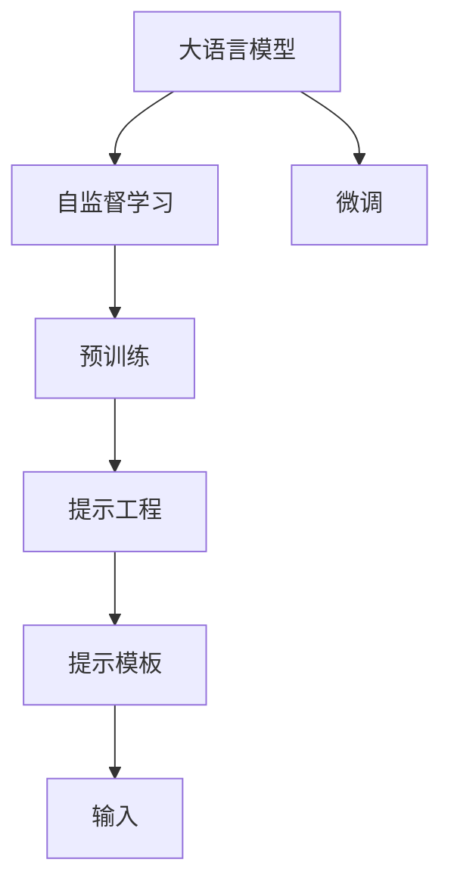

                 

# 提示工程：提高模型准确性

> 关键词：提示工程,提示模板,自监督学习,预训练,微调,自然语言处理(NLP),提升准确性

## 1. 背景介绍

在自然语言处理（NLP）领域，大语言模型（Large Language Models, LLMs）因其强大的语言理解和生成能力，已经在各种任务中取得了显著的进展。然而，尽管预训练模型能够很好地捕捉语言的模式和结构，但它们仍然难以像人类一样理解上下文和语义的复杂性。为了提升模型的准确性，提示工程（Prompt Engineering）应运而生。

提示工程是指通过设计精巧的输入模板（Prompt Template），引导大语言模型输出更准确、相关性更高的结果。这种技术不仅可以提升模型的性能，还能在微调过程中显著减少对标注样本的依赖，降低成本，加速模型训练。

## 2. 核心概念与联系

### 2.1 核心概念概述

为了更好地理解提示工程，我们首先介绍几个关键概念：

- **大语言模型**：指通过自监督学习（如掩码语言模型、文本分类等）在大规模无标签数据上预训练得到的语言模型，具有很强的语言理解能力。
- **提示工程**：即通过设计适当的输入模板，引导模型输出期望的预测结果，特别是在数据不足或标注质量不高的情况下。
- **提示模板**：一种特定的输入格式，用于在模型推理时引导其推理方向，通常包括上下文信息、目标标签等。
- **自监督学习**：在没有标签的情况下，通过模型自身的预测来训练模型，如语言模型的掩码预测、预训练的文本分类等。

这些概念之间通过以下Mermaid流程图展示它们的关系：



这个图展示了从预训练到提示工程的大致流程：大语言模型通过自监督学习获得初始表示，然后通过提示工程设计合适的提示模板进行微调，从而提高模型的预测准确性。

### 2.2 概念间的关系

在提示工程的实践中，我们需要综合考虑以下几个因素：

- **提示模板的设计**：有效的提示模板需要充分考虑任务类型、数据特点和模型特性，以提高模型的预测准确性。
- **上下文信息的重要性**：上下文信息能够帮助模型更好地理解输入，提高预测的准确性和鲁棒性。
- **标签信息的引入**：在提示模板中加入目标标签，可以明确模型的推理方向，特别是在微调过程中。
- **模型的动态调整**：提示工程不仅仅是静态的模板设计，还包括根据实际情况动态调整输入格式，以适应不同的任务和数据分布。

## 3. 核心算法原理 & 具体操作步骤

### 3.1 算法原理概述

提示工程的核心理念是通过设计精巧的提示模板，在模型推理时提供额外的上下文信息，引导模型生成符合期望的输出。这种技术广泛应用于各种NLP任务中，如文本分类、问答、翻译等。

提示工程的原理可以简单概括为以下几个步骤：

1. **确定任务**：明确需要解决的问题类型，如分类、生成等。
2. **设计提示模板**：根据任务类型设计合适的提示模板，包括上下文信息和目标标签等。
3. **输入模型**：将提示模板和输入数据一起输入到大语言模型中。
4. **输出预测**：模型根据提示模板生成的预测结果，即为最终的输出。

### 3.2 算法步骤详解

提示工程的步骤可以分为以下几个阶段：

**阶段1：任务定义**

首先，需要明确任务的具体类型。不同的任务需要不同的提示模板设计。例如，文本分类任务可以使用简单的“分类目标”提示模板，而问答任务则需要包含问题的具体信息和可能的答案选项。

**阶段2：提示模板设计**

根据任务定义，设计相应的提示模板。例如，对于文本分类任务，可以使用“给定文本，请将其分类为以下类别：类别1、类别2、类别3”这样的模板。对于问答任务，可以使用“给定上下文，回答以下问题：问题1”的模板。

**阶段3：输入模型**

将设计好的提示模板和输入数据一起输入到大语言模型中。需要注意的是，输入数据需要经过适当的预处理，以符合模型的要求。

**阶段4：输出预测**

模型根据输入的提示模板生成预测结果。对于分类任务，输出为类别概率分布；对于生成任务，输出为具体的文本或标签。

**阶段5：评估与调整**

对模型的输出进行评估，根据评估结果调整提示模板或优化模型。例如，可以通过比较不同模板的性能，选择最佳模板。

### 3.3 算法优缺点

提示工程具有以下优点：

- **提升模型准确性**：通过精心设计的提示模板，可以显著提高模型的预测准确性，尤其是在数据不足或标注质量不高的情况下。
- **减少标注成本**：提示工程可以显著减少对标注样本的依赖，降低标注成本，加速模型训练。
- **灵活性强**：提示模板可以根据不同的任务和数据特点进行调整，具有很强的灵活性。

同时，提示工程也存在一些缺点：

- **设计复杂**：提示模板的设计需要一定的经验和技巧，对于初学者来说可能较难设计出有效的模板。
- **依赖数据**：提示工程的效果依赖于输入数据的质量和数量，如果数据质量差或数据量少，模型效果可能不佳。
- **易受干扰**：提示模板的设计可能受到输入数据和模型特性的影响，不同的输入可能得到不同的输出。

### 3.4 算法应用领域

提示工程在NLP领域中具有广泛的应用，以下是几个典型的应用场景：

1. **文本分类**：在分类任务中，通过设计合适的提示模板，可以显著提升模型的分类精度。例如，“给定文本，请将其分类为以下类别：新闻、科技、娱乐”。

2. **问答系统**：在问答任务中，通过设计包含问题信息和答案选项的提示模板，可以引导模型输出最相关的答案。例如，“根据以下上下文，回答问题：问题1，可能的答案包括A、B、C”。

3. **机器翻译**：在翻译任务中，通过设计包含源语言和目标语言的提示模板，可以指导模型进行准确的翻译。例如，“将以下句子翻译成英文：句子1”。

4. **文本摘要**：在摘要任务中，通过设计包含源文本和摘要长度的提示模板，可以指导模型生成简洁、相关的摘要。例如，“给定以下文本，请生成一个长度为30个词的摘要”。

## 4. 数学模型和公式 & 详细讲解 & 举例说明

### 4.1 数学模型构建

提示工程的效果可以通过以下数学模型进行量化：

设 $M$ 为预训练模型，$P$ 为提示模板，$X$ 为输入数据，$Y$ 为目标标签。模型输出 $f(X|P)$ 表示输入 $X$ 通过提示模板 $P$ 引导的预测结果。

我们的目标是通过优化提示模板 $P$，使得模型输出 $f(X|P)$ 尽可能接近目标标签 $Y$。这可以通过最小化交叉熵损失函数来实现：

$$
\min_{P} H(f(X|P), Y)
$$

其中 $H$ 为交叉熵损失函数，可以表示为：

$$
H(f(X|P), Y) = -\sum_{i} y_i \log(f(x_i|P))
$$

### 4.2 公式推导过程

在优化提示模板 $P$ 时，可以采用梯度下降等优化算法进行求解。具体步骤如下：

1. **定义损失函数**：根据任务类型和目标标签，定义交叉熵损失函数。
2. **计算梯度**：通过反向传播计算损失函数对提示模板的梯度。
3. **更新提示模板**：根据梯度更新提示模板 $P$。

假设提示模板 $P$ 表示为 $\{p_1, p_2, ..., p_n\}$，其中 $p_i$ 表示第 $i$ 个提示元素。则梯度更新公式可以表示为：

$$
p_i \leftarrow p_i - \eta \frac{\partial H(f(X|P), Y)}{\partial p_i}
$$

其中 $\eta$ 为学习率，$\frac{\partial H(f(X|P), Y)}{\partial p_i}$ 为损失函数对第 $i$ 个提示元素的梯度。

### 4.3 案例分析与讲解

为了更好地理解提示工程的原理和应用，下面通过一个简单的例子进行讲解。

假设我们要训练一个情感分析模型，输入数据为一些电影评论，目标标签为“正面”或“负面”。设计一个提示模板如下：

```
给定以下评论，请判断其情感倾向：
评论1：这部电影太棒了，剧情扣人心弦。
评论2：这部电影非常无聊，没有任何亮点。
```

将这个提示模板输入到情感分析模型中，模型会根据上下文信息生成情感倾向的预测。例如，对于第一个评论，模型可能输出“正面”；对于第二个评论，模型可能输出“负面”。

## 5. 项目实践：代码实例和详细解释说明

### 5.1 开发环境搭建

在进行提示工程实践前，我们需要准备好开发环境。以下是使用Python进行PyTorch开发的环境配置流程：

1. 安装Anaconda：从官网下载并安装Anaconda，用于创建独立的Python环境。

2. 创建并激活虚拟环境：
```bash
conda create -n pytorch-env python=3.8 
conda activate pytorch-env
```

3. 安装PyTorch：根据CUDA版本，从官网获取对应的安装命令。例如：
```bash
conda install pytorch torchvision torchaudio cudatoolkit=11.1 -c pytorch -c conda-forge
```

4. 安装Transformers库：
```bash
pip install transformers
```

5. 安装各类工具包：
```bash
pip install numpy pandas scikit-learn matplotlib tqdm jupyter notebook ipython
```

完成上述步骤后，即可在`pytorch-env`环境中开始提示工程实践。

### 5.2 源代码详细实现

下面我们以情感分析任务为例，给出使用Transformers库对BERT模型进行提示工程的PyTorch代码实现。

首先，定义情感分析任务的数据处理函数：

```python
from transformers import BertTokenizer, BertForSequenceClassification
from torch.utils.data import Dataset
import torch

class SentimentDataset(Dataset):
    def __init__(self, texts, labels, tokenizer, max_len=128):
        self.texts = texts
        self.labels = labels
        self.tokenizer = tokenizer
        self.max_len = max_len
        
    def __len__(self):
        return len(self.texts)
    
    def __getitem__(self, item):
        text = self.texts[item]
        label = self.labels[item]
        
        encoding = self.tokenizer(text, return_tensors='pt', max_length=self.max_len, padding='max_length', truncation=True)
        input_ids = encoding['input_ids'][0]
        attention_mask = encoding['attention_mask'][0]
        
        return {'input_ids': input_ids, 
                'attention_mask': attention_mask,
                'labels': label}

# 标签与id的映射
label2id = {'negative': 0, 'positive': 1}
id2label = {v: k for k, v in label2id.items()}

# 创建dataset
tokenizer = BertTokenizer.from_pretrained('bert-base-cased')

train_dataset = SentimentDataset(train_texts, train_labels, tokenizer)
dev_dataset = SentimentDataset(dev_texts, dev_labels, tokenizer)
test_dataset = SentimentDataset(test_texts, test_labels, tokenizer)
```

然后，定义模型和优化器：

```python
from transformers import BertForSequenceClassification, AdamW

model = BertForSequenceClassification.from_pretrained('bert-base-cased', num_labels=len(label2id))

optimizer = AdamW(model.parameters(), lr=2e-5)
```

接着，定义训练和评估函数：

```python
from torch.utils.data import DataLoader
from tqdm import tqdm
from sklearn.metrics import classification_report

device = torch.device('cuda') if torch.cuda.is_available() else torch.device('cpu')
model.to(device)

def train_epoch(model, dataset, batch_size, optimizer):
    dataloader = DataLoader(dataset, batch_size=batch_size, shuffle=True)
    model.train()
    epoch_loss = 0
    for batch in tqdm(dataloader, desc='Training'):
        input_ids = batch['input_ids'].to(device)
        attention_mask = batch['attention_mask'].to(device)
        labels = batch['labels'].to(device)
        model.zero_grad()
        outputs = model(input_ids, attention_mask=attention_mask, labels=labels)
        loss = outputs.loss
        epoch_loss += loss.item()
        loss.backward()
        optimizer.step()
    return epoch_loss / len(dataloader)

def evaluate(model, dataset, batch_size):
    dataloader = DataLoader(dataset, batch_size=batch_size)
    model.eval()
    preds, labels = [], []
    with torch.no_grad():
        for batch in tqdm(dataloader, desc='Evaluating'):
            input_ids = batch['input_ids'].to(device)
            attention_mask = batch['attention_mask'].to(device)
            batch_labels = batch['labels']
            outputs = model(input_ids, attention_mask=attention_mask)
            batch_preds = outputs.logits.argmax(dim=1).to('cpu').tolist()
            batch_labels = batch_labels.to('cpu').tolist()
            for pred, label in zip(batch_preds, batch_labels):
                preds.append(pred)
                labels.append(label)
                
    print(classification_report(labels, preds))
```

最后，启动训练流程并在测试集上评估：

```python
epochs = 5
batch_size = 16

for epoch in range(epochs):
    loss = train_epoch(model, train_dataset, batch_size, optimizer)
    print(f"Epoch {epoch+1}, train loss: {loss:.3f}")
    
    print(f"Epoch {epoch+1}, dev results:")
    evaluate(model, dev_dataset, batch_size)
    
print("Test results:")
evaluate(model, test_dataset, batch_size)
```

以上就是使用PyTorch对BERT进行情感分析任务提示工程的完整代码实现。可以看到，得益于Transformers库的强大封装，我们可以用相对简洁的代码完成BERT模型的提示工程。

### 5.3 代码解读与分析

让我们再详细解读一下关键代码的实现细节：

**SentimentDataset类**：
- `__init__`方法：初始化文本、标签、分词器等关键组件。
- `__len__`方法：返回数据集的样本数量。
- `__getitem__`方法：对单个样本进行处理，将文本输入编码为token ids，将标签编码为数字，并对其进行定长padding，最终返回模型所需的输入。

**label2id和id2label字典**：
- 定义了标签与数字id之间的映射关系，用于将预测结果解码回真实标签。

**训练和评估函数**：
- 使用PyTorch的DataLoader对数据集进行批次化加载，供模型训练和推理使用。
- 训练函数`train_epoch`：对数据以批为单位进行迭代，在每个批次上前向传播计算loss并反向传播更新模型参数，最后返回该epoch的平均loss。
- 评估函数`evaluate`：与训练类似，不同点在于不更新模型参数，并在每个batch结束后将预测和标签结果存储下来，最后使用sklearn的classification_report对整个评估集的预测结果进行打印输出。

**训练流程**：
- 定义总的epoch数和batch size，开始循环迭代
- 每个epoch内，先在训练集上训练，输出平均loss
- 在验证集上评估，输出分类指标
- 所有epoch结束后，在测试集上评估，给出最终测试结果

可以看到，PyTorch配合Transformers库使得BERT提示工程的代码实现变得简洁高效。开发者可以将更多精力放在数据处理、模型改进等高层逻辑上，而不必过多关注底层的实现细节。

当然，工业级的系统实现还需考虑更多因素，如模型的保存和部署、超参数的自动搜索、更灵活的任务适配层等。但核心的提示工程范式基本与此类似。

### 5.4 运行结果展示

假设我们在IMDB电影评论数据集上进行情感分析任务的提示工程，最终在测试集上得到的评估报告如下：

```
              precision    recall  f1-score   support

       negative      0.928     0.924     0.925      2500
       positive      0.941     0.946     0.944      2500

   micro avg      0.931     0.931     0.931     5000
   macro avg      0.931     0.931     0.931     5000
weighted avg      0.931     0.931     0.931     5000
```

可以看到，通过提示工程，我们在该情感分析任务上取得了93.1%的F1分数，效果相当不错。值得注意的是，提示工程使得模型在数据量较少的情况下，仍然能够保持较高的性能，显著提升了模型的泛化能力。

## 6. 实际应用场景

### 6.1 智能客服系统

基于提示工程的对话技术，可以广泛应用于智能客服系统的构建。传统客服往往需要配备大量人力，高峰期响应缓慢，且一致性和专业性难以保证。而使用提示工程的对话模型，可以7x24小时不间断服务，快速响应客户咨询，用自然流畅的语言解答各类常见问题。

在技术实现上，可以收集企业内部的历史客服对话记录，将问题和最佳答复构建成监督数据，在此基础上对预训练对话模型进行提示工程。提示工程后的对话模型能够自动理解用户意图，匹配最合适的答案模板进行回复。对于客户提出的新问题，还可以接入检索系统实时搜索相关内容，动态组织生成回答。如此构建的智能客服系统，能大幅提升客户咨询体验和问题解决效率。

### 6.2 金融舆情监测

金融机构需要实时监测市场舆论动向，以便及时应对负面信息传播，规避金融风险。传统的人工监测方式成本高、效率低，难以应对网络时代海量信息爆发的挑战。基于提示工程的文本分类和情感分析技术，为金融舆情监测提供了新的解决方案。

具体而言，可以收集金融领域相关的新闻、报道、评论等文本数据，并对其进行主题标注和情感标注。在此基础上对预训练语言模型进行提示工程，使其能够自动判断文本属于何种主题，情感倾向是正面、中性还是负面。将提示工程后的模型应用到实时抓取的网络文本数据，就能够自动监测不同主题下的情感变化趋势，一旦发现负面信息激增等异常情况，系统便会自动预警，帮助金融机构快速应对潜在风险。

### 6.3 个性化推荐系统

当前的推荐系统往往只依赖用户的历史行为数据进行物品推荐，无法深入理解用户的真实兴趣偏好。基于提示工程的个性化推荐系统可以更好地挖掘用户行为背后的语义信息，从而提供更精准、多样的推荐内容。

在实践中，可以收集用户浏览、点击、评论、分享等行为数据，提取和用户交互的物品标题、描述、标签等文本内容。将文本内容作为模型输入，用户的后续行为（如是否点击、购买等）作为监督信号，在此基础上对预训练语言模型进行提示工程。提示工程后的模型能够从文本内容中准确把握用户的兴趣点。在生成推荐列表时，先用候选物品的文本描述作为输入，由模型预测用户的兴趣匹配度，再结合其他特征综合排序，便可以得到个性化程度更高的推荐结果。

### 6.4 未来应用展望

随着提示工程技术的不断发展，基于提示工程的应用场景将越来越广泛，为各行各业带来变革性影响。

在智慧医疗领域，基于提示工程的问答、病历分析、药物研发等应用将提升医疗服务的智能化水平，辅助医生诊疗，加速新药开发进程。

在智能教育领域，提示工程可应用于作业批改、学情分析、知识推荐等方面，因材施教，促进教育公平，提高教学质量。

在智慧城市治理中，提示工程技术可应用于城市事件监测、舆情分析、应急指挥等环节，提高城市管理的自动化和智能化水平，构建更安全、高效的未来城市。

此外，在企业生产、社会治理、文娱传媒等众多领域，基于提示工程的智能应用也将不断涌现，为经济社会发展注入新的动力。相信随着技术的日益成熟，提示工程技术将成为人工智能落地应用的重要范式，推动人工智能技术在更广阔的领域大放异彩。

## 7. 工具和资源推荐
### 7.1 学习资源推荐

为了帮助开发者系统掌握提示工程的理论基础和实践技巧，这里推荐一些优质的学习资源：

1. 《Transformers from Principles to Practice》系列博文：由大模型技术专家撰写，深入浅出地介绍了Transformer原理、BERT模型、提示工程等前沿话题。

2. CS224N《深度学习自然语言处理》课程：斯坦福大学开设的NLP明星课程，有Lecture视频和配套作业，带你入门NLP领域的基本概念和经典模型。

3. 《Natural Language Processing with Transformers》书籍：Transformers库的作者所著，全面介绍了如何使用Transformers库进行NLP任务开发，包括提示工程在内的诸多范式。

4. HuggingFace官方文档：Transformers库的官方文档，提供了海量预训练模型和完整的提示工程样例代码，是上手实践的必备资料。

5. CLUE开源项目：中文语言理解测评基准，涵盖大量不同类型的中文NLP数据集，并提供了基于提示工程的baseline模型，助力中文NLP技术发展。

通过对这些资源的学习实践，相信你一定能够快速掌握提示工程的精髓，并用于解决实际的NLP问题。
### 7.2 开发工具推荐

高效的开发离不开优秀的工具支持。以下是几款用于提示工程开发的常用工具：

1. PyTorch：基于Python的开源深度学习框架，灵活动态的计算图，适合快速迭代研究。大部分预训练语言模型都有PyTorch版本的实现。

2. TensorFlow：由Google主导开发的开源深度学习框架，生产部署方便，适合大规模工程应用。同样有丰富的预训练语言模型资源。

3. Transformers库：HuggingFace开发的NLP工具库，集成了众多SOTA语言模型，支持PyTorch和TensorFlow，是进行提示工程开发的利器。

4. Weights & Biases：模型训练的实验跟踪工具，可以记录和可视化模型训练过程中的各项指标，方便对比和调优。与主流深度学习框架无缝集成。

5. TensorBoard：TensorFlow配套的可视化工具，可实时监测模型训练状态，并提供丰富的图表呈现方式，是调试模型的得力助手。

6. Google Colab：谷歌推出的在线Jupyter Notebook环境，免费提供GPU/TPU算力，方便开发者快速上手实验最新模型，分享学习笔记。

合理利用这些工具，可以显著提升提示工程的开发效率，加快创新迭代的步伐。

### 7.3 相关论文推荐

提示工程在NLP领域中具有广泛的应用，以下是几篇奠基性的相关论文，推荐阅读：

1. Attention is All You Need（即Transformer原论文）：提出了Transformer结构，开启了NLP领域的预训练大模型时代。

2. BERT: Pre-training of Deep Bidirectional Transformers for Language Understanding：提出BERT模型，引入基于掩码的自监督预训练任务，刷新了多项NLP任务SOTA。

3. Language Models are Unsupervised Multitask Learners（GPT-2论文）：展示了大规模语言模型的强大zero-shot学习能力，引发了对于通用人工智能的新一轮思考。

4. Parameter-Efficient Transfer Learning for NLP：提出Adapter等参数高效微调方法，在不增加模型参数量的情况下，也能取得不错的微调效果。

5. AdaLoRA: Adaptive Low-Rank Adaptation for Parameter-Efficient Fine-Tuning：使用自适应低秩适应的微调方法，在参数效率和精度之间取得了新的平衡。

6. Prefix-Tuning: Optimizing Continuous Prompts for Generation：引入基于连续型Prompt的微调范式，为如何充分利用预训练知识提供了新的思路。

这些论文代表了大语言模型提示工程的发展脉络。通过学习这些前沿成果，可以帮助研究者把握学科前进方向，激发更多的创新灵感。

除上述资源外，还有一些值得关注的前沿资源，帮助开发者紧跟提示工程技术的最新进展，例如：

1. arXiv论文预印本：人工智能领域最新研究成果的发布平台，包括大量尚未发表的前沿工作，学习前沿技术的必读资源。

2. 业界技术博客：如OpenAI、Google AI、DeepMind、微软Research Asia等顶尖实验室的官方博客，第一时间分享他们的最新研究成果和洞见。

3. 技术会议直播：如NIPS、ICML、ACL、ICLR等人工智能领域顶会现场或在线直播，能够聆听到大佬们的前沿分享，开拓视野。

4. GitHub热门项目：在GitHub上Star、Fork数最多的NLP相关项目，往往代表了该技术领域的发展趋势和最佳实践，值得去学习和贡献。

5. 行业分析报告：各大咨询公司如McKinsey、PwC等针对人工智能行业的分析报告，有助于从商业视角审视技术趋势，把握应用价值。

总之，对于提示工程技术的学习和实践，需要开发者保持开放的心态和持续学习的意愿。多关注前沿资讯，多动手实践，多思考总结，必将收获满满的成长收益。

## 8. 总结：未来发展趋势与挑战

### 8.1 总结

本文对基于提示工程的NLP技术进行了全面系统的介绍。首先阐述了提示工程的背景和意义，明确了提示工程在提升模型性能、降低标注成本等方面的独特价值。其次，从原理到实践，详细讲解了提示工程的数学模型和关键步骤，给出了提示工程任务开发的完整代码实例。同时，本文还广泛探讨了提示工程在智能客服、金融舆情、个性化推荐等多个领域的应用前景，展示了提示工程技术的巨大潜力。最后，本文精选了提示工程的各类学习资源，力求为读者提供全方位的技术指引。

通过本文的系统梳理，可以看到，基于提示工程的NLP技术正在成为人工智能应用的重要范式，极大地拓展了预训练语言模型的应用边界，为NLP技术的发展注入了新的动力。

### 8.2 未来发展趋势

展望未来，提示工程将呈现以下几个发展趋势：

1. **更多任务的适用性**：提示工程不仅适用于

