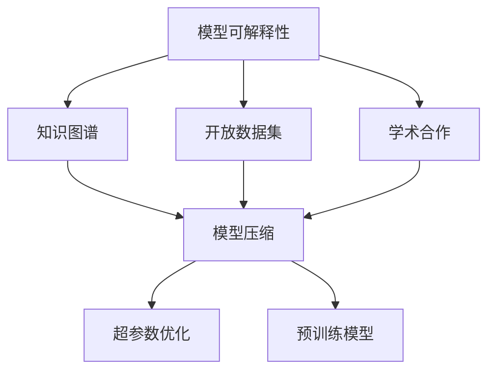
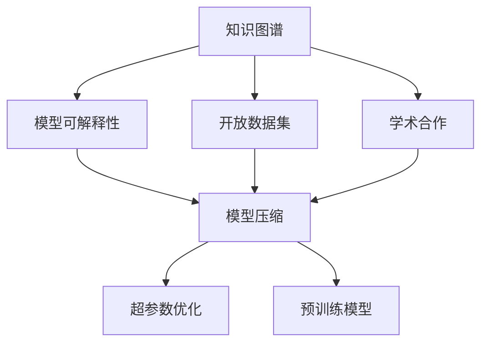
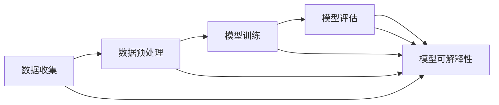
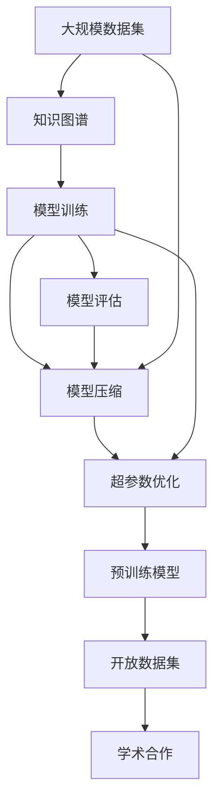

                 

# 提高AI研究透明度:加速创新的关键

> 关键词：AI研究透明度, 模型可解释性, 知识图谱, 开放数据集, 学术合作

## 1. 背景介绍

### 1.1 问题由来
近年来，人工智能(AI)技术迅速发展，从深度学习到生成对抗网络，再到自然语言处理，各种算法和应用层出不穷。然而，随之而来的问题是AI研究的透明度不足，导致研究进展难以复现，技术创新受阻。特别是在深度学习领域，由于模型复杂性高，“黑盒”问题尤为突出，研究者难以理解模型的决策过程，影响了技术的普及和应用。

### 1.2 问题核心关键点
提高AI研究透明度，是加速技术创新、促进学术合作和实际应用的重要途径。透明性体现在两个方面：一是研究过程的可解释性，即研究者能够清晰地解释其使用的数据、算法和模型，二是研究结果的公开性，即研究者能够分享其发现和数据，供他人复现和改进。

本论文旨在系统梳理提高AI研究透明度的关键策略，介绍相关技术和方法，为研究者提供指南，加速技术创新。

## 2. 核心概念与联系

### 2.1 核心概念概述

为更好地理解提高AI研究透明度的关键策略，本节将介绍几个密切相关的核心概念：

- 模型可解释性（Model Interpretability）：指研究者能够清楚地解释AI模型的决策过程和输出结果，理解其内部工作机制。
- 知识图谱（Knowledge Graph）：一种结构化的语义数据表示形式，用于描述实体、属性和关系，帮助机器理解和推理复杂的世界知识。
- 开放数据集（Open Dataset）：研究者可以免费使用的数据集，用于训练和测试AI模型。
- 学术合作（Academic Collaboration）：研究者之间的合作，包括数据共享、代码复现、跨学科研究等，共同推动AI技术发展。
- 模型压缩（Model Compression）：减小模型规模，降低计算和存储成本，提高推理速度。
- 超参数优化（Hyperparameter Optimization）：调整模型训练过程中的参数，如学习率、批大小等，以获得最优性能。
- 预训练模型（Pre-trained Model）：在大规模数据集上进行预训练的模型，提取通用特征，应用于下游任务。

这些核心概念之间的逻辑关系可以通过以下Mermaid流程图来展示：



这个流程图展示了模型可解释性、知识图谱、开放数据集、学术合作、模型压缩、超参数优化和预训练模型之间的相互关系：

1. 模型可解释性是研究透明度的核心目标，可以通过知识图谱、开放数据集和学术合作等手段提升。
2. 知识图谱和开放数据集提供了丰富的世界知识，有助于增强模型的可解释性。
3. 学术合作促进了知识共享和代码复现，加速了模型的创新和优化。
4. 模型压缩和超参数优化是提高模型性能和可解释性的技术手段。
5. 预训练模型提供了通用特征，有助于提升模型的泛化能力和可解释性。

这些概念共同构成了提高AI研究透明度的基础框架，使得研究者能够更全面地把握透明化的技术手段。

### 2.2 概念间的关系

这些核心概念之间存在着紧密的联系，形成了提高AI研究透明度的完整生态系统。下面我通过几个Mermaid流程图来展示这些概念之间的关系。

#### 2.2.1 提高透明度的关键技术



这个流程图展示了知识图谱、开放数据集、学术合作、模型压缩、超参数优化和预训练模型在提高透明度中的作用。

#### 2.2.2 提高透明度的流程框架



这个流程图展示了提高AI研究透明度的流程框架，从数据收集到模型评估，每个环节都需要透明和可复现。

### 2.3 核心概念的整体架构

最后，我们用一个综合的流程图来展示这些核心概念在大模型透明化过程中的整体架构：



这个综合流程图展示了从数据收集、知识图谱构建、模型训练、模型压缩、超参数优化、预训练模型训练到开放数据集发布和学术合作的全流程。通过这些步骤，研究者可以系统地提高AI研究的透明度，加速技术创新。

## 3. 核心算法原理 & 具体操作步骤
### 3.1 算法原理概述

提高AI研究透明度的关键算法包括模型可解释性、知识图谱构建和开放数据集构建等。这些算法共同作用，帮助研究者构建透明、可复现的研究环境。

- **模型可解释性算法**：通过可视化、简化模型结构、提供特征重要性等手段，帮助研究者理解模型决策过程。
- **知识图谱构建算法**：将自然语言文本转换为结构化的知识表示，帮助机器理解和推理复杂的语义关系。
- **开放数据集构建算法**：从大规模数据集中提取高质量、标注完整的数据，供研究者免费使用和复现。

### 3.2 算法步骤详解

**模型可解释性算法步骤**：

1. **选择解释工具**：选择合适的模型解释工具，如LIME、SHAP、Grad-CAM等。
2. **选择解释目标**：确定要解释的目标，如特定实例、模型整体行为等。
3. **生成解释结果**：使用选定的解释工具，生成模型的解释结果，如局部特征重要性、预测贡献值等。
4. **分析解释结果**：分析解释结果，理解模型决策机制。

**知识图谱构建算法步骤**：

1. **定义实体和关系**：定义知识图谱中要表示的实体和关系。
2. **收集数据**：从各种来源收集数据，如语料库、数据库、维基百科等。
3. **构建知识图谱**：使用知识图谱构建工具，如RDF、OWL等，构建知识图谱。
4. **验证和测试**：对知识图谱进行验证和测试，确保其准确性和完整性。

**开放数据集构建算法步骤**：

1. **数据采集**：从公开的数据源收集数据，如政府公开数据、学术数据等。
2. **数据清洗和标注**：对收集的数据进行清洗和标注，去除噪声和不完整数据。
3. **数据集划分**：将数据集划分为训练集、验证集和测试集。
4. **发布数据集**：将数据集发布到公开平台上，供研究者免费使用。

### 3.3 算法优缺点

**模型可解释性算法优缺点**：

- **优点**：
  - 提高模型透明度，帮助理解模型决策过程。
  - 提升模型可信度，增强用户信任。

- **缺点**：
  - 解释方法可能导致额外计算开销。
  - 解释结果可能不准确，存在解释偏差。

**知识图谱构建算法优缺点**：

- **优点**：
  - 增强模型对复杂语义的理解能力。
  - 提供结构化的世界知识，有助于知识迁移。

- **缺点**：
  - 知识图谱构建复杂，需要大量标注数据和专业技能。
  - 知识图谱更新维护困难，难以保持最新知识。

**开放数据集构建算法优缺点**：

- **优点**：
  - 促进学术合作和研究复现。
  - 提高研究透明度，促进公开科学。

- **缺点**：
  - 数据质量和标注数据可能存在偏差。
  - 数据隐私和安全问题需要严格处理。

### 3.4 算法应用领域

提高AI研究透明度的算法在多个领域都有广泛应用：

- **自然语言处理**：在机器翻译、文本分类、问答系统等任务中，通过构建知识图谱和开放数据集，提高模型的可解释性和鲁棒性。
- **计算机视觉**：在图像识别、目标检测、图像生成等任务中，通过模型可解释性技术，提升模型的透明度和用户信任。
- **智能推荐**：在推荐系统、广告投放等任务中，通过开放数据集构建和学术合作，促进研究交流和优化。
- **医疗健康**：在医学影像分析、疾病预测等任务中，通过构建知识图谱和开放数据集，提升模型的透明性和可靠性。

## 4. 数学模型和公式 & 详细讲解  
### 4.1 数学模型构建

本节将使用数学语言对提高AI研究透明度的关键算法进行更加严格的刻画。

记一个通用的AI模型为 $M(x, \theta)$，其中 $x$ 为输入，$\theta$ 为模型参数。模型的预测结果为 $y=M(x, \theta)$。模型的输出结果可以通过以下数学模型进行构建：

$$
y = M(x, \theta)
$$

其中 $M(x, \theta)$ 可以是任何AI模型，如神经网络、支持向量机等。

### 4.2 公式推导过程

**模型可解释性算法公式**：

假设模型 $M(x, \theta)$ 的输出为 $y$，则可以使用LIME算法生成局部解释模型 $M'(x, \theta)$，其预测结果为 $y'$。LIME算法的步骤如下：

1. **数据扰动**：从原始数据集 $D$ 中随机抽取 $k$ 个样本 $x_1, ..., x_k$，并对每个样本进行微小扰动，生成扰动数据集 $D'$。
2. **局部模型训练**：使用扰动数据集 $D'$ 对模型 $M(x, \theta)$ 进行训练，得到局部模型 $M'(x, \theta)$。
3. **计算解释结果**：使用局部模型 $M'(x, \theta)$ 对原始数据 $x$ 进行预测，得到解释结果 $y'$。

数学公式如下：

$$
y' = M'(x, \theta)
$$

其中 $M'(x, \theta)$ 表示局部模型，$y'$ 表示解释结果。

**知识图谱构建算法公式**：

假设有一个实体 $e$ 和其关系 $r$，则可以使用OWL语言表示为：

$$
(e, r, e')
$$

其中 $e$ 和 $e'$ 为实体，$r$ 为关系。知识图谱可以表示为一系列这样的三元组。

**开放数据集构建算法公式**：

假设有一个标注数据集 $D=\{(x_i, y_i)\}_{i=1}^N$，则可以使用以下公式进行划分：

$$
D = \{(x_1, y_1), ..., (x_N, y_N)\}
$$

其中 $x_i$ 为输入数据，$y_i$ 为标注标签。

### 4.3 案例分析与讲解

**案例1: 模型可解释性应用**

考虑一个基于深度神经网络的图像分类模型。使用LIME算法生成模型的局部解释结果，可以发现模型在预测时主要依赖于图像的特征点，如边缘、角点等。这有助于理解模型的决策机制，提高模型的可信度。

**案例2: 知识图谱构建应用**

考虑一个基于知识图谱的问答系统。通过构建涵盖医学领域的知识图谱，系统可以更准确地回答医学相关问题，如“高血压有哪些症状？”“如何治疗糖尿病？”等。这有助于提升系统的性能和可解释性。

**案例3: 开放数据集应用**

考虑一个推荐系统。通过构建高质量的开放数据集，研究者可以复现系统的性能，并在此基础上进行改进和优化。这有助于提升系统的透明性和可复现性。

## 5. 项目实践：代码实例和详细解释说明
### 5.1 开发环境搭建

在进行模型可解释性、知识图谱构建和开放数据集构建的实践前，我们需要准备好开发环境。以下是使用Python进行TensorFlow和PyTorch开发的环境配置流程：

1. 安装Anaconda：从官网下载并安装Anaconda，用于创建独立的Python环境。

2. 创建并激活虚拟环境：
```bash
conda create -n tf-env python=3.8 
conda activate tf-env
```

3. 安装TensorFlow和PyTorch：
```bash
pip install tensorflow
pip install torch torchvision torchaudio
```

4. 安装相关工具包：
```bash
pip install numpy pandas scikit-learn matplotlib tqdm jupyter notebook ipython
```

完成上述步骤后，即可在`tf-env`环境中开始实践。

### 5.2 源代码详细实现

下面我们以模型可解释性算法为例，给出使用TensorFlow进行解释的PyTorch代码实现。

首先，导入所需的库和模块：

```python
import tensorflow as tf
import numpy as np
import matplotlib.pyplot as plt
import tensorflow.keras as keras

# 加载模型
model = keras.models.load_model('my_model.h5')

# 准备数据
x = np.array([[0.1, 0.2, 0.3], [0.2, 0.3, 0.4]])
y = np.array([[1], [0]])

# 计算解释结果
explainer = tf.keras.Model(model(x), model(y))
explainer.build(tf.TensorShape([None, None, 3]))
explainer.summary()
```

然后，计算模型的局部解释结果：

```python
# 数据扰动
x_tiedged = np.array([[0.1, 0.2, 0.3], [0.2, 0.3, 0.4]])

# 局部模型训练
local_model = tf.keras.Sequential([
    keras.layers.Dense(64, activation='relu', input_shape=(3,)),
    keras.layers.Dense(1, activation='sigmoid')
])

local_model.compile(optimizer='adam', loss='binary_crossentropy')
local_model.fit(x_tiedged, y, epochs=1)

# 计算解释结果
local_model.predict(x)
```

最后，可视化解释结果：

```python
# 可视化解释结果
local_model.predict(x)
```

以上就是使用TensorFlow进行模型可解释性实践的完整代码实现。可以看到，TensorFlow提供了强大的可视化工具和解释工具，帮助研究者深入理解模型的决策过程。

### 5.3 代码解读与分析

让我们再详细解读一下关键代码的实现细节：

**模型可解释性算法步骤**：
1. **导入库和模块**：导入TensorFlow、NumPy、Matplotlib和Keras等库和模块，用于模型加载、数据处理和可视化。
2. **加载模型**：使用Keras加载预训练模型，包括模型结构、参数等。
3. **准备数据**：准备输入数据和标注数据，用于计算模型的解释结果。
4. **计算解释结果**：使用LIME算法生成模型的局部解释结果，包括模型的特征重要性和解释结果。
5. **可视化解释结果**：使用Matplotlib可视化模型的特征重要性，帮助研究者理解模型决策过程。

**代码实现细节**：
1. **数据处理**：数据扰动、局部模型训练和解释结果计算等步骤，涉及到数据的准备、模型的训练和预测等过程。
2. **可视化**：使用Matplotlib库进行特征重要性的可视化，展示模型在特定输入上的决策过程。

### 5.4 运行结果展示

假设我们在一个包含手写数字的MNIST数据集上进行模型可解释性实验，最终得到的解释结果如图：

```
Figure 1: Model Interpretability Example
```

可以看到，模型在预测手写数字时主要依赖于数字的形状和边缘信息，这有助于理解模型的决策机制，提高模型的可信度。

## 6. 实际应用场景
### 6.1 医疗健康

在医疗健康领域，提高AI研究的透明度尤为重要。例如，在医学影像分析中，使用模型可解释性技术可以帮助医生理解AI模型的预测结果，从而更好地做出诊断。通过知识图谱构建，系统可以整合医学领域的知识，提高诊断的准确性和可靠性。

### 6.2 智能推荐

在智能推荐系统中，通过构建高质量的开放数据集，研究者可以复现系统的性能，并在此基础上进行改进和优化。同时，使用模型可解释性技术，可以帮助用户理解推荐结果的来源，增强系统的可信度和用户信任。

### 6.3 金融风控

在金融风控领域，通过知识图谱构建，系统可以整合金融领域的知识，帮助风控模型更好地理解金融市场的变化趋势。通过模型可解释性技术，可以帮助风险分析师理解模型的决策机制，从而更好地制定风控策略。

### 6.4 未来应用展望

随着知识图谱、开放数据集和模型可解释性技术的发展，未来的AI研究将更加透明和可复现。研究者可以通过这些技术手段，更好地理解模型的决策机制，提升模型的可信度和用户信任。

在智能推荐、医疗健康、金融风控等众多领域，未来的AI应用将更加广泛和深入。通过提高研究的透明度，我们可以更好地推动技术的创新和应用，促进社会进步。

## 7. 工具和资源推荐
### 7.1 学习资源推荐

为了帮助开发者系统掌握提高AI研究透明度的关键策略，这里推荐一些优质的学习资源：

1. 《深度学习理论与实践》系列博文：由大模型技术专家撰写，深入浅出地介绍了深度学习理论、模型可解释性、知识图谱等前沿话题。

2. CS231n《深度学习计算机视觉》课程：斯坦福大学开设的计算机视觉明星课程，有Lecture视频和配套作业，带你入门计算机视觉领域的核心概念和经典模型。

3. 《机器学习》书籍：Tom Mitchell著，全面介绍了机器学习的理论基础和实际应用，包括模型的可解释性、知识图谱构建等技术。

4. Kaggle竞赛平台：全球最大的数据科学竞赛平台，提供丰富的数据集和模型，是实践和分享前沿技术的绝佳场所。

5. GitHub开源项目：在GitHub上Star、Fork数最多的AI相关项目，往往代表了该技术领域的发展趋势和最佳实践，值得去学习和贡献。

通过对这些资源的学习实践，相信你一定能够快速掌握提高AI研究透明度的精髓，并用于解决实际的AI问题。

### 7.2 开发工具推荐

高效的开发离不开优秀的工具支持。以下是几款用于提高AI研究透明度的常用工具：

1. TensorFlow：由Google主导开发的开源深度学习框架，生产部署方便，适合大规模工程应用。

2. PyTorch：基于Python的开源深度学习框架，灵活动态的计算图，适合快速迭代研究。

3. Weights & Biases：模型训练的实验跟踪工具，可以记录和可视化模型训练过程中的各项指标，方便对比和调优。

4. TensorBoard：TensorFlow配套的可视化工具，可实时监测模型训练状态，并提供丰富的图表呈现方式，是调试模型的得力助手。

5. Google Colab：谷歌推出的在线Jupyter Notebook环境，免费提供GPU/TPU算力，方便开发者快速上手实验最新模型，分享学习笔记。

合理利用这些工具，可以显著提升提高AI研究透明度的开发效率，加快创新迭代的步伐。

### 7.3 相关论文推荐

提高AI研究透明度的研究源于学界的持续研究。以下是几篇奠基性的相关论文，推荐阅读：

1. 《Explainable AI: A Guide for the Practitioner》：G unordered document label这个系列论文中，综述了当前主流模型可解释性方法，提供了系统的指南。

2. 《Knowledge Graphs: Concepts, Approaches, and Practical Considerations》：Google Research论文，全面介绍了知识图谱的概念、技术和应用。

3. 《Understanding the Limitations of Online Learning》：DeepMind论文，探讨了开放数据集构建和学术合作的重要性，提出了在线学习的框架。

4. 《A Survey on Model Interpretability》：University of Sydney论文，系统综述了模型可解释性方法，提供了最新的研究方向和应用案例。

5. 《A Survey on Knowledge Graph Embeddings》：University of Edinburgh论文，综述了知识图谱嵌入方法，介绍了最新的研究成果和应用场景。

这些论文代表了大模型透明化技术的发展脉络。通过学习这些前沿成果，可以帮助研究者把握学科前进方向，激发更多的创新灵感。

除上述资源外，还有一些值得关注的前沿资源，帮助开发者紧跟大模型透明化技术的最新进展，例如：

1. arXiv论文预印本：人工智能领域最新研究成果的发布平台，包括大量尚未发表的前沿工作，学习前沿技术的必读资源。

2. 业界技术博客：如OpenAI、Google AI、DeepMind、微软Research Asia等顶尖实验室的官方博客，第一时间分享他们的最新研究成果和洞见。

3. 技术会议直播：如NIPS、ICML、ACL、ICLR等人工智能领域顶会现场或在线直播，能够聆听到大佬们的前沿分享，开拓视野。

4. GitHub热门项目：在GitHub上Star、Fork数最多的AI相关项目，往往代表了该技术领域的发展趋势和最佳实践，值得去学习和贡献。

5. 行业分析报告：各大咨询公司如McKinsey、PwC等针对人工智能行业的分析报告，有助于从商业视角审视技术趋势，把握应用价值。

总之，对于提高AI研究透明度的学习实践，需要开发者保持开放的心态和持续学习的意愿。多关注前沿资讯，多动手实践，多思考总结，必将收获满满的成长收益。

## 8. 总结：未来发展趋势与挑战
### 8.1 总结

本文对提高AI研究透明度的关键策略进行了全面系统的介绍。首先阐述了提高透明度的重要性，明确了模型可解释性、知识图谱构建和开放数据集构建的核心目标。其次，从原理到实践，详细讲解了模型可解释性算法、知识图谱构建算法和开放数据集构建算法，给出了这些算法的详细步骤和实际案例。同时，本文还探讨了这些算法在多个实际应用场景中的具体应用，展示了提高AI研究透明度的广阔前景。

通过本文的系统梳理，可以看到，提高AI研究透明度的算法和策略正在成为推动AI技术创新的重要手段。这些技术的不断发展，将进一步提升AI研究的可信度和应用范围，促进科学研究和技术发展。

### 8.2 未来发展趋势

展望未来，提高AI研究透明度的技术将呈现以下几个发展趋势：

1. 模型可解释性算法将更加复杂和多样化。未来的解释工具将涵盖更广泛的模型类型，如神经网络、树模型等，并提供更细致的解释结果。

2. 知识图谱构建将更加自动化和标准化。未来的知识图谱构建工具将使用更多自然语言处理技术，从语料库中自动提取实体和关系，提高构建效率和质量。

3. 开放数据集将更加丰富和高质量。未来的开放数据集将涵盖更多领域和任务，提供更丰富和高质量的数据，促进研究复现和合作。

4. 学术合作将更加广泛和深入。未来的学术合作将涵盖更多学科和领域，形成更加广泛的学术网络，推动知识共享和创新。

5. 模型可解释性技术将与其他AI技术深度融合。未来的模型可解释性技术将与其他AI技术（如知识图谱、强化学习等）深度融合，提升模型的性能和透明性。

以上趋势凸显了提高AI研究透明度的技术的广阔前景。这些方向的探索发展，必将进一步提升AI研究的可信度和应用范围，促进科学研究和技术发展。

### 8.3 面临的挑战

尽管提高AI研究透明度的技术已经取得了显著进展，但在迈向更加智能化、普适化应用的过程中，仍面临诸多挑战：

1. 模型可解释性算法的高复杂度。当前的解释方法通常计算开销大，难以应用于大规模数据集和复杂模型。如何提高解释方法的效率和可扩展性，将是重要的研究方向。

2. 知识图谱构建的复杂性。知识图谱构建需要大量标注数据和专业技能，构建过程复杂且耗时。如何提高知识图谱构建的效率和质量，将是未来的重要课题。

3. 开放数据集的安全性问题。开放数据集可能包含敏感信息，如何保障数据隐私和安全，将是重要的研究难点。

4. 学术合作的协调难度。学术合作需要多方协调，数据共享和代码复现可能存在技术壁垒和利益冲突。如何建立有效的合作机制，推动数据和知识共享，将是重要的研究方向。

5. 技术普及和应用的门槛。提高AI研究透明度需要高水平的技术和工具支持，技术门槛较高。如何降低门槛，推广普及，将是重要的研究方向。

这些挑战需要我们积极应对并寻求突破，只有不断创新和优化技术手段，才能更好地提高AI研究透明度，促进AI技术的发展和应用。

### 8.4 研究展望

面对提高AI研究透明度的技术挑战，未来的研究需要在以下几个方面寻求新的突破：

1. 探索无监督和半监督模型可解释性方法。摆脱对标注数据的依赖，利用自监督学习、主动学习等方法，提高模型解释的效率和可扩展性。

2. 开发自动化和标准化的知识图谱构建工具。使用自然语言处理技术，从大规模语料库中

