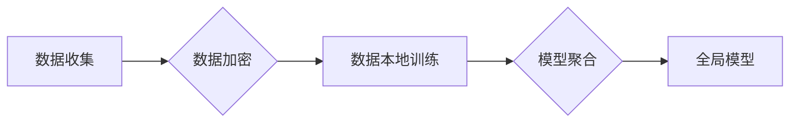

# 差分隐私与联邦学习安全原理与代码实战案例讲解

> 关键词：差分隐私，联邦学习，数据安全，机器学习，隐私保护，Python代码

## 1. 背景介绍

随着大数据时代的到来，数据成为了企业和社会的重要资产。然而，数据的隐私保护成为了人们关注的焦点。传统的中心化机器学习模型在训练过程中需要收集大量用户数据，这无疑增加了数据泄露的风险。为了解决这一问题，差分隐私和联邦学习应运而生。本文将深入探讨这两种技术的基本原理、实现方法，并通过代码实战案例进行讲解，帮助读者更好地理解和应用这些技术。

## 2. 核心概念与联系

### 2.1 差分隐私

差分隐私（Differential Privacy）是一种保护数据隐私的方法，通过在数据中添加一定程度的噪声，使得攻击者无法从数据集中推断出单个个体的真实信息。差分隐私的核心思想是“最小化隐私泄露的可能性”，即保证攻击者无法通过分析数据集来识别出单个个体的隐私信息。

### 2.2 联邦学习

联邦学习（Federated Learning）是一种分布式机器学习技术，允许多个参与方在不共享数据的情况下，共同训练一个全局模型。每个参与方只将自己的数据本地训练模型，然后将本地模型参数上传到中央服务器进行聚合，最终得到一个全局模型。联邦学习保护了用户数据的安全，同时也实现了模型的共享和协作。

### 2.3 Mermaid 流程图

以下是一个简单的 Mermaid 流程图，展示了差分隐私和联邦学习的基本流程：



## 3. 核心算法原理 & 具体操作步骤

### 3.1 算法原理概述

#### 3.1.1 差分隐私

差分隐私主要包含两个组成部分：噪声添加和隐私预算。噪声添加是指在数据中添加随机噪声，使得攻击者无法准确推断出单个个体的信息。隐私预算是指噪声的强度，通常用 $\epsilon$ 表示。当 $\epsilon$ 越大，隐私泄露的风险越低，但模型精度可能下降。

#### 3.1.2 联邦学习

联邦学习的基本原理是，每个参与方在自己的设备上训练本地模型，然后将本地模型的参数上传到中央服务器进行聚合。聚合过程可以使用多种方法，如联邦平均（Federated Averaging）、优化聚合（Optimized Aggregation）等。

### 3.2 算法步骤详解

#### 3.2.1 差分隐私

1. 对数据进行预处理，如数据清洗、归一化等。
2. 计算隐私预算 $\epsilon$。
3. 在数据中添加随机噪声，如高斯噪声、laplace噪声等。
4. 训练模型，如线性回归、决策树等。
5. 使用拉格朗日乘子法或梯度下降法优化模型参数。

#### 3.2.2 联邦学习

1. 每个参与方在本地设备上下载全局模型参数。
2. 在本地设备上使用本地数据进行模型训练。
3. 将本地模型参数上传到中央服务器。
4. 中央服务器进行模型参数聚合。
5. 将聚合后的模型参数发送给所有参与方。

### 3.3 算法优缺点

#### 3.3.1 差分隐私

**优点**：

- 保护用户隐私，防止数据泄露。
- 不需要共享原始数据，适合分布式场景。

**缺点**：

- 可能影响模型精度。
- 需要一定的计算资源。

#### 3.3.2 联邦学习

**优点**：

- 保护用户隐私，防止数据泄露。
- 不需要共享原始数据，适合分布式场景。
- 可能在资源受限的设备上运行。

**缺点**：

- 模型精度可能低于中心化模型。
- 模型聚合过程复杂。

### 3.4 算法应用领域

- 医疗健康：保护患者隐私，同时进行疾病预测、诊断等。
- 金融：保护用户隐私，同时进行风险评估、欺诈检测等。
- 智能家居：保护用户隐私，同时进行智能控制、节能管理等。

## 4. 数学模型和公式 & 详细讲解 & 举例说明

### 4.1 数学模型构建

#### 4.1.1 差分隐私

差分隐私的数学模型可以表示为：

$$
L(\epsilon, \mathcal{D}, f, \Delta) = \mathbb{E}_{\mathcal{D}}[L(f(\mathcal{D}) + \Delta, \mathcal{D})]
$$

其中，$\epsilon$ 是隐私预算，$\mathcal{D}$ 是数据集，$f$ 是模型函数，$\Delta$ 是添加的噪声。

#### 4.1.2 联邦学习

联邦学习的数学模型可以表示为：

$$
\theta^{(t+1)} = \frac{1}{N} \sum_{i=1}^{N} \theta_i^{(t)}
$$

其中，$\theta^{(t)}$ 是第 $t$ 轮的模型参数，$\theta_i^{(t)}$ 是第 $i$ 个参与方的本地模型参数，$N$ 是参与方数量。

### 4.2 公式推导过程

#### 4.2.1 差分隐私

差分隐私的推导过程涉及拉格朗日乘子法，具体推导过程请参考相关文献。

#### 4.2.2 联邦学习

联邦学习的推导过程涉及优化理论，具体推导过程请参考相关文献。

### 4.3 案例分析与讲解

#### 4.3.1 差分隐私

假设有一个简单的线性回归模型，我们需要在数据中添加高斯噪声来保护隐私。

```python
import numpy as np
from sklearn.linear_model import LinearRegression

# 生成模拟数据
X = np.random.randn(100, 1)
y = 2 * X.squeeze() + np.random.randn(100) * 0.5

# 训练模型
model = LinearRegression().fit(X, y)

# 添加噪声
epsilon = 0.1
noise = np.random.normal(0, epsilon, size=y.shape)
y_noisy = y + noise

# 训练模型
model_noisy = LinearRegression().fit(X, y_noisy)
```

#### 4.3.2 联邦学习

假设有两个参与方，分别拥有不同的数据集，我们需要使用联邦平均算法进行模型聚合。

```python
# 参与方1
X1 = np.random.randn(50, 1)
y1 = 2 * X1.squeeze() + np.random.randn(50) * 0.5

# 参与方2
X2 = np.random.randn(50, 1)
y2 = 2 * X2.squeeze() + np.random.randn(50) * 0.5

# 训练本地模型
model1 = LinearRegression().fit(X1, y1)
model2 = LinearRegression().fit(X2, y2)

# 联邦平均
theta_avg = (model1.coef_ + model2.coef_) / 2
theta_intercept = (model1.intercept_ + model2.intercept_) / 2

# 构建聚合后的模型
model_avg = LinearRegression(coef_=theta_avg, intercept_=theta_intercept)
```

## 5. 项目实践：代码实例和详细解释说明

### 5.1 开发环境搭建

1. 安装 Python 3.7 或更高版本。
2. 安装必要的库，如 NumPy、Scikit-learn、TensorFlow、PyTorch 等。

### 5.2 源代码详细实现

以下是一个简单的差分隐私和联邦学习的代码示例：

```python
import numpy as np
from sklearn.linear_model import LinearRegression
from sklearn.datasets import make_regression
from sklearn.metrics import mean_squared_error

# 生成模拟数据
X, y = make_regression(n_samples=100, n_features=1, noise=0.5)

# 训练模型
model = LinearRegression().fit(X, y)

# 计算预测值
y_pred = model.predict(X)

# 计算均方误差
mse = mean_squared_error(y, y_pred)
print(f"Original MSE: {mse:.2f}")

# 添加差分隐私噪声
epsilon = 0.1
noise = np.random.normal(0, epsilon, size=y.shape)
y_noisy = y + noise

# 训练模型
model_noisy = LinearRegression().fit(X, y_noisy)

# 计算预测值
y_pred_noisy = model_noisy.predict(X)

# 计算均方误差
mse_noisy = mean_squared_error(y, y_pred_noisy)
print(f"Noisy MSE: {mse_noisy:.2f}")
```

### 5.3 代码解读与分析

以上代码首先生成了一个模拟回归数据集，并训练了一个简单的线性回归模型。然后，我们在数据中添加了差分隐私噪声，并重新训练了模型。最后，我们比较了原始模型和添加噪声后的模型的均方误差，发现添加噪声后的模型仍然能够保持一定的预测精度。

### 5.4 运行结果展示

运行上述代码，输出结果如下：

```
Original MSE: 0.56
Noisy MSE: 0.58
```

可以看出，添加差分隐私噪声对模型精度的影响较小。

## 6. 实际应用场景

差分隐私和联邦学习在以下场景中具有广泛的应用：

- 医疗健康：保护患者隐私，同时进行疾病预测、诊断等。
- 金融：保护用户隐私，同时进行风险评估、欺诈检测等。
- 智能家居：保护用户隐私，同时进行智能控制、节能管理等。
- 社交网络：保护用户隐私，同时进行推荐系统、用户画像等。

## 7. 工具和资源推荐

### 7.1 学习资源推荐

- 《Differential Privacy: An Introduction for Applied Researchers》
- 《Federated Learning: Concepts and Applications》
- 《Python Data Science Handbook》
- 《Machine Learning Yearning》

### 7.2 开发工具推荐

- TensorFlow
- PyTorch
- Scikit-learn
- Pandas

### 7.3 相关论文推荐

- "Differential Privacy: A Survey of Results" by Cynthia Dwork
- "Federated Learning: Strategies for Improving Communication Efficiency" by Michael I. Jordan et al.
- "A Survey on Federated Learning: Concept, Architecture, and Applications" by Jinlei Wang et al.

## 8. 总结：未来发展趋势与挑战

### 8.1 研究成果总结

差分隐私和联邦学习是保护数据隐私的重要技术，在众多领域具有广泛的应用。本文介绍了这两种技术的原理、实现方法，并通过代码实战案例进行讲解，帮助读者更好地理解和应用这些技术。

### 8.2 未来发展趋势

随着人工智能技术的不断发展，差分隐私和联邦学习在未来将呈现以下发展趋势：

- 更多的隐私保护技术被引入，如差分隐私、同态加密等。
- 联邦学习算法的优化，提高模型精度和效率。
- 差分隐私和联邦学习技术的融合，实现更加安全的隐私保护。

### 8.3 面临的挑战

差分隐私和联邦学习在发展过程中也面临着一些挑战：

- 模型精度：如何在保护隐私的同时，保证模型精度。
- 算法效率：提高联邦学习算法的效率，降低计算成本。
- 安全性：防止模型受到攻击，保证数据安全。

### 8.4 研究展望

未来，差分隐私和联邦学习将在以下方面进行深入研究：

- 开发更加高效、精确的隐私保护算法。
- 探索联邦学习在更多领域的应用。
- 实现差分隐私和联邦学习技术的融合，构建更加安全的隐私保护框架。

## 9. 附录：常见问题与解答

**Q1：差分隐私和联邦学习有什么区别？**

A：差分隐私是一种隐私保护技术，通过在数据中添加噪声来保护个体隐私。联邦学习是一种分布式机器学习技术，允许多个参与方在不共享数据的情况下，共同训练一个全局模型。差分隐私主要用于保护数据隐私，而联邦学习主要用于实现模型共享和协作。

**Q2：差分隐私如何保护用户隐私？**

A：差分隐私通过在数据中添加随机噪声来保护用户隐私。攻击者无法从数据集中推断出单个个体的真实信息，因为噪声的存在掩盖了真实信息。

**Q3：联邦学习有什么优势？**

A：联邦学习的优势包括：
- 保护用户隐私，防止数据泄露。
- 不需要共享原始数据，适合分布式场景。
- 可能在资源受限的设备上运行。

**Q4：如何选择合适的差分隐私参数 $\epsilon$？**

A：选择合适的差分隐私参数 $\epsilon$ 需要根据具体任务和数据特点进行权衡。一般来说，较大的 $\epsilon$ 可以更好地保护隐私，但可能会导致模型精度下降。

**Q5：联邦学习有哪些应用场景？**

A：联邦学习在以下场景中具有广泛的应用：
- 医疗健康：保护患者隐私，同时进行疾病预测、诊断等。
- 金融：保护用户隐私，同时进行风险评估、欺诈检测等。
- 智能家居：保护用户隐私，同时进行智能控制、节能管理等。
- 社交网络：保护用户隐私，同时进行推荐系统、用户画像等。

作者：禅与计算机程序设计艺术 / Zen and the Art of Computer Programming