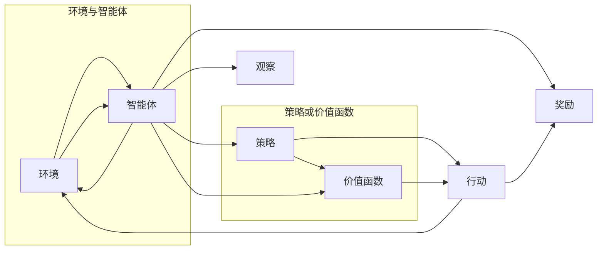

# 强化学习Reinforcement Learning与深度学习的结合之路

> 关键词：强化学习，深度学习，深度强化学习，深度Q网络，策略梯度，蒙特卡洛方法，深度策略优化，应用场景，未来趋势

## 1. 背景介绍

强化学习（Reinforcement Learning，RL）和深度学习（Deep Learning，DL）是人工智能领域的两大基石。近年来，随着计算能力的提升和大数据的积累，两者结合的深度强化学习（Deep Reinforcement Learning，DRL）技术取得了显著的进展，并在游戏、机器人、自动驾驶、推荐系统等领域展现出巨大的潜力。

### 1.1 强化学习的由来

强化学习起源于20世纪50年代，其核心思想是模仿人类学习的过程，通过与环境交互，不断尝试和错误，学习在给定环境中做出最优决策。与监督学习和无监督学习不同，强化学习中的数据是由智能体与环境交互产生的。

### 1.2 深度学习的兴起

深度学习是一种基于人工神经网络的学习方法，通过学习大量数据中的复杂特征和模式，实现图像识别、语音识别、自然语言处理等任务。深度学习在图像和语音领域的突破性进展，为强化学习提供了强大的技术支持。

### 1.3 深度强化学习的兴起

深度强化学习结合了强化学习和深度学习的优势，通过深度神经网络来学习策略或价值函数，实现了在复杂环境中的智能决策。近年来，DRL在多个领域的应用取得了显著成果，成为人工智能领域的研究热点。

## 2. 核心概念与联系

### 2.1 核心概念原理和架构的 Mermaid 流程图



### 2.2 核心概念解释

- 环境与智能体：智能体在环境中接收观察，根据策略或价值函数选择行动，并从环境中获取奖励。
- 策略：策略是智能体在给定观察下选择行动的概率分布。
- 价值函数：价值函数评估智能体在给定状态下的期望奖励。
- 观察与行动：智能体根据当前观察选择行动，并将行动传递给环境。
- 奖励：环境根据智能体的行动返回奖励，用于评估智能体的行为。

## 3. 核心算法原理 & 具体操作步骤

### 3.1 算法原理概述

深度强化学习算法的核心思想是将深度神经网络应用于强化学习，通过学习策略或价值函数，实现智能体在复杂环境中的智能决策。

### 3.2 算法步骤详解

1. **初始化**：选择合适的深度学习模型，初始化模型参数。
2. **探索与利用**：智能体在环境中进行探索，收集样本，并在一定概率下利用已知策略或价值函数进行行动。
3. **收集样本**：智能体根据策略或价值函数选择行动，并观察环境反馈的奖励和下一个状态。
4. **更新模型**：使用收集到的样本更新深度学习模型，学习策略或价值函数。
5. **迭代**：重复步骤2-4，直到满足停止条件。

### 3.3 算法优缺点

**优点**：

- 能够处理复杂环境，实现智能体在复杂环境中的智能决策。
- 可扩展性强，能够适应不同类型的环境和任务。
- 能够学习到抽象的特征和模式，提高智能体的泛化能力。

**缺点**：

- 训练过程可能非常耗时，需要大量的计算资源。
- 对于某些复杂环境，可能难以找到最优策略或价值函数。
- 模型的可解释性较差，难以理解模型内部的决策过程。

### 3.4 算法应用领域

- 游戏：如围棋、国际象棋、电子竞技等。
- 机器人：如无人驾驶、无人机等。
- 自动驾驶：如自动驾驶汽车、无人机配送等。
- 推荐系统：如电影推荐、商品推荐等。
- 金融：如风险控制、量化交易等。

## 4. 数学模型和公式 & 详细讲解 & 举例说明

### 4.1 数学模型构建

强化学习中的核心数学模型包括：

- 策略梯度：通过最大化期望奖励来学习策略。
- Q学习：通过学习状态-动作值函数来学习策略。
- 深度Q网络（DQN）：将深度神经网络应用于Q学习。

### 4.2 公式推导过程

**策略梯度**：

$$
\theta^* = \mathop{\arg\max}_{\theta} J(\theta) = \mathop{\arg\max}_{\theta} \mathbb{E}_\pi[R(s,a)]
$$

其中，$J(\theta)$ 为策略梯度，$\pi$ 为策略，$R(s,a)$ 为在状态 $s$ 下执行动作 $a$ 的期望奖励。

**Q学习**：

$$
Q(s,a) = \mathbb{E}[R(s,a) + \gamma \max_{a'} Q(s',a')]
$$

其中，$Q(s,a)$ 为状态-动作值函数，$\gamma$ 为折扣因子。

**DQN**：

$$
Q(s,a) = f_{\theta}(s,a; \theta) = f(s,a; \theta) + \lambda \max_{a'} f(s',a'; \theta)
$$

其中，$f_{\theta}$ 为深度神经网络，$\lambda$ 为学习率。

### 4.3 案例分析与讲解

以下以DQN为例，讲解深度强化学习算法的具体实现。

**代码示例**：

```python
import torch
import torch.nn as nn
import torch.optim as optim
from torch.autograd import Variable

class DQN(nn.Module):
    def __init__(self, input_size, hidden_size, output_size):
        super(DQN, self).__init__()
        self.fc1 = nn.Linear(input_size, hidden_size)
        self.fc2 = nn.Linear(hidden_size, output_size)

    def forward(self, x):
        x = torch.relu(self.fc1(x))
        x = self.fc2(x)
        return x

def optimize_model(dqn, optimizer, criterion, batch):
    optimizer.zero_grad()
    input = Variable(batch[0])
    target = Variable(batch[1])
    output = dqn(input)
    loss = criterion(output, target)
    loss.backward()
    optimizer.step()
    return loss

# 实例化DQN模型、优化器、损失函数
dqn = DQN(input_size, hidden_size, output_size)
optimizer = optim.Adam(dqn.parameters(), lr=0.001)
criterion = nn.MSELoss()

# 训练DQN模型
for epoch in range(num_epochs):
    for batch in data_loader:
        loss = optimize_model(dqn, optimizer, criterion, batch)
        print(f"Epoch {epoch}, Loss: {loss.item()}")
```

## 5. 项目实践：代码实例和详细解释说明

### 5.1 开发环境搭建

以下是使用Python进行DQN项目实践的开发环境搭建步骤：

1. 安装PyTorch库：
```bash
pip install torch torchvision
```

2. 安装OpenAI Gym环境：
```bash
pip install gym
```

### 5.2 源代码详细实现

以下是一个简单的DQN环境实现：

```python
import gym
import torch
import torch.nn as nn
import torch.optim as optim
from torch.autograd import Variable

# 定义环境
env = gym.make('CartPole-v0')

# 定义DQN模型
class DQN(nn.Module):
    def __init__(self):
        super(DQN, self).__init__()
        self.fc1 = nn.Linear(4, 24)
        self.fc2 = nn.Linear(24, 2)

    def forward(self, x):
        x = torch.relu(self.fc1(x))
        x = self.fc2(x)
        return x

# 实例化DQN模型、优化器、损失函数
dqn = DQN()
optimizer = optim.Adam(dqn.parameters(), lr=0.001)
criterion = nn.MSELoss()

# 训练DQN模型
for epoch in range(num_epochs):
    state = env.reset()
    done = False
    total_reward = 0
    while not done:
        # 将状态转换为torch张量
        state = torch.from_numpy(state).float().unsqueeze(0)
        # 前向传播
        output = dqn(state)
        # 获取最优动作
        action = output.argmax().item()
        # 执行动作
        next_state, reward, done, _ = env.step(action)
        # 将奖励转换为torch张量
        reward = torch.from_numpy(reward).float().unsqueeze(0)
        # 反向传播
        loss = criterion(output, reward)
        optimizer.zero_grad()
        loss.backward()
        optimizer.step()
        # 更新状态
        state = next_state
        total_reward += reward
    print(f"Epoch {epoch}, Total Reward: {total_reward}")
```

### 5.3 代码解读与分析

上述代码实现了一个简单的DQN环境，使用PyTorch框架进行训练。首先，定义了DQN模型，包含一个隐藏层和一个输出层。然后，实例化DQN模型、优化器和损失函数，进入训练循环。在每个epoch中，从环境中获取状态，将状态转换为torch张量，通过前向传播计算输出，根据输出选择最优动作，执行动作并获取奖励，最后将奖励转换为torch张量，进行反向传播和优化。

### 5.4 运行结果展示

运行上述代码，DQN模型将在CartPole环境中学习到稳定的策略，实现让杆子不倒的目标。

## 6. 实际应用场景

### 6.1 游戏

深度强化学习在游戏领域取得了显著的成果，如AlphaGo、AlphaZero等。这些成果证明了DRL在复杂决策问题上的强大能力。

### 6.2 机器人

深度强化学习在机器人领域也有着广泛的应用，如无人驾驶、无人机、家政机器人等。

### 6.3 自动驾驶

自动驾驶是深度强化学习的重要应用场景，通过学习复杂的驾驶策略，实现自动驾驶汽车的自动行驶。

### 6.4 推荐系统

深度强化学习可以用于构建更智能的推荐系统，如电影推荐、商品推荐等。

### 6.5 金融

深度强化学习在金融领域也有广泛的应用，如风险控制、量化交易等。

## 7. 工具和资源推荐

### 7.1 学习资源推荐

1. 《深度学习与强化学习》书籍：详细介绍了深度学习和强化学习的基本概念、原理和应用。
2. 《Reinforcement Learning: An Introduction》书籍：经典的强化学习入门教材，适合初学者阅读。
3. OpenAI Gym：一个开源的机器人学习和环境库，提供多种仿真环境和任务。

### 7.2 开发工具推荐

1. PyTorch：一个开源的深度学习框架，支持多种深度学习算法，包括DRL。
2. TensorFlow：另一个开源的深度学习框架，同样支持DRL。
3. OpenAI Baselines：一个DRL算法库，提供多种预训练模型和工具。

### 7.3 相关论文推荐

1. "Playing Atari with Deep Reinforcement Learning"：AlphaGo的原型，展示了深度强化学习在游戏领域的应用。
2. "Mastering Chess and Shogi by Self-Play with a General Reinforcement Learning Algorithm"：AlphaGo的升级版，证明了深度强化学习在围棋领域的强大能力。
3. "DeepMind's AlphaZero: Learning from Human Data"：AlphaZero的原型，展示了深度强化学习在棋类游戏领域的突破。

## 8. 总结：未来发展趋势与挑战

### 8.1 研究成果总结

深度强化学习是人工智能领域的一个重要研究方向，结合了强化学习和深度学习的优势，在多个领域取得了显著的成果。未来，DRL将在更多领域得到应用，为人工智能技术的发展做出更大贡献。

### 8.2 未来发展趋势

1. 算法创新：探索更有效的算法，提高DRL的性能和效率。
2. 资源优化：优化DRL的训练和推理资源消耗，降低成本。
3. 可解释性：提高DRL的可解释性，增强人们对DRL模型的信任。
4. 应用拓展：将DRL应用于更多领域，解决更多实际问题。

### 8.3 面临的挑战

1. 计算资源消耗：DRL的训练和推理需要大量的计算资源，限制了其应用范围。
2. 模型可解释性：DRL模型的可解释性较差，难以理解模型的决策过程。
3. 数据标注成本：DRL的训练需要大量的标注数据，数据标注成本较高。
4. 安全性和伦理问题：DRL模型在安全性和伦理问题上的风险需要引起重视。

### 8.4 研究展望

未来，DRL将在以下方面取得更多突破：

1. 混合模型：将DRL与其他人工智能技术（如知识图谱、因果推理等）进行融合，提高智能体的综合能力。
2. 元学习：研究元学习算法，使DRL能够快速适应新环境和新任务。
3. 可解释性：提高DRL的可解释性，增强人们对DRL模型的信任。
4. 应用落地：将DRL应用于更多领域，解决更多实际问题，推动人工智能技术的发展。

相信在学术界和产业界的共同努力下，DRL技术将迎来更加美好的未来。

## 9. 附录：常见问题与解答

**Q1：深度强化学习与深度学习有什么区别？**

A：深度学习是一种基于人工神经网络的学习方法，通过学习大量数据中的复杂特征和模式，实现图像识别、语音识别、自然语言处理等任务。强化学习是一种通过与环境交互，不断尝试和错误，学习在给定环境中做出最优决策的学习方法。深度强化学习是结合了深度学习和强化学习的优势，通过深度神经网络来学习策略或价值函数，实现智能体在复杂环境中的智能决策。

**Q2：深度强化学习在哪些领域有应用？**

A：深度强化学习在游戏、机器人、自动驾驶、推荐系统、金融等领域都有广泛的应用。

**Q3：深度强化学习有哪些挑战？**

A：深度强化学习面临的挑战主要包括计算资源消耗、模型可解释性、数据标注成本、安全性和伦理问题等。

**Q4：如何解决深度强化学习的挑战？**

A：可以通过以下方法解决深度强化学习的挑战：
1. 研究更有效的算法，提高DRL的性能和效率。
2. 优化DRL的训练和推理资源消耗，降低成本。
3. 提高DRL的可解释性，增强人们对DRL模型的信任。
4. 降低DRL的数据标注成本，采用无监督或半监督学习方法。
5. 加强DRL的安全性和伦理研究，确保DRL的应用安全可靠。

**Q5：深度强化学习的未来发展趋势是什么？**

A：深度强化学习的未来发展趋势包括算法创新、资源优化、可解释性提升、应用拓展等。

---

作者：禅与计算机程序设计艺术 / Zen and the Art of Computer Programming