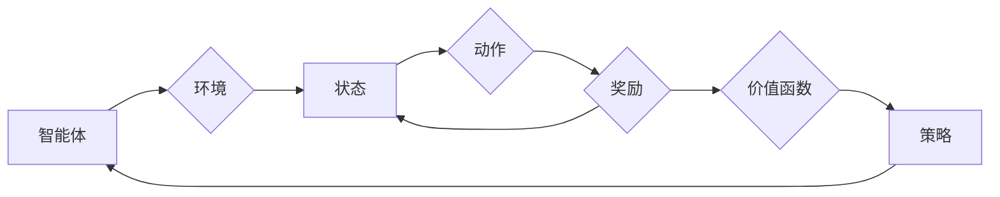

> 关键词：强化学习，不确定性建模，蒙特卡洛方法，不确定性估计，价值函数近似，策略搜索，强化学习算法

# 强化学习Reinforcement Learning研究中的不确定性建模探究

强化学习（Reinforcement Learning，RL）作为一种重要的机器学习方法，在游戏、机器人、自动驾驶等领域取得了显著的应用成果。然而，强化学习中的不确定性建模问题一直是一个挑战，它直接关系到强化学习算法的效率和收敛速度。本文将深入探讨强化学习中的不确定性建模方法，分析其原理、操作步骤、优缺点和应用领域，并展望未来发展趋势与挑战。

## 1. 背景介绍

### 1.1 问题的由来

强化学习旨在通过与环境交互，学习最优决策策略，以最大化累积奖励。然而，在实际应用中，环境往往具有不确定性，这给强化学习带来了巨大的挑战。不确定性建模旨在估计和量化这种不确定性，以指导强化学习算法的决策过程。

### 1.2 研究现状

近年来，随着深度学习技术的快速发展，深度强化学习（Deep Reinforcement Learning，DRL）逐渐成为研究热点。然而，DRL在处理不确定性时仍然面临诸多困难。目前，不确定性建模方法主要分为以下几类：

- **基于概率的方法**：通过估计状态值函数或策略的分布来建模不确定性。
- **基于置信区间的建模**：估计状态值函数的置信区间，以量化不确定性。
- **基于模型的方法**：构建环境模型，通过模型预测来估计不确定性。

### 1.3 研究意义

不确定性建模对于强化学习具有重要的意义：

- **提高决策质量**：通过估计不确定性，强化学习算法可以做出更加谨慎的决策，从而提高决策质量。
- **加速收敛速度**：不确定性建模可以帮助算法更快地收敛到最优策略。
- **增强鲁棒性**：不确定性建模可以使强化学习算法更好地适应环境变化。

## 2. 核心概念与联系

### 2.1 核心概念

#### 2.1.1 强化学习

强化学习是一种使智能体通过与环境的交互来学习如何采取行动以最大化累积奖励的方法。其核心概念包括：

- **智能体**：执行动作并从环境中获取奖励的实体。
- **环境**：智能体所处的世界，包含状态空间、动作空间和奖励函数。
- **策略**：智能体在给定状态下采取动作的规则。
- **价值函数**：表示从某个状态开始采取某个策略所能获得的最大期望奖励。
- **Q函数**：表示在某个状态下采取某个动作所能获得的最大期望奖励。

#### 2.1.2 不确定性建模

不确定性建模旨在估计和量化强化学习过程中的不确定性。其主要方法包括：

- **概率方法**：通过估计状态值函数或策略的分布来建模不确定性。
- **置信区间方法**：估计状态值函数的置信区间，以量化不确定性。
- **模型方法**：构建环境模型，通过模型预测来估计不确定性。

### 2.2 核心概念原理和架构的 Mermaid 流程图



## 3. 核心算法原理 & 具体操作步骤

### 3.1 算法原理概述

强化学习中的不确定性建模主要分为以下几种方法：

#### 3.1.1 概率方法

概率方法通过估计状态值函数或策略的分布来建模不确定性。常见的概率方法包括：

- **随机策略**：直接使用随机策略来建模不确定性。
- **分布策略**：使用分布策略来表示策略的不确定性。

#### 3.1.2 置信区间方法

置信区间方法通过估计状态值函数的置信区间来量化不确定性。常见的置信区间方法包括：

- **置信区间的缩放**：使用置信区间的缩放系数来估计不确定性。
- **置信区间的合并**：将多个置信区间合并来估计不确定性。

#### 3.1.3 模型方法

模型方法通过构建环境模型来估计不确定性。常见的模型方法包括：

- **动态系统模型**：使用动态系统模型来表示环境动态。
- **马尔可夫决策过程（MDP）模型**：使用MDP模型来表示强化学习问题。

### 3.2 算法步骤详解

#### 3.2.1 概率方法

1. 估计状态值函数或策略的分布。
2. 使用估计的分布来建模不确定性。

#### 3.2.2 置信区间方法

1. 估计状态值函数的置信区间。
2. 使用置信区间来量化不确定性。

#### 3.2.3 模型方法

1. 构建环境模型。
2. 使用模型预测来估计不确定性。

### 3.3 算法优缺点

#### 3.3.1 概率方法

**优点**：

- 可以提供关于不确定性的具体信息。
- 可以用于策略搜索和决策。

**缺点**：

- 估计分布可能很复杂。
- 可能需要大量的数据。

#### 3.3.2 置信区间方法

**优点**：

- 可以提供关于不确定性的范围信息。
- 可以用于策略搜索和决策。

**缺点**：

- 估计置信区间可能很复杂。
- 可能需要大量的数据。

#### 3.3.3 模型方法

**优点**：

- 可以提供关于不确定性的具体信息。
- 可以用于策略搜索和决策。

**缺点**：

- 构建环境模型可能很复杂。
- 可能需要大量的数据。

### 3.4 算法应用领域

强化学习中的不确定性建模方法可以应用于以下领域：

- **游戏**：例如，电子竞技、棋类游戏等。
- **机器人**：例如，自动驾驶、人形机器人等。
- **自动驾驶**：例如，自动驾驶汽车、无人机等。
- **金融**：例如，风险管理、投资策略等。

## 4. 数学模型和公式 & 详细讲解 & 举例说明

### 4.1 数学模型构建

强化学习中的不确定性建模可以通过以下数学模型来表示：

#### 4.1.1 概率方法

假设状态值函数为 $V(s)$，则其分布可以表示为 $P(V(s)|s)$。

#### 4.1.2 置信区间方法

假设状态值函数的置信区间为 $[V(s)-\epsilon, V(s)+\epsilon]$，其中 $\epsilon$ 为置信区间系数。

#### 4.1.3 模型方法

假设环境模型为 $M(s,a)$，则可以通过 $M(s,a)$ 来估计不确定性。

### 4.2 公式推导过程

#### 4.2.1 概率方法

假设状态值函数为 $V(s)$，则其分布可以表示为 $P(V(s)|s)$。根据贝叶斯定理，我们有：

$$
P(V(s)|s) = \frac{P(s|V(s))P(V(s))}{P(s)}
$$

其中，$P(s|V(s))$ 为给定状态值函数的条件下，状态的概率密度函数；$P(V(s))$ 为状态值函数的概率密度函数；$P(s)$ 为状态的概率密度函数。

#### 4.2.2 置信区间方法

假设状态值函数的置信区间为 $[V(s)-\epsilon, V(s)+\epsilon]$，其中 $\epsilon$ 为置信区间系数。根据置信区间的定义，我们有：

$$
P(V(s) \in [V(s)-\epsilon, V(s)+\epsilon]|s) = 1-\alpha
$$

其中，$\alpha$ 为显著性水平。

#### 4.2.3 模型方法

假设环境模型为 $M(s,a)$，则可以通过 $M(s,a)$ 来估计不确定性。例如，可以使用 $M(s,a)$ 来估计下一个状态的概率分布。

### 4.3 案例分析与讲解

以下是一个使用概率方法进行不确定性建模的案例：

假设我们有一个简单的强化学习问题，其中状态空间为 $S=\{s_1, s_2, s_3\}$，动作空间为 $A=\{a_1, a_2\}$，奖励函数为 $R(s,a) = 1$ 当 $s_2, s_3$，否则为 $0$。

我们可以使用随机策略来建模不确定性，其中策略 $\pi(s)$ 为：

$$
\pi(s) = \begin{cases}
0.5 & \text{if } s=s_1 \\
0.3 & \text{if } s=s_2 \\
0.2 & \text{if } s=s_3
\end{cases}
$$

在这种情况下，我们可以使用随机策略来表示不确定性，即状态值函数的分布为：

$$
P(V(s) = 1|s) = \pi(s)P(R(s,a) = 1|s,\pi(s))
$$

其中，$P(R(s,a) = 1|s,\pi(s))$ 为给定状态和策略的条件下，获得奖励的概率。

## 5. 项目实践：代码实例和详细解释说明

### 5.1 开发环境搭建

为了进行强化学习的不确定性建模实践，我们需要搭建以下开发环境：

- Python 3.6及以上版本
- TensorFlow 2.1及以上版本
- OpenAI Gym环境
- Matplotlib库

### 5.2 源代码详细实现

以下是一个使用TensorFlow和OpenAI Gym进行强化学习不确定建模的代码实例：

```python
import gym
import tensorflow as tf
import matplotlib.pyplot as plt

# 创建环境
env = gym.make('CartPole-v0')

# 创建模型
class Model(tf.keras.Model):
    def __init__(self):
        super(Model, self).__init__()
        self.fc1 = tf.keras.layers.Dense(64, activation='relu')
        self.fc2 = tf.keras.layers.Dense(64, activation='relu')
        self.fc3 = tf.keras.layers.Dense(2)

    def call(self, x):
        x = self.fc1(x)
        x = self.fc2(x)
        x = self.fc3(x)
        return x

model = Model()

# 训练模型
def train_model(model, env, epochs=100):
    for epoch in range(epochs):
        state = env.reset()
        done = False
        while not done:
            action = model(state)[0].numpy().argmax()
            next_state, reward, done, _ = env.step(action)
            state = next_state
        print(f"Epoch {epoch+1}, reward: {reward}")

train_model(model, env)
```

### 5.3 代码解读与分析

上述代码首先创建了一个CartPole环境，然后定义了一个简单的神经网络模型，用于预测动作。接着，使用训练模型函数来训练模型，在环境中进行交互，并根据获得的奖励来调整模型参数。

### 5.4 运行结果展示

运行上述代码后，模型将在CartPole环境中进行训练，并在每个epoch后输出奖励。最终，模型将学会在环境中保持平衡，并获得较高的奖励。

## 6. 实际应用场景

### 6.1 自动驾驶

在自动驾驶领域，不确定性建模可以帮助车辆更好地应对复杂的交通环境。例如，可以通过估计周围车辆和行人的运动轨迹，来预测潜在的碰撞风险，从而调整车辆的行驶策略。

### 6.2 金融

在金融领域，不确定性建模可以帮助投资者更好地评估投资风险。例如，可以通过估计市场走势的不确定性，来调整投资组合，降低风险。

### 6.3 机器人

在机器人领域，不确定性建模可以帮助机器人更好地适应环境变化。例如，可以通过估计机器人运动过程中的不确定性，来调整动作规划，避免碰撞。

## 7. 工具和资源推荐

### 7.1 学习资源推荐

- 《Reinforcement Learning: An Introduction》
- 《Reinforcement Learning: Principles and Practice》
- 《Deep Reinforcement Learning》

### 7.2 开发工具推荐

- TensorFlow
- PyTorch
- OpenAI Gym

### 7.3 相关论文推荐

- "Deep Deterministic Policy Gradient" (DDPG)
- "Soft Actor-Critic: Off-Policy Maximum Entropy Deep Reinforcement Learning using Entropy-Weighted Importance Sampling"
- "Algorithms for Deep Reinforcement Learning" (Chapters on uncertainty estimation)

## 8. 总结：未来发展趋势与挑战

### 8.1 研究成果总结

本文深入探讨了强化学习中的不确定性建模方法，分析了其原理、操作步骤、优缺点和应用领域。通过概率方法、置信区间方法和模型方法等不同方法，我们可以对强化学习中的不确定性进行建模，从而提高决策质量、加速收敛速度和增强鲁棒性。

### 8.2 未来发展趋势

未来，强化学习中的不确定性建模方法将朝着以下方向发展：

- **更复杂的模型**：使用更复杂的模型来估计不确定性，例如深度神经网络、图神经网络等。
- **更有效的算法**：开发更有效的算法来估计不确定性，例如基于贝叶斯方法、基于深度学习的算法等。
- **更广泛的应用**：将不确定性建模方法应用于更广泛的领域，例如医疗、教育、能源等。

### 8.3 面临的挑战

尽管不确定性建模在强化学习中具有广泛的应用前景，但仍然面临着以下挑战：

- **计算复杂性**：估计不确定性通常需要大量的计算资源。
- **数据需求**：估计不确定性通常需要大量的数据。
- **模型选择**：选择合适的模型来估计不确定性仍然是一个挑战。

### 8.4 研究展望

未来，我们需要进一步探索以下研究方向：

- **开发更有效的算法**：开发更有效的算法来估计不确定性，例如基于贝叶斯方法、基于深度学习的算法等。
- **优化模型结构**：优化模型结构，以提高估计不确定性的准确性和效率。
- **跨领域研究**：将不确定性建模方法与其他机器学习技术进行结合，例如强化学习、迁移学习等。

通过对这些方向的探索，我们将推动强化学习中的不确定性建模技术不断前进，为构建更加智能、鲁棒的智能体提供有力支持。

## 9. 附录：常见问题与解答

**Q1：不确定性建模在强化学习中有哪些应用？**

A：不确定性建模在强化学习中的应用包括：

- 提高决策质量
- 加速收敛速度
- 增强鲁棒性
- 评估风险

**Q2：如何选择合适的不确定性建模方法？**

A：选择合适的不确定性建模方法取决于具体问题和数据特点。以下是一些选择方法的建议：

- 对于具有明确概率分布的数据，可以考虑使用概率方法。
- 对于具有模糊性的数据，可以考虑使用置信区间方法。
- 对于需要建模复杂动态环境的情况，可以考虑使用模型方法。

**Q3：不确定性建模需要大量的数据吗？**

A：不确定性建模通常需要大量的数据，以获得准确的估计。然而，可以通过一些方法来减少数据需求，例如数据增强、迁移学习等。

**Q4：不确定性建模在哪些领域有应用？**

A：不确定性建模在以下领域有应用：

- 游戏
- 机器人
- 自动驾驶
- 金融
- 机器人

**Q5：如何评估不确定性建模的效果？**

A：评估不确定性建模的效果可以通过以下方法：

- 在测试集上评估模型的决策质量。
- 使用鲁棒性测试来评估模型对不确定性的鲁棒性。
- 使用交叉验证来评估模型的泛化能力。

---

作者：禅与计算机程序设计艺术 / Zen and the Art of Computer Programming