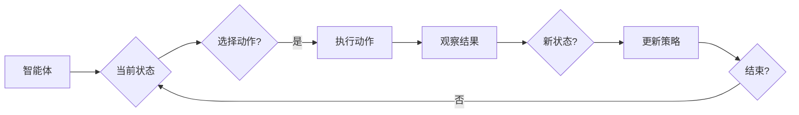

# 强化学习：策略迭代与价值迭代

> 关键词：强化学习，策略迭代，价值迭代，马尔可夫决策过程，Q学习，深度强化学习，智能体，探索与利用，多智能体系统

## 1. 背景介绍

强化学习（Reinforcement Learning，RL）是一种机器学习方法，通过智能体与环境交互，根据奖励信号学习最优策略。与监督学习和无监督学习不同，强化学习中的学习过程是通过试错来实现的，智能体通过与环境的互动来学习如何取得最大的累积奖励。强化学习在机器人控制、游戏、推荐系统、自动驾驶等多个领域都有广泛的应用。

本文将深入探讨强化学习中的策略迭代与价值迭代，分析其核心原理、操作步骤以及在实际应用中的挑战和未来发展趋势。

## 2. 核心概念与联系

### 2.1 核心概念

#### 2.1.1 马尔可夫决策过程（MDP）

马尔可夫决策过程（Markov Decision Process，MDP）是强化学习的基础模型。一个MDP由以下五个元素组成：

- 状态空间 $S$：智能体可能处于的状态集合。
- 行动空间 $A$：智能体可能采取的行动集合。
- 状态转移函数 $P(s' | s, a)$：在当前状态 $s$ 和采取行动 $a$ 后，转移到状态 $s'$ 的概率。
- 奖励函数 $R(s, a)$：在状态 $s$ 和采取行动 $a$ 后获得的即时奖励。
- 目标函数：通常是指最大化累积奖励。

#### 2.1.2 强化学习智能体

强化学习中的智能体（Agent）是一个决策者，它根据当前状态 $s$ 选择一个动作 $a$，并基于这个动作和环境之间的交互结果（新的状态 $s'$ 和奖励 $R$）来更新其策略。

#### 2.1.3 策略和价值函数

策略（Policy）是智能体在给定状态下采取行动的规则。价值函数（Value Function）用于衡量智能体在某个状态或状态序列上的期望效用。

#### 2.1.4 探索与利用

强化学习中的智能体需要在探索（Exploration）和利用（Exploitation）之间进行权衡。探索意味着智能体尝试新的行动以发现更好的策略；利用则是指智能体根据当前学到的信息采取最有可能带来高奖励的行动。

### 2.2 Mermaid 流程图

以下是强化学习智能体决策过程的 Mermaid 流程图：



## 3. 核心算法原理 & 具体操作步骤

### 3.1 算法原理概述

强化学习算法的主要目的是学习一个策略或价值函数，使智能体能够在给定的环境中最大化累积奖励。

#### 3.1.1 策略迭代

策略迭代（Policy Iteration）是一种经典的方法，它通过迭代优化策略来找到最优策略。具体步骤如下：

1. 初始化策略 $\pi$。
2. 使用策略 $\pi$ 计算价值函数 $V(s)$。
3. 使用 $V(s)$ 更新策略 $\pi$。
4. 重复步骤2和3，直到策略收敛。

#### 3.1.2 价值迭代

价值迭代（Value Iteration）是一种迭代计算值函数的方法，用于找到最优策略。具体步骤如下：

1. 初始化值函数 $V(s)$。
2. 使用 $V(s)$ 更新值函数 $V(s)$。
3. 重复步骤2，直到值函数收敛。

#### 3.1.3 Q学习

Q学习（Q-Learning）是一种直接学习值函数的方法，它不需要明确的策略。具体步骤如下：

1. 初始化Q值表 $Q(s,a)$。
2. 对于每个状态-动作对 $(s,a)$，根据 $Q(s,a)$ 和奖励 $R(s,a)$ 更新 $Q(s,a)$。
3. 重复步骤2，直到收敛。

### 3.2 算法步骤详解

#### 3.2.1 策略迭代

策略迭代的主要步骤如下：

1. 初始化策略 $\pi$：通常使用均匀分布或随机策略。
2. 计算值函数 $V(s)$：使用策略 $\pi$ 计算每个状态 $s$ 的值函数 $V(s)$。
3. 更新策略 $\pi$：基于 $V(s)$ 更新策略 $\pi$，例如使用贪婪策略或软更新策略。
4. 判断策略是否收敛：如果策略没有收敛，则返回步骤2。

#### 3.2.2 价值迭代

价值迭代的主要步骤如下：

1. 初始化值函数 $V(s)$：通常设置为 $0$ 或随机值。
2. 更新值函数 $V(s)$：对于每个状态 $s$，计算 $V(s)$ 的最大值 $V'(s)$，然后更新 $V(s) = V'(s)$。
3. 判断值函数是否收敛：如果值函数没有收敛，则返回步骤2。

#### 3.2.3 Q学习

Q学习的主要步骤如下：

1. 初始化Q值表 $Q(s,a)$：通常设置为 $0$ 或随机值。
2. 对于每个状态-动作对 $(s,a)$，根据 $Q(s,a)$ 和奖励 $R(s,a)$ 更新 $Q(s,a)$。
3. 判断Q值表是否收敛：如果Q值表没有收敛，则返回步骤2。

### 3.3 算法优缺点

#### 3.3.1 策略迭代

优点：

- 算法简单，易于实现。
- 可以找到最优策略。

缺点：

- 计算复杂度高，需要多次迭代。
- 对于高维状态空间，难以找到最优策略。

#### 3.3.2 价值迭代

优点：

- 计算复杂度低于策略迭代。
- 可以找到最优策略。

缺点：

- 需要精确的状态-动作表示。
- 对于高维状态空间，难以找到最优策略。

#### 3.3.3 Q学习

优点：

- 不需要明确的策略表示。
- 可以处理高维状态空间。

缺点：

- 可能陷入局部最优解。
- 需要大量的样本数据。

### 3.4 算法应用领域

强化学习在以下领域有广泛的应用：

- 机器人控制
- 游戏
- 自动驾驶
- 语音识别
- 推荐系统
- 金融交易

## 4. 数学模型和公式 & 详细讲解 & 举例说明

### 4.1 数学模型构建

强化学习中的数学模型主要基于MDP。以下是MDP的数学表示：

- 状态空间 $S$
- 行动空间 $A$
- 状态转移函数 $P(s' | s, a)$
- 奖励函数 $R(s, a)$
- 目标函数 $J(\pi) = \sum_{s \in S} \pi(s) V(s)$

### 4.2 公式推导过程

#### 4.2.1 策略迭代

策略迭代的公式推导如下：

$$
V(s) = \sum_{a \in A} \pi(a | s) R(s, a) + \gamma \sum_{s' \in S} P(s' | s, a) V(s')
$$

其中，$\gamma$ 是折现因子，用于平衡即时奖励和未来奖励。

#### 4.2.2 价值迭代

价值迭代的公式推导如下：

$$
V'(s) = \max_{a \in A} [R(s, a) + \gamma \sum_{s' \in S} P(s' | s, a) V(s')]
$$

#### 4.2.3 Q学习

Q学习的公式推导如下：

$$
Q'(s, a) = R(s, a) + \gamma \max_{a' \in A} [Q(s', a')]
$$

## 5. 项目实践：代码实例和详细解释说明

### 5.1 开发环境搭建

为了演示强化学习算法，我们将使用Python的PyTorch框架。以下是搭建PyTorch开发环境的步骤：

1. 安装Anaconda：从官网下载并安装Anaconda。
2. 创建并激活虚拟环境：
```bash
conda create -n pytorch-env python=3.8
conda activate pytorch-env
```
3. 安装PyTorch和PyTorch Lightning：
```bash
conda install pytorch torchvision torchaudio -c pytorch
pip install pytorch-lightning
```

### 5.2 源代码详细实现

以下是一个简单的基于Q学习的CartPole游戏的实现：

```python
import gym
import torch
import torch.nn as nn
import torch.optim as optim

# 定义神经网络
class QNetwork(nn.Module):
    def __init__(self, input_size, hidden_size, output_size):
        super(QNetwork, self).__init__()
        self.fc1 = nn.Linear(input_size, hidden_size)
        self.fc2 = nn.Linear(hidden_size, output_size)

    def forward(self, x):
        x = torch.relu(self.fc1(x))
        x = self.fc2(x)
        return x

# 初始化环境和模型
env = gym.make('CartPole-v0')
input_size = env.observation_space.shape[0]
hidden_size = 64
output_size = env.action_space.n
model = QNetwork(input_size, hidden_size, output_size)
optimizer = optim.Adam(model.parameters(), lr=0.01)
criterion = nn.MSELoss()

# 训练模型
for episode in range(1000):
    state = env.reset()
    done = False
    total_reward = 0
    while not done:
        state = torch.from_numpy(state).float().unsqueeze(0)
        with torch.no_grad():
            q_values = model(state)
        action = q_values.argmax().item()
        next_state, reward, done, _ = env.step(action)
        next_state = torch.from_numpy(next_state).float().unsqueeze(0)
        optimizer.zero_grad()
        target = reward + 0.99 * torch.max(model(next_state))
        loss = criterion(q_values, target)
        loss.backward()
        optimizer.step()
        total_reward += reward
    print(f"Episode {episode+1}, Total Reward: {total_reward}")

env.close()
```

### 5.3 代码解读与分析

上述代码实现了一个简单的CartPole游戏的强化学习训练过程。以下是代码的关键部分：

- `QNetwork` 类定义了一个简单的神经网络，用于估算Q值。
- `gym.make('CartPole-v0')` 创建了一个CartPole环境的实例。
- `model` 是一个QNetwork实例，用于估算Q值。
- `optimizer` 是一个Adam优化器，用于更新模型参数。
- `criterion` 是一个均方误差损失函数，用于计算Q值预测值和目标值之间的差异。

在训练过程中，智能体通过与环境交互，不断更新Q值表，最终找到能够使累积奖励最大化的策略。

### 5.4 运行结果展示

运行上述代码后，将进行1000个回合的训练。在每个回合中，智能体会不断尝试不同的动作，并根据环境的反馈更新Q值。最终，智能体应该能够学会稳定地保持CartPole的平衡。

## 6. 实际应用场景

### 6.1 机器人控制

强化学习在机器人控制领域有广泛的应用，例如：

- 机器人路径规划
- 机器人抓取
- 机器人运动控制

### 6.2 游戏

强化学习在游戏领域也有广泛的应用，例如：

- Atari游戏
- Go游戏
- DOTA 2游戏

### 6.3 自动驾驶

强化学习在自动驾驶领域有巨大的应用潜力，例如：

- 车辆控制
- 道路规划
- 传感器融合

### 6.4 未来应用展望

随着深度学习技术的不断发展，强化学习在更多领域的应用将得到进一步拓展，例如：

- 医疗诊断
- 金融交易
- 能源管理

## 7. 工具和资源推荐

### 7.1 学习资源推荐

- 《Reinforcement Learning: An Introduction》
- 《Reinforcement Learning: Principles and Practice》
- 《Algorithms for Reinforcement Learning》

### 7.2 开发工具推荐

- PyTorch
- TensorFlow
- Stable Baselines
- OpenAI Gym

### 7.3 相关论文推荐

- Q-Learning
- Temporal-Difference Learning
- Deep Q-Networks
- Asynchronous Advantage Actor-Critic

## 8. 总结：未来发展趋势与挑战

### 8.1 研究成果总结

本文深入探讨了强化学习中的策略迭代与价值迭代，分析了其核心原理、操作步骤以及在实际应用中的挑战和未来发展趋势。通过构建MDP模型，我们了解了强化学习的基本概念和框架。通过策略迭代、价值迭代和Q学习等算法，我们掌握了强化学习的核心方法。最后，我们通过PyTorch实现了CartPole游戏的强化学习训练过程，展示了强化学习的实际应用。

### 8.2 未来发展趋势

随着深度学习技术的发展，强化学习在以下方面有巨大的发展潜力：

- 更强大的模型和算法
- 更多的应用领域
- 更好的可解释性和可扩展性

### 8.3 面临的挑战

强化学习在以下方面面临着挑战：

- 算法复杂度高
- 数据需求量大
- 难以获得准确的奖励信号
- 模型的可解释性和可扩展性差

### 8.4 研究展望

为了克服上述挑战，未来的研究需要关注以下方向：

- 开发更高效的算法和模型
- 减少数据需求量
- 探索更有效的奖励设计方法
- 提高模型的可解释性和可扩展性

相信随着研究的不断深入，强化学习将会在更多领域发挥重要作用，为人工智能的发展做出更大的贡献。

## 9. 附录：常见问题与解答

**Q1：强化学习与监督学习的区别是什么？**

A：强化学习通过与环境交互学习，而监督学习通过学习数据集中的标签进行学习。

**Q2：什么是探索与利用？**

A：探索是指在未知的状态或行动中选择新的行动，以发现更好的策略；利用是指在已知的状态或行动中选择最有可能带来高奖励的行动。

**Q3：Q学习与价值迭代有什么区别？**

A：Q学习是一种直接学习值函数的方法，而价值迭代是一种迭代计算值函数的方法。

**Q4：如何选择合适的强化学习算法？**

A：选择合适的强化学习算法需要根据具体任务的特点和需求进行选择。

**Q5：强化学习在哪些领域有应用？**

A：强化学习在机器人控制、游戏、自动驾驶、推荐系统、金融交易等多个领域有广泛的应用。

---

作者：禅与计算机程序设计艺术 / Zen and the Art of Computer Programming