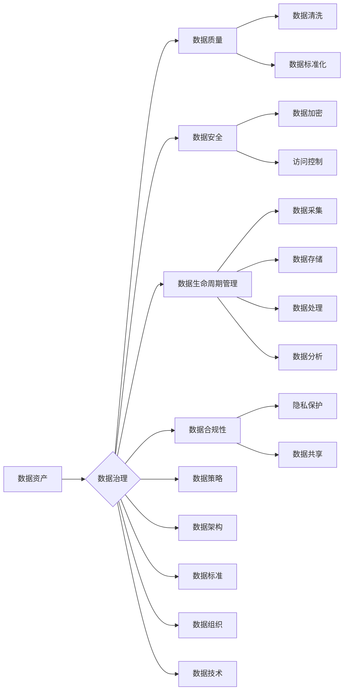

# 数据治理：如何建立健全的数据管理制度？

> 关键词：数据治理，数据管理制度，数据资产管理，数据安全，数据质量，数据生命周期

## 1. 背景介绍

随着信息技术的飞速发展，数据已成为现代社会最重要的战略资源之一。企业、政府机构等组织在收集、存储、处理和分析数据的过程中，面临着日益复杂的数据治理挑战。建立健全的数据管理制度，确保数据的质量、安全、合规和有效利用，已成为当今信息化建设的重要任务。

### 1.1 数据治理的必要性

1. **数据价值最大化**：通过数据治理，可以提高数据质量，使数据更加准确、完整和一致，从而更好地支持决策和分析。
2. **风险管理**：数据治理可以帮助组织识别和管理数据相关的风险，如数据泄露、数据丢失等。
3. **合规性**：随着数据保护法规的不断完善，组织需要确保其数据管理活动符合相关法律法规。
4. **数据共享与协作**：数据治理有助于打破数据孤岛，促进数据在不同部门、组织之间的共享和协作。
5. **技术创新**：良好的数据治理为技术创新提供了坚实的基础，如人工智能、大数据分析等。

### 1.2 数据治理的挑战

1. **数据质量问题**：数据质量问题是数据治理面临的首要挑战，包括数据缺失、错误、重复和不一致等。
2. **数据安全风险**：数据泄露、数据滥用和数据丢失等安全风险日益凸显。
3. **数据孤岛**：组织内部不同部门之间存在数据孤岛现象，导致数据难以共享和利用。
4. **数据合规性**：数据保护法规不断更新，组织需要不断调整其数据管理制度以符合法规要求。

## 2. 核心概念与联系

数据治理是一个复杂的系统工程，涉及多个核心概念。以下是对这些概念的介绍和它们之间的联系：



**核心概念解释**：

- **数据资产**：组织拥有的所有数据资源，包括结构化数据、半结构化数据和非结构化数据。
- **数据治理**：确保数据质量、安全、合规和有效利用的一系列管理活动。
- **数据质量**：数据的准确性、完整性、一致性和及时性等方面的特性。
- **数据安全**：保护数据免受未经授权的访问、使用、披露、破坏、修改和删除的措施。
- **数据生命周期管理**：从数据采集到数据归档、销毁的整个过程。
- **数据合规性**：确保数据管理活动符合相关法律法规和内部政策。
- **数据策略**：组织对数据管理的总体方针和目标。
- **数据架构**：数据治理的组织架构和流程。
- **数据标准**：数据治理的规范和规则。
- **数据组织**：负责数据治理的团队和组织。
- **数据技术**：支持数据治理的技术和工具。

## 3. 核心算法原理 & 具体操作步骤

### 3.1 算法原理概述

数据治理的核心算法包括数据质量评估、数据清洗、数据安全防护和数据生命周期管理等。以下是对这些算法的简要概述：

1. **数据质量评估**：通过统计分析和机器学习等方法评估数据质量，识别数据质量问题。
2. **数据清洗**：通过数据转换、填充、删除等方法修复数据质量问题。
3. **数据安全防护**：通过数据加密、访问控制、审计等技术保障数据安全。
4. **数据生命周期管理**：根据数据生命周期阶段制定相应的管理策略，如数据采集、存储、处理、分析和归档等。

### 3.2 算法步骤详解

#### 3.2.1 数据质量评估

1. **数据采集**：收集数据样本。
2. **数据预处理**：对数据进行清洗和标准化处理。
3. **质量指标计算**：计算数据质量指标，如准确性、完整性、一致性等。
4. **质量分析**：分析数据质量指标，识别数据质量问题。

#### 3.2.2 数据清洗

1. **识别质量问题**：根据数据质量评估结果识别数据质量问题。
2. **选择清洗方法**：根据数据类型和问题类型选择合适的清洗方法，如数据转换、填充、删除等。
3. **执行清洗操作**：对数据进行清洗操作，修复数据质量问题。
4. **验证清洗效果**：验证清洗后的数据质量，确保问题得到解决。

#### 3.2.3 数据安全防护

1. **数据分类**：根据数据敏感程度对数据进行分类。
2. **选择安全措施**：根据数据分类选择合适的安全措施，如数据加密、访问控制等。
3. **实施安全措施**：对数据进行加密、设置访问权限等操作。
4. **安全审计**：定期进行安全审计，确保安全措施的有效性。

#### 3.2.4 数据生命周期管理

1. **数据采集**：采集符合数据质量要求的数据。
2. **数据存储**：将数据存储在安全可靠的环境中。
3. **数据处理**：对数据进行清洗、转换和分析。
4. **数据分析**：使用数据分析和挖掘技术提取有价值的信息。
5. **数据归档**：将不再使用的数据进行归档处理。

### 3.3 算法优缺点

#### 3.3.1 数据质量评估

**优点**：

- 可量化数据质量。
- 可识别数据质量问题。
- 可作为数据清洗的依据。

**缺点**：

- 需要大量数据样本。
- 质量指标选择困难。
- 难以评估数据质量的整体水平。

#### 3.3.2 数据清洗

**优点**：

- 修复数据质量问题。
- 提高数据质量。
- 为后续数据分析提供基础。

**缺点**：

- 清洗过程复杂。
- 清洗结果难以保证。
- 清洗成本较高。

#### 3.3.3 数据安全防护

**优点**：

- 保护数据安全。
- 防止数据泄露。
- 提高数据可用性。

**缺点**：

- 安全措施实施成本高。
- 可能影响数据访问速度。
- 难以保证绝对安全。

#### 3.3.4 数据生命周期管理

**优点**：

- 确保数据质量。
- 提高数据可用性。
- 降低数据风险。

**缺点**：

- 管理流程复杂。
- 需要大量人力投入。
- 难以适应快速变化的数据需求。

### 3.4 算法应用领域

数据治理算法广泛应用于各个领域，如：

- **金融**：风险管理、信用评估、反洗钱等。
- **医疗**：患者数据管理、药物研发、健康管理等。
- **零售**：客户关系管理、市场分析、供应链管理等。
- **政府**：公共安全、城市管理、社会治理等。

## 4. 数学模型和公式 & 详细讲解 & 举例说明

### 4.1 数学模型构建

数据治理的数学模型主要包括数据质量评估模型、数据清洗模型、数据安全模型和数据生命周期管理模型。

#### 4.1.1 数据质量评估模型

数据质量评估模型通常使用统计指标来衡量数据质量，如：

- 准确率：正确识别的样本数占总样本数的比例。
- 召回率：正确识别的负面样本数占所有负面样本数的比例。
- F1分数：准确率和召回率的调和平均值。

#### 4.1.2 数据清洗模型

数据清洗模型通常使用以下公式进行数据转换：

- 填充缺失值：$ \text{填充值} = \text{均值} $ 或 $ \text{中位数} $
- 检测异常值：$ \text{标准差} > 3 \times \text{均值} $
- 缩放数据：$ \text{缩放值} = \frac{\text{原始值} - \text{均值}}{\text{标准差}} $

#### 4.1.3 数据安全模型

数据安全模型通常使用以下公式进行数据加密：

- 密码学：$ \text{密文} = \text{明文} \oplus \text{密钥} $
- 数字签名：$ \text{签名} = \text{哈希值} \oplus \text{私钥} $

#### 4.1.4 数据生命周期管理模型

数据生命周期管理模型通常使用以下公式进行数据归档：

- 归档：将数据存储在长期存储介质中，如磁带、光盘等。
- 撤销：将数据从存储介质中删除。

### 4.2 公式推导过程

以下是对部分公式的推导过程：

#### 4.2.1 准确率

$$
\text{准确率} = \frac{\text{正确识别的样本数}}{\text{总样本数}} \times 100\%
$$

#### 4.2.2 召回率

$$
\text{召回率} = \frac{\text{正确识别的负面样本数}}{\text{所有负面样本数}} \times 100\%
$$

#### 4.2.3 F1分数

$$
F1 \text{分数} = 2 \times \frac{\text{准确率} \times \text{召回率}}{\text{准确率} + \text{召回率}}
$$

### 4.3 案例分析与讲解

#### 4.3.1 案例一：金融风险管理

某银行使用数据治理技术进行信贷风险评估。通过收集客户的信用报告、交易记录等数据，使用数据质量评估模型评估数据质量。发现部分数据缺失，使用数据清洗模型进行填充。然后，使用数据安全模型对客户信息进行加密。最后，根据数据生命周期管理模型对数据进行分析，识别出高风险客户。

#### 4.3.2 案例二：医疗患者数据管理

某医院使用数据治理技术进行患者数据管理。通过收集患者的病历、检查结果等数据，使用数据质量评估模型评估数据质量。发现部分数据错误，使用数据清洗模型进行修正。然后，使用数据安全模型对患者信息进行加密。最后，根据数据生命周期管理模型对数据进行分析，为医生提供诊断依据。

## 5. 项目实践：代码实例和详细解释说明

### 5.1 开发环境搭建

以下是在Python环境下进行数据治理项目实践的步骤：

1. 安装Python环境，版本要求为3.6或以上。
2. 安装数据治理相关库，如Pandas、NumPy、Scikit-learn等。
3. 安装代码编辑器或集成开发环境，如PyCharm、VSCode等。

### 5.2 源代码详细实现

以下是一个使用Pandas进行数据清洗的代码实例：

```python
import pandas as pd

# 读取数据
data = pd.read_csv('data.csv')

# 检测缺失值
missing_values = data.isnull().sum()

# 填充缺失值
data.fillna(data.mean(), inplace=True)

# 检测异常值
z_scores = (data - data.mean()) / data.std()
data = data[(z_scores < 3).all(axis=1)]

# 输出清洗后的数据
print(data)
```

### 5.3 代码解读与分析

上述代码首先导入Pandas库，并读取数据。然后使用`isnull()`方法检测缺失值，使用`fillna()`方法进行填充。接下来，使用`z_scores()`方法计算z分数，使用`std()`方法计算标准差。最后，使用条件表达式筛选出异常值，并输出清洗后的数据。

### 5.4 运行结果展示

运行上述代码后，可以看到清洗后的数据，其中缺失值已被填充，异常值已被去除。

## 6. 实际应用场景

### 6.1 金融行业

在金融行业，数据治理可以帮助银行、证券、保险等金融机构进行风险管理、欺诈检测、信用评估等。

### 6.2 医疗行业

在医疗行业，数据治理可以帮助医院进行患者数据管理、临床决策支持、药物研发等。

### 6.3 零售行业

在零售行业，数据治理可以帮助企业进行客户关系管理、市场分析、供应链管理等。

### 6.4 政府部门

在政府部门，数据治理可以帮助提高政府决策的科学性、透明度和公正性。

## 7. 工具和资源推荐

### 7.1 学习资源推荐

1. 《数据治理：实践、策略与案例》
2. 《大数据时代：数据治理与数据安全》
3. 《数据质量管理：技术、工具与最佳实践》

### 7.2 开发工具推荐

1. Pandas：用于数据清洗和分析的Python库。
2. NumPy：用于数值计算的Python库。
3. Scikit-learn：用于机器学习的Python库。
4. Hadoop：用于大数据处理的分布式计算平台。

### 7.3 相关论文推荐

1. "Data Governance: How to Establish and Maintain an Effective Data Governance Program"
2. "Data Quality: The Backbone of a Successful Data Governance Program"
3. "Data Governance and Data Stewardship: What's the Difference?"

## 8. 总结：未来发展趋势与挑战

### 8.1 研究成果总结

数据治理是当今信息化建设的重要任务，对于组织的发展具有重要意义。本文介绍了数据治理的核心概念、算法原理、实践案例和发展趋势，为读者提供了全面的数据治理知识。

### 8.2 未来发展趋势

1. **数据治理技术的不断发展**：随着大数据、人工智能等技术的不断发展，数据治理技术也将不断创新，如数据治理平台、数据治理工具等。
2. **数据治理意识的普及**：随着数据治理重要性的日益凸显，越来越多的组织将重视数据治理，并投入更多资源进行数据治理建设。
3. **数据治理与业务融合**：数据治理将更加紧密地与业务融合，为业务发展提供有力支持。

### 8.3 面临的挑战

1. **数据质量问题**：数据质量是数据治理的核心问题，需要持续改进。
2. **数据安全风险**：随着数据泄露、数据滥用等事件频发，数据安全问题日益突出。
3. **人才短缺**：数据治理需要大量专业人才，而当前人才供应不足。

### 8.4 研究展望

未来，数据治理研究将重点关注以下方向：

1. **数据治理平台**：开发高效、易用、可扩展的数据治理平台。
2. **数据治理自动化**：实现数据治理流程的自动化，提高数据治理效率。
3. **数据治理与人工智能融合**：利用人工智能技术提高数据治理的智能化水平。

## 9. 附录：常见问题与解答

**Q1：什么是数据治理？**

A：数据治理是指确保数据质量、安全、合规和有效利用的一系列管理活动。

**Q2：数据治理的目的是什么？**

A：数据治理的目的是提高数据价值、降低数据风险、确保数据合规、促进数据共享和协作。

**Q3：数据治理的挑战有哪些？**

A：数据治理的挑战包括数据质量问题、数据安全风险、数据孤岛、数据合规性等。

**Q4：数据治理与数据安全的关系是什么？**

A：数据治理是数据安全的基础，数据安全是数据治理的重要目标。

**Q5：如何进行数据治理？**

A：进行数据治理需要建立数据治理组织、制定数据治理策略、制定数据治理流程、实施数据治理技术等。

---

作者：禅与计算机程序设计艺术 / Zen and the Art of Computer Programming