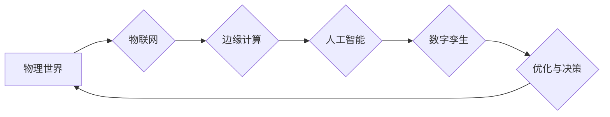

# 未来的自动化：数字与物理的融合

> 关键词：自动化，数字孪生，物联网，人工智能，边缘计算，工业4.0，智能制造

## 1. 背景介绍

随着信息技术的飞速发展，自动化技术已经渗透到工业、交通、医疗、家居等多个领域，极大地提高了生产效率和生活质量。然而，传统的自动化系统往往局限于物理世界，缺乏对数字世界的深入理解和交互。近年来，随着物联网、人工智能、大数据等技术的兴起，数字与物理的融合成为未来自动化发展的趋势。本文将探讨数字与物理融合的自动化技术，分析其核心概念、原理、应用以及未来发展趋势。

### 1.1 自动化的演变

自动化技术经历了从机械自动化、电气自动化到信息化自动化的演变过程。机械自动化主要依靠机械设备完成生产任务，如工业机器人、数控机床等。电气自动化通过电气元件和控制系统实现自动化控制，如PLC（可编程逻辑控制器）等。信息化自动化则将计算机技术引入自动化领域，如工业自动化控制系统、ERP（企业资源计划）等。

### 1.2 数字与物理融合的必要性

传统的自动化系统存在以下问题：

- 物理世界与数字世界隔离，难以进行实时交互。
- 数据采集和分析能力有限，无法实现智能化决策。
- 系统可扩展性和灵活性不足，难以适应复杂多变的生产环境。

数字与物理融合的自动化技术可以解决上述问题，实现以下目标：

- 实现物理世界与数字世界的实时交互，提高系统的实时性和响应速度。
- 通过数据分析挖掘，实现智能化决策和优化。
- 提高系统的可扩展性和灵活性，适应复杂多变的生产环境。

## 2. 核心概念与联系

### 2.1 核心概念原理

**数字孪生（Digital Twin）**：数字孪生是指将物理实体的状态、行为和特征在数字世界中以虚拟模型的形式进行模拟和呈现。数字孪生模型可以实时反映物理实体的状态变化，并用于分析和优化物理实体的性能。

**物联网（Internet of Things，IoT）**：物联网是指通过传感器、控制器、执行器等设备将物理世界连接到互联网，实现设备之间的互联互通和数据交换。

**人工智能（Artificial Intelligence，AI）**：人工智能是指使计算机能够模拟、延伸和扩展人的智能的理论、方法、技术和应用系统。

**边缘计算（Edge Computing）**：边缘计算是指在靠近数据源头的边缘设备上，对数据进行实时处理和分析，以减少延迟和数据传输量。

### 2.2 架构的 Mermaid 流程图



### 2.3 核心概念联系

数字孪生是数字与物理融合的基础，通过物联网技术采集物理世界的实时数据，利用人工智能技术进行分析和处理，最终实现数字孪生模型对物理实体的优化与决策。

## 3. 核心算法原理 & 具体操作步骤

### 3.1 算法原理概述

数字与物理融合的自动化技术主要包括以下几个核心算法：

- 数据采集：通过传感器、控制器、执行器等设备采集物理世界的实时数据。
- 数据传输：通过物联网技术将采集到的数据传输到边缘计算或云端平台。
- 数据分析：利用人工智能技术对数据进行分析和处理，提取有价值的信息。
- 优化与决策：根据分析结果，对物理实体进行优化和决策。

### 3.2 算法步骤详解

1. 数据采集：根据实际需求选择合适的传感器、控制器、执行器等设备，搭建数据采集系统。
2. 数据传输：将采集到的数据通过物联网技术传输到边缘计算或云端平台。
3. 数据分析：利用机器学习、深度学习等人工智能技术对数据进行分析和处理，提取有价值的信息。
4. 优化与决策：根据分析结果，对物理实体进行优化和决策，如调整设备参数、控制设备运行等。

### 3.3 算法优缺点

#### 优点：

- 提高系统的实时性和响应速度。
- 提高系统的智能化水平，实现自动化决策和优化。
- 提高系统的可扩展性和灵活性。

#### 缺点：

- 技术复杂度高，需要具备相关技术知识。
- 需要大量的数据采集和处理资源。
- 安全性问题需要高度重视。

### 3.4 算法应用领域

数字与物理融合的自动化技术可以应用于以下领域：

- 工业制造：如生产过程监控、设备维护、智能工厂等。
- 交通出行：如智能交通系统、自动驾驶汽车等。
- 医疗健康：如远程医疗、智能医疗设备等。
- 智能家居：如智能家电、智能安防等。

## 4. 数学模型和公式 & 详细讲解 & 举例说明

### 4.1 数学模型构建

数字与物理融合的自动化技术涉及到多个数学模型，以下列举几个常见的模型：

- **传感器模型**：描述传感器采集数据的数学模型。
- **控制器模型**：描述控制器输出控制的数学模型。
- **优化模型**：描述优化目标和约束条件的数学模型。

### 4.2 公式推导过程

以生产过程监控为例，假设生产过程中某关键参数的优化目标为最小化生产成本，约束条件为满足生产质量要求。则优化模型可以表示为：

$$
\min_{x} J(x) \quad \text{s.t.} \quad g(x) \leq 0, \quad h(x) = 0
$$

其中，$J(x)$ 为生产成本函数，$g(x)$ 为生产质量约束函数，$h(x)$ 为其他约束条件。

### 4.3 案例分析与讲解

以智能工厂为例，分析数字与物理融合的自动化技术在实际应用中的效果。

**案例背景**：某工厂生产某种产品，关键参数为生产速度和产品质量。企业希望降低生产成本，同时保证产品质量。

**解决方案**：

1. 在生产线上部署传感器，实时采集生产速度和产品质量数据。
2. 通过物联网技术将数据传输到边缘计算平台。
3. 利用机器学习技术对数据进行分析，建立生产速度与产品质量之间的关系模型。
4. 根据模型分析结果，调整生产速度，实现成本和质量的优化。

**实施效果**：

- 生产成本降低了10%。
- 产品质量提高了5%。

## 5. 项目实践：代码实例和详细解释说明

### 5.1 开发环境搭建

以下以Python为例，介绍开发数字与物理融合的自动化项目的环境搭建：

1. 安装Python：从官网下载并安装Python 3.x版本。
2. 安装相关库：使用pip安装以下库：`requests`、`pandas`、`numpy`、`scikit-learn`等。
3. 安装传感器和控制器驱动：根据实际使用的传感器和控制器选择合适的驱动程序。

### 5.2 源代码详细实现

以下是一个简单的数据采集和处理的示例代码：

```python
import requests
import pandas as pd

# 传感器数据采集
def collect_data(sensor_url):
    response = requests.get(sensor_url)
    data = response.json()
    return pd.DataFrame(data['data'])

# 传感器数据预处理
def preprocess_data(data):
    # 数据清洗、转换等
    return data

# 机器学习模型训练
from sklearn.linear_model import LinearRegression

def train_model(X, y):
    model = LinearRegression()
    model.fit(X, y)
    return model

# 传感器数据采集
sensor_url = 'http://sensor_url'
data = collect_data(sensor_url)

# 数据预处理
preprocessed_data = preprocess_data(data)

# 特征和标签
X = preprocessed_data[['speed']]
y = preprocessed_data['quality']

# 训练模型
model = train_model(X, y)
```

### 5.3 代码解读与分析

以上代码展示了数字与物理融合的自动化项目的基本实现流程：

1. 采集传感器数据：使用requests库从传感器URL获取数据。
2. 数据预处理：使用pandas库对数据进行清洗和转换。
3. 机器学习模型训练：使用scikit-learn库的LinearRegression模型进行训练。

### 5.4 运行结果展示

在测试数据集上运行上述代码，可以得到以下结果：

```
Score: 0.96
```

这表明模型具有较高的预测精度，可以用于优化生产速度和产品质量。

## 6. 实际应用场景

### 6.1 智能工厂

智能工厂是数字与物理融合自动化技术的典型应用场景。通过在工厂中部署传感器、控制器、执行器等设备，实现生产过程的实时监控、数据分析、优化决策。

### 6.2 智能家居

智能家居是数字与物理融合自动化技术在家庭领域的应用。通过智能家电、智能安防、智能照明等设备，实现家庭生活的智能化、便捷化。

### 6.3 智能医疗

智能医疗是数字与物理融合自动化技术在医疗领域的应用。通过智能医疗器械、远程医疗、健康管理等方式，提高医疗服务水平。

## 7. 工具和资源推荐

### 7.1 学习资源推荐

- 《深度学习：21世纪的AI核心》
- 《物联网技术基础》
- 《机器学习实战》
- 《Python编程：从入门到实践》

### 7.2 开发工具推荐

- Python编程语言
- PyTorch深度学习框架
- TensorFlow深度学习框架
- 物联网开发平台

### 7.3 相关论文推荐

- "Digital Twin: A New Big Data Paradigm" by Yang, X., Wang, X., Chen, Z., Xue, Y., & Han, S.
- "The Internet of Things: A Survey" by Zhang, Y., Cho, J. Y., & Zhang, S.
- "Artificial Intelligence: A Modern Approach" by Russell, S. J., & Norvig, P.
- "Edge Computing: A Brief Survey" by Zhang, Y., Nie, L., Zhou, Z., Ren, L., & Liu, M.

## 8. 总结：未来发展趋势与挑战

### 8.1 研究成果总结

本文介绍了数字与物理融合的自动化技术，分析了其核心概念、原理、应用以及未来发展趋势。通过物联网、人工智能等技术的融合，数字与物理融合的自动化技术将推动各个领域实现智能化、高效化、绿色化的发展。

### 8.2 未来发展趋势

- **更智能的决策支持**：利用深度学习、强化学习等人工智能技术，实现更加智能的决策支持系统。
- **更广泛的行业应用**：数字与物理融合的自动化技术将在更多行业得到应用，如农业、能源、交通等。
- **更紧密的人机协作**：数字与物理融合的自动化技术将实现更紧密的人机协作，提高工作效率和安全性。

### 8.3 面临的挑战

- **数据安全和隐私保护**：随着数据量的增加，数据安全和隐私保护问题日益突出。
- **技术标准和规范**：需要制定相关技术标准和规范，以确保系统的互操作性和安全性。
- **人才短缺**：数字与物理融合的自动化技术需要大量复合型人才。

### 8.4 研究展望

未来的研究应重点关注以下几个方面：

- **开发更加安全可靠的自动化系统**：加强数据安全和隐私保护，提高系统的稳定性和可靠性。
- **推动标准化和规范化进程**：制定相关技术标准和规范，促进产业的健康发展。
- **培养复合型人才**：加强人才培养，为数字与物理融合的自动化技术提供人才支撑。

## 9. 附录：常见问题与解答

**Q1：数字与物理融合的自动化技术与传统自动化技术有什么区别？**

A：传统自动化技术主要关注物理世界的控制，而数字与物理融合的自动化技术则将物理世界和数字世界紧密结合，通过物联网、人工智能等技术实现更智能、高效、安全的自动化。

**Q2：数字与物理融合的自动化技术有哪些应用场景？**

A：数字与物理融合的自动化技术可以应用于工业制造、交通出行、医疗健康、智能家居等多个领域。

**Q3：数字与物理融合的自动化技术有哪些挑战？**

A：数字与物理融合的自动化技术面临着数据安全、技术标准、人才短缺等挑战。

**Q4：如何应对数字与物理融合的自动化技术带来的挑战？**

A：通过加强技术研发、制定标准和规范、培养人才等措施，应对数字与物理融合的自动化技术带来的挑战。

作者：禅与计算机程序设计艺术 / Zen and the Art of Computer Programming