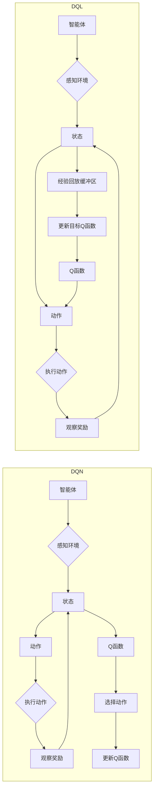

# 深度 Q-learning：深度Q-learning VS DQN

> 关键词：深度Q-learning, DQN, 强化学习, Q-learning, 经验回放, 梯度下降, 模型更新, 神经网络

## 1. 背景介绍

强化学习（Reinforcement Learning，RL）是机器学习领域的一个重要分支，它通过智能体（Agent）与环境的交互来学习最优策略，从而实现目标。在强化学习中，Q-learning和深度Q-network（DQN）是最早也是最为经典的算法之一。随着深度学习技术的发展，深度Q-learning（Deep Q-learning，DQL）应运而生，它结合了深度神经网络的优势，在许多复杂环境中取得了显著的成果。本文将深入探讨深度Q-learning和DQN，对比它们的原理、实现步骤、优缺点和应用领域。

## 2. 核心概念与联系

### 2.1 核心概念原理

#### Q-learning

Q-learning是一种基于值函数的强化学习算法。它通过学习一个Q函数，该函数映射状态-动作对到效用值，从而指导智能体选择最优动作。Q-learning的核心思想是，智能体应该选择能够带来最大未来奖励的动作。

#### 深度Q-learning（DQL）

深度Q-learning是Q-learning的扩展，它使用深度神经网络来近似Q函数。DQL通过学习状态-动作对的效用值，来预测每个动作在给定状态下可能带来的未来回报。

#### DQN

DQN（Deep Q-Network）是深度Q-learning的一种变体，它通过经验回放（Experience Replay）和目标网络（Target Network）来改进DQL的性能。

### 2.2 架构图

以下是一个简化的Mermaid流程图，展示了深度Q-learning和DQN的基本架构：



## 3. 核心算法原理 & 具体操作步骤

### 3.1 算法原理概述

#### Q-learning

Q-learning通过迭代更新Q值来学习最优策略。其核心公式为：

$$
Q(s,a) = Q(s,a) + \alpha [R + \gamma \max_{a'} Q(s',a') - Q(s,a)]
$$

其中，$s$表示当前状态，$a$表示当前动作，$R$表示奖励，$\gamma$表示折扣因子，$\alpha$表示学习率。

#### DQN

DQN通过深度神经网络来近似Q函数。其核心步骤包括：

1. 智能体根据当前状态选择动作。
2. 执行动作，观察奖励和下一个状态。
3. 将状态-动作对存储在经验回放缓冲区中。
4. 从缓冲区中随机抽取一个经验，计算目标Q值。
5. 更新目标Q函数。

### 3.2 算法步骤详解

#### Q-learning

1. 初始化Q表，所有Q值设为0。
2. 选择动作，执行动作，观察奖励和下一个状态。
3. 根据Q-learning公式更新Q值。
4. 重复步骤2和3，直到达到终止条件。

#### DQN

1. 初始化深度神经网络Q函数和目标Q函数。
2. 智能体根据当前状态选择动作。
3. 执行动作，观察奖励和下一个状态。
4. 将状态-动作对存储在经验回放缓冲区中。
5. 从缓冲区中随机抽取一个经验。
6. 使用目标Q函数计算目标Q值。
7. 使用当前Q函数计算梯度。
8. 使用梯度下降算法更新Q函数和目标Q函数。

### 3.3 算法优缺点

#### Q-learning

优点：

- 算法简单，易于理解。
- 不需要环境模型。

缺点：

- 需要大量样本进行学习。
- 学习速度慢。

#### DQN

优点：

- 可以处理高维连续状态空间。
- 可以处理高维连续动作空间。

缺点：

- 训练过程中可能存在抖动现象。
- 需要大量的经验回放缓冲区。

### 3.4 算法应用领域

Q-learning和DQN在许多领域都有应用，如：

- 机器人控制
- 游戏AI
- 贸易策略
- 自动驾驶

## 4. 数学模型和公式 & 详细讲解 & 举例说明

### 4.1 数学模型构建

#### Q-learning

Q-learning的数学模型可以表示为：

$$
Q(s,a) = Q(s,a) + \alpha [R + \gamma \max_{a'} Q(s',a') - Q(s,a)]
$$

其中，$s$表示当前状态，$a$表示当前动作，$R$表示奖励，$\gamma$表示折扣因子，$\alpha$表示学习率。

#### DQN

DQN的数学模型可以表示为：

$$
Q(s,a;\theta) = f_\theta(s,a)
$$

其中，$s$表示当前状态，$a$表示当前动作，$\theta$表示深度神经网络的参数，$f_\theta$表示深度神经网络。

### 4.2 公式推导过程

#### Q-learning

Q-learning的公式推导过程如下：

1. 初始化Q表，所有Q值设为0。
2. 选择动作，执行动作，观察奖励和下一个状态。
3. 更新Q值：

$$
Q(s,a) = Q(s,a) + \alpha [R + \gamma \max_{a'} Q(s',a') - Q(s,a)]
$$

重复步骤2和3，直到达到终止条件。

#### DQN

DQN的公式推导过程如下：

1. 初始化深度神经网络Q函数和目标Q函数。
2. 智能体根据当前状态选择动作。
3. 执行动作，观察奖励和下一个状态。
4. 从缓冲区中随机抽取一个经验：

$$
(s_t, a_t, r_t, s_{t+1}) \in D
$$

5. 使用目标Q函数计算目标Q值：

$$
Q(s_{t+1}, a_{t+1}; \theta_t) = R_t + \gamma \max_{a'} Q(s_{t+1}, a'; \theta_{target})
$$

其中，$\theta_t$表示当前Q函数的参数，$\theta_{target}$表示目标Q函数的参数。

6. 使用当前Q函数计算梯度：

$$
\frac{\partial Q(s_t, a_t; \theta_t)}{\partial \theta_t}
$$

7. 使用梯度下降算法更新Q函数和目标Q函数：

$$
\theta_t \leftarrow \theta_t - \eta \frac{\partial J(\theta_t)}{\partial \theta_t}
$$

其中，$J(\theta_t)$表示损失函数，$\eta$表示学习率。

### 4.3 案例分析与讲解

以下是一个简单的DQN案例，演示了如何使用PyTorch实现DQN。

```python
import torch
import torch.nn as nn
import torch.optim as optim

class DQN(nn.Module):
    def __init__(self, input_dim, action_dim):
        super(DQN, self).__init__()
        self.fc1 = nn.Linear(input_dim, 128)
        self.fc2 = nn.Linear(128, action_dim)

    def forward(self, x):
        x = torch.relu(self.fc1(x))
        return self.fc2(x)

def dqn_update(model, target_model, optimizer, replay_buffer, batch_size, gamma, epsilon):
    # 随机从经验回放缓冲区中抽取一个批次的经验
    experiences = random.sample(replay_buffer, batch_size)
    states, actions, rewards, next_states, dones = zip(*experiences)

    # 计算目标Q值
    Q_targets_next = target_model(next_states).detach().max(1)[0].unsqueeze(1)
    Q_targets = rewards + (gamma * Q_targets_next * (1 - dones))

    # 计算当前Q值
    Q_values = model(states).gather(1, actions.unsqueeze(1))

    # 计算损失
    loss = F.mse_loss(Q_values, Q_targets)

    # 更新模型参数
    optimizer.zero_grad()
    loss.backward()
    optimizer.step()

    return loss

# 创建模型和目标模型
model = DQN(input_dim=4, action_dim=2)
target_model = DQN(input_dim=4, action_dim=2).to(device)
target_model.load_state_dict(model.state_dict())
target_model.eval()

# 创建经验回放缓冲区
replay_buffer = []

# 训练模型
optimizer = optim.Adam(model.parameters(), lr=0.001)
gamma = 0.99
epsilon = 0.1

for episode in range(num_episodes):
    # 初始化环境
    state = env.reset()
    done = False

    while not done:
        # 选择动作
        if random.random() < epsilon:
            action = random.randrange(action_dim)
        else:
            state_tensor = torch.from_numpy(state).float().unsqueeze(0)
            action = model(state_tensor).argmax().item()

        # 执行动作
        next_state, reward, done, _ = env.step(action)

        # 存储经验
        replay_buffer.append((state, action, reward, next_state, done))

        # 清空旧的经验
        if len(replay_buffer) > buffer_size:
            replay_buffer.popleft()

        # 更新目标模型
        if episode % target_update_freq == 0:
            target_model.load_state_dict(model.state_dict())

        # 更新模型
        loss = dqn_update(model, target_model, optimizer, replay_buffer, batch_size, gamma, epsilon)
        print(f"Episode {episode}, Loss: {loss.item()}")
```

在这个例子中，我们创建了一个简单的DQN模型，并在一个虚拟环境中训练它。模型通过经验回放缓冲区存储经验，并定期更新目标模型，从而学习到最优策略。

## 5. 项目实践：代码实例和详细解释说明

### 5.1 开发环境搭建

在进行DQN项目实践前，我们需要准备以下开发环境：

1. Python 3.6及以上版本
2. PyTorch 1.4及以上版本
3. OpenAI Gym环境（用于模拟虚拟环境）

### 5.2 源代码详细实现

以下是使用PyTorch实现的DQN代码示例：

```python
import torch
import torch.nn as nn
import torch.optim as optim
from gym import make

# 创建环境
env = make('CartPole-v0')

# 创建DQN模型
class DQN(nn.Module):
    def __init__(self, input_dim, action_dim):
        super(DQN, self).__init__()
        self.fc1 = nn.Linear(input_dim, 64)
        self.fc2 = nn.Linear(64, action_dim)

    def forward(self, x):
        x = torch.relu(self.fc1(x))
        return self.fc2(x)

# 创建经验回放缓冲区
buffer_size = 10000
replay_buffer = []

# 创建模型和目标模型
model = DQN(input_dim=4, action_dim=2)
target_model = DQN(input_dim=4, action_dim=2)
target_model.load_state_dict(model.state_dict())
target_model.eval()

# 创建优化器
optimizer = optim.Adam(model.parameters(), lr=0.001)

# 训练模型
num_episodes = 1000
gamma = 0.99
epsilon = 0.1
target_update_freq = 100

for episode in range(num_episodes):
    state = env.reset()
    done = False

    while not done:
        # 选择动作
        if random.random() < epsilon:
            action = random.randrange(2)
        else:
            state_tensor = torch.from_numpy(state).float().unsqueeze(0)
            action = model(state_tensor).argmax().item()

        # 执行动作
        next_state, reward, done, _ = env.step(action)

        # 存储经验
        replay_buffer.append((state, action, reward, next_state, done))

        # 清空旧的经验
        if len(replay_buffer) > buffer_size:
            replay_buffer.popleft()

        # 更新目标模型
        if episode % target_update_freq == 0:
            target_model.load_state_dict(model.state_dict())

        # 更新模型
        optimizer.zero_grad()
        state_tensor = torch.from_numpy(state).float().unsqueeze(0)
        next_state_tensor = torch.from_numpy(next_state).float().unsqueeze(0)

        q_value = model(state_tensor).gather(1, torch.tensor([action])).squeeze()
        target_q_value = target_model(next_state_tensor).max(1)[0]
        target_value = reward + (gamma * target_q_value * (1 - done))

        loss = F.mse_loss(q_value, target_value)
        loss.backward()
        optimizer.step()

        state = next_state
```

在这个例子中，我们创建了一个简单的DQN模型，并在CartPole虚拟环境中训练它。模型通过经验回放缓冲区存储经验，并定期更新目标模型，从而学习到最优策略。

### 5.3 代码解读与分析

这段代码首先创建了一个CartPole虚拟环境。然后，定义了一个DQN模型，该模型包含两个全连接层。创建了一个经验回放缓冲区，用于存储经验。接下来，定义了模型和目标模型，并创建了一个优化器。最后，通过迭代执行以下步骤来训练模型：

1. 初始化环境状态。
2. 选择动作。
3. 执行动作，观察奖励和下一个状态。
4. 存储经验。
5. 清空旧的经验。
6. 更新目标模型。
7. 更新模型。

这个简单的例子展示了DQN的基本实现方法。

### 5.4 运行结果展示

在CartPole虚拟环境中，使用上述代码训练DQN模型后，模型可以在较短的时间内学会稳定地保持平衡。

## 6. 实际应用场景

深度Q-learning和DQN在许多实际应用场景中取得了显著成果，如：

- 游戏：如Atari游戏、StarCraft等。
- 控制系统：如机器人控制、自动驾驶等。
- 金融：如股票交易、风险评估等。
- 健康医疗：如疾病预测、药物开发等。

## 7. 工具和资源推荐

### 7.1 学习资源推荐

- 《深度学习与强化学习》
- 《深度强化学习》
- OpenAI Gym：一个开源的强化学习环境库。
- PyTorch教程：PyTorch官方教程。

### 7.2 开发工具推荐

- PyTorch：一个开源的深度学习框架。
- OpenAI Gym：一个开源的强化学习环境库。
- Docker：一个开源的应用容器引擎。

### 7.3 相关论文推荐

- Deep Q-Networks (DQN)
- Human-level control through deep reinforcement learning
- Prioritized Experience Replay

## 8. 总结：未来发展趋势与挑战

### 8.1 研究成果总结

深度Q-learning和DQN是强化学习领域的重要算法，它们在许多复杂环境中取得了显著成果。随着深度学习技术的发展，深度Q-learning和DQN将继续在强化学习领域发挥重要作用。

### 8.2 未来发展趋势

- 结合多智能体强化学习
- 探索更有效的探索策略
- 开发更鲁棒的算法
- 将深度Q-learning和DQN应用于更多领域

### 8.3 面临的挑战

- 计算资源消耗大
- 学习效率低
- 可解释性差
- 算法稳定性差

### 8.4 研究展望

未来，深度Q-learning和DQN的研究将主要集中在以下方面：

- 开发更有效的训练算法
- 提高算法的鲁棒性和稳定性
- 提高算法的可解释性
- 将深度Q-learning和DQN应用于更多领域

## 9. 附录：常见问题与解答

**Q1：深度Q-learning和DQN的区别是什么？**

A：深度Q-learning和DQN都是基于Q-learning的深度强化学习算法，但DQN使用深度神经网络来近似Q函数，而深度Q-learning使用传统的线性函数。

**Q2：深度Q-learning和DQN在哪些应用场景中效果最好？**

A：深度Q-learning和DQN在需要高维输入和输出的应用场景中效果最好，如游戏、控制系统、金融等。

**Q3：如何提高深度Q-learning和DQN的性能？**

A：提高深度Q-learning和DQN的性能可以通过以下方法：

- 使用更有效的训练算法
- 使用更大的神经网络
- 使用更多的经验回放缓冲区
- 使用更有效的探索策略

**Q4：深度Q-learning和DQN的缺点是什么？**

A：深度Q-learning和DQN的缺点包括计算资源消耗大、学习效率低、可解释性差、算法稳定性差等。

作者：禅与计算机程序设计艺术 / Zen and the Art of Computer Programming