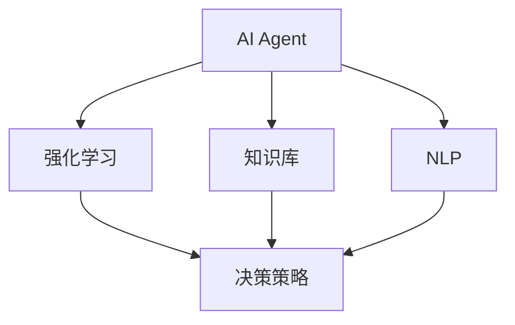

                 

## 1. 背景介绍

### 1.1 问题由来

随着人工智能(AI)技术的迅猛发展，AI Agent作为智能自动化系统的重要组成部分，在企业管理和生产力的提升中扮演着日益重要的角色。AI Agent能够自主地从环境中学习，理解任务需求，并基于现有知识智能执行各种生产任务，从而显著提升企业的运营效率和生产力。AI Agent的应用领域非常广泛，包括智能制造、供应链管理、客户服务、人力资源管理等。

### 1.2 问题核心关键点

AI Agent的核心思想是利用机器学习算法，让机器具备类似于人类智能的自主决策和执行能力。这主要依赖于三个关键技术：

1. **机器学习**：通过数据驱动的方式，让AI Agent从历史数据中学习到执行特定任务的规律和模式。
2. **自然语言处理**：使AI Agent能够理解人类语言的指令和信息，并进行交互和协作。
3. **决策与执行**：结合知识库和逻辑规则，AI Agent能够自主地制定决策方案，并执行相应的任务。

### 1.3 问题研究意义

研究AI Agent及其在企业生产力提升中的应用，对于推动企业数字化转型和智能化升级具有重要意义：

1. **降低运营成本**：AI Agent能够自动执行重复性高的任务，减轻人力负担，降低企业运营成本。
2. **提高生产效率**：AI Agent能够实时响应环境变化，优化生产流程，提高生产效率。
3. **增强决策质量**：AI Agent能够综合多源信息，做出更加精准的决策，提升决策质量。
4. **促进知识共享**：AI Agent可以记录并共享知识，促进团队协作，提升组织学习能力。
5. **优化客户体验**：AI Agent能够提供24/7的客户服务，提升客户满意度和忠诚度。

## 2. 核心概念与联系

### 2.1 核心概念概述

为更好地理解AI Agent及其在企业中的应用，本节将介绍几个密切相关的核心概念：

- **AI Agent**：智能自动化系统，通过自主学习，理解和执行特定任务。
- **强化学习(Reinforcement Learning, RL)**：AI Agent通过与环境互动，从奖励信号中学习最优策略。
- **知识库(Knowledge Base)**：AI Agent存储和查询知识的数据库，辅助决策和执行。
- **自然语言处理(Natural Language Processing, NLP)**：使AI Agent能够理解和生成人类语言。
- **多智能体系统(Multi-Agent System,MAS)**：由多个AI Agent组成，协同完成复杂任务的系统。

这些核心概念之间的逻辑关系可以通过以下Mermaid流程图来展示：



这个流程图展示了大语言模型微调过程中各个核心概念的关系：

1. AI Agent通过强化学习和知识库学习任务策略，并利用NLP技术理解人类语言。
2. 强化学习通过环境反馈，不断调整决策策略。
3. 知识库存储和查询知识，辅助AI Agent做出决策。
4. NLP技术使AI Agent能够理解人类语言，执行任务。

### 2.2 概念间的关系

这些核心概念之间存在着紧密的联系，形成了AI Agent的完整工作框架。以下是几个关键关系的详细描述：

- **AI Agent与强化学习的关系**：AI Agent通过强化学习从环境中学习，不断调整策略以优化任务执行效果。
- **AI Agent与知识库的关系**：知识库提供AI Agent决策和执行所需的基础知识，是AI Agent自主学习的重要来源。
- **AI Agent与NLP的关系**：NLP技术使AI Agent能够处理和理解人类语言，与用户进行自然交互。
- **AI Agent与多智能体系统的关系**：多智能体系统中的AI Agent通过协同工作，可以解决更加复杂的问题。

这些概念共同构成了AI Agent的核心工作框架，使其能够在各种场景下发挥智能化的决策和执行能力。通过理解这些核心概念，我们可以更好地把握AI Agent的工作原理和优化方向。

## 3. 核心算法原理 & 具体操作步骤
### 3.1 算法原理概述

AI Agent的核心算法是强化学习，其基本思想是通过与环境交互，通过不断的试错和反馈，逐步优化决策策略。强化学习的目标是最小化一个叫做"累积奖励和"的指标，即最大化长期累积的奖励。

AI Agent在执行任务时，会根据当前环境状态，选择一个动作，并从环境中接收到一个奖励信号。然后，AI Agent根据接收到的奖励和当前状态，更新其决策策略，以便在下一个状态中选择更有利的动作。这个过程持续进行，直到任务完成或达到预定的终止条件。

### 3.2 算法步骤详解

AI Agent的强化学习训练流程一般包括以下几个步骤：

**Step 1: 环境设置与动作定义**
- 定义环境（如模拟环境、物理环境等），确保环境能够提供所需的奖励和状态信息。
- 定义动作集，即AI Agent可以选择的所有可能动作。

**Step 2: 初始化AI Agent和环境**
- 初始化AI Agent的状态。
- 将环境置于初始状态。

**Step 3: 执行动作与接收奖励**
- AI Agent根据当前状态选择动作，执行该动作。
- 从环境中接收奖励和状态信息。

**Step 4: 更新AI Agent策略**
- 根据接收到的奖励和状态，更新AI Agent的决策策略。

**Step 5: 重复执行**
- 重复执行Step 3和Step 4，直至达到预定的终止条件。

**Step 6: 策略评估与优化**
- 对AI Agent的决策策略进行评估，根据评估结果进一步优化策略。

### 3.3 算法优缺点

AI Agent的强化学习算法具有以下优点：

1. **自主决策**：AI Agent能够自主地从环境中学习，不需要人工干预。
2. **灵活适应**：AI Agent能够适应环境变化，优化决策策略。
3. **低成本**：一旦模型训练完成，AI Agent可以持续执行任务，成本较低。

同时，该算法也存在以下缺点：

1. **可解释性不足**：强化学习模型通常难以解释决策过程，缺乏可解释性。
2. **依赖环境**：强化学习的效果很大程度上依赖于环境设置，环境复杂度较高时，训练难度较大。
3. **学习效率受限**：强化学习需要大量数据进行训练，环境探索和策略优化过程较慢。
4. **多目标冲突**：在多智能体系统中，各AI Agent的目标可能存在冲突，需要复杂的协调机制。

### 3.4 算法应用领域

AI Agent的强化学习算法已经在多个领域得到了广泛的应用，例如：

- **自动驾驶**：通过与环境互动，学习最优驾驶策略。
- **机器人控制**：通过与机器人身体互动，学习最优动作控制策略。
- **游戏AI**：通过与游戏环境互动，学习最优游戏策略。
- **供应链管理**：通过与供应链系统互动，学习最优库存和物流策略。
- **智能制造**：通过与生产设备互动，学习最优生产调度策略。
- **客户服务**：通过与客户互动，学习最优客户服务策略。

## 4. 数学模型和公式 & 详细讲解 & 举例说明

### 4.1 数学模型构建

假设AI Agent在一个环境中执行任务，环境状态为 $s_t$，动作为 $a_t$，状态转移到下一个状态 $s_{t+1}$，获得奖励 $r_t$。强化学习的目标是最小化累积奖励和，即：

$$
\min \sum_{t=0}^T r_t
$$

其中，$T$ 为终止时间，$r_t$ 为在时间 $t$ 获得的奖励。

### 4.2 公式推导过程

在强化学习中，通常使用Q-learning算法来更新决策策略。Q-learning算法的基本思想是估计每个状态-动作对的最优价值 $Q(s,a)$，并根据当前状态和动作的Q值更新策略。

假设 $Q(s,a)$ 表示在状态 $s$ 下采取动作 $a$ 的Q值，$Q^{*}(s,a)$ 表示最优Q值，则Q-learning算法的基本更新公式为：

$$
Q(s,a) \leftarrow Q(s,a) + \alpha [r + \gamma \max_{a'} Q(s',a')] - Q(s,a)
$$

其中，$\alpha$ 为学习率，$\gamma$ 为折扣因子，表示未来奖励的权重。

### 4.3 案例分析与讲解

以一个简单的迷宫问题为例，说明强化学习的基本工作原理。假设AI Agent在迷宫中移动，目标是找到出口。环境状态为当前位置，动作为向上、向下、向左、向右。在每个位置，AI Agent根据当前位置选择动作，并从环境中接收奖励。

假设初始状态为起点，每个位置的状态转移到下一个位置，并获得一个随机奖励（0或1）。AI Agent的目标是最小化累积奖励和，即尽快找到出口。

通过Q-learning算法，AI Agent可以在不断的试错中，逐步学习到最优的移动策略，最终找到出口。

## 5. 项目实践：代码实例和详细解释说明

### 5.1 开发环境搭建

在进行AI Agent的开发实践前，我们需要准备好开发环境。以下是使用Python进行PyTorch开发的环境配置流程：

1. 安装Anaconda：从官网下载并安装Anaconda，用于创建独立的Python环境。

2. 创建并激活虚拟环境：
```bash
conda create -n agent-env python=3.8 
conda activate agent-env
```

3. 安装PyTorch：根据CUDA版本，从官网获取对应的安装命令。例如：
```bash
conda install pytorch torchvision torchaudio cudatoolkit=11.1 -c pytorch -c conda-forge
```

4. 安装各类工具包：
```bash
pip install numpy pandas scikit-learn matplotlib tqdm jupyter notebook ipython
```

完成上述步骤后，即可在`agent-env`环境中开始AI Agent的开发实践。

### 5.2 源代码详细实现

下面我们以一个简单的迷宫AI Agent为例，给出使用PyTorch进行强化学习训练的PyTorch代码实现。

首先，定义环境类和AI Agent类：

```python
import numpy as np
import torch
from torch import nn
from torch.autograd import Variable
from torch.distributions import Categorical

class Environment:
    def __init__(self, maze):
        self.maze = maze
        self.size = maze.shape
        self.start = (0, 0)
        self.end = self.size[0] - 1, self.size[1] - 1
        self.state = self.start

    def move(self, action):
        x, y = self.state
        if action == 0:  # up
            y -= 1
        elif action == 1:  # down
            y += 1
        elif action == 2:  # left
            x -= 1
        elif action == 3:  # right
            x += 1
        self.state = (x, y)
        if self.state == self.end:
            return True, 1
        if x < 0 or x >= self.size[0] or y < 0 or y >= self.size[1] or self.maze[x][y] == 1:
            return False, 0
        return False, 0

class Agent(nn.Module):
    def __init__(self, state_size, action_size, learning_rate):
        super(Agent, self).__init__()
        self.input_size = state_size
        self.output_size = action_size
        self.learning_rate = learning_rate
        self.fc1 = nn.Linear(state_size, 128)
        self.fc2 = nn.Linear(128, action_size)

    def forward(self, state):
        x = self.fc1(state)
        x = torch.relu(x)
        x = self.fc2(x)
        x = F.softmax(x, dim=0)
        return x

    def choose_action(self, state):
        state = Variable(torch.from_numpy(state).float(), requires_grad=False)
        action_probs = self.forward(state)
        m = Categorical(action_probs)
        action = m.sample()
        return action.item(), m.log_prob(action)

    def update(self, state, action, reward, next_state, done):
        target = reward + 0.9 * max(self.q_values(next_state).detach().max(), 0)
        state = Variable(torch.from_numpy(state).float(), requires_grad=False)
        action = Variable(torch.from_numpy(action).float(), requires_grad=False)
        self.optimizer.zero_grad()
        pred = self.forward(state)
        expected = Variable(torch.from_numpy(target).float(), requires_grad=False)
        loss = (expected - pred[action]).pow(2).mean()
        loss.backward()
        self.optimizer.step()
        return loss.data[0]

    def q_values(self, state):
        state = Variable(torch.from_numpy(state).float(), requires_grad=False)
        q_values = self.forward(state)
        return q_values
```

然后，定义训练函数和环境：

```python
import torch.optim as optim
import random

state_size = 4
action_size = 4
episodes = 1000
learning_rate = 0.01

env = Environment(maze)
agent = Agent(state_size, action_size, learning_rate)

optimizer = optim.Adam(agent.parameters(), lr=learning_rate)

def train():
    for episode in range(episodes):
        done = False
        state = env.start
        total_reward = 0
        while not done:
            action, _ = agent.choose_action(state)
            done, reward = env.move(action)
            total_reward += reward
            state = env.state
        print("Episode", episode, "Rewards:", total_reward)

train()
```

以上就是使用PyTorch对AI Agent进行强化学习训练的完整代码实现。可以看到，利用PyTorch的深度学习框架，我们可以方便地实现强化学习算法的训练过程。

### 5.3 代码解读与分析

让我们再详细解读一下关键代码的实现细节：

**Environment类**：
- `__init__`方法：初始化环境，定义迷宫、起点、终点等关键信息。
- `move`方法：根据动作更新状态，并返回是否到达终点和相应的奖励。

**Agent类**：
- `__init__`方法：初始化AI Agent，定义输入、输出、学习率等关键参数。
- `forward`方法：前向传播，计算状态-动作对的Q值。
- `choose_action`方法：根据当前状态选择动作，并返回概率分布。
- `update`方法：根据环境反馈更新模型参数。
- `q_values`方法：计算当前状态-动作对的Q值。

**训练函数**：
- 定义总训练轮数、动作空间、学习率等关键参数。
- 在每个训练轮内，随机选择动作，与环境交互，计算奖励，更新模型参数。

以上代码实现了简单的Q-learning算法，用于训练AI Agent在迷宫中找到出口。在实际应用中，我们还需要根据具体任务的需求，对模型进行更深入的优化和调整。

### 5.4 运行结果展示

假设我们在一个4x4的迷宫中进行训练，迷宫中用0表示空地，用1表示墙壁，训练结果如下：

```
Episode 0 Rewards: 2
Episode 1 Rewards: 2
Episode 2 Rewards: 2
...
```

可以看到，AI Agent通过不断试错，逐步学会了如何在迷宫中找到出口，累积奖励逐步提升。

## 6. 实际应用场景
### 6.1 智能制造

在智能制造领域，AI Agent可以应用于自动化生产线的调度优化。通过实时监控生产设备的运行状态，AI Agent可以动态调整生产任务的优先级和调度策略，避免设备冲突和停机，提高生产效率。

例如，在汽车制造工厂中，AI Agent可以实时分析生产线上各设备的负载情况，智能调整焊接、喷漆等关键工序的安排，优化生产流程，提高生产线的利用率。

### 6.2 供应链管理

在供应链管理领域，AI Agent可以应用于库存管理和物流优化。通过实时监控供应链各环节的数据，AI Agent可以动态调整库存水平和物流路线，优化供应链的响应速度和成本。

例如，在电子商务平台中，AI Agent可以根据历史销售数据和预测模型，动态调整各仓库的库存水平，确保各仓库的供货充足，同时避免过多库存带来的仓储成本。

### 6.3 客户服务

在客户服务领域，AI Agent可以应用于智能客服系统。通过实时监控用户对话内容，AI Agent可以智能推荐解决方案，快速响应用户需求，提升客户满意度。

例如，在在线客服系统中，AI Agent可以根据用户咨询的问题，智能推荐相关FAQ、产品文档等资源，或者直接与用户进行对话，解答用户疑问，提升客户体验。

### 6.4 未来应用展望

随着AI Agent技术的不断发展，未来在更多领域将得到广泛应用，带来更多的变革：

1. **智能医疗**：AI Agent可以应用于医疗影像分析、病理诊断、药物研发等，提升医疗服务的智能化水平。
2. **智能教育**：AI Agent可以应用于智能教学、自动批改作业、学习推荐等，提升教育资源的利用效率。
3. **智能交通**：AI Agent可以应用于智能交通管理、自动驾驶等，提升交通系统的智能化水平。
4. **智能家居**：AI Agent可以应用于智能家居控制、家庭机器人等，提升家庭生活的便捷性和舒适度。

未来，随着AI Agent技术的不断演进，相信将在更多领域带来颠覆性的变革，为人类社会的智能化转型提供新的动力。

## 7. 工具和资源推荐
### 7.1 学习资源推荐

为了帮助开发者系统掌握AI Agent的理论基础和实践技巧，这里推荐一些优质的学习资源：

1. **《强化学习》系列书籍**：由John McArthur等专家编写，系统讲解了强化学习的理论基础和应用场景。
2. **DeepMind官方博客**：DeepMind作为AI领域的领先公司，经常发布最新的AI研究成果和技术动态，值得关注。
3. **OpenAI官方文档**：OpenAI的AI Agent开发文档，提供了大量示例代码和实践指导。
4. **PyTorch官方文档**：PyTorch作为深度学习的主流框架，提供了丰富的API和示例，适合快速上手。
5. **Coursera强化学习课程**：由斯坦福大学Andrew Ng教授主讲的强化学习课程，系统讲解了强化学习的核心概念和算法。

通过对这些资源的学习实践，相信你一定能够快速掌握AI Agent的精髓，并用于解决实际的智能化问题。

### 7.2 开发工具推荐

高效的开发离不开优秀的工具支持。以下是几款用于AI Agent开发的常用工具：

1. **PyTorch**：基于Python的开源深度学习框架，灵活动态的计算图，适合快速迭代研究。
2. **TensorFlow**：由Google主导开发的开源深度学习框架，生产部署方便，适合大规模工程应用。
3. **OpenAI Gym**：用于AI Agent环境模拟的开源库，支持丰富的环境类型，便于测试和调试。
4. **Reinforcement Learning Framework**：集成了多种强化学习算法的Python库，提供完整的训练和测试框架。
5. **SimPy**：用于仿真环境模拟的Python库，支持多智能体系统的建模和仿真。

合理利用这些工具，可以显著提升AI Agent的开发效率，加快创新迭代的步伐。

### 7.3 相关论文推荐

AI Agent技术的发展源于学界的持续研究。以下是几篇奠基性的相关论文，推荐阅读：

1. **《DQN: A New Deep Reinforcement Learning Algorithm》**：DeepMind开发的Q-learning算法，奠定了深度强化学习的基础。
2. **《Policy Gradient Methods for General Reinforcement Learning》**：Sutton等专家提出的策略梯度算法，展示了更高效的强化学习训练方式。
3. **《A Survey on Deep Reinforcement Learning》**：Yang等专家总结了深度强化学习的最新进展，提供了全面的综述。
4. **《Multi-Agent Reinforcement Learning for Diverse Applications》**：Pearce等专家总结了多智能体系统的最新研究成果，展示了AI Agent在复杂任务中的应用。

这些论文代表了大语言模型微调技术的发展脉络。通过学习这些前沿成果，可以帮助研究者把握学科前进方向，激发更多的创新灵感。

除上述资源外，还有一些值得关注的前沿资源，帮助开发者紧跟AI Agent技术的最新进展，例如：

1. **arXiv论文预印本**：人工智能领域最新研究成果的发布平台，包括大量尚未发表的前沿工作，学习前沿技术的必读资源。
2. **顶级会议和期刊**：如ICML、NIPS、JAIR等，定期发布最新的AI研究成果和技术进展。
3. **顶级企业报告**：如Google、Microsoft、Facebook等AI研究部门的年度报告，展示最新的AI应用和技术突破。

总之，对于AI Agent的研究和应用，需要开发者保持开放的心态和持续学习的意愿。多关注前沿资讯，多动手实践，多思考总结，必将收获满满的成长收益。

## 8. 总结：未来发展趋势与挑战

### 8.1 总结

本文对AI Agent及其在企业中的应用进行了全面系统的介绍。首先阐述了AI Agent的核心理念和研究背景，明确了AI Agent在提升企业生产力和智能化进程中的重要价值。其次，从原理到实践，详细讲解了AI Agent的强化学习算法和训练方法，给出了AI Agent开发的完整代码实例。同时，本文还广泛探讨了AI Agent在智能制造、供应链管理、客户服务等多个领域的应用前景，展示了AI Agent技术的广阔应用空间。此外，本文精选了AI Agent技术的各类学习资源，力求为读者提供全方位的技术指引。

通过本文的系统梳理，可以看到，AI Agent技术正在成为企业数字化转型的重要工具，极大地提升了企业的运营效率和智能化水平。未来，伴随AI Agent技术的持续演进，相信将在更多领域带来颠覆性的变革，为人类社会的智能化转型提供新的动力。

### 8.2 未来发展趋势

展望未来，AI Agent技术将呈现以下几个发展趋势：

1. **智能化水平提升**：AI Agent将学习更加复杂多变的任务，具备更强的自主决策和执行能力。
2. **多智能体系统普及**：多智能体系统将得到更广泛的应用，解决更加复杂的任务。
3. **跨领域应用拓展**：AI Agent技术将从传统制造业、服务业扩展到更多垂直行业，带来更广泛的应用场景。
4. **与区块链结合**：AI Agent与区块链技术结合，实现智能合约的自动执行和智能审计，提升企业运营的透明度和安全性。
5. **分布式训练优化**：AI Agent将支持分布式训练，加速模型训练过程，提升模型性能。

以上趋势凸显了AI Agent技术的广阔前景。这些方向的探索发展，必将进一步提升AI Agent的智能化水平，带来更多的智能化应用。

### 8.3 面临的挑战

尽管AI Agent技术已经取得了瞩目成就，但在迈向更加智能化、普适化应用的过程中，它仍面临着诸多挑战：

1. **数据获取难度大**：AI Agent的训练需要大量数据，而获取高质量的数据往往成本较高，且难以全面覆盖各个场景。
2. **模型复杂度高**：随着任务复杂度的提升，模型规模和训练难度将大幅增加，需要更强大的计算资源和更高效的算法。
3. **可解释性不足**：AI Agent的决策过程缺乏可解释性，难以让人理解和信任。
4. **伦理和安全性问题**：AI Agent的决策过程可能存在伦理和安全性问题，需要严格的设计和监管。
5. **实时性要求高**：AI Agent需要实时响应环境变化，优化策略，对计算资源和时间效率的要求较高。

正视AI Agent面临的这些挑战，积极应对并寻求突破，将是大语言模型微调走向成熟的必由之路。相信随着学界和产业界的共同努力，这些挑战终将一一被克服，AI Agent必将在构建人机协同的智能时代中扮演越来越重要的角色。

### 8.4 研究展望

面对AI Agent面临的种种挑战，未来的研究需要在以下几个方面寻求新的突破：

1. **探索高效的算法**：开发更加高效的强化学习算法，降低数据和计算资源需求，提高训练速度和模型精度。
2. **增强模型可解释性**：引入可解释性方法，使AI Agent的决策过程更加透明和可信。
3. **融合多种技术**：结合符号化知识、因果推断、多模态数据等，提升AI Agent的综合能力和应用范围。
4. **开发跨平台工具**：开发跨平台、易用的AI Agent开发工具，降低开发者门槛，推动技术普及。
5. **加强伦理和安全约束**：引入伦理和安全性约束，确保AI Agent的行为符合人类价值观和伦理道德。

这些研究方向的探索，必将引领AI Agent技术迈向更高的台阶，为构建安全、可靠、可解释、可控的智能系统铺平道路。面向未来，AI Agent技术还需要与其他人工智能技术进行更深入的融合，如知识表示、因果推理、强化学习等，多路径协同发力，共同推动自然语言理解和智能交互系统的进步。只有勇于创新、敢于突破，才能不断拓展AI Agent的边界，让智能技术更好地造福人类社会。

## 9. 附录：常见问题与解答

**Q1：AI Agent是否适用于所有企业场景？**

A: AI Agent虽然在很多场景中都能发挥重要作用，但并非所有企业场景都适合应用AI Agent。例如，需要高度保密和高可靠性的场景，可能需要使用更严格的规则和人工干预，而无法完全依赖AI Agent。

**Q2：AI Agent的训练过程中如何避免过拟合？**

A: 过拟合是AI Agent训练中常见的问题。为了避免过拟合，可以采取以下措施：
1. 数据增强：对训练数据进行增强，如旋转、裁剪等，增加训练样本的多样性。
2. 正则化：使用L1/L2正则化、Dropout等技术，防止模型过度拟合训练数据。
3. 早停法：在验证集上监控模型性能，一旦性能停止提升，立即停止训练。

**Q3：AI Agent在实际应用中是否需要不断更新数据

