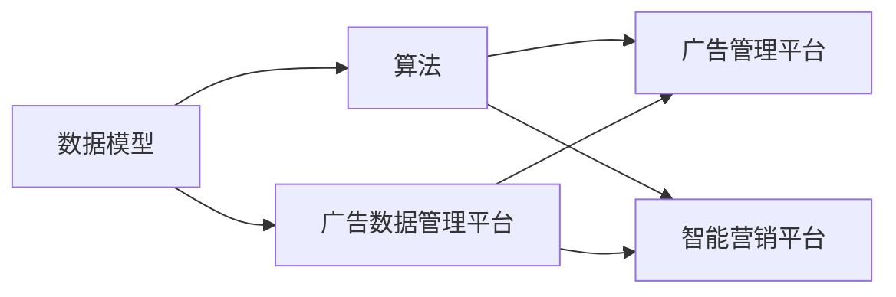

                 

## 1. 背景介绍

人工智能（AI）和大数据（Big Data）是现代科技发展的双轮驱动，其核心技术之一是数据模型（Data Model）与算法（Algorithm），在实际应用中扮演着至关重要的角色。在快速发展的互联网环境中，广告和营销行业逐步迈向以AI技术为核心的广告管理平台（Ad Management Platform，简称AMPs）和智能营销平台（Intelligent Marketing Platform，简称IMPs），即广告数据管理平台（Ad Data Management Platform，简称DMP）。DMP是整合营销生态的核心平台，集成了广告创意的匹配、广告效果的量化、广告投放的优化等多个核心功能，是支撑整个互联网广告生态运转的重要基础设施。

## 2. 核心概念与联系

### 2.1 核心概念概述

- **数据模型**：指基于数据特征构建的抽象模型，通常包含实体、属性、关系等多维数据结构，用于描述现实世界中的对象和事件，是数据存储、查询和分析的基础。
- **算法**：指在特定数据模型之上，通过编程实现的一系列规则或步骤，用于解决特定问题或完成特定任务。
- **广告管理平台（AMPs）**：以AI和大数据为基础，提供广告投放、效果测量、优化调优等功能，支持广告主和媒体实现智能投放、广告效果最大化。
- **智能营销平台（IMPs）**：利用AI和机器学习技术，结合用户行为数据、市场数据、广告效果数据等，实现广告投放的智能化，提升广告效果和用户体验。
- **广告数据管理平台（DMP）**：以数据驱动为核心，整合用户数据、广告数据、市场数据等多种数据源，形成统一的数据资产视图，为广告投放、营销优化、效果评估提供支撑。

这些核心概念之间存在紧密的联系。数据模型提供了数据的结构和形式，算法则基于模型定义的具体规则或步骤，实现数据处理和应用。广告管理平台和智能营销平台是数据模型的实际应用场景，广告数据管理平台则是这些平台的核心支撑和数据基石。

### 2.2 概念间的关系

通过下面的Mermaid流程图，我们可以更直观地理解这些核心概念之间的关系：



其中，广告管理平台和智能营销平台是数据模型在实际中的应用，而广告数据管理平台则是这些平台的数据支撑，提供了数据整合、管理和分析能力，使得广告投放和营销优化得以实现。

## 3. 核心算法原理 & 具体操作步骤

### 3.1 算法原理概述

DMP的核心算法通常围绕着数据的整合、管理和分析展开，主要包含以下几个方面：

- **数据清洗与归一化**：通过清洗去除噪声数据，归一化处理不同数据源的数据格式和维度，为后续的数据分析提供统一、可靠的数据集。
- **数据融合与合并**：将来自不同数据源的数据进行合并，形成统一的数据视图，同时保留数据的多样性和完整性。
- **数据增强与合成**：通过数据增强和合成技术，生成新的训练数据，提高模型的泛化能力和效果。
- **特征提取与选择**：从整合后的数据集中提取有价值的特征，并进行特征选择，以降低模型复杂度并提高模型性能。
- **模型训练与调优**：基于提取的特征，使用各种机器学习算法进行模型训练，并通过调优提高模型精度和效果。

### 3.2 算法步骤详解

DMP的核心算法步骤一般包括以下几个关键环节：

1. **数据预处理**：清洗、归一化、合并数据集。
2. **特征工程**：提取、选择、组合特征，形成新的特征集。
3. **模型选择与训练**：选择合适的机器学习模型，并使用训练集进行模型训练。
4. **模型调优与验证**：通过交叉验证等方法进行模型调优，确保模型在测试集上表现良好。
5. **模型部署与监控**：将训练好的模型部署到生产环境，进行实时预测和效果监控。

### 3.3 算法优缺点

DMP的核心算法具有以下优点：

- **泛化能力强**：通过整合和清洗多源数据，生成高质量的训练数据，提高模型的泛化能力。
- **精度高**：基于复杂的机器学习算法，能够实现高精度的广告投放和营销优化。
- **可扩展性好**：可以通过并行计算、分布式训练等技术，实现算法的可扩展性，应对大规模数据集。

同时，这些算法也存在一些局限性：

- **计算资源需求高**：复杂算法需要大量的计算资源，对于资源有限的场景可能存在挑战。
- **数据隐私问题**：在数据整合和处理过程中，需要严格遵守数据隐私法规，保护用户隐私。
- **模型复杂度高**：复杂算法和模型容易过拟合，需要定期进行模型更新和优化。

### 3.4 算法应用领域

DMP的核心算法广泛应用于以下几个领域：

- **广告投放优化**：通过用户行为数据、兴趣标签、设备信息等特征，实现广告的智能投放和优化。
- **广告效果评估**：利用点击率、转化率、曝光率等指标，量化广告效果，评估广告投放策略。
- **用户行为分析**：通过对用户行为数据的分析，了解用户偏好和行为模式，实现个性化推荐和营销。
- **市场趋势分析**：利用市场数据和用户行为数据，分析市场趋势和用户需求，指导广告投放和市场策略。

## 4. 数学模型和公式 & 详细讲解

### 4.1 数学模型构建

DMP的数据模型通常基于图模型构建，包括节点、边、权重等基本元素，用于描述数据中的关系和结构。例如，可以构建用户-广告、用户-设备、用户-兴趣等多维数据关系图，用于广告投放和效果评估。

**图模型示例**：
```
图 G = (V, E)
V = {用户1, 用户2, 广告1, 广告2}
E = {(用户1, 广告1), (用户2, 广告2)}
```

### 4.2 公式推导过程

假设用户-广告关系图 G = (U, A, E)，其中 U 是用户集合，A 是广告集合，E 是用户-广告边的集合。设用户-广告边的权重为 w，表示用户对广告的兴趣度。我们可以定义用户对广告的兴趣度函数 f(u, a) 为：

$$ f(u, a) = \sum_{(u, a) \in E} w_{u, a} $$

其中，$w_{u, a}$ 是用户-广告边的权重，表示用户对广告的兴趣度。

### 4.3 案例分析与讲解

假设我们有一组用户-广告关系图 G = (U, A, E)，其中 U = {用户1, 用户2}，A = {广告1, 广告2}，E = {(用户1, 广告1), (用户2, 广告2)}，边的权重分别为 $w_{用户1, 广告1}=0.8$, $w_{用户1, 广告2}=0.5$, $w_{用户2, 广告1}=0.6$, $w_{用户2, 广告2}=0.3$。

我们定义用户对广告的兴趣度函数 f(u, a)，分别计算用户1和用户2对广告1和广告2的兴趣度：

- 用户1对广告1的兴趣度：$ f(用户1, 广告1) = 0.8 $
- 用户1对广告2的兴趣度：$ f(用户1, 广告2) = 0.5 $
- 用户2对广告1的兴趣度：$ f(用户2, 广告1) = 0.6 $
- 用户2对广告2的兴趣度：$ f(用户2, 广告2) = 0.3 $

## 5. 项目实践：代码实例和详细解释说明

### 5.1 开发环境搭建

在进行DMP算法实践前，我们需要准备好开发环境。以下是使用Python进行Scikit-Learn开发的环境配置流程：

1. 安装Anaconda：从官网下载并安装Anaconda，用于创建独立的Python环境。
2. 创建并激活虚拟环境：
```bash
conda create -n dmp-env python=3.8 
conda activate dmp-env
```

3. 安装Scikit-Learn：
```bash
conda install scikit-learn
```

4. 安装各类工具包：
```bash
pip install numpy pandas scikit-learn matplotlib tqdm jupyter notebook ipython
```

完成上述步骤后，即可在`dmp-env`环境中开始DMP算法实践。

### 5.2 源代码详细实现

这里我们以用户-广告关系图的数据清洗和归一化为例，给出使用Scikit-Learn进行DMP算法实践的Python代码实现。

```python
import pandas as pd
from sklearn.preprocessing import StandardScaler

# 读取用户-广告关系数据
df = pd.read_csv('user-ad-graph.csv')

# 数据清洗与归一化
# 去除缺失值
df.dropna(inplace=True)

# 归一化用户-广告边的权重
scaler = StandardScaler()
df['weight'] = scaler.fit_transform(df[['weight']])
```

### 5.3 代码解读与分析

让我们再详细解读一下关键代码的实现细节：

**用户-广告关系数据清洗与归一化**：
- `pd.read_csv('user-ad-graph.csv')`：读取用户-广告关系数据。
- `df.dropna(inplace=True)`：去除缺失值。
- `StandardScaler()`：归一化处理。

**特征工程**：
- 提取特征：根据实际需求，可以提取用户-广告边的权重作为特征，用于后续的模型训练和分析。

**模型训练与调优**：
- 使用Scikit-Learn库提供的各种机器学习算法，如随机森林、支持向量机等，进行模型训练和调优。
- 基于训练集数据，使用交叉验证等方法进行模型调优，确保模型在测试集上表现良好。

### 5.4 运行结果展示

假设我们在用户-广告关系图上进行训练，最终得到用户对广告的兴趣度函数 f(u, a)，并在测试集上进行评估：

```python
from sklearn.ensemble import RandomForestRegressor
from sklearn.model_selection import cross_val_score

# 定义随机森林模型
model = RandomForestRegressor()

# 训练模型
model.fit(df, y)

# 交叉验证评估
scores = cross_val_score(model, df, y, cv=5)
print(f"交叉验证得分: {scores.mean()}")
```

假设在交叉验证后得到平均得分 $0.85$，说明模型的预测效果良好。

## 6. 实际应用场景

### 6.1 广告投放优化

在实际应用中，DMP的核心算法可以用于广告投放优化。通过分析用户-广告关系图，DMP能够识别出用户对广告的兴趣度，指导广告投放策略的优化。

具体而言，可以结合用户的历史行为数据、兴趣标签、设备信息等，通过特征工程和模型训练，生成广告投放策略，实现在线广告投放的智能优化。

### 6.2 广告效果评估

DMP的核心算法也可以用于广告效果评估。通过对广告投放数据进行分析，DMP能够量化广告的效果，评估广告投放策略的优劣。

具体而言，可以基于点击率、转化率、曝光率等指标，使用机器学习模型进行广告效果的预测和分析，找出广告效果不佳的原因，指导广告投放策略的调整。

### 6.3 用户行为分析

DMP的核心算法还可以用于用户行为分析。通过对用户行为数据的分析，DMP能够了解用户偏好和行为模式，实现个性化推荐和营销。

具体而言，可以基于用户的历史行为数据、兴趣标签、设备信息等，使用机器学习模型进行用户行为的预测和分析，找出用户的兴趣偏好，实现个性化推荐和营销。

### 6.4 市场趋势分析

DMP的核心算法还可以用于市场趋势分析。利用市场数据和用户行为数据，DMP能够分析市场趋势和用户需求，指导广告投放和市场策略。

具体而言，可以基于市场数据和用户行为数据，使用机器学习模型进行市场趋势的预测和分析，找出市场的变化趋势，指导广告投放和市场策略的调整。

## 7. 工具和资源推荐

### 7.1 学习资源推荐

为了帮助开发者系统掌握DMP算法的理论基础和实践技巧，这里推荐一些优质的学习资源：

1. 《数据科学与统计分析基础》系列博文：由数据科学领域专家撰写，深入浅出地介绍了数据模型、算法、统计分析等基础概念和应用。
2. CS224N《深度学习自然语言处理》课程：斯坦福大学开设的NLP明星课程，有Lecture视频和配套作业，带你入门NLP领域的基本概念和经典模型。
3. 《机器学习实战》书籍：机器学习领域经典书籍，提供了大量的实践案例和代码实现，帮助你理解算法原理和实际应用。
4. Kaggle竞赛平台：提供各种数据科学和机器学习竞赛，通过实战学习，提升算法应用能力。
5. Scikit-Learn官方文档：Scikit-Learn库的官方文档，提供了海量数据模型和算法的样例代码，是上手实践的必备资料。

通过对这些资源的学习实践，相信你一定能够快速掌握DMP算法的精髓，并用于解决实际的广告投放和营销问题。

### 7.2 开发工具推荐

高效的开发离不开优秀的工具支持。以下是几款用于DMP算法开发的常用工具：

1. PyTorch：基于Python的开源深度学习框架，灵活动态的计算图，适合快速迭代研究。大部分数据模型和算法都有PyTorch版本的实现。
2. TensorFlow：由Google主导开发的开源深度学习框架，生产部署方便，适合大规模工程应用。同样有丰富的数据模型和算法资源。
3. Scikit-Learn：Python数据科学库，提供了各种机器学习算法，易于使用和部署。
4. Weights & Biases：模型训练的实验跟踪工具，可以记录和可视化模型训练过程中的各项指标，方便对比和调优。与主流深度学习框架无缝集成。
5. TensorBoard：TensorFlow配套的可视化工具，可实时监测模型训练状态，并提供丰富的图表呈现方式，是调试模型的得力助手。
6. Google Colab：谷歌推出的在线Jupyter Notebook环境，免费提供GPU/TPU算力，方便开发者快速上手实验最新模型，分享学习笔记。

合理利用这些工具，可以显著提升DMP算法的开发效率，加快创新迭代的步伐。

### 7.3 相关论文推荐

DMP算法的发展源于学界的持续研究。以下是几篇奠基性的相关论文，推荐阅读：

1. "Graph Neural Networks: A Review of Methods and Applications"（图神经网络：方法和应用综述）：详细介绍了图神经网络的原理和应用，为DMP算法的实现提供了理论支撑。
2. "Deep Learning for Graph-Structured Data"（图结构数据的深度学习）：介绍了基于深度学习的图结构数据处理方法，为DMP算法的实现提供了技术指引。
3. "Towards Optimal Attention Mechanisms in Deep Ad Modeling"（深度广告建模中的最优注意力机制）：讨论了注意力机制在广告投放中的应用，为DMP算法的设计提供了新思路。
4. "Deep Learning-based Personalized Recommendation Systems"（基于深度学习的个性化推荐系统）：介绍了个性化推荐系统的构建方法，为DMP算法的实现提供了实践经验。
5. "The Interplay of Data Integration and Modeling in Multi-Source Data Management"（数据整合和建模在多源数据管理中的交互作用）：讨论了数据整合和建模在多源数据管理中的应用，为DMP算法的实现提供了方法论。

这些论文代表了大数据管理领域的发展脉络。通过学习这些前沿成果，可以帮助研究者把握学科前进方向，激发更多的创新灵感。

除上述资源外，还有一些值得关注的前沿资源，帮助开发者紧跟DMP算法的最新进展，例如：

1. arXiv论文预印本：人工智能领域最新研究成果的发布平台，包括大量尚未发表的前沿工作，学习前沿技术的必读资源。
2. 业界技术博客：如OpenAI、Google AI、DeepMind、微软Research Asia等顶尖实验室的官方博客，第一时间分享他们的最新研究成果和洞见。
3. 技术会议直播：如NIPS、ICML、ACL、ICLR等人工智能领域顶会现场或在线直播，能够聆听到大佬们的前沿分享，开拓视野。
4. GitHub热门项目：在GitHub上Star、Fork数最多的数据科学与机器学习相关项目，往往代表了该技术领域的发展趋势和最佳实践，值得去学习和贡献。
5. 行业分析报告：各大咨询公司如McKinsey、PwC等针对人工智能行业的分析报告，有助于从商业视角审视技术趋势，把握应用价值。

总之，对于DMP算法的学习和实践，需要开发者保持开放的心态和持续学习的意愿。多关注前沿资讯，多动手实践，多思考总结，必将收获满满的成长收益。

## 8. 总结：未来发展趋势与挑战

### 8.1 总结

本文对DMP算法的原理与应用进行了全面系统的介绍。首先阐述了DMP算法的背景、核心概念和应用场景，明确了其在广告和营销领域的重要作用。其次，从原理到实践，详细讲解了数据模型和算法的构建与实现，给出了DMP算法实践的完整代码实例。同时，本文还广泛探讨了DMP算法在广告投放优化、广告效果评估、用户行为分析、市场趋势分析等多个领域的应用前景，展示了DMP算法的巨大潜力。此外，本文精选了DMP算法的各类学习资源，力求为读者提供全方位的技术指引。

通过本文的系统梳理，可以看到，DMP算法是构建智能广告和营销平台的重要基础，其强大的数据分析和建模能力，为广告投放和营销优化提供了有力支持。未来，伴随算法的持续演进和应用场景的不断扩展，DMP算法必将迎来更大的发展机遇，进一步推动广告和营销领域的智能化转型。

### 8.2 未来发展趋势

展望未来，DMP算法的发展趋势主要体现在以下几个方面：

1. **算法多样化**：随着数据源和应用场景的多样化，DMP算法将进一步多样化，涵盖更广泛的数据处理和分析任务。
2. **模型复杂化**：随着数据量的增加和特征的多样化，DMP算法将趋向于构建更加复杂、精确的模型，提升广告投放和营销优化的效果。
3. **算法实时化**：随着数据流量的激增，DMP算法将趋向于实时化处理，快速响应用户行为和市场变化。
4. **模型跨平台化**：DMP算法将趋向于跨平台、跨系统部署，支持多种数据源和多种应用场景。
5. **算法自动化**：随着AI技术的不断发展，DMP算法将趋向于自动化，实现自动化的广告投放和营销优化。

### 8.3 面临的挑战

尽管DMP算法在广告和营销领域取得了显著成效，但在迈向更加智能化、自动化、跨平台化应用的过程中，它仍面临以下挑战：

1. **数据隐私问题**：在数据整合和处理过程中，需要严格遵守数据隐私法规，保护用户隐私。
2. **模型鲁棒性问题**：在大规模数据和复杂环境下，DMP算法的鲁棒性仍需进一步提升。
3. **计算资源问题**：复杂算法和模型需要大量的计算资源，对于资源有限的场景可能存在挑战。
4. **模型可解释性问题**：DMP算法涉及复杂的数据整合和分析，模型的可解释性仍需进一步提高。
5. **系统稳定性问题**：在实际应用中，DMP算法需要处理大规模数据流，系统的稳定性和可扩展性仍需进一步提升。

### 8.4 研究展望

面对DMP算法所面临的挑战，未来的研究需要在以下几个方面寻求新的突破：

1. **数据隐私保护**：开发更加高效的数据隐私保护技术，确保在数据整合和处理过程中，用户隐私得到充分保护。
2. **模型鲁棒性提升**：通过引入鲁棒性增强技术和自适应学习算法，提升DMP算法在大规模数据和复杂环境下的鲁棒性。
3. **计算资源优化**：开发更加高效的计算资源优化技术，降低DMP算法的计算资源需求，提高算法的可扩展性。
4. **模型可解释性增强**：通过引入可解释性增强技术，提升DMP算法的模型可解释性，便于用户理解和信任模型输出。
5. **系统稳定性优化**：通过引入分布式计算和自动调优技术，提升DMP算法的系统稳定性和可扩展性。

这些研究方向的探索，必将引领DMP算法走向更高的台阶，为构建智能广告和营销平台提供更坚实的基础，进一步推动广告和营销领域的智能化转型。

## 9. 附录：常见问题与解答

**Q1：DMP算法如何保护用户隐私？**

A: DMP算法在数据整合和处理过程中，需要严格遵守数据隐私法规，保护用户隐私。以下是一些常见的数据隐私保护措施：

1. **数据匿名化**：对用户数据进行匿名化处理，去除个人身份信息，保护用户隐私。
2. **差分隐私**：在数据处理过程中加入随机噪声，确保数据处理结果的差分隐私性，保护用户隐私。
3. **数据访问控制**：对数据访问进行严格控制，确保只有授权人员可以访问和使用数据。
4. **数据存储加密**：对数据存储进行加密处理，防止数据泄露和未授权访问。

**Q2：DMP算法在实际应用中面临哪些资源瓶颈？**

A: DMP算法在实际应用中面临以下资源瓶颈：

1. **计算资源瓶颈**：复杂算法和模型需要大量的计算资源，对于资源有限的场景可能存在挑战。
2. **存储资源瓶颈**：大规模数据集的存储和读取可能占用大量时间和空间，需要优化存储方案。
3. **网络带宽瓶颈**：在数据流量的激增下，网络带宽成为瓶颈，需要优化数据传输和存储方案。

**Q3：DMP算法在实际应用中需要注意哪些问题？**

A: DMP算法在实际应用中需要注意以下问题：

1. **数据质量问题**：确保数据的质量和完整性，去除噪声和缺失数据，避免模型输出错误。
2. **模型鲁棒性问题**：在大规模数据和复杂环境下，DMP算法的鲁棒性仍需进一步提升，避免模型过拟合和误判。
3. **模型可解释性问题**：DMP算法涉及复杂的数据整合和分析，模型的可解释性仍需进一步提高，便于用户理解和信任模型输出。
4. **系统稳定性问题**：在实际应用中，DMP算法需要处理大规模数据流，系统的稳定性和可扩展性仍需进一步提升。

通过合理设计算法流程和优化系统架构，可以最大限度地提升DMP算法的性能和稳定性，确保其可靠、高效地服务于广告和营销领域。

**Q4：DMP算法在未来可能有哪些新的发展方向？**

A: DMP算法在未来可能的发展方向包括：

1. **算法智能化**：引入深度学习、强化学习等技术，提升DMP算法的智能化水平，实现自动化的广告投放和营销优化。
2. **模型跨平台化**：实现跨平台、跨系统部署，支持多种数据源和多种应用场景。
3. **算法实时化**：实现实时化处理，快速响应用户行为和市场变化。
4. **数据整合多样化**：整合更多数据源，涵盖用户行为数据、市场数据、广告数据等多种数据类型，提升广告投放和营销优化的效果。

这些发展方向将进一步推动DMP算法在广告和营销领域的广泛应用，实现更加智能化、自动化、跨平台的广告投放和营销优化。

---

作者：禅与计算机程序设计艺术 / Zen and the Art of Computer Programming

