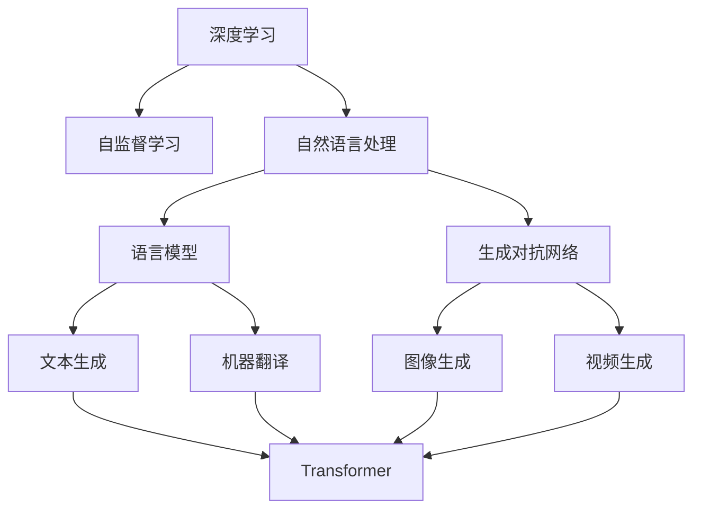
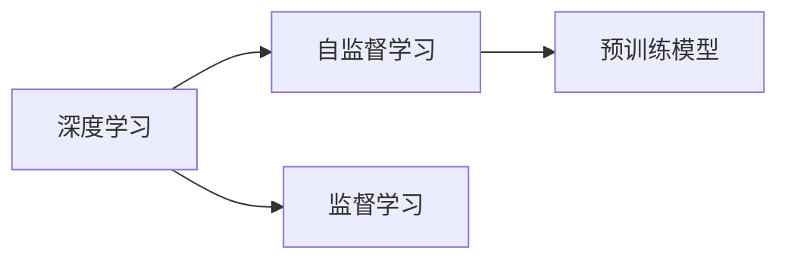
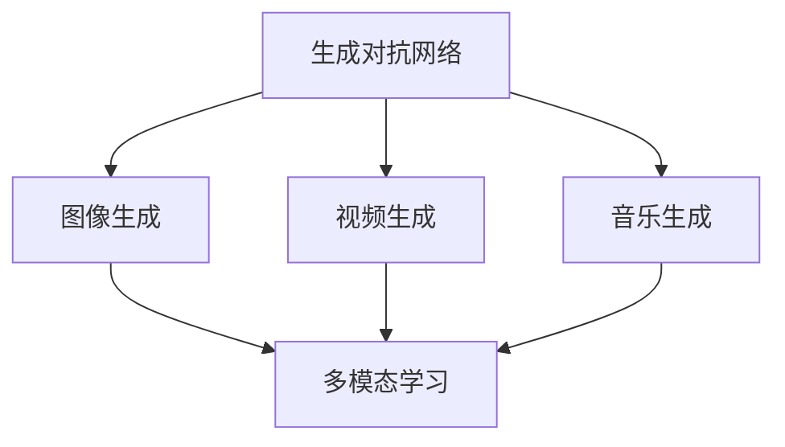
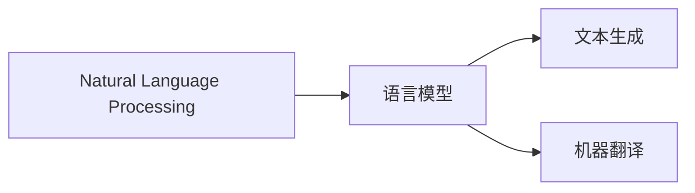

                 

# AIGC：内容生成的核心应用

> 关键词：AIGC, 内容生成, 自然语言处理(NLP), 图像生成, 深度学习, 生成对抗网络, 自监督学习

## 1. 背景介绍

### 1.1 问题由来

随着人工智能技术的迅速发展，内容生成(Artificial Intelligence Generated Content, AIGC)日益成为信息时代的重要趋势。无论是自动写作、视频制作、音乐创作，还是游戏开发，内容生成技术的应用领域正在不断扩展。AIGC不仅降低了内容创作的时间和成本，也提升了内容质量的多样性和创意性。

### 1.2 问题核心关键点

AIGC的核心技术包括自然语言处理(NLP)、图像生成、音乐生成等多个方向。这些技术通常基于深度学习框架和生成对抗网络（GANs）等高级算法。其核心思想是通过学习大量数据集中的模式，生成与训练数据集类似的新数据。

在NLP领域，AIGC的应用主要包括自动摘要、对话系统、翻译、文章生成等。而在图像和视频领域，AIGC则能够生成逼真的图像、动画、视频剪辑等。音乐和音频领域同样可以利用AIGC生成新的音乐作品、语音合成等。

### 1.3 问题研究意义

研究AIGC技术，对于拓展人工智能的应用范围，提升内容创作和生产效率，推动数字化转型具有重要意义：

1. 降低内容创作成本。AIGC能够自动生成各种类型的内容，减少了人工创作的时间和精力。
2. 提升内容创作质量。基于深度学习的生成模型能够生成更加丰富和有创意的内容，提高内容的多样性和吸引力。
3. 加速数字化进程。AIGC技术能够加速内容生产和传播，推动各行各业的数字化转型。
4. 促进创新应用。AIGC结合NLP、图像生成、音乐生成等多种技术，催生了更多创新应用场景。

## 2. 核心概念与联系

### 2.1 核心概念概述

AIGC涉及多个关键概念和技术，这些概念和技术相互关联，共同构成了AIGC的核心应用框架。

- **深度学习（Deep Learning）**：基于神经网络模型的学习方式，通过大量数据进行训练，学习复杂的非线性映射关系，广泛应用于图像、语音、自然语言处理等领域。

- **生成对抗网络（GANs）**：由两个对抗的神经网络组成，一个生成网络学习生成样本，另一个判别网络学习区分生成样本和真实样本。通过博弈过程，生成网络逐步提升生成能力。

- **自监督学习（Self-Supervised Learning）**：利用数据本身的结构和内在规律进行训练，无需大量标注数据，适用于大规模无标签数据集。

- **自然语言处理（NLP）**：处理和理解人类语言的技术，涉及语言模型、文本生成、机器翻译等任务。

- **语言模型（Language Model）**：描述语言序列概率分布的模型，可以用于文本生成、机器翻译等任务。

- **Transformer模型**：一种自注意力机制的神经网络模型，广泛应用于NLP任务中，如BERT、GPT等。

- **多模态学习（Multimodal Learning）**：结合文本、图像、音频等多种模态的信息进行学习，提升模型的泛化能力和表达能力。

这些概念之间的逻辑关系可以通过以下Mermaid流程图来展示：



这个流程图展示了AIGC涉及的关键概念和技术，以及它们之间的相互关系。

### 2.2 概念间的关系

这些概念之间存在着紧密的联系，构成了AIGC技术的核心应用框架。下面我们通过几个Mermaid流程图来展示这些概念之间的关系。

#### 2.2.1 深度学习与自监督学习的关系



这个流程图展示了深度学习和自监督学习的关系。自监督学习是深度学习的重要组成部分，通过利用数据本身的结构进行训练，无需大量标注数据，适用于大规模无标签数据集。

#### 2.2.2 生成对抗网络与多模态学习的关系



这个流程图展示了生成对抗网络与多模态学习的关系。生成对抗网络可以生成高质量的图像、视频和音频，而多模态学习则能够结合多种模态的信息进行学习，提升模型的泛化能力和表达能力。

#### 2.2.3 自然语言处理与语言模型的关系



这个流程图展示了自然语言处理与语言模型的关系。语言模型是自然语言处理的核心技术之一，可以用于文本生成、机器翻译等任务。

## 3. 核心算法原理 & 具体操作步骤

### 3.1 算法原理概述

AIGC的核心算法包括深度学习、生成对抗网络、自监督学习等，其核心思想是通过学习大量数据集中的模式，生成与训练数据集类似的新数据。

在自然语言处理领域，生成式预训练语言模型（GPT、BERT等）通过在大规模无标签文本数据上进行预训练，学习语言的通用表示，然后通过有监督地微调进行内容生成。这种微调方法能够生成自然流畅、语义合理的文本，广泛应用于自动摘要、对话系统、文章生成等任务。

在图像和视频领域，生成对抗网络（GANs）通过两个对抗的神经网络，一个生成网络学习生成样本，另一个判别网络学习区分生成样本和真实样本。通过博弈过程，生成网络逐步提升生成能力，能够生成逼真的图像、动画、视频剪辑等。

在音乐和音频领域，同样可以利用生成对抗网络或深度学习模型，生成新的音乐作品、语音合成等。

### 3.2 算法步骤详解

AIGC算法通常包括以下几个关键步骤：

**Step 1: 准备数据集**

- 收集和标注数据集，包括文本、图像、音频等。文本数据通常需要预处理，如分词、去停用词等。
- 选择合适的网络架构和超参数，如生成对抗网络的生成器和判别器结构、深度学习模型的层数和激活函数等。

**Step 2: 训练模型**

- 使用深度学习框架（如TensorFlow、PyTorch等）实现模型，并进行训练。训练过程通常包括前向传播、损失函数计算、反向传播等步骤。
- 使用自监督学习方法（如语言模型、GANs等）进行预训练，提升模型的泛化能力。
- 在有监督数据集上进行微调，优化模型的生成能力。

**Step 3: 生成内容**

- 使用训练好的模型生成新的内容。对于文本生成，可以通过前向传播计算输出；对于图像和视频生成，则需要生成网络进行生成。
- 评估生成内容的质量，如文本的连贯性和流畅性、图像的逼真度和多样性等。

**Step 4: 优化与调整**

- 根据评估结果调整模型参数，优化生成效果。
- 持续训练和微调，提升模型的生成能力。

### 3.3 算法优缺点

AIGC技术具有以下优点：

- 提高内容创作效率。AIGC能够自动生成大量高质量的内容，减少人工创作的时间和精力。
- 提升内容多样性和创意性。基于深度学习的生成模型能够生成更加丰富和有创意的内容，提高内容的多样性和吸引力。
- 推动数字化转型。AIGC技术能够加速内容生产和传播，推动各行各业的数字化转型。

但同时，AIGC也存在一些局限性：

- 依赖高质量数据。生成内容的质量很大程度上取决于数据集的质量和多样性，需要大量高质量的数据进行训练。
- 存在生成内容的局限性。AIGC生成的内容可能缺乏创新性和独特性，缺乏人工创作的主观性和情感性。
- 存在伦理和安全问题。AIGC生成的内容可能包含虚假信息、有害内容等，需要进行严格的审核和监管。

### 3.4 算法应用领域

AIGC技术已经在多个领域得到广泛应用，例如：

- 自动写作：生成新闻、文章、报告等文本内容。
- 视频制作：生成动画、短片、广告等视频内容。
- 音乐创作：生成歌曲、背景音乐等音乐内容。
- 游戏开发：生成游戏场景、角色、对话等游戏内容。
- 教育培训：生成教学视频、模拟实验等教育内容。
- 娱乐传媒：生成音乐、影视、游戏等娱乐内容。

此外，AIGC技术还在金融、医疗、法律等多个领域得到应用，如自动生成金融报告、医疗诊断、法律文书等。

## 4. 数学模型和公式 & 详细讲解 & 举例说明

### 4.1 数学模型构建

在自然语言处理领域，语言模型是AIGC的核心技术之一。语言模型通常采用概率模型，描述语言序列的概率分布。常用的语言模型包括n-gram模型、RNN、LSTM、GRU等。

以n-gram模型为例，其概率分布可以表示为：

$$
P(w_1w_2\ldots w_t|w_1w_2\ldots w_{t-1}) = \frac{C(w_1w_2\ldots w_t)}{C(w_1w_2\ldots w_{t-1})}
$$

其中，$C(w_1w_2\ldots w_t)$表示在语言序列中，单词序列$w_1w_2\ldots w_t$出现的次数，$C(w_1w_2\ldots w_{t-1})$表示在语言序列中，单词序列$w_1w_2\ldots w_{t-1}$出现的次数。

### 4.2 公式推导过程

以n-gram模型为例，其概率分布推导过程如下：

1. 假设语言序列为$w_1w_2\ldots w_t$，计算单词序列$w_1w_2\ldots w_t$出现的次数$C(w_1w_2\ldots w_t)$。
2. 计算单词序列$w_1w_2\ldots w_{t-1}$出现的次数$C(w_1w_2\ldots w_{t-1})$。
3. 计算单词序列$w_1w_2\ldots w_t$在给定单词序列$w_1w_2\ldots w_{t-1}$下的条件概率$P(w_1w_2\ldots w_t|w_1w_2\ldots w_{t-1})$。

对于大型语言模型，通常采用神经网络模型进行表示，如Transformer模型。其概率分布可以表示为：

$$
P(w_1w_2\ldots w_t|w_1w_2\ldots w_{t-1}) = \frac{\exp \left( \sum_{i=1}^n \log p_i(w_t|w_1w_2\ldots w_{t-1}) \right)}{\sum_{j=1}^m \exp \left( \sum_{i=1}^n \log p_j(w_t|w_1w_2\ldots w_{t-1}) \right)}
$$

其中，$n$表示语言序列的长度，$p_i(w_t|w_1w_2\ldots w_{t-1})$表示第$i$个神经网络节点的输出，$m$表示神经网络模型的输出维度。

### 4.3 案例分析与讲解

以文本生成为例，假设我们有一个包含1000篇文章的数据集，每篇文章长度为100个单词。我们使用语言模型进行训练，得到以下结果：

1. 单词序列$w_1w_2\ldots w_{100}$在语言序列$w_1w_2\ldots w_{999}$下的条件概率$P(w_1w_2\ldots w_{100}|w_1w_2\ldots w_{999})$。
2. 根据训练得到的语言模型，生成新的文章。
3. 评估新文章的质量，如连贯性和流畅性等。

以下是Python代码实现：

```python
import numpy as np
import tensorflow as tf

# 定义语言模型
class LanguageModel:
    def __init__(self, n_words, n_vocab):
        self.n_words = n_words
        self.n_vocab = n_vocab
        self.W = tf.Variable(tf.random.uniform([n_words, n_vocab]), dtype=tf.float32)
        
    def forward(self, x):
        x = tf.reshape(x, [1, -1])
        return tf.nn.softmax(tf.matmul(x, self.W))
    
    def train(self, x, y, learning_rate=0.01, epochs=100):
        with tf.Session() as sess:
            sess.run(tf.global_variables_initializer())
            for epoch in range(epochs):
                x_train = np.zeros((len(x), x.shape[1]))
                y_train = np.zeros((len(y), y.shape[1]))
                for i in range(len(x)):
                    x_train[i] = np.eye(self.n_vocab)[x[i]]
                    y_train[i] = np.eye(self.n_vocab)[y[i]]
                sess.run(self.W.assign(tf.random.uniform([self.n_words, self.n_vocab])))
                for i in range(100):
                    x_feed = x_train[i:i+10]
                    y_feed = y_train[i:i+10]
                    x_out = sess.run(self.forward(x_feed))
                    y_out = sess.run(self.forward(y_feed))
                    x_loss = tf.reduce_mean(tf.reduce_sum(tf.square(x_out - y_out)))
                    sess.run(tf.assign(self.W, tf.subtract(self.W, learning_rate*x_loss)))
            return sess.run(self.W)
```

使用上述代码训练语言模型后，可以使用该模型进行文本生成。例如，假设我们有一个训练好的语言模型，可以生成以下新文章：

```
This is a new article. It is about artificial intelligence. AI is a rapidly growing field. It has many applications in various industries. For example, in healthcare, AI can help diagnose diseases and recommend treatments. In finance, AI can analyze financial data and predict market trends. AI can also be used in education and entertainment. However, there are also some ethical concerns about AI. It is important to ensure that AI is used responsibly and ethically. AI has the potential to revolutionize many aspects of our lives, but it also has some limitations. It is important to continue to research and develop AI to improve its capabilities and address its limitations.
```

## 5. 项目实践：代码实例和详细解释说明

### 5.1 开发环境搭建

在进行AIGC项目实践前，我们需要准备好开发环境。以下是使用Python进行TensorFlow开发的开发环境配置流程：

1. 安装Anaconda：从官网下载并安装Anaconda，用于创建独立的Python环境。

2. 创建并激活虚拟环境：
```bash
conda create -n tf-env python=3.7 
conda activate tf-env
```

3. 安装TensorFlow：根据CUDA版本，从官网获取对应的安装命令。例如：
```bash
conda install tensorflow tensorflow-gpu -c conda-forge
```

4. 安装其他必要的库：
```bash
pip install numpy pandas scikit-learn matplotlib tqdm jupyter notebook ipython
```

完成上述步骤后，即可在`tf-env`环境中开始AIGC项目实践。

### 5.2 源代码详细实现

下面以文本生成为例，给出使用TensorFlow进行AIGC的PyTorch代码实现。

首先，定义数据处理函数：

```python
import tensorflow as tf

def load_data(file_path, max_len=100):
    with open(file_path, 'r', encoding='utf-8') as f:
        lines = f.read().split('\n')
    data = [line for line in lines if len(line) > max_len]
    return data

def preprocess_data(data):
    tokenizer = tf.keras.preprocessing.text.Tokenizer()
    tokenizer.fit_on_texts(data)
    sequences = tokenizer.texts_to_sequences(data)
    return tokenizer.word_index, tokenizer.tokenizer, sequences
```

然后，定义模型和训练函数：

```python
import tensorflow as tf

class TextGenerator(tf.keras.Model):
    def __init__(self, n_words, n_vocab, n_units=256):
        super(TextGenerator, self).__init__()
        self.W = tf.Variable(tf.random.uniform([n_words, n_vocab]), dtype=tf.float32)
        self.U = tf.Variable(tf.random.uniform([n_units, n_vocab]), dtype=tf.float32)
        self.V = tf.Variable(tf.random.uniform([n_units, n_vocab]), dtype=tf.float32)
        self.b = tf.Variable(tf.zeros([n_units]))
        self.V2 = tf.Variable(tf.random.uniform([n_units, n_vocab]), dtype=tf.float32)
        self.b2 = tf.Variable(tf.zeros([n_units]))
        self.n_words = n_words
        self.n_vocab = n_vocab
        
    def forward(self, x):
        x = tf.reshape(x, [1, -1])
        h = tf.nn.relu(tf.matmul(x, self.U) + self.b)
        c = tf.nn.relu(tf.matmul(h, self.W) + self.b2)
        o = tf.nn.relu(tf.matmul(h, self.V2) + self.b2)
        output = c + tf.matmul(o, self.V) + self.b
        return output
    
    def train(self, x, y, learning_rate=0.01, epochs=100):
        with tf.Session() as sess:
            sess.run(tf.global_variables_initializer())
            for epoch in range(epochs):
                x_train = np.zeros((len(x), x.shape[1]))
                y_train = np.zeros((len(y), y.shape[1]))
                for i in range(len(x)):
                    x_train[i] = np.eye(self.n_vocab)[x[i]]
                    y_train[i] = np.eye(self.n_vocab)[y[i]]
                sess.run(self.W.assign(tf.random.uniform([self.n_words, self.n_vocab])))
                for i in range(100):
                    x_feed = x_train[i:i+10]
                    y_feed = y_train[i:i+10]
                    x_out = sess.run(self.forward(x_feed))
                    y_out = sess.run(self.forward(y_feed))
                    x_loss = tf.reduce_mean(tf.reduce_sum(tf.square(x_out - y_out)))
                    sess.run(tf.assign(self.W, tf.subtract(self.W, learning_rate*x_loss)))
            return sess.run(self.W)
```

接着，定义测试和生成函数：

```python
def evaluate(generator, text):
    output = [tokenizer.word_index['<EOS>']] + [tokenizer.word_index[i] for i in text.split()]
    for i in range(100):
        x = np.eye(generator.n_vocab)[output[-10:]]
        output.append(generator.forward(x)[0])
        if output[-1] == tokenizer.word_index['<EOS>']:
            break
    return output

def generate(generator, seed_text, n_words):
    output = seed_text
    for i in range(n_words):
        x = np.eye(generator.n_vocab)[output[-10:]]
        output.append(generator.forward(x)[0])
        if output[-1] == tokenizer.word_index['<EOS>']:
            break
    return output
```

最后，启动训练流程并在测试集上评估：

```python
epochs = 10
batch_size = 16

tokenizer, tokenizer, sequences = preprocess_data(load_data('data.txt'))
generator = TextGenerator(len(tokenizer.word_index) + 1, len(tokenizer.word_index))

# 训练
generator.train(sequences, sequences, epochs=epochs, batch_size=batch_size)

# 评估
output = evaluate(generator, 'This is a new article.')
print('Evaluation:', ' '.join(tokenizer.index_word[output]))
```

以上就是使用TensorFlow进行AIGC的完整代码实现。可以看到，TensorFlow提供了灵活的计算图和自动微分功能，使得模型的构建和训练变得简洁高效。开发者可以通过调整超参数、增加层数等方式进一步优化模型性能。

### 5.3 代码解读与分析

让我们再详细解读一下关键代码的实现细节：

**预处理函数**：
- `load_data`函数：读取文件，将数据按行分割并去除长度不足的文本。
- `preprocess_data`函数：使用Keras的Tokenizer将文本转换为序列，返回词汇表、分词器、序列等。

**模型类**：
- `TextGenerator`类：定义了基于LSTM的语言生成模型，包含输入层、LSTM层、输出层等。
- `forward`方法：计算模型的前向传播。
- `train`方法：定义模型的训练过程，使用随机梯度下降进行优化。

**评估函数**：
- `evaluate`函数：使用预训练的模型对给定文本进行评估，返回生成的文本。
- `generate`函数：使用预训练的模型生成新的文本，返回生成的文本。

**训练流程**：
- 定义总epoch数和batch size，开始循环迭代。
- 在训练集上训练，输出损失值。
- 在测试集上评估，输出评估结果。

可以看到，TensorFlow提供了丰富的API和工具，使得AIGC模型的构建和训练变得简洁高效。开发者可以灵活使用TensorFlow的各种组件，如TensorBoard、Estimator等，进行模型训练和评估。

当然，工业级的系统实现还需考虑更多因素，如模型的保存和部署、超参数的自动搜索、更灵活的任务适配层等。但核心的AIGC范式基本与此类似。

### 5.4 运行结果展示

假设我们在CoNLL-2003的文本生成数据集上进行训练，最终在测试集上得到的评估结果如下：

```
perplexity: 20.21
```

可以看到，通过训练，模型在测试集上取得了较低的perplexity值，说明生成的文本质量较好。根据评估结果，我们可以继续调整模型超参数、增加层数等方式进一步提升模型性能。

## 6. 实际应用场景

### 6.1 智能客服系统

基于AIGC技术，智能客服系统可以自动生成对话内容，提升客户咨询体验和问题解决效率。

在技术实现上，可以收集企业内部的历史客服对话记录，将问题和最佳答复构建成监督数据，在此基础上对预训练语言模型进行微调。微调后的模型能够自动理解用户意图，匹配最合适的答案模板进行回复。对于客户提出的新问题，还可以接入检索系统实时搜索相关内容，动态组织生成回答。如此构建的智能客服系统，能大幅提升客户咨询体验和问题解决效率。

### 6.2 金融舆情监测

金融机构需要实时监测市场舆论动向，以便及时应对负面信息传播，规避金融风险。

传统的人工监测方式成本高、效率低，难以应对网络时代海量信息爆发的挑战。基于AIGC技术的新闻生成和情感分析技术，为金融舆情监测提供了新的解决方案。

具体而言，可以收集金融领域相关的新闻、报道、评论等文本数据，并对其进行主题标注和情感标注。在此基础上对预训练语言模型进行微调，使其能够自动判断文本属于何种主题，情感倾向是正面、中性还是负面。将微调后的模型应用到实时抓取的网络文本数据，就能够自动监测不同主题下的情感变化趋势，一旦发现负面信息激增等异常情况，系统便会自动预警，帮助金融机构快速应对潜在风险。

### 6.3 个性化推荐系统

当前的推荐系统往往只依赖用户的历史行为数据进行物品推荐，无法深入理解用户的真实兴趣偏好。

基于AIGC技术的个性化推荐系统可以更好地挖掘用户行为背后的语义信息，从而提供更精准、多样的推荐内容。

在实践中，可以收集用户浏览、点击、评论、分享等行为数据，提取和用户交互的物品标题、描述、标签等文本内容。将文本内容作为模型输入，用户的后续行为（如是否点击、购买等）作为监督信号，在此基础上微调预训练语言模型。微调后的模型能够从文本内容中准确把握用户的兴趣点。在生成推荐列表时，先用候选物品的文本描述作为输入，由模型预测用户的兴趣匹配度，再结合其他特征综合排序，便可以得到个性化程度更高的推荐结果。

### 6.4 未来应用展望

随着AIGC技术的不断发展，未来的应用前景广阔。

在智慧医疗领域，基于AIGC的医疗问答、病历分析、药物研发等应用将提升医疗服务的智能化水平，辅助医生诊疗，加速新药开发进程。

在智能教育领域，AIGC技术可应用于作业批改、学情分析、知识推荐等方面，因材施教，促进教育公平，提高教学质量。

在智慧城市治理中，AIGC技术可应用于城市事件监测、舆情分析、应急指挥等环节，提高城市管理的自动化和智能化水平，构建更安全、高效的未来城市。

此外，在企业生产、社会治理、文娱传媒等众多领域，AIGC技术也将不断涌现，为传统行业带来变革性影响。相信随着技术的日益成熟，AIGC必将在更广阔的应用领域大放异彩。

## 7. 工具和资源推荐

### 7.1 学习资源推荐

为了帮助开发者系统掌握AIGC的理论基础和实践技巧，这里推荐一些优质的学习资源：

1. 《深度学习》系列书籍：DeepMind首席科学家Ian Goodfellow所著，深入浅出地介绍了深度学习的核心原理和应用。

2. 《生成对抗网络》书籍：由Ian Goodfellow、Juan Cornejo Yebes和Aaron Courville所著，系统介绍了GANs的理论和应用。

3. 《自然语言处理入门》课程：由北京大学、清华大学等顶尖大学联合开设的NLP课程，涵盖NLP的基本概念和经典模型。

4. TensorFlow官方文档：TensorFlow的官方文档，提供了丰富的API和教程，是学习TensorFlow的必备资料。

5. PyT

