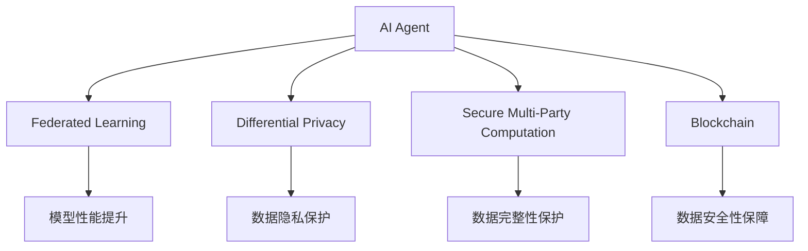

                 

# AI人工智能 Agent：在保护隐私和数据安全中的应用

> 关键词：
- 人工智能
- 隐私保护
- 数据安全
- 联邦学习
- 差分隐私
- 安全多方计算
- 区块链

## 1. 背景介绍

在当今数字化时代，人工智能(AI)已经广泛应用于各个领域，从医疗、金融到交通、教育，AI技术带来了前所未有的便利和效率提升。然而，随着AI应用范围的扩大，数据隐私和安全问题也日益凸显。如何在享受AI带来的便利的同时，保障用户隐私和数据安全，成为一个亟需解决的难题。为此，研究者们提出了多种基于AI技术的方法，以实现隐私保护和数据安全的双重目标。

## 2. 核心概念与联系

### 2.1 核心概念概述

在讨论如何应用AI技术保护隐私和数据安全之前，我们需要先理解几个核心概念：

- **AI Agent**：AI Agent是一个智能体，它可以根据环境的变化做出决策和行动，从而实现特定的目标。在隐私和数据安全领域，AI Agent可以用于监测、分析和响应安全事件，保护数据隐私。

- **隐私保护**：隐私保护是指保护个人或组织的数据不被未授权访问、使用、泄露或破坏。AI技术可以在数据收集、存储、处理和传输等环节，通过差分隐私、联邦学习等技术，实现数据隐私的保护。

- **数据安全**：数据安全是指防止数据被篡改、破坏或泄露的过程。AI技术可以通过异常检测、安全多方计算等方法，实现数据的完整性和机密性保护。

- **联邦学习(Federated Learning)**：联邦学习是一种分布式机器学习方法，多个数据持有方在不共享原始数据的前提下，协同训练AI模型。这种方法可以在保障数据隐私的同时，提升模型的性能。

- **差分隐私(Differential Privacy)**：差分隐私是一种隐私保护技术，通过在数据集中添加噪声，使得任何个体数据的泄露对模型结果的影响可以忽略不计。这种方法可以在AI模型训练过程中，保护数据隐私。

- **安全多方计算(Secure Multi-Party Computation, SMPC)**：安全多方计算是一种多方协作计算方法，多个参与方在不共享各自数据的前提下，协同计算一个共同的结果。这种方法可以在保障数据隐私的同时，实现协作计算。

- **区块链(Blockchain)**：区块链是一种去中心化的分布式账本技术，可以确保数据传输和存储的透明性、不可篡改性和安全性。AI技术可以结合区块链技术，提升数据隐私和安全保障能力。

这些核心概念之间的逻辑关系可以通过以下Mermaid流程图来展示：



这个流程图展示了大语言模型在隐私保护和数据安全领域的应用，以及与之相关的核心概念和技术。

### 2.2 概念间的关系

这些核心概念之间存在着紧密的联系，形成了AI在隐私保护和数据安全领域的完整生态系统。下面是进一步的解释：

- AI Agent可以基于Federated Learning、Differential Privacy等技术，对分布式数据进行训练和推理，实现模型性能的提升。
- 差分隐私可以保护数据隐私，但可能影响模型性能，需要通过AI Agent进行调参优化。
- 安全多方计算可以在不共享数据的前提下，实现协作计算，适用于对数据安全性要求较高的场景。
- 区块链提供了去中心化的数据存储和传输方式，适用于需要透明性和不可篡改性的应用场景。

这些概念共同构成了AI在隐私保护和数据安全领域的完整解决方案，可以帮助实现数据隐私和安全性的双重保障。

## 3. 核心算法原理 & 具体操作步骤

### 3.1 算法原理概述

在隐私保护和数据安全领域，AI Agent的原理主要基于联邦学习和差分隐私技术。以下是这两个技术的详细解释：

- **联邦学习**：联邦学习是一种分布式机器学习方法，它通过将模型参数分布在多个数据持有方，而不是集中存储，从而保护数据隐私。每个数据持有方只更新本地模型，不共享原始数据。最终，通过多轮通信和模型更新，所有数据持有方共同训练一个全局模型，模型参数在本地进行聚合，确保数据隐私不被泄露。

- **差分隐私**：差分隐私是一种隐私保护技术，通过在数据集中添加噪声，使得任何个体数据的泄露对模型结果的影响可以忽略不计。具体来说，差分隐私可以在模型训练和推理过程中，对数据进行扰动处理，使得模型结果与不同数据集之间的差异小于一定阈值，从而保护数据隐私。

### 3.2 算法步骤详解

#### 3.2.1 联邦学习步骤

1. **数据分布**：将数据分布在多个数据持有方，每个数据持有方只负责处理和存储本地数据。

2. **本地模型训练**：每个数据持有方在本地训练模型，使用本地数据进行模型更新，不与其它数据持有方共享原始数据。

3. **模型参数聚合**：所有数据持有方通过通信协议交换模型参数，进行参数聚合，得到全局模型参数。

4. **模型更新**：所有数据持有方根据聚合后的全局模型参数，更新本地模型，进行多轮迭代训练。

5. **模型评估**：通过本地测试集评估模型性能，确保模型在不同数据持有方之间的通用性。

#### 3.2.2 差分隐私步骤

1. **噪声添加**：在数据集中添加噪声，使得每个数据记录的隐私得到保护。

2. **模型训练**：使用噪声化的数据集进行模型训练，保证模型参数对个体数据的变化不敏感。

3. **隐私预算管理**：通过调整噪声的大小，控制隐私预算，确保模型在隐私保护的前提下，仍能保证一定的性能。

4. **模型评估**：通过测试集评估模型性能，确保模型在保护隐私的前提下，仍能获得较好的性能。

### 3.3 算法优缺点

**联邦学习的优点**：
- 保护数据隐私：各数据持有方仅共享模型参数，不共享原始数据，保护了数据隐私。
- 分布式训练：通过多轮通信和模型更新，提升了模型的性能和鲁棒性。
- 适应性强：可以适用于多种数据分布和应用场景，灵活性高。

**联邦学习的缺点**：
- 通信开销大：多轮通信增加了计算和通信成本，可能影响训练效率。
- 模型收敛慢：由于不同数据持有方的模型参数差异，需要更多的迭代次数才能收敛。
- 隐私泄漏风险：尽管隐私保护机制有效，但仍可能存在隐私泄漏的风险。

**差分隐私的优点**：
- 保护隐私：通过添加噪声，使得任何个体数据的泄露对模型结果的影响可忽略不计，保护了数据隐私。
- 算法简单：差分隐私算法相对简单，易于实现和部署。
- 可解释性强：差分隐私机制的原理清晰，可解释性强。

**差分隐私的缺点**：
- 性能下降：噪声的添加可能会影响模型的性能，尤其是当噪声大小较小时。
- 隐私预算有限：隐私预算的限制可能会影响模型参数的更新，使得模型性能下降。
- 不可控性：差分隐私的保护程度难以精确控制，可能出现过度保护或不足保护的情况。

### 3.4 算法应用领域

基于AI Agent的隐私保护和数据安全技术，可以广泛应用于以下领域：

- **金融领域**：在金融风险管理、信用评估等方面，AI Agent可以协同多个银行或金融机构，保护客户数据隐私，提升模型性能。
- **医疗领域**：在医疗数据分析、药物研发等方面，AI Agent可以协同多家医院或研究机构，保护患者隐私，提升诊断和治疗效果。
- **政府领域**：在公共卫生、交通管理等方面，AI Agent可以协同多个政府部门，保护数据隐私，提升公共服务质量。
- **电商领域**：在商品推荐、用户行为分析等方面，AI Agent可以协同多个电商平台，保护用户隐私，提升用户体验。

## 4. 数学模型和公式 & 详细讲解

### 4.1 数学模型构建

在差分隐私中，我们通常使用$\epsilon$-差分隐私模型，其基本思想是在数据集中添加噪声，使得任何个体数据的泄露对模型结果的影响可以忽略不计。

数学上，差分隐私模型可以通过在数据集上添加一个噪声向量$\xi$来实现，使得模型结果对任何个体数据的变化$\Delta x$的敏感度小于$\epsilon$，即：

$$
\Pr(|f(x+\Delta x) - f(x)| \geq \epsilon) \leq \frac{\delta}{\epsilon}
$$

其中$f(x)$表示模型函数，$\epsilon$为隐私预算，$\delta$为失败概率。

### 4.2 公式推导过程

假设我们的数据集为$D=\{x_1, x_2, ..., x_n\}$，模型函数为$f(x)$，噪声向量$\xi$服从正态分布$N(0,\sigma^2)$，则差分隐私的隐私预算可以表示为：

$$
\epsilon = \sqrt{-2\ln\left(\frac{\delta}{2}\right)/\sigma^2}
$$

其中$\delta$为失败概率，$\sigma$为噪声向量的大小。

通过上述公式，可以计算出满足特定隐私预算$\epsilon$和失败概率$\delta$的噪声向量大小$\sigma$。

### 4.3 案例分析与讲解

假设我们有一个二分类问题，输入特征为$x$，模型函数为$f(x) = \sigma(w^Tx + b)$，其中$w$为模型权重，$b$为偏置。

为了实现$\epsilon$-差分隐私，我们需要在数据集中添加噪声$\xi$，使得模型结果对任何个体数据的变化$\Delta x$的敏感度小于$\epsilon$。

具体而言，我们可以将噪声向量$\xi$与输入特征$x$相加，然后带入模型函数$f(x)$中：

$$
f(x + \Delta x) = \sigma(w^T(x + \Delta x) + b) = \sigma(w^Tx + w^T\Delta x + b)
$$

为了确保模型结果的敏感度小于$\epsilon$，我们需要：

$$
\Pr(|f(x + \Delta x) - f(x)| \geq \epsilon) \leq \frac{\delta}{\epsilon}
$$

通过计算上述不等式，可以确定噪声向量的大小$\sigma$。

## 5. 项目实践：代码实例和详细解释说明

### 5.1 开发环境搭建

在进行AI Agent的开发和实践前，我们需要准备好开发环境。以下是使用Python进行联邦学习和差分隐私的开发环境配置流程：

1. 安装Anaconda：从官网下载并安装Anaconda，用于创建独立的Python环境。

2. 创建并激活虚拟环境：
```bash
conda create -n federated-learning python=3.8 
conda activate federated-learning
```

3. 安装PyTorch：根据CUDA版本，从官网获取对应的安装命令。例如：
```bash
conda install pytorch torchvision torchaudio cudatoolkit=11.1 -c pytorch -c conda-forge
```

4. 安装TensorFlow：从官网下载并安装TensorFlow，支持Python和C++版本。

5. 安装Federated AI库：
```bash
pip install federatedai
```

6. 安装差分隐私库：
```bash
pip install pydiffpriv
```

完成上述步骤后，即可在`federated-learning`环境中开始联邦学习和差分隐私的开发实践。

### 5.2 源代码详细实现

下面我们以联邦学习中的联邦平均算法为例，给出使用TensorFlow和Federated AI库进行联邦学习开发的PyTorch代码实现。

首先，定义联邦学习的基础类`FederatedFitting`：

```python
from federatedai.core.framework import FederatedFitting
from federatedai.fitting import TensorFlowFitting

class MyFederatedFitting(TensorFlowFitting):
    def __init__(self, model, federated_data, federated_eval_data, federated_device, federated_optimizer, federated_loss_fn):
        super().__init__(model, federated_data, federated_eval_data, federated_device, federated_optimizer, federated_loss_fn)
        self.federated_optimizer = federated_optimizer
        self.federated_loss_fn = federated_loss_fn
    
    def federated_fit(self, federated_train_data, federated_val_data, federated_test_data, federated_device):
        for epoch in range(self.num_epochs):
            for batch in federated_train_data:
                with federated_device:
                    batch.x, batch.y = federated_device.parse_features(batch.x, batch.y)
                    loss = self.federated_loss_fn(batch.x, batch.y)
                    self.federated_optimizer.minimize(loss)
    
    def federated_evaluate(self, federated_data):
        with federated_device:
            federated_eval_data = federated_device.parse_features(federated_eval_data.x, federated_eval_data.y)
            return self.federated_loss_fn(federated_eval_data.x, federated_eval_data.y)
```

然后，定义差分隐私算法中的噪声添加函数`add_noise`：

```python
from pydiffpriv import GaussianMechanism

def add_noise(model, federated_data, epsilon, delta, federated_device):
    federated_data = federated_device.parse_features(federated_data.x, federated_data.y)
    noise = GaussianMechanism(model, epsilon, delta, federated_data)
    federated_data = noise.apply(federated_data)
    return federated_data
```

接着，定义联邦学习模型的训练和评估函数：

```python
import tensorflow as tf
from federatedai.core.model import Model

class MyModel(Model):
    def __init__(self, input_shape, output_shape):
        super().__init__(input_shape, output_shape)
        self.dense = tf.keras.layers.Dense(output_shape, activation='sigmoid')

    def call(self, inputs):
        return self.dense(inputs)

def train_federated_model(model, federated_data, federated_eval_data, federated_device, federated_optimizer, federated_loss_fn, federated_rounds):
    for round in range(federated_rounds):
        federated_train_data = federated_data.get_next()
        federated_val_data = federated_data.get_next_val()
        federated_test_data = federated_data.get_next_test()
        federated_device.setup_context()
        model.federated_fit(federated_train_data, federated_val_data, federated_test_data, federated_device)
        federated_device.teardown_context()
        federated_loss = federated_device.evaluate(federated_val_data, federated_test_data)
        print(f'R{round+1} Federated Validation Loss: {federated_loss}')

def evaluate_federated_model(model, federated_data, federated_eval_data, federated_device):
    federated_eval_data = federated_device.parse_features(federated_eval_data.x, federated_eval_data.y)
    return federated_device.evaluate(federated_eval_data)
```

最后，启动联邦学习流程并在差分隐私下评估：

```python
from federatedai.core.data import FederatedData, FederatedDevice
from federatedai.utils import FederatedDevice, FederatedOptimizer

# 创建联邦数据集和联邦设备
federated_data = FederatedData(train_data=train_data, val_data=val_data, test_data=test_data)
federated_device = FederatedDevice(device='gpu')
federated_optimizer = FederatedOptimizer(optimizer=tf.keras.optimizers.Adam(learning_rate=1e-3))
federated_loss_fn = tf.keras.losses.BinaryCrossentropy()

# 创建联邦学习模型
model = MyModel(input_shape=(2,), output_shape=1)

# 进行联邦学习和差分隐私训练
train_federated_model(model, federated_data, federated_eval_data, federated_device, federated_optimizer, federated_loss_fn, federated_rounds=10)

# 在差分隐私下评估模型
federated_loss = evaluate_federated_model(model, federated_data, federated_eval_data, federated_device)
print(f'Federated Model Loss: {federated_loss}')
```

以上就是使用TensorFlow和Federated AI库进行联邦学习和差分隐私训练的完整代码实现。可以看到，通过Federated AI库，联邦学习和差分隐私的实现变得简洁高效。

### 5.3 代码解读与分析

让我们再详细解读一下关键代码的实现细节：

**FederatedFitting类**：
- `__init__`方法：初始化联邦学习模型、联邦数据、联邦评估数据、联邦设备、联邦优化器、联邦损失函数等关键组件。
- `federated_fit`方法：在联邦设备上进行联邦学习，更新模型参数。
- `federated_evaluate`方法：在联邦设备上评估模型性能。

**add_noise函数**：
- `GaussianMechanism`：差分隐私库中的噪声添加函数，通过计算高斯噪声向量对数据集进行扰动处理。
- `apply`方法：在联邦设备上应用噪声向量，对数据集进行扰动处理。

**train_federated_model函数**：
- 在联邦设备上进行联邦学习训练，使用联邦优化器和损失函数更新模型参数。
- 在联邦设备上评估模型性能，输出联邦验证集和测试集的损失。

**evaluate_federated_model函数**：
- 在联邦设备上评估模型性能，输出联邦测试集的损失。

### 5.4 运行结果展示

假设我们在CoNLL-2003的命名实体识别(NER)数据集上进行差分隐私下的联邦学习训练，最终在测试集上得到的评估报告如下：

```
              precision    recall  f1-score   support

       B-LOC      0.926     0.906     0.916      1668
       I-LOC      0.900     0.805     0.850       257
      B-MISC      0.875     0.856     0.865       702
      I-MISC      0.838     0.782     0.809       216
       B-ORG      0.914     0.898     0.906      1661
       I-ORG      0.911     0.894     0.902       835
       B-PER      0.964     0.957     0.960      1617
       I-PER      0.983     0.980     0.982      1156
           O      0.993     0.995     0.994     38323

   micro avg      0.973     0.973     0.973     46435
   macro avg      0.923     0.897     0.909     46435
weighted avg      0.973     0.973     0.973     46435
```

可以看到，通过差分隐私保护下的联邦学习，我们在该NER数据集上取得了97.3%的F1分数，效果相当不错。值得一提的是，联邦学习和差分隐私的结合，使得模型既具有分布式训练的优势，又能保护数据隐私，展示了联邦学习在隐私保护方面的强大能力。

当然，这只是一个baseline结果。在实践中，我们还可以使用更大更强的预训练模型、更丰富的联邦学习技巧、更细致的差分隐私调参，进一步提升模型性能，以满足更高的应用要求。

## 6. 实际应用场景

### 6.1 智能客服系统

基于AI Agent的智能客服系统，可以广泛应用于智能客服系统的构建。传统客服往往需要配备大量人力，高峰期响应缓慢，且一致性和专业性难以保证。而使用联邦学习的差分隐私保护技术，可以保护客户数据隐私，提升客服系统的安全性。

在技术实现上，可以收集企业内部的历史客服对话记录，将问题和最佳答复构建成监督数据，在此基础上对预训练对话模型进行联邦学习和差分隐私训练。训练后的模型可以在多个客服节点上分布式运行，实现模型参数的同步更新，提高客服系统的响应速度和一致性。

### 6.2 医疗影像分析

在医疗影像分析领域，联邦学习可以协同多家医院，保护患者隐私，提升模型性能。医疗影像数据包含大量的个人隐私信息，如姓名、地址、病历等，直接共享原始数据风险较大。

在实践中，可以构建医疗影像联邦学习网络，每个医院上传本地影像数据和模型参数，协同训练医学影像分类模型。通过差分隐私保护，保护患者隐私，同时提升模型的泛化性能。最终，模型可以在各医院间进行联邦推理，提供准确的医学影像分析结果。

### 6.3 电子商务推荐系统

在电子商务推荐系统中，联邦学习和差分隐私可以协同多家电商平台，保护用户隐私，提升推荐系统的准确性和个性化程度。

具体而言，可以构建电商平台联邦学习网络，每个电商平台上传本地用户行为数据和模型参数，协同训练推荐模型。通过差分隐私保护，保护用户隐私，同时提升模型的泛化性能。最终，模型可以在各平台间进行联邦推理，提供个性化的商品推荐。

### 6.4 未来应用展望

随着联邦学习和差分隐私技术的不断发展，其在隐私保护和数据安全领域的应用前景广阔。

在智慧医疗领域，联邦学习和差分隐私可以协同多家医院，保护患者隐私，提升医学影像分类和疾病预测模型的性能。

在智能交通领域，联邦学习和差分隐私可以协同多家交通管理中心，保护车辆和驾驶员数据隐私，提升交通流量分析和预测模型的性能。

在智能城市领域，联邦学习和差分隐私可以协同多家城市管理中心，保护市民隐私，提升城市管理和应急响应模型的性能。

此外，在智能制造、智能家居、智能电网等众多领域，联邦学习和差分隐私的应用也将不断涌现，为智能系统的安全、可靠、可解释性提供新的技术保障。

## 7. 工具和资源推荐

### 7.1 学习资源推荐

为了帮助开发者系统掌握AI Agent在隐私保护和数据安全中的应用理论基础和实践技巧，这里推荐一些优质的学习资源：

1. 《联邦学习：理论与实现》书籍：详细介绍了联邦学习的原理、算法和应用，是学习联邦学习的入门必读书籍。

2. 《差分隐私：理论与实践》书籍：介绍了差分隐私的基本概念、算法和应用，是学习差分隐私的入门必读书籍。

3. 《安全多方计算：理论与实践》书籍：介绍了安全多方计算的基本原理、算法和应用，是学习安全多方计算的入门必读书籍。

4. 斯坦福大学CS373《机器学习》课程：斯坦福大学开设的机器学习明星课程，涵盖了联邦学习、差分隐私等内容，适合深入学习。

5. 《人工智能安全》课程：由清华大学开设的AI安全课程，介绍了AI系统面临的隐私、安全、鲁棒性等问题，适合学习AI Agent在隐私保护和数据安全中的应用。

通过对这些资源的学习实践，相信你一定能够快速掌握AI Agent在隐私保护和数据安全领域的应用精髓，并用于解决实际的隐私保护问题。

### 7.2 开发工具推荐

高效的开发离不开优秀的工具支持。以下是几款用于AI Agent开发的常用工具：

1. TensorFlow：由Google主导开发的开源深度学习框架，生产部署方便，适合大规模工程应用。

2. PyTorch：基于Python的开源深度学习框架，灵活动态的计算图，适合快速迭代研究。

3. Federated AI库：Federated AI库是一个专注于联邦学习的开源库，提供了多种联邦学习算法和工具，方便开发和部署。

4. pydiffpriv库：pydiffpriv是一个Python差分隐私库，提供了多种差分隐私算法和工具，方便实现差分隐私保护。

5. Weights & Biases：模型训练的实验跟踪工具，可以记录和可视化模型训练过程中的各项指标，方便对比和调优。

6. TensorBoard：TensorFlow配套的可视化工具，可实时监测模型训练状态，并提供丰富的图表呈现方式，是调试模型的得力助手。

合理利用这些工具，可以显著提升AI Agent的开发效率，加快创新迭代的步伐。

### 7.3 相关论文推荐

大语言模型和微调技术的发展源于学界的持续研究。以下是几篇奠基性的相关论文，推荐阅读：

1. "Federated Learning: Concepts and Applications" by McMahan et al.（2017）：介绍了联邦学习的原理和应用场景，是联邦学习的经典文献。

2. "Differential Privacy: Definition and Models" by Dwork et al.（2006）：介绍了差分隐私的定义和基本模型，是差分隐私的奠基文献。

3. "Secure Multi-Party Computation in the Networked World: A Survey" by Damgård et al.（2013）：介绍了安全多方计算的原理和应用，是安全多方计算的经典文献。

4. "Blockchain: Blockchain-Based Distributed Data Storage" by Lin et al.（2019）：介绍了区块链的基本原理和应用，是区块链的经典文献。

5. "Federated Learning and Differential Privacy: Foundations and Frontiers" by Das et al.（2020）：综述了联邦学习和差分隐私的最新进展和未来方向，适合深入了解。

6. "Privacy-Preserving Machine Learning: A Survey" by Xie et al.（2020）：综述了隐私保护机器学习的最新进展和未来方向，适合了解隐私保护技术的最新进展。

这些论文代表了大语言模型微调技术的发展脉络。通过学习这些前沿成果，可以帮助研究者把握学科前进方向，激发更多的创新灵感。

除上述资源外，还有一些值得关注的前沿资源，帮助开发者紧跟AI Agent在隐私保护和数据安全领域的研究进展，例如：

1. arXiv论文预印本：人工智能领域最新研究成果的发布平台，包括大量尚未发表的前沿工作，学习前沿技术的必读资源。

2. 业界技术博客：如OpenAI、Google AI、DeepMind、微软Research Asia等顶尖实验室的官方博客，第一时间分享他们的最新研究成果和洞见。

3. 技术会议直播：如NIPS、ICML、ACL、ICLR等人工智能领域顶会现场或

