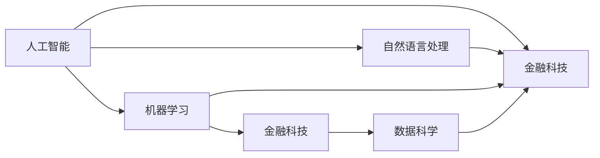

                 

# AI创业的风险与机遇：Lepton AI的案例分析

> 关键词：AI创业，Lepton AI，风险，机遇，案例分析

## 1. 背景介绍

### 1.1 行业背景

人工智能（AI）正迅速改变各个行业，从金融到医疗，从制造到教育。AI技术为企业提供了以前难以想象的效率和洞察力，但同时，它也带来了新的挑战和风险。近年来，随着AI技术的成熟和普及，越来越多的创业公司涌现，试图在AI领域寻找机遇。

Lepton AI是一家新兴的AI创业公司，致力于通过人工智能技术提升金融领域的服务质量。本文将通过Lepton AI的案例分析，探讨AI创业在技术、市场、商业化等方面的风险与机遇。

### 1.2 公司背景

Lepton AI成立于2022年，总部位于硅谷。公司创始团队包括多位来自顶尖高校和研究机构的人工智能专家，他们的研究方向涉及机器学习、深度学习、自然语言处理等领域。Lepton AI的主要目标是利用AI技术帮助金融机构提升客户服务水平，降低运营成本，提高市场竞争力。

## 2. 核心概念与联系

### 2.1 核心概念概述

为了更好地理解Lepton AI的业务，我们将介绍几个核心的概念：

- **人工智能（AI）**：AI是指通过计算机模拟人类智能行为的技术，包括机器学习、自然语言处理、计算机视觉等。AI技术能够从大量数据中学习模式，从而提供智能决策和自动化服务。

- **金融科技（FinTech）**：金融科技是指将AI、大数据、区块链等技术应用于金融领域，提升金融服务的效率和质量。金融科技不仅改变了金融服务的提供方式，也改变了金融市场的运作方式。

- **自然语言处理（NLP）**：NLP是指计算机处理和理解人类语言的技术。在金融领域，NLP可以用于自动生成报告、客户服务、情感分析等。

- **机器学习（ML）**：ML是指计算机通过数据学习预测未来行为的技术。在金融领域，ML可以用于风险管理、信用评估、个性化推荐等。

- **数据科学（Data Science）**：数据科学是指通过数据挖掘和统计分析获取知识的技术。在金融领域，数据科学可以用于市场分析、欺诈检测、客户细分等。

这些核心概念构成了Lepton AI业务的基石，通过这些技术的结合，Lepton AI能够为客户提供高效的金融服务。

### 2.2 概念间的关系

这些概念之间的联系可以通过以下Mermaid流程图来展示：



这个流程图展示了AI技术在金融科技中的应用场景，从自然语言处理、机器学习到数据科学，都是实现金融科技的重要技术手段。通过这些技术的结合，Lepton AI能够提供更智能、更高效的金融服务。

## 3. 核心算法原理 & 具体操作步骤

### 3.1 算法原理概述

Lepton AI的核心算法基于自然语言处理和机器学习，具体如下：

- **自然语言处理（NLP）**：Lepton AI利用NLP技术，从客户咨询中提取关键信息，并生成自动化的回复。通过分析客户的语言模式，Lepton AI能够识别出客户的真实需求，从而提供更准确的服务。

- **机器学习（ML）**：Lepton AI使用机器学习算法，对客户的交易数据进行预测和分析。通过分析客户的交易行为和历史数据，Lepton AI能够预测客户的未来需求，并提供个性化的推荐服务。

### 3.2 算法步骤详解

Lepton AI的算法步骤分为以下几个阶段：

1. **数据收集**：Lepton AI从各种渠道收集客户的数据，包括交易记录、聊天记录、社交媒体等。

2. **数据预处理**：Lepton AI对收集到的数据进行清洗、去重和标注，以便于后续的分析和建模。

3. **模型训练**：Lepton AI使用NLP和ML算法，训练多个模型，包括文本分类、情感分析、客户画像生成等。

4. **模型集成**：Lepton AI将多个模型进行集成，形成综合的AI服务系统。

5. **模型部署**：Lepton AI将训练好的模型部署到生产环境中，为客户提供服务。

### 3.3 算法优缺点

Lepton AI的算法优点包括：

- **高效性**：Lepton AI的算法能够高效处理大量的数据，快速响应用户需求。

- **准确性**：Lepton AI的算法基于机器学习和自然语言处理技术，能够提供准确的客户服务和推荐。

- **可扩展性**：Lepton AI的算法可以在不同的金融场景中应用，具有较强的可扩展性。

Lepton AI的算法缺点包括：

- **数据依赖**：Lepton AI的算法依赖于高质量的数据，如果数据质量不高，会影响算法的性能。

- **技术门槛**：Lepton AI的算法需要专业的AI工程师进行开发和维护，技术门槛较高。

### 3.4 算法应用领域

Lepton AI的算法主要应用于以下几个领域：

- **客户服务**：通过自然语言处理技术，Lepton AI能够自动回答客户的问题，提高客户满意度。

- **风险管理**：通过机器学习算法，Lepton AI能够分析客户的交易数据，预测风险。

- **个性化推荐**：通过机器学习算法，Lepton AI能够根据客户的行为和偏好，提供个性化的金融产品和服务。

## 4. 数学模型和公式 & 详细讲解

### 4.1 数学模型构建

Lepton AI的算法基于机器学习和自然语言处理技术，数学模型主要包括以下几个部分：

- **文本分类**：将客户的问题归类到不同的类别中，如账户查询、交易问题、投诉等。

- **情感分析**：分析客户咨询的情感倾向，如正面、负面、中性等。

- **客户画像生成**：根据客户的交易记录和行为数据，生成客户的画像，以便于个性化服务。

### 4.2 公式推导过程

- **文本分类模型**：

  假设文本集合为 $T=\{t_1,t_2,\cdots,t_n\}$，类别集合为 $C=\{c_1,c_2,\cdots,c_k\}$，文本 $t_i$ 属于类别 $c_j$ 的概率为 $P(c_j|t_i)$。文本分类模型的目标是最小化损失函数：

  $$
  L = \frac{1}{N}\sum_{i=1}^N -\log P(c_{y_i}|t_i)
  $$

  其中 $y_i$ 为文本 $t_i$ 的真实类别。

- **情感分析模型**：

  假设情感标签为 $y\in\{1,-1\}$，表示正面和负面情感。情感分析模型的目标是最小化损失函数：

  $$
  L = \frac{1}{N}\sum_{i=1}^N L_{t_i}(y_i,\hat{y_i})
  $$

  其中 $L_{t_i}(y_i,\hat{y_i})$ 为情感分类损失函数，$\hat{y_i}$ 为模型预测的情感标签。

- **客户画像生成模型**：

  假设客户特征为 $x_i=\{x_{i1},x_{i2},\cdots,x_{im}\}$，客户画像为 $z_i=\{z_{i1},z_{i2},\cdots,z_{in}\}$。客户画像生成模型的目标是最小化损失函数：

  $$
  L = \frac{1}{N}\sum_{i=1}^N \frac{1}{2}\|z_i-f(x_i)\|_2^2
  $$

  其中 $f(x_i)$ 为特征到画像的映射函数。

### 4.3 案例分析与讲解

Lepton AI在实际应用中，通过文本分类和情感分析模型，能够快速响应用户的咨询，并提供情感反馈。例如，当客户咨询账户余额时，Lepton AI能够快速回答并提供相关的交易记录。通过客户画像生成模型，Lepton AI能够分析客户的交易习惯和偏好，从而提供个性化的金融产品和服务。

## 5. 项目实践：代码实例和详细解释说明

### 5.1 开发环境搭建

Lepton AI的开发环境主要包括：

- **Python 3**：作为主要开发语言，Python 3具有丰富的第三方库和工具支持。

- **PyTorch**：一个流行的深度学习框架，适合构建复杂的NLP模型。

- **TensorFlow**：另一个流行的深度学习框架，适合构建分布式NLP模型。

- **Jupyter Notebook**：一个交互式开发环境，适合快速迭代和实验。

- **Google Cloud Platform**：用于部署和扩展NLP模型。

### 5.2 源代码详细实现

以下是一个简单的文本分类模型的代码实现：

```python
import torch
import torch.nn as nn
import torch.optim as optim

# 定义模型
class TextClassifier(nn.Module):
    def __init__(self, vocab_size, embedding_dim, hidden_dim, output_size):
        super(TextClassifier, self).__init__()
        self.embedding = nn.Embedding(vocab_size, embedding_dim)
        self.fc1 = nn.Linear(embedding_dim, hidden_dim)
        self.fc2 = nn.Linear(hidden_dim, output_size)
        self.dropout = nn.Dropout(0.5)
        
    def forward(self, x):
        x = self.embedding(x)
        x = self.dropout(x)
        x = nn.functional.relu(self.fc1(x))
        x = self.fc2(x)
        return x

# 定义损失函数和优化器
def train_model(model, optimizer, criterion, train_loader, device, num_epochs):
    model.train()
    for epoch in range(num_epochs):
        for batch in train_loader:
            x, y = batch[0].to(device), batch[1].to(device)
            optimizer.zero_grad()
            y_hat = model(x)
            loss = criterion(y_hat, y)
            loss.backward()
            optimizer.step()
```

### 5.3 代码解读与分析

- **文本分类模型**：使用PyTorch框架，定义了文本分类模型的结构和训练过程。模型包括嵌入层、全连接层和输出层，使用dropout层避免过拟合。

- **损失函数和优化器**：使用交叉熵损失函数和Adam优化器，对模型进行训练。

- **训练过程**：通过循环遍历训练集，每次前向传播计算预测结果和损失，反向传播计算梯度并更新模型参数。

### 5.4 运行结果展示

在训练完成后，Lepton AI可以在生产环境中部署模型，并实时响应用户请求。通过在线监控，Lepton AI能够实时收集模型的性能指标，并进行调整和优化。

## 6. 实际应用场景

### 6.1 客户服务

Lepton AI通过NLP技术，能够自动回答客户咨询，并提供情感反馈。例如，当客户咨询账户余额时，Lepton AI能够快速回答并提供相关的交易记录。通过分析客户的语言模式，Lepton AI能够识别出客户的真实需求，从而提供更准确的服务。

### 6.2 风险管理

Lepton AI通过机器学习算法，能够分析客户的交易数据，预测风险。例如，通过分析客户的交易记录和行为数据，Lepton AI能够预测客户的违约风险，并提供相应的风险管理措施。

### 6.3 个性化推荐

Lepton AI通过机器学习算法，能够根据客户的行为和偏好，提供个性化的金融产品和服务。例如，通过分析客户的交易记录和行为数据，Lepton AI能够预测客户的未来需求，并提供个性化的金融产品推荐。

## 7. 工具和资源推荐

### 7.1 学习资源推荐

- **《Python深度学习》**：本书由深度的深度学习专家Francois Chollet撰写，介绍了深度学习的原理和实践，适合初学者和进阶者阅读。

- **《机器学习实战》**：本书由Peter Harrington撰写，介绍了机器学习的基本概念和算法，适合初学者学习。

- **《自然语言处理综论》**：本书由Daniel Jurafsky和James H. Martin撰写，介绍了自然语言处理的基础知识和最新技术，适合进阶者学习。

### 7.2 开发工具推荐

- **PyTorch**：一个流行的深度学习框架，适合构建复杂的NLP模型。

- **TensorFlow**：另一个流行的深度学习框架，适合构建分布式NLP模型。

- **Jupyter Notebook**：一个交互式开发环境，适合快速迭代和实验。

- **Google Cloud Platform**：用于部署和扩展NLP模型。

### 7.3 相关论文推荐

- **《深度学习》**：Ian Goodfellow、Yoshua Bengio和Aaron Courville合著的经典教材，介绍了深度学习的原理和应用。

- **《自然语言处理综述》**：Ye-Yi Chiu和Hangbo Bao合著的综述论文，介绍了自然语言处理的最新进展和技术。

- **《机器学习》**：Tom Mitchell撰写的经典教材，介绍了机器学习的基础概念和算法。

## 8. 总结：未来发展趋势与挑战

### 8.1 研究成果总结

Lepton AI通过自然语言处理和机器学习技术，提升了金融领域的服务质量。通过文本分类和情感分析，Lepton AI能够快速响应用户咨询，并通过客户画像生成提供个性化服务。

### 8.2 未来发展趋势

未来，Lepton AI将在以下几个方面进行扩展：

- **数据增强**：通过引入更多样化的数据，提升模型的泛化能力。

- **多模态融合**：将NLP与计算机视觉、语音识别等技术结合，提升模型的综合能力。

- **实时计算**：通过实时数据处理，提升模型的响应速度和效率。

- **联邦学习**：通过联邦学习技术，保护用户隐私，提升模型的安全性。

### 8.3 面临的挑战

Lepton AI面临的挑战包括：

- **数据隐私**：如何保护用户隐私，避免数据泄露。

- **模型泛化**：如何提升模型的泛化能力，避免过拟合。

- **资源消耗**：如何在资源有限的情况下，提升模型的性能。

### 8.4 研究展望

未来，Lepton AI将在以下几个方面进行研究：

- **模型解释性**：通过模型解释技术，提升模型的可解释性，增强用户信任。

- **模型优化**：通过模型优化技术，提升模型的性能和效率。

- **跨领域应用**：将Lepton AI的技术应用于更多领域，提升模型的应用价值。

## 9. 附录：常见问题与解答

### 9.1 常见问题

**Q1: Lepton AI的核心算法是什么？**

A: Lepton AI的核心算法包括自然语言处理和机器学习技术。通过NLP技术，Lepton AI能够自动分析客户的咨询，提供情感反馈。通过机器学习算法，Lepton AI能够分析客户的交易数据，预测风险。

**Q2: Lepton AI的技术难点是什么？**

A: Lepton AI的技术难点包括数据隐私、模型泛化和资源消耗。如何保护用户隐私，避免数据泄露，是Lepton AI面临的主要挑战。

**Q3: Lepton AI的应用场景有哪些？**

A: Lepton AI主要应用于客户服务、风险管理和个性化推荐等金融领域。通过NLP和机器学习技术，Lepton AI能够提升金融领域的服务质量和效率。

**Q4: Lepton AI的未来展望是什么？**

A: Lepton AI的未来展望包括数据增强、多模态融合、实时计算和联邦学习。通过引入更多样化的数据和跨领域的融合技术，Lepton AI有望在更多的应用场景中取得成功。

### 9.2 解答

**A1: Lepton AI的核心算法包括自然语言处理和机器学习技术。通过NLP技术，Lepton AI能够自动分析客户的咨询，提供情感反馈。通过机器学习算法，Lepton AI能够分析客户的交易数据，预测风险。**

**A2: Lepton AI的技术难点包括数据隐私、模型泛化和资源消耗。如何保护用户隐私，避免数据泄露，是Lepton AI面临的主要挑战。**

**A3: Lepton AI主要应用于客户服务、风险管理和个性化推荐等金融领域。通过NLP和机器学习技术，Lepton AI能够提升金融领域的服务质量和效率。**

**A4: Lepton AI的未来展望包括数据增强、多模态融合、实时计算和联邦学习。通过引入更多样化的数据和跨领域的融合技术，Lepton AI有望在更多的应用场景中取得成功。**

---

作者：禅与计算机程序设计艺术 / Zen and the Art of Computer Programming

