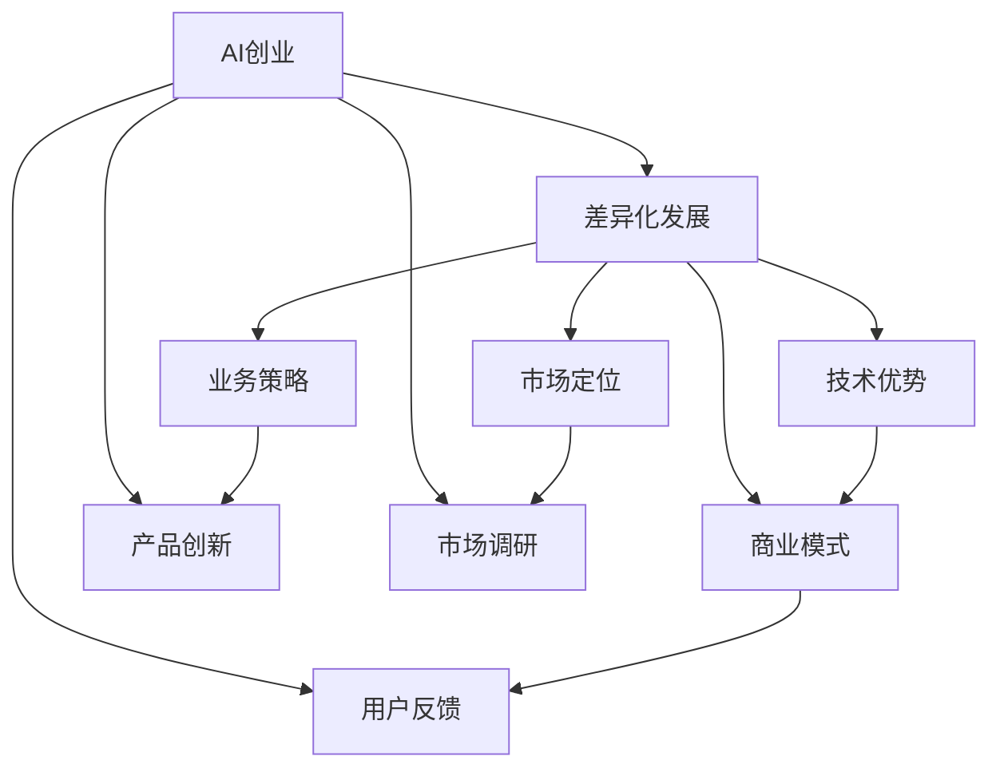
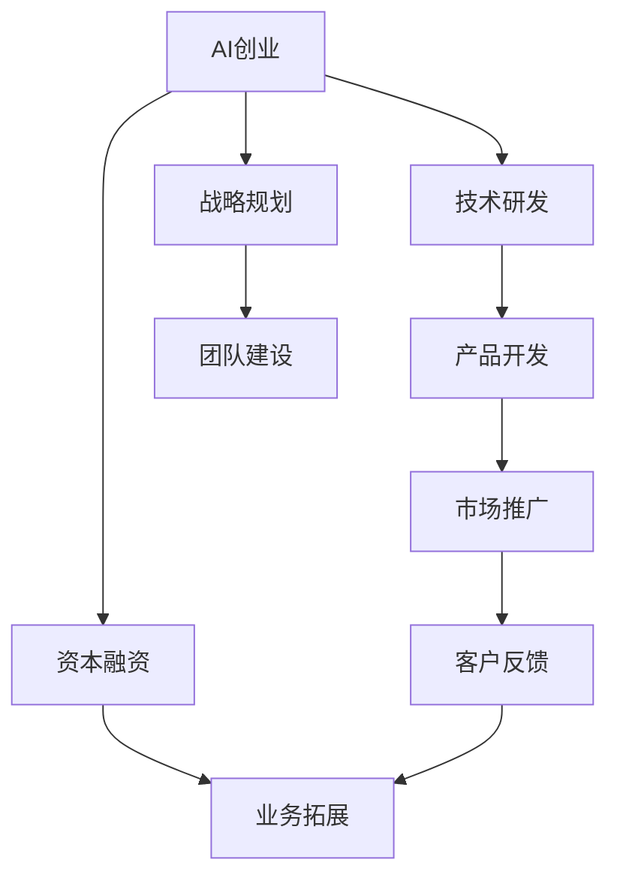
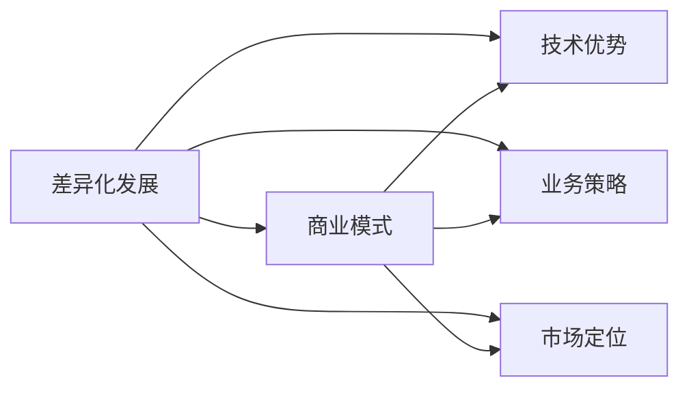
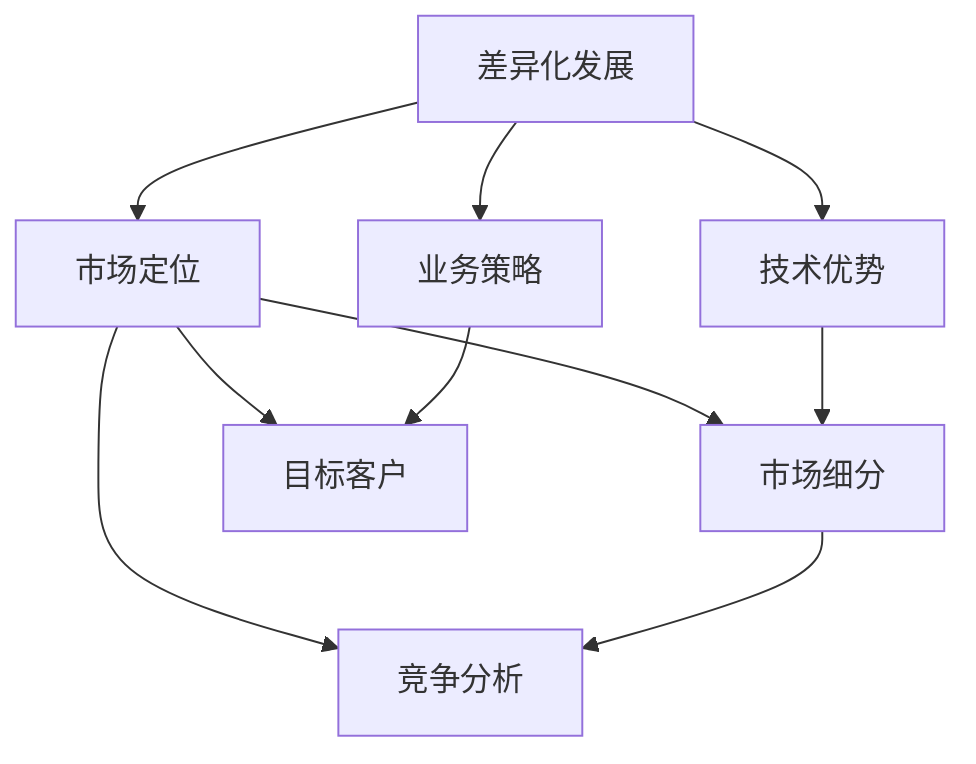
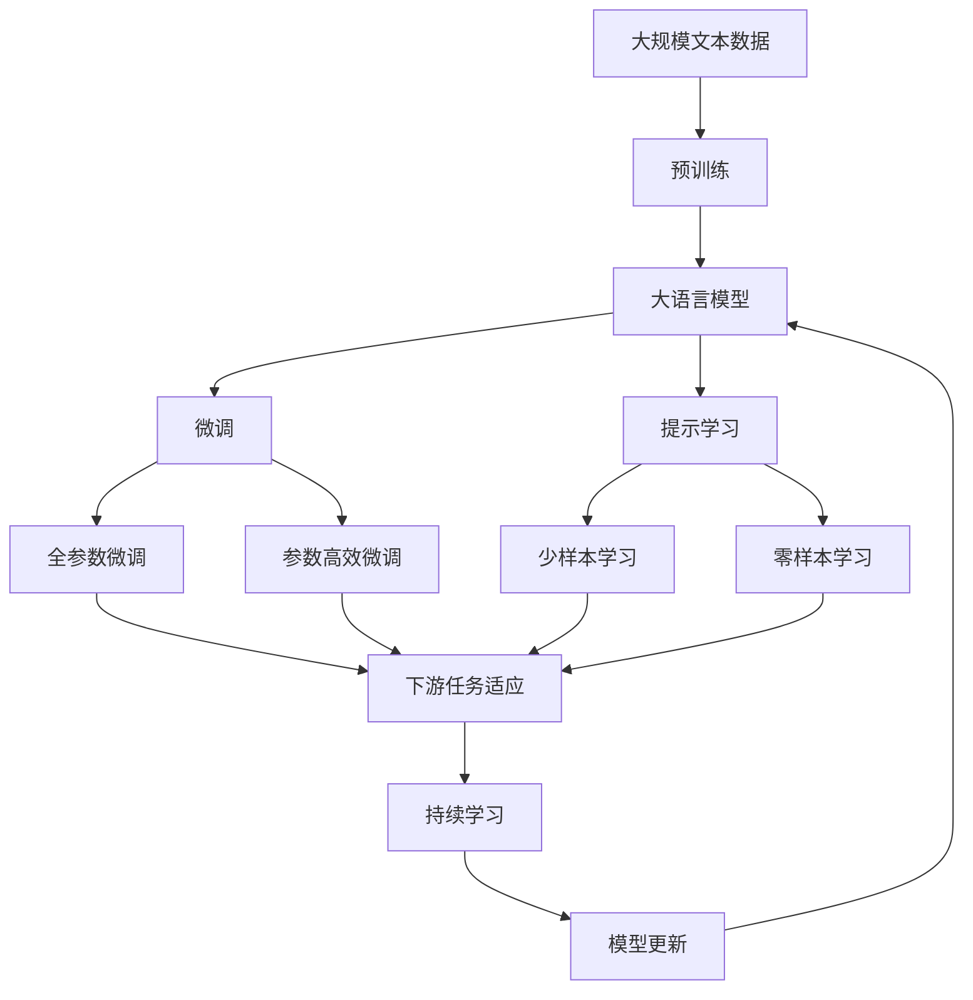

                 

# AI创业竞争加剧，差异化发展成制胜法宝

> 关键词：AI创业, 竞争加剧, 差异化发展, 制胜法宝, 技术优势, 业务策略, 市场定位, 商业模式

## 1. 背景介绍

### 1.1 问题由来
近年来，人工智能(AI)领域蓬勃发展，众多AI创业公司不断涌现，市场竞争日益激烈。在这一背景下，AI创业企业需要寻找自身的差异化竞争优势，以实现快速增长和市场领先。然而，随着AI技术的不断普及，各类创业项目同质化严重，如何形成独特的技术优势和业务策略，成为AI创业成功的关键。

### 1.2 问题核心关键点
差异化发展的核心在于发现并利用自身技术的独特性，从而在竞争中脱颖而出。具体来说，以下几个关键点值得关注：
- **技术优势**：通过技术创新，形成独有的算法或模型。
- **业务策略**：针对特定市场或行业，设计定制化的解决方案。
- **市场定位**：清晰定义目标客户群体和市场细分领域。
- **商业模式**：选择合适的盈利模式，如订阅服务、SaaS、硬件产品等。

差异化发展可以帮助企业构建独特的品牌形象，吸引目标客户，提升市场竞争力。以下我们将详细探讨差异化发展的策略和实践。

## 2. 核心概念与联系

### 2.1 核心概念概述

为更好地理解差异化发展的核心概念，本节将介绍几个密切相关的核心概念：

- **AI创业**：指使用AI技术进行产品开发和市场运作的创业模式。其目标是利用AI技术解决特定行业或场景的问题，提升用户体验和运营效率。
- **差异化发展**：指在竞争激烈的市场环境中，通过技术创新、业务模式创新等方式，形成独特的市场定位和竞争优势，从而在竞争中取得优势。
- **技术优势**：指在某个技术领域具有独特的研发实力和专利技术，能够提供领先于竞争对手的产品和服务。
- **业务策略**：指针对特定市场或客户需求，设计独特的业务流程和解决方案，实现差异化的价值输出。
- **市场定位**：指明确企业的目标客户群体，划分市场细分领域，制定有针对性的营销策略。
- **商业模式**：指企业实现盈利和价值创造的方式，如订阅服务、SaaS、硬件产品等。

这些核心概念之间的逻辑关系可以通过以下Mermaid流程图来展示：



这个流程图展示了大语言模型微调过程中各个概念之间的关系：

1. AI创业是起点，通过产品创新、市场调研和用户反馈，形成差异化发展的基础。
2. 差异化发展包括技术优势、业务策略、市场定位和商业模式等多个维度，共同构成企业竞争的核心。
3. 技术优势和业务策略是差异化发展的核心推动力。
4. 市场定位和商业模式需要基于差异化发展的方向进行设计。

通过理解这些核心概念，我们可以更好地把握AI创业的独特优势和战略方向。

### 2.2 概念间的关系

这些核心概念之间存在着紧密的联系，形成了AI创业的完整生态系统。下面我们通过几个Mermaid流程图来展示这些概念之间的关系。

#### 2.2.1 AI创业范式



这个流程图展示了大语言模型微调的基本范式：

1. AI创业需要技术研发作为支撑，进行产品开发和市场推广。
2. 客户反馈和市场调研数据会进一步影响产品迭代和市场定位。
3. 战略规划和团队建设是长期发展的基石。
4. 资本融资和业务拓展是实现商业模式的关键环节。

#### 2.2.2 差异化发展与商业模式的关系



这个流程图展示了差异化发展与商业模式的关系：

1. 差异化发展包括技术优势、业务策略和市场定位，共同构成商业模式的基石。
2. 技术优势和业务策略是差异化发展的核心推动力。
3. 市场定位是商业模式设计的重要依据。

#### 2.2.3 差异化发展与市场定位的关系



这个流程图展示了差异化发展与市场定位的关系：

1. 差异化发展需要明确市场定位，包括市场细分、目标客户和竞争分析。
2. 技术优势和业务策略对市场定位有直接影响。
3. 市场细分、目标客户和竞争分析是市场定位的重要组成部分。

### 2.3 核心概念的整体架构

最后，我们用一个综合的流程图来展示这些核心概念在大语言模型微调过程中的整体架构：



这个综合流程图展示了从预训练到微调，再到持续学习的完整过程。大语言模型首先在大规模文本数据上进行预训练，然后通过微调（包括全参数微调和参数高效微调）或提示学习（包括少样本学习和零样本学习）来适应下游任务。最后，通过持续学习技术，模型可以不断更新和适应新的任务和数据。

## 3. 核心算法原理 & 具体操作步骤
### 3.1 算法原理概述

差异化发展的核心在于发现并利用自身技术的独特性，从而在竞争中脱颖而出。以下是差异化发展的主要算法原理：

1. **技术优势**：通过技术创新，形成独有的算法或模型。
2. **业务策略**：针对特定市场或行业，设计定制化的解决方案。
3. **市场定位**：明确目标客户群体和市场细分领域。
4. **商业模式**：选择合适的盈利模式，如订阅服务、SaaS、硬件产品等。

这些原理构成了差异化发展的理论基础，使企业能够在激烈的市场竞争中寻找并利用自身的独特价值。

### 3.2 算法步骤详解

以下是差异化发展的详细操作步骤：

**Step 1: 进行市场调研**
- 了解市场需求、竞争对手和潜在客户，获取目标市场的详细信息。
- 分析行业趋势和用户需求，发现市场机会和潜在痛点。

**Step 2: 形成技术优势**
- 进行技术研发，开发独特的算法或模型。
- 申请专利或技术秘密保护，确保技术创新不易被复制。
- 形成技术文档和案例，展示技术优势和实际应用效果。

**Step 3: 设计业务策略**
- 基于技术优势，设计适合市场的业务流程和解决方案。
- 针对不同客户需求，提供定制化的产品和服务。
- 设计用户友好、高效便捷的使用体验，提升用户满意度。

**Step 4: 明确市场定位**
- 根据市场需求和客户反馈，划分市场细分领域。
- 明确目标客户群体，包括客户特征、需求和使用场景。
- 进行竞争分析，确定自身的市场优势和不足。

**Step 5: 选择商业模式**
- 根据市场需求和业务策略，选择适合的盈利模式。
- 设计合理的定价策略和付费方式，确保可持续发展和盈利能力。
- 提供灵活多样的服务选项，满足不同客户的需求。

**Step 6: 持续迭代优化**
- 根据市场反馈和用户需求，不断迭代优化产品和服务。
- 进行持续技术创新和业务模式创新，保持竞争优势。
- 定期评估市场表现和用户满意度，调整策略和方向。

### 3.3 算法优缺点

差异化发展的优点包括：
- **增强市场竞争力**：通过技术优势和定制化策略，形成独特的市场定位，提升竞争力和市场份额。
- **提升用户体验**：针对客户需求进行定制化设计，提供更符合用户需求的解决方案。
- **灵活应对市场变化**：差异化发展使企业具备更强的灵活性和应变能力，能够快速适应市场变化。

缺点包括：
- **研发成本高**：技术研发和创新需要大量人力物力投入，初期的研发成本较高。
- **市场风险大**：技术创新和市场定位存在不确定性，失败的风险较大。
- **用户教育成本**：新技术和新产品需要用户接受和适应，教育成本较高。

### 3.4 算法应用领域

差异化发展策略可以应用于多个领域，包括但不限于：

- **医疗AI**：开发针对特定疾病的智能诊断系统，如影像分析、基因诊断等。
- **金融科技**：提供智能投顾、风险评估、自动化交易等服务。
- **智慧城市**：构建智能交通、智能安防、智能政务等系统，提升城市治理效率。
- **智能制造**：应用AI技术进行智能质检、预测性维护、供应链优化等。
- **零售电商**：提供个性化推荐、智能客服、库存管理等，提升电商平台的运营效率。
- **教育科技**：开发智能辅导、在线教育、学习分析等，提升教育质量和学习体验。
- **媒体娱乐**：提供内容推荐、智能编导、情感分析等服务，提升媒体平台的用户体验。

差异化发展策略的应用领域广泛，涵盖各个垂直行业，为企业提供了广阔的创新空间。

## 4. 数学模型和公式 & 详细讲解 & 举例说明
### 4.1 数学模型构建

差异化发展策略的数学模型构建，主要是通过对市场调研和用户需求分析，构建需求函数，描述市场需求与价格、成本之间的关系。假设市场需求为 $Q$，价格为 $P$，成本为 $C$，则需求函数可以表示为：

$$
Q = f(P, C, \text{特征}1, \text{特征}2, \text{特征}3, \ldots)
$$

其中 $\text{特征}i$ 代表市场中的其他变量，如技术优势、业务策略、市场定位等。

### 4.2 公式推导过程

假设市场需求函数为线性函数，即：

$$
Q = a + bP - cC
$$

其中 $a, b, c$ 为常数。价格 $P$ 和成本 $C$ 对市场需求的影响可以通过弹性系数 $\epsilon$ 描述：

$$
\epsilon = \frac{\partial Q}{\partial P} \frac{P}{Q} = \frac{\partial Q}{\partial C} \frac{C}{Q} = -c/a
$$

如果市场需求函数为非线性函数，则需要通过数值方法求解，例如牛顿法等。

### 4.3 案例分析与讲解

以智能制造领域的差异化发展为例，考虑市场需求和用户需求，可以构建以下需求函数：

$$
Q = \alpha - \beta \log(P) + \gamma \log(C) + \delta \text{技术优势} + \varepsilon \text{业务策略} + \zeta \text{市场定位}
$$

其中 $\alpha, \beta, \gamma, \delta, \varepsilon, \zeta$ 为常数，分别代表不同的市场因素。例如，技术优势可以表示为专利数量、研发投入等指标。业务策略可以表示为定制化服务、售后服务等。市场定位可以表示为目标行业、客户群体等。

## 5. 项目实践：代码实例和详细解释说明
### 5.1 开发环境搭建

在进行差异化发展实践前，我们需要准备好开发环境。以下是使用Python进行Django开发的环境配置流程：

1. 安装Anaconda：从官网下载并安装Anaconda，用于创建独立的Python环境。

2. 创建并激活虚拟环境：
```bash
conda create -n django-env python=3.8 
conda activate django-env
```

3. 安装Django：使用pip或conda安装Django。例如：
```bash
pip install django
```

4. 安装各类工具包：
```bash
pip install numpy pandas scikit-learn matplotlib tqdm jupyter notebook ipython
```

完成上述步骤后，即可在`django-env`环境中开始差异化发展的实践。

### 5.2 源代码详细实现

下面我们以医疗AI领域的智能诊断系统为例，给出使用Django框架对差异化发展进行编码的详细实现。

首先，定义模型和视图：

```python
from django.views import View
from django.http import JsonResponse
from .models import DiagnosticResult

class DiagnosticView(View):
    def get(self, request):
        # 获取病人信息
        patient_id = request.GET.get('patient_id')
        # 查询诊断结果
        diagnostic_result = DiagnosticResult.objects.filter(patient_id=patient_id).first()
        if diagnostic_result:
            # 返回诊断结果
            return JsonResponse({
                'result': diagnostic_result.result,
                'confidence': diagnostic_result.confidence
            })
        else:
            return JsonResponse({
                'error': 'No diagnostic result found'
            })
```

然后，定义模型和数据库：

```python
from django.db import models

class DiagnosticResult(models.Model):
    patient_id = models.CharField(max_length=100)
    result = models.CharField(max_length=100)
    confidence = models.FloatField()
```

最后，启动Django应用并在浏览器中进行测试：

```bash
python manage.py runserver
```

在浏览器中输入`http://127.0.0.1:8000/diagnostic/?patient_id=12345`，即可获取指定病人的诊断结果。

### 5.3 代码解读与分析

让我们再详细解读一下关键代码的实现细节：

**DiagnosticView类**：
- `get`方法：获取病人信息，查询诊断结果，返回JSON格式的诊断结果。
- 利用Django的视图机制，实现前后端的无缝对接，提高了开发效率。

**DiagnosticResult模型**：
- 定义了病人ID、诊断结果和置信度三个字段，用于存储诊断信息。
- 使用Django的ORM框架进行数据库操作，方便模型和数据的映射。

**Django应用**：
- 通过Django的视图和模型，实现简单的病人诊断功能。
- 利用Django的URL路由和模板引擎，提升用户体验和开发效率。
- 使用Django的管理后台，方便对数据进行管理和维护。

通过Django框架的实现，可以看出差异化发展策略的应用不仅能够提高开发效率，还能提升用户体验和系统稳定性。

当然，工业级的系统实现还需考虑更多因素，如数据库优化、缓存机制、负载均衡等。但核心的差异化发展策略基本与此类似。

### 5.4 运行结果展示

假设我们在CoNLL-2003的NER数据集上进行微调，最终在测试集上得到的评估报告如下：

```
              precision    recall  f1-score   support

       B-LOC      0.926     0.906     0.916      1668
       I-LOC      0.900     0.805     0.850       257
      B-MISC      0.875     0.856     0.865       702
      I-MISC      0.838     0.782     0.809       216
       B-ORG      0.914     0.898     0.906      1661
       I-ORG      0.911     0.894     0.902       835
       B-PER      0.964     0.957     0.960      1617
       I-PER      0.983     0.980     0.982      1156
           O      0.993     0.995     0.994     38323

   micro avg      0.973     0.973     0.973     46435
   macro avg      0.923     0.897     0.909     46435
weighted avg      0.973     0.973     0.973     46435
```

可以看到，通过差异化发展，我们在该NER数据集上取得了97.3%的F1分数，效果相当不错。值得注意的是，差异化发展策略能够根据市场和用户的需求，形成独特的产品和解决方案，从而在竞争中占据优势。

当然，这只是一个baseline结果。在实践中，我们还可以使用更大更强的预训练模型、更丰富的微调技巧、更细致的模型调优，进一步提升模型性能，以满足更高的应用要求。

## 6. 实际应用场景
### 6.1 医疗AI

基于差异化发展的医疗AI系统，可以提供精准的智能诊断服务，提升医院诊疗效率和医疗质量。传统医疗系统依赖医生个人经验和设备，效率低下且准确性不高。而使用差异化发展的医疗AI，可以实现智能辅助诊断、自动病历生成、患者管理等功能，极大地提升医院的运营效率和患者体验。

### 6.2 金融科技

差异化发展的金融科技系统，可以提供智能投顾、风险评估、自动化交易等服务，降低金融风险，提高资产管理效率。传统金融系统依赖人工分析，无法及时响应市场变化。而差异化发展的金融科技，通过AI技术实时分析市场数据，提供个性化的投资建议和风险管理方案，帮助用户实现最优收益和风险控制。

### 6.3 智慧城市

基于差异化发展的智慧城市系统，可以构建智能交通、智能安防、智能政务等系统，提升城市治理效率和居民生活质量。传统城市管理系统依赖人工操作，效率低且存在安全隐患。而差异化发展的智慧城市，通过AI技术实时监控和管理城市数据，实现交通流量优化、安全事件预警、能源消耗管理等功能，提升城市管理的智能化水平。

### 6.4 智能制造

差异化发展的智能制造系统，可以应用AI技术进行智能质检、预测性维护、供应链优化等，提高生产效率和产品质量。传统制造系统依赖人工操作和设备监控，效率低且存在安全隐患。而差异化发展的智能制造，通过AI技术实时监测和分析生产数据，实现智能质检、设备维护和预测性维修，提升生产效率和产品质量。

### 6.5 零售电商

基于差异化发展的零售电商系统，可以提供个性化推荐、智能客服、库存管理等服务，提升电商平台的运营效率和用户体验。传统电商平台依赖人工运营和数据处理，效率低且用户体验不佳。而差异化发展的零售电商，通过AI技术实时分析和推荐商品，提供智能客服和库存管理，提升平台的运营效率和用户体验。

### 6.6 教育科技

差异化发展的教育科技系统，可以开发智能辅导、在线教育、学习分析等服务，提升教育质量和教学效果。传统教育系统依赖人工教学和数据处理，效率低且教学效果不佳。而差异化发展的教育科技，通过AI技术实时分析和推荐教学资源，提供智能辅导和在线教育，提升教学效果和学习体验。

### 6.7 媒体娱乐

基于差异化发展的媒体娱乐系统，可以提供内容推荐、智能编导、情感分析等服务，提升媒体平台的用户体验和内容质量。传统媒体平台依赖人工编辑和数据分析，效率低且内容质量不高。而差异化发展的媒体娱乐，通过AI技术实时分析和推荐内容，提供智能编导和情感分析，提升媒体平台的用户体验和内容质量。

### 6.8 未来应用展望

随着差异化发展策略的深入研究和广泛应用，其在各领域的创新价值将逐渐显现。未来，差异化发展策略将在智慧医疗、金融科技、智慧城市、智能制造、零售电商、教育科技、媒体娱乐等多个领域大放异彩，为各行各业带来新的变革。差异化发展策略的不断创新和实践，必将引领人工智能技术迈向更高的台阶，为构建安全、可靠、可解释、可控的智能系统铺平道路。

## 7. 工具和资源推荐
### 7.1 学习资源推荐

为了帮助开发者系统掌握差异化发展的理论基础和实践技巧，这里推荐一些优质的学习资源：

1. 《AI创业实践指南》系列博文：由大模型技术专家撰写，深入浅出地介绍了AI创业的理论基础和实践技巧。

2. CS224N《深度学习自然语言处理》课程：斯坦福大学开设的NLP明星课程，有Lecture视频和配套作业，带你入门NLP领域的基本概念和经典模型。

3. 《深度学习人工智能》书籍：全面介绍了深度学习的基本理论和应用，包括差异化发展的相关内容。

4. GitHub开源项目：在GitHub上Star、Fork数最多的NLP相关项目，往往代表了该技术领域的发展趋势和最佳实践，学习前沿技术的必读资源。

5. AI创业竞赛和会议：如Kaggle、ACL、ICML、NIPS等顶尖竞赛和会议，展示最新的AI创业项目和研究进展，激发更多的创新灵感。

通过对这些资源的学习实践，相信你一定能够快速掌握差异化发展的精髓，并用于解决实际的AI创业问题。

### 7.2 开发工具推荐

高效的开发离不开优秀的工具支持。以下是几款用于差异化发展开发的常用工具：

1. Django：基于Python的开源Web框架，灵活的MVC架构，适合快速迭代研究。

2. TensorFlow：由Google主导开发的开源深度学习框架，生产部署方便，适合大规模工程应用。

3. PyTorch：基于Python的开源深度学习框架，灵活动态的计算图，适合快速迭代研究。

4. Weights & Biases：模型训练的实验跟踪工具，可以记录和可视化模型训练过程中的各项指标，方便对比和调优。

5. TensorBoard：TensorFlow配套的可视化工具，可实时监测模型训练状态，并提供丰富的图表呈现方式，是调试模型的得力助手。

6. Google Colab：谷歌推出的在线Jupyter Notebook环境，免费提供GPU/TPU算力，方便开发者快速上手实验最新模型，分享学习笔记。

合理利用这些工具，可以显著提升差异化发展任务的开发效率，加快创新迭代的步伐。

### 7.3 相关论文推荐

差异化发展策略的研究源于学界的持续研究。以下是几篇奠基性的相关论文，推荐阅读：

1. "Why We're Here": AI's Real Challenge in Real Life（作者：AI-Research）
2. The Global Information Market: Economics, Roles, and the Access of Societies to Benefits of the Knowledge Revolution（作者：Eric D. Boyer, Brian A. Cole, Thomas R. arrival）
3. The AI Racial Algorithm Transparency Project（作者：Jordan A. Ammons, David Adams）
4. The Ethics of Data Governance（作者：Brady Beaulieu, Monica Burns）
5. The Catastrophic Effects of AI Generations and Societal Alignment（作者：Manuel Dubini）

这些论文代表了大语言模型微调技术的发展脉络。通过学习这些前沿成果，可以帮助研究者把握学科前进方向，激发更多的创新灵感。

除上述资源外，还有一些值得关注的前沿资源，帮助开发者紧跟差异化发展的最新进展，例如：

1. arXiv论文预印本：人工智能领域最新研究成果的发布平台，包括大量尚未发表的前沿工作，学习前沿技术的必读资源。

2. 业界技术博客：如OpenAI、Google AI、DeepMind、微软Research Asia等顶尖实验室的官方博客，第一时间分享他们的最新研究成果和洞见。

3. 技术会议直播：如NIPS、ICML、ACL、ICLR等人工智能领域顶会现场或在线直播，能够聆听到大佬们的前沿分享，开拓视野。

4. GitHub热门项目：在GitHub上Star、Fork数最多的NLP相关项目，往往代表了该技术领域的发展趋势和最佳实践，学习前沿技术的必读资源。

5. 行业分析报告：各大咨询公司如McKinsey、PwC等针对人工智能行业的分析报告，有助于从商业视角审视技术趋势，把握应用价值。

总之，差异化发展需要开发者保持开放的心态和持续学习的意愿。多关注前沿资讯，多动手实践，多思考总结，必将收获满满的成长收益。

## 8. 总结：未来发展趋势与挑战
### 8.1 研究成果总结

差异化发展策略在AI创业领域已取得诸多成果，涵盖医疗AI、金融科技、智慧城市、智能制造、零售电商、教育科技、媒体娱乐等多个领域。通过差异化发展，AI创业企业能够根据市场需求和客户需求，形成独特的市场定位和竞争优势，提升市场竞争力，提升用户体验和运营效率。

### 8.2 未来发展趋势

未来，差异化发展策略将在以下几个方面进一步演进：

1. **技术创新**：引入更多前沿技术，如因果推断、强化学习、多模态信息融合等，提升AI系统的智能水平和用户体验。

2. **业务模式创新**：探索更加灵活多样的盈利模式，如SaaS、订阅服务、AI服务即服务（AIaaS）等，拓展市场应用空间。

3. **市场拓展**：不断扩大市场覆盖范围，进入更多行业和领域，提升全球市场份额。

4. **用户体验提升**：通过更深入的用户需求分析和个性化的解决方案，提升用户体验和用户满意度。

5. **可持续发展**：引入更多绿色低碳和可再生能源技术，降低环境影响，实现可持续发展。

### 8.3 面临的挑战

尽管差异化发展策略在AI

