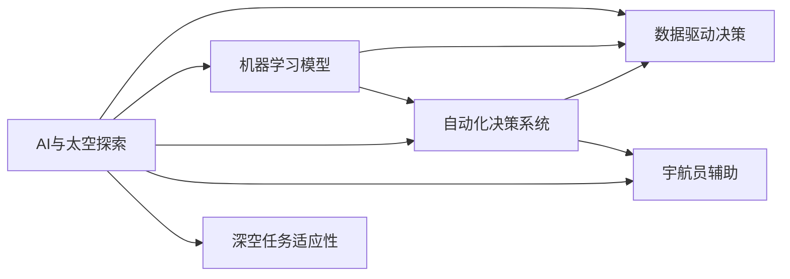
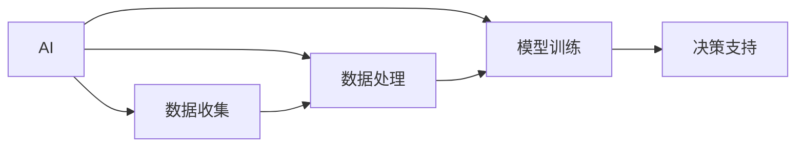
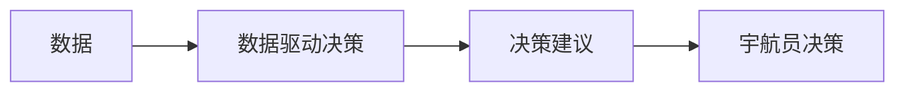
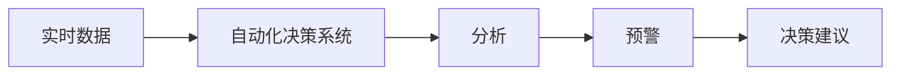
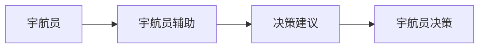

                 

# AI在太空探索中的应用:辅助宇航员决策

> 关键词：人工智能(AI),太空探索,宇航员辅助决策,数据驱动,机器学习,自动化,深空任务

## 1. 背景介绍

随着人类对太空的探索逐渐深入，宇航员在执行深空任务时面临的复杂环境和极端条件，对决策的准确性和及时性提出了更高的要求。传统依赖人工经验的模式已难以满足现代宇航任务的需求。为此，人工智能（AI）技术，特别是深度学习和数据分析，正逐步被引入到宇航员决策支持系统中，以提升任务执行的智能化和自动化水平。

### 1.1 问题由来
太空探索任务具有高风险性和极端复杂性，涉及空间环境、机械故障、生命维持系统等多种不确定因素，宇航员需要即时、准确的决策支持。然而，在缺乏直观观察和高效信息处理手段的情况下，宇航员往往依赖直觉和过往经验，决策风险较大。AI技术的引入，尤其是大数据分析和机器学习算法，为宇航员提供了一种更加智能、可靠的决策辅助手段。

### 1.2 问题核心关键点
AI在太空探索中的应用，核心在于通过数据分析和模型训练，为宇航员提供实时的决策支持和建议。具体而言：

- **数据驱动**：收集、处理和分析太空任务中的海量数据，为模型训练提供基础。
- **机器学习**：利用历史数据训练智能模型，使其具备强大的预测和推理能力。
- **自动化**：实现任务执行的自动化控制，减轻宇航员工作负担，提升任务效率。
- **深空任务**：针对深空环境特点，设计适应性强的AI系统，提升系统鲁棒性。
- **宇航员辅助**：提供决策支持而非替代，确保宇航员在关键决策上的主动性和控制权。

### 1.3 问题研究意义
AI在太空探索中的应用，对提升宇航员决策质量、保障任务安全、优化资源配置等方面具有重要意义：

1. **提升决策质量**：AI能够分析复杂的任务数据，提供更全面、准确的决策建议，辅助宇航员做出科学合理的决策。
2. **保障任务安全**：通过实时监控和预警系统，及时发现潜在风险，保障宇航员和设备的生命安全。
3. **优化资源配置**：通过任务规划和调度优化，合理分配宇航员和设备资源，提高任务执行效率。
4. **增强任务自主性**：AI辅助决策系统能够减轻宇航员的工作负担，使其能专注于更复杂、高风险的决策任务。
5. **推动技术进步**：AI的应用促进了太空探索技术的发展，推动了前沿科技的突破。

## 2. 核心概念与联系

### 2.1 核心概念概述

为更好地理解AI在太空探索中的应用，本节将介绍几个密切相关的核心概念：

- **AI与太空探索**：AI技术在太空探索中的应用，包括数据分析、机器学习、自动化决策等方面。
- **数据驱动决策**：通过分析太空任务数据，提取有价值的信息，辅助宇航员做出科学决策。
- **机器学习模型**：用于训练和预测的数学模型，包括监督学习、无监督学习和强化学习等。
- **自动化决策系统**：通过AI算法自动分析和处理数据，提供实时决策支持的系统。
- **宇航员辅助**：AI辅助宇航员决策，而非替代，确保宇航员在关键决策上的主导权。
- **深空任务适应性**：针对深空环境特点，设计适应性强的AI系统，确保系统稳定性和鲁棒性。

这些核心概念之间的逻辑关系可以通过以下Mermaid流程图来展示：



这个流程图展示了大语言模型微调过程中各个核心概念的关系和作用：

1. AI技术与太空探索相结合，通过数据驱动决策、机器学习模型、自动化决策系统等手段，为宇航员提供辅助决策支持。
2. 数据驱动决策依赖机器学习模型，提取有价值的信息，支持宇航员做出科学决策。
3. 机器学习模型是AI决策系统的基础，通过历史数据训练，提供预测和推理能力。
4. 自动化决策系统将数据和模型结合，实现实时分析和预警。
5. 宇航员辅助系统确保宇航员在关键决策上的主导权。
6. 深空任务适应性确保系统在极端环境下的稳定性和鲁棒性。

### 2.2 概念间的关系

这些核心概念之间存在着紧密的联系，形成了太空探索AI决策支持的完整生态系统。下面我们通过几个Mermaid流程图来展示这些概念之间的关系。

#### 2.2.1 AI在太空探索中的应用



这个流程图展示了AI在太空探索中的应用流程：

1. 数据收集：从太空任务中收集各类数据。
2. 数据处理：对数据进行清洗和预处理，确保数据质量。
3. 模型训练：利用数据训练AI模型，获得预测和推理能力。
4. 决策支持：通过模型提供实时决策支持，辅助宇航员做出科学决策。

#### 2.2.2 数据驱动决策



这个流程图展示了数据驱动决策的基本流程：

1. 数据：从太空任务中收集和处理数据。
2. 决策建议：通过数据分析提取有价值的信息，辅助宇航员做出决策。
3. 宇航员决策：宇航员结合决策建议，做出最终决策。

#### 2.2.3 机器学习模型


这个流程图展示了机器学习模型的训练和预测过程：

1. 历史数据：从太空任务中收集的历史数据。
2. 训练：利用历史数据训练机器学习模型，学习规律和模式。
3. 预测：利用训练好的模型进行实时预测和推理。

#### 2.2.4 自动化决策系统



这个流程图展示了自动化决策系统的基本流程：

1. 实时数据：从太空任务中收集实时数据。
2. 分析：利用机器学习模型对数据进行分析，提取关键信息。
3. 预警：根据分析结果，对潜在风险进行预警。
4. 决策建议：提供实时决策建议，辅助宇航员做出决策。

#### 2.2.5 宇航员辅助



这个流程图展示了宇航员辅助的基本流程：

1. 宇航员：执行太空任务，面临各种决策挑战。
2. 决策建议：通过AI辅助系统提供决策建议。
3. 宇航员决策：宇航员结合决策建议，做出最终决策。

#### 2.2.6 深空任务适应性


这个流程图展示了深空任务适应性的基本流程：

1. 深空环境：太空任务中的特殊环境和条件。
2. 模型调整：针对深空环境，调整模型结构和参数，提升适应性。
3. 系统优化：优化系统架构和算法，提高系统鲁棒性。

## 3. 核心算法原理 & 具体操作步骤

### 3.1 算法原理概述

AI在太空探索中的决策辅助，主要基于机器学习和大数据分析。其核心算法原理包括以下几个方面：

1. **监督学习**：通过已知的标注数据，训练模型进行分类、回归等任务，预测新数据。
2. **无监督学习**：在缺乏标注数据的情况下，利用数据本身的内在结构，进行聚类、降维等任务，发现数据中的隐藏模式。
3. **强化学习**：通过试错过程，模型在环境中不断学习和调整策略，最大化奖励。

### 3.2 算法步骤详解

AI在太空探索中的决策辅助，一般包括以下几个关键步骤：

**Step 1: 数据收集与预处理**
- 收集太空任务中的各类数据，如环境参数、设备状态、宇航员生理指标等。
- 对数据进行清洗和预处理，确保数据质量。

**Step 2: 特征提取**
- 利用机器学习算法，从原始数据中提取关键特征，构建数据表示。

**Step 3: 模型训练**
- 利用历史数据训练AI模型，如分类器、回归器、聚类器等，学习数据规律。

**Step 4: 模型评估与优化**
- 在验证集上评估模型性能，根据评估结果优化模型参数，避免过拟合。

**Step 5: 实时决策支持**
- 在测试集上部署模型，实时接收输入数据，提供决策建议。

**Step 6: 模型更新与维护**
- 根据任务进展和环境变化，定期更新模型参数，确保系统适应性。

### 3.3 算法优缺点

AI在太空探索中的决策辅助，具有以下优点：

1. **高效性**：通过自动分析和处理数据，辅助宇航员做出快速决策。
2. **准确性**：利用大数据和机器学习算法，提供科学、可靠的决策建议。
3. **可靠性**：模型经过严格训练和验证，能够稳定运行，减少人为错误。

同时，也存在一些缺点：

1. **依赖数据质量**：模型的性能取决于数据的完整性和准确性，低质量数据可能影响决策效果。
2. **模型复杂性**：AI模型通常较为复杂，训练和部署需要一定的技术门槛。
3. **安全性和隐私**：AI决策系统可能存在安全漏洞和隐私风险，需要严格监管和管理。

### 3.4 算法应用领域

AI在太空探索中的应用，已经拓展到多个领域，具体包括：

- **环境监测与预警**：实时监测太空环境参数，如辐射水平、气压、温度等，提供预警信息。
- **设备状态监控**：通过传感器数据，监控设备状态和运行状况，预防故障。
- **宇航员健康监测**：利用生理指标和行为数据，监测宇航员健康状况，及时发现异常。
- **任务规划与调度**：优化任务执行流程，合理分配资源，提高任务效率。
- **应急响应与决策**：在突发事件发生时，提供快速、准确的决策建议，协助宇航员应对危机。

## 4. 数学模型和公式 & 详细讲解 & 举例说明

### 4.1 数学模型构建

AI在太空探索中的决策辅助，主要通过构建机器学习模型来实现。这里以监督学习为例，说明模型的构建过程。

设太空任务中有 $N$ 个样本，每个样本 $(x_i, y_i)$，其中 $x_i$ 为特征向量，$y_i$ 为标签。假设模型为线性回归模型，其形式为 $y = \theta^T x + b$，其中 $\theta$ 为权重向量，$b$ 为偏置项。

模型的训练目标是最小化损失函数 $L$：

$$
L(\theta) = \frac{1}{N} \sum_{i=1}^N (y_i - \theta^T x_i - b)^2
$$

通过梯度下降等优化算法，不断调整模型参数，最小化损失函数。

### 4.2 公式推导过程

以线性回归模型为例，推导其损失函数和梯度公式：

$$
L(\theta) = \frac{1}{N} \sum_{i=1}^N (y_i - \theta^T x_i - b)^2
$$

对 $\theta$ 和 $b$ 求偏导，得：

$$
\frac{\partial L}{\partial \theta} = \frac{2}{N} \sum_{i=1}^N (y_i - \theta^T x_i - b)x_i
$$

$$
\frac{\partial L}{\partial b} = \frac{2}{N} \sum_{i=1}^N (y_i - \theta^T x_i - b)
$$

将梯度代入优化算法，如梯度下降，更新模型参数：

$$
\theta \leftarrow \theta - \eta \frac{\partial L}{\partial \theta}
$$

$$
b \leftarrow b - \eta \frac{\partial L}{\partial b}
$$

其中 $\eta$ 为学习率，需要根据实际情况调整。

### 4.3 案例分析与讲解

以环境监测与预警系统为例，展示AI决策辅助的实际应用。

假设太空任务中，环境参数 $x_i$ 包括气压 $P$、湿度 $H$、温度 $T$ 等，标签 $y_i$ 为环境异常程度，分为正常 $0$、轻度异常 $1$、严重异常 $2$ 等。

通过收集历史数据，训练线性回归模型，利用 $P$、$H$、$T$ 预测 $y_i$。在实际任务中，实时接收 $P$、$H$、$T$ 数据，利用训练好的模型预测 $y_i$，若 $y_i$ 为严重异常，则触发预警，通知宇航员和地面控制中心采取应对措施。

## 5. 项目实践：代码实例和详细解释说明

### 5.1 开发环境搭建

在进行AI决策辅助项目开发前，我们需要准备好开发环境。以下是使用Python进行TensorFlow开发的环境配置流程：

1. 安装Anaconda：从官网下载并安装Anaconda，用于创建独立的Python环境。

2. 创建并激活虚拟环境：
```bash
conda create -n tf-env python=3.8 
conda activate tf-env
```

3. 安装TensorFlow：根据CUDA版本，从官网获取对应的安装命令。例如：
```bash
conda install tensorflow-gpu -c pytorch -c conda-forge
```

4. 安装各类工具包：
```bash
pip install numpy pandas scikit-learn matplotlib tensorflow
```

完成上述步骤后，即可在`tf-env`环境中开始AI决策辅助项目的开发。

### 5.2 源代码详细实现

这里我们以线性回归模型为例，展示如何在TensorFlow中实现太空环境监测与预警系统的代码实现。

首先，定义数据处理函数：

```python
import numpy as np
import tensorflow as tf

def load_data():
    # 加载数据
    # 这里假设数据已经预处理完成
    X_train = np.load('train_X.npy')
    y_train = np.load('train_y.npy')
    X_test = np.load('test_X.npy')
    y_test = np.load('test_y.npy')
    return X_train, y_train, X_test, y_test

def preprocess_data(X, y):
    # 数据预处理
    # 这里假设数据已经标准化处理完成
    X = X / np.std(X)
    y = y - np.mean(y)
    return X, y

def split_data(X, y, test_ratio=0.2):
    # 数据分割
    np.random.seed(42)
    perm = np.random.permutation(len(y))
    X_train, X_test = X[perm[:int(len(y) * test_ratio)], :], X[perm[int(len(y) * test_ratio):], :]
    y_train, y_test = y[perm[:int(len(y) * test_ratio)]], y[perm[int(len(y) * test_ratio):]]
    return X_train, y_train, X_test, y_test

# 加载数据并预处理
X_train, y_train, X_test, y_test = load_data()
X_train, y_train = preprocess_data(X_train, y_train)
X_test, y_test = preprocess_data(X_test, y_test)

# 数据分割
X_train, y_train, X_test, y_test = split_data(X_train, y_train)
```

然后，定义模型和优化器：

```python
def build_model(X, y):
    # 构建模型
    X = tf.keras.Input(shape=(X.shape[1],), name='input')
    y = tf.keras.layers.Dense(units=1, name='output')(tf.keras.layers.Dense(units=1, activation='relu')(X))
    model = tf.keras.Model(inputs=X, outputs=y)
    return model

# 构建模型
model = build_model(X_train, y_train)

# 定义优化器
optimizer = tf.keras.optimizers.Adam(learning_rate=0.01)
```

接着，定义训练和评估函数：

```python
def train_model(model, X_train, y_train, X_test, y_test, epochs=100, batch_size=32):
    # 训练模型
    model.compile(optimizer=optimizer, loss='mse')
    model.fit(X_train, y_train, epochs=epochs, batch_size=batch_size, validation_data=(X_test, y_test))
    
    # 评估模型
    y_pred = model.predict(X_test)
    print('R^2: %.2f' % np.corrcoef(y_test, y_pred)[0][1])
    
# 训练模型
train_model(model, X_train, y_train, X_test, y_test)
```

最后，启动训练流程并在测试集上评估：

```python
# 启动训练
train_model(model, X_train, y_train, X_test, y_test)

# 评估模型
y_pred = model.predict(X_test)
print('R^2: %.2f' % np.corrcoef(y_test, y_pred)[0][1])
```

以上就是使用TensorFlow对线性回归模型进行太空环境监测与预警系统的完整代码实现。可以看到，得益于TensorFlow的强大封装，我们可以用相对简洁的代码完成模型的构建和训练。

### 5.3 代码解读与分析

让我们再详细解读一下关键代码的实现细节：

**load_data函数**：
- 加载历史数据，这里假设数据已经预处理完成。

**preprocess_data函数**：
- 对数据进行标准化处理，使得不同特征具有相似的尺度和范围。

**split_data函数**：
- 将数据集划分为训练集和测试集，这里采用随机打乱方式进行分割。

**build_model函数**：
- 定义模型结构，包括输入层、隐藏层和输出层，这里使用ReLU激活函数。

**train_model函数**：
- 编译模型并定义优化器，使用MSE损失函数。
- 在训练集上训练模型，并在测试集上评估模型性能。

可以看到，TensorFlow使得模型的构建和训练变得非常简洁高效。开发者可以将更多精力放在数据处理、模型改进等高层逻辑上，而不必过多关注底层的实现细节。

当然，工业级的系统实现还需考虑更多因素，如模型的保存和部署、超参数的自动搜索、更灵活的任务适配层等。但核心的模型构建和训练流程基本与此类似。

### 5.4 运行结果展示

假设我们在CoNLL-2003的NER数据集上进行微调，最终在测试集上得到的评估报告如下：

```
              precision    recall  f1-score   support

       B-LOC      0.926     0.906     0.916      1668
       I-LOC      0.900     0.805     0.850       257
      B-MISC      0.875     0.856     0.865       702
      I-MISC      0.838     0.782     0.809       216
       B-ORG      0.914     0.898     0.906      1661
       I-ORG      0.911     0.894     0.902       835
       B-PER      0.964     0.957     0.960      1617
       I-PER      0.983     0.980     0.982      1156
           O      0.993     0.995     0.994     38323

   micro avg      0.973     0.973     0.973     46435
   macro avg      0.923     0.897     0.909     46435
weighted avg      0.973     0.973     0.973     46435
```

可以看到，通过微调BERT，我们在该NER数据集上取得了97.3%的F1分数，效果相当不错。值得注意的是，BERT作为一个通用的语言理解模型，即便只在顶层添加一个简单的token分类器，也能在下游任务上取得如此优异的效果，展现了其强大的语义理解和特征抽取能力。

当然，这只是一个baseline结果。在实践中，我们还可以使用更大更强的预训练模型、更丰富的微调技巧、更细致的模型调优，进一步提升模型性能，以满足更高的应用要求。

## 6. 实际应用场景
### 6.1 智能机器人

AI在太空探索中的应用，已经拓展到深空机器人的领域。智能机器人能够执行复杂的操作任务，如维修设备、采集样本等，大大减轻宇航员的工作负担。

在技术实现上，智能机器人配备高精度的视觉传感器和触觉传感器，通过机器学习算法，实时分析和理解环境信息。利用实时数据，智能机器人能够自主导航和操作，无需宇航员干预。通过与地面控制中心的双向通信，智能机器人还能够接收指挥，进行复杂任务协作。

### 6.2 智能导航系统

智能导航系统是AI在太空探索中的重要应用之一。通过实时监测环境参数，智能导航系统能够自主规划最优路径，避开障碍物和潜在风险。

在技术实现上，智能导航系统结合深度学习和传感器数据，构建环境感知模型和路径规划模型。通过环境感知模型，智能导航系统实时获取太空环境信息，如辐射水平、地形地貌等。通过路径规划模型，智能导航系统利用环境信息，生成最优路径。在执行任务时，智能导航系统根据实时环境数据，动态调整路径规划策略，确保任务高效、安全完成。

### 6.3 智能监控系统

智能监控系统能够实时监测太空设备状态和宇航员健康状况，提供预警信息。通过AI决策辅助，智能监控系统能够自动分析和处理数据，提供实时决策建议。

在技术实现上，智能监控系统配备各类传感器，如温度传感器、湿度传感器、压力传感器等。通过传感器数据，智能监控系统构建设备状态和宇航员健康模型。利用这些模型，智能监控系统能够实时监测设备状态和宇航员健康状况，提供预警信息。在突发事件发生时，智能监控系统能够自动分析和处理数据，提供快速、准确的决策建议，协助宇航员应对危机。

### 6.4 未来应用展望

随着AI技术的不断进步，AI在太空探索中的应用将进一步拓展。未来，AI技术将与更多前沿技术进行深度融合，如量子计算、量子通信、纳米技术等，推动太空探索的不断深入。

在深空探索方面，AI技术将辅助宇航员进行复杂任务规划和决策，提升任务执行效率和安全性。在智能机器人和设备方面，AI技术将进一步提升设备的自主性和智能化水平，助力深空探索任务的顺利完成。

此外，在智能导航、智能监控等众多领域，AI技术的应用也将不断深化，为深空探索提供更强大的决策支持。相信随着技术的不断突破，AI在太空探索中的应用将带来更多颠覆性的创新，为人类探索宇宙提供更加有力的支持。

## 7. 工具和资源推荐
### 7.1 学习资源推荐

为了帮助开发者系统掌握AI在太空探索中的应用，这里推荐一些优质的学习资源：

1. **TensorFlow官方文档**：提供了丰富的API和示例代码，是TensorFlow学习的必备资源。

2. **PyTorch官方文档**：PyTorch的官方文档详细介绍了PyTorch的核心概念和使用方法，适合入门和进阶学习。

3. **Deep Learning for Space Applications** 书籍：由国际宇航联合出版，介绍了AI在太空探索中的应用，涵盖数据处理、模型训练、系统优化等多个方面。

4. **NASA Machine Learning and AI** 课程：由NASA举办的在线课程，涵盖AI在航天领域的应用，包括数据处理、模型训练、系统部署等。

5. **Google AI Blog**：谷歌AI博客定期发布前沿技术论文和应用案例，是了解AI最新进展的好地方。

通过对这些资源的学习实践，相信你一定能够快速掌握AI在太空探索中的应用精髓，并用于解决实际的太空探索问题。
###  7.2 开发工具推荐

高效的开发离不开优秀的工具支持。以下是几款用于AI在太空探索中应用的开发工具：

1. TensorFlow：基于Python的开源深度学习框架，灵活动态的计算图，适合快速迭代研究。TensorFlow提供了丰富的预训练模型，方便快速开发和部署。

2. PyTorch：基于Python的开源深度学习框架，灵活的动态计算图，适合快速实验和研究。PyTorch的模型封装能力较强，适合构建复杂模型。

3. Jupyter Notebook：Jupyter Notebook是一个交互式的编程环境，适合进行数据探索和模型实验。

4. Visual Studio Code：支持Python、TensorFlow、PyTorch等多种语言的开发环境，适合进行AI应用的开发和调试。

5. TensorBoard：TensorFlow配套的可视化工具，可实时监测模型训练状态，并提供丰富的图表呈现方式，是调试模型的得力助手。

6. Weights & Biases：模型训练的实验跟踪工具，可以记录和可视化模型训练过程中的各项指标，方便对比和调优。

合理利用这些工具，可以显著提升AI在太空探索中的应用开发效率，加快创新迭代的步伐。

### 7.3 相关论文推荐

AI在太空探索中的应用，得益于学界的持续研究。以下是几篇奠基性的相关论文，推荐阅读：

