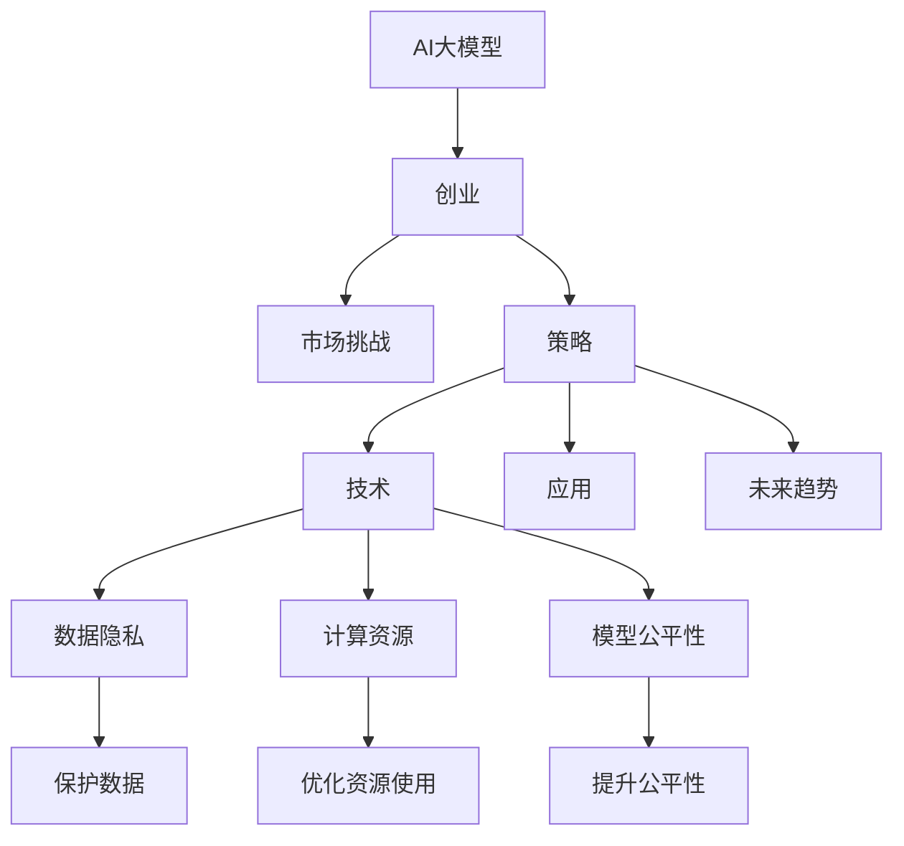

                 

# AI大模型创业：如何应对未来市场挑战？

> 关键词：AI大模型，创业，市场挑战，策略，技术，应用，未来趋势，创新

## 1. 背景介绍

随着人工智能技术的迅猛发展，AI大模型逐渐成为各行各业的核心竞争力。从金融、医疗到零售、制造，大模型正在改变着各个行业的生态和商业模式。然而，大模型的应用也带来了诸多挑战，包括数据隐私、模型公平性、计算资源等。本文旨在探讨AI大模型在创业中的应对策略，分析未来市场挑战，并为创业企业提供技术和管理方面的建议。

## 2. 核心概念与联系

### 2.1 核心概念概述

为了更好地理解AI大模型的创业策略和未来市场挑战，我们首先介绍几个核心概念：

- **AI大模型（Large AI Models）**：指使用深度学习技术训练的超大规模模型，如GPT-3、BERT、T5等，这些模型通常具有复杂的结构和大量的参数，能够在多个任务上实现优秀表现。
- **创业（Entrepreneurship）**：指个体或团队在商业环境中创建、发展和管理新的商业项目和机会的过程。
- **市场挑战（Market Challenges）**：指企业在AI大模型应用过程中可能遇到的各种问题和障碍，包括数据隐私、计算资源、模型公平性等。
- **策略（Strategies）**：指企业为应对市场挑战所采取的具体行动和决策，包括技术选择、业务模型、合作伙伴关系等。
- **技术（Technology）**：指支持AI大模型应用的各项技术，包括模型训练、部署、优化、监控等。
- **应用（Applications）**：指AI大模型在各个行业中的具体应用场景，如自然语言处理、图像识别、智能推荐等。
- **未来趋势（Future Trends）**：指AI大模型在未来可能的发展方向和技术突破。
- **创新（Innovation）**：指企业通过引入新技术、新方法来提升AI大模型应用的效率和效果。

这些核心概念相互关联，共同构成了AI大模型创业的基础框架。以下是一个Mermaid流程图，展示了这些概念之间的关系：



## 3. 核心算法原理 & 具体操作步骤

### 3.1 算法原理概述

AI大模型创业的核心在于如何利用AI技术，在商业环境中创造出新的价值。以下是AI大模型创业的算法原理概述：

1. **数据收集与处理**：收集高质量的数据是AI大模型应用的基石。数据的质量和多样性直接影响模型的训练效果。
2. **模型训练与优化**：使用高效的算法（如深度学习、强化学习等）对大模型进行训练和优化，以提高其在特定任务上的表现。
3. **部署与应用**：将训练好的模型部署到实际应用环境中，通过API或SDK等方式提供服务，实现商业价值。
4. **监控与维护**：对部署的模型进行实时监控和维护，确保其稳定性和安全性。
5. **扩展与升级**：随着业务需求的增长和技术的进步，定期对模型进行扩展和升级，以适应新的场景和挑战。

### 3.2 算法步骤详解

AI大模型创业的具体操作步骤如下：

1. **市场调研与需求分析**：确定目标市场和潜在客户需求，分析竞争环境。
2. **数据采集与预处理**：根据业务需求采集和清洗数据，为模型训练提供数据基础。
3. **模型设计与训练**：选择合适的模型架构和算法，进行模型训练和优化。
4. **部署与测试**：将训练好的模型部署到实际应用中，进行测试和验证。
5. **商业化与推广**：通过营销、销售等方式，将AI大模型服务推广给目标客户。
6. **反馈与迭代**：收集用户反馈，持续优化模型和服务，实现业务迭代。

### 3.3 算法优缺点

AI大模型创业的优势在于能够利用先进的AI技术，快速响应市场变化，提升业务效率和竞争力。然而，也存在以下缺点：

- **高昂的计算成本**：训练和部署AI大模型需要大量的计算资源和存储，成本较高。
- **数据隐私问题**：大规模数据处理可能涉及用户隐私，需要严格的隐私保护措施。
- **模型公平性挑战**：AI模型可能存在偏见，需要关注模型公平性和可解释性。
- **技术复杂性**：AI大模型应用涉及多领域技术，需要跨学科知识。
- **市场推广难度**：技术产品推广需要市场教育和品牌建设，投入较大。

### 3.4 算法应用领域

AI大模型在多个领域具有广泛的应用前景，包括但不限于：

- **金融科技（Fintech）**：用于风险评估、投资策略、客户服务等领域。
- **医疗健康**：辅助诊断、治疗方案推荐、健康监测等。
- **零售电商**：个性化推荐、库存管理、客户关系管理等。
- **制造业**：质量控制、设备预测维护、供应链优化等。
- **智慧城市**：交通管理、环境监测、公共安全等。

## 4. 数学模型和公式 & 详细讲解 & 举例说明

### 4.1 数学模型构建

AI大模型的应用涉及到多种数学模型，包括线性回归、决策树、神经网络等。以神经网络模型为例，其数学模型构建如下：

$$
f(x) = \sum_{i=1}^{n} w_i \cdot x_i + b
$$

其中，$x$ 为输入向量，$w$ 为权重向量，$b$ 为偏置，$f(x)$ 为输出。

### 4.2 公式推导过程

以线性回归为例，推导过程如下：

$$
\begin{aligned}
\min_{w,b} & \sum_{i=1}^{N} (y_i - f(x_i))^2 \\
& \text{其中} \, y_i \text{为实际值}, \, f(x_i) = w \cdot x_i + b
\end{aligned}
$$

求解上述优化问题，可以采用梯度下降法，步骤如下：

1. 计算损失函数对权重和偏置的梯度：
   $$
   \frac{\partial J}{\partial w} = -2 \sum_{i=1}^{N} (y_i - f(x_i)) \cdot x_i
   $$
   $$
   \frac{\partial J}{\partial b} = -2 \sum_{i=1}^{N} (y_i - f(x_i))
   $$

2. 更新权重和偏置：
   $$
   w \leftarrow w - \eta \cdot \frac{\partial J}{\partial w}
   $$
   $$
   b \leftarrow b - \eta \cdot \frac{\partial J}{\partial b}
   $$

其中，$\eta$ 为学习率，控制更新步长。

### 4.3 案例分析与讲解

以图像识别为例，使用卷积神经网络（CNN）进行模型构建和训练。

**步骤**：

1. **数据准备**：收集图像数据集，并对其进行标注。
2. **模型设计**：设计多层卷积神经网络，包括卷积层、池化层、全连接层等。
3. **训练过程**：使用梯度下降法优化模型参数，最小化损失函数。
4. **验证与测试**：在验证集和测试集上评估模型性能，并进行模型优化。

**代码示例**：

```python
import torch
import torch.nn as nn
import torch.optim as optim

# 定义模型
class Net(nn.Module):
    def __init__(self):
        super(Net, self).__init__()
        self.conv1 = nn.Conv2d(3, 6, 5)
        self.pool = nn.MaxPool2d(2, 2)
        self.conv2 = nn.Conv2d(6, 16, 5)
        self.fc1 = nn.Linear(16 * 5 * 5, 120)
        self.fc2 = nn.Linear(120, 84)
        self.fc3 = nn.Linear(84, 10)

    def forward(self, x):
        x = self.pool(torch.relu(self.conv1(x)))
        x = self.pool(torch.relu(self.conv2(x)))
        x = x.view(-1, 16 * 5 * 5)
        x = torch.relu(self.fc1(x))
        x = torch.relu(self.fc2(x))
        x = self.fc3(x)
        return x

# 准备数据
train_set = ...
train_loader = ...
test_set = ...
test_loader = ...

# 定义模型、损失函数和优化器
model = Net()
criterion = nn.CrossEntropyLoss()
optimizer = optim.SGD(model.parameters(), lr=0.001, momentum=0.9)

# 训练过程
for epoch in range(10):
    running_loss = 0.0
    for i, data in enumerate(train_loader, 0):
        inputs, labels = data
        optimizer.zero_grad()
        outputs = model(inputs)
        loss = criterion(outputs, labels)
        loss.backward()
        optimizer.step()
        running_loss += loss.item()
    print(f'Epoch {epoch+1}, loss: {running_loss/len(train_loader)}')

# 测试过程
correct = 0
total = 0
with torch.no_grad():
    for data in test_loader:
        inputs, labels = data
        outputs = model(inputs)
        _, predicted = torch.max(outputs.data, 1)
        total += labels.size(0)
        correct += (predicted == labels).sum().item()
print(f'Accuracy: {100 * correct / total}%')
```

## 5. 项目实践：代码实例和详细解释说明

### 5.1 开发环境搭建

在开始AI大模型的创业项目之前，首先需要搭建好开发环境。以下是一个基本的开发环境搭建流程：

1. **选择编程语言**：Python是目前最流行的AI开发语言，支持深度学习框架如TensorFlow、PyTorch等。
2. **安装依赖包**：使用pip或conda安装所需的依赖包，如numpy、pandas、scikit-learn等。
3. **搭建服务器**：使用云服务器或本地服务器搭建开发环境，确保服务器有足够的计算资源和存储空间。
4. **安装GPU**：若有条件，安装NVIDIA GPU，以提升模型训练速度。
5. **配置网络**：确保服务器与互联网有良好的连接，以便下载模型和数据。

### 5.2 源代码详细实现

以下是一个简单的图像识别项目，使用TensorFlow和Keras实现。

**步骤**：

1. **数据准备**：收集图像数据集，并对其进行预处理。
2. **模型设计**：设计卷积神经网络，使用Keras搭建模型。
3. **训练过程**：使用Keras训练模型，最小化损失函数。
4. **评估与优化**：在测试集上评估模型性能，并进行模型优化。

**代码示例**：

```python
import tensorflow as tf
from tensorflow import keras

# 加载数据集
(x_train, y_train), (x_test, y_test) = keras.datasets.mnist.load_data()

# 数据预处理
x_train = x_train.reshape((60000, 28, 28, 1))
x_train = x_train / 255.0
x_test = x_test.reshape((10000, 28, 28, 1))
x_test = x_test / 255.0

# 定义模型
model = keras.Sequential([
    keras.layers.Conv2D(32, kernel_size=(3, 3), activation='relu', input_shape=(28, 28, 1)),
    keras.layers.MaxPooling2D(pool_size=(2, 2)),
    keras.layers.Flatten(),
    keras.layers.Dense(10, activation='softmax')
])

# 编译模型
model.compile(optimizer='adam', loss='sparse_categorical_crossentropy', metrics=['accuracy'])

# 训练模型
model.fit(x_train, y_train, epochs=5, validation_data=(x_test, y_test))

# 评估模型
test_loss, test_acc = model.evaluate(x_test, y_test)
print(f'Test accuracy: {test_acc}')
```

### 5.3 代码解读与分析

**数据预处理**：

```python
x_train = x_train.reshape((60000, 28, 28, 1))
x_train = x_train / 255.0
x_test = x_test.reshape((10000, 28, 28, 1))
x_test = x_test / 255.0
```

对数据进行归一化处理，将像素值从[0, 255]缩放到[0, 1]，以提高模型的训练效果。

**模型定义**：

```python
model = keras.Sequential([
    keras.layers.Conv2D(32, kernel_size=(3, 3), activation='relu', input_shape=(28, 28, 1)),
    keras.layers.MaxPooling2D(pool_size=(2, 2)),
    keras.layers.Flatten(),
    keras.layers.Dense(10, activation='softmax')
])
```

定义一个简单的卷积神经网络，包括卷积层、池化层、全连接层。

**模型编译**：

```python
model.compile(optimizer='adam', loss='sparse_categorical_crossentropy', metrics=['accuracy'])
```

使用Adam优化器，交叉熵损失函数，评估指标为准确率。

**模型训练**：

```python
model.fit(x_train, y_train, epochs=5, validation_data=(x_test, y_test))
```

在训练集上训练5个epoch，并在验证集上评估模型性能。

**模型评估**：

```python
test_loss, test_acc = model.evaluate(x_test, y_test)
print(f'Test accuracy: {test_acc}')
```

在测试集上评估模型准确率。

## 6. 实际应用场景

### 6.1 金融科技

在金融科技领域，AI大模型可以用于风险评估、投资策略、客户服务等多个方面。例如，使用模型对贷款申请人的信用进行评估，预测违约风险，优化贷款审批流程。此外，AI大模型还可以用于个性化推荐，根据用户历史交易数据和行为特征，推荐个性化的金融产品。

### 6.2 医疗健康

AI大模型在医疗健康领域的应用包括疾病诊断、治疗方案推荐、健康监测等。例如，使用模型对医学影像进行自动分析，辅助医生诊断疾病。此外，AI大模型还可以用于健康监测，通过分析用户生理数据，预测疾病风险，提供健康建议。

### 6.3 零售电商

在零售电商领域，AI大模型可以用于个性化推荐、库存管理、客户关系管理等。例如，根据用户历史购买数据和行为特征，推荐个性化的商品，提高销售转化率。此外，AI大模型还可以用于库存管理，预测商品需求，优化供应链管理。

### 6.4 制造业

在制造业领域，AI大模型可以用于质量控制、设备预测维护、供应链优化等。例如，使用模型对生产过程中的数据进行实时分析，预测设备故障，减少停机时间。此外，AI大模型还可以用于供应链优化，预测市场需求，优化生产计划。

### 6.5 智慧城市

在智慧城市领域，AI大模型可以用于交通管理、环境监测、公共安全等。例如，使用模型对交通数据进行实时分析，优化交通流量，减少拥堵。此外，AI大模型还可以用于环境监测，预测天气变化，优化城市应急响应。

## 7. 工具和资源推荐

### 7.1 学习资源推荐

1. **在线课程**：Coursera、edX等平台提供大量AI和大模型相关的课程，如Andrew Ng的《深度学习专项课程》、吴恩达的《机器学习》等。
2. **官方文档**：TensorFlow、PyTorch等深度学习框架提供详细的文档和教程，帮助用户快速上手。
3. **书籍**：《深度学习》（Ian Goodfellow等著）、《Python深度学习》（Francois Chollet著）等书籍，深入讲解AI和大模型技术。
4. **社区和论坛**：Kaggle、Stack Overflow等社区和论坛，提供丰富的学习资源和交流平台。

### 7.2 开发工具推荐

1. **编程语言**：Python是目前最流行的AI开发语言，支持TensorFlow、PyTorch等深度学习框架。
2. **开发环境**：Jupyter Notebook、Google Colab等开发环境，提供便捷的交互式开发体验。
3. **模型管理**：TensorFlow Serving、TensorFlow Lite等模型管理工具，方便模型的部署和调优。
4. **监控工具**：Prometheus、Grafana等监控工具，实时监测模型性能和健康状况。
5. **自动化部署**：Kubernetes、Docker等容器化技术，实现自动化部署和扩展。

### 7.3 相关论文推荐

1. **深度学习**：《深度学习》（Ian Goodfellow等著）、《Python深度学习》（Francois Chollet著）等书籍，深入讲解深度学习技术。
2. **自然语言处理**：《自然语言处理综论》（Daniel Jurafsky等著）、《神经网络与深度学习》（Michael Nielsen著）等书籍，介绍自然语言处理技术。
3. **计算机视觉**：《计算机视觉：模型、学习和推理》（David Forsyth等著）、《深度学习计算机视觉》（Gao Huang等著）等书籍，讲解计算机视觉技术。
4. **强化学习**：《强化学习：模型、算法和应用》（Richard S. Sutton等著）、《深度强化学习》（Ian Osband等著）等书籍，讲解强化学习技术。

## 8. 总结：未来发展趋势与挑战

### 8.1 研究成果总结

AI大模型技术在各个领域的应用取得了显著的成果，但也面临着诸多挑战。例如，如何有效处理大规模数据，提升模型的训练效率和精度，保护数据隐私，优化模型公平性等。未来，需要在技术、管理、伦理等方面进行全面优化，才能真正发挥AI大模型的潜力。

### 8.2 未来发展趋势

1. **模型规模和效率**：随着计算能力的提升，AI大模型的规模和效率将不断提升，能够处理更复杂的任务。
2. **跨领域应用**：AI大模型将广泛应用于更多领域，如医疗、教育、智能家居等，带来新的商业模式和技术突破。
3. **联邦学习**：分布式计算和联邦学习技术将得到广泛应用，提升数据安全和隐私保护。
4. **自监督学习**：无监督学习技术将得到更多应用，减少对标注数据的依赖。
5. **可解释性**：可解释性技术将得到更多关注，提升模型的透明性和可信度。

### 8.3 面临的挑战

1. **计算资源**：大规模模型训练和部署需要大量的计算资源和存储空间，成本较高。
2. **数据隐私**：大规模数据处理可能涉及用户隐私，需要严格的隐私保护措施。
3. **模型公平性**：AI模型可能存在偏见，需要关注模型公平性和可解释性。
4. **技术复杂性**：AI大模型应用涉及多领域技术，需要跨学科知识。
5. **市场推广**：技术产品推广需要市场教育和品牌建设，投入较大。

### 8.4 研究展望

1. **联邦学习**：分布式计算和联邦学习技术将得到广泛应用，提升数据安全和隐私保护。
2. **自监督学习**：无监督学习技术将得到更多应用，减少对标注数据的依赖。
3. **可解释性**：可解释性技术将得到更多关注，提升模型的透明性和可信度。
4. **跨领域应用**：AI大模型将广泛应用于更多领域，如医疗、教育、智能家居等，带来新的商业模式和技术突破。
5. **模型效率**：模型训练和推理效率将得到进一步提升，适应更多实时应用场景。

总之，AI大模型在创业过程中需要全面考虑技术、市场、伦理等多方面因素，才能真正实现商业价值。未来，随着技术的不断进步和应用场景的拓展，AI大模型必将迎来更广阔的发展空间和更多创新的应用场景。

---

作者：禅与计算机程序设计艺术 / Zen and the Art of Computer Programming

