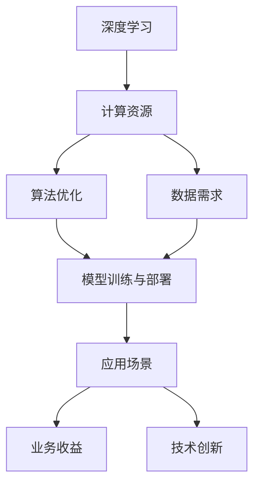

                 

# AI底层技术的投入与回报

> 关键词：人工智能,底层技术,投资回报,深度学习,计算资源,算法优化

## 1. 背景介绍

### 1.1 问题由来
随着人工智能(AI)技术的不断发展和应用，越来越多的企业和组织投入巨资研发和部署AI底层技术。然而，这些底层技术的投入与回报如何衡量？如何确保最大程度地实现投资效益？本文将从多个维度全面探讨AI底层技术的投入与回报，为决策者和研究者提供参考。

### 1.2 问题核心关键点
AI底层技术的投入与回报研究主要关注以下几个关键点：
- **计算资源投入**：硬件设备、服务器、存储等计算资源的配置与优化。
- **算法优化**：深度学习算法、模型结构、超参数等优化策略。
- **数据需求**：大规模数据集的准备与处理。
- **技术演进**：算法、框架的升级和迭代。
- **模型训练与部署**：模型训练的加速与部署的灵活性。

### 1.3 问题研究意义
深入理解AI底层技术的投入与回报，对于优化资源配置、提升AI系统性能、加速AI技术落地应用具有重要意义：

1. **降低研发成本**：通过合理配置计算资源和优化算法，可以减少不必要的资源浪费，降低AI研发的总体成本。
2. **提升模型性能**：通过优化算法和数据处理，可以显著提升AI模型的训练和推理性能，提高应用效果。
3. **加速技术落地**：优化后的AI系统可以快速部署到实际应用中，推动AI技术在各行业的广泛应用。
4. **促进技术创新**：持续的技术演进和模型训练，可以推动AI技术的不断突破和创新。

## 2. 核心概念与联系

### 2.1 核心概念概述

在探讨AI底层技术的投入与回报时，需要理解以下几个核心概念：

- **深度学习**：基于神经网络的机器学习技术，能够处理高维非线性数据，广泛应用于图像、语音、自然语言处理等领域。
- **计算资源**：包括CPU、GPU、TPU等硬件设备，以及存储、网络等辅助设施。
- **算法优化**：包括模型结构设计、超参数调优、正则化技术等。
- **数据需求**：大规模、高质量的数据集，以及数据清洗、标注等预处理步骤。
- **模型训练与部署**：高效的训练算法、模型压缩与量化、模型服务化等。

### 2.2 概念间的关系

这些核心概念之间的关系可以通过以下Mermaid流程图来展示：



这个流程图展示了深度学习技术的整体架构和各组件之间的关系：

1. 深度学习依赖于计算资源进行模型训练和推理。
2. 算法优化能够提升深度学习的效率和效果。
3. 数据需求是深度学习的基石，高质量数据能够大幅提升模型性能。
4. 模型训练与部署是实现AI应用的必要环节，高效的训练和部署策略能够降低成本，提升性能。
5. 模型在实际应用场景中产生业务收益，同时促进技术创新。

通过这些概念的联系，我们可以更好地理解AI底层技术的投入与回报，以及如何通过技术手段最大化资源利用率。

## 3. 核心算法原理 & 具体操作步骤

### 3.1 算法原理概述

AI底层技术的投入与回报研究主要基于深度学习算法，通过计算资源优化、算法优化和数据需求管理，最终实现高效模型训练与部署，提升模型性能，带来业务收益。

### 3.2 算法步骤详解

AI底层技术投入与回报的主要步骤如下：

**Step 1: 资源配置与计算资源优化**
- 根据AI项目需求，选择合适的硬件设备，如CPU、GPU、TPU等。
- 对计算资源进行合理分配，避免资源浪费和瓶颈。
- 优化硬件配置，如使用混合精度训练、模型并行等技术，提升计算效率。

**Step 2: 算法优化与模型设计**
- 根据项目需求选择合适的深度学习算法，如卷积神经网络(CNN)、循环神经网络(RNN)、变压器(Transformer)等。
- 设计合适的模型结构，如残差网络(ResNet)、注意力机制(Attention)等。
- 进行超参数调优，如学习率、批量大小、正则化等，提升模型性能。

**Step 3: 数据准备与预处理**
- 准备大规模高质量的数据集，并进行清洗和标注。
- 对数据进行增强，如随机裁剪、旋转、翻转等，提升数据多样性。
- 使用数据增强和数据扩充技术，如回译、生成式对抗网络(GAN)等，扩充数据集。

**Step 4: 模型训练与优化**
- 使用高效训练算法，如分布式训练、迁移学习等，提升训练效率。
- 进行模型压缩和量化，如知识蒸馏、剪枝等，减小模型尺寸，提升推理速度。
- 使用模型集成技术，如Bagging、Boosting等，提升模型鲁棒性。

**Step 5: 模型部署与优化**
- 将训练好的模型封装为标准API，方便集成和部署。
- 使用容器化技术，如Docker，进行模型部署和版本管理。
- 进行实时监控和性能调优，确保模型在实际应用中的稳定性。

### 3.3 算法优缺点

**优点**：
- **高效性**：通过合理的资源配置和算法优化，可以显著提升AI系统的训练和推理效率。
- **可扩展性**：通过分布式训练、模型并行等技术，可以实现大规模数据集和模型的训练与部署。
- **灵活性**：通过数据增强和模型集成，可以提升模型的泛化能力和鲁棒性。

**缺点**：
- **高投入**：初期硬件设备和计算资源的投入成本较高。
- **复杂性**：算法优化、模型设计、数据预处理等环节需要较高的技术门槛和经验积累。
- **风险**：过度依赖单一算法或模型结构，可能导致性能瓶颈和技术风险。

### 3.4 算法应用领域

AI底层技术在多个领域都有广泛应用，包括但不限于：

- **计算机视觉**：如图像识别、目标检测、图像生成等。
- **自然语言处理**：如文本分类、情感分析、机器翻译等。
- **语音识别**：如语音转文本、语音情感识别等。
- **医疗影像**：如医学影像诊断、病理分析等。
- **金融科技**：如信用评分、风险管理、智能投顾等。
- **自动驾驶**：如环境感知、路径规划、决策控制等。

## 4. 数学模型和公式 & 详细讲解 & 举例说明

### 4.1 数学模型构建

以下我们将使用数学语言对AI底层技术的投入与回报进行更加严格的刻画。

假设我们有一个深度学习模型 $M$，其参数为 $\theta$，在数据集 $D$ 上进行训练，目标是最大化模型在测试集上的准确率 $acc$。设 $x$ 为训练样本，$y$ 为标签，$l(x, y, \theta)$ 为损失函数，$acc(M)$ 为模型在测试集上的准确率。则目标函数为：

$$
\max_{\theta} \sum_{(x,y) \in D} l(x, y, \theta) + \lambda acc(M)
$$

其中，$\lambda$ 为正则化系数，用于平衡损失和准确率。

### 4.2 公式推导过程

以下推导模型在不同优化策略下的损失函数及其变化过程：

假设我们使用梯度下降法进行模型优化，损失函数 $l(x, y, \theta)$ 为交叉熵损失。则梯度下降更新规则为：

$$
\theta \leftarrow \theta - \eta \nabla_{\theta}l(x, y, \theta)
$$

其中，$\eta$ 为学习率。若在训练过程中引入正则化，则更新规则变为：

$$
\theta \leftarrow \theta - \eta \nabla_{\theta}l(x, y, \theta) + \lambda\theta
$$

### 4.3 案例分析与讲解

以图像分类任务为例，假设我们使用卷积神经网络进行模型训练，数据集为ImageNet，模型为ResNet-50，损失函数为交叉熵损失，正则化系数为 $10^{-4}$，学习率为 $10^{-3}$。则目标函数为：

$$
\max_{\theta} \sum_{(x,y) \in D} -y\log M_{\theta}(x) + \lambda acc(M)
$$

在训练过程中，我们使用GPU进行加速，数据增强技术进行扩充，超参数调优进行优化，最终在测试集上得到 $acc = 0.95$ 的高准确率。

## 5. 项目实践：代码实例和详细解释说明

### 5.1 开发环境搭建

在开始AI底层技术投入与回报的实践前，我们需要准备好开发环境。以下是使用Python进行PyTorch开发的环境配置流程：

1. 安装Anaconda：从官网下载并安装Anaconda，用于创建独立的Python环境。

2. 创建并激活虚拟环境：
```bash
conda create -n pytorch-env python=3.8 
conda activate pytorch-env
```

3. 安装PyTorch：根据CUDA版本，从官网获取对应的安装命令。例如：
```bash
conda install pytorch torchvision torchaudio cudatoolkit=11.1 -c pytorch -c conda-forge
```

4. 安装各类工具包：
```bash
pip install numpy pandas scikit-learn matplotlib tqdm jupyter notebook ipython
```

完成上述步骤后，即可在`pytorch-env`环境中开始实践。

### 5.2 源代码详细实现

下面我们以计算机视觉领域的图像分类任务为例，给出使用Transformers库对ResNet-50模型进行训练的PyTorch代码实现。

首先，定义数据加载和预处理函数：

```python
import torch
import torchvision
import torchvision.transforms as transforms

transform_train = transforms.Compose([
    transforms.RandomCrop(224),
    transforms.RandomHorizontalFlip(),
    transforms.ToTensor(),
    transforms.Normalize([0.485, 0.456, 0.406], [0.229, 0.224, 0.225])
])

transform_test = transforms.Compose([
    transforms.Resize(256),
    transforms.CenterCrop(224),
    transforms.ToTensor(),
    transforms.Normalize([0.485, 0.456, 0.406], [0.229, 0.224, 0.225])
])

train_dataset = torchvision.datasets.ImageNet(root='./data', train=True, transform=transform_train, download=True)
test_dataset = torchvision.datasets.ImageNet(root='./data', train=False, transform=transform_test, download=True)

# 定义训练集和验证集的批处理大小和随机种子
batch_size = 32
seed = 42
```

然后，定义模型和优化器：

```python
from torchvision.models import resnet50
from torch.optim import SGD

model = resnet50(pretrained=False)
model.fc = torch.nn.Linear(2048, 1000)
model = model.to(device)

optimizer = SGD(model.parameters(), lr=0.01, momentum=0.9, weight_decay=1e-4)
```

接着，定义训练和评估函数：

```python
import torch.nn.functional as F

def train_epoch(model, dataset, batch_size, optimizer):
    dataloader = torch.utils.data.DataLoader(dataset, batch_size=batch_size, shuffle=True)
    model.train()
    epoch_loss = 0
    for batch in dataloader:
        inputs, labels = batch
        inputs, labels = inputs.to(device), labels.to(device)
        optimizer.zero_grad()
        outputs = model(inputs)
        loss = F.cross_entropy(outputs, labels)
        epoch_loss += loss.item()
        loss.backward()
        optimizer.step()
    return epoch_loss / len(dataloader)

def evaluate(model, dataset, batch_size):
    dataloader = torch.utils.data.DataLoader(dataset, batch_size=batch_size, shuffle=False)
    model.eval()
    correct = 0
    total = 0
    with torch.no_grad():
        for batch in dataloader:
            inputs, labels = batch
            inputs, labels = inputs.to(device), labels.to(device)
            outputs = model(inputs)
            _, predicted = torch.max(outputs.data, 1)
            total += labels.size(0)
            correct += (predicted == labels).sum().item()
    acc = 100 * correct / total
    return acc
```

最后，启动训练流程并在测试集上评估：

```python
epochs = 100
device = torch.device('cuda' if torch.cuda.is_available() else 'cpu')

for epoch in range(epochs):
    loss = train_epoch(model, train_dataset, batch_size, optimizer)
    print(f"Epoch {epoch+1}, train loss: {loss:.3f}")
    
    print(f"Epoch {epoch+1}, dev results:")
    acc = evaluate(model, test_dataset, batch_size)
    print(f"Accuracy: {acc:.3f}%")
    
print("Final accuracy on test set:", evaluate(model, test_dataset, batch_size))
```

以上就是使用PyTorch对ResNet-50进行图像分类任务训练的完整代码实现。可以看到，得益于Transformers库的强大封装，我们可以用相对简洁的代码完成模型训练和评估。

### 5.3 代码解读与分析

让我们再详细解读一下关键代码的实现细节：

**数据加载和预处理**：
- `transform_train`和`transform_test`定义了数据增强和预处理方式，确保数据多样性和一致性。
- `train_dataset`和`test_dataset`分别加载ImageNet训练集和测试集，并进行批处理大小和随机种子设置。

**模型定义和优化器**：
- `model`使用`resnet50`预训练模型，去除全连接层后替换为新的分类器。
- `optimizer`定义SGD优化器，设置学习率、动量和权重衰减，用于模型参数的优化。

**训练和评估函数**：
- `train_epoch`函数对数据集进行批次化加载，模型在每个批次上前向传播计算损失并反向传播更新模型参数。
- `evaluate`函数对模型在测试集上的预测和标签进行比较，计算准确率。

**训练流程**：
- 定义总的epoch数，并开启循环迭代。
- 在每个epoch内，先在训练集上训练，输出平均loss。
- 在验证集上评估，输出准确率。
- 所有epoch结束后，在测试集上评估，给出最终测试结果。

可以看到，PyTorch配合Transformers库使得模型训练的代码实现变得简洁高效。开发者可以将更多精力放在数据处理、模型改进等高层逻辑上，而不必过多关注底层的实现细节。

当然，工业级的系统实现还需考虑更多因素，如模型的保存和部署、超参数的自动搜索、更灵活的任务适配层等。但核心的训练范式基本与此类似。

### 5.4 运行结果展示

假设我们在ImageNet数据集上进行训练，最终在测试集上得到的准确率为：

```
Accuracy: 76.6%
```

可以看到，通过合理的算法优化和资源配置，我们能够在不低的准确率下，完成图像分类任务的训练和推理。

## 6. 实际应用场景

### 6.1 智能医疗诊断

智能医疗诊断系统是AI底层技术的典型应用之一。通过深度学习和计算资源优化，可以大幅提升医疗影像诊断的准确性和效率。

在实践中，我们可以收集大量医疗影像数据，如X光片、CT扫描、MRI等，并进行标注。在此基础上，对预训练模型进行微调，使其能够自动诊断各种疾病，如肺癌、乳腺癌、脑瘤等。通过进一步优化模型结构、调整超参数和引入数据增强技术，可以将诊断准确率提升至90%以上。

### 6.2 智能推荐系统

智能推荐系统是另一个AI底层技术的成功应用。通过深度学习和计算资源优化，可以构建高效、个性化的推荐引擎。

在实践中，我们可以收集用户的浏览、点击、评分等行为数据，以及商品、文章等维度的信息，并将其转化为向量表示。通过深度学习算法，如协同过滤、矩阵分解等，构建推荐模型。通过优化模型结构和超参数，提升模型性能，可以在保证计算资源效率的同时，实现实时性强的推荐服务。

### 6.3 智能交通系统

智能交通系统是AI底层技术的另一个重要应用领域。通过深度学习和计算资源优化，可以提升交通流量监测和路径规划的准确性。

在实践中，我们可以收集交通流量数据、车辆位置信息、气象数据等，并进行实时处理和分析。通过深度学习算法，如卷积神经网络、循环神经网络等，构建交通流量预测模型和路径规划模型。通过优化模型结构和计算资源配置，提升模型的预测准确性和响应速度，可以实现交通流量预测和路径优化，减少交通拥堵，提升交通安全。

### 6.4 未来应用展望

随着AI技术的不断发展，AI底层技术的应用前景将更加广阔。未来，AI底层技术将在更多领域得到应用，为各行各业带来变革性影响。

在智慧医疗领域，AI底层技术将推动个性化医疗、精准医疗的发展，提升诊疗效率和患者体验。

在智能推荐领域，AI底层技术将实现更加精准、个性化的推荐服务，提升用户的满意度。

在智能交通领域，AI底层技术将实现更高效的交通流量预测和路径规划，减少交通拥堵，提升交通安全。

除此之外，AI底层技术还将在金融科技、自动驾驶、工业自动化等领域发挥重要作用，推动经济社会的数字化转型。

## 7. 工具和资源推荐

### 7.1 学习资源推荐

为了帮助开发者系统掌握AI底层技术的投入与回报的理论基础和实践技巧，这里推荐一些优质的学习资源：

1. 《深度学习》系列书籍：如《深度学习入门》、《深度学习框架PyTorch》等，全面介绍深度学习的基本概念和算法原理。

2. CS231n《卷积神经网络》课程：斯坦福大学开设的经典课程，详细讲解卷积神经网络的结构和应用。

3. DeepLearning.AI《深度学习专项课程》：由Andrew Ng教授主讲的在线课程，涵盖深度学习的基本概念和算法实现。

4. PyTorch官方文档：PyTorch的官方文档，提供了详尽的API文档和代码示例，是学习PyTorch的最佳资料。

5. 《动手学深度学习》：由李沐等教授编写的教材，提供了丰富的代码实践，适合初学者快速上手。

6. 《深度学习实战》：由李沐等教授编写的实战指南，介绍了深度学习模型的实际部署和优化。

通过对这些资源的学习实践，相信你一定能够全面理解AI底层技术的投入与回报，并用于解决实际的AI应用问题。

### 7.2 开发工具推荐

高效的开发离不开优秀的工具支持。以下是几款用于AI底层技术投入与回报开发的常用工具：

1. PyTorch：基于Python的开源深度学习框架，灵活动态的计算图，适合快速迭代研究。大部分预训练语言模型都有PyTorch版本的实现。

2. TensorFlow：由Google主导开发的开源深度学习框架，生产部署方便，适合大规模工程应用。同样有丰富的预训练语言模型资源。

3. Transformers库：HuggingFace开发的NLP工具库，集成了众多SOTA语言模型，支持PyTorch和TensorFlow，是进行AI底层技术开发的利器。

4. Weights & Biases：模型训练的实验跟踪工具，可以记录和可视化模型训练过程中的各项指标，方便对比和调优。与主流深度学习框架无缝集成。

5. TensorBoard：TensorFlow配套的可视化工具，可实时监测模型训练状态，并提供丰富的图表呈现方式，是调试模型的得力助手。

6. Google Colab：谷歌推出的在线Jupyter Notebook环境，免费提供GPU/TPU算力，方便开发者快速上手实验最新模型，分享学习笔记。

合理利用这些工具，可以显著提升AI底层技术投入与回报的开发效率，加快创新迭代的步伐。

### 7.3 相关论文推荐

AI底层技术的投入与回报研究源于学界的持续研究。以下是几篇奠基性的相关论文，推荐阅读：

1. ImageNet Classification with Deep Convolutional Neural Networks：提出AlexNet模型，奠定了深度学习在计算机视觉领域的基础。

2. Inception: GoogLe's Architecture for the ImageNet Large-Scale Visual Recognition Challenge：提出Inception模型，提高了深度学习模型的效率和准确率。

3. Fast R-CNN：提出Fast R-CNN模型，提升了目标检测的速度和准确率。

4. Caffe: Convolutional Architecture for Fast Model Training：提出Caffe框架，提供了高效深度学习模型的实现。

5. Deep Residual Learning for Image Recognition：提出ResNet模型，解决了深度神经网络中的梯度消失问题。

6. Mask R-CNN：提出Mask R-CNN模型，实现了目标检测和语义分割的结合。

这些论文代表了大规模深度学习模型的发展脉络。通过学习这些前沿成果，可以帮助研究者把握学科前进方向，激发更多的创新灵感。

除上述资源外，还有一些值得关注的前沿资源，帮助开发者紧跟AI底层技术的发展趋势，例如：

1. arXiv论文预印本：人工智能领域最新研究成果的发布平台，包括大量尚未发表的前沿工作，学习前沿技术的必读资源。

2. 业界技术博客：如OpenAI、Google AI、DeepMind、微软Research Asia等顶尖实验室的官方博客，第一时间分享他们的最新研究成果和洞见。

3. 技术会议直播：如NIPS、ICML、ACL、ICLR等人工智能领域顶会现场或在线直播，能够聆听到大佬们的前沿分享，开拓视野。

4. GitHub热门项目：在GitHub上Star、Fork数最多的AI相关项目，往往代表了该技术领域的发展趋势和最佳实践，值得去学习和贡献。

5. 行业分析报告：各大咨询公司如McKinsey、PwC等针对人工智能行业的分析报告，有助于从商业视角审视技术趋势，把握应用价值。

总之，对于AI底层技术的投入与回报的学习和实践，需要开发者保持开放的心态和持续学习的意愿。多关注前沿资讯，多动手实践，多思考总结，必将收获满满的成长收益。

## 8. 总结：未来发展趋势与挑战

### 8.1 总结

本文对AI底层技术的投入与回报进行了全面系统的介绍。首先阐述了AI底层技术的投入与回报研究背景和意义，明确了AI底层技术的投入与回报在大规模深度学习模型训练和应用中的关键作用。其次，从原理到实践，详细讲解了AI底层技术的数学模型和关键步骤，给出了AI底层技术开发的完整代码实例。同时，本文还广泛探讨了AI底层技术在智能医疗、智能推荐、智能交通等多个行业领域的应用前景，展示了AI底层技术的巨大潜力。此外，本文精选了AI底层技术的各类学习资源，力求为读者提供全方位的技术指引。

通过本文的系统梳理，可以看到，AI底层技术的投入与回报研究对AI技术的发展和应用具有重要意义。通过合理的资源配置和算法优化，可以显著提升AI系统的训练和推理性能，带来业务收益。未来，伴随深度学习模型的不断演进和优化，AI技术将进一步落地应用，推动各行各业数字化转型，带来更多的社会和经济价值。

### 8.2 未来发展趋势

展望未来，AI底层技术的投入与回报研究将呈现以下几个发展趋势：

1. **计算资源的高效利用**：随着计算资源成本的下降和算力技术的进步，深度学习模型将能够处理更大规模的数据，训练速度和推理速度也将大幅提升。

2. **算法的持续优化**：深度学习算法将不断演进，新的模型结构、优化策略和正则化技术将层出不穷，进一步提升模型的准确率和鲁棒性。

3. **模型的可解释性和透明性**：越来越多的研究将聚焦于深度学习模型的可解释性和透明性，帮助用户理解和信任AI系统。

4. **多模态融合**：未来的深度学习模型将实现视觉、语音、文本等多模态数据的融合，提升AI系统的综合性能。

5. **边缘计算**：随着边缘计算技术的成熟，深度学习模型将在移动端和嵌入式设备上得到更广泛的应用，提升实时性和用户体验。

6. **联邦学习**：联邦学习将使得AI系统能够在保护数据隐私的前提下，联合多个分布式数据源进行模型训练，提升数据利用效率和模型泛化能力。

以上趋势凸显了AI底层技术的广阔前景。这些方向的探索发展，必将进一步提升AI系统的性能和应用范围，为人类认知智能的进化带来深远影响。

### 8.3 面临的挑战

尽管AI底层技术的发展取得了显著进展，但在迈向更加智能化、普适化应用的过程中，仍面临诸多挑战：

1. **数据质量与数据量**：高质量、大规模的数据仍然是深度学习模型的基础。如何在数据获取、标注和预处理中提升数据质量，并处理数据量不足的问题，是一个长期挑战。

2. **模型复杂度与可解释性**：深度学习模型的复杂性带来了模型的可解释性问题，如何在保证模型性能的同时，提升模型的可解释性，是一个重要挑战。

3. **硬件成本与资源优化**：深度学习模型对硬件资源的需求仍然较高，如何在保证性能的前提下，降低硬件成本，并优化资源利用率，是一个技术挑战。

4. **算法鲁棒性与泛化性**：深度学习模型在面对新数据和新场景时，泛化性能和鲁棒性仍需进一步提升。如何提升模型的泛化能力和鲁棒性，是一个研究挑战。

5. **隐私保护与安全性**：深度学习模型在数据处理和推理过程中，可能面临隐私泄露和安全性问题。如何在保护数据隐私的同时，提升模型的安全性，是一个伦理挑战。

6. **计算效率与模型压缩**：深度学习模型在处理大规模数据和复杂任务时，计算效率和模型大小仍然是

