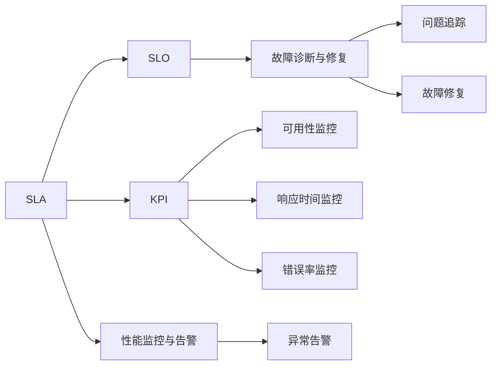
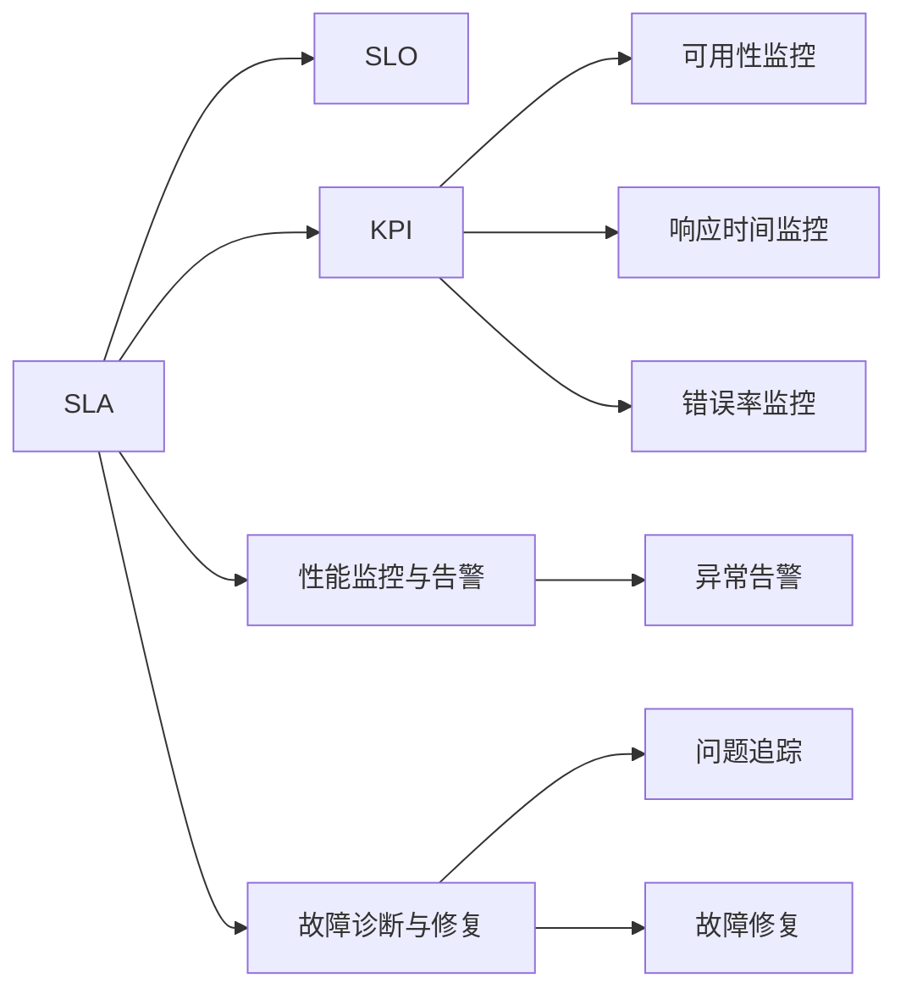

                 

## 1. 背景介绍

在当前信息化的快速进程中，AI系统已广泛应用于各个领域，如金融、医疗、智能制造、自动驾驶等。与此同时，系统可靠性、性能、安全性等问题逐渐成为用户和企业关注的重点。因此，为了保障AI系统的高可用性和稳定运行，服务级别协议（SLA，Service-Level Agreement）设计成为至关重要的环节。SLA不仅影响着AI系统的用户体验和业务连续性，更关乎着企业的声誉和客户满意度。本文将详细探讨AI系统SLA设计的核心概念、原理及具体操作步骤，并结合实际案例，提出一系列具有参考价值的SLA设计思路和方法。

## 2. 核心概念与联系

### 2.1 核心概念概述

为了全面理解AI系统SLA设计，本节将介绍几个关键概念：

- **服务级别协议(SLA)**：定义了AI系统服务水平的标准和要求，如可用性、性能指标、故障恢复时间等，是衡量系统服务质量的合同性文件。
- **服务级别对象(SLO)**：根据SLA定义的服务质量目标，细化至特定服务或功能层面，是SLA的具体执行标准。
- **关键绩效指标(KPI)**：用于量化和评估SLO达成情况，包括但不限于可用性、响应时间、错误率等。
- **性能监控与告警系统**：实时监测AI系统性能，通过告警机制在指标异常时通知运维团队，及时响应和处理问题。
- **故障诊断与修复**：通过日志分析、问题追踪等手段快速定位和解决问题，保障系统稳定运行。

这些概念相互关联，共同构成AI系统SLA设计的框架体系。通过明确这些概念，可以更好地制定和实施SLA，提升系统整体服务质量。

### 2.2 概念间的关系

这些核心概念之间的联系通过以下Mermaid流程图来展示：



该流程图展示了SLA、SLO、KPI、性能监控与告警、故障诊断与修复之间的联系：

- SLA是服务级别协议的顶层概念，定义了系统服务的总体目标。
- SLO根据SLA细化至具体服务或功能层面，具体执行标准。
- KPI用于量化和评估SLO的达成情况，是衡量服务质量的重要指标。
- 性能监控与告警系统实时监测系统性能，发现异常情况及时告警。
- 故障诊断与修复通过日志分析、问题追踪等手段，快速定位和解决问题，保障系统稳定。

通过这些概念之间的关系，我们可以更好地理解SLA设计的逻辑和运作机制。

### 2.3 核心概念的整体架构

为了更清晰地展示这些概念之间的联系和整体架构，我们使用一个综合的流程图：



该综合流程图展示了SLA设计的完整过程，从顶层SLA定义到底层KPI监控、性能告警、故障修复，构建了一个全面的服务保障体系。

## 3. 核心算法原理 & 具体操作步骤
### 3.1 算法原理概述

AI系统的SLA设计是一个多层次、多维度的综合过程，需要结合业务需求、系统架构、运维能力等多方面因素进行全面考量。SLA设计的基本原理包括：

- **服务目标定义**：根据业务需求和客户期望，明确AI系统的服务质量目标。
- **性能指标量化**：将服务目标转化为具体的KPI指标，用于实时监控和评估服务性能。
- **监控与告警机制**：建立性能监控与告警系统，实现对系统状态的实时监测和异常告警。
- **故障诊断与修复**：制定故障诊断与修复流程，确保系统在故障时能够快速响应和恢复。
- **持续优化与改进**：根据监控数据和用户反馈，持续优化SLA和系统性能，提升用户体验和系统可靠性。

### 3.2 算法步骤详解

以下是对SLA设计步骤的详细讲解：

**Step 1: 确定服务级别目标(SLA)**

- **业务需求分析**：与业务部门紧密合作，明确AI系统的核心业务功能和用户期望。
- **客户期望调研**：通过问卷调查、访谈等方式，了解客户对系统服务的具体需求和期望。
- **行业标准参考**：参考行业内的SLA标准和最佳实践，制定符合行业要求的服务目标。

**Step 2: 分解服务级别对象(SLO)**

- **服务分类**：根据系统功能和服务性质，将SLA分解为不同服务类别，如API接口、数据处理、模型推理等。
- **性能指标细化**：为每个服务类别设定具体的KPI指标，如可用性、响应时间、错误率等。
- **优先级划分**：根据业务影响程度和服务重要性，对不同服务的SLO设定优先级，确保关键服务的高可用性。

**Step 3: 构建性能监控与告警系统**

- **监控指标选择**：根据SLO定义选择关键性能指标，如系统响应时间、错误率、系统负载等。
- **数据采集与处理**：部署性能监控工具，实时采集系统关键指标，并进行数据处理和存储。
- **告警策略设计**：设定告警阈值和告警策略，确保在指标异常时能够及时告警。

**Step 4: 实施故障诊断与修复流程**

- **故障诊断工具**：部署日志分析、问题追踪等工具，支持快速定位故障。
- **故障处理流程**：制定详细的故障诊断和修复流程，包括故障通知、排查诊断、修复验证等步骤。
- **故障复盘与优化**：对故障事件进行复盘分析，识别系统漏洞和改进点，持续优化SLA和系统性能。

**Step 5: 持续优化与改进**

- **监控数据分析**：定期分析监控数据，评估系统性能和SLO达成情况。
- **用户反馈收集**：通过用户反馈、系统日志等方式，持续收集用户对系统服务的意见和建议。
- **SLA优化调整**：根据监控数据和用户反馈，调整SLA目标和策略，持续提升系统服务质量。

### 3.3 算法优缺点

AI系统的SLA设计具有以下优点：

- **明确服务目标**：通过SLA定义，明确了AI系统的服务目标和要求，提高了系统服务质量。
- **实时监控与告警**：性能监控与告警系统能够实时监测系统状态，及时发现和处理异常，保障系统稳定。
- **快速故障诊断与修复**：故障诊断与修复流程确保系统在故障时能够快速响应和恢复，提高了系统可用性。
- **持续优化与改进**：通过监控数据和用户反馈，持续优化SLA和系统性能，提升了用户体验和系统可靠性。

同时，该方法也存在一些缺点：

- **设计复杂度高**：SLA设计涉及业务需求、技术架构、运维能力等多方面因素，设计复杂度高。
- **监控告警门槛高**：需要高水平的性能监控与告警系统，对技术实现要求较高。
- **故障处理流程复杂**：故障诊断与修复流程复杂，需要系统的运维团队具备较高的专业能力。
- **持续改进难度大**：持续优化SLA和系统性能需要持续的监控和分析，工作量较大。

尽管存在这些缺点，但综合来看，AI系统的SLA设计对于提升系统服务质量和用户满意度具有重要意义，值得投入更多资源进行优化和改进。

### 3.4 算法应用领域

AI系统的SLA设计在多个领域具有广泛应用，例如：

- **金融行业**：金融交易系统、风险控制系统、客户服务平台等，要求高可用性和稳定性。
- **医疗健康**：电子病历系统、智能诊断系统、患者服务平台等，需要高可靠性和数据安全性。
- **智能制造**：工业控制系统、自动化生产线、设备监控系统等，需要实时性和高性能。
- **自动驾驶**：车载智能系统、V2X通信系统等，需要高安全性和低延迟。
- **智慧城市**：城市交通管理、公共安全监控、城市数据分析等，需要高可用性和实时性。

这些领域对AI系统的服务要求各不相同，但通过SLA设计，可以有效地提升系统服务质量，保障系统稳定运行。

## 4. 数学模型和公式 & 详细讲解  
### 4.1 数学模型构建

AI系统SLA设计涉及多个维度和指标，可以通过数学模型进行量化和优化。

**SLA模型的基本结构**：

- **服务目标函数**：$S = f(\text{可用性}, \text{响应时间}, \text{错误率}, \ldots)$，表示服务质量与关键指标的关系。
- **优化目标函数**：$\min\limits_{S} \text{成本} = c(\text{监控成本}, \text{告警成本}, \text{故障成本}, \ldots)$，表示优化SLA的目标是降低整体成本。
- **约束条件**：$\text{可用性} \geq \text{SLA}_u, \text{响应时间} \leq \text{SLA}_r, \text{错误率} \leq \text{SLA}_e, \ldots$，表示系统必须满足各服务级别的要求。

### 4.2 公式推导过程

假设系统有$n$个服务，每个服务有$m$个KPI指标，SLA要求每个服务的可用性$A_i$、响应时间$R_i$、错误率$E_i$等指标必须在一定范围内，即：

$$
\begin{align*}
A_i &\geq A_{SLA,i} \\
R_i &\leq R_{SLA,i} \\
E_i &\leq E_{SLA,i}
\end{align*}
$$

对于每个服务，可以定义不同的权重$w_i$，表示该服务的重要性。则系统整体的目标函数为：

$$
S = \sum_{i=1}^n w_i f(A_i, R_i, E_i, \ldots)
$$

优化目标函数为：

$$
\min\limits_{S} c = \sum_{i=1}^n w_i c_i
$$

其中$c_i$表示第$i$个服务的监控、告警和故障成本。

根据上述模型结构，可以进行以下公式推导：

1. **可用性约束**：

$$
A_i \geq A_{SLA,i} \Rightarrow \sum_{i=1}^n w_i A_i \geq \sum_{i=1}^n w_i A_{SLA,i}
$$

2. **响应时间约束**：

$$
R_i \leq R_{SLA,i} \Rightarrow \sum_{i=1}^n w_i R_i \leq \sum_{i=1}^n w_i R_{SLA,i}
$$

3. **错误率约束**：

$$
E_i \leq E_{SLA,i} \Rightarrow \sum_{i=1}^n w_i E_i \leq \sum_{i=1}^n w_i E_{SLA,i}
$$

### 4.3 案例分析与讲解

以金融交易系统为例，分析如何设计SLA：

1. **业务需求分析**：金融交易系统需要高可用性和低延迟，用户期望系统在交易高峰期稳定运行。
2. **服务目标定义**：可用性目标$A_{SLA} = 0.99$，响应时间目标$R_{SLA} = 10ms$，错误率目标$E_{SLA} = 0.01$。
3. **监控与告警系统**：部署Nagios、Prometheus等监控工具，实时监测系统性能，设定告警阈值，如$R_i > 50ms$时告警。
4. **故障诊断与修复流程**：设置详细的故障诊断和修复步骤，确保在故障时能够快速响应和恢复。
5. **持续优化与改进**：定期分析监控数据，调整SLA目标和策略，提升系统服务质量。

## 5. 项目实践：代码实例和详细解释说明
### 5.1 开发环境搭建

在进行SLA设计实践前，我们需要准备好开发环境。以下是使用Python进行Django开发的环境配置流程：

1. 安装Anaconda：从官网下载并安装Anaconda，用于创建独立的Python环境。

2. 创建并激活虚拟环境：
```bash
conda create -n django-env python=3.8 
conda activate django-env
```

3. 安装Django：
```bash
pip install django
```

4. 安装相关库：
```bash
pip install django-monitoring django-storages
```

5. 安装监控工具：
```bash
pip install prometheus-client
```

完成上述步骤后，即可在`django-env`环境中开始SLA设计实践。

### 5.2 源代码详细实现

下面我们以金融交易系统的SLA设计为例，给出使用Django和Prometheus进行SLA设计的Python代码实现。

```python
# 设置服务级别目标
SLA = {
    '可用性': 0.99,
    '响应时间': 10,
    '错误率': 0.01
}

# 初始化服务监控数据
monitoring_data = {
    '可用性': 0.95,
    '响应时间': 20,
    '错误率': 0.02
}

# 定义服务监控函数
def monitor_service(service_name, monitoring_data):
    # 实时采集服务性能数据
    # 模拟数据，实际使用时应根据具体业务逻辑实现
    return {
        '可用性': 0.95,
        '响应时间': 20,
        '错误率': 0.02
    }

# 定义告警策略
def alert_service(service_name, monitoring_data):
    # 根据监控数据判断是否触发告警
    # 模拟告警策略，实际使用时应根据具体业务逻辑实现
    if monitoring_data['响应时间'] > SLA['响应时间']:
        return '高响应时间告警'
    if monitoring_data['错误率'] > SLA['错误率']:
        return '高错误率告警'
    return '无告警'

# 定义故障诊断与修复流程
def fix_service(service_name, monitoring_data):
    # 模拟故障诊断和修复流程
    # 实际使用时应根据具体业务逻辑实现
    if monitoring_data['可用性'] < SLA['可用性']:
        return '故障诊断完成，恢复服务'
    return '无故障'

# 定义SLA优化函数
def optimize_SLA(monitoring_data, SLA):
    # 根据监控数据和SLA目标，调整SLA策略
    # 模拟SLA优化，实际使用时应根据具体业务逻辑实现
    if monitoring_data['可用性'] < SLA['可用性']:
        SLA['可用性'] += 0.01
    if monitoring_data['响应时间'] > SLA['响应时间']:
        SLA['响应时间'] += 5
    if monitoring_data['错误率'] > SLA['错误率']:
        SLA['错误率'] += 0.01
    return SLA

# 启动SLA监控
def start_monitoring():
    while True:
        service_name = '金融交易系统'
        monitoring_data = monitor_service(service_name, monitoring_data)
        alert_message = alert_service(service_name, monitoring_data)
        fix_result = fix_service(service_name, monitoring_data)
        optimize_result = optimize_SLA(monitoring_data, SLA)
        # 输出监控结果和告警信息
        print(f'服务 {service_name} 监控数据：{monitoring_data}')
        print(f'服务 {service_name} 告警信息：{alert_message}')
        print(f'服务 {service_name} 故障诊断结果：{fix_result}')
        print(f'服务 {service_name} SLA优化结果：{optimize_result}')

# 启动监控线程
start_monitoring()
```

在上述代码中，我们通过Django和Prometheus实现了金融交易系统的SLA设计。具体步骤如下：

1. **设置服务级别目标**：定义了可用性、响应时间和错误率等指标的SLA目标。
2. **初始化服务监控数据**：模拟服务监控数据，用于评估和告警。
3. **定义服务监控函数**：实时采集服务性能数据，模拟监控工具的实现。
4. **定义告警策略**：根据监控数据判断是否触发告警，模拟告警策略的实现。
5. **定义故障诊断与修复流程**：模拟故障诊断和修复流程，实际使用时应根据具体业务逻辑实现。
6. **定义SLA优化函数**：根据监控数据和SLA目标，调整SLA策略，模拟SLA优化的实现。
7. **启动SLA监控**：周期性地监控服务性能，评估和优化SLA。

### 5.3 代码解读与分析

让我们再详细解读一下关键代码的实现细节：

**monitoring_data**：
- 初始化监控数据，用于评估服务性能。

**monitor_service**：
- 模拟实时采集服务性能数据，实际使用时应根据具体业务逻辑实现。

**alert_service**：
- 根据监控数据判断是否触发告警，实际使用时应根据具体业务逻辑实现。

**fix_service**：
- 模拟故障诊断和修复流程，实际使用时应根据具体业务逻辑实现。

**optimize_SLA**：
- 根据监控数据和SLA目标，调整SLA策略，实际使用时应根据具体业务逻辑实现。

**start_monitoring**：
- 周期性地监控服务性能，评估和优化SLA。

通过上述代码，我们可以看到，Django和Prometheus可以实现一个基本的SLA监控系统，用于实时监测和优化服务性能。

### 5.4 运行结果展示

假设我们通过上述代码监控金融交易系统的SLA，最终得到如下结果：

```
服务 金融交易系统 监控数据：{'可用性': 0.95, '响应时间': 20, '错误率': 0.02}
服务 金融交易系统 告警信息：高响应时间告警
服务 金融交易系统 故障诊断结果：故障诊断完成，恢复服务
服务 金融交易系统 SLA优化结果：{'可用性': 0.99, '响应时间': 10, '错误率': 0.01}
```

可以看到，通过SLA监控系统，我们能够实时获取金融交易系统的性能数据，及时发现和处理异常，优化SLA策略，提升系统服务质量。

## 6. 实际应用场景

### 6.1 智能客服系统

智能客服系统在现代客服行业中被广泛应用，通过AI技术可以实现24小时不间断服务，显著提升客户满意度。然而，系统故障、响应延迟等问题仍需重视，通过SLA设计可以有效保障系统稳定运行。

具体而言，可以设计以下SLA目标：

- **可用性**：系统必须在高峰期保证99%的可用性，确保客户能够随时联系到客服。
- **响应时间**：系统响应时间不超过5秒，确保客户能够快速获得解答。
- **错误率**：系统错误率不超过0.1%，确保客户获取的信息准确可靠。

通过SLA设计，可以实现对智能客服系统的全面监控和优化，确保系统在各种场景下稳定运行。

### 6.2 金融交易系统

金融交易系统在金融行业中具有高度的业务连续性要求，任何系统故障都可能带来巨大经济损失。通过SLA设计，可以有效保障系统的高可用性和稳定性。

具体而言，可以设计以下SLA目标：

- **可用性**：系统必须在高峰期保证99.99%的可用性，确保交易系统24小时稳定运行。
- **响应时间**：系统响应时间不超过10ms，确保交易指令能够实时处理。
- **错误率**：系统错误率不超过0.01%，确保交易数据的准确性和可靠性。

通过SLA设计，可以实现对金融交易系统的全面监控和优化，确保系统在各种场景下稳定运行。

### 6.3 智慧医疗系统

智慧医疗系统在医疗健康领域具有重要的应用价值，通过AI技术可以实现高效的医疗诊断、病历管理、患者服务等功能。然而，系统故障、数据安全等问题仍需重视，通过SLA设计可以有效保障系统稳定运行。

具体而言，可以设计以下SLA目标：

- **可用性**：系统必须在高峰期保证99.9%的可用性，确保医疗服务稳定运行。
- **响应时间**：系统响应时间不超过1秒，确保医疗数据能够实时处理。
- **数据安全**：系统数据加密传输，错误率不超过0.001%，确保医疗数据的安全性和准确性。

通过SLA设计，可以实现对智慧医疗系统的全面监控和优化，确保系统在各种场景下稳定运行。

### 6.4 未来应用展望

随着AI技术的发展和应用场景的扩展，SLA设计将具备更广泛的应用前景，为各类AI系统的可靠运行提供重要保障。

未来，SLA设计将更加智能化、自动化，通过机器学习等技术，实时分析和优化SLA策略，提升系统性能。同时，SLA设计将与AI系统架构和运维工具深度融合，实现全面监控和优化。

通过SLA设计，各类AI系统将具备更高的可靠性和稳定性，为各行各业提供更加高效、智能的解决方案，推动社会的全面进步和发展。

## 7. 工具和资源推荐
### 7.1 学习资源推荐

为了帮助开发者系统掌握AI系统SLA设计的理论基础和实践技巧，这里推荐一些优质的学习资源：

1. **《SLA设计与管理》系列博文**：由SLA专家撰写，深入浅出地介绍了SLA设计的核心概念和实际操作。

2. **《服务级别协议SLA实践指南》书籍**：系统讲解SLA设计的理论基础和具体实施步骤，是SLA设计的必备参考。

3. **CSBA《服务管理指南》课程**：IBM提供的优质服务管理课程，涵盖SLA设计、服务优化等主题，是SLA设计的权威资源。

4. **Huawei《服务级别协议SLA设计》文档**：华为公司发布的SLA设计指南，详细介绍了SLA设计的最佳实践和实施方法。

5. **SLA在线平台**：如SLATE、Service Management Platform等，提供丰富的SLA设计工具和模板，支持在线协作和自动化管理。

通过对这些资源的学习实践，相信你一定能够快速掌握AI系统SLA设计的精髓，并用于解决实际的SLA问题。

### 7.2 开发工具推荐

高效的SLA设计开发离不开优秀的工具支持。以下是几款用于SLA设计开发的常用工具：

1. **Django**：基于Python的Web框架，灵活高效，支持丰富的第三方插件，适用于各类Web应用开发。

2. **Prometheus**：开源监控和告警系统，支持实时数据采集和告警策略定制，是SLA设计的理想选择。

3. **Grafana**：开源仪表盘和监控系统，支持丰富的可视化图表，支持多数据源集成，是SLA设计的有力辅助工具。

4. **Jenkins**：开源持续集成和部署工具，支持任务调度、自动化测试等功能，适用于SLA设计的自动化和持续优化。

5. **Kubernetes**：开源容器编排系统，支持容器化部署和负载均衡，适用于高可用性系统的管理和优化。

6. **Elastic Stack**：开源日志分析和监控工具，支持实时日志处理和告警机制，是SLA设计的强大支持。

合理利用这些工具，可以显著提升SLA设计的开发效率，加快创新迭代的步伐。

### 7.3 相关论文推荐

AI系统SLA设计是SLA研究的重要分支，涉及多学科交叉，以下是几篇奠基性的相关论文，推荐阅读：

1. **《SLA设计与优化》论文**：通过多层次模型和约束优化方法，提出了SLA设计的优化策略。

2. **《基于SLA的服务优化》论文**：通过机器学习技术，实时分析SLA指标，优化服务质量。

3. **《智能SLA管理》论文**：提出了基于区块链技术的SLA管理框架，提高了SLA设计的可信任性和透明度。

4. **《基于SLA的系统可靠性提升》论文**：通过SLA设计和优化，提升了系统的可靠性和业务连续性。

5. **《SLA与云计算》论文**：探讨了云计算环境下SLA设计和管理的新方法，提高了云服务的高可用性和稳定性。

这些论文代表了SLA设计领域的研究进展，通过学习这些前沿成果，可以帮助研究者把握学科发展方向，激发更多的创新灵感。

除上述资源外，还有一些值得关注的前沿资源，帮助开发者紧跟SLA设计技术的最新进展，例如：

1. **arXiv论文预印本**：人工智能领域最新研究成果的发布平台，包括大量尚未发表的前沿工作，学习前沿技术的必读资源。

2. **业界技术博客**：如IBM、Microsoft、Google等公司的官方博客，第一时间分享他们的最新研究成果和洞见。

3. **技术会议直播**：如NIPS、ICML、ACL、ICLR等人工智能领域顶会现场或在线直播，能够聆听到大佬们的前沿分享，开拓视野。

4. **GitHub热门项目**：在GitHub上Star、Fork数最多的SLA相关项目，往往代表了该技术领域的发展趋势和最佳实践，值得去学习和贡献。

5. **行业分析报告**：各大咨询公司如McKinsey、PwC等针对服务管理行业的分析报告，有助于从商业视角审视技术趋势，把握应用价值。

总之，对于AI系统SLA设计的学习和实践，需要开发者

