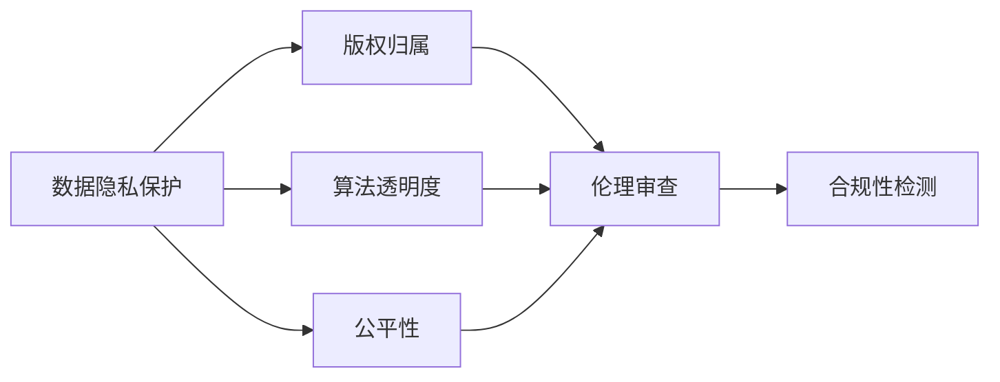
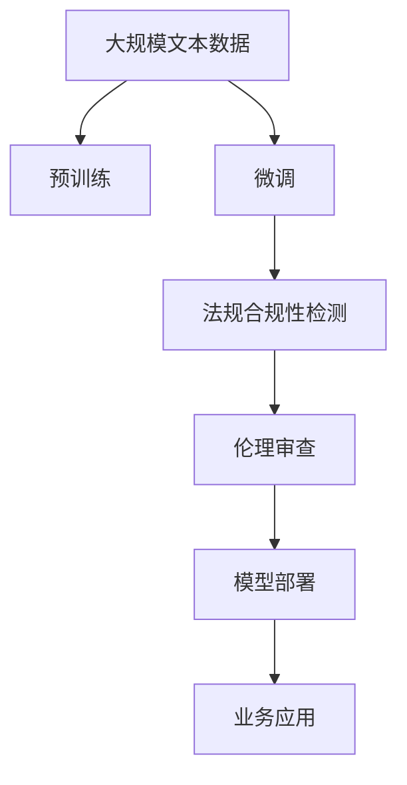

                 

# 大语言模型应用的法规合规性

## 1. 背景介绍

随着人工智能技术的发展，尤其是大语言模型（Large Language Models, LLMs）的出现，其在自然语言处理（Natural Language Processing, NLP）、智能客服、金融风控、医疗诊断等领域的应用越来越广泛。然而，这些模型的强大功能也带来了新的挑战，尤其是在数据隐私、内容合规、公平性等方面的法规合规性问题。大语言模型应用的法规合规性问题不仅是技术难题，也是伦理和法律挑战，需要我们深入探讨并寻求解决方案。

### 1.1 问题由来
大语言模型的应用依赖于大规模无标签文本数据进行预训练，并通过有标签数据进行微调（Fine-tuning）。这些数据可能来自多种来源，包括社交媒体、公开数据集、商业数据等。由于数据涉及个人隐私、版权、伦理等多方面问题，如何在法律框架内合理使用这些数据，确保模型应用的合规性，成为了一项重要的课题。

### 1.2 问题核心关键点
大语言模型应用的法规合规性问题涉及以下几个核心关键点：
- **数据隐私保护**：如何处理和保护用户数据，防止数据泄露和滥用。
- **版权归属**：模型训练使用的数据是否侵犯了原作者的版权。
- **公平性**：模型在特定群体上的表现是否公正，是否存在偏见和歧视。
- **算法透明度**：模型的决策过程是否可解释，是否符合相关法律法规的要求。
- **伦理审查**：模型应用的伦理考量，如避免对社会产生负面影响。

### 1.3 问题研究意义
研究大语言模型应用的法规合规性问题，对于保障数据隐私、维护版权、促进模型公平性、确保算法透明性和遵守伦理规范具有重要意义。同时，也有助于推动大语言模型技术的健康发展，防止其被滥用，保护公众利益。

## 2. 核心概念与联系

### 2.1 核心概念概述

为更好地理解大语言模型应用的法规合规性问题，本节将介绍几个关键概念及其相互联系：

- **数据隐私保护**：指在数据处理过程中，如何保护个人或机构的信息不被泄露或滥用，特别是在大数据时代。
- **版权归属**：指在模型训练和应用过程中，数据的版权归属于谁，是否合法使用。
- **公平性**：指模型在各种人群中的表现是否公平，是否存在偏见。
- **算法透明度**：指模型的决策过程是否可解释，是否透明。
- **伦理审查**：指在模型应用前，如何对其进行伦理审查，确保其符合社会道德和法律要求。

这些核心概念之间存在紧密联系，构成了大语言模型应用的法规合规性框架。

### 2.2 概念间的关系

这些概念之间的关系可以通过以下Mermaid流程图来展示：



这个流程图展示了数据隐私保护、版权归属、算法透明度、公平性、伦理审查以及合规性检测之间的逻辑关系。数据隐私保护和版权归属是大语言模型应用的前提，算法透明度和公平性是模型应用中必须遵守的规范，伦理审查是对模型应用的最终把关，而合规性检测则是确保模型符合法律法规的具体手段。

### 2.3 核心概念的整体架构

最后，我们用一个综合的流程图来展示这些核心概念在大语言模型应用中的整体架构：



这个综合流程图展示了从预训练到微调，再到法规合规性检测和模型部署的完整过程。法规合规性检测和伦理审查在大语言模型应用的每个环节中都是不可或缺的，确保模型符合法律法规要求，保障社会公众利益。

## 3. 核心算法原理 & 具体操作步骤

### 3.1 算法原理概述

大语言模型应用的法规合规性问题，本质上是在预训练和微调过程中，如何确保数据的合法使用、隐私保护以及模型的公平性和透明度。这一过程涉及到算法原理和具体操作步骤的精细设计。

### 3.2 算法步骤详解

大语言模型应用的法规合规性检测和伦理审查主要包括以下几个关键步骤：

**Step 1: 数据准备**
- 收集和清洗预训练数据，确保数据来源合法，不涉及侵犯隐私和版权的问题。
- 对数据进行匿名化处理，保护个人隐私信息。

**Step 2: 预训练**
- 在合法的公共数据集上进行预训练，确保数据来源合法，不侵犯版权。
- 在预训练过程中，避免使用可能包含敏感信息的文本数据。

**Step 3: 微调**
- 根据具体任务需求，选择适合的任务适配层，进行有监督微调。
- 在微调过程中，确保数据来源合法，不侵犯版权。
- 使用适当的正则化和对抗训练技术，提高模型的鲁棒性和公平性。

**Step 4: 法规合规性检测**
- 在模型训练和部署过程中，进行法规合规性检测，确保模型符合相关法律法规要求。
- 检测模型输出是否存在偏见和歧视，确保模型的公平性。
- 检测模型的决策过程是否可解释，确保算法透明度。

**Step 5: 伦理审查**
- 对模型应用的伦理问题进行审查，确保模型不涉及违法和不道德行为。
- 审查模型对不同人群的表现是否公平，避免歧视。
- 确保模型的应用符合伦理和法律要求，对社会有益。

**Step 6: 模型部署和应用**
- 在符合法规和伦理要求的前提下，将模型部署到实际应用场景中。
- 监控模型性能和应用效果，确保模型应用的合规性和公平性。
- 定期更新模型，避免模型过时和偏见，保持模型的长期有效性。

### 3.3 算法优缺点

大语言模型应用的法规合规性检测和伦理审查方法具有以下优点：
- **合法合规**：确保模型训练和应用过程中的数据来源合法，不侵犯版权和隐私。
- **公平透明**：提高模型的公平性和透明度，避免偏见和歧视，符合伦理和法律要求。
- **风险控制**：通过法规合规性检测和伦理审查，降低模型应用的法律和伦理风险。

然而，这些方法也存在一些缺点：
- **成本高**：法规合规性检测和伦理审查需要大量时间和资源，增加了模型应用的成本。
- **技术复杂**：法规合规性和伦理审查的技术实现较为复杂，需要专业知识。
- **动态变化**：法律法规和伦理标准会随着时间和政策变化而调整，模型需要持续更新以适应新要求。

### 3.4 算法应用领域

大语言模型应用的法规合规性检测和伦理审查方法在多个领域都有应用：

- **医疗诊断**：确保医疗数据隐私保护，避免诊断偏见，提高诊断公平性。
- **金融风控**：确保金融数据的合法使用，避免模型歧视，保障金融公平性。
- **智能客服**：确保客户数据隐私保护，避免对话偏见，提高服务公平性。
- **智能推荐**：确保用户数据的合法使用，避免推荐偏见，提高推荐公平性。

这些领域对数据隐私和公平性要求较高，因此法规合规性检测和伦理审查尤为重要。

## 4. 数学模型和公式 & 详细讲解 & 举例说明

### 4.1 数学模型构建

大语言模型应用的法规合规性检测和伦理审查涉及多个数学模型，包括隐私保护模型、版权检测模型、公平性评估模型等。以下以隐私保护模型为例，构建隐私保护数学模型：

假设训练集为 $D=\{(x_i,y_i)\}_{i=1}^N$，其中 $x_i$ 为输入，$y_i$ 为标签，$x_i$ 的隐私敏感属性为 $a_i \in A$。隐私保护的目标是最小化模型在隐私敏感属性上的误差，同时保证模型在隐私保护下的性能不降低。

定义隐私保护损失函数为：

$$
\mathcal{L}_{privacy} = \sum_{i=1}^N \ell(x_i, y_i) + \lambda \sum_{i=1}^N \log p(a_i | x_i)
$$

其中 $\ell$ 为模型在输入上的损失函数，$p$ 为隐私敏感属性的概率分布，$\lambda$ 为隐私保护的正则化系数。

### 4.2 公式推导过程

在隐私保护模型中，我们引入隐私敏感属性 $a_i$ 的概率 $p(a_i | x_i)$，用于表示隐私敏感属性 $a_i$ 的隐私风险。隐私保护目标是最小化模型在隐私敏感属性上的误差，同时保证模型在隐私保护下的性能不降低。

定义隐私保护损失函数为：

$$
\mathcal{L}_{privacy} = \sum_{i=1}^N \ell(x_i, y_i) + \lambda \sum_{i=1}^N \log p(a_i | x_i)
$$

其中 $\ell$ 为模型在输入上的损失函数，$p$ 为隐私敏感属性的概率分布，$\lambda$ 为隐私保护的正则化系数。

在训练过程中，我们可以使用梯度下降等优化算法，最小化隐私保护损失函数：

$$
\theta = \mathop{\arg\min}_{\theta} \mathcal{L}_{privacy}
$$

其中 $\theta$ 为模型参数，$\mathcal{L}_{privacy}$ 为隐私保护损失函数。

### 4.3 案例分析与讲解

假设我们有一组训练集数据，其中包含隐私敏感属性 $a_i$，如性别、种族等。在训练模型时，我们需要对这些隐私敏感属性进行隐私保护，以防止数据泄露和滥用。

首先，我们需要对隐私敏感属性进行去标识化处理，使其难以与具体个体关联。例如，对性别属性进行泛化处理，将 "男" 和 "女" 合并为一个泛化属性 "性别"，并计算其概率分布。

然后，我们将隐私敏感属性的概率分布作为正则化项，加入到模型训练的损失函数中。通过调整正则化系数 $\lambda$，可以控制隐私保护的强度。

最后，通过优化算法，最小化隐私保护损失函数，训练出在隐私保护下性能最优的模型。

## 5. 项目实践：代码实例和详细解释说明

### 5.1 开发环境搭建

在进行隐私保护模型实践前，我们需要准备好开发环境。以下是使用Python进行PyTorch开发的环境配置流程：

1. 安装Anaconda：从官网下载并安装Anaconda，用于创建独立的Python环境。

2. 创建并激活虚拟环境：
```bash
conda create -n pytorch-env python=3.8 
conda activate pytorch-env
```

3. 安装PyTorch：根据CUDA版本，从官网获取对应的安装命令。例如：
```bash
conda install pytorch torchvision torchaudio cudatoolkit=11.1 -c pytorch -c conda-forge
```

4. 安装TensorFlow：从官网下载并安装TensorFlow。

5. 安装各类工具包：
```bash
pip install numpy pandas scikit-learn matplotlib tqdm jupyter notebook ipython
```

完成上述步骤后，即可在`pytorch-env`环境中开始隐私保护模型的实践。

### 5.2 源代码详细实现

这里我们以隐私保护模型为例，给出使用PyTorch进行隐私保护的代码实现。

首先，定义隐私保护模型：

```python
import torch
from torch.utils.data import Dataset
from torch import nn

class PrivacyModel(nn.Module):
    def __init__(self):
        super(PrivacyModel, self).__init__()
        self.layers = nn.Sequential(
            nn.Linear(input_size, hidden_size),
            nn.ReLU(),
            nn.Linear(hidden_size, output_size)
        )
    
    def forward(self, x):
        x = self.layers(x)
        return x
```

然后，定义训练集和隐私敏感属性：

```python
class PrivacyDataset(Dataset):
    def __init__(self, data, labels, sensitive_attrs):
        self.data = data
        self.labels = labels
        self.sensitive_attrs = sensitive_attrs
        
    def __len__(self):
        return len(self.data)
    
    def __getitem__(self, item):
        x = self.data[item]
        y = self.labels[item]
        sensitive_attr = self.sensitive_attrs[item]
        return x, y, sensitive_attr
```

接着，定义隐私保护损失函数：

```python
class PrivacyLoss(nn.Module):
    def __init__(self, sensitive_attrs, lambda_p=1e-5):
        super(PrivacyLoss, self).__init__()
        self.sensitive_attrs = sensitive_attrs
        self.lambda_p = lambda_p
        
    def forward(self, model, data, labels, sensitive_attr):
        x, y, sensitive_attr = data
        x = model(x)
        loss = nn.CrossEntropyLoss()(x, y)
        p = self.calculate_probability(sensitive_attr)
        p_loss = self.lambda_p * torch.log(p)
        total_loss = loss + p_loss
        return total_loss
    
    def calculate_probability(self, sensitive_attr):
        # 计算隐私敏感属性的概率分布
        # 具体实现取决于隐私敏感属性的处理方式
        return p
```

最后，定义训练函数和训练过程：

```python
from transformers import BertTokenizer
from torch.utils.data import DataLoader
from tqdm import tqdm

def train(model, dataloader, optimizer, device, epochs=5, lambda_p=1e-5):
    model.train()
    for epoch in range(epochs):
        total_loss = 0
        for batch in tqdm(dataloader):
            x, y, sensitive_attr = batch
            x = x.to(device)
            y = y.to(device)
            sensitive_attr = sensitive_attr.to(device)
            optimizer.zero_grad()
            loss = PrivacyLoss(sensitive_attrs=sensitive_attrs, lambda_p=lambda_p)(model, x, y, sensitive_attr)
            loss.backward()
            optimizer.step()
            total_loss += loss.item()
        print(f"Epoch {epoch+1}, loss: {total_loss/len(dataloader)}")
```

以上就是使用PyTorch进行隐私保护模型的完整代码实现。可以看到，通过引入隐私保护损失函数，我们在模型训练过程中同时考虑了隐私保护目标，保护了隐私敏感属性的信息。

### 5.3 代码解读与分析

让我们再详细解读一下关键代码的实现细节：

**PrivacyModel类**：
- 定义了一个简单的全连接神经网络，用于隐私保护模型的训练。

**PrivacyDataset类**：
- 用于构建训练集，并包含隐私敏感属性。

**PrivacyLoss类**：
- 定义了隐私保护损失函数，包括模型损失和隐私敏感属性损失。

**train函数**：
- 定义了模型的训练过程，包括模型前向传播、损失计算和反向传播。

可以看到，通过这些代码实现，我们能够在模型训练过程中，同时考虑隐私保护目标，保护隐私敏感属性，实现大语言模型应用的法规合规性要求。

## 6. 实际应用场景

### 6.1 智能客服系统

智能客服系统的应用需要处理大量的客户对话数据，涉及隐私敏感属性，如用户ID、联系方式等。为确保客户数据隐私保护，需要在模型训练和应用过程中，进行隐私保护处理。

具体而言，可以采用数据去标识化、隐私敏感属性泛化等方法，在模型训练过程中进行隐私保护。同时，在模型应用过程中，也需要对用户数据进行加密处理，确保数据不被滥用。

### 6.2 金融风控

金融风控系统需要对大量的用户行为数据进行建模，涉及隐私敏感属性，如用户姓名、身份证号码等。为确保用户数据隐私保护，需要在模型训练和应用过程中，进行隐私保护处理。

具体而言，可以采用数据去标识化、隐私敏感属性泛化等方法，在模型训练过程中进行隐私保护。同时，在模型应用过程中，也需要对用户数据进行加密处理，确保数据不被滥用。

### 6.3 医疗诊断

医疗诊断系统需要对大量的患者数据进行建模，涉及隐私敏感属性，如患者姓名、病历记录等。为确保患者数据隐私保护，需要在模型训练和应用过程中，进行隐私保护处理。

具体而言，可以采用数据去标识化、隐私敏感属性泛化等方法，在模型训练过程中进行隐私保护。同时，在模型应用过程中，也需要对患者数据进行加密处理，确保数据不被滥用。

### 6.4 未来应用展望

随着大语言模型的不断发展，其在各个领域的应用将越来越广泛。未来，大语言模型的法规合规性问题将更加复杂和多样化。

未来，大语言模型应用的法规合规性问题将更加关注以下几个方面：

- **多模态数据隐私保护**：随着大语言模型应用的扩展，将涉及更多的数据类型，如图像、音频等。如何保护多模态数据的隐私，将是未来的挑战。

- **自动化隐私保护**：未来的隐私保护技术将更加自动化，能够自动识别和保护隐私敏感属性。

- **跨领域隐私保护**：未来的隐私保护技术将更加跨领域，能够自动适应不同行业和领域的隐私保护要求。

- **隐私保护的动态调整**：未来的隐私保护技术将能够根据数据分布的变化，动态调整隐私保护策略，适应不断变化的隐私保护需求。

总之，大语言模型应用的法规合规性问题将是未来人工智能应用的重要研究方向，需要我们不断探索和创新，以应对未来的挑战。

## 7. 工具和资源推荐

### 7.1 学习资源推荐

为了帮助开发者系统掌握大语言模型应用的法规合规性问题，这里推荐一些优质的学习资源：

1. 《数据隐私保护原理与技术》书籍：全面介绍了数据隐私保护的基本原理和技术方法，适用于初学者和专业人士。

2. 《深度学习与隐私保护》课程：由国际知名隐私保护专家讲授，涵盖深度学习和隐私保护的最新进展，适合深入学习。

3. 《联邦学习》书籍：介绍了联邦学习的基本原理和技术实现，适用于研究联邦学习在隐私保护中的应用。

4. 《区块链技术与应用》课程：区块链技术提供了分布式和不可篡改的数据存储方式，适用于研究隐私保护技术的新方向。

5. 《隐私保护算法设计与实现》论文：介绍了各种隐私保护算法的原理和实现方法，适用于算法实现和论文撰写。

通过对这些资源的学习实践，相信你一定能够系统掌握大语言模型应用的法规合规性问题，并用于解决实际的问题。

### 7.2 开发工具推荐

高效的开发离不开优秀的工具支持。以下是几款用于大语言模型应用的法规合规性检测和伦理审查的常用工具：

1. PyTorch：基于Python的开源深度学习框架，适合快速迭代研究。

2. TensorFlow：由Google主导开发的开源深度学习框架，适合大规模工程应用。

3. TensorBoard：TensorFlow配套的可视化工具，实时监测模型训练状态，提供丰富的图表呈现方式。

4. Weights & Biases：模型训练的实验跟踪工具，记录和可视化模型训练过程中的各项指标，方便对比和调优。

5. Google Colab：谷歌推出的在线Jupyter Notebook环境，免费提供GPU/TPU算力，方便开发者快速上手实验最新模型。

合理利用这些工具，可以显著提升大语言模型应用的法规合规性检测和伦理审查的开发效率，加快创新迭代的步伐。

### 7.3 相关论文推荐

大语言模型应用的法规合规性问题涉及多个学科的交叉，研究者可以从不同角度进行探索。以下是几篇奠基性的相关论文，推荐阅读：

1. 《深度学习中的隐私保护技术》：介绍了深度学习中的隐私保护技术，包括差分隐私、联邦学习等。

2. 《基于区块链的隐私保护研究》：研究了区块链技术在隐私保护中的应用，适用于研究隐私保护的最新进展。

3. 《联邦学习在NLP任务中的应用》：介绍了联邦学习在NLP任务中的实际应用，适用于研究隐私保护技术在实际场景中的效果。

4. 《深度学习中的公平性问题》：介绍了深度学习中的公平性问题，包括模型偏见、数据偏见等。

5. 《大数据隐私保护技术研究》：介绍了大数据隐私保护的基本技术和方法，适用于研究隐私保护的实际应用。

这些论文代表了大语言模型应用的法规合规性问题的研究脉络，通过学习这些前沿成果，可以帮助研究者把握学科前进方向，激发更多的创新灵感。

除上述资源外，还有一些值得关注的前沿资源，帮助开发者紧跟大语言模型应用的法规合规性问题的最新进展，例如：

1. arXiv论文预印本：人工智能领域最新研究成果的发布平台，包括大量尚未发表的前沿工作，学习前沿技术的必读资源。

2. 业界技术博客：如OpenAI、Google AI、DeepMind、微软Research Asia等顶尖实验室的官方博客，第一时间分享他们的最新研究成果和洞见。

3. 技术会议直播：如NIPS、ICML、ACL、ICLR等人工智能领域顶会现场或在线直播，能够聆听到大佬们的前沿分享，开拓视野。

4. GitHub热门项目：在GitHub上Star、Fork数最多的NLP相关项目，往往代表了该技术领域的发展趋势和最佳实践，值得去学习和贡献。

5. 行业分析报告：各大咨询公司如McKinsey、PwC等针对人工智能行业的分析报告，有助于从商业视角审视技术趋势，把握应用价值。

总之，对于大语言模型应用的法规合规性问题的学习，需要开发者保持开放的心态和持续学习的意愿。多关注前沿资讯，多动手实践，多思考总结，必将收获满满的成长收益。

## 8. 总结：未来发展趋势与挑战

### 8.1 总结

本文对大语言模型应用的法规合规性问题进行了全面系统的介绍。首先阐述了大语言模型应用的法规合规性问题的重要性，明确了隐私保护、版权归属、公平性、算法透明度和伦理审查在大语言模型应用中的关键作用。接着，从原理到实践，详细讲解了隐私保护模型的构建、隐私保护损失函数的推导以及隐私保护算法的实现。最后，本文还给出了隐私保护模型在实际应用中的代码实现和具体应用场景，展示了隐私保护模型在大语言模型应用中的重要性和实际价值。

通过本文的系统梳理，可以看到，大语言模型应用的法规合规性问题涉及多个学科的交叉，是一个复杂而重要的研究领域。在数据隐私保护、版权归属、公平性、算法透明度和伦理审查等方面，我们需要深入理解相关法律法规和伦理要求，并利用先进的隐私保护技术，确保大语言模型应用的合规性和公平性。

### 8.2 未来发展趋势

展望未来，大语言模型应用的法规合规性问题将呈现以下几个发展趋势：

1. **隐私保护的自动化和智能化**：未来的隐私保护技术将更加自动化和智能化，能够自动识别和保护隐私敏感属性。

2. **跨领域隐私保护**：未来的隐私保护技术将更加跨领域，能够自动适应不同行业和领域的隐私保护要求。

3. **联邦学习的应用**：联邦学习将在大语言模型应用的隐私保护中发挥重要作用，通过分布式训练，保护数据隐私。

4. **区块链技术的应用**：区块链技术将在大语言模型应用的隐私保护中得到广泛应用，提供分布式和不可篡改的数据存储方式。

5. **隐私保护技术的融合**：未来的隐私保护技术将与其他技术进行更深入的融合，如因果推理、强化学习等，实现更全面、更高效的隐私保护。

6. **隐私保护技术的标准化**：未来，隐私保护技术将逐步实现标准化，形成一套完善的隐私保护标准和规范。

以上趋势凸显了大语言模型应用中隐私保护技术的广阔前景。这些方向的探索发展，必将进一步提升大语言模型应用的合规性和安全性，保障用户利益和社会公众利益。

### 8.3 面临的挑战

尽管大语言模型应用的法规合规性问题在技术上已经取得了一定的进展，但在实践中仍面临诸多挑战：

1. **隐私保护的复杂性**：隐私保护的实现过程复杂，涉及数据去标识化、差分隐私、联邦学习等多种技术，需要专业知识。

2. **隐私保护的动态性**：数据分布和法律法规会随着时间和政策变化而调整，隐私保护技术需要动态调整以适应新要求。

3. **隐私保护的资源消耗**：隐私保护技术的实现需要大量的计算资源和存储资源，增加了模型应用的成本。

4. **隐私保护的可解释性**：隐私保护技术本身较为复杂，如何赋予用户对其决策过程的可解释性，仍需进一步探索。

5. **隐私保护的技术整合**：隐私保护技术需要与其他技术进行更深入的融合，如自然语言处理、计算机视觉等，形成更全面、更高效的隐私保护解决方案。

6. **隐私保护的标准化**：目前隐私保护技术尚未形成一套统一的标准和规范，需要进一步研究和推动标准化。

正视隐私保护面临的这些挑战，积极应对并寻求突破，将是大语言模型应用走向成熟的必由之路。相信随着学界和产业界的共同努力，这些挑战终将一一被克服，大语言模型应用的法规合规性问题必将得到更好的解决。

### 8.4 研究展望

面对大语言模型应用的法规合规性问题，未来的研究需要在以下几个方面寻求新的突破：

1. **隐私保护技术的融合创新**：结合因果推理、强化学习等技术，实现更全面、更高效的隐私保护。

2. **跨领域隐私保护的通用性**：研究跨领域隐私保护的基本原理和通用方法，适用于不同行业和领域的应用场景。

3. **隐私保护技术的自动化**：探索自动化隐私保护技术，降低隐私保护的复杂性和资源消耗。

4. **隐私保护技术的标准化**：推动隐私保护技术的标准化工作，形成一套完善的隐私保护标准和规范。

5. **隐私保护技术的伦理审查**：引入伦理审查机制，确保隐私保护技术的伦理性和合规性。

这些研究方向的探索，必将引领大语言模型应用的法规合规性问题迈向更高的台阶，为构建安全、可靠、可解释、可控的智能系统铺平道路。面向未来，大语言模型应用的法规合规性问题还需要与其他人工智能技术进行更深入的融合，如知识表示、因果推理、强化学习等，多路径协同发力，共同推动自然语言理解和智能交互系统的进步。只有勇于创新、敢于突破，才能不断拓展语言模型的边界，让智能技术更好地造福

