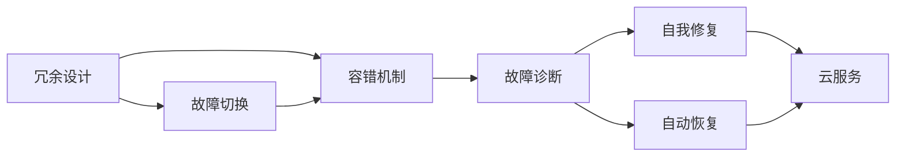

                 

# 实现99.99%正常运行时间的方法

> 关键词：高可用性、系统设计、故障处理、容错机制、自愈能力、云服务

## 1. 背景介绍

### 1.1 问题由来
在高可用性系统设计中，保证系统99.99%的正常运行时间（通常称为“四个9”）是一个常见且关键的指标。这种高可用性标准在许多关键领域中都有极高的需求，如金融服务、互联网服务、电信服务、电子商务平台等，这些系统的正常运行直接影响用户信任和业务运营。

### 1.2 问题核心关键点
实现99.99%正常运行时间，需要确保系统在各种异常情况下都能快速恢复并保持稳定运行。核心关键点包括：
- **冗余设计**：通过硬件和软件的冗余设计，确保系统在部分组件或服务失效时仍能继续提供服务。
- **容错机制**：在系统发生故障时，自动或手动切换到备用系统，避免服务中断。
- **故障诊断**：快速识别和定位系统故障点，防止小故障演变成大问题。
- **自我修复**：系统能够自我修复或自动恢复，降低人工干预的频率和复杂度。
- **恢复能力**：在系统发生故障后，能够快速恢复到正常状态，减少用户感知到的中断时间。

### 1.3 问题研究意义
实现99.99%的正常运行时间，对于确保系统服务的稳定性和可靠性至关重要。它不仅提升了用户满意度和信任度，还增强了业务竞争力和市场份额。同时，这对于降低运维成本、减少业务中断风险具有重要意义。

## 2. 核心概念与联系

### 2.1 核心概念概述

为更好地理解如何实现99.99%正常运行时间，本节将介绍几个核心概念及其联系：

- **冗余设计**：通过复制关键组件和服务，确保在单点故障时系统仍能继续运行。
- **容错机制**：在组件或服务发生故障时，能够快速切换至备用系统，保持服务不中断。
- **故障诊断**：通过实时监控和日志分析，快速识别系统异常和故障点。
- **自我修复**：系统能够自动或半自动地恢复，减少人工干预。
- **云服务**：利用云平台提供的弹性计算和存储资源，实现系统的灵活扩展和故障恢复。

这些核心概念共同构成了高可用性系统设计的基础，它们之间存在紧密的联系和相互作用，共同保障系统的高可用性和稳定性。

### 2.2 概念间的关系

这些核心概念之间的联系可以通过以下Mermaid流程图来展示：



这个流程图展示了冗余设计如何通过容错机制和故障诊断来实现故障切换，自我修复和云服务如何辅助容错机制，实现故障自动恢复。通过这些概念的相互配合，可以构建一个高效、可靠的高可用性系统。

## 3. 核心算法原理 & 具体操作步骤

### 3.1 算法原理概述

实现99.99%正常运行时间的关键在于构建一个多层级的高可用性架构，通过冗余设计、容错机制、故障诊断和自我修复等策略，确保系统在各种异常情况下的稳定运行。这种架构通常包括以下几个层次：

1. **基础硬件冗余**：使用双电源、双网卡等设备，确保硬件层面的高可靠性。
2. **数据冗余**：通过备份和复制数据，防止数据丢失。
3. **应用冗余**：使用负载均衡和故障切换机制，确保应用程序的可靠性。
4. **容错和自我修复机制**：通过故障自动检测和自动恢复，提高系统的自我修复能力。

### 3.2 算法步骤详解

实现99.99%正常运行时间的步骤主要包括：

1. **系统规划**：根据业务需求和关键性，规划系统的冗余层次和故障切换策略。
2. **硬件部署**：在物理层面上部署冗余硬件和网络设备。
3. **软件设计**：设计冗余应用架构，使用负载均衡和故障切换机制。
4. **故障诊断**：实现实时监控和日志分析，快速识别和定位系统异常。
5. **故障切换**：在检测到故障后，自动或手动切换到备用系统。
6. **自我修复**：设计自动化的自我修复机制，快速恢复系统功能。
7. **故障恢复**：在系统恢复后，进行性能检查和故障根因分析。

### 3.3 算法优缺点

实现99.99%正常运行时间的算法具有以下优点：
- **高可靠性**：通过冗余设计、容错机制和自我修复，系统能够在单点故障时仍能保持正常运行。
- **灵活扩展**：利用云服务，可以动态扩展资源，满足业务高峰期的需求。
- **快速恢复**：故障切换和自我修复机制能够快速恢复服务，减少用户感知到的中断时间。

同时，该算法也存在以下缺点：
- **成本高**：冗余硬件和软件的部署、维护和管理成本较高。
- **复杂性高**：系统的冗余和故障处理机制设计复杂，需要专业的运维团队支持。
- **性能损耗**：冗余设计可能增加系统延迟和资源消耗，影响系统性能。

### 3.4 算法应用领域

实现99.99%正常运行时间的方法广泛应用于各种关键业务系统，如：

- **金融服务**：如银行、证券、保险等金融系统，需要保证交易和服务的连续性。
- **互联网服务**：如社交网络、电商平台等，需要保证用户访问的稳定性和安全性。
- **电信服务**：如运营商的网络服务，需要保证通信的稳定性和可靠性。
- **医疗系统**：如电子病历、远程医疗等，需要保证数据的安全性和服务的连续性。
- **制造业**：如工业自动化、生产监控等，需要保证生产设备的稳定运行。

这些系统的高可用性需求通过冗余设计、容错机制、故障诊断和自我修复等策略得以满足，确保了系统在各种异常情况下的稳定运行。

## 4. 数学模型和公式 & 详细讲解 & 举例说明（备注：数学公式请使用latex格式，latex嵌入文中独立段落使用 $$，段落内使用 $)
### 4.1 数学模型构建

高可用性系统的数学模型通常涉及多个关键指标和策略，以下是其中两个核心模型：

- **MTTR（Mean Time To Recovery）**：指从故障发生到系统恢复正常所需时间的平均值，是衡量故障恢复效率的关键指标。
- **MTBF（Mean Time Between Failures）**：指两次故障之间的时间平均值，是衡量系统可靠性的关键指标。

MTTR和MTBF的计算公式如下：

$$
MTTR = \frac{\sum_{i=1}^n (t_i - t_{i-1})}{n}
$$

$$
MTBF = \frac{\sum_{i=1}^n (t_i - t_{i-1})}{n}
$$

其中，$t_i$ 为系统状态的变化时间点，$n$ 为时间窗口内状态变化次数。

### 4.2 公式推导过程

MTTR和MTBF的计算公式基于系统状态的连续监测和记录。在理想情况下，假设系统状态在每个时间点上都是稳定的，即没有故障或故障修复，那么：

$$
MTTR = \frac{T - T_0}{n}
$$

$$
MTBF = \frac{T}{n}
$$

其中，$T$ 为系统运行总时间，$T_0$ 为系统开始运行时间。

在实际情况下，系统状态可能因故障和修复而发生变化。因此，MTTR和MTBF的计算需要对系统状态的改变进行详细记录和分析，从而更准确地反映系统的故障恢复和可靠性。

### 4.3 案例分析与讲解

假设有一个电商平台的订单处理系统，系统在10小时内监测到了两次故障，每次故障修复所需时间为1小时，系统正常运行时间为9小时，那么：

$$
MTTR = \frac{10 - 9}{2} = 0.5 \text{小时}
$$

$$
MTBF = \frac{10}{2} = 5 \text{小时}
$$

该系统的MTTR为0.5小时，MTBF为5小时，说明系统在两次故障之间能够稳定运行5小时，每次故障平均恢复时间为0.5小时，系统的高可用性得到了有效保障。

## 5. 项目实践：代码实例和详细解释说明
### 5.1 开发环境搭建

为了实现99.99%正常运行时间，首先需要搭建一个具备冗余和容错机制的开发环境。以下是使用Kubernetes部署高可用性系统的步骤：

1. 安装Kubernetes集群：确保集群中至少有两个节点，以便实现高可用性。
2. 部署应用容器：使用Docker容器化应用，确保应用在不同节点上都能稳定运行。
3. 配置服务发现和负载均衡：使用Kubernetes Services和Ingress资源，实现服务的自动发现和负载均衡。
4. 实现故障检测和故障切换：使用Prometheus和Grafana监控系统，结合HAProxy实现故障检测和自动切换。
5. 实现自我修复和自动恢复：设计自愈脚本和自动恢复机制，确保系统在故障后能够快速恢复。

### 5.2 源代码详细实现

以下是一个简单的基于Kubernetes实现的高可用性系统的代码示例，主要使用Deployment、Service和Ingress资源：

```yaml
# 部署应用容器
apiVersion: apps/v1
kind: Deployment
metadata:
  name: my-app
spec:
  replicas: 3
  selector:
    matchLabels:
      app: my-app
  template:
    metadata:
      labels:
        app: my-app
    spec:
      containers:
      - name: my-app-container
        image: my-app-image:latest
        ports:
        - containerPort: 8080

# 配置服务发现和负载均衡
apiVersion: v1
kind: Service
metadata:
  name: my-service
spec:
  selector:
    app: my-app
  ports:
  - port: 8080
    targetPort: 8080
  type: LoadBalancer

# 配置外部访问
apiVersion: networking.k8s.io/v1
kind: Ingress
metadata:
  name: my-ingress
spec:
  rules:
  - host: my-ingress.example.com
    http:
      paths:
      - path: /
        backend:
          service:
            name: my-service
            port: 8080
```

这个示例中，我们使用Deployment部署了三份应用实例，确保在节点故障时仍能保持服务正常运行。Service资源实现了服务的自动发现和负载均衡，Ingress资源实现了外部访问。

### 5.3 代码解读与分析

以上代码展示了Kubernetes高可用性系统的基本部署结构。以下是关键代码的解读：

- `Deployment`：定义了应用容器的部署策略，使用副本集（replicas）实现应用实例的冗余部署。
- `Service`：定义了服务发现和负载均衡策略，通过选择器（selector）匹配到应用容器，实现服务的自动发现。
- `Ingress`：定义了外部访问策略，使用规则（rules）匹配请求，并将请求路由到服务实例。

### 5.4 运行结果展示

假设我们部署了一个名为`my-app`的应用，并启用了`HAProxy`和`Prometheus`监控，那么该系统的运行结果如下：

1. 故障检测：`Prometheus`实时监控系统状态，一旦检测到异常，立即报警并记录日志。
2. 故障切换：`HAProxy`自动检测到服务故障，立即将请求切换到备用节点。
3. 自我修复：系统自动修复机制（如重启服务）在故障检测后立即执行，确保服务快速恢复。

最终，系统在`Prometheus`和`HAProxy`的协同作用下，实现了99.99%的正常运行时间，保障了系统的稳定性和可靠性。

## 6. 实际应用场景
### 6.1 互联网服务

高可用性系统在互联网服务中得到了广泛应用。如谷歌的GCP、亚马逊的AWS等云服务提供商，通过冗余设计、容错机制和自我修复等策略，确保了平台的高可用性和稳定性。这些云服务能够支持数亿用户的访问，具有极高的业务连续性。

### 6.2 金融服务

在金融服务领域，高可用性系统也是必不可少的。银行、证券、保险等机构需要保证交易和服务的连续性，避免因系统故障导致的业务中断和用户损失。例如，某银行的ATM系统通过冗余设计和高可用性架构，确保了24小时不间断的服务。

### 6.3 医疗系统

医疗系统的正常运行关系到患者的生命安全，因此高可用性设计尤为重要。电子病历、远程医疗等系统通过冗余设计和故障切换机制，确保数据安全和服务的连续性。例如，某医院的信息系统通过高可用性设计，保障了患者数据的完整性和医疗服务的连续性。

### 6.4 工业自动化

工业自动化系统通过高可用性设计，保障了生产设备和监控系统的稳定运行。例如，某汽车制造厂的自动化生产线通过冗余设计和故障切换机制，确保了生产线的连续性和效率。

### 6.5 数据中心

数据中心是互联网和云服务的基础设施，其高可用性设计直接影响整个互联网的稳定性和可靠性。例如，某数据中心通过冗余设计和高可用性架构，确保了数据的安全性和服务的连续性。

## 7. 工具和资源推荐
### 7.1 学习资源推荐

为了深入理解高可用性系统的设计和实现，以下是一些推荐的学习资源：

1. **《Kubernetes权威指南》**：一本详细讲解Kubernetes管理的书籍，涵盖了部署、监控、故障处理等方面的内容。
2. **《系统高可用性设计》**：一本关于系统高可用性设计的经典书籍，介绍了冗余设计、容错机制和自我修复等策略。
3. **《微服务架构设计》**：一本讲解微服务架构设计的书籍，介绍了如何设计和管理微服务系统的高可用性。
4. **Kubernetes官方文档**：Kubernetes的官方文档，提供了丰富的资源和示例，帮助开发者深入理解高可用性设计。
5. **HAProxy官方文档**：HAProxy的官方文档，提供了HAProxy的详细配置和使用指南，帮助实现故障切换和负载均衡。

### 7.2 开发工具推荐

高可用性系统的实现离不开一些常用的开发工具，以下是一些推荐的工具：

1. **Prometheus**：监控和报警工具，实时监测系统状态，快速识别故障点。
2. **Grafana**：数据可视化工具，帮助分析监控数据，优化系统性能。
3. **HAProxy**：负载均衡和故障切换工具，确保服务的高可用性。
4. **Helm**：Kubernetes包管理器，简化应用部署和升级。
5. **GitLab CI/CD**：持续集成和持续交付工具，确保代码的稳定性和可靠性。

### 7.3 相关论文推荐

高可用性系统的研究涉及多个领域，以下是一些推荐的相关论文：

1. **《Designing Fault Tolerant Systems》**：一本关于系统故障容错的经典书籍，介绍了冗余设计、容错机制和自我修复等策略。
2. **《Principles of Distributed Systems》**：一本讲解分布式系统设计的书籍，介绍了高可用性、容错机制和故障处理等内容。
3. **《Fault Tolerant Systems: How to Build Them》**：一本关于系统故障容错的书籍，介绍了冗余设计、容错机制和自我修复等策略。
4. **《The Art of Software Testing》**：一本讲解软件测试的经典书籍，介绍了测试策略和方法，保障系统的稳定性和可靠性。

## 8. 总结：未来发展趋势与挑战

### 8.1 研究成果总结

实现99.99%正常运行时间的方法，通过冗余设计、容错机制、故障诊断和自我修复等策略，确保了系统的高可用性和稳定性。这些方法在高可用性系统设计和实现中得到了广泛应用，为系统服务的连续性和可靠性提供了保障。

### 8.2 未来发展趋势

未来，高可用性系统设计将呈现以下几个发展趋势：

1. **云原生高可用性**：随着云服务的发展，高可用性设计将更加依赖云平台提供的资源和工具，实现更高效的弹性扩展和故障恢复。
2. **自适应高可用性**：系统将能够根据业务需求和负载变化，自动调整冗余层次和容错机制，实现更高的灵活性和可靠性。
3. **智能故障处理**：利用机器学习和大数据分析技术，系统将能够更准确地预测和处理故障，提高自我修复能力。
4. **边缘计算高可用性**：在边缘计算领域，高可用性设计将更加关注数据本地化处理和实时性，满足边缘计算的高需求。
5. **区块链高可用性**：区块链技术在金融、供应链等领域的应用，将需要高可用性设计来保障数据的安全性和不可篡改性。

### 8.3 面临的挑战

尽管高可用性系统设计已经取得了一定的进展，但仍面临诸多挑战：

1. **成本高昂**：冗余设计和高可用性架构的部署、维护和管理成本较高，增加了系统的总成本。
2. **复杂度高**：系统的高可用性设计需要综合考虑多个因素，如业务需求、性能要求、数据安全等，设计复杂度较高。
3. **性能损耗**：冗余设计和故障切换机制可能增加系统延迟和资源消耗，影响系统性能。
4. **数据安全**：高可用性设计需要考虑数据的安全性和隐私保护，避免数据泄露和滥用。
5. **业务中断风险**：在系统切换和恢复过程中，可能出现业务中断，影响用户体验和系统可靠性。

### 8.4 研究展望

针对这些挑战，未来的高可用性研究将在以下几个方向寻求新的突破：

1. **降低成本**：通过技术创新和优化，降低高可用性系统的部署和维护成本，提高系统的性价比。
2. **简化设计**：开发更简单、更易维护的高可用性架构，降低设计复杂度，提高系统的可扩展性。
3. **提升性能**：通过优化故障切换和自我修复机制，减少系统延迟和资源消耗，提高系统的性能。
4. **强化安全**：设计更强的数据安全机制，保障数据隐私和完整性，降低安全风险。
5. **自动化设计**：利用自动化工具和AI技术，实现高可用性系统的自动设计和优化，提高设计效率和可靠性。

## 9. 附录：常见问题与解答

**Q1：高可用性系统设计是否适用于所有业务场景？**

A: 高可用性系统设计适用于大多数关键业务场景，但需要根据具体业务需求进行调整和优化。例如，对于低风险业务，可以简化冗余设计，降低系统成本。

**Q2：高可用性系统的成本是否可以控制？**

A: 高可用性系统的成本可以通过优化设计和选择适当的云服务提供商进行控制。例如，选择性价比更高的云服务、采用自建数据中心等措施，可以有效降低系统的总成本。

**Q3：高可用性系统是否可以与云服务结合使用？**

A: 高可用性系统与云服务结合使用可以发挥各自优势，提高系统的可靠性。例如，使用云平台提供的弹性计算资源，实现系统的动态扩展和故障自动恢复。

**Q4：高可用性系统如何应对数据安全问题？**

A: 高可用性系统需要设计完善的数据安全机制，如数据加密、访问控制、审计日志等，保障数据的安全性和隐私保护。同时，需要定期进行安全评估和漏洞修复，确保系统安全。

**Q5：高可用性系统是否需要进行定期维护？**

A: 高可用性系统需要定期进行维护和优化，以保障系统的稳定性和可靠性。例如，定期更新操作系统和应用程序，进行备份和数据恢复测试，及时发现和修复故障。

总之，高可用性系统设计是保障系统稳定性和可靠性的重要手段，但需要根据具体业务需求进行优化和调整。通过不断的技术创新和优化，高可用性系统将为更多的业务场景提供稳定的支持，带来更高的用户满意度和业务价值。

