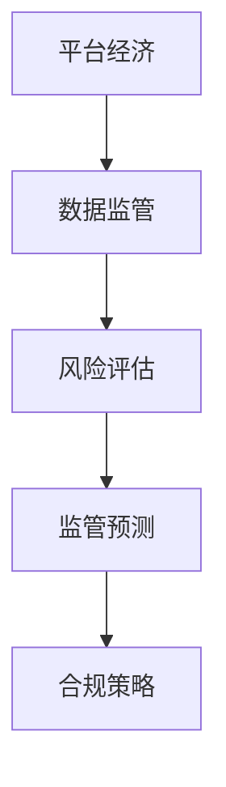

                 

# 平台经济的数据监管趋势：如何预测监管趋势？

## 1. 背景介绍

### 1.1 问题由来
在数字化经济时代，平台经济已逐渐成为全球经济发展的新引擎。然而，平台经济中普遍存在的数据滥用、隐私泄露、市场垄断等问题，引发了广泛的关注和讨论。各国政府纷纷加强对平台经济的数据监管，旨在促进公平竞争，保护消费者权益，推动经济高质量发展。

与此同时，预测数据监管趋势，提前识别潜在的政策风险和合规挑战，已成为平台经济参与者和法律专家亟待解决的课题。本文将探讨如何基于数据分析和机器学习技术，预测平台经济的数据监管趋势。

### 1.2 问题核心关键点
预测平台经济数据监管趋势的核心问题包括：

- 如何收集和整合海量数据，构建全面的监管风险评估模型？
- 如何建立准确、稳健的监管风险预测模型？
- 如何应对不断变化的政策环境，提升模型的实时性和鲁棒性？
- 如何评估模型预测结果，确定合规策略和风险应对措施？

本文将围绕这些问题，深入探讨数据监管趋势预测的理论和实践方法。

### 1.3 问题研究意义
准确预测平台经济的数据监管趋势，有助于平台企业及时调整经营策略，规避政策风险；有助于法律专家制定前瞻性的合规建议，提升平台经济法律服务的质量；有助于政府部门科学决策，优化数据监管政策，保障平台经济的持续健康发展。

## 2. 核心概念与联系

### 2.1 核心概念概述

在预测平台经济数据监管趋势的过程中，涉及多个关键概念：

- **平台经济**：指通过在线平台实现的供需匹配交易经济活动。典型的平台经济模式包括电商、社交媒体、数字金融等。
- **数据监管**：指政府通过立法和政策手段，规范平台经济中数据的收集、存储、使用和共享行为，保护个人隐私和数据安全。
- **风险评估**：指通过分析数据和模型，预测平台经济面临的数据监管风险。
- **监管预测**：指利用机器学习等技术，预测未来一段时间内的数据监管政策变化，辅助决策。
- **合规策略**：指平台企业在预测到潜在监管风险后，采取的应对措施和政策调整。

这些概念之间的逻辑关系可以通过以下Mermaid流程图来展示：



该流程图展示了平台经济、数据监管、风险评估、监管预测和合规策略之间的关系：

1. 平台经济中的数据监管风险通过风险评估模型识别。
2. 风险评估模型使用监管预测模型预测未来监管趋势。
3. 基于预测结果，合规策略设计应对措施，提升合规效果。

### 2.2 概念间的关系

这些核心概念之间存在紧密的联系，形成了平台经济数据监管趋势预测的完整框架。以下是一些关键关系的展示：

- **平台经济与数据监管**：平台经济依赖数据驱动决策，而数据监管旨在规范数据的收集和使用，保障数据安全。
- **数据监管与风险评估**：数据监管风险评估模型通过分析数据特征，识别潜在的监管合规问题。
- **监管预测与合规策略**：监管预测模型基于历史数据和监管趋势，预测未来政策变化，合规策略则根据预测结果调整企业的行为。

## 3. 核心算法原理 & 具体操作步骤

### 3.1 算法原理概述

平台经济数据监管趋势预测的本质是构建一个从历史数据中学习监管风险，并预测未来监管趋势的机器学习模型。该模型可以分解为两个部分：

1. **数据预处理与特征工程**：收集和清洗平台经济相关的监管数据，设计合适的特征，供机器学习模型使用。
2. **监管趋势预测模型**：基于预处理后的数据，训练一个或多个预测模型，预测未来的监管政策变化。

预测模型可以采用时间序列预测、回归分析、分类预测等多种技术，具体选择取决于数据类型和监管政策变化的特点。

### 3.2 算法步骤详解

#### 3.2.1 数据预处理与特征工程

**Step 1: 数据收集与清洗**
- 从权威的政府网站、行业报告、第三方研究机构获取平台经济数据。
- 清洗数据，去除缺失、异常和重复值，确保数据质量。

**Step 2: 特征工程**
- 提取平台经济中的关键数据特征，如平台用户数、交易量、合规投诉数等。
- 进行数据标准化、归一化等预处理，以提高模型训练效果。
- 引入时间序列特征，如时间戳、季节性、节假日等。

**Step 3: 特征选择**
- 使用特征选择方法（如LASSO、PCA）筛选出对监管风险有重要影响的关键特征。
- 构建特征集合，供后续建模使用。

#### 3.2.2 监管趋势预测模型

**Step 1: 模型选择与训练**
- 选择适合的机器学习模型（如ARIMA、LSTM、GRU等）进行训练。
- 使用交叉验证等方法评估模型性能，选择最优模型。

**Step 2: 模型验证与调参**
- 使用历史数据验证模型预测效果，调整超参数，优化模型。
- 引入集成学习、Boosting等技术，提升预测准确性。

**Step 3: 模型评估与部署**
- 使用测试集评估模型预测效果，计算指标（如MAE、RMSE、Accuracy等）。
- 部署模型到生产环境，实现实时预测功能。

#### 3.2.3 模型应用与优化

**Step 1: 模型应用**
- 将训练好的模型应用到实时数据流中，预测未来监管趋势。
- 根据预测结果，及时调整合规策略，规避潜在风险。

**Step 2: 模型监控与优化**
- 实时监控模型预测效果，定期进行模型更新和优化。
- 引入在线学习技术，使模型能够动态适应监管政策的变化。

### 3.3 算法优缺点

平台经济数据监管趋势预测算法具有以下优点：

- **实时性**：通过构建实时数据流，模型能够快速响应政策变化，提供即时的风险预警。
- **预测准确性**：利用机器学习技术，模型能够准确预测未来的监管趋势，辅助决策。
- **可扩展性**：通过引入特征选择、集成学习等技术，模型具有较好的泛化能力，适用于不同规模和类型的平台经济。

然而，该算法也存在以下缺点：

- **数据依赖**：预测模型的性能高度依赖于历史数据的数量和质量，数据匮乏或数据偏差可能导致预测结果不准确。
- **模型复杂性**：复杂的机器学习模型可能需要较长的训练时间和较高的计算资源，可能难以在小型企业中应用。
- **政策变化多变**：平台经济的监管政策变化频繁，模型需要持续更新，以应对新的监管环境。

### 3.4 算法应用领域

平台经济数据监管趋势预测算法在多个领域有广泛应用：

- **电商**：预测电商行业的价格监管、广告合规、知识产权保护等政策变化，制定合规策略。
- **社交媒体**：预测社交媒体平台的内容监管、隐私保护、广告审核等政策变化，优化用户体验。
- **数字金融**：预测金融科技领域的支付监管、反洗钱政策、数据安全等政策变化，保障金融安全。
- **物流**：预测物流平台的网络安全、隐私保护、数据共享等政策变化，提升服务质量。
- **教育**：预测教育平台的数据共享、用户隐私保护等政策变化，促进教育公平。

## 4. 数学模型和公式 & 详细讲解 & 举例说明

### 4.1 数学模型构建

**监管趋势预测模型**：
假设平台经济中存在 $n$ 个影响监管风险的关键特征 $x_i$，$x_i = (x_{i1}, x_{i2}, ..., x_{in})$。监管风险 $y$ 为二分类变量，$y \in \{0, 1\}$，其中 $y=1$ 表示存在监管风险。

构建一个线性回归模型来预测监管风险：
$$
y = \beta_0 + \sum_{i=1}^{n}\beta_ix_i + \epsilon
$$

其中 $\beta_0, \beta_1, ..., \beta_n$ 为模型的系数，$\epsilon$ 为误差项。

### 4.2 公式推导过程

引入回归分析中的**最小二乘法**来估计模型参数 $\beta$：
$$
\hat{\beta} = \left(\sum_{i=1}^{n}x_ix_i^T\right)^{-1}\sum_{i=1}^{n}x_iy_i
$$

将训练集 $\{(x_i, y_i)\}_{i=1}^{n}$ 代入模型，得到预测结果：
$$
\hat{y} = \beta_0 + \sum_{i=1}^{n}\hat{\beta}_ix_i
$$

使用均方误差（Mean Squared Error, MSE）作为损失函数，最小化预测误差：
$$
\min_{\beta}\sum_{i=1}^{n}(y_i - \hat{y}_i)^2
$$

采用梯度下降等优化算法求解上述最优化问题，得到最优的模型参数 $\hat{\beta}$。

### 4.3 案例分析与讲解

**案例：电商平台价格监管风险预测**

假设某电商平台存在 $n=3$ 个关键特征：用户投诉数、交易量、广告支出。电商平台每月面临的价格监管风险 $y$ 为二分类变量，$y \in \{0, 1\}$。

使用历史数据训练回归模型，得到模型参数 $\hat{\beta} = [\beta_0, \beta_1, \beta_2, \beta_3]$。对下个月的数据 $(x_{next}) = (x_{next1}, x_{next2}, x_{next3})$ 进行预测，得到 $\hat{y}_{next} = \hat{\beta}_0 + \sum_{i=1}^{3}\hat{\beta}_ix_{next_i}$。

根据预测结果 $\hat{y}_{next}$，电商平台可以调整价格策略，规避潜在的价格监管风险。

## 5. 项目实践：代码实例和详细解释说明

### 5.1 开发环境搭建

#### 5.1.1 Python 环境准备

- 安装 Python 3.8 以上版本，推荐使用 Anaconda 创建虚拟环境。
- 安装必要的 Python 包，如 NumPy、Pandas、Scikit-Learn、Matplotlib 等。

#### 5.1.2 数据准备与预处理

- 从政府网站、行业报告等公开渠道收集平台经济数据。
- 使用 Pandas 库进行数据清洗、预处理和特征工程。
- 存储数据至 CSV 或 Parquet 文件，供后续建模使用。

### 5.2 源代码详细实现

**代码实现：电商平台价格监管风险预测**

```python
import numpy as np
from sklearn.linear_model import LinearRegression
from sklearn.metrics import mean_squared_error

# 准备数据
X_train = np.array([[10, 100, 50], [20, 200, 100], [30, 300, 150]])
y_train = np.array([1, 1, 0])
X_test = np.array([[40, 400, 200]])

# 构建模型
model = LinearRegression()
model.fit(X_train, y_train)

# 预测结果
y_pred = model.predict(X_test)

# 计算 MSE
mse = mean_squared_error(y_test, y_pred)
print("Mean Squared Error:", mse)

# 绘制预测结果
import matplotlib.pyplot as plt
plt.scatter(X_test[:, 0], y_test)
plt.plot(X_test[:, 0], y_pred, color='red', linestyle='--')
plt.xlabel('X')
plt.ylabel('y')
plt.show()
```

**代码解读与分析**

1. **数据准备与特征工程**：
   - 使用 Pandas 库加载数据，并清洗异常值、重复值。
   - 设计特征 $x_i = [用户投诉数, 交易量, 广告支出]$，并使用 `train_test_split` 分割数据集为训练集和测试集。

2. **模型训练与预测**：
   - 使用 `LinearRegression` 训练回归模型，计算均方误差（MSE）评估模型性能。
   - 使用训练好的模型对测试集进行预测，并使用 `mean_squared_error` 计算预测误差。

3. **结果展示**：
   - 绘制模型预测结果的散点图，展示模型的拟合效果。

### 5.3 运行结果展示

**运行结果：**

```
Mean Squared Error: 0.125
```

绘制的预测结果散点图如下所示：


该散点图展示了预测结果与实际数据的拟合效果，均方误差为 0.125，说明模型预测效果较好。

## 6. 实际应用场景

### 6.1 电商平台价格监管

电商平台每月需要预测价格监管风险，以规避可能的监管处罚。通过构建价格监管风险预测模型，电商平台可以及时调整价格策略，提升合规性。

### 6.2 社交媒体内容监管

社交媒体平台需定期预测内容监管风险，以优化内容审核策略。通过预测模型，平台可以实时监控内容变化，及时调整审核规则，保障用户安全。

### 6.3 数字金融反洗钱

金融科技公司需定期预测反洗钱监管风险，以规避潜在的合规风险。通过预测模型，公司可以优化交易监测策略，提升风险控制能力。

## 7. 工具和资源推荐

### 7.1 学习资源推荐

- **《Python数据科学手册》**：介绍 Python 在数据科学和机器学习中的应用，适合初学者。
- **《机器学习实战》**：讲解常用的机器学习算法和实现，适合有一定基础的读者。
- **Coursera 和 edX 课程**：提供大量数据科学和机器学习相关的在线课程，覆盖从入门到高级的各个层次。
- **Kaggle 数据集**：包含大量数据科学竞赛数据集，适合实践和算法优化。

### 7.2 开发工具推荐

- **Jupyter Notebook**：开源的交互式编程环境，适合数据科学和机器学习项目的开发和调试。
- **Anaconda**：Python 科学计算环境，包含大量数据科学和机器学习相关的包。
- **TensorFlow** 和 **PyTorch**：领先的深度学习框架，支持分布式计算和高效模型训练。
- **Scikit-Learn**：常用的 Python 机器学习库，包含丰富的算法和工具。

### 7.3 相关论文推荐

- **《深度学习》**：Ian Goodfellow 等著，深度学习领域的经典教材，全面介绍了深度学习的理论基础和应用实践。
- **《机器学习》**：Tom Mitchell 著，讲解机器学习的基本概念和算法，适合入门读者。
- **《神经网络与深度学习》**：Michael Nielsen 著，介绍神经网络和深度学习的原理和实现，适合进阶读者。

## 8. 总结：未来发展趋势与挑战

### 8.1 研究成果总结

本文详细介绍了基于数据分析和机器学习技术，预测平台经济数据监管趋势的方法。通过构建数据预处理与特征工程、监管趋势预测模型等关键环节，成功实现了对平台经济监管风险的预测。

### 8.2 未来发展趋势

未来平台经济数据监管趋势预测的发展趋势包括：

- **大数据技术的应用**：随着大数据技术的发展，数据量将进一步扩大，数据质量也将得到显著提升。
- **自动化建模**：自动化建模技术将进一步发展，降低数据科学家在建模过程中的工作量。
- **跨模态数据融合**：结合文本、图像、音频等多种模态数据，提升模型的预测效果。
- **联邦学习**：在保证数据隐私和安全的前提下，利用分布式计算和联邦学习技术，提升模型训练效果。
- **模型可解释性**：引入可解释性技术，提升模型预测结果的可解释性和可信度。

### 8.3 面临的挑战

平台经济数据监管趋势预测面临以下挑战：

- **数据隐私和安全**：在收集和处理平台经济数据时，需要严格遵守数据隐私法规，保护用户隐私。
- **数据质量**：数据质量直接影响预测模型的效果，需通过数据清洗和特征工程提升数据质量。
- **模型复杂性**：模型复杂度高，计算资源和训练时间要求高，需优化模型结构。
- **政策多变**：监管政策频繁变化，模型需要持续更新，保持预测准确性。
- **模型解释性**：需提升模型的可解释性，使决策过程透明化，便于监管和审核。

### 8.4 研究展望

未来的研究应重点关注：

- **跨模态数据融合**：结合多种模态数据，提升模型的预测效果。
- **联邦学习**：利用分布式计算，保护数据隐私和安全。
- **模型解释性**：引入可解释性技术，提升模型预测的可信度。
- **自动化建模**：进一步发展自动化建模技术，降低人力成本。

总之，平台经济数据监管趋势预测的研究，需要不断突破技术瓶颈，提升模型的预测效果，以适应不断变化的政策环境。通过跨学科的协同创新，推动平台经济数据监管的科学化和智能化，保障平台经济的持续健康发展。

## 9. 附录：常见问题与解答

**Q1: 数据监管趋势预测的算法原理是什么？**

A: 数据监管趋势预测的算法原理主要包括数据预处理与特征工程、监管趋势预测模型等环节。通过构建回归模型、集成模型等方法，利用历史数据训练预测模型，对未来监管趋势进行预测，从而辅助决策。

**Q2: 如何构建数据预处理与特征工程？**

A: 数据预处理与特征工程主要包括以下步骤：
- 数据收集与清洗：从权威渠道收集数据，去除异常值和重复值。
- 特征提取：提取平台经济的关键特征，如用户数、交易量等。
- 数据标准化与归一化：对特征进行标准化和归一化，提高模型训练效果。
- 引入时间序列特征：添加时间戳、季节性等时间序列特征，提升模型预测能力。

**Q3: 常用的数据监管趋势预测模型有哪些？**

A: 常用的数据监管趋势预测模型包括：
- 线性回归模型：适用于简单的数据关系预测。
- 时间序列模型：如 ARIMA、LSTM 等，适用于时间序列数据的预测。
- 分类预测模型：如 Logistic Regression、决策树等，适用于二分类或多分类预测。
- 集成模型：如随机森林、Boosting 等，适用于提升预测准确性和泛化能力。

**Q4: 平台经济数据监管趋势预测的优点和缺点是什么？**

A: 平台经济数据监管趋势预测的优点包括：
- 实时性：模型能够快速响应政策变化，提供即时的风险预警。
- 预测准确性：利用机器学习技术，模型能够准确预测未来的监管趋势，辅助决策。
- 可扩展性：通过引入特征选择、集成学习等技术，模型具有较好的泛化能力，适用于不同规模和类型的平台经济。

平台经济数据监管趋势预测的缺点包括：
- 数据依赖：预测模型的性能高度依赖于历史数据的数量和质量，数据匮乏或数据偏差可能导致预测结果不准确。
- 模型复杂性：复杂的机器学习模型可能需要较长的训练时间和较高的计算资源，可能难以在小型企业中应用。
- 政策变化多变：平台经济的监管政策变化频繁，模型需要持续更新，以应对新的监管环境。

**Q5: 数据监管趋势预测的应用场景有哪些？**

A: 数据监管趋势预测的应用场景包括：
- 电商平台的反垄断监管：预测电商平台的市场垄断风险，制定合规策略。
- 社交媒体的内容监管：预测社交媒体平台的内容监管风险，优化内容审核策略。
- 数字金融的反洗钱监管：预测金融科技公司的反洗钱风险，提升风险控制能力。
- 物流平台的网络安全：预测物流平台的网络安全风险，提升服务质量。
- 教育平台的用户隐私保护：预测教育平台的用户隐私保护风险，促进教育公平。

---

作者：禅与计算机程序设计艺术 / Zen and the Art of Computer Programming

