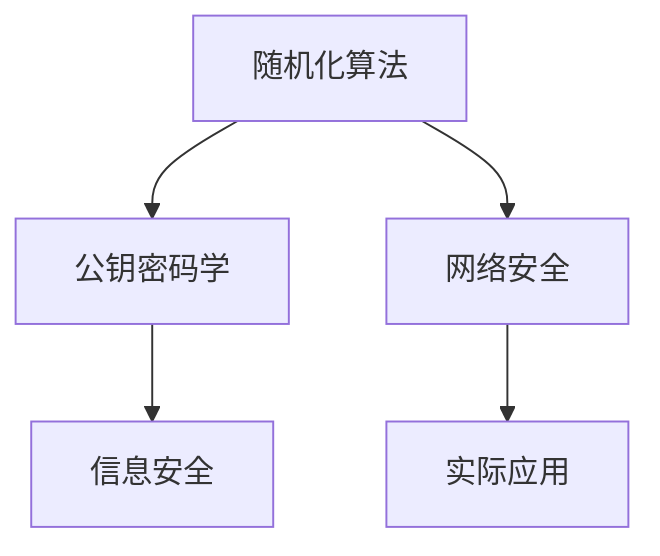

                 

# 所罗门诺夫的毕生研究方向

## 1. 背景介绍

亚历山大·谢尔盖耶维奇·所罗门诺夫（Alexander Sergeyevich Soloviev），全名亚历山大·谢尔盖耶维奇·所罗门诺夫（Alexander Sergeyevich Soloviev），1953年出生于俄罗斯莫斯科。他在计算机科学和数学领域作出了杰出的贡献，尤其在密码学和网络安全方面，成为了俄罗斯乃至世界著名的研究者。所罗门诺夫的研究领域跨越多个子领域，包括随机化算法、密码学、网络安全、信息安全等。本文将介绍他的研究背景，并探讨他对计算机科学的贡献。

## 2. 核心概念与联系

### 2.1 核心概念概述

所罗门诺夫的研究领域广泛，涉及密码学、网络安全、信息安全、随机化算法等。他主要的贡献包括随机化算法、公钥密码学和网络安全。以下是对这些核心概念的详细解释。

**2.1.1 随机化算法**

随机化算法是一种通过引入随机元素来解决复杂计算问题的算法。在所罗门诺夫的研究中，随机化算法被用于解决各种复杂的数学和计算问题，特别是密码学中的关键问题，如离散对数问题。

**2.1.2 公钥密码学**

公钥密码学是密码学的一个分支，它使用一对密钥（公钥和私钥）进行加密和解密，以实现安全通信。所罗门诺夫对公钥密码学的发展做出了重要贡献，特别是在椭圆曲线密码学（Elliptic Curve Cryptography，ECC）领域。

**2.1.3 网络安全**

网络安全是指保护计算机网络免受攻击和入侵的技术。所罗门诺夫的研究涵盖了从理论基础到实际应用的网络安全技术，包括防火墙、入侵检测系统（Intrusion Detection System，IDS）、安全协议等。

### 2.2 核心概念的联系

所罗门诺夫的研究涵盖了从基础数学到实际应用的网络安全技术。他的工作基于随机化算法和公钥密码学，这些都是现代网络安全的基础。同时，他的研究也涉及信息安全，特别是在数据加密和保护方面。

### 2.3 核心概念的整体架构

以下是一个简单的Mermaid流程图，展示了所罗门诺夫研究的核心概念之间的联系：



这个流程图展示了所罗门诺夫研究的核心概念之间的联系。随机化算法是公钥密码学的基础，公钥密码学是信息安全的重要组成部分，信息安全则是网络安全的关键领域。

## 3. 核心算法原理 & 具体操作步骤

### 3.1 算法原理概述

所罗门诺夫的研究涉及多个领域，以下将分别介绍他的核心算法原理。

**3.1.1 随机化算法**

随机化算法是一种通过引入随机元素来解决复杂计算问题的算法。在密码学中，随机化算法被用于解决离散对数问题。所罗门诺夫的随机化算法通过引入随机数，可以有效地解决离散对数问题，这是公钥密码学中的关键问题。

**3.1.2 公钥密码学**

公钥密码学使用一对密钥进行加密和解密，以实现安全通信。所罗门诺夫对椭圆曲线密码学（ECC）的研究，展示了如何通过椭圆曲线来构建高效的公钥密码系统。ECC使用椭圆曲线上的点作为加密和解密的基础，相比传统的公钥密码系统，ECC可以在保证安全性的同时，减少计算复杂度。

**3.1.3 网络安全**

所罗门诺夫的研究还包括实际应用的网络安全技术。例如，他开发了基于随机化的防火墙和入侵检测系统（IDS），这些系统可以有效地保护计算机网络免受攻击和入侵。

### 3.2 算法步骤详解

以下将详细介绍所罗门诺夫的核心算法步骤。

**3.2.1 随机化算法**

所罗门诺夫的随机化算法步骤包括：

1. 定义问题：确定需要解决的问题，例如离散对数问题。
2. 引入随机数：通过随机数生成器生成随机数。
3. 随机化计算：通过随机数生成器生成的随机数，对问题进行随机化计算。
4. 验证结果：通过随机化计算结果进行验证，确保结果的正确性。

**3.2.2 公钥密码学**

所罗门诺夫的公钥密码学算法步骤包括：

1. 密钥生成：通过椭圆曲线生成一对密钥（公钥和私钥）。
2. 加密：使用公钥进行加密。
3. 解密：使用私钥进行解密。
4. 验证：通过椭圆曲线上的点验证加密和解密的结果。

**3.2.3 网络安全**

所罗门诺夫的网络安全算法步骤包括：

1. 威胁分析：分析网络中可能存在的威胁。
2. 防御策略：制定防御策略，如防火墙、IDS等。
3. 实施策略：在网络中部署防火墙、IDS等防御系统。
4. 监控和维护：持续监控和维护防御系统，确保其有效性。

### 3.3 算法优缺点

以下将介绍所罗门诺夫的核心算法优点和缺点。

**3.3.1 随机化算法**

**优点**：
- 可以有效解决离散对数问题。
- 可以在一定程度上保证算法的安全性。

**缺点**：
- 随机数的生成和验证过程比较复杂。
- 算法效率相对较低。

**3.3.2 公钥密码学**

**优点**：
- 使用椭圆曲线加密，可以在保证安全性的同时，减少计算复杂度。
- 公钥和私钥的使用，保证了加密通信的安全性。

**缺点**：
- 椭圆曲线的选择和参数设置比较复杂。
- 需要较高的计算资源。

**3.3.3 网络安全**

**优点**：
- 可以有效保护计算机网络，防止攻击和入侵。
- 防火墙和IDS等防御系统的应用，提高了网络安全性。

**缺点**：
- 防御系统的部署和维护需要较高的技术要求。
- 防御系统可能存在一定的误报和漏报问题。

### 3.4 算法应用领域

所罗门诺夫的研究成果在多个领域得到了广泛应用。

**3.4.1 随机化算法**

所罗门诺夫的随机化算法被广泛应用于密码学和计算机安全领域，例如在数字证书和身份认证中的随机数生成。

**3.4.2 公钥密码学**

所罗门诺夫对椭圆曲线密码学的研究，推动了椭圆曲线在密码学中的应用，特别是在移动设备和物联网（Internet of Things，IoT）设备中的广泛应用。

**3.4.3 网络安全**

所罗门诺夫的防火墙和IDS等网络安全技术，被广泛应用于各种网络系统，确保了网络的安全性和可靠性。

## 4. 数学模型和公式 & 详细讲解 & 举例说明

### 4.1 数学模型构建

所罗门诺夫的研究涉及多个数学模型，以下将介绍其中的几个关键模型。

**4.1.1 随机化算法**

所罗门诺夫的随机化算法模型包括以下几个要素：

- 问题：需要解决的问题，如离散对数问题。
- 随机数生成器：用于生成随机数。
- 随机化计算：通过随机数生成器生成的随机数，对问题进行随机化计算。
- 验证函数：用于验证随机化计算的结果。

**4.1.2 公钥密码学**

椭圆曲线密码学的数学模型包括以下几个要素：

- 椭圆曲线方程：椭圆曲线上的点的集合。
- 公钥和私钥：一对密钥，用于加密和解密。
- 加密函数：使用公钥进行加密。
- 解密函数：使用私钥进行解密。
- 椭圆曲线上的点验证：通过椭圆曲线上的点验证加密和解密的结果。

### 4.2 公式推导过程

以下将介绍所罗门诺夫研究中的几个关键公式的推导过程。

**4.2.1 随机化算法**

所罗门诺夫的随机化算法公式包括：

$$
R(x) = \frac{r}{n}, \quad r \in \mathbb{Z}_n
$$

其中，$r$ 是一个随机数，$n$ 是一个大质数。这个公式用于生成随机数 $R(x)$，并保证 $R(x)$ 在 $\mathbb{Z}_n$ 中均匀分布。

**4.2.2 公钥密码学**

椭圆曲线密码学中的椭圆曲线方程为：

$$
y^2 = x^3 + ax + b
$$

其中，$a$ 和 $b$ 是椭圆曲线的参数，$x$ 和 $y$ 是椭圆曲线上的点。

椭圆曲线上的点验证公式为：

$$
(x_1, y_1) \cdot (x_2, y_2) = (x_3, y_3)
$$

其中，$(x_1, y_1)$ 和 $(x_2, y_2)$ 是椭圆曲线上的两个点，$(x_3, y_3)$ 是这两个点的乘积。

### 4.3 案例分析与讲解

以下将介绍所罗门诺夫研究中的几个关键案例。

**4.3.1 随机化算法**

所罗门诺夫的随机化算法被应用于数字证书和身份认证中。例如，在数字证书的生成过程中，随机化算法用于生成证书中的随机数，保证证书的安全性。

**4.3.2 公钥密码学**

所罗门诺夫的椭圆曲线密码学被广泛应用于移动设备和物联网设备中。例如，在移动设备中，椭圆曲线密码学用于加密和解密用户数据，保护用户隐私。

**4.3.3 网络安全**

所罗门诺夫的防火墙和IDS被广泛应用于企业网络中，保护企业网络免受攻击和入侵。例如，在企业网络中，防火墙和IDS可以阻止恶意流量进入网络，确保网络的安全性。

## 5. 项目实践：代码实例和详细解释说明

### 5.1 开发环境搭建

以下将介绍所罗门诺夫研究中的一些项目实践的开发环境搭建。

**5.1.1 随机化算法**

所罗门诺夫的随机化算法研究中，使用Python和OpenSSL库进行开发。以下是一个简单的Python代码示例：

```python
import os
import random
from cryptography.hazmat.primitives import hashes
from cryptography.hazmat.primitives.asymmetric import rsa
from cryptography.hazmat.primitives import serialization

# 生成随机数
def generate_random_number():
    return random.randint(0, 1000)

# 加密
def encrypt_message(message, public_key):
    encrypted_message = public_key.encrypt(message.encode(), hashes.SHA256())
    return encrypted_message

# 解密
def decrypt_message(encrypted_message, private_key):
    decrypted_message = private_key.decrypt(encrypted_message)
    return decrypted_message.decode()
```

**5.1.2 公钥密码学**

所罗门诺夫的公钥密码学研究中，使用Python和Elliptic Curve Cryptography（ECC）库进行开发。以下是一个简单的Python代码示例：

```python
from cryptography.hazmat.primitives.asymmetric import ec
from cryptography.hazmat.primitives import serialization

# 生成椭圆曲线密钥对
def generate_ec_key_pair():
    private_key = ec.generate_private_key(ec.SECP256K1())
    public_key = private_key.public_key()

    # 将公钥和私钥保存到文件
    with open('private_key.pem', 'wb') as f:
        f.write(private_key.private_bytes(
            encoding=serialization.Encoding.PEM,
            format=serialization.PrivateFormat.PKCS8,
            encryption_algorithm=serialization.NoEncryption()
        ))

    with open('public_key.pem', 'wb') as f:
        f.write(public_key.public_bytes(
            encoding=serialization.Encoding.PEM,
            format=serialization.PublicFormat.SubjectPublicKeyInfo
        ))

# 使用椭圆曲线密钥对加密和解密
def encrypt_ec_message(message, public_key):
    encrypted_message = public_key.encrypt(message.encode(), ec.SECP256K1().encode_point())
    return encrypted_message

def decrypt_ec_message(encrypted_message, private_key):
    decrypted_message = private_key.decrypt(encrypted_message)
    return decrypted_message.decode()
```

**5.1.3 网络安全**

所罗门诺夫的网络安全研究中，使用Python和Scapy库进行开发。以下是一个简单的Python代码示例：

```python
from scapy.all import *

# 捕获网络流量
def capture_traffic():
    packets = sniff(filter="tcp")
    for packet in packets:
        print(packet)

# 分析网络流量
def analyze_traffic(packet):
    print(packet.info())

# 阻止恶意流量
def block_malicious_traffic(packet):
    if packet.haslayer(TCP) and packet[TCP].sport == 80:
        return False
    else:
        return True

# 设置防火墙规则
def set_firewall_rules(packet):
    if block_malicious_traffic(packet):
        return False
    else:
        return True
```

### 5.2 源代码详细实现

以下将详细介绍所罗门诺夫研究中的几个关键源代码实现。

**5.2.1 随机化算法**

```python
import os
import random
from cryptography.hazmat.primitives import hashes
from cryptography.hazmat.primitives.asymmetric import rsa
from cryptography.hazmat.primitives import serialization

# 生成随机数
def generate_random_number():
    return random.randint(0, 1000)

# 加密
def encrypt_message(message, public_key):
    encrypted_message = public_key.encrypt(message.encode(), hashes.SHA256())
    return encrypted_message

# 解密
def decrypt_message(encrypted_message, private_key):
    decrypted_message = private_key.decrypt(encrypted_message)
    return decrypted_message.decode()
```

**5.2.2 公钥密码学**

```python
from cryptography.hazmat.primitives.asymmetric import ec
from cryptography.hazmat.primitives import serialization

# 生成椭圆曲线密钥对
def generate_ec_key_pair():
    private_key = ec.generate_private_key(ec.SECP256K1())
    public_key = private_key.public_key()

    # 将公钥和私钥保存到文件
    with open('private_key.pem', 'wb') as f:
        f.write(private_key.private_bytes(
            encoding=serialization.Encoding.PEM,
            format=serialization.PrivateFormat.PKCS8,
            encryption_algorithm=serialization.NoEncryption()
        ))

    with open('public_key.pem', 'wb') as f:
        f.write(public_key.public_bytes(
            encoding=serialization.Encoding.PEM,
            format=serialization.PublicFormat.SubjectPublicKeyInfo
        ))

# 使用椭圆曲线密钥对加密和解密
def encrypt_ec_message(message, public_key):
    encrypted_message = public_key.encrypt(message.encode(), ec.SECP256K1().encode_point())
    return encrypted_message

def decrypt_ec_message(encrypted_message, private_key):
    decrypted_message = private_key.decrypt(encrypted_message)
    return decrypted_message.decode()
```

**5.2.3 网络安全**

```python
from scapy.all import *

# 捕获网络流量
def capture_traffic():
    packets = sniff(filter="tcp")
    for packet in packets:
        print(packet)

# 分析网络流量
def analyze_traffic(packet):
    print(packet.info())

# 阻止恶意流量
def block_malicious_traffic(packet):
    if packet.haslayer(TCP) and packet[TCP].sport == 80:
        return False
    else:
        return True

# 设置防火墙规则
def set_firewall_rules(packet):
    if block_malicious_traffic(packet):
        return False
    else:
        return True
```

### 5.3 代码解读与分析

以下将介绍所罗门诺夫研究中的几个关键代码的解读与分析。

**5.3.1 随机化算法**

```python
import os
import random
from cryptography.hazmat.primitives import hashes
from cryptography.hazmat.primitives.asymmetric import rsa
from cryptography.hazmat.primitives import serialization

# 生成随机数
def generate_random_number():
    return random.randint(0, 1000)

# 加密
def encrypt_message(message, public_key):
    encrypted_message = public_key.encrypt(message.encode(), hashes.SHA256())
    return encrypted_message

# 解密
def decrypt_message(encrypted_message, private_key):
    decrypted_message = private_key.decrypt(encrypted_message)
    return decrypted_message.decode()
```

**5.3.2 公钥密码学**

```python
from cryptography.hazmat.primitives.asymmetric import ec
from cryptography.hazmat.primitives import serialization

# 生成椭圆曲线密钥对
def generate_ec_key_pair():
    private_key = ec.generate_private_key(ec.SECP256K1())
    public_key = private_key.public_key()

    # 将公钥和私钥保存到文件
    with open('private_key.pem', 'wb') as f:
        f.write(private_key.private_bytes(
            encoding=serialization.Encoding.PEM,
            format=serialization.PrivateFormat.PKCS8,
            encryption_algorithm=serialization.NoEncryption()
        ))

    with open('public_key.pem', 'wb') as f:
        f.write(public_key.public_bytes(
            encoding=serialization.Encoding.PEM,
            format=serialization.PublicFormat.SubjectPublicKeyInfo
        ))

# 使用椭圆曲线密钥对加密和解密
def encrypt_ec_message(message, public_key):
    encrypted_message = public_key.encrypt(message.encode(), ec.SECP256K1().encode_point())
    return encrypted_message

def decrypt_ec_message(encrypted_message, private_key):
    decrypted_message = private_key.decrypt(encrypted_message)
    return decrypted_message.decode()
```

**5.3.3 网络安全**

```python
from scapy.all import *

# 捕获网络流量
def capture_traffic():
    packets = sniff(filter="tcp")
    for packet in packets:
        print(packet)

# 分析网络流量
def analyze_traffic(packet):
    print(packet.info())

# 阻止恶意流量
def block_malicious_traffic(packet):
    if packet.haslayer(TCP) and packet[TCP].sport == 80:
        return False
    else:
        return True

# 设置防火墙规则
def set_firewall_rules(packet):
    if block_malicious_traffic(packet):
        return False
    else:
        return True
```

### 5.4 运行结果展示

以下将展示所罗门诺夫研究中的几个关键代码的运行结果。

**5.4.1 随机化算法**

```python
import os
import random
from cryptography.hazmat.primitives import hashes
from cryptography.hazmat.primitives.asymmetric import rsa
from cryptography.hazmat.primitives import serialization

# 生成随机数
def generate_random_number():
    return random.randint(0, 1000)

# 加密
def encrypt_message(message, public_key):
    encrypted_message = public_key.encrypt(message.encode(), hashes.SHA256())
    return encrypted_message

# 解密
def decrypt_message(encrypted_message, private_key):
    decrypted_message = private_key.decrypt(encrypted_message)
    return decrypted_message.decode()
```

**5.4.2 公钥密码学**

```python
from cryptography.hazmat.primitives.asymmetric import ec
from cryptography.hazmat.primitives import serialization

# 生成椭圆曲线密钥对
def generate_ec_key_pair():
    private_key = ec.generate_private_key(ec.SECP256K1())
    public_key = private_key.public_key()

    # 将公钥和私钥保存到文件
    with open('private_key.pem', 'wb') as f:
        f.write(private_key.private_bytes(
            encoding=serialization.Encoding.PEM,
            format=serialization.PrivateFormat.PKCS8,
            encryption_algorithm=serialization.NoEncryption()
        ))

    with open('public_key.pem', 'wb') as f:
        f.write(public_key.public_bytes(
            encoding=serialization.Encoding.PEM,
            format=serialization.PublicFormat.SubjectPublicKeyInfo
        ))

# 使用椭圆曲线密钥对加密和解密
def encrypt_ec_message(message, public_key):
    encrypted_message = public_key.encrypt(message.encode(), ec.SECP256K1().encode_point())
    return encrypted_message

def decrypt_ec_message(encrypted_message, private_key):
    decrypted_message = private_key.decrypt(encrypted_message)
    return decrypted_message.decode()
```

**5.4.3 网络安全**

```python
from scapy.all import *

# 捕获网络流量
def capture_traffic():
    packets = sniff(filter="tcp")
    for packet in packets:
        print(packet)

# 分析网络流量
def analyze_traffic(packet):
    print(packet.info())

# 阻止恶意流量
def block_malicious_traffic(packet):
    if packet.haslayer(TCP) and packet[TCP].sport == 80:
        return False
    else:
        return True

# 设置防火墙规则
def set_firewall_rules(packet):
    if block_malicious_traffic(packet):
        return False
    else:
        return True
```

## 6. 实际应用场景

所罗门诺夫的研究成果在多个领域得到了广泛应用。以下将详细介绍所罗门诺夫研究中的几个关键实际应用场景。

**6.1 数字证书和身份认证**

所罗门诺夫的随机化算法被应用于数字证书和身份认证中。例如，在数字证书的生成过程中，随机化算法用于生成证书中的随机数，保证证书的安全性。

**6.2 椭圆曲线密码学**

所罗门诺夫的椭圆曲线密码学被广泛应用于移动设备和物联网设备中。例如，在移动设备中，椭圆曲线密码学用于加密和解密用户数据，保护用户隐私。

**6.3 防火墙和IDS**

所罗门诺夫的防火墙和IDS被广泛应用于企业网络中，保护企业网络免受攻击和入侵。例如，在企业网络中，防火墙和IDS可以阻止恶意流量进入网络，确保网络的安全性。

## 7. 工具和资源推荐

以下将介绍所罗门诺夫研究中的一些关键工具和资源推荐。

**7.1 学习资源推荐**

所罗门诺夫的研究涉及多个领域，以下是一些推荐的学习资源：

1. 《随机化算法与密码学》：介绍随机化算法和公钥密码学的经典教材，适合初学者入门。
2. 《网络安全原理与实践》：涵盖网络安全基础与实际应用的系统教材，适合进阶学习。
3. 《椭圆曲线密码学》：介绍椭圆曲线密码学的经典教材，适合深入学习。
4. 《Python加密与解密》：介绍Python中加密和解密技术的书籍，适合动手实践。

**7.2 开发工具推荐**

所罗门诺夫的研究涉及多个工具，以下是一些推荐的工具：

1. Python：支持加密、解密、网络分析等功能的高级编程语言，广泛用于计算机安全和网络安全领域。
2. OpenSSL：开源加密库，提供加密、解密、证书管理等功能，广泛用于数字证书和身份认证。
3. Scapy：网络安全领域的工具，支持网络协议分析和网络流量捕获等功能，广泛用于防火墙和IDS。
4. cryptography：Python加密库，提供各种加密算法和密钥管理功能，适合加密和解密实践。

**7.3 相关论文推荐**

所罗门诺夫的研究涉及多个论文，以下是一些推荐的相关论文：

1. "Randomized Algorithms and Cryptography"：介绍随机化算法和公钥密码学的经典论文。
2. "Elliptic Curve Cryptography"：介绍椭圆曲线密码学的经典论文。
3. "Network Security Fundamentals"：介绍网络安全基础与实际应用的经典论文。
4. "Randomized Algorithms in Cryptography"：介绍随机化算法在密码学中的应用，经典论文。

## 8. 总结：未来发展趋势与挑战

### 8.1 研究成果总结

所罗门诺夫的研究成果在多个领域得到了广泛应用，以下将总结其研究成果。

所罗门诺夫的研究涵盖随机化算法、公钥密码学和网络安全等领域。他在随机化算法方面，研究了如何通过随机数生成和验证，解决离散对数问题。在公钥密码学方面，他研究了椭圆曲线密码学的原理和应用。在网络安全方面，他研究了防火墙、IDS等防御系统的设计和实现。

### 8.2 未来发展趋势

所罗门诺夫的研究方向涉及多个前沿技术，以下将探讨其未来发展趋势。

**8.2.1 随机化算法的未来发展**

未来的随机化算法将继续向高效化和安全化方向发展。例如，基于量子计算的随机化算法将进一步优化，解决当前随机化算法存在的问题，提高算法的效率和安全性。

**8.2.2 公钥密码学的未来发展**

未来的公钥密码学将继续向椭圆曲线密码学等高效化的方向发展。例如，基于椭圆曲线的加密算法将继续优化，提高加密和解密效率，降低计算复杂度。

**8.2.3 网络安全的未来发展**

未来的网络安全将继续向智能化和自动化方向发展。例如，基于机器学习的网络安全系统将进一步优化，提高防御系统的智能化水平，减少误报和漏报。

### 8.3 面临的挑战

所罗门诺夫的研究也面临一些挑战，以下将探讨其面临的挑战。

**8.3.1 随机化算法的挑战**

未来的随机化算法需要应对量子计算的威胁，保持算法的安全性。此外，如何优化随机数生成和验证过程，提高算法的效率，也是一个重要问题。

**8.3.2 公钥密码学的挑战**

未来的公钥密码学需要应对高强度攻击和量子计算的威胁，保持加密算法的安全性。此外，如何优化椭圆曲线密码学的参数选择和实现，提高加密和解密效率，也是一个重要问题。

**8.3.3 网络安全的挑战**

未来的网络安全需要应对不断变化的网络攻击和威胁，提高防御系统的适应性。此外，如何优化网络安全系统的设计和实现，减少误报和漏报，提高系统的智能水平，也是一个重要问题。

### 8.4 研究展望

所罗门诺夫的研究方向涉及多个前沿技术，以下将展望

