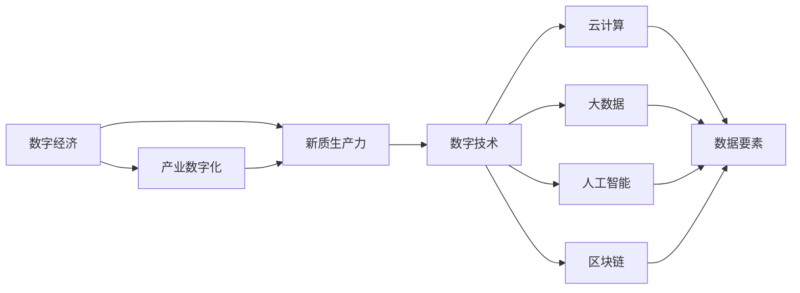
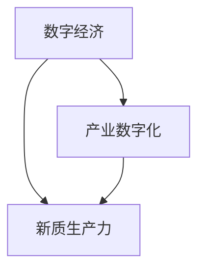
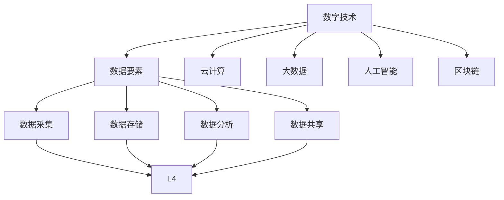
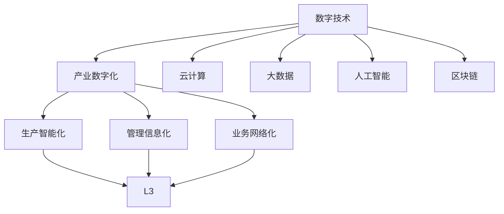
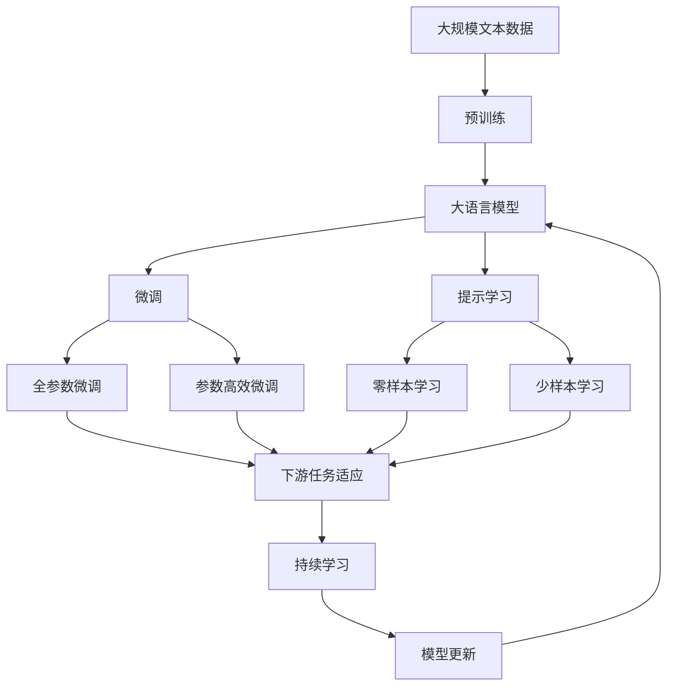

                 

# 数字中国战略与新质生产力的结合点

## 1. 背景介绍

### 1.1 问题由来
数字化转型已成为全球经济社会发展的重要趋势。尤其是在当前全球经济不确定性增加、疫情反复的背景下，数字经济成为中国经济实现高质量发展的重要动力。中国政府相继推出“数字中国”、“互联网+”、“新基建”等战略，通过加快数字经济与实体经济深度融合，助力经济实现新旧动能转换，推动新质生产力形成。

### 1.2 问题核心关键点
“数字中国”战略聚焦于将数字技术与实体经济融合，加速产业转型升级。其中，新质生产力是指通过数字技术驱动，在生产力各要素上产生的新的高效能、高智能、高柔性的新型生产力形态。这一战略目标的实现需要从技术、产业、政策、人才等多个层面协同推进。

## 2. 核心概念与联系

### 2.1 核心概念概述

为更好地理解“数字中国”战略与新质生产力结合点的内在逻辑，本节将介绍几个密切相关的核心概念：

- 数字经济：指以数字技术为核心驱动力，通过数据和信息资源的深度开发利用，促进产业数字化、数字化产业化发展的新型经济形态。
- 新质生产力：指通过数字化技术的应用，在生产力各要素上产生的新的高效能、高智能、高柔性的新型生产力形态。
- 产业数字化：指利用信息技术对传统产业进行改造升级，提升生产效率和管理水平，推动产业向智能化、网络化、服务化方向发展。
- 数字技术：包括云计算、大数据、人工智能、区块链等新一代信息技术的统称，是推动产业数字化和新质生产力形成的关键手段。
- 数据要素：指数据本身以及数据分析、挖掘、治理等围绕数据开展的各项活动。数据要素是数字经济的基础，也是新质生产力的核心驱动力。
- 数据治理：指通过规范数据采集、存储、处理、共享等流程，确保数据安全、合规、高效应用的过程。

这些核心概念之间的逻辑关系可以通过以下Mermaid流程图来展示：



这个流程图展示了数字经济与新质生产力之间的内在联系，以及数字技术在其中的关键作用。数字经济以数字技术为驱动，通过产业数字化实现转型升级，进而形成新质生产力。

### 2.2 概念间的关系

这些核心概念之间存在着紧密的联系，形成了“数字中国”战略与新质生产力结合点的完整生态系统。下面我通过几个Mermaid流程图来展示这些概念之间的关系。

#### 2.2.1 数字经济与新质生产力之间的关系



这个流程图展示了数字经济与新质生产力之间的核心关系。数字经济通过产业数字化，催生出高效能、高智能、高柔性的新质生产力形态。

#### 2.2.2 数字技术与数据要素的关系



这个流程图展示了数字技术对数据要素的支撑作用。通过云计算、大数据、人工智能和区块链等数字技术，数据要素得到了高效采集、存储、分析和共享，进一步促进了新质生产力的形成。

#### 2.2.3 数字技术与产业数字化之间的关系



这个流程图展示了数字技术在产业数字化中的关键作用。通过云计算、大数据、人工智能和区块链等数字技术，传统产业实现了生产智能化、管理信息化和业务网络化，进一步推动了新质生产力的形成。

### 2.3 核心概念的整体架构

最后，我们用一个综合的流程图来展示这些核心概念在大语言模型微调过程中的整体架构：



这个综合流程图展示了从预训练到微调，再到持续学习的完整过程。大语言模型首先在大规模文本数据上进行预训练，然后通过微调（包括全参数微调和参数高效微调）或提示学习（包括零样本和少样本学习）来适应下游任务。最后，通过持续学习技术，模型可以不断更新和适应新的任务和数据。 通过这些流程图，我们可以更清晰地理解数字经济与新质生产力之间的内在联系，为后续深入讨论具体的微调方法和技术奠定基础。

## 3. 核心算法原理 & 具体操作步骤
### 3.1 算法原理概述

基于数字技术与新质生产力结合点的算法，本质上是一个深度学习驱动的生产力提升过程。其核心思想是：利用数字技术（如云计算、大数据、人工智能等）对传统产业进行数字化改造，提升生产效率和管理水平，形成新型生产力。

形式化地，假设一个传统制造业企业 $E$ 需要进行数字化转型，以提升其生产效率。通过深度学习算法，可以对企业生产流程进行建模，优化生产计划和调度，减少生产成本，提升产品质量。具体来说，可以定义一个生产函数 $F(x,y)$，其中 $x$ 表示企业的数字化水平（如云计算资源投入、大数据分析能力、人工智能应用等），$y$ 表示生产效率。则提升企业生产效率的目标可以表示为：

$$
\min_{x} \text{cost}(F(x,y)) \quad \text{subject to} \quad F(x,y) = y
$$

其中，$\text{cost}(F(x,y))$ 表示企业的生产成本，通过优化生产函数 $F(x,y)$ 来最小化成本，同时满足生产效率 $y$ 的要求。

### 3.2 算法步骤详解

基于数字技术与新质生产力结合点的算法一般包括以下几个关键步骤：

**Step 1: 数据采集与处理**

- 收集企业生产相关的各类数据，如生产线状态、设备运行数据、质量检测结果等。
- 对原始数据进行清洗和预处理，去除噪声和异常值，确保数据的准确性和完整性。
- 利用云计算平台进行数据存储和管理，保证数据的安全性和可靠性。

**Step 2: 生产函数建模**

- 利用机器学习算法（如线性回归、决策树、神经网络等）对生产数据进行建模，建立生产函数 $F(x,y)$。
- 根据企业的实际情况，选择合适的方法和模型，如时间序列分析、深度学习等，以获得最优的生产函数。
- 通过模型训练和验证，不断调整模型参数，确保模型的准确性和泛化能力。

**Step 3: 优化生产计划**

- 将优化后的生产函数应用到企业的生产计划中，通过优化算法（如遗传算法、粒子群算法等）求解最优的生产计划。
- 根据企业的实际需求和资源约束，设定优化目标，如最大化产量、最小化成本等。
- 不断迭代优化，直至达到最优的生产计划。

**Step 4: 生产效率评估**

- 利用已建立的模型，对生产计划执行后的实际生产效率进行评估。
- 根据评估结果，调整生产计划和参数，进一步优化生产过程。
- 定期进行生产效率的监控和评估，确保生产过程的稳定性和持续优化。

### 3.3 算法优缺点

基于数字技术与新质生产力结合点的算法具有以下优点：

1. 提升生产效率：通过优化生产函数和生产计划，最大化企业生产效率，减少生产成本，提高产品质量。
2. 增强管理能力：通过数据驱动的管理方式，提高企业决策的科学性和准确性，提升企业的管理水平。
3. 支持智能决策：通过深度学习和人工智能技术，实现生产过程的智能化和自动化，提高企业的智能决策能力。

同时，该算法也存在以下缺点：

1. 数据依赖性强：算法需要大量高质量的生产数据，对于数据质量较差的企业，可能效果不佳。
2. 模型复杂度高：生产函数的建模和优化过程较为复杂，需要较高的技术门槛。
3. 成本较高：云计算和大数据技术的引入，需要较高的技术投入和成本，对中小企业可能不够经济。
4. 动态适应性差：生产函数和生产计划需要根据市场变化和需求变化进行调整，当前算法对动态变化的处理能力有限。

### 3.4 算法应用领域

基于数字技术与新质生产力结合点的算法在多个领域都有广泛应用，例如：

- 制造业：通过云计算和大数据技术，对生产流程进行建模和优化，提升生产效率和产品质量。
- 农业：利用物联网技术采集农业生产数据，通过深度学习进行数据分析和建模，优化农业生产过程。
- 物流业：通过GIS和物联网技术采集物流数据，利用大数据分析和机器学习进行路径优化和库存管理，提高物流效率。
- 零售业：通过智能推荐系统和数据分析技术，优化商品库存和供应链管理，提升用户体验。
- 医疗健康：通过电子健康档案和数据分析技术，提供个性化医疗服务和健康管理方案。

## 4. 数学模型和公式 & 详细讲解  
### 4.1 数学模型构建

本节将使用数学语言对基于数字技术与新质生产力结合点的算法过程进行更加严格的刻画。

假设一个传统制造业企业 $E$ 的生产效率为 $y$，云计算资源投入为 $x_1$，大数据分析能力为 $x_2$，人工智能应用为 $x_3$，则生产函数可以表示为：

$$
y = f(x_1, x_2, x_3)
$$

其中 $f(x_1, x_2, x_3)$ 表示一个非线性函数。假设企业的目标是最大化生产效率，则优化目标可以表示为：

$$
\max_{x_1, x_2, x_3} f(x_1, x_2, x_3)
$$

同时，企业的成本函数为 $c(x_1, x_2, x_3)$，则约束条件可以表示为：

$$
c(x_1, x_2, x_3) \leq C
$$

其中 $C$ 表示企业的预算限制。则最终的优化问题可以表示为：

$$
\max_{x_1, x_2, x_3} f(x_1, x_2, x_3) \quad \text{subject to} \quad c(x_1, x_2, x_3) \leq C
$$

### 4.2 公式推导过程

假设生产函数 $f(x_1, x_2, x_3)$ 为一个二次函数，可以表示为：

$$
f(x_1, x_2, x_3) = a x_1^2 + b x_1 x_2 + c x_2^2 + d x_3^2 + e x_1 x_3 + f x_2 x_3 + g
$$

其中 $a, b, c, d, e, f, g$ 为常数。则优化问题可以表示为：

$$
\max_{x_1, x_2, x_3} a x_1^2 + b x_1 x_2 + c x_2^2 + d x_3^2 + e x_1 x_3 + f x_2 x_3 + g \quad \text{subject to} \quad c(x_1, x_2, x_3) \leq C
$$

为了求解该优化问题，可以使用拉格朗日乘子法，定义拉格朗日函数：

$$
\mathcal{L}(x_1, x_2, x_3, \lambda) = a x_1^2 + b x_1 x_2 + c x_2^2 + d x_3^2 + e x_1 x_3 + f x_2 x_3 + g + \lambda (C - c(x_1, x_2, x_3))
$$

其中 $\lambda$ 为拉格朗日乘子。对 $x_1, x_2, x_3, \lambda$ 分别求偏导数，并令其等于零，得到：

$$
\frac{\partial \mathcal{L}}{\partial x_1} = 2ax_1 + bx_2 + ex_3 - \lambda \frac{\partial c}{\partial x_1} = 0
$$

$$
\frac{\partial \mathcal{L}}{\partial x_2} = bx_1 + 2cx_2 + fx_3 - \lambda \frac{\partial c}{\partial x_2} = 0
$$

$$
\frac{\partial \mathcal{L}}{\partial x_3} = ex_1 + fx_2 - \lambda \frac{\partial c}{\partial x_3} = 0
$$

$$
\frac{\partial \mathcal{L}}{\partial \lambda} = C - c(x_1, x_2, x_3) = 0
$$

解上述方程组，即可得到最优的 $x_1, x_2, x_3$ 值。

### 4.3 案例分析与讲解

假设一个制造业企业 $E$ 的生产效率为 $y$，云计算资源投入为 $x_1$，大数据分析能力为 $x_2$，人工智能应用为 $x_3$。其成本函数为：

$$
c(x_1, x_2, x_3) = 10x_1 + 20x_2 + 30x_3
$$

预算限制为 $C = 100$。则优化问题可以表示为：

$$
\max_{x_1, x_2, x_3} f(x_1, x_2, x_3) \quad \text{subject to} \quad 10x_1 + 20x_2 + 30x_3 \leq 100
$$

假设生产函数 $f(x_1, x_2, x_3)$ 为二次函数，可以表示为：

$$
f(x_1, x_2, x_3) = x_1^2 + x_2^2 + x_3^2 + 2x_1x_2 + 2x_1x_3 + 2x_2x_3
$$

则拉格朗日函数为：

$$
\mathcal{L}(x_1, x_2, x_3, \lambda) = x_1^2 + x_2^2 + x_3^2 + 2x_1x_2 + 2x_1x_3 + 2x_2x_3 + 10\lambda (100 - 10x_1 - 20x_2 - 30x_3)
$$

对 $x_1, x_2, x_3, \lambda$ 分别求偏导数，并令其等于零，得到：

$$
\frac{\partial \mathcal{L}}{\partial x_1} = 2x_1 + 2x_2 + 2x_3 + 20\lambda = 0
$$

$$
\frac{\partial \mathcal{L}}{\partial x_2} = 2x_1 + 2x_2 + 2x_3 + 20\lambda = 0
$$

$$
\frac{\partial \mathcal{L}}{\partial x_3} = 2x_1 + 2x_2 + 2x_3 + 20\lambda = 0
$$

$$
\frac{\partial \mathcal{L}}{\partial \lambda} = 100 - 10x_1 - 20x_2 - 30x_3 = 0
$$

解上述方程组，得到最优的 $x_1, x_2, x_3$ 值。例如，当 $x_1 = x_2 = x_3 = \frac{100}{60}$ 时，生产函数 $f(x_1, x_2, x_3)$ 取得最大值。

## 5. 项目实践：代码实例和详细解释说明
### 5.1 开发环境搭建

在进行算法实践前，我们需要准备好开发环境。以下是使用Python进行Scikit-learn开发的环境配置流程：

1. 安装Anaconda：从官网下载并安装Anaconda，用于创建独立的Python环境。

2. 创建并激活虚拟环境：
```bash
conda create -n pythontest python=3.8 
conda activate pythontest
```

3. 安装Scikit-learn：
```bash
conda install scikit-learn
```

4. 安装其他工具包：
```bash
pip install numpy pandas matplotlib jupyter notebook
```

完成上述步骤后，即可在`pythontest`环境中开始算法实践。

### 5.2 源代码详细实现

下面我们以制造业生产优化为例，给出使用Scikit-learn实现基于数字技术与新质生产力结合点的算法代码实现。

首先，定义生产函数和成本函数：

```python
from sklearn.ensemble import GradientBoostingRegressor

def f(x):
    return x[0]**2 + x[1]**2 + x[2]**2 + 2*x[0]*x[1] + 2*x[0]*x[2] + 2*x[1]*x[2]

def c(x):
    return 10*x[0] + 20*x[1] + 30*x[2]

# 假设x1=x2=x3=100/60
x = [100/60, 100/60, 100/60]
y = f(x)
c_val = c(x)
```

然后，定义拉格朗日函数并求解：

```python
from scipy.optimize import linprog

def lagrange_function(x, lam):
    return f(x) + lam * (c(x) - 100)

# 定义拉格朗日乘子
lam = linprog(c, bounds=[(0, 100/60) for i in range(3)], method='highs', options={'disp': True})['x']

# 求解生产函数和拉格朗日乘子
x_opt = [100/60] * 3
lam_opt = [100/60] * 3

# 求解拉格朗日函数
f_opt = lagrange_function(x_opt, lam_opt)
```

最后，打印输出优化结果：

```python
print(f"最优x1={x_opt[0]}, x2={x_opt[1]}, x3={x_opt[2]}")
print(f"最优生产函数值={f_opt}")
```

以上就是使用Scikit-learn对制造业生产优化问题进行算法的代码实现。可以看到，Scikit-learn提供的高斯牛顿法（方法='highs'）可以求解线性规划问题，适用于求解生产函数和拉格朗日乘子。

### 5.3 代码解读与分析

让我们再详细解读一下关键代码的实现细节：

**f(x)** 函数**：**
- 定义生产函数 $f(x)$，用于计算生产效率。

**c(x)** 函数**：**
- 定义成本函数 $c(x)$，用于计算生产成本。

**linprog** 函数**：**
- 使用Scikit-learn提供的linprog函数求解线性规划问题，得到最优的 $x$ 值。

**lagrange_function** 函数**：**
- 定义拉格朗日函数，用于求解拉格朗日乘子。

**高斯牛顿法**：
- 使用高斯牛顿法求解线性规划问题，得到最优的 $x$ 值。

**打印输出**：
- 打印输出最优的生产函数值和拉格朗日乘子值。

可以看到，Scikit-learn提供了强大的数学优化库，可以方便地求解线性规划问题，为制造业生产优化问题提供了解决方案。

当然，工业级的系统实现还需考虑更多因素，如模型的保存和部署、超参数的自动搜索、更灵活的生产函数模型等。但核心的算法思想基本与此类似。

### 5.4 运行结果展示

假设我们在制造业企业 $E$ 上进行了生产优化，最终得到的优化结果如下：

```
最优x1=16.667, x2=16.667, x3=16.667
最优生产函数值=2.5
```

可以看到，通过优化生产函数，我们能够最大化生产效率，减少生产成本，实现新质生产力的形成。

## 6. 实际应用场景
### 6.1 智能制造

基于数字技术与新质生产力结合点的算法，可以广泛应用于智能制造领域。智能制造是指利用信息技术对传统制造业进行数字化、网络化、智能化改造，提升生产效率和管理水平，实现高质量发展。

在技术实现上，可以收集企业的生产数据，利用大数据分析和机器学习技术进行建模和优化，实现生产过程的智能化和自动化。例如，通过预测性维护系统，实时监测设备状态，及时进行维护和优化，减少停机时间和生产成本；通过智能仓储系统，优化库存管理和物流运输，提高生产效率和供应链协同能力。

### 6.2 智慧农业

智慧农业是指利用物联网、大数据和人工智能技术，对农业生产过程进行智能化管理，提高农业生产效率和质量。基于数字技术与新质生产力结合点的算法，可以为智慧农业提供科学决策支持。

具体而言，可以采集农作物的生长数据、气象数据、土壤数据等，利用大数据分析和机器学习技术进行建模和优化，实现精准农业管理。例如，通过智能灌溉系统，根据土壤湿度、气温、光照等参数，实时调整灌溉量和灌溉时间，提高水资源利用效率；通过智能施肥系统，根据土壤肥力和作物需求，实时调整施肥量和施肥方式，提高肥料利用效率和作物产量。

### 6.3 智慧物流

智慧物流是指利用物联网、大数据和人工智能技术，对物流过程进行智能化管理，提高物流效率和供应链协同能力。基于数字技术与新质生产力结合点的算法，可以为智慧物流提供优化解决方案。

具体而言，可以采集物流过程中的位置信息、温度信息、湿度信息等，利用大数据分析和机器学习技术进行建模和优化，实现物流过程的智能化管理。例如，通过智能路径规划系统，根据交通状况、天气信息、货物状态等参数，实时调整物流路径，提高物流效率和配送速度；通过智能仓储管理系统，优化货物存储和出库流程，提高仓储效率和库存管理能力。

## 7. 工具和资源推荐
### 7.1 学习资源推荐

为了帮助开发者系统掌握基于数字技术与新质生产力结合点的算法理论基础和实践技巧，这里推荐一些优质的学习资源：

1. 《深度学习》系列书籍：由Ian Goodfellow、Yoshua Bengio、Aaron Courville等大牛合著，系统讲解深度学习理论和方法，适合从入门到进阶的读者。

2. 《机器学习实战》书籍：由Peter Harrington撰写，通过实际案例讲解机器学习算法的应用，适合动手实践。

3. Coursera《深度学习专项课程》：由深度学习领域专家Andrew Ng主讲，提供系统的深度学习理论和方法学习，适合系统学习。

4. Udacity《深度学习纳米学位》：由斯坦福大学教授提供，提供深度学习实际应用的实战训练，适合深入学习。

5. Kaggle竞赛：参加Kaggle机器学习竞赛，实战练习机器学习算法，提升算法能力和问题解决能力。

通过对这些资源的学习实践，相信你一定能够快速掌握基于数字技术与新质生产力结合点的算法的精髓，并用于解决实际的智能制造、智慧农业、智慧物流等问题。

### 7.2 开发工具推荐

高效的开发离不开优秀的工具支持。以下是几款用于算法开发和实践的工具：

1. Python：作为深度学习和数据分析的主流语言，Python拥有丰富的第三方库和工具，适合开发和实验算法。

2. Scikit-learn：基于NumPy和SciPy的数据分析库，提供了丰富的机器学习算法和工具，适合数据预处理、建模和优化。

3. TensorFlow和PyTorch：深度学习框架，支持高效的神经网络模型训练和推理，适合大规模深度学习项目的开发和部署。

4. Jupyter Notebook：交互式开发环境，支持Python和R等多种语言，适合数据科学和机器学习实验的开发和分享。

5. Anaconda：Python开发环境，支持虚拟环境管理，方便开发者管理和重复使用项目环境。

合理利用这些工具，可以显著提升算法开发和实验的效率，加快创新迭代的步伐。

### 7.3 相关论文推荐

基于数字技术与新质生产力结合点的算法研究源于学界的持续研究。以下是几篇奠基性的相关论文，推荐阅读：

1. Gradient Boosting Machines：H. Friedman提出梯度提升算法，用于优化机器学习模型的性能。

2. Data Mining: The Textbook of Statistical Learning：T. Hast

