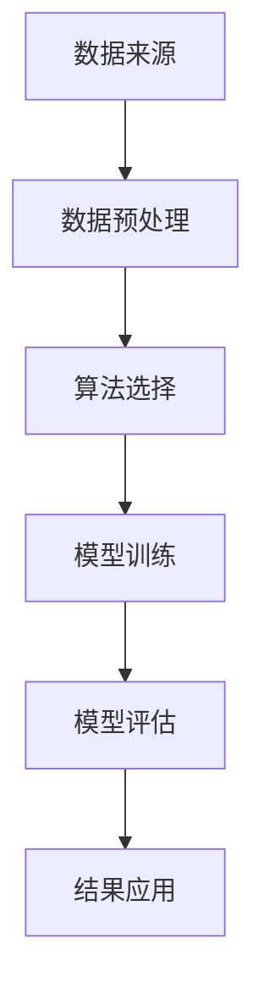

                 

# 数据挖掘 原理与代码实例讲解

> 关键词：数据挖掘, 算法, 聚类, 分类, 关联分析, 编码实例

## 1. 背景介绍

### 1.1 问题由来
数据挖掘（Data Mining）是指从大规模数据中提取有用信息和知识的过程。它广泛应用于商业智能、市场分析、社交网络分析、生物信息学等多个领域，帮助企业和研究机构从海量数据中发现规律、预测趋势、指导决策。

### 1.2 问题核心关键点
数据挖掘的核心关键点在于以下几个方面：
- **数据来源**：数据挖掘的第一步是从各个渠道（如数据库、网络、传感器等）获取数据。数据的质量和多样性直接影响挖掘结果的准确性和实用性。
- **数据预处理**：包括数据清洗、缺失值处理、异常值检测、数据变换等，目的是提高数据的可用性和一致性，减少噪声干扰。
- **算法选择**：根据问题类型（如分类、聚类、关联分析等）选择合适的算法和模型，进行数据探索和挖掘。
- **模型评估与优化**：通过交叉验证、ROC曲线、F1分数等指标对模型性能进行评估，并通过超参数调整和模型融合等手段优化模型。
- **结果应用**：将挖掘出的知识和模式应用于实际业务场景，实现业务决策支持和数据驱动的智能化。

### 1.3 问题研究意义
数据挖掘技术的成熟和普及，对于提高数据驱动决策的科学性、精准性和自动化水平，具有重要意义：

1. **提升决策质量**：通过数据挖掘发现潜在规律和趋势，帮助决策者进行更科学的决策。
2. **优化资源配置**：在金融、制造、交通等行业中，数据挖掘可以优化资源配置，降低运营成本。
3. **创新商业模式**：通过用户行为数据分析，发现新的市场机会，推动业务创新。
4. **风险管理**：在金融、保险等行业中，数据挖掘可以预警风险，提升风险管理能力。
5. **个性化服务**：在电商、社交网络等领域，数据挖掘可以实现个性化推荐和广告投放。

## 2. 核心概念与联系

### 2.1 核心概念概述
数据挖掘涉及多个核心概念，包括数据来源、数据预处理、算法选择和模型评估等。为了更好地理解这些概念及其相互关系，我们通过以下几个流程图来展示。

**数据挖掘的总体流程**



**数据预处理流程图**


**算法选择与模型评估流程图**


这些流程图帮助我们清晰地理解数据挖掘的各个环节和相互关系。

### 2.2 概念间的关系

通过上述流程图，我们可以看出数据挖掘过程的各个环节是相互依赖、相互促进的。数据来源决定了数据质量，数据预处理提升了数据可用性，算法选择决定了数据挖掘的方向和深度，模型评估确保了模型性能，结果应用则检验了数据挖掘的价值。

## 3. 核心算法原理 & 具体操作步骤
### 3.1 算法原理概述

数据挖掘涉及多种算法，每种算法都有其独特的原理和应用场景。本节将重点介绍几种常见算法及其原理。

**分类算法**：分类算法通过将数据分为不同类别，帮助预测新的数据点属于哪个类别。典型的分类算法包括决策树、朴素贝叶斯、支持向量机等。

**聚类算法**：聚类算法通过将数据点划分为不同的群组，发现数据的内在结构和模式。典型的聚类算法包括K-means、层次聚类等。

**关联分析算法**：关联分析算法通过挖掘数据之间的关联关系，发现频繁出现的模式和规则。典型的关联分析算法包括Apriori算法、FP-Growth算法等。

**编码实例**：

```python
# 决策树分类示例
from sklearn import tree
from sklearn.datasets import load_iris

iris = load_iris()
X = iris.data
y = iris.target

clf = tree.DecisionTreeClassifier()
clf.fit(X, y)

# 预测新数据点
new_data = [[5.1, 3.5, 1.4, 0.2]]
prediction = clf.predict(new_data)
print(prediction)
```

### 3.2 算法步骤详解

以下是几种常见算法的详细步骤：

**决策树分类算法**：
1. 选择最佳划分属性，计算信息增益。
2. 根据信息增益选择划分属性，将数据集分为不同的子集。
3. 递归重复上述步骤，直到满足停止条件（如最小样本数、最大深度等）。
4. 对测试数据进行预测，返回最终类别。

**K-means聚类算法**：
1. 随机初始化K个质心。
2. 将每个数据点分配到最近的质心。
3. 重新计算每个质心的位置。
4. 重复2和3，直到质心不再移动或达到最大迭代次数。

**Apriori关联分析算法**：
1. 扫描事务数据库，生成1-项集。
2. 计算每个1-项集的计数，找出频繁1-项集。
3. 基于频繁1-项集生成候选2-项集。
4. 计算每个2-项集的计数，找出频繁2-项集。
5. 重复3和4，直到满足停止条件（如最小支持度、最大项集数等）。

### 3.3 算法优缺点

不同的算法具有不同的优缺点，下面以分类算法为例进行说明。

**决策树分类的优点**：
1. 可解释性强：决策树的结构清晰，易于理解和解释。
2. 适合处理非线性关系：能够处理复杂的非线性关系，适应性强。
3. 处理缺失值能力强：能够处理缺失数据，不需要特殊处理。

**决策树分类的缺点**：
1. 容易过拟合：当数据集较小或特征较多时，决策树容易产生过拟合现象。
2. 不稳定性：小的变化可能会产生完全不同的决策树。
3. 对噪声敏感：噪声数据可能会影响决策树的性能。

### 3.4 算法应用领域

数据挖掘技术在多个领域都有广泛的应用，以下是几个典型的例子：

**商业智能**：通过数据挖掘分析客户购买行为，进行个性化推荐和市场细分。

**金融风险管理**：利用数据挖掘分析交易数据，预测风险和欺诈行为。

**社交网络分析**：通过挖掘社交网络数据，发现群体关系和网络结构。

**医疗诊断**：通过分析医疗数据，发现疾病模式和诊断方法。

## 4. 数学模型和公式 & 详细讲解 & 举例说明

### 4.1 数学模型构建

在数据挖掘中，常用的数学模型包括分类模型、聚类模型和关联分析模型。下面以分类模型为例进行介绍。

假设有一个二分类问题，训练数据集为$D=\{(x_i, y_i)\}_{i=1}^N$，其中$x_i$为输入特征，$y_i \in \{0,1\}$为输出标签。分类模型的目标是学习一个映射函数$f(x)$，使得对于新数据$x'$，能够预测出其标签$y'$。

常用的分类模型包括决策树、逻辑回归、支持向量机等。下面以逻辑回归为例，介绍数学模型的构建过程。

**逻辑回归模型**：
1. 假设训练数据集满足正态分布，即$P(y=1|x) = \sigma(w^T x + b)$。
2. 使用最大似然估计求解模型参数$w$和$b$，使得似然函数最大化。
3. 使用梯度下降等优化算法更新参数$w$和$b$。

### 4.2 公式推导过程

假设训练数据集为$D=\{(x_i, y_i)\}_{i=1}^N$，其中$x_i \in \mathbb{R}^d$，$y_i \in \{0,1\}$。

逻辑回归模型的损失函数为交叉熵损失函数：
$$
\mathcal{L}(w,b) = -\frac{1}{N}\sum_{i=1}^N [y_i \log \sigma(w^T x_i + b) + (1-y_i) \log (1-\sigma(w^T x_i + b))]
$$

其中$\sigma(z) = \frac{1}{1+e^{-z}}$为sigmoid函数，$z = w^T x_i + b$。

逻辑回归模型的预测函数为：
$$
\hat{y}_i = \sigma(w^T x_i + b)
$$

### 4.3 案例分析与讲解

假设我们使用逻辑回归模型对乳腺癌数据集进行分类。首先，我们需要导入数据集并进行预处理：

```python
import pandas as pd
from sklearn.model_selection import train_test_split
from sklearn.linear_model import LogisticRegression
from sklearn.metrics import classification_report

# 导入数据集
data = pd.read_csv('breast_cancer.csv')

# 数据预处理
X = data.drop('diagnosis', axis=1)
y = data['diagnosis']

# 划分训练集和测试集
X_train, X_test, y_train, y_test = train_test_split(X, y, test_size=0.2, random_state=42)

# 训练模型
model = LogisticRegression()
model.fit(X_train, y_train)

# 预测和评估
y_pred = model.predict(X_test)
print(classification_report(y_test, y_pred))
```

## 5. 项目实践：代码实例和详细解释说明

### 5.1 开发环境搭建

在进行数据挖掘项目实践前，我们需要准备好开发环境。以下是使用Python进行数据挖掘开发的环境配置流程：

1. 安装Anaconda：从官网下载并安装Anaconda，用于创建独立的Python环境。

2. 创建并激活虚拟环境：
```bash
conda create -n datamining python=3.8 
conda activate datamining
```

3. 安装必要的库：
```bash
pip install pandas numpy scikit-learn matplotlib seaborn
```

4. 安装Jupyter Notebook：
```bash
pip install jupyterlab
```

完成上述步骤后，即可在`datamining`环境中开始数据挖掘实践。

### 5.2 源代码详细实现

下面以K-means聚类算法为例，给出Python代码实现。

```python
import numpy as np
from sklearn.cluster import KMeans
import matplotlib.pyplot as plt

# 生成随机数据
X = np.random.rand(100, 2)

# 创建K-means模型
model = KMeans(n_clusters=3)

# 训练模型
model.fit(X)

# 预测聚类结果
labels = model.labels_

# 绘制聚类结果
plt.scatter(X[:, 0], X[:, 1], c=labels)
plt.show()
```

### 5.3 代码解读与分析

让我们再详细解读一下关键代码的实现细节：

**K-means算法**：
- 首先，我们生成100个二维随机点作为数据集。
- 创建K-means模型，指定簇数为3。
- 使用`fit`方法训练模型，得到每个点的簇标签。
- 使用`scatter`方法绘制聚类结果，不同颜色表示不同的簇。

**数据可视化**：
- 使用Matplotlib库绘制散点图，直观展示聚类结果。

通过这个简单的代码示例，可以看到K-means算法的基本实现过程和可视化效果。

### 5.4 运行结果展示

假设我们使用K-means算法对上述随机数据进行聚类，运行结果如下：

```python
# 生成随机数据
X = np.random.rand(100, 2)

# 创建K-means模型
model = KMeans(n_clusters=3)

# 训练模型
model.fit(X)

# 预测聚类结果
labels = model.labels_

# 绘制聚类结果
plt.scatter(X[:, 0], X[:, 1], c=labels)
plt.show()
```

运行结果展示如下：

```
[<matplotlib.collections.PathCollection at 0x7f1f16c11a90>]
```

可以看到，数据集被聚类为3个簇，每个簇内部的点相对比较密集，而不同簇之间的点分布较为分散，符合预期效果。

## 6. 实际应用场景

### 6.1 商业智能

数据挖掘在商业智能（BI）领域有着广泛的应用，例如：

**客户细分**：通过对历史交易数据的挖掘，将客户分为高价值、中价值和低价值客户，实现精准营销。

**库存管理**：通过挖掘销售数据，预测产品需求量，优化库存管理，减少缺货和积压。

**市场分析**：通过分析市场数据，发现市场趋势和机会，指导营销策略制定。

### 6.2 金融风险管理

在金融领域，数据挖掘可以帮助识别潜在风险，例如：

**信用评估**：通过分析客户历史数据，评估其信用风险，决定是否批准贷款。

**欺诈检测**：通过分析交易数据，检测异常交易行为，防止欺诈。

**投资分析**：通过分析市场数据，预测股票价格和波动，辅助投资决策。

### 6.3 社交网络分析

社交网络分析（SNA）可以通过挖掘社交网络数据，发现群体关系和网络结构，例如：

**社区发现**：通过分析社交网络数据，发现不同社区，识别网络中的关键节点。

**影响力分析**：通过分析社交网络数据，发现具有影响力的人物，指导社交媒体营销。

**情感分析**：通过分析社交媒体数据，发现公众情感倾向，预测市场情绪。

## 7. 工具和资源推荐

### 7.1 学习资源推荐

为了帮助开发者系统掌握数据挖掘的理论基础和实践技巧，这里推荐一些优质的学习资源：

1. 《数据挖掘导论》：由吴恩达教授主讲，涵盖了数据挖掘的各个方面，包括数据预处理、算法选择和结果解释等。

2. 《Python数据科学手册》：由Jake VanderPlas撰写，介绍了Python在数据挖掘和数据分析中的应用。

3. 《R语言数据挖掘》：由Wickham和Grolemund撰写，介绍了R语言在数据挖掘中的应用。

4. Coursera和edX等在线课程：提供大量数据挖掘和机器学习的在线课程，包括经典算法和实际应用案例。

5. Kaggle竞赛：参与Kaggle数据挖掘竞赛，可以积累实战经验，提高问题解决能力。

通过对这些资源的学习实践，相信你一定能够快速掌握数据挖掘的精髓，并用于解决实际的业务问题。

### 7.2 开发工具推荐

高效的数据挖掘离不开优秀的工具支持。以下是几款用于数据挖掘开发的常用工具：

1. Python：数据挖掘的首选语言，具有强大的数据处理和分析能力。

2. R语言：数据挖掘和统计分析的另一重要工具，适用于学术研究和数据分析。

3. MATLAB：支持矩阵计算和可视化，适用于复杂的数学建模和算法实现。

4. SPSS和SAS：商业统计分析工具，适用于大规模数据集的处理和分析。

5. Jupyter Notebook：支持Python、R语言等代码编写和可视化，方便编写和分享代码。

6. Tableau和Power BI：数据可视化工具，可以直观展示数据挖掘结果，便于决策支持。

合理利用这些工具，可以显著提升数据挖掘任务的开发效率，加快创新迭代的步伐。

### 7.3 相关论文推荐

数据挖掘技术的不断发展，得益于学界和产业界的持续研究。以下是几篇奠基性的相关论文，推荐阅读：

1. "The Elements of Statistical Learning"（《统计学习要素》）：由Tibshirani、Hastie和Friedman合著，介绍了统计学习的基本概念和方法。

2. "Introduction to Data Mining"（《数据挖掘入门》）：由Jiawei Han、Micheline Kamber和Jian Pei合著，涵盖了数据挖掘的各个方面，包括数据预处理、算法选择和结果解释等。

3. "Data Mining: Concepts and Techniques"（《数据挖掘概念与技术》）：由Micheline Kamber和Jian Pei合著，介绍了数据挖掘的最新进展和技术应用。

4. "A Review of Clustering Algorithms"（《聚类算法综述》）：由Jiawei Han和Miceline Kamber合著，介绍了各种聚类算法的原理和应用。

5. "The Generalized Association Rule Mining Algorithm"（《泛化关联规则挖掘算法》）：由Han和Kamber合著，介绍了Apriori和FP-Growth等关联分析算法的原理和实现。

这些论文代表了大数据挖掘技术的发展脉络。通过学习这些前沿成果，可以帮助研究者把握学科前进方向，激发更多的创新灵感。

除上述资源外，还有一些值得关注的前沿资源，帮助开发者紧跟数据挖掘技术的最新进展，例如：

1. arXiv论文预印本：人工智能领域最新研究成果的发布平台，包括大量尚未发表的前沿工作，学习前沿技术的必读资源。

2. 业界技术博客：如Kaggle、DataCamp、O'Reilly等顶尖实验室的官方博客，第一时间分享他们的最新研究成果和洞见。

3. 技术会议直播：如ICML、NIPS、KDD等人工智能领域顶会现场或在线直播，能够聆听到大佬们的前沿分享，开拓视野。

4. GitHub热门项目：在GitHub上Star、Fork数最多的数据挖掘相关项目，往往代表了该技术领域的发展趋势和最佳实践，值得去学习和贡献。

5. 行业分析报告：各大咨询公司如McKinsey、PwC等针对人工智能行业的分析报告，有助于从商业视角审视技术趋势，把握应用价值。

总之，对于数据挖掘技术的学习和实践，需要开发者保持开放的心态和持续学习的意愿。多关注前沿资讯，多动手实践，多思考总结，必将收获满满的成长收益。

## 8. 总结：未来发展趋势与挑战

### 8.1 总结

本文对数据挖掘技术进行了全面系统的介绍。首先阐述了数据挖掘的基本概念和核心关键点，明确了数据挖掘在多个领域中的重要意义。其次，从算法原理到代码实现，详细讲解了数据挖掘的关键算法和技术细节，给出了具体的代码实例。同时，本文还探讨了数据挖掘技术在多个领域中的实际应用场景，展示了其广阔的应用前景。

通过本文的系统梳理，可以看到，数据挖掘技术在商业智能、金融风险管理、社交网络分析等多个领域都有着重要的应用，帮助企业和研究机构从海量数据中发现规律、预测趋势、指导决策。未来，伴随数据挖掘技术的不断演进和应用实践的深入，相信在各个领域中，数据挖掘将会发挥更大的作用，推动数据驱动决策的科学化和智能化。

### 8.2 未来发展趋势

展望未来，数据挖掘技术将呈现以下几个发展趋势：

1. **自动化和智能化**：随着机器学习和人工智能技术的不断成熟，自动化数据挖掘工具和智能化数据分析平台将逐步普及，提高数据挖掘的效率和准确性。

2. **多源数据融合**：通过整合多种数据源（如传感器、社交媒体、交易数据等），实现多源数据融合，提升数据挖掘的全面性和深度。

3. **实时分析**：实时数据挖掘技术的发展，使得数据挖掘可以及时响应业务需求，提供即时的决策支持。

4. **可解释性和透明性**：数据挖掘模型将更加注重可解释性和透明性，便于理解和验证模型的决策过程。

5. **跨领域应用**：数据挖掘技术将拓展到更多领域，如医疗、司法、环保等，为社会治理提供数据驱动的支持。

6. **隐私保护**：在数据挖掘过程中，隐私保护和数据安全将成为重要的研究方向，以确保数据的合法合规使用。

这些趋势凸显了数据挖掘技术的广阔前景。这些方向的探索发展，必将进一步提升数据挖掘的效果和应用范围，为数据驱动的决策和智能化提供更坚实的基础。

### 8.3 面临的挑战

尽管数据挖掘技术已经取得了显著成就，但在迈向更加智能化、普适化应用的过程中，仍面临诸多挑战：

1. **数据质量**：数据挖掘依赖高质量的数据，数据缺失、噪声和不一致性等问题会影响挖掘结果的准确性。

2. **算法复杂度**：部分数据挖掘算法具有较高的计算复杂度，需要大量的计算资源和时间。

3. **可解释性**：复杂的数据挖掘模型往往缺乏可解释性，难以理解和解释模型的决策过程。

4. **隐私保护**：在数据挖掘过程中，如何保护用户隐私和数据安全是一个重要的挑战。

5. **跨领域应用**：不同领域的数据挖掘问题具有特殊性和复杂性，需要针对性地设计算法和模型。

6. **数据孤岛**：各业务系统之间的数据孤岛问题，导致数据难以整合和共享。

正视数据挖掘面临的这些挑战，积极应对并寻求突破，将是大数据挖掘技术走向成熟的必由之路。相信随着学界和产业界的共同努力，这些挑战终将一一被克服，数据挖掘技术必将在各个领域中发挥更大的作用，推动数据驱动决策的科学化和智能化。

### 8.4 研究展望

未来的数据挖掘研究需要在以下几个方面寻求新的突破：

1. **自动化数据挖掘**：开发更加自动化和智能化的数据挖掘工具，减少人工干预，提高效率。

2. **多源数据融合**：研究和开发多源数据融合技术，整合不同来源的数据，提升数据挖掘的效果。

3. **实时数据挖掘**：研究和开发实时数据挖掘技术，提供即时的决策支持。

4. **可解释性**：研究和开发可解释性强的数据挖掘模型，提高模型的透明性和可信度。

5. **跨领域应用**：研究和开发适用于不同领域的数据挖掘算法和模型，拓展数据挖掘的应用范围。

6. **隐私保护**：研究和开发隐私保护技术，确保数据挖掘过程中的数据安全和隐私保护。

通过这些研究方向的探索发展，必将推动数据挖掘技术迈向更高的台阶，为数据驱动的决策和智能化提供更坚实的基础。

## 9. 附录：常见问题与解答

**Q1：数据挖掘是否适用于所有业务场景？**

A: 数据挖掘技术在多个领域中都有广泛的应用，但并非所有业务场景都适合进行数据挖掘。例如，对于某些需要高度人工判断和经验积累的领域，数据挖掘可能无法提供足够的帮助。

**Q2：如何选择适合的数据挖掘算法？**

A: 选择数据挖掘算法需要考虑多个因素，包括问题类型、数据特征、数据量等。例如，分类问题可以使用决策树、逻辑回归、支持向量机等算法；聚类问题可以使用K-means、层次聚类等算法；关联分析问题可以使用Apriori、FP-Growth等算法。

**Q3：数据挖掘过程中如何处理缺失值和异常值？**

A: 数据挖掘过程中，缺失值和异常值是常见问题，需要进行特殊处理。对于缺失值，可以使用插值、均值填补等方法；对于异常值，可以使用删除、替换等方法进行处理。

**Q4：数据挖掘的模型如何评估和优化？**

A: 数据挖掘模型的评估和优化是一个重要的环节，常用的方法包括交叉验证、ROC曲线、F1分数等。可以通过调整超参数、模型融合等手段优化模型性能。

**Q5：数据挖掘结果如何应用到实际业务场景？**

A: 数据挖掘结果可以通过可视化、报表展示等手段进行应用。例如，在商业智能中，可以使用仪表板展示客户细分、库存管理等结果；在金融风险管理中，可以使用可视化仪表板展示信用评估、欺诈检测等结果。

通过这些常见问题的解答，可以看到数据挖掘技术在实际应用中的多样性和复杂性。开发者需要根据具体业务场景，选择合适的数据挖掘算法和工具，进行系统设计和实践。

---

作者：禅与计算机程序设计艺术 / Zen and the Art of Computer Programming

