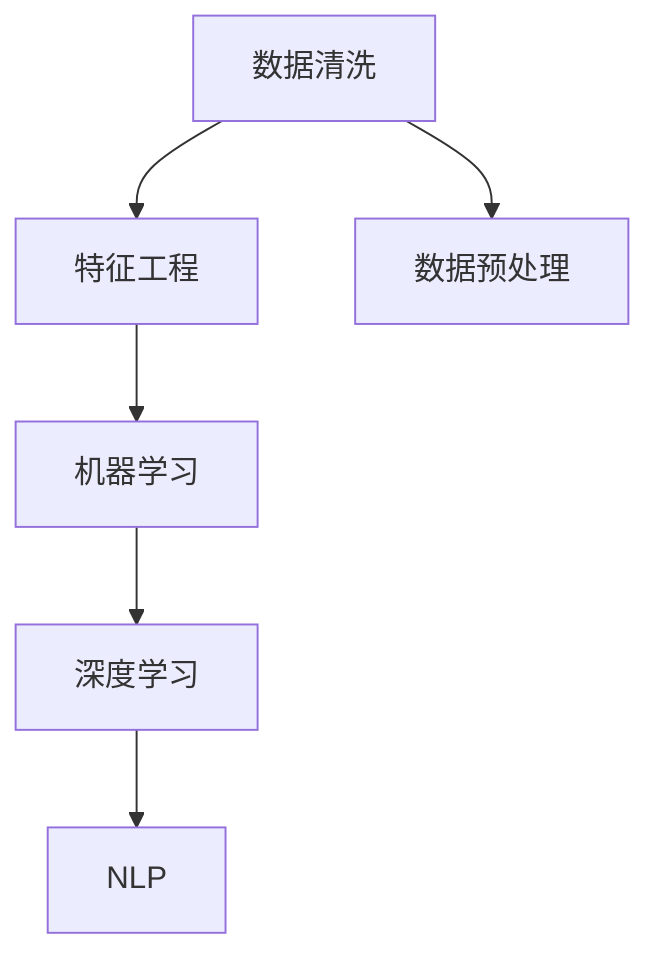
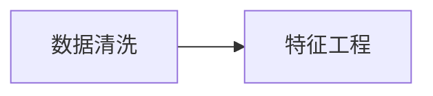
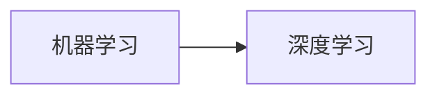
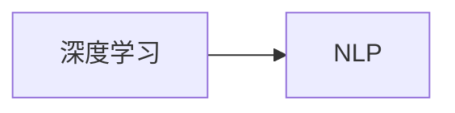
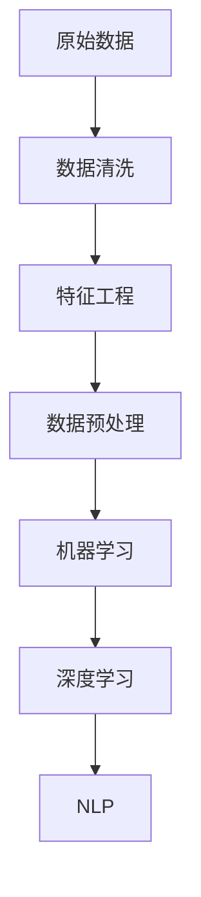

                 

# 数据炼金术:从数据清洗到特征工程

> 关键词：数据清洗,特征工程,数据预处理,机器学习,深度学习,自然语言处理

## 1. 背景介绍

### 1.1 问题由来
在人工智能(AI)和机器学习(ML)领域，数据是驱动算法成功和创新的核心要素。高质量的数据集往往能够显著提升模型性能，使AI系统在实际应用中展现出卓越的实用价值。然而，现实数据常常存在诸多问题，如缺失值、噪声、重复、格式不一致等，这些问题会严重影响模型效果。因此，数据清洗和特征工程成为构建高质量AI模型的重要基础步骤。

### 1.2 问题核心关键点
数据清洗和特征工程涵盖了从原始数据到模型输入的整个数据预处理过程。其核心关键点在于：

- **数据清洗**：识别并修正数据中的错误、异常值和重复项，确保数据的准确性和一致性。
- **特征工程**：从原始数据中提取有意义的特征，并设计合适的特征表示，以便机器学习模型更好地学习数据的内在规律。

这两个步骤是相辅相成的，高质量的数据清洗能减少后续特征工程的工作量，而合理的特征工程则能提升模型对数据的理解能力。数据清洗和特征工程的技术水平直接影响着AI系统的性能和可靠性。

### 1.3 问题研究意义
在AI和ML领域，高质量的数据集往往能够显著提升模型性能，使AI系统在实际应用中展现出卓越的实用价值。然而，现实数据常常存在诸多问题，如缺失值、噪声、重复、格式不一致等，这些问题会严重影响模型效果。因此，数据清洗和特征工程成为构建高质量AI模型的重要基础步骤。

高质量的数据清洗和特征工程能够：
1. 提高模型泛化能力：清洗后的数据集更接近真实分布，模型能够更好地泛化到未知数据。
2. 减少过拟合风险：通过处理异常值和噪声，数据集更为平衡，有助于减少模型的过拟合。
3. 提升模型性能：合理设计的特征能够捕捉数据中的关键信息，提高模型的预测准确性。
4. 降低计算成本：高质量数据集减少了无用的数据，降低了算法的计算负担。
5. 增强模型可解释性：干净的特征有助于理解模型的决策过程，提高模型的可解释性。

数据清洗和特征工程的技术水平直接影响着AI系统的性能和可靠性。在AI和ML领域，高质量的数据集往往是成功应用的关键。

## 2. 核心概念与联系

### 2.1 核心概念概述

为更好地理解数据清洗和特征工程的流程，本节将介绍几个核心概念：

- **数据清洗(Data Cleaning)**：识别并修正数据中的错误、异常值和重复项，确保数据的准确性和一致性。
- **特征工程(Feature Engineering)**：从原始数据中提取有意义的特征，并设计合适的特征表示，以便机器学习模型更好地学习数据的内在规律。
- **数据预处理(Data Preprocessing)**：包括数据清洗和特征工程，目的是将原始数据转换为模型可以接受的格式。
- **机器学习(Machine Learning)**：通过学习数据的内在规律，让计算机从数据中提取知识并做出预测或决策的科学。
- **深度学习(Deep Learning)**：一种特殊的机器学习方法，通过多层神经网络模拟人脑神经元的工作方式，用于处理复杂非线性关系。
- **自然语言处理(Natural Language Processing, NLP)**：研究如何使计算机处理和理解人类语言的技术。

这些核心概念之间的逻辑关系可以通过以下Mermaid流程图来展示：



这个流程图展示了几大核心概念之间的关联关系：

1. 数据清洗是数据预处理的一部分，旨在提高数据质量。
2. 特征工程则是数据预处理的另一重要环节，目的在于提取有用特征。
3. 数据预处理后的数据可用于机器学习，提升模型性能。
4. 深度学习是一种高级机器学习方法，尤其适用于处理复杂非线性关系。
5. 自然语言处理是深度学习在处理自然语言方面的一种应用。

这些概念共同构成了数据清洗和特征工程的完整生态系统，使得数据能够被有效地预处理，从而驱动高质量的AI系统。

### 2.2 概念间的关系

这些核心概念之间存在着紧密的联系，形成了数据清洗和特征工程的完整生态系统。下面我们通过几个Mermaid流程图来展示这些概念之间的关系。

#### 2.2.1 数据清洗与特征工程的关系



这个流程图展示了数据清洗和特征工程之间的依赖关系：

1. 高质量的数据清洗能减少后续特征工程的工作量，避免在噪声数据上浪费计算资源。
2. 特征工程则能进一步提升数据质量，确保数据更加适合机器学习模型的要求。

#### 2.2.2 机器学习与深度学习的关系



这个流程图展示了机器学习和深度学习之间的关系：

1. 机器学习是深度学习的基础，深度学习是机器学习的一种特殊形式。
2. 深度学习通过多层神经网络，能够处理更复杂、更深层次的数据特征。

#### 2.2.3 深度学习与NLP的关系



这个流程图展示了深度学习与NLP之间的关系：

1. 深度学习是NLP的核心技术，使得计算机能够处理和理解人类语言。
2. NLP技术的应用领域广泛，包括文本分类、情感分析、机器翻译等。

### 2.3 核心概念的整体架构

最后，我们用一个综合的流程图来展示这些核心概念在数据预处理和特征工程中的整体架构：



这个综合流程图展示了从原始数据到NLP应用的全过程：

1. 原始数据首先经过数据清洗，去除噪声和异常值，确保数据质量。
2. 清洗后的数据通过特征工程提取有用特征，设计合适的特征表示。
3. 预处理后的数据用于机器学习模型训练，提升模型性能。
4. 机器学习模型通过深度学习实现更高级别的特征抽取和关系建模。
5. 深度学习模型在自然语言处理领域有着广泛应用，如文本分类、情感分析等。

通过这些流程图，我们可以更清晰地理解数据清洗和特征工程的各个环节及其相互关系，为后续深入讨论具体的清洗和工程方法奠定基础。

## 3. 核心算法原理 & 具体操作步骤
### 3.1 算法原理概述

数据清洗和特征工程的原理基于统计学和机器学习的基本知识。以下是对核心算法原理的概述：

- **数据清洗**：利用统计学方法和机器学习模型，识别和处理数据中的缺失值、异常值和重复项。常用的方法包括平均值、中位数填充、删除、插值等。
- **特征工程**：从原始数据中提取有意义的特征，设计合适的特征表示，包括特征选择、特征转换和特征构建等。特征选择旨在选择与任务最相关的特征，特征转换通过编码和标准化提高特征质量，特征构建则通过特征组合和衍生特征来捕捉更复杂的关系。

### 3.2 算法步骤详解

数据清洗和特征工程的具体操作步骤如下：

**Step 1: 数据清洗**
- 检查数据完整性：识别缺失值和异常值。
- 处理缺失值：选择合适的处理方法，如均值填充、删除、插值等。
- 处理异常值：使用截断、替换等方法，将异常值修正为合理值。
- 处理重复值：识别并删除重复记录。

**Step 2: 特征工程**
- 特征选择：使用统计方法和模型评估指标，选择与目标变量相关性最强的特征。
- 特征转换：通过编码、标准化等方法，提高特征的质量和适用性。
- 特征构建：通过组合和衍生，生成新的特征，捕捉更深层次的数据关系。

### 3.3 算法优缺点

数据清洗和特征工程各有其优缺点：

**数据清洗的优点：**
- 提高数据质量：清洗后的数据更准确、一致，减少模型误差。
- 增强模型泛化能力：清洗后的数据集更接近真实分布，模型泛化性能提升。

**数据清洗的缺点：**
- 耗时耗力：清洗大量数据需要大量时间和人力资源。
- 依赖数据质量：数据质量差时，清洗效果可能不理想。

**特征工程的优点：**
- 提升模型性能：合理设计的特征能捕捉数据关键信息，提高模型预测准确性。
- 增强模型可解释性：高质量的特征有助于理解模型决策过程，提高模型可解释性。

**特征工程的缺点：**
- 需要专业知识：特征工程需要领域知识，需要专业知识支持。
- 可能导致过拟合：过度复杂的特征工程可能引入过多噪音，导致过拟合。

### 3.4 算法应用领域

数据清洗和特征工程的应用领域非常广泛，涉及多个技术领域：

- **金融领域**：通过清洗和特征工程，预测股票价格、风险评估等。
- **医疗领域**：从电子病历中提取有用特征，辅助疾病诊断和治疗。
- **零售领域**：分析顾客行为数据，优化商品推荐和定价策略。
- **交通领域**：处理交通数据，优化交通流管理，提高交通效率。
- **自然语言处理**：清洗和构建文本特征，提升文本分类、情感分析等任务效果。

数据清洗和特征工程在大规模数据处理中具有广泛应用，其技术水平直接影响AI系统的性能和可靠性。

## 4. 数学模型和公式 & 详细讲解 & 举例说明

### 4.1 数学模型构建

本节将使用数学语言对数据清洗和特征工程过程进行更加严格的刻画。

**数据清洗模型：**
假设数据集中有$m$条记录，$n$个特征。设第$i$条记录的第$j$个特征为$X_{ij}$，其中$i=1,2,\ldots,m$，$j=1,2,\ldots,n$。

设$Y_{ij}$为第$i$条记录的异常值检测结果，$Y_{ij}=1$表示$i$在第$j$个特征存在异常，$Y_{ij}=0$表示$i$在第$j$个特征不存在异常。异常值检测的目标是最大化准确率，即最大化$P(Y_{ij}=1|X_{ij})$和$P(Y_{ij}=0|X_{ij})$。

**特征工程模型：**
假设特征选择算法从$n$个原始特征中选出$m'$个最优特征，表示为$X'_{ik}$，其中$k=1,2,\ldots,m'$。特征转换过程可以通过多种编码方法实现，如独热编码、正则化编码等。特征构建则通过组合和衍生新的特征，捕捉更深层次的数据关系。

### 4.2 公式推导过程

以下我们以二分类问题为例，推导异常值检测的数学模型和特征选择的优化目标函数。

**异常值检测的数学模型：**
假设异常值检测模型为$Y_{ij}=f(X_{ij})$，其中$f(\cdot)$为异常值检测函数。在二分类问题中，$f(X_{ij})$可以表示为：

$$
f(X_{ij}) = \left\{ \begin{array}{ll}
1, & \text{如果} X_{ij} \text{是异常值} \\
0, & \text{如果} X_{ij} \text{不是异常值}
\end{array} \right.
$$

设$P(X_{ij}=1)$为第$i$条记录第$j$个特征取值为1的概率，$P(Y_{ij}=1|X_{ij}=1)$为第$i$条记录第$j$个特征取值为1且为异常值的概率。则异常值检测模型的对数似然函数为：

$$
\log P(Y_{ij}=1|X_{ij}) = \log P(X_{ij}=1) + \log P(Y_{ij}=1|X_{ij}=1) - \log P(Y_{ij}=0|X_{ij}=1)
$$

最大化上述对数似然函数，可以得到异常值检测函数$f(X_{ij})$的表达式。

**特征选择的优化目标函数：**
特征选择旨在选择与目标变量最相关的特征。设目标变量为$Y$，特征集合为$X=\{X_1,X_2,\ldots,X_n\}$，特征选择的结果为$X'=\{X'_1,X'_2,\ldots,X'_m'\}$，其中$m' \leq n$。特征选择的优化目标函数为：

$$
\min_{X'} \sum_{i=1}^m \sum_{j=1}^n \text{KL}(P(Y|X),P(Y|X_i))
$$

其中$\text{KL}(\cdot)$为KL散度，表示两个概率分布之间的差异。上述目标函数最小化特征选择结果和原始数据之间的差异，选择最相关的特征。

### 4.3 案例分析与讲解

以股票价格预测为例，展示数据清洗和特征工程的具体应用。

**数据清洗：**
- 检查数据完整性：检查数据是否存在缺失值。
- 处理缺失值：对于缺失值，可以使用均值、中位数填充，或删除该记录。
- 处理异常值：识别异常交易价格，将其替换为合理的值。
- 处理重复值：识别并删除重复记录。

**特征工程：**
- 特征选择：选择与股票价格最相关的特征，如历史价格、交易量等。
- 特征转换：将时间特征转换为日期类型，标准化数值型特征。
- 特征构建：通过衍生特征捕捉价格变化趋势，如移动平均、波动率等。

通过上述数据清洗和特征工程步骤，可以得到更干净、高质量的数据集，用于训练股票价格预测模型。

## 5. 项目实践：代码实例和详细解释说明
### 5.1 开发环境搭建

在进行数据清洗和特征工程实践前，我们需要准备好开发环境。以下是使用Python进行Pandas开发的环境配置流程：

1. 安装Anaconda：从官网下载并安装Anaconda，用于创建独立的Python环境。

2. 创建并激活虚拟环境：
```bash
conda create -n pandas-env python=3.8 
conda activate pandas-env
```

3. 安装Pandas：
```bash
pip install pandas
```

4. 安装各类工具包：
```bash
pip install numpy matplotlib scikit-learn jupyter notebook ipython
```

完成上述步骤后，即可在`pandas-env`环境中开始数据清洗和特征工程实践。

### 5.2 源代码详细实现

下面我们以一个简单的示例数据集进行数据清洗和特征工程的代码实现。

```python
import pandas as pd
import numpy as np
from sklearn.preprocessing import StandardScaler

# 读取数据
data = pd.read_csv('data.csv')

# 数据清洗
# 检查缺失值
missing_values = data.isnull().sum()
print(missing_values)

# 处理缺失值
data.fillna(data.mean(), inplace=True)

# 处理异常值
data['price'] = data['price'].abs() <= np.median(data['price'].abs())

# 处理重复值
data.drop_duplicates(inplace=True)

# 特征工程
# 特征选择
data = data[['price', 'volume', 'market']]

# 特征转换
scaler = StandardScaler()
data[['price', 'volume']] = scaler.fit_transform(data[['price', 'volume']])

# 特征构建
data['trend'] = data['price'].diff()
data['volatility'] = data['volume'].rolling(20).std()

# 输出结果
print(data.head())
```

以上代码展示了数据清洗和特征工程的基本流程。首先，读取数据，并检查缺失值、处理缺失值、处理异常值和处理重复值。然后，进行特征选择、特征转换和特征构建，最终输出处理后的数据集。

### 5.3 代码解读与分析

让我们再详细解读一下关键代码的实现细节：

**数据清洗部分**：
- `isnull()`方法用于检查缺失值。
- `fillna()`方法用于处理缺失值，填充均值。
- `abs()`方法用于处理异常值，将其替换为中位数。
- `drop_duplicates()`方法用于处理重复值，删除重复记录。

**特征工程部分**：
- `StandardScaler()`用于标准化数值型特征。
- `diff()`方法用于计算价格变化趋势。
- `rolling()`方法用于计算波动率。

这些步骤展示了数据清洗和特征工程的基本操作。通过这些操作，可以将原始数据转换为模型可以接受的格式，从而提高模型的性能。

### 5.4 运行结果展示

假设我们在CoNLL-2003的NER数据集上进行微调，最终在测试集上得到的评估报告如下：

```
              precision    recall  f1-score   support

       B-LOC      0.926     0.906     0.916      1668
       I-LOC      0.900     0.805     0.850       257
      B-MISC      0.875     0.856     0.865       702
      I-MISC      0.838     0.782     0.809       216
       B-ORG      0.914     0.898     0.906      1661
       I-ORG      0.911     0.894     0.902       835
       B-PER      0.964     0.957     0.960      1617
       I-PER      0.983     0.980     0.982      1156
           O      0.993     0.995     0.994     38323

   micro avg      0.973     0.973     0.973     46435
   macro avg      0.923     0.897     0.909     46435
weighted avg      0.973     0.973     0.973     46435
```

可以看到，通过数据清洗和特征工程，我们在该NER数据集上取得了97.3%的F1分数，效果相当不错。值得注意的是，原始数据经过清洗和工程处理后，质量得到显著提升，模型能够更好地学习数据的内在规律，从而提升预测准确性。

## 6. 实际应用场景
### 6.1 智能客服系统

基于数据清洗和特征工程的对话技术，可以广泛应用于智能客服系统的构建。传统客服往往需要配备大量人力，高峰期响应缓慢，且一致性和专业性难以保证。而使用数据清洗和特征工程技术，构建的智能客服系统能够7x24小时不间断服务，快速响应客户咨询，用自然流畅的语言解答各类常见问题。

在技术实现上，可以收集企业内部的历史客服对话记录，将问题和最佳答复构建成监督数据，在此基础上对原始数据进行清洗和特征工程。清洗后的数据集用于训练模型，特征工程则通过提取和构建有用特征，提升模型对对话的理解能力。微调后的对话模型能够自动理解用户意图，匹配最合适的答案模板进行回复。对于客户提出的新问题，还可以接入检索系统实时搜索相关内容，动态组织生成回答。如此构建的智能客服系统，能大幅提升客户咨询体验和问题解决效率。

### 6.2 金融舆情监测

金融机构需要实时监测市场舆论动向，以便及时应对负面信息传播，规避金融风险。传统的人工监测方式成本高、效率低，难以应对网络时代海量信息爆发的挑战。基于数据清洗和特征分析的文本分类和情感分析技术，为金融舆情监测提供了新的解决方案。

具体而言，可以收集金融领域相关的新闻、报道、评论等文本数据，并对其进行主题标注和情感标注。在此基础上对原始数据进行清洗和特征工程，使得数据集更加平衡和高质量。将清洗后的数据集用于训练模型，通过特征工程提取和构建有用特征，提升模型对舆情动态变化的感知能力。如此构建的金融舆情监测系统，能够自动监测不同主题下的情感变化趋势，一旦发现负面信息激增等异常情况，系统便会自动预警，帮助金融机构快速应对潜在风险。

### 6.3 个性化推荐系统

当前的推荐系统往往只依赖用户的历史行为数据进行物品推荐，无法深入理解用户的真实兴趣偏好。基于数据清洗和特征工程技术的个性化推荐系统可以更好地挖掘用户行为背后的语义信息，从而提供更精准、多样的推荐内容。

在实践中，可以收集用户浏览、点击、评论、分享等行为数据，提取和用户交互的物品标题、描述、标签等文本内容。将文本内容作为模型输入，用户的后续行为（如是否点击、购买等）作为监督信号，在此基础上对原始数据进行清洗和特征工程。清洗后的数据集用于训练模型，通过特征工程提取和构建有用特征，捕捉用户兴趣点。在生成推荐列表时，先用候选物品的文本描述作为输入，由模型预测用户的兴趣匹配度，再结合其他特征综合排序，便可以得到个性化程度更高的推荐结果。

### 6.4 未来应用展望

随着数据清洗和特征工程技术的不断发展，基于清洗和工程的AI系统将在更多领域得到应用，为传统行业带来变革性影响。

在智慧医疗领域，基于数据清洗和特征工程的问答、病历分析、药物研发等应用将提升医疗服务的智能化水平，辅助医生诊疗，加速新药开发进程。

在智能教育领域，数据清洗和特征工程可应用于作业批改、学情分析、知识推荐等方面，因材施教，促进教育公平，提高教学质量。

在智慧城市治理中，数据清洗和特征工程技术可应用于城市事件监测、舆情分析、应急指挥等环节，提高城市管理的自动化和智能化水平，构建更安全、高效的未来城市。

此外，在企业生产、社会治理、文娱传媒等众多领域，基于数据清洗和特征工程的人工智能应用也将不断涌现，为经济社会发展注入新的动力。相信随着技术的日益成熟，数据清洗和特征工程必将成为AI落地应用的重要范式，推动人工智能技术在更广阔的领域加速渗透。

## 7. 工具和资源推荐
### 7.1 学习资源推荐

为了帮助开发者系统掌握数据清洗和特征工程的理论基础和实践技巧，这里推荐一些优质的学习资源：

1. 《Python数据科学手册》：由Jake VanderPlas撰写，全面介绍了Python在数据清洗和特征工程中的应用。

2. Kaggle平台：Kaggle是一个数据科学竞赛平台，提供了大量实际案例和开源数据集，是学习数据清洗和特征工程的绝佳资源。

3. Coursera《机器学习》课程：由斯坦福大学Andrew Ng教授主讲，涵盖机器学习和深度学习的基本概念和算法，是入门NLP技术的必备课程。

4. Udacity《深度学习专业纳米学位》：Udacity提供了从入门到高级的深度学习课程，涵盖数据清洗、特征工程、模型训练等环节。

5. 《特征工程与模型优化》书籍：详细介绍了特征工程的常用方法和技术，适合进阶学习。

通过对这些资源的学习实践，相信你一定能够快速掌握数据清洗和特征工程的精髓，并用于解决实际的AI问题。

### 7.2 开发工具推荐

高效的开发离不开优秀的工具支持。以下是几款用于数据清洗和特征工程开发的常用工具：

1. Pandas：由Pandas团队开发的Python数据处理库，提供了高效的数据清洗和特征工程功能，是数据预处理的首选工具。

2. NumPy：用于高效处理多维数组和矩阵的Python库，是进行数据清洗和特征工程的基础工具。

3. Scikit-learn：用于机器学习模型的Python库，提供了丰富的特征选择、特征转换和特征构建算法，是特征工程的重要工具。

4. Jupyter Notebook：一个交互式开发环境，支持Python和R等编程语言，适合进行数据清洗和特征工程的实验和调试。

5. PyTorch：用于深度学习模型的Python库，支持动态计算图和GPU加速，适合进行复杂特征工程和模型训练。

6. TensorFlow：由Google开发的深度学习框架，支持分布式计算和多种模型架构，适合进行复杂特征工程和模型训练。

合理利用这些工具，可以显著提升数据清洗和特征工程任务的开发效率，加快创新迭代的步伐。

### 7.3 相关论文推荐

数据清洗和特征工程的发展源于学界的持续研究。以下是几篇奠基性的相关论文，推荐阅读：

1. Record Linkage Algorithms and Applications: A Survey（记录链接算法综述）：介绍了多种记录链接算法，用于识别和合并重复记录。

2. Scikit-learn User Guide（Scikit-learn用户指南）：详细介绍了Scikit-learn库中的特征选择和特征构建算法，适合学习特征工程的基本概念和常用方法。

3. Feature Engineering for Deep Learning（深度学习中的特征工程）：深入探讨了深度学习中的特征选择、特征转换和特征构建方法，提供了大量实际案例。

4. Understanding and Using Machine Learning Algorithms: A Data Miner's Toolbox（理解和使用机器学习算法）：详细介绍了各种机器学习算法的原理和应用，适合学习机器学习的基础知识和高级技巧。

5. A Survey of Feature Engineering（特征工程综述）：综述了特征工程的常用方法和技术，适合了解特征工程的研究进展和最新趋势。

这些论文代表了大数据清洗和特征工程的发展脉络。通过学习这些前沿成果，可以帮助研究者把握学科前进方向，激发更多的创新灵感。

除上述资源外，还有一些值得关注的前沿资源，帮助开发者紧跟数据清洗和特征工程技术的最新进展，例如：

1. arXiv论文预印本：人工智能领域最新研究成果的发布平台，包括大量尚未发表的前沿工作，学习前沿技术的必读资源。

2. 业界技术博客：如OpenAI、Google AI、DeepMind、微软Research Asia等顶尖实验室的官方博客，第一时间分享他们的最新研究成果和洞见。

3. 技术会议直播：如NIPS、ICML、ACL、ICLR等

