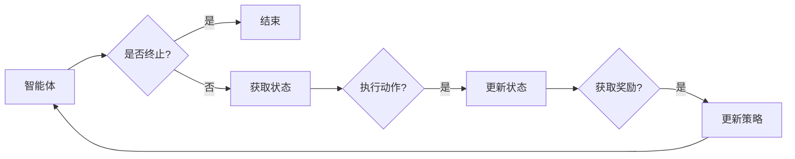

# 强化学习Reinforcement Learning在医疗健康领域的应用探索

> 关键词：强化学习，医疗健康，临床决策，个性化治疗，药物发现，医疗诊断，深度强化学习

## 1. 背景介绍

医疗健康领域一直是科技创新的前沿，随着人工智能技术的飞速发展，强化学习（Reinforcement Learning, RL）作为一种强大的机器学习方法，逐渐成为医疗健康领域研究的热点。强化学习通过智能体在环境中与环境的交互，学习最优策略，以实现特定目标。这种学习方式与人类医生在复杂医疗环境中的决策过程有相似之处，因此，强化学习在医疗健康领域的应用前景广阔。

### 1.1 问题的由来

医疗健康领域面临着诸多挑战，如：

- **临床决策**：医生在面对复杂病例时，需要做出快速而准确的决策，这需要大量的经验和专业知识。
- **个性化治疗**：患者个体差异大，需要根据患者的具体情况制定个性化的治疗方案。
- **药物发现**：新药研发周期长、成本高，且失败风险大。
- **医疗诊断**：早期诊断对疾病治疗至关重要，但许多疾病在早期症状不明显。

强化学习可以通过模拟医生决策过程，学习如何处理这些挑战。

### 1.2 研究现状

目前，强化学习在医疗健康领域的应用主要集中在以下方面：

- **临床决策**：通过强化学习，智能体可以学习最优的治疗方案，辅助医生进行临床决策。
- **个性化治疗**：根据患者的具体情况进行个性化治疗，提高治疗效果。
- **药物发现**：通过强化学习，智能体可以学习如何发现新的药物，加速新药研发进程。
- **医疗诊断**：辅助医生进行疾病诊断，提高诊断准确率。

### 1.3 研究意义

强化学习在医疗健康领域的应用具有重要意义：

- **提高医疗质量**：辅助医生做出更准确的诊断和治疗方案，提高医疗质量。
- **降低医疗成本**：通过个性化治疗，减少不必要的医疗资源浪费。
- **加速新药研发**：通过强化学习，加速新药研发进程，降低新药研发成本。
- **提升患者体验**：提供更加个性化的医疗服务，提升患者满意度。

### 1.4 本文结构

本文将围绕强化学习在医疗健康领域的应用展开，主要内容如下：

- 第2部分，介绍强化学习的基本概念和流程。
- 第3部分，详细介绍强化学习在医疗健康领域的具体应用。
- 第4部分，分析强化学习在医疗健康领域的挑战和解决方案。
- 第5部分，探讨强化学习的未来发展趋势。

## 2. 核心概念与联系

强化学习是一种通过与环境交互来学习最优策略的机器学习方法。以下是强化学习的核心概念和流程：

### 2.1 核心概念

- **智能体（Agent）**：执行动作并从环境中获取奖励的实体。
- **环境（Environment）**：智能体所处的环境，智能体可以通过执行动作改变环境状态。
- **状态（State）**：环境在某一时刻的状态，智能体的动作和奖励与当前状态有关。
- **动作（Action）**：智能体可以执行的操作，用于改变环境状态。
- **奖励（Reward）**：智能体执行动作后获得的奖励，用于指导智能体的学习过程。
- **策略（Policy）**：智能体决定如何从状态转移到下一个状态，并选择动作的策略。
- **价值函数（Value Function）**：评估智能体在某个状态下的长期预期奖励。
- **模型（Model）**：智能体对环境的建模，用于预测环境状态和奖励。

### 2.2 Mermaid 流程图



### 2.3 核心概念联系

强化学习中的智能体、环境、状态、动作、奖励、策略和价值函数等概念相互关联，共同构成了强化学习的基本框架。

## 3. 核心算法原理 & 具体操作步骤

### 3.1 算法原理概述

强化学习的基本原理是，智能体通过与环境的交互，不断学习如何从当前状态转移到下一个状态，并选择动作以获得最大奖励。

### 3.2 算法步骤详解

1. **定义状态空间和动作空间**：确定智能体可以执行的动作范围。
2. **定义奖励函数**：设计奖励函数，用于评估智能体执行动作后的效果。
3. **选择强化学习算法**：根据具体问题选择合适的强化学习算法，如Q学习、SARSA、Deep Q-Network (DQN) 等。
4. **训练智能体**：通过与环境交互，不断更新策略，直至达到预定的训练目标。

### 3.3 算法优缺点

#### 优点：

- **自适应性强**：智能体可以自动调整策略，以适应不断变化的环境。
- **无需大量标注数据**：与监督学习相比，强化学习可以处理未标记数据，降低数据标注成本。
- **应用范围广**：适用于各种决策问题，包括医疗健康领域。

#### 缺点：

- **收敛速度慢**：强化学习需要大量的交互来学习最优策略，导致收敛速度慢。
- **训练难度大**：需要设计合理的奖励函数和策略，否则可能导致训练失败。
- **可解释性差**：强化学习模型的内部机制复杂，难以解释其决策过程。

### 3.4 算法应用领域

强化学习在医疗健康领域的应用领域包括：

- **临床决策**：辅助医生进行诊断和治疗决策。
- **个性化治疗**：根据患者的具体情况进行个性化治疗。
- **药物发现**：加速新药研发进程。
- **医疗诊断**：辅助医生进行疾病诊断。

## 4. 数学模型和公式 & 详细讲解 & 举例说明

### 4.1 数学模型构建

强化学习的主要数学模型包括：

- **马尔可夫决策过程（MDP）**：描述了智能体与环境的交互过程。
- **Q学习**：通过学习Q值来指导智能体的动作选择。
- **SARSA**：结合了Q学习和值函数的概念，通过同时更新Q值和策略来指导动作选择。

### 4.2 公式推导过程

以下以Q学习为例，介绍公式推导过程：

**Q值**：在状态 $s$ 下，采取动作 $a$ 的期望回报，记为 $Q(s, a)$。

$$
Q(s, a) = \sum_{s'} P(s' | s, a) \cdot R(s, a) + \gamma \max_{a'} Q(s', a')
$$

其中：

- $P(s' | s, a)$ 表示在状态 $s$ 下采取动作 $a$ 后转移到状态 $s'$ 的概率。
- $R(s, a)$ 表示在状态 $s$ 下采取动作 $a$ 后获得的即时奖励。
- $\gamma$ 表示对未来奖励的折扣因子。

### 4.3 案例分析与讲解

以下以DQN算法为例，介绍强化学习在医疗诊断中的应用。

**问题描述**：利用DQN算法，根据患者的历史病历信息，预测患者患某种疾病的概率。

**数据集**：患者的历史病历数据，包括患者的年龄、性别、病史、检查结果等。

**模型**：DQN模型，包括输入层、隐藏层和输出层。

**训练过程**：

1. 将患者的历史病历信息输入模型，输出患者的疾病概率。
2. 根据患者的实际疾病情况，计算模型输出的损失。
3. 使用梯度下降算法更新模型参数，直至达到预定的训练目标。

## 5. 项目实践：代码实例和详细解释说明

### 5.1 开发环境搭建

以下是使用Python进行DQN算法实现的开发环境搭建步骤：

1. 安装Python 3.6及以上版本。
2. 安装PyTorch库：`pip install torch torchvision torchaudio`。
3. 安装NumPy库：`pip install numpy`。

### 5.2 源代码详细实现

以下是一个简单的DQN算法实现示例：

```python
import torch
import torch.nn as nn
import torch.optim as optim

class DQN(nn.Module):
    def __init__(self, input_size, output_size):
        super(DQN, self).__init__()
        self.fc1 = nn.Linear(input_size, 128)
        self.fc2 = nn.Linear(128, output_size)

    def forward(self, x):
        x = torch.relu(self.fc1(x))
        x = self.fc2(x)
        return x

# 定义DQN模型
model = DQN(input_size=10, output_size=1)

# 定义损失函数和优化器
criterion = nn.MSELoss()
optimizer = optim.Adam(model.parameters(), lr=0.001)

# 训练模型
for epoch in range(100):
    for data, target in data_loader:
        optimizer.zero_grad()
        output = model(data)
        loss = criterion(output, target)
        loss.backward()
        optimizer.step()
```

### 5.3 代码解读与分析

以上代码定义了一个简单的DQN模型，并使用MSELoss损失函数和Adam优化器进行训练。在训练过程中，模型输入患者的病历信息，输出患者的疾病概率，并通过损失函数评估模型的预测效果。

### 5.4 运行结果展示

运行以上代码后，模型将根据训练数据学习患者的疾病概率。训练完成后，可以使用测试数据评估模型的性能。

## 6. 实际应用场景

### 6.1 临床决策

强化学习可以应用于临床决策，如：

- **诊断辅助**：根据患者的症状和检查结果，预测患者可能患有的疾病。
- **治疗方案推荐**：根据患者的病情和病史，推荐最佳治疗方案。

### 6.2 个性化治疗

强化学习可以应用于个性化治疗，如：

- **药物推荐**：根据患者的基因信息和病史，推荐个性化的药物组合。
- **治疗方案优化**：根据患者的治疗效果，优化治疗方案。

### 6.3 药物发现

强化学习可以应用于药物发现，如：

- **药物筛选**：根据药物的化学结构，预测药物的功效和副作用。
- **药物合成**：根据药物的化学结构，指导合成新药物。

### 6.4 医疗诊断

强化学习可以应用于医疗诊断，如：

- **影像诊断**：分析医学影像，预测患者可能患有的疾病。
- **基因分析**：分析患者的基因序列，预测患者可能患有的疾病。

## 7. 工具和资源推荐

### 7.1 学习资源推荐

- **《强化学习：原理与算法》**：介绍强化学习的基本原理和常见算法。
- **《深度学习》**：介绍深度学习的基本原理和应用。
- **《机器学习》**：介绍机器学习的基本原理和应用。

### 7.2 开发工具推荐

- **PyTorch**：开源的深度学习框架，支持强化学习算法。
- **TensorFlow**：开源的深度学习框架，支持强化学习算法。
- **OpenAI Gym**：强化学习环境库，提供多种强化学习任务环境。

### 7.3 相关论文推荐

- **《Deep Reinforcement Learning for Healthcare》**
- **《Reinforcement Learning in Medical Decision Making》**
- **《Deep Learning for Healthcare》**

## 8. 总结：未来发展趋势与挑战

### 8.1 研究成果总结

本文介绍了强化学习在医疗健康领域的应用探索，包括核心概念、算法原理、具体操作步骤、实际应用场景等。通过分析强化学习在医疗健康领域的应用，可以看出，强化学习具有广阔的应用前景。

### 8.2 未来发展趋势

- **多模态信息融合**：将文本、图像、基因等多模态信息融合到强化学习中，提高模型的鲁棒性和准确性。
- **迁移学习**：利用迁移学习技术，将已有的知识迁移到新的医疗健康任务中。
- **可解释性**：提高强化学习模型的可解释性，增强模型的信任度和应用价值。

### 8.3 面临的挑战

- **数据隐私**：医疗数据涉及患者隐私，需要保护患者隐私。
- **模型可解释性**：强化学习模型的可解释性较差，需要进一步研究。
- **计算资源**：强化学习模型训练需要大量的计算资源。

### 8.4 研究展望

未来，强化学习在医疗健康领域的应用将更加广泛，为医疗健康领域的发展带来新的机遇。同时，需要解决数据隐私、模型可解释性和计算资源等挑战，才能更好地发挥强化学习的潜力。

## 9. 附录：常见问题与解答

**Q1：强化学习在医疗健康领域的应用有哪些优势？**

A：强化学习在医疗健康领域的应用优势包括：

- **自适应性强**：可以适应不断变化的医疗环境。
- **无需大量标注数据**：可以处理未标记数据。
- **应用范围广**：适用于各种医疗健康任务。

**Q2：强化学习在医疗健康领域的应用有哪些挑战？**

A：强化学习在医疗健康领域的应用挑战包括：

- **数据隐私**：需要保护患者隐私。
- **模型可解释性**：需要提高模型的可解释性。
- **计算资源**：需要大量的计算资源。

**Q3：如何提高强化学习模型的可解释性？**

A：提高强化学习模型的可解释性可以从以下几个方面入手：

- **可视化**：将模型的内部结构可视化，帮助理解模型决策过程。
- **解释性增强**：使用可解释性增强技术，如LIME、SHAP等。
- **因果分析**：使用因果分析技术，解释模型决策背后的原因。

**Q4：如何解决强化学习在医疗健康领域的计算资源问题？**

A：解决强化学习在医疗健康领域的计算资源问题可以从以下几个方面入手：

- **云计算**：利用云计算资源进行模型训练和推理。
- **分布式训练**：使用分布式训练技术，将计算任务分散到多台设备上。
- **模型压缩**：使用模型压缩技术，减小模型尺寸，降低计算资源需求。

---

作者：禅与计算机程序设计艺术 / Zen and the Art of Computer Programming