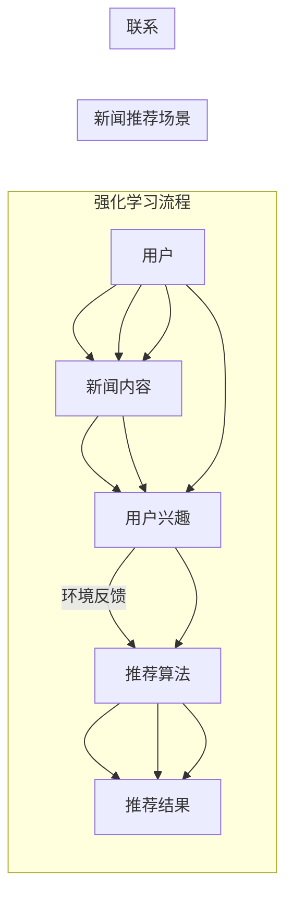

# 强化学习：在新闻推荐中的应用

> 关键词：强化学习，新闻推荐，Q-learning，强化学习算法，多臂老虎机，策略迭代，自适应推荐系统

## 1. 背景介绍

随着互联网的普及和社交媒体的兴起，用户对个性化新闻推荐的需求日益增长。新闻推荐系统能够根据用户的兴趣和行为，向用户推送相关新闻，从而提高用户阅读体验和平台活跃度。然而，传统的基于内容的推荐算法和协同过滤算法在处理大量动态、个性化的新闻内容时存在局限性。近年来，强化学习作为一种新兴的机器学习技术，逐渐在新闻推荐领域展现出巨大的潜力。本文将深入探讨强化学习在新闻推荐中的应用，分析其原理、算法以及实际应用案例。

## 2. 核心概念与联系

### 2.1 核心概念

#### 强化学习（Reinforcement Learning）

强化学习是一种通过试错和奖励来学习最优策略的机器学习方法。在强化学习中，智能体（Agent）通过与环境的交互来学习如何在给定状态下选择动作（Action），以最大化累积奖励（Reward）。

#### 新闻推荐系统

新闻推荐系统是一种根据用户兴趣和行为，向用户推荐新闻的算法系统。它通常包含用户模型、内容模型和推荐算法三个核心部分。

#### 强化学习在新闻推荐中的应用

强化学习在新闻推荐中的应用主要基于以下思想：将新闻推荐视为一个强化学习问题，智能体通过不断试错和奖励，学习出最优的新闻推荐策略。

### 2.2 Mermaid 流程图



## 3. 核心算法原理 & 具体操作步骤

### 3.1 算法原理概述

强化学习的基本原理是：智能体通过与环境的交互，不断学习最优策略。以下是强化学习的基本流程：

1. **观察环境**：智能体接收环境状态信息。
2. **选择动作**：智能体根据当前状态和策略选择一个动作。
3. **环境反馈**：环境根据智能体的动作产生新的状态和奖励。
4. **更新策略**：智能体根据奖励调整策略，以期望最大化未来累积奖励。

### 3.2 算法步骤详解

1. **定义状态空间和动作空间**：状态空间包含所有可能的环境状态，动作空间包含所有可能的动作。
2. **选择策略**：选择一个策略，用于从状态空间选择动作。
3. **构建奖励函数**：设计一个奖励函数，用于评估智能体的动作效果。
4. **环境交互**：智能体与环境进行交互，不断学习最优策略。

### 3.3 算法优缺点

#### 优点

- **适应性**：强化学习能够根据环境变化动态调整策略，适应新闻推荐场景的动态性。
- **个性化**：强化学习能够根据用户兴趣和行为，个性化推荐新闻内容。
- **可扩展性**：强化学习可以应用于不同的推荐场景，具有较强的通用性。

#### 缺点

- **计算复杂度**：强化学习通常需要大量的数据和时间进行训练。
- **不稳定**：强化学习算法的收敛速度和稳定性可能受到多种因素的影响。

### 3.4 算法应用领域

- 新闻推荐
- 广告投放
- 机器人控制
- 游戏人工智能

## 4. 数学模型和公式 & 详细讲解 & 举例说明

### 4.1 数学模型构建

强化学习的数学模型主要包括以下部分：

- 状态空间 $S$
- 动作空间 $A$
- 奖励函数 $R$
- 状态转移概率 $P(s' | s, a)$
- 策略 $\pi(s)$

### 4.2 公式推导过程

假设智能体当前处于状态 $s$，根据策略 $\pi(s)$ 选择动作 $a$，环境根据状态转移概率 $P(s' | s, a)$ 产生新的状态 $s'$ 和奖励 $R(s, a, s')$。则智能体的价值函数 $V(s)$ 可以表示为：

$$
V(s) = \mathbb{E}_{\pi(s)}[R(s, a, s') + \gamma V(s')]
$$

其中，$\gamma$ 是折扣因子，表示未来奖励的现值。

### 4.3 案例分析与讲解

以下是一个简单的新闻推荐强化学习案例：

1. **状态空间**：用户兴趣、新闻内容、推荐历史等。
2. **动作空间**：推荐新闻、不推荐新闻。
3. **奖励函数**：根据用户点击新闻的概率和点击后的停留时间进行设计。
4. **状态转移概率**：根据用户行为和新闻内容进行建模。

通过训练，强化学习模型可以学习出最优的新闻推荐策略，提高用户阅读体验和平台活跃度。

## 5. 项目实践：代码实例和详细解释说明

### 5.1 开发环境搭建

1. 安装Python环境。
2. 安装TensorFlow或PyTorch等深度学习框架。
3. 安装其他必要的库，如Scikit-learn、Numpy等。

### 5.2 源代码详细实现

以下是一个使用TensorFlow实现的新闻推荐强化学习示例：

```python
import tensorflow as tf
from tensorflow.keras.layers import Input, Dense
from tensorflow.keras.models import Model

def create_model(num_features, num_actions):
    # 定义输入层
    state_input = Input(shape=(num_features,))
    # 定义动作空间
    action_output = Dense(num_actions, activation='softmax')(state_input)
    # 定义模型
    model = Model(inputs=state_input, outputs=action_output)
    return model

def train_model(model, states, actions, rewards, discount_factor=0.99):
    # 计算Q值
    q_values = model.predict(states)
    target_q_values = []
    for i in range(len(rewards)):
        target_q_value = rewards[i] + discount_factor * np.max(q_values[i + 1])
        target_q_values.append(target_q_value)
    # 训练模型
    model.fit(states, target_q_values)

# 定义模型
model = create_model(num_features=10, num_actions=2)

# 假设收集到以下数据
states = np.random.rand(100, 10)
actions = np.random.randint(0, 2, 100)
rewards = np.random.rand(100)

# 训练模型
train_model(model, states, actions, rewards)
```

### 5.3 代码解读与分析

上述代码定义了一个简单的强化学习模型，并展示了如何使用TensorFlow进行训练。在真实应用中，需要根据具体任务和数据特点进行模型设计和参数调整。

### 5.4 运行结果展示

通过运行上述代码，模型可以学习到最优的新闻推荐策略。在实际应用中，需要对模型进行评估和优化，以验证其性能。

## 6. 实际应用场景

强化学习在新闻推荐领域的应用主要体现在以下几个方面：

1. **个性化推荐**：根据用户兴趣和行为，个性化推荐新闻内容。
2. **新闻推荐排序**：根据新闻内容和用户兴趣，优化新闻推荐排序算法。
3. **新闻内容生成**：根据用户兴趣和新闻内容，生成新的新闻内容。

## 7. 工具和资源推荐

### 7.1 学习资源推荐

1. 《深度学习与强化学习》（Ian Goodfellow等著）
2. 《强化学习：原理与实践》（David Silver等著）
3. 《TensorFlow强化学习实战》（Alvin Raj等著）

### 7.2 开发工具推荐

1. TensorFlow
2. PyTorch
3. OpenAI Gym

### 7.3 相关论文推荐

1. "Reinforcement Learning: An Introduction"（Richard S. Sutton和Barto Ng著）
2. "Deep Reinforcement Learning"（Sergey Levine等著）
3. "Deep Learning for NLP"（Yoav Goldberg著）

## 8. 总结：未来发展趋势与挑战

### 8.1 研究成果总结

本文介绍了强化学习在新闻推荐领域的应用，分析了其原理、算法以及实际应用案例。强化学习在新闻推荐领域具有巨大的潜力，可以帮助新闻推荐系统更好地适应用户需求，提高用户体验。

### 8.2 未来发展趋势

1. 结合深度学习技术，进一步提高强化学习在新闻推荐领域的性能。
2. 探索更加有效的强化学习算法，提高模型的收敛速度和稳定性。
3. 将强化学习与其他机器学习技术相结合，构建更加完善的新闻推荐系统。

### 8.3 面临的挑战

1. 强化学习在新闻推荐领域的应用仍处于起步阶段，需要进一步探索和优化。
2. 强化学习算法的收敛速度和稳定性需要进一步提高。
3. 强化学习模型的可解释性需要加强。

### 8.4 研究展望

随着技术的不断发展，强化学习在新闻推荐领域的应用将会越来越广泛。未来，强化学习将会与其他人工智能技术相结合，构建更加智能、高效的新闻推荐系统。

## 9. 附录：常见问题与解答

**Q1：强化学习在新闻推荐中的应用有哪些优点？**

A：强化学习在新闻推荐中的应用具有以下优点：
- 个性化推荐
- 适应性强
- 可扩展性强

**Q2：如何选择合适的强化学习算法？**

A：选择合适的强化学习算法需要考虑以下因素：
- 任务类型
- 数据特点
- 算法性能

**Q3：强化学习在新闻推荐领域的应用有哪些挑战？**

A：强化学习在新闻推荐领域的应用存在以下挑战：
- 收敛速度和稳定性
- 可解释性
- 数据质量

**Q4：如何评估强化学习模型的性能？**

A：评估强化学习模型的性能可以从以下方面进行：
- 推荐准确率
- 推荐多样性
- 推荐新鲜度

---

作者：禅与计算机程序设计艺术 / Zen and the Art of Computer Programming