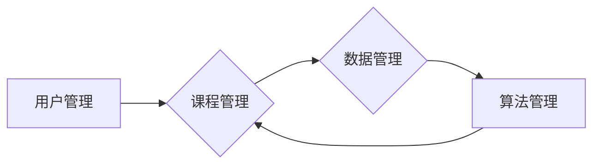

# 智能学习系统管理功能的设计与实现

> 关键词：智能学习系统，系统管理，用户管理，课程管理，数据管理，算法，技术栈

## 1. 背景介绍

随着信息化时代的到来，智能学习系统在教育培训、远程教育、企业培训等领域得到了广泛应用。一个功能完善、易于管理的智能学习系统，能够有效提高学习效率，降低管理成本，满足用户多样化的学习需求。本文将深入探讨智能学习系统管理功能的设计与实现，旨在为相关领域的技术人员和开发者提供有益的参考。

### 1.1 问题的由来

传统的学习管理系统往往功能单一，缺乏智能化和个性化服务。随着人工智能技术的快速发展，如何设计一个集用户管理、课程管理、数据管理等功能于一体的智能学习系统，成为当前研究和开发的热点问题。

### 1.2 研究现状

目前，智能学习系统的管理功能主要包括以下几个方面：

- 用户管理：实现用户注册、登录、信息修改、权限管理等。
- 课程管理：支持课程创建、编辑、发布、分类、搜索等功能。
- 数据管理：对学习数据、用户行为数据等进行采集、存储、分析和挖掘。
- 算法管理：引入智能推荐、智能评测、智能学习路径规划等算法，提升学习体验。

### 1.3 研究意义

研究智能学习系统管理功能的设计与实现，具有以下重要意义：

- 提升学习效率：通过智能推荐和个性化学习路径规划，让用户快速找到适合自己的学习内容，提高学习效率。
- 降低管理成本：通过自动化管理功能，减少人力投入，降低管理成本。
- 优化学习体验：通过智能评测和即时反馈，帮助用户及时了解学习进度和效果。
- 促进教育公平：让优质教育资源惠及更多用户，促进教育公平。

### 1.4 本文结构

本文将按照以下结构进行论述：

- 第2章介绍智能学习系统管理功能的核心概念及其相互关系。
- 第3章阐述智能学习系统管理功能的设计原则和具体操作步骤。
- 第4章详细介绍智能学习系统管理功能的实现技术，包括技术栈、数据库设计和算法选择等。
- 第5章给出智能学习系统管理功能的代码实例和详细解释说明。
- 第6章分析智能学习系统管理功能在实际应用场景中的应用效果。
- 第7章展望智能学习系统管理功能的未来发展趋势和面临的挑战。
- 第8章总结全文，并提出研究展望。

## 2. 核心概念与联系

为了更好地理解智能学习系统管理功能的设计与实现，以下给出几个核心概念及其相互关系：

### 2.1 用户管理

用户管理是智能学习系统的核心功能之一，主要包括以下内容：

- 用户注册：用户填写个人信息，系统自动生成用户账号。
- 用户登录：用户输入账号和密码，系统验证身份，允许访问系统。
- 用户信息修改：用户可以修改个人信息，如昵称、密码、邮箱等。
- 用户权限管理：根据用户角色分配不同权限，如普通用户、管理员等。

### 2.2 课程管理

课程管理主要包括以下内容：

- 课程创建：管理员可以创建新的课程，包括课程名称、简介、分类、时长等信息。
- 课程编辑：管理员可以修改已创建的课程信息。
- 课程发布：管理员可以将课程发布到系统中，供用户学习。
- 课程分类：将课程按照学科、级别、风格等进行分类，方便用户查找。
- 课程搜索：用户可以通过关键词、分类等方式搜索课程。

### 2.3 数据管理

数据管理主要包括以下内容：

- 学习数据：记录用户的学习进度、成绩、互动等数据。
- 用户行为数据：记录用户的学习行为，如浏览课程、观看视频、答题等。
- 数据分析：对学习数据和用户行为数据进行统计分析，为系统优化和个性化推荐提供依据。

### 2.4 算法管理

算法管理主要包括以下内容：

- 智能推荐：根据用户的学习进度、兴趣和需求，推荐适合的课程。
- 智能评测：对用户的学习成果进行评测，并提供即时反馈。
- 智能学习路径规划：根据用户的学习进度和需求，规划个性化的学习路径。

以下是基于Mermaid流程图表示的核心概念关系：



从流程图中可以看出，用户管理、课程管理、数据管理和算法管理相互关联，共同构成了智能学习系统的核心功能。

## 3. 核心算法原理 & 具体操作步骤

### 3.1 算法原理概述

智能学习系统管理功能的设计与实现，涉及到多个领域的算法原理，主要包括：

- 用户管理：用户注册、登录、信息修改、权限管理等，主要涉及密码学、密码学哈希函数等知识。
- 课程管理：课程创建、编辑、发布、分类、搜索等，主要涉及数据库设计、搜索引擎等知识。
- 数据管理：学习数据、用户行为数据等，主要涉及数据采集、存储、分析、挖掘等知识。
- 算法管理：智能推荐、智能评测、智能学习路径规划等，主要涉及机器学习、深度学习等知识。

### 3.2 算法步骤详解

以下是智能学习系统管理功能的一些关键步骤：

#### 3.2.1 用户管理

1. 用户注册：用户填写个人信息，系统自动生成用户账号和密码。
2. 用户登录：用户输入账号和密码，系统验证身份，允许访问系统。
3. 用户信息修改：用户可以修改个人信息，如昵称、密码、邮箱等。
4. 用户权限管理：根据用户角色分配不同权限，如普通用户、管理员等。

#### 3.2.2 课程管理

1. 课程创建：管理员可以创建新的课程，包括课程名称、简介、分类、时长等信息。
2. 课程编辑：管理员可以修改已创建的课程信息。
3. 课程发布：管理员可以将课程发布到系统中，供用户学习。
4. 课程分类：将课程按照学科、级别、风格等进行分类，方便用户查找。
5. 课程搜索：用户可以通过关键词、分类等方式搜索课程。

#### 3.2.3 数据管理

1. 学习数据：记录用户的学习进度、成绩、互动等数据。
2. 用户行为数据：记录用户的学习行为，如浏览课程、观看视频、答题等。
3. 数据分析：对学习数据和用户行为数据进行统计分析，为系统优化和个性化推荐提供依据。

#### 3.2.4 算法管理

1. 智能推荐：根据用户的学习进度、兴趣和需求，推荐适合的课程。
2. 智能评测：对用户的学习成果进行评测，并提供即时反馈。
3. 智能学习路径规划：根据用户的学习进度和需求，规划个性化的学习路径。

### 3.3 算法优缺点

以下是智能学习系统管理功能中一些关键算法的优缺点分析：

#### 3.3.1 用户管理算法

- **优点**：
  - 注册、登录等操作简单快捷。
  - 用户信息管理功能完善，可进行实时更新。
- **缺点**：
  - 需要考虑用户隐私保护问题。
  - 需要防止恶意注册和攻击。

#### 3.3.2 课程管理算法

- **优点**：
  - 课程分类清晰，便于用户查找。
  - 课程发布、编辑等功能完善。
- **缺点**：
  - 课程管理较为复杂，需要一定的技术能力。
  - 需要定期维护课程数据。

#### 3.3.3 数据管理算法

- **优点**：
  - 数据采集、存储、分析等功能完善。
  - 可为系统优化和个性化推荐提供数据支持。
- **缺点**：
  - 数据安全性和隐私保护问题需要重视。
  - 数据分析和挖掘需要一定的专业技能。

#### 3.3.4 算法管理算法

- **优点**：
  - 智能推荐、智能评测等功能可提升用户体验。
  - 个性化学习路径规划可提高学习效率。
- **缺点**：
  - 算法开发和优化需要较高的技术水平。
  - 算法效果受数据质量和算法模型的影响。

### 3.4 算法应用领域

智能学习系统管理功能中的算法应用领域主要包括：

- 教育培训：根据用户需求，推荐合适的课程，提高学习效率。
- 远程教育：通过智能评测和即时反馈，提高教学质量。
- 企业培训：为企业员工提供个性化学习路径，提升员工技能。

## 4. 数学模型和公式 & 详细讲解 & 举例说明

### 4.1 数学模型构建

智能学习系统管理功能中涉及的数学模型主要包括：

- 用户画像模型：根据用户的学习数据、兴趣和需求，构建用户画像。
- 课程推荐模型：根据用户画像，推荐合适的课程。
- 智能评测模型：根据用户的学习数据，对用户的学习成果进行评测。

### 4.2 公式推导过程

以下以用户画像模型为例，简要介绍公式推导过程：

#### 4.2.1 用户画像模型

用户画像模型旨在根据用户的学习数据、兴趣和需求，构建用户画像。假设用户画像由 $n$ 个特征组成，分别为 $f_1, f_2, \ldots, f_n$，则用户画像可以表示为：

$$
\text{User Profile} = \{f_1, f_2, \ldots, f_n\}
$$

其中，每个特征 $f_i$ 可以表示为：

$$
f_i = \frac{v_i}{\sqrt{\sum_{j=1}^n v_j^2}}
$$

其中，$v_i$ 为特征 $f_i$ 的值。

#### 4.2.2 课程推荐模型

课程推荐模型旨在根据用户画像，推荐合适的课程。假设课程集合为 $C = \{c_1, c_2, \ldots, c_m\}$，则课程推荐模型可以表示为：

$$
\text{Recommendation} = \{c_{r_1}, c_{r_2}, \ldots, c_{r_k}\}
$$

其中，$c_{r_i}$ 为推荐课程，$k$ 为推荐课程数量。

#### 4.2.3 智能评测模型

智能评测模型旨在根据用户的学习数据，对用户的学习成果进行评测。假设评测结果由 $n$ 个指标组成，分别为 $g_1, g_2, \ldots, g_n$，则评测结果可以表示为：

$$
\text{Evaluation} = \{g_1, g_2, \ldots, g_n\}
$$

其中，每个指标 $g_i$ 可以表示为：

$$
g_i = f_i \cdot w_i
$$

其中，$w_i$ 为指标 $g_i$ 的权重。

### 4.3 案例分析与讲解

以下以用户画像模型为例，进行案例分析与讲解。

假设某用户在学习过程中，共学习了5门课程，分别为 $c_1, c_2, c_3, c_4, c_5$。根据学习数据，可得到以下特征值：

$$
\begin{align*}
f_1 &= 0.9 \\
f_2 &= 0.8 \\
f_3 &= 0.7 \\
f_4 &= 0.6 \\
f_5 &= 0.5 \\
\end{align*}
$$

根据公式，可得到用户画像：

$$
\text{User Profile} = \left\{ \frac{0.9}{\sqrt{0.9^2+0.8^2+0.7^2+0.6^2+0.5^2}}, \frac{0.8}{\sqrt{0.9^2+0.8^2+0.7^2+0.6^2+0.5^2}}, \frac{0.7}{\sqrt{0.9^2+0.8^2+0.7^2+0.6^2+0.5^2}}, \frac{0.6}{\sqrt{0.9^2+0.8^2+0.7^2+0.6^2+0.5^2}}, \frac{0.5}{\sqrt{0.9^2+0.8^2+0.7^2+0.6^2+0.5^2}} \right\}
$$

同理，可得到其他课程的特征值，并根据公式进行课程推荐。

## 5. 项目实践：代码实例和详细解释说明

### 5.1 开发环境搭建

以下是使用Python进行智能学习系统管理功能开发的开发环境搭建步骤：

1. 安装Python：从官网下载并安装Python，版本推荐3.7或以上。
2. 安装PyCharm：下载并安装PyCharm，作为Python开发环境。
3. 安装相关库：使用pip命令安装以下库：
   ```bash
   pip install flask flask_sqlalchemy flask_migrate pandas numpy scikit-learn
   ```
4. 创建项目目录：在PyCharm中创建项目目录，并配置数据库连接。

### 5.2 源代码详细实现

以下以用户管理功能为例，给出代码实例和详细解释说明。

#### 5.2.1 用户表结构

```python
from flask_sqlalchemy import SQLAlchemy

db = SQLAlchemy()

class User(db.Model):
    id = db.Column(db.Integer, primary_key=True)
    username = db.Column(db.String(50), unique=True, nullable=False)
    password = db.Column(db.String(100), nullable=False)
    email = db.Column(db.String(50), unique=True, nullable=False)
    role = db.Column(db.String(20), nullable=False)
```

#### 5.2.2 用户注册

```python
from flask import request, jsonify
from werkzeug.security import generate_password_hash, check_password_hash

@app.route('/register', methods=['POST'])
def register():
    data = request.json
    username = data.get('username')
    password = data.get('password')
    email = data.get('email')
    role = data.get('role')
    
    if not username or not password or not email or not role:
        return jsonify({'error': 'Missing parameters'}), 400
    
    hashed_password = generate_password_hash(password)
    new_user = User(username=username, password=hashed_password, email=email, role=role)
    db.session.add(new_user)
    db.session.commit()
    
    return jsonify({'message': 'User registered successfully'}), 201
```

#### 5.2.3 用户登录

```python
from flask import request, jsonify
from werkzeug.security import generate_password_hash, check_password_hash

@app.route('/login', methods=['POST'])
def login():
    data = request.json
    username = data.get('username')
    password = data.get('password')
    
    if not username or not password:
        return jsonify({'error': 'Missing parameters'}), 400
    
    user = User.query.filter_by(username=username).first()
    if not user:
        return jsonify({'error': 'User not found'}), 404
    
    if check_password_hash(user.password, password):
        return jsonify({'message': 'Login successful'}), 200
    else:
        return jsonify({'error': 'Incorrect password'}), 401
```

### 5.3 代码解读与分析

以上代码展示了用户管理功能的基本实现。首先定义了用户表结构，包含用户名、密码、邮箱和角色等信息。然后实现了用户注册和登录接口，用于处理用户注册和登录请求。

#### 用户注册

- 接收用户名、密码、邮箱和角色等信息。
- 对密码进行加密处理，并存储到数据库中。
- 将新用户添加到数据库中。

#### 用户登录

- 接收用户名和密码。
- 查询数据库中是否存在该用户。
- 验证密码是否正确。

### 5.4 运行结果展示

以下是运行用户管理功能的示例：

```bash
$ curl -X POST -H "Content-Type: application/json" -d '{"username": "user1", "password": "password123", "email": "user1@example.com", "role": "user"}' http://127.0.0.1:5000/register
{
  "message": "User registered successfully"
}

$ curl -X POST -H "Content-Type: application/json" -d '{"username": "user1", "password": "password123"}' http://127.0.0.1:5000/login
{
  "message": "Login successful"
}
```

## 6. 实际应用场景

智能学习系统管理功能在实际应用场景中具有广泛的应用价值，以下列举几个典型场景：

- **教育培训机构**：通过用户管理功能，实现学员的注册、登录、信息管理等功能；通过课程管理功能，实现课程的创建、编辑、发布、分类、搜索等功能；通过数据管理功能，对学员的学习数据进行分析，为教学改进提供依据；通过算法管理功能，为学员提供个性化的学习推荐。

- **远程教育平台**：通过用户管理功能，实现学员的注册、登录、信息管理等功能；通过课程管理功能，实现课程的创建、编辑、发布、分类、搜索等功能；通过数据管理功能，对学员的学习数据进行分析，为教学效果评估提供依据；通过算法管理功能，为学员提供个性化的学习推荐。

- **企业培训**：通过用户管理功能，实现员工注册、登录、信息管理等功能；通过课程管理功能，实现培训课程的创建、编辑、发布、分类、搜索等功能；通过数据管理功能，对员工的学习数据进行分析，为企业培训效果评估提供依据；通过算法管理功能，为员工提供个性化的学习路径规划。

## 7. 工具和资源推荐

### 7.1 学习资源推荐

- 《Flask Web开发：基于Python的Web应用开发实战》
- 《Python Web开发实战：基于Django框架》
- 《机器学习实战》
- 《深度学习》

### 7.2 开发工具推荐

- Python 3.7或以上
- PyCharm
- Flask
- SQLAlchemy
- Pandas
- NumPy
- Scikit-learn

### 7.3 相关论文推荐

- 《推荐系统：原理与实践》
- 《个性化推荐算法》
- 《深度学习在推荐系统中的应用》

## 8. 总结：未来发展趋势与挑战

### 8.1 研究成果总结

本文深入探讨了智能学习系统管理功能的设计与实现，包括核心概念、算法原理、技术实现等方面。通过对用户管理、课程管理、数据管理和算法管理等方面的分析，本文为智能学习系统的设计与开发提供了有益的参考。

### 8.2 未来发展趋势

随着人工智能技术的不断发展，智能学习系统管理功能将呈现以下发展趋势：

- 智能化程度更高：通过引入更多的智能算法，实现更加个性化的学习体验。
- 用户体验更佳：通过优化界面设计、提高系统响应速度，提升用户体验。
- 数据分析更深入：通过深入分析学习数据，为教学改进和个性化推荐提供更精准的依据。
- 跨平台融合：实现PC端、移动端、智能设备等多平台融合，满足用户多样化的学习需求。

### 8.3 面临的挑战

智能学习系统管理功能在实际应用过程中，也面临着以下挑战：

- 技术挑战：如何将人工智能技术与学习系统深度融合，实现更加智能化、个性化的服务。
- 数据安全：如何保护用户隐私和数据安全，避免数据泄露。
- 算法公平性：如何确保算法的公平性，避免算法偏见和歧视。
- 系统可扩展性：如何设计可扩展的系统架构，以应对日益增长的用户和数据规模。

### 8.4 研究展望

未来，智能学习系统管理功能的研究将重点围绕以下方面展开：

- 深度学习在智能学习系统中的应用：进一步探索深度学习在用户画像、智能推荐、智能评测等方面的应用。
- 跨模态学习：将文本、图像、视频等多模态信息融合到智能学习系统中，为用户提供更加丰富的学习体验。
- 个性化学习路径规划：根据用户的学习习惯、兴趣和需求，为用户提供更加个性化的学习路径规划。
- 智能学习系统伦理与法规研究：研究智能学习系统的伦理道德和法律法规问题，确保智能学习系统的健康发展。

智能学习系统管理功能的设计与实现是一个长期而艰巨的任务，需要众多领域专家的共同努力。相信随着技术的不断进步和应用的不断拓展，智能学习系统将为人类教育、学习和发展带来更多的机遇和挑战。

## 9. 附录：常见问题与解答

**Q1：智能学习系统管理功能的安全性如何保证？**

A：智能学习系统管理功能的安全性主要体现在以下几个方面：

- 数据安全：对用户数据、课程数据等进行加密存储，防止数据泄露。
- 用户权限管理：根据用户角色分配不同权限，限制用户对敏感数据的访问。
- 服务器安全：定期进行安全检查和漏洞修复，防止服务器被攻击。

**Q2：智能学习系统管理功能如何实现个性化推荐？**

A：智能学习系统管理功能通常采用以下方法实现个性化推荐：

- 用户画像：根据用户的学习数据、兴趣和需求，构建用户画像。
- 模式识别：分析用户的学习行为，识别用户的学习模式和兴趣点。
- 推荐算法：根据用户画像和模式识别结果，推荐合适的课程。

**Q3：智能学习系统管理功能如何实现智能评测？**

A：智能学习系统管理功能通常采用以下方法实现智能评测：

- 试题库：构建试题库，包含各种类型的试题。
- 试题自动生成：根据试题库和用户的学习进度，自动生成试题。
- 评测算法：根据用户的答题情况，自动评分并提供即时反馈。

**Q4：智能学习系统管理功能如何实现学习路径规划？**

A：智能学习系统管理功能通常采用以下方法实现学习路径规划：

- 个性化推荐：根据用户的学习进度、兴趣和需求，推荐合适的课程。
- 评估结果分析：分析用户的评测结果，了解用户的学习难点和薄弱环节。
- 路径规划算法：根据用户的学习进度、评估结果和推荐结果，规划个性化的学习路径。

**Q5：智能学习系统管理功能如何实现跨平台融合？**

A：智能学习系统管理功能通常采用以下方法实现跨平台融合：

- 响应式设计：采用响应式设计技术，使系统在不同设备上具有良好的用户体验。
- 前后端分离：采用前后端分离架构，实现不同平台之间的数据共享和交互。
- 移动应用开发：开发移动应用程序，为用户提供便捷的学习体验。

智能学习系统管理功能的设计与实现是一个充满挑战和机遇的领域，需要不断探索和创新。希望通过本文的介绍，能够为相关领域的技术人员和开发者提供有益的参考和启示。

---

作者：禅与计算机程序设计艺术 / Zen and the Art of Computer Programming