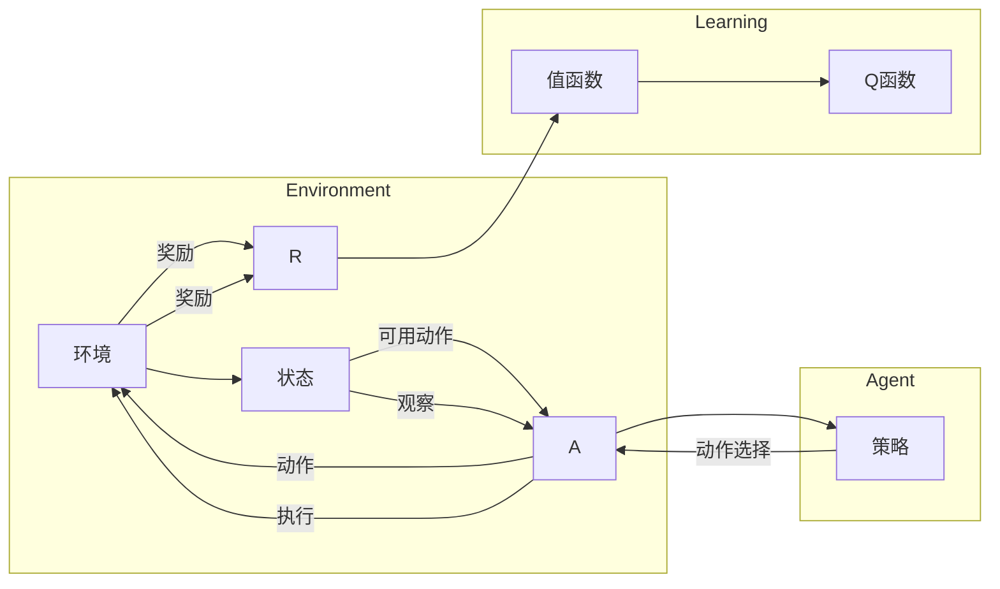

# 深度 Q-learning：环境模型的建立与利用

> 关键词：深度Q-learning，强化学习，环境建模，神经网络，策略优化，探索-利用权衡

## 1. 背景介绍

强化学习（Reinforcement Learning，RL）作为一种重要的机器学习范式，在游戏、机器人控制、推荐系统等领域取得了显著成果。Q-learning是强化学习中的一种经典算法，它通过学习值函数来指导智能体在环境中进行决策。然而，传统的Q-learning在处理高维、复杂环境时，往往需要大量的样本数据来学习准确的值函数。为了解决这一问题，深度Q-learning（DQN）应运而生，它将神经网络与Q-learning相结合，通过深度神经网络来近似值函数，从而提高了算法的样本效率和泛化能力。

本文将深入探讨深度Q-learning算法，重点关注环境模型的建立与利用，旨在帮助读者全面理解并掌握深度Q-learning的原理和应用。

## 2. 核心概念与联系

### 2.1 强化学习

强化学习是一种使智能体通过与环境的交互来学习最优策略的机器学习方法。在强化学习中，智能体通过观察环境状态、选择动作、获取奖励，并更新其策略，以最大化长期累积奖励。

**核心概念**：

- **智能体（Agent）**：执行动作并从环境中获取奖励的实体。
- **环境（Environment）**：智能体所在的动态环境，可以提供当前状态、可用动作和奖励信息。
- **策略（Policy）**：智能体根据当前状态选择动作的函数。
- **值函数（Value Function）**：表示从当前状态开始，按照给定策略采取动作所能获得的期望累积奖励。
- **Q函数（Q-Function）**：表示智能体在给定状态下采取某个动作的预期回报。
- **奖励（Reward）**：智能体在环境中采取动作后获得的即时奖励。

**Mermaid 流程图**：



### 2.2 深度Q-learning

深度Q-learning（DQN）是一种结合了深度学习和Q-learning的强化学习算法。它使用深度神经网络来近似Q函数，从而在处理高维状态空间时具有更高的样本效率和泛化能力。

**核心概念**：

- **深度神经网络（DNN）**：用于近似Q函数的神经网络结构。
- **经验回放（Experience Replay）**：将智能体与环境交互的经验存储在回放缓冲区中，并按照一定的概率随机采样，以改善样本的分布，提高学习效率。
- **目标网络（Target Network）**：用于生成目标Q值的目标网络，有助于稳定学习过程。

## 3. 核心算法原理 & 具体操作步骤

### 3.1 算法原理概述

DQN通过以下步骤实现强化学习：

1. 初始化参数和经验回放缓冲区。
2. 智能体在环境中随机选择初始状态 $S_0$。
3. 根据策略 $π$，在当前状态 $S_0$ 采取动作 $A_0$。
4. 智能体执行动作 $A_0$ 并得到奖励 $R_0$ 和下一个状态 $S_1$。
5. 使用目标网络 $Q^*$ 计算目标Q值 $Q^*(S_1, A_1)$。
6. 使用经验回放缓冲区存储经验 $(S_0, A_0, R_0, S_1)$。
7. 使用梯度下降优化Q网络参数，最小化损失函数 $L(\theta)$。
8. 重复步骤2-7，直到满足终止条件。

### 3.2 算法步骤详解

1. **初始化**：随机初始化Q网络参数 $\theta$，并设置经验回放缓冲区的大小 $D$。
2. **选择动作**：在当前状态 $S_t$，根据策略 $π$ 选择动作 $A_t$，通常使用ε-greedy策略。
3. **执行动作**：智能体执行动作 $A_t$，并得到奖励 $R_t$ 和下一个状态 $S_{t+1}$。
4. **更新经验回放缓冲区**：将经验 $(S_t, A_t, R_t, S_{t+1})$ 存储到经验回放缓冲区 $D$ 中。
5. **目标网络更新**：每隔一定步数，将Q网络参数复制到目标网络参数中。
6. **计算目标Q值**：使用目标网络 $Q^*$ 计算 $Q^*(S_{t+1}, A_{t+1})$，其中 $A_{t+1}$ 是根据策略 $π$ 在状态 $S_{t+1}$ 选择的动作。
7. **梯度下降**：使用梯度下降优化Q网络参数 $\theta$，最小化损失函数 $L(\theta) = \sum_{t} (Q(S_t, A_t, \theta) - R_t - \gamma Q^*(S_{t+1}, A_{t+1}))^2$，其中 $\gamma$ 是折扣因子。
8. **重复步骤2-7**，直到达到训练终止条件。

### 3.3 算法优缺点

**优点**：

- 能够处理高维状态空间和动作空间。
- 无需先验知识，可以自动从数据中学习。
- 能够学习到全局最优策略。

**缺点**：

- 学习过程可能需要大量样本数据。
- 策略收敛速度较慢。
- 目标网络更新可能导致梯度消失问题。

### 3.4 算法应用领域

DQN及其变体在多个领域取得了显著成果，包括：

- 游戏AI：如Atari 2600游戏、围棋等。
- 机器人控制：如无人机控制、自动驾驶等。
- 电子商务：如推荐系统、广告投放等。

## 4. 数学模型和公式 & 详细讲解 & 举例说明

### 4.1 数学模型构建

DQN的数学模型包括：

- Q网络 $Q(S, A; \theta)$：表示在状态 $S$ 采取动作 $A$ 的预期回报。
- 目标网络 $Q^*(S, A; \theta')$：表示在状态 $S$ 采取动作 $A$ 的目标回报。
- 损失函数 $L(\theta)$：用于衡量Q网络预测值与真实值之间的差异。

### 4.2 公式推导过程

目标网络的目标是生成目标Q值 $Q^*(S_{t+1}, A_{t+1})$，其中 $A_{t+1}$ 是根据策略 $π$ 在状态 $S_{t+1}$ 选择的动作。目标函数 $L(\theta)$ 可以表示为：

$$
L(\theta) = \sum_{t} (Q(S_t, A_t; \theta) - R_t - \gamma Q^*(S_{t+1}, A_{t+1}))^2
$$

其中，$\gamma$ 是折扣因子，表示对未来奖励的重视程度。

### 4.3 案例分析与讲解

以下是一个简单的DQN案例，假设智能体在一个离散状态空间中，需要学习在给定状态 $S$ 下采取哪个动作 $A$ 可以获得最大回报。

- **状态空间**：$S = \{0, 1, 2, 3\}$
- **动作空间**：$A = \{up, down\}$
- **回报函数**：$R(S, A)$ 表示在状态 $S$ 采取动作 $A$ 所获得的回报。

假设智能体在状态 $S = 0$ 时，采取动作 $A = up$，得到回报 $R(0, up) = 1$。同时，智能体在状态 $S = 0$ 时，采取动作 $A = down$，得到回报 $R(0, down) = -1$。根据Q学习算法，我们可以计算状态 $S = 0$ 下的Q值：

$$
Q(0, up; \theta) = \frac{1}{2}(R(0, up; \theta) + \gamma Q(1, up; \theta) + \gamma Q(1, down; \theta))
$$

其中，$\gamma$ 是折扣因子，通常取0.9或0.99。

## 5. 项目实践：代码实例和详细解释说明

### 5.1 开发环境搭建

以下是使用Python和PyTorch实现DQN的步骤：

1. 安装PyTorch：
```bash
pip install torch
```

2. 创建一个新的Python项目，并添加必要的依赖：

```python
import torch
import random
import numpy as np
import matplotlib.pyplot as plt
```

### 5.2 源代码详细实现

以下是一个简单的DQN实现示例：

```python
import torch
import torch.nn as nn
import torch.optim as optim
from collections import deque

class DQN:
    def __init__(self, state_size, action_size, hidden_size=64):
        self.state_size = state_size
        self.action_size = action_size
        self.hidden_size = hidden_size
        self.q_network = nn.Sequential(
            nn.Linear(state_size, hidden_size),
            nn.ReLU(),
            nn.Linear(hidden_size, hidden_size),
            nn.ReLU(),
            nn.Linear(hidden_size, action_size),
        )
        self.target_network = nn.Sequential(
            nn.Linear(state_size, hidden_size),
            nn.ReLU(),
            nn.Linear(hidden_size, hidden_size),
            nn.ReLU(),
            nn.Linear(hidden_size, action_size),
        )
        self.optimizer = optim.Adam(self.q_network.parameters(), lr=0.001)
        self.memory = deque(maxlen=2000)
        self.gamma = 0.9
        self.epsilon = 1.0

    def remember(self, state, action, reward, next_state, done):
        self.memory.append((state, action, reward, next_state, done))

    def act(self, state):
        if random.uniform(0, 1) < self.epsilon:
            return random.randrange(self.action_size)
        with torch.no_grad():
            action_values = self.q_network(state)
            return action_values.argmax().item()

    def replay(self, batch_size):
        states, actions, rewards, next_states, dones = zip(*random.sample(self.memory, batch_size))
        state_values = self.q_network(torch.stack(states))
        action_values = torch.stack([state_values[i, actions[i]] for i in range(batch_size)])
        next_state_values = self.target_network(torch.stack(next_states))
        target_values = rewards + self.gamma * next_state_values.max(-1)[0] * (1 - dones)
        self.optimizer.zero_grad()
        loss = nn.functional.mse_loss(action_values, target_values)
        loss.backward()
        self.optimizer.step()

    def update_target_network(self):
        self.target_network.load_state_dict(self.q_network.state_dict())
```

### 5.3 代码解读与分析

- **DQN类**：定义了DQN模型的结构和训练过程。
- **__init__方法**：初始化Q网络、目标网络、优化器、经验回放缓冲区和相关参数。
- **remember方法**：将经验 $(state, action, reward, next_state, done)$ 存储到经验回放缓冲区。
- **act方法**：根据ε-greedy策略选择动作。
- **replay方法**：从经验回放缓冲区中随机采样一批经验，并使用这些经验更新Q网络参数。
- **update_target_network方法**：将Q网络参数复制到目标网络参数中。

### 5.4 运行结果展示

以下是一个简单的环境测试示例：

```python
import gym
import numpy as np

env = gym.make("CartPole-v0")

dqn = DQN(state_size=4, action_size=2)
scores = []

for episode in range(1000):
    state = env.reset()
    state = np.reshape(state, [1, 4])
    for step in range(500):
        action = dqn.act(state)
        state, reward, done, _ = env.step(action)
        state = np.reshape(state, [1, 4])
        dqn.remember(state, action, reward, state, done)
        if done:
            break
    scores.append(step + 1)
    dqn.update_target_network()

plt.plot(scores)
plt.show()
```

## 6. 实际应用场景

### 6.1 游戏

DQN及其变体在游戏AI领域取得了显著成果，例如：

- **Atari 2600游戏**：DQN在Atari 2600游戏上取得了接近人类水平的性能。
- **围棋**：DeepMind的AlphaGo使用深度神经网络和蒙特卡洛树搜索结合的算法，战胜了世界围棋冠军。

### 6.2 机器人控制

DQN及其变体在机器人控制领域也有广泛应用，例如：

- **无人机控制**：DQN可以用于无人机的自主飞行和避障。
- **自动驾驶**：DQN可以用于自动驾驶车辆的路径规划和决策。

### 6.3 电子商务

DQN及其变体在电子商务领域也有应用，例如：

- **推荐系统**：DQN可以用于个性化推荐系统的设计，根据用户行为和历史数据推荐商品。
- **广告投放**：DQN可以用于广告投放优化，根据用户行为和广告效果进行动态调整。

## 7. 工具和资源推荐

### 7.1 学习资源推荐

- **《Reinforcement Learning: An Introduction》**：Reinforcement Learning领域的经典教材，详细介绍了强化学习的基本原理和应用。
- **《Deep Reinforcement Learning》**：介绍了深度强化学习的最新进展，包括DQN、PPO等算法。
- **OpenAI Gym**：一个开源的环境库，提供了各种强化学习环境的实现。

### 7.2 开发工具推荐

- **PyTorch**：一个开源的深度学习框架，适合进行强化学习研究。
- **TensorFlow**：另一个开源的深度学习框架，也适合进行强化学习研究。
- **Gym**：一个开源的环境库，提供了各种强化学习环境的实现。

### 7.3 相关论文推荐

- **Deep Q-Networks**：DQN算法的原论文，详细介绍了DQN算法的原理和实现。
- **Asynchronous Advantage Actor-Critic**：介绍了A3C算法，是一种并行训练的强化学习算法。
- **Proximal Policy Optimization**：介绍了PPO算法，是一种高效的强化学习算法。

## 8. 总结：未来发展趋势与挑战

### 8.1 研究成果总结

DQN及其变体在强化学习领域取得了显著成果，为解决高维、复杂环境提供了新的思路。DQN通过深度神经网络近似Q函数，提高了算法的样本效率和泛化能力。

### 8.2 未来发展趋势

- **多智能体强化学习**：研究多智能体协同学习策略，提高智能体的集体智能。
- **元强化学习**：研究自动学习强化学习算法的算法，提高算法的通用性和效率。
- **可解释的强化学习**：研究可解释的强化学习算法，提高算法的可信度和可接受度。

### 8.3 面临的挑战

- **样本效率**：如何提高样本效率，降低算法对样本数据的需求。
- **收敛速度**：如何提高算法的收敛速度，缩短训练时间。
- **可解释性**：如何提高算法的可解释性，提高算法的可信度和可接受度。

### 8.4 研究展望

未来，深度Q-learning及其变体将在更多领域得到应用，为智能系统的发展做出更大的贡献。同时，随着研究的深入，我们将不断克服现有挑战，推动强化学习技术的进步。

## 9. 附录：常见问题与解答

**Q1：DQN与Q-learning有什么区别？**

A1：DQN与Q-learning的区别在于DQN使用深度神经网络来近似Q函数，而Q-learning使用表格存储Q值。DQN在处理高维状态空间和动作空间时具有更高的样本效率和泛化能力。

**Q2：DQN如何解决梯度消失问题？**

A2：DQN使用经验回放缓冲区存储经验，并按照一定的概率随机采样，以改善样本的分布，提高学习效率。此外，可以使用梯度裁剪等技术来缓解梯度消失问题。

**Q3：如何提高DQN的样本效率？**

A3：提高DQN的样本效率可以通过以下方法实现：

- 使用经验回放缓冲区存储经验。
- 使用并行计算技术加速训练过程。
- 使用数据增强技术扩充训练数据。

**Q4：DQN在实际应用中需要注意哪些问题？**

A4：在实际应用中，需要注意以下问题：

- 数据收集和预处理。
- 选择合适的网络结构和超参数。
- 避免过拟合和梯度消失问题。
- 评估和测试模型性能。

作者：禅与计算机程序设计艺术 / Zen and the Art of Computer Programming