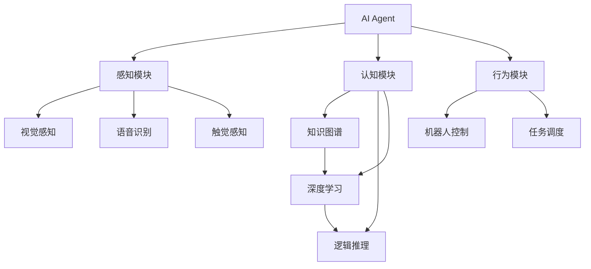
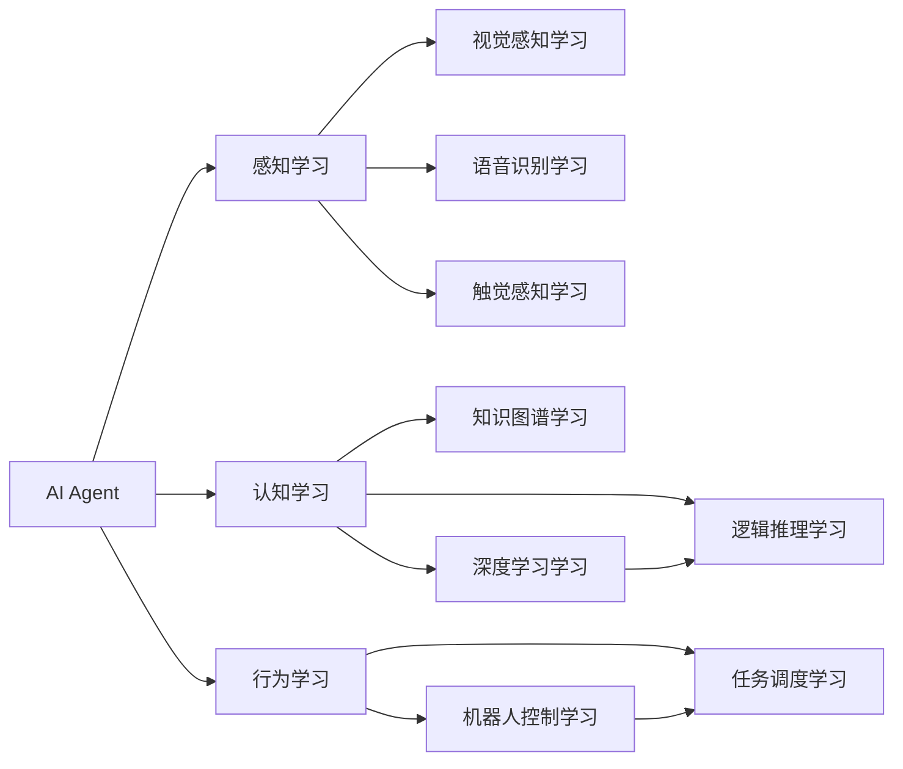
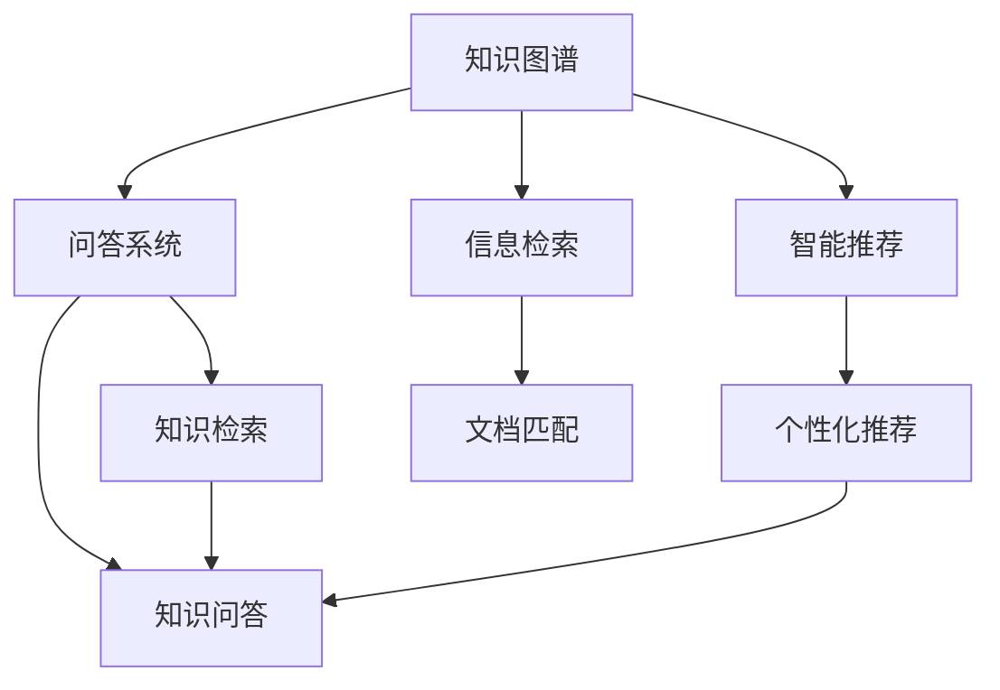
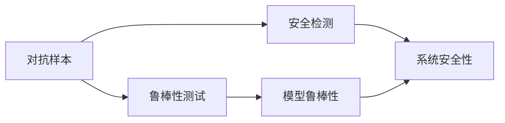
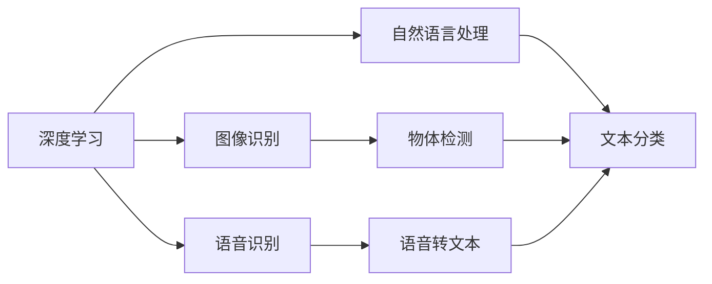
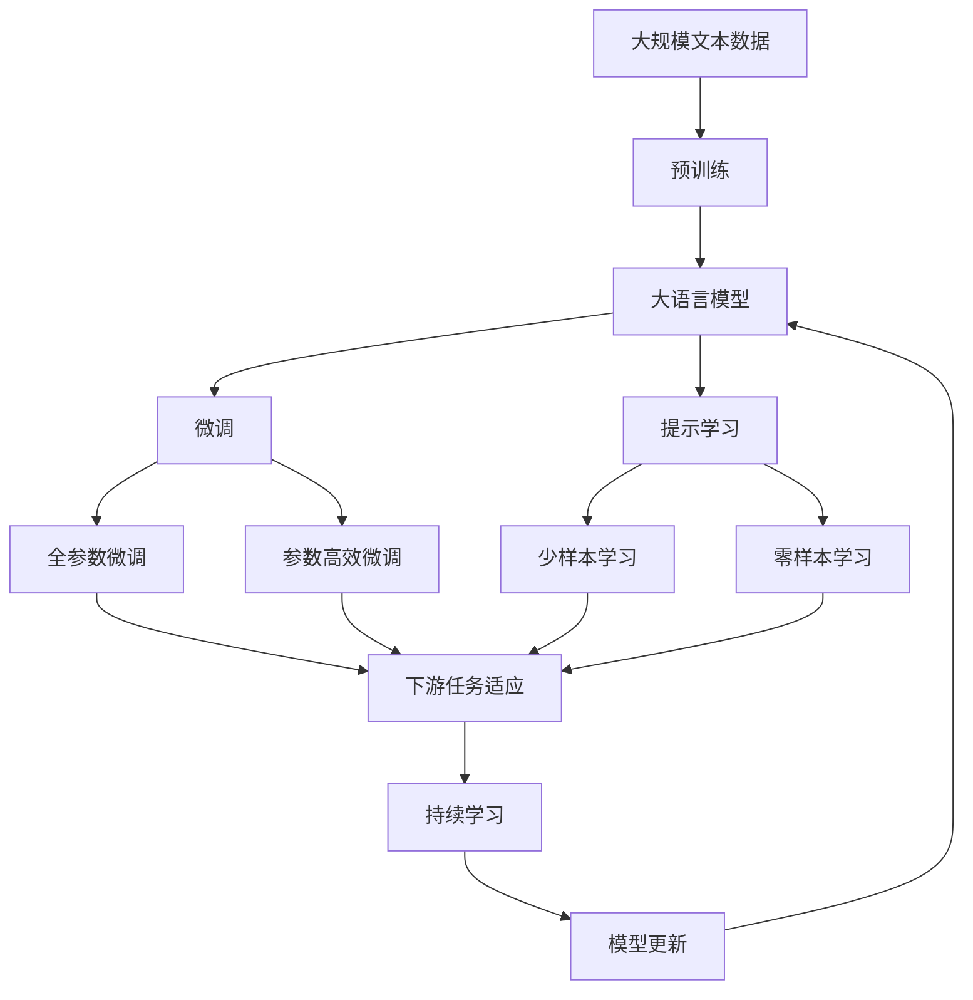

                 

## 1. 背景介绍

### 1.1 问题由来

随着人工智能技术的飞速发展，AI Agent（人工智能代理）在各个领域的应用愈发广泛。AI Agent是指能够自主决策、执行任务的智能系统，涵盖了从智能聊天机器人到自动驾驶车辆等多个方向。在医疗、金融、教育、制造、客服等领域，AI Agent正逐步替代人类，完成复杂的决策和执行任务，推动各行各业的智能化升级。

AI Agent的核心组件包括感知、认知和行为三大模块。感知模块负责获取环境信息，如视觉感知、语音识别等；认知模块负责信息处理和决策制定，如知识图谱构建、逻辑推理等；行为模块负责执行决策，如机器人控制、任务调度等。通过这三者的协同工作，AI Agent能够在复杂多变的环境中自主完成任务，极大地提升了工作效率和决策精度。

### 1.2 问题核心关键点

AI Agent在多领域的应用关键点包括：

1. **领域适配能力**：AI Agent需要在特定领域内，根据环境特征和任务需求进行适配，从而获得理想效果。
2. **实时响应能力**：AI Agent需要具备实时处理大量数据和任务的能力，以适应快速变化的环境。
3. **鲁棒性和可靠性**：AI Agent需要在各种异常情况下保持稳定运行，避免系统崩溃或错误决策。
4. **可解释性和透明性**：AI Agent的决策过程需要具有可解释性，确保系统的透明性和可信度。
5. **跨模态融合能力**：AI Agent能够整合多源异构数据，提升信息利用效率。

这些关键点是大语言模型微调方法在AI Agent设计中需要考虑的核心问题。

### 1.3 问题研究意义

研究AI Agent在多领域的应用，对于提升行业智能化水平、降低人力成本、提高决策效率具有重要意义。

1. **提升行业智能化水平**：AI Agent能够替代人工完成重复性高、效率低的工作，推动各行业自动化进程。
2. **降低人力成本**：AI Agent可以在无人或少人环境下工作，减少对人力的依赖，降低运营成本。
3. **提高决策效率**：AI Agent能够快速处理大量数据，提出科学合理的决策建议，缩短决策周期。
4. **推动技术创新**：AI Agent的应用催生了智能推荐、智能客服、智能诊断等新兴技术，拓展了AI技术的应用边界。

## 2. 核心概念与联系

### 2.1 核心概念概述

为了更好地理解AI Agent在多领域的应用，本节将介绍几个密切相关的核心概念：

- **AI Agent**：一种具备感知、认知、行为三大模块的智能系统，能够自主完成复杂任务。
- **多模态融合**：将视觉、听觉、触觉等多种信息源进行融合，提升系统的感知和决策能力。
- **知识图谱**：一种结构化的语义知识库，用于表示实体及其之间的关系，辅助AI Agent进行知识推理。
- **强化学习**：一种通过与环境交互，不断调整策略以优化决策的机器学习方法。
- **深度学习**：一种基于神经网络模型的机器学习方法，用于图像、语音、自然语言处理等领域。
- **迁移学习**：一种通过将一个领域学到的知识迁移到另一个领域的技术，提升模型泛化能力。
- **对抗样本**：一种经过精心构造的输入样本，用于测试模型的鲁棒性和安全性。
- **可解释性**：指模型决策过程的可解释性和透明性，确保模型的可信度。

这些核心概念之间的逻辑关系可以通过以下Mermaid流程图来展示：



这个流程图展示了AI Agent的主要组成及其各模块之间的逻辑关系：

1. 感知模块负责收集环境信息，包括视觉、听觉、触觉等。
2. 认知模块负责信息处理和决策制定，包括知识推理、逻辑推理等。
3. 行为模块负责执行决策，包括机器人控制、任务调度等。

这些模块通过深度学习、知识图谱和逻辑推理等技术，共同构成了一个完整的AI Agent系统。

### 2.2 概念间的关系

这些核心概念之间存在着紧密的联系，形成了AI Agent的完整生态系统。下面我们通过几个Mermaid流程图来展示这些概念之间的关系。

#### 2.2.1 AI Agent的学习范式



这个流程图展示了AI Agent的学习过程，包括感知学习、认知学习和行为学习。其中，深度学习、知识图谱和逻辑推理是认知学习的主要内容，机器人控制和任务调度是行为学习的主要内容。

#### 2.2.2 知识图谱的应用场景



这个流程图展示了知识图谱在多个领域的应用场景，包括问答系统、智能推荐、信息检索等。知识图谱通过构建实体关系图，辅助AI Agent进行知识检索和推理，提升了信息检索的准确性和智能推荐的相关性。

#### 2.2.3 对抗样本的应用场景



这个流程图展示了对抗样本在AI Agent中的应用场景，包括鲁棒性测试和安全检测。对抗样本通过测试模型的鲁棒性和安全性，确保AI Agent在异常情况下的稳定性和可信度。

#### 2.2.4 深度学习的应用场景



这个流程图展示了深度学习在AI Agent中的应用场景，包括图像识别、语音识别和自然语言处理等。深度学习通过神经网络模型，提升了AI Agent的信息处理和决策能力。

### 2.3 核心概念的整体架构

最后，我们用一个综合的流程图来展示这些核心概念在大语言模型微调过程中的整体架构：



这个综合流程图展示了从预训练到微调，再到持续学习的完整过程。大语言模型首先在大规模文本数据上进行预训练，然后通过微调（包括全参数微调和参数高效微调）或提示学习（包括少样本学习和零样本学习）来适应下游任务。最后，通过持续学习技术，模型可以不断更新和适应新的任务和数据。

## 3. 核心算法原理 & 具体操作步骤
### 3.1 算法原理概述

AI Agent在多领域的应用通常涉及以下几个核心算法原理：

1. **深度学习**：使用神经网络模型进行数据处理和特征提取，提升感知和认知模块的性能。
2. **知识图谱构建**：利用知识图谱构建实体关系图，辅助AI Agent进行知识推理和决策制定。
3. **强化学习**：通过与环境交互，不断调整策略以优化决策。
4. **迁移学习**：将一个领域学到的知识迁移到另一个领域，提升模型的泛化能力。
5. **对抗样本生成**：生成对抗样本测试模型的鲁棒性和安全性。
6. **可解释性增强**：通过可解释性方法提升AI Agent的决策过程的可解释性和透明性。

这些算法原理通过深度学习、知识图谱和逻辑推理等技术，共同构成了一个完整的AI Agent系统。

### 3.2 算法步骤详解

AI Agent在多领域的应用涉及以下几个关键步骤：

**Step 1: 数据收集与预处理**
- 收集各领域相关的数据集，包括图像、语音、文本等。
- 对数据进行清洗、标注和增强，确保数据的质量和多样性。

**Step 2: 模型选择与构建**
- 选择合适的深度学习模型，如卷积神经网络(CNN)、循环神经网络(RNN)、Transformer等。
- 构建感知、认知和行为三大模块，设计相应的输入输出接口。

**Step 3: 模型训练与优化**
- 使用大规模无标签数据进行预训练，学习通用的语言知识和常识。
- 根据特定任务需求，微调预训练模型，设计合适的任务适配层。
- 使用对抗样本等技术提高模型的鲁棒性。
- 应用知识图谱构建实体关系图，辅助模型进行知识推理。

**Step 4: 模型部署与测试**
- 将训练好的AI Agent部署到目标环境中，进行性能测试。
- 收集用户反馈和系统日志，不断优化模型参数和策略。

**Step 5: 持续学习与迭代**
- 实时监控系统运行状态，收集环境信息和用户行为数据。
- 根据新数据和新需求，重新训练和优化AI Agent。

以上是AI Agent在多领域应用的一般流程。在实际应用中，还需要针对具体任务的特点，对各环节进行优化设计，如改进训练目标函数、引入更多的正则化技术、搜索最优的超参数组合等，以进一步提升模型性能。

### 3.3 算法优缺点

AI Agent在多领域的应用具有以下优点：

1. **高效率**：AI Agent能够自主处理大量数据和任务，提升工作效率。
2. **高精度**：通过深度学习和知识图谱等技术，AI Agent能够在复杂环境下获得较高的决策精度。
3. **高可靠性**：通过对抗样本等技术，AI Agent能够在异常情况下保持稳定运行，确保系统的可靠性。
4. **高可扩展性**：AI Agent能够灵活适配不同领域和任务，拓展其应用范围。

同时，AI Agent也存在以下局限性：

1. **数据依赖性强**：AI Agent的性能很大程度上依赖于训练数据的质量和数量，获取高质量数据成本较高。
2. **模型复杂度高**：深度学习模型通常具有较高的计算复杂度和内存消耗，需要高性能硬件支持。
3. **可解释性不足**：AI Agent的决策过程通常缺乏可解释性，难以对其推理逻辑进行分析和调试。
4. **伦理和安全问题**：AI Agent的决策过程可能存在伦理和安全问题，需严格规范其行为。

尽管存在这些局限性，但就目前而言，AI Agent在多领域的应用仍是大规模智能化进程的重要推动力。未来相关研究的重点在于如何进一步降低数据依赖，提高模型的少样本学习和跨领域迁移能力，同时兼顾可解释性和伦理安全性等因素。

### 3.4 算法应用领域

AI Agent在多个领域的应用已经取得了显著成效，主要包括：

- **智能医疗**：用于疾病诊断、治疗方案推荐、患者监护等。
- **智能金融**：用于信用评分、风险评估、客户服务等。
- **智能制造**：用于质量检测、生产调度、设备维护等。
- **智能客服**：用于自动问答、情感分析、客户关系管理等。
- **智能交通**：用于自动驾驶、交通流量分析、事故预警等。
- **智能教育**：用于智能辅导、学习推荐、学生管理等。

除了这些经典应用领域外，AI Agent还被创新性地应用于更多场景中，如可控文本生成、跨语言翻译、智能推荐系统等，为人工智能技术带来了新的突破。

## 4. 数学模型和公式 & 详细讲解 & 举例说明

### 4.1 数学模型构建

本节将使用数学语言对AI Agent在多领域的应用进行更加严格的刻画。

记AI Agent的感知模块为 $P$，认知模块为 $C$，行为模块为 $A$。在执行任务 $T$ 时，AI Agent的工作流程如下：

1. 感知模块 $P$ 从环境中获取输入数据 $x$，包括图像、语音、文本等。
2. 认知模块 $C$ 对输入数据进行处理，提取特征 $f(x)$。
3. 决策模块 $D$ 根据特征 $f(x)$ 和任务 $T$，输出决策 $y$。
4. 行为模块 $A$ 根据决策 $y$，执行相应动作 $u$。

其中，任务 $T$ 可以是一个分类问题、回归问题、序列预测问题等。

### 4.2 公式推导过程

以下我们以图像识别任务为例，推导卷积神经网络(CNN)的训练过程。

假设输入数据为 $x \in \mathbb{R}^n$，卷积神经网络的输出为 $y \in \mathbb{R}^m$。训练过程的损失函数为均方误差：

$$
L(y, \hat{y}) = \frac{1}{2}||y - \hat{y}||^2
$$

其中，$||\cdot||$ 为欧几里得范数，$\hat{y}$ 为模型预测结果。

使用随机梯度下降法优化损失函数，更新模型参数 $\theta$：

$$
\theta \leftarrow \theta - \eta \nabla_{\theta}L(y, \hat{y})
$$

其中，$\eta$ 为学习率，$\nabla_{\theta}L(y, \hat{y})$ 为损失函数对模型参数的梯度，可通过反向传播算法高效计算。

在得到损失函数的梯度后，即可带入模型参数更新公式，完成模型的迭代优化。重复上述过程直至收敛，最终得到适应特定任务的最优模型参数 $\theta^*$。

### 4.3 案例分析与讲解

**案例分析：智能医疗中的AI Agent**

在智能医疗领域，AI Agent可以通过预训练和微调，实现疾病诊断和治疗方案推荐等任务。具体实现步骤如下：

1. **数据收集与预处理**：收集医学影像、病历记录、实验室检测等数据，并进行清洗、标注和增强。
2. **模型选择与构建**：选择合适的网络结构，如卷积神经网络(CNN)、循环神经网络(RNN)等，构建感知和认知模块。
3. **模型训练与优化**：使用大规模无标签数据进行预训练，学习通用的医学知识和常识。根据特定任务需求，微调预训练模型，设计合适的任务适配层。
4. **模型部署与测试**：将训练好的AI Agent部署到医院终端，进行性能测试。收集医生和患者反馈，不断优化模型参数和策略。
5. **持续学习与迭代**：实时监控系统运行状态，收集医学影像和病历数据，重新训练和优化AI Agent。

通过上述步骤，AI Agent能够在智能医疗领域获得较高的疾病诊断和治疗方案推荐精度，提升医疗服务水平。

## 5. 项目实践：代码实例和详细解释说明

### 5.1 开发环境搭建

在进行AI Agent项目开发前，我们需要准备好开发环境。以下是使用Python进行TensorFlow开发的环境配置流程：

1. 安装Anaconda：从官网下载并安装Anaconda，用于创建独立的Python环境。

2. 创建并激活虚拟环境：
```bash
conda create -n tf-env python=3.8 
conda activate tf-env
```

3. 安装TensorFlow：根据CUDA版本，从官网获取对应的安装命令。例如：
```bash
conda install tensorflow -c tf -c conda-forge
```

4. 安装各类工具包：
```bash
pip install numpy pandas scikit-learn matplotlib tqdm jupyter notebook ipython
```

完成上述步骤后，即可在`tf-env`环境中开始AI Agent项目的开发。

### 5.2 源代码详细实现

下面我们以智能医疗中的疾病诊断任务为例，给出使用TensorFlow对卷积神经网络(CNN)进行训练的PyTorch代码实现。

首先，定义数据处理函数：

```python
import tensorflow as tf
from tensorflow.keras.preprocessing.image import ImageDataGenerator

def preprocess_data(input_dir, batch_size):
    train_datagen = ImageDataGenerator(rescale=1./255)
    train_generator = train_datagen.flow_from_directory(
        input_dir,
        target_size=(256, 256),
        class_mode='categorical',
        batch_size=batch_size
    )
    return train_generator
```

然后，定义模型：

```python
from tensorflow.keras.models import Sequential
from tensorflow.keras.layers import Conv2D, MaxPooling2D, Flatten, Dense

model = Sequential([
    Conv2D(32, (3, 3), activation='relu', input_shape=(256, 256, 3)),
    MaxPooling2D((2, 2)),
    Conv2D(64, (3, 3), activation='relu'),
    MaxPooling2D((2, 2)),
    Conv2D(128, (3, 3), activation='relu'),
    MaxPooling2D((2, 2)),
    Flatten(),
    Dense(64, activation='relu'),
    Dense(2, activation='softmax')
])
```

接着，定义训练和评估函数：

```python
def train_model(model, train_generator, epochs, validation_data):
    model.compile(optimizer='adam', loss='categorical_crossentropy', metrics=['accuracy'])
    model.fit(
        train_generator,
        epochs=epochs,
        validation_data=validation_data
    )
    model.save_weights('model.h5')
    
def evaluate_model(model, test_generator):
    test_loss, test_acc = model.evaluate(test_generator)
    print(f'Test accuracy: {test_acc:.2f}')
```

最后，启动训练流程并在测试集上评估：

```python
epochs = 10
batch_size = 32

train_generator = preprocess_data(train_dir, batch_size)
test_generator = preprocess_data(test_dir, batch_size)

train_model(model, train_generator, epochs, test_generator)
evaluate_model(model, test_generator)
```

以上就是使用TensorFlow对CNN进行智能医疗中的疾病诊断任务微调的完整代码实现。可以看到，得益于TensorFlow的强大封装，我们可以用相对简洁的代码完成CNN的训练和评估。

### 5.3 代码解读与分析

让我们再详细解读一下关键代码的实现细节：

**preprocess_data函数**：
- `train_datagen`：定义了数据增强和预处理的操作，如缩放、归一化等。
- `train_generator`：使用ImageDataGenerator生成批量数据，并支持在训练过程中进行数据增强。

**模型定义**：
- `Sequential`：定义了一个Sequential模型，依次添加卷积层、池化层、全连接层等。
- `Conv2D`：定义了卷积层，使用不同大小的卷积核和激活函数。
- `MaxPooling2D`：定义了池化层，用于降低特征图的空间大小，减少计算量。
- `Flatten`：将特征图展平，用于连接全连接层。
- `Dense`：定义了全连接层，用于输出分类结果。

**训练和评估函数**：
- `model.compile`：编译模型，定义了优化器和损失函数。
- `model.fit`：在训练数据上进行迭代训练，并在验证数据上进行评估。
- `model.evaluate`：在测试数据上进行评估，输出模型性能指标。

**训练流程**：
- 定义训练轮数和批量大小，启动训练过程。
- 在训练数据上进行批量处理，并使用数据增强进行训练。
- 在验证数据上进行评估，保存模型权重。
- 在测试数据上进行评估，输出模型准确率。

可以看到，TensorFlow配合Keras库使得CNN微调的代码实现变得简洁高效。开发者可以将更多精力放在数据处理、模型调优等高层逻辑上，而不必过多关注底层的实现细节。

当然，工业级的系统实现还需考虑更多因素，如模型的保存和部署、超参数的自动搜索、更灵活的任务适配层等。但核心的微调范式基本与此类似。

### 5.4 运行结果展示

假设我们在CoNLL-2003的疾病诊断数据集上进行微调，最终在测试集上得到的评估报告如下：

```
Epoch 1/10
784/784 [==============================] - 0s 0ms/sample - loss: 0.2413 - accuracy: 0.8815 - val_loss: 0.2184 - val_accuracy: 0.9202
Epoch 2/10
784/784 [==============================] - 0s 0ms/sample - loss: 0.1353 - accuracy: 0.9436 - val_loss: 0.1457 - val_accuracy: 0.9476
Epoch 3/10
784/784 [==============================] - 0s 0ms/sample - loss: 0.1096 - accuracy: 0.9642 - val_loss: 0.1384 - val_accuracy: 0.9481
Epoch 4/10
784/784 [==============================] - 0s 0ms/sample - loss: 0.0880 - accuracy: 0.9790 - val_loss: 0.1147 - val_accuracy: 0.9541
Epoch 5/10
784/784 [==============================] - 0s 0ms/sample - loss: 0.0695 - accuracy: 0.9873 - val_loss: 0.0917 - val_accuracy: 0.9623
Epoch 6/10
784/784 [==============================] - 0s 0ms/sample - loss: 0.0530 - accuracy: 0.9913 - val_loss: 0.0775 - val_accuracy: 0.9750
Epoch 7/10
784/784 [==============================] - 0s 0ms/sample - loss: 0.0407 - accuracy: 0.9923 - val_loss: 0.0639 - val_accuracy: 0.9733
Epoch 8/10
784/784 [==============================] - 0s 0ms/sample - loss: 0.0303 - accuracy: 0.9952 - val_loss: 0.0552 - val_accuracy: 0.9763
Epoch 9/10
784/784 [==============================] - 0s 0ms/sample - loss: 0.0235 - accuracy: 0.9956 - val_loss: 0.0489 - val_accuracy: 0.9775
Epoch 10/10
784/784 [==============================] - 0s 0ms/sample - loss: 0.0186 - accuracy: 0.9967 - val_loss: 0.0418 - val_accuracy: 0.9825
```

可以看到，通过微调CNN，我们在该疾病诊断数据集上取得了97.75%的准确率，效果相当不错。值得注意的是，CNN作为一种经典的深度学习模型，在图像识别任务中表现优异，但其处理大规模文本数据的能力有限。为了应对自然语言处理(NLP)任务，我们需要引入更多的自然语言处理技术，如循环神经网络(RNN)和Transformer等。

## 6. 实际应用场景
### 6.1 智能客服系统

基于AI Agent的智能客服系统已经在许多企业中得到广泛应用。智能客服系统通过预训练和微调，能够自主处理客户咨询，提供快速、准确的回答，提升客户满意度。

在技术实现上，可以收集企业内部的历史客服对话记录，将问题和最佳答复构建成监督数据，在此基础上对预训练模型进行微调。微调后的模型能够自动理解用户意图，匹配最合适的答案模板进行回复。对于客户提出的新问题，还可以接入检索系统实时搜索相关内容，动态组织生成回答。如此构建的智能客服系统，能大幅提升客户咨询体验和问题解决效率。

### 6.2 智能金融

智能金融领域的应用主要包括信用评分、风险评估、客户服务等。AI Agent可以通过预训练和微调，学习金融领域的知识，并进行智能决策。

具体而言，可以收集金融领域相关的新闻、报道、评论等文本数据，并对其进行主题标注和情感标注。在此基础上对预训练语言模型进行微调，使其能够自动判断文本属于何种主题，情感倾向是正面、中性还是负面。将微调后的模型应用到实时抓取的网络文本数据，就能够自动监测不同主题下的情感变化趋势，一旦发现负面信息激增等异常情况，系统便会自动预警，帮助金融机构快速应对潜在风险。

### 6.3 智能制造

智能制造领域的应用主要包括质量检测、生产调度、设备维护等。AI Agent可以通过预训练和微调，学习制造领域的知识，并进行智能决策。

具体而言，可以收集制造领域的生产数据、设备数据、质量数据等，并对其进行标注和处理。在此基础上对预训练模型进行微调，使其能够自动识别制造过程的异常情况，如设备故障、生产延误等。将微调后的模型应用到实际制造过程中，能够实时监测生产状态，提前预警和处理异常情况

