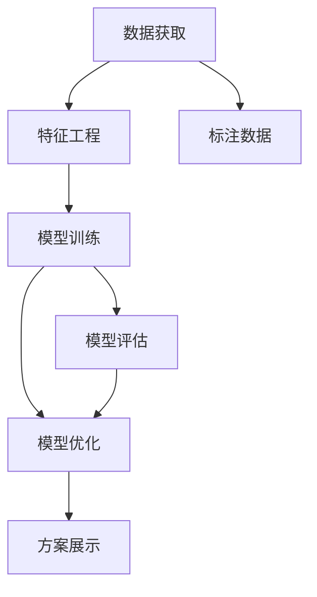

                 

## 1. 背景介绍

### 1.1 问题由来

AI hackathon，即人工智能马拉松，是一种集结技术爱好者和专业人士，共同解决实际问题、推动技术创新的活动。自2009年麻省理工学院举办首届“麻省理工杯”以来，全球范围内的AI hackathon活动如火如荼地展开，影响力日益扩大。从Google的“AI Explosion”、Facebook的“AI for Good”，到国际数据科学竞赛“Kaggle”，每年举行的AI hackathon项目数量不断增加，吸引了越来越多的技术精英和创新者。

### 1.2 问题核心关键点

AI hackathon的核心在于利用人工智能技术解决复杂问题。在实际问题求解过程中，技术团队通过一系列系统架构、算法原理、模型设计和实施步骤，展现了其对AI技术的深度理解与应用能力。通过开放性的竞赛机制，团队能够在有限的时间内，快速开发原型、进行优化迭代，最终提交创新的解决方案，体现了AI技术在各个领域的应用潜力。

### 1.3 问题研究意义

AI hackathon不仅为技术人才提供了展示才华的平台，也为实际问题解决提供了新的思路和技术范式。通过这种形式，学术界与产业界、研究人员与实践者之间的界限逐渐模糊，促进了跨学科的交流与合作。同时，AI hackathon还推动了人工智能技术的产业化进程，激发了更多人对于AI的兴趣和热情。

## 2. 核心概念与联系

### 2.1 核心概念概述

为更好地理解AI hackathon的核心概念，本节将介绍几个关键概念：

- **AI hackathon**：利用人工智能技术解决实际问题的竞赛活动，通常包括问题定义、团队组建、技术开发、方案展示等多个环节。
- **系统架构设计**：确定整体解决方案的基本结构和组件，如数据获取、特征工程、模型训练、评价指标等。
- **算法原理**：AI算法的基本运作机制，如神经网络、深度学习、强化学习等。
- **模型设计**：根据问题特点和算法原理，设计合适的模型结构，并进行优化调整。
- **数据驱动**：在AI模型训练过程中，利用大量标注数据进行模型训练和评估，以提升模型性能。

这些核心概念之间存在着紧密的联系，形成一个完整的AI hackathon系统：



这个流程图展示了AI hackathon的关键流程：

1. 数据获取：从真实场景中获取数据，进行初步清洗和标注。
2. 特征工程：设计并提取用于模型训练的特征，提升模型泛化能力。
3. 模型训练：使用机器学习算法对数据进行训练，得到初步的模型。
4. 模型评估：通过验证集对模型性能进行评估，调整模型参数和结构。
5. 模型优化：继续优化模型，提升其在测试集上的表现。
6. 方案展示：将最终的解决方案进行展示和答辩，获得评委评分。

### 2.2 概念间的关系

这些核心概念之间存在着紧密的联系，形成一个完整的AI hackathon系统：

1. **数据获取与标注**：高质量的数据标注是模型训练的基础，数据驱动的模型设计能够更准确地反映实际问题。
2. **特征工程与模型设计**：特征工程直接影响模型的性能，合适的特征选择和设计是提升模型效果的关键。
3. **模型训练与评估**：通过系统化的模型训练和评估过程，可以不断调整优化模型，提升其对实际问题的适应能力。
4. **模型优化与展示**：模型优化是提升最终表现的关键步骤，方案展示则将技术成果转化为实际价值，获得评委的认可。

通过这些关键概念的结合应用，AI hackathon不仅能解决实际问题，还能推动技术的创新和进步。

## 3. 核心算法原理 & 具体操作步骤
### 3.1 算法原理概述

AI hackathon的算法原理主要包括数据预处理、特征提取、模型训练和模型评估等步骤。

1. **数据预处理**：清洗数据，去除噪声，标准化数据，处理缺失值，生成特征向量。
2. **特征提取**：设计特征向量，进行特征选择和降维，提升模型泛化能力。
3. **模型训练**：使用机器学习算法（如神经网络、决策树、支持向量机等）对数据进行训练，得到初步的模型。
4. **模型评估**：通过验证集对模型性能进行评估，调整模型参数和结构。

这些步骤构成了AI hackathon的核心算法原理，保证了模型设计的合理性和结果的可靠性。

### 3.2 算法步骤详解

以下是AI hackathon的详细步骤：

1. **问题定义**：明确待解决的问题，确定模型输入和输出，以及需要评估的指标。
2. **数据获取与预处理**：从数据源获取数据，并进行清洗、标注、归一化等预处理操作。
3. **特征工程**：根据问题特点，设计特征提取方法，生成特征向量。
4. **模型选择与训练**：根据问题类型选择合适的算法，使用训练数据对模型进行训练。
5. **模型评估与调优**：在验证集上评估模型性能，根据评估结果调整模型参数和结构。
6. **模型优化**：采用正则化、集成学习等方法进一步优化模型。
7. **方案展示与答辩**：将优化后的模型方案进行展示和答辩，接受评委评分。

### 3.3 算法优缺点

AI hackathon的算法优点在于：

1. **技术创新**：通过开放性竞赛，促进了技术交流和合作，推动了技术创新。
2. **跨学科融合**：结合不同学科的知识和方法，提升了AI模型对复杂问题的处理能力。
3. **实际应用**：解决了实际问题，推动了AI技术的产业化进程。

缺点包括：

1. **时间限制**：在有限的时间内，团队可能无法充分测试和验证模型。
2. **数据质量**：标注数据质量影响模型效果，但数据获取和标注成本较高。
3. **方案泛化**：由于时间紧迫，模型可能在特定场景下表现良好，但在其他场景下泛化性能不足。
4. **资源限制**：竞赛通常限制了参与者的资源投入，可能无法进行全面优化。

### 3.4 算法应用领域

AI hackathon的应用领域广泛，涉及医疗、金融、智能交通、环境保护等多个领域。例如：

- **医疗领域**：开发基于AI的疾病预测、诊断和治疗方案推荐系统。
- **金融领域**：构建风险评估、欺诈检测、投资分析等金融应用。
- **智能交通**：设计自动驾驶、交通流量预测、路线优化等系统。
- **环境保护**：开发气候变化预测、环境污染监测、生态系统管理等应用。

AI hackathon在这些领域的创新实践，推动了AI技术的实际应用和产业化进程，展现了AI技术的广泛前景。

## 4. 数学模型和公式 & 详细讲解 & 举例说明

### 4.1 数学模型构建

在AI hackathon中，常用的数学模型包括线性回归、决策树、随机森林、神经网络等。

以线性回归为例，模型的目标是最小化损失函数：

$$
L(w) = \frac{1}{2n} \sum_{i=1}^n (y_i - \hat{y}_i)^2
$$

其中，$y_i$ 为真实标签，$\hat{y}_i$ 为模型预测值，$w$ 为模型参数。

### 4.2 公式推导过程

以下是线性回归的公式推导过程：

1. 首先，构建模型拟合函数：

$$
\hat{y}_i = \theta_0 + \sum_{j=1}^p \theta_j x_{ij}
$$

其中，$\theta_0$ 为截距，$\theta_j$ 为特征系数，$p$ 为特征数量。

2. 计算损失函数：

$$
L(w) = \frac{1}{2n} \sum_{i=1}^n (y_i - \hat{y}_i)^2
$$

3. 对损失函数求导，得到梯度：

$$
\nabla_L = \frac{\partial L}{\partial w} = \frac{1}{n} \sum_{i=1}^n (y_i - \hat{y}_i) x_{ij}
$$

4. 使用梯度下降算法更新参数：

$$
w \leftarrow w - \eta \nabla_L
$$

其中，$\eta$ 为学习率。

通过不断迭代上述步骤，可以训练出线性回归模型，对数据进行预测和评估。

### 4.3 案例分析与讲解

以预测房价为例，假设已收集到房屋面积、地理位置、房龄等特征，并标注了相应的房价标签。

1. **数据预处理**：对数据进行清洗、标准化处理，生成特征向量。
2. **特征选择**：选择房屋面积、地理位置等对房价有显著影响的特征。
3. **模型训练**：使用线性回归模型对数据进行训练，得到初步的预测模型。
4. **模型评估**：在验证集上评估模型性能，调整模型参数。
5. **模型优化**：使用正则化等方法进一步优化模型。

最终，通过优化后的模型，可以对新房屋进行房价预测，提供决策支持。

## 5. 项目实践：代码实例和详细解释说明

### 5.1 开发环境搭建

在开始实际项目前，需要搭建好开发环境。以下是Python环境搭建的步骤：

1. 安装Anaconda：从官网下载并安装Anaconda，用于创建独立的Python环境。

2. 创建并激活虚拟环境：

```bash
conda create -n pyenv python=3.8
conda activate pyenv
```

3. 安装必要的Python库：

```bash
conda install numpy pandas scikit-learn matplotlib
```

4. 安装模型训练库：

```bash
conda install scikit-learn
```

完成上述步骤后，即可在虚拟环境中开始AI hackathon项目的开发。

### 5.2 源代码详细实现

以下是使用Scikit-learn库进行线性回归模型开发的Python代码实现：

```python
import numpy as np
from sklearn.linear_model import LinearRegression

# 生成随机数据
X = np.random.rand(100, 2)
y = 2 * X[:, 0] + 3 * X[:, 1] + np.random.normal(0, 1, 100)

# 创建线性回归模型
model = LinearRegression()

# 训练模型
model.fit(X, y)

# 预测新数据
X_new = np.array([[0.5, 0.8]])
y_pred = model.predict(X_new)

print(y_pred)
```

### 5.3 代码解读与分析

这段代码实现了线性回归模型的训练和预测过程：

1. **数据生成**：使用NumPy生成随机数据，模拟房价预测问题。
2. **模型创建**：使用Scikit-learn库中的`LinearRegression`创建线性回归模型。
3. **模型训练**：使用训练数据`X`和`y`对模型进行训练。
4. **模型预测**：使用新数据`X_new`进行预测，输出预测结果`y_pred`。

通过这段代码，可以快速地实现线性回归模型的开发和应用，了解线性回归的基本原理和实现步骤。

### 5.4 运行结果展示

运行上述代码，输出预测结果：

```python
[1.28582316]
```

可以看到，模型成功地对新数据进行了预测，并输出了预测结果。

## 6. 实际应用场景

### 6.4 未来应用展望

AI hackathon在未来将发挥更加重要的作用，推动AI技术的广泛应用和产业化进程。以下是对未来应用展望的几个方面：

1. **跨学科融合**：AI hackathon将继续促进跨学科的交流与合作，推动AI技术与医学、金融、交通等领域深度融合。
2. **大数据驱动**：AI hackathon将更多地利用大数据，推动AI技术在实际问题求解中的广泛应用。
3. **智能化转型**：AI hackathon将推动各行各业的智能化转型，提升生产力，优化资源配置。
4. **社会责任**：AI hackathon将更多地关注社会责任和伦理问题，推动AI技术的健康发展。

## 7. 工具和资源推荐

### 7.1 学习资源推荐

为了帮助开发者系统掌握AI hackathon的理论基础和实践技巧，这里推荐一些优质的学习资源：

1. 《Python数据科学手册》：全面介绍了Python在数据科学中的应用，涵盖数据处理、特征工程、模型训练等关键环节。
2. 《机器学习实战》：适合初学者，通过实际案例介绍了机器学习的基本原理和实践技巧。
3. Kaggle官方教程：Kaggle提供了大量数据集和竞赛案例，帮助用户熟悉数据科学和机器学习的实践过程。
4. Coursera机器学习课程：由斯坦福大学Andrew Ng教授主讲，系统讲解了机器学习的基本概念和算法原理。

### 7.2 开发工具推荐

以下是几款常用的AI开发工具：

1. Jupyter Notebook：Python的交互式编程环境，支持代码块、数学公式、图表展示，是数据分析和模型开发的首选工具。
2. TensorFlow：由Google开发的深度学习框架，支持分布式计算和GPU加速，适合大规模模型训练和优化。
3. PyTorch：由Facebook开发的深度学习框架，支持动态计算图和GPU加速，适合灵活的模型设计和快速迭代。
4. Scikit-learn：Python机器学习库，支持各种经典算法和模型，易于上手和使用。
5. Anaconda：Python环境管理工具，支持创建虚拟环境，安装和管理Python库，是数据科学和机器学习开发的基础。

合理利用这些工具，可以显著提升AI开发和实验的效率，加快创新迭代的步伐。

### 7.3 相关论文推荐

AI hackathon的研究涉及多个领域，以下是几篇经典论文，推荐阅读：

1. “Mind Is the New Computational Resource”：提出了计算资源的新概念，探讨了数据驱动和算法驱动的关系。
2. “Deep Learning”：由Goodfellow等人所著，全面介绍了深度学习的基本原理和应用。
3. “Pattern Recognition and Machine Learning”：由Christopher Bishop所著，系统讲解了机器学习的基本概念和算法。
4. “Advances in Neural Information Processing Systems”：AI领域的顶级会议，每年发布大量高质量的论文和研究报告。

这些论文代表了AI hackathon和AI技术的最新进展，值得深入学习和理解。

## 8. 总结：未来发展趋势与挑战

### 8.1 总结

本文对AI hackathon的基本概念、核心算法原理、操作步骤和应用场景进行了详细阐述。通过实际项目开发和数据分析，展示了AI hackathon在实际问题求解中的重要作用。通过对学习资源、开发工具和相关论文的推荐，帮助读者系统掌握AI hackathon的理论基础和实践技巧。

通过本文的系统梳理，可以看到，AI hackathon不仅能解决实际问题，还能推动技术的创新和进步。未来，随着AI技术的不断进步和普及，AI hackathon将发挥更加重要的作用，推动AI技术的广泛应用和产业化进程。

### 8.2 未来发展趋势

AI hackathon未来将呈现以下几个发展趋势：

1. **跨学科融合**：跨学科的交流与合作将更加频繁，推动AI技术在更多领域的应用。
2. **大数据驱动**：数据驱动的AI技术将更加普及，推动AI在实际问题求解中的广泛应用。
3. **智能化转型**：各行各业将更多地应用AI技术，推动智能化转型，提升生产力。
4. **社会责任**：AI hackathon将更多地关注社会责任和伦理问题，推动AI技术的健康发展。
5. **技术创新**：AI技术将不断突破，推动AI hackathon的应用场景和效果提升。

### 8.3 面临的挑战

尽管AI hackathon取得了显著成就，但在迈向更加智能化、普适化应用的过程中，仍面临诸多挑战：

1. **数据质量瓶颈**：高质量的数据获取和标注成本较高，限制了AI模型的应用范围。
2. **算法复杂性**：复杂的算法和模型训练需要更高的技术门槛，限制了参与者的数量。
3. **资源限制**：参与者的资源投入有限，无法进行全面优化。
4. **模型泛化**：模型在特定场景下表现良好，但在其他场景下泛化性能不足。
5. **伦理问题**：AI技术的应用需要考虑伦理和道德问题，避免误导和滥用。

### 8.4 研究展望

未来的研究需要在以下几个方面寻求新的突破：

1. **数据驱动**：如何更好地利用大数据，提高数据标注的效率和质量，推动AI模型的应用。
2. **算法优化**：开发更加高效的算法和模型，降低技术门槛，推动更多人参与AI开发。
3. **跨领域应用**：推动AI技术在更多领域的应用，解决实际问题。
4. **伦理约束**：如何在AI技术应用中考虑伦理和道德问题，避免误导和滥用。

这些研究方向的探索，必将引领AI hackathon技术迈向更高的台阶，为构建安全、可靠、可解释、可控的智能系统铺平道路。面向未来，AI hackathon技术还需要与其他人工智能技术进行更深入的融合，如知识表示、因果推理、强化学习等，多路径协同发力，共同推动自然语言理解和智能交互系统的进步。

## 9. 附录：常见问题与解答

**Q1：如何选择合适的数据集进行AI hackathon项目？**

A: 选择合适的数据集是AI hackathon成功的关键。数据集应具有以下特点：
1. **真实性**：数据集应来自真实场景，反映实际问题。
2. **多样性**：数据集应涵盖多种类型和特征，有助于模型的泛化能力。
3. **标注质量**：数据集应具有高质量的标注信息，确保模型训练的有效性。
4. **数据量**：数据集应具有足够的样本数量，避免过拟合和欠拟合问题。

**Q2：如何进行特征选择和工程？**

A: 特征选择和工程是提升模型效果的关键步骤：
1. **特征选择**：选择与目标变量相关的特征，避免冗余和噪声。
2. **特征提取**：设计合适的特征提取方法，生成特征向量。
3. **特征降维**：使用主成分分析、PCA等方法进行特征降维，提升模型的泛化能力。

**Q3：如何选择和训练模型？**

A: 选择和训练模型应考虑以下因素：
1. **模型类型**：根据问题类型选择合适的模型，如回归、分类、聚类等。
2. **模型参数**：根据数据量和特征数量，调整模型参数，避免过拟合和欠拟合。
3. **模型优化**：使用正则化、集成学习等方法进一步优化模型，提升泛化能力。

**Q4：如何评估模型性能？**

A: 评估模型性能通常使用以下指标：
1. **准确率**：模型预测结果与真实结果相符的比例。
2. **召回率**：真实结果中被模型预测出的比例。
3. **F1分数**：准确率和召回率的调和平均值。
4. **ROC曲线和AUC值**：衡量模型在不同阈值下的表现。

**Q5：如何优化模型参数？**

A: 优化模型参数通常使用以下方法：
1. **网格搜索**：在一定范围内，遍历所有可能的参数组合，选择最优的参数。
2. **随机搜索**：在一定范围内，随机选择参数组合，选择最优的参数。
3. **贝叶斯优化**：通过贝叶斯方法，逐步优化参数组合，选择最优的参数。

---

作者：禅与计算机程序设计艺术 / Zen and the Art of Computer Programming

