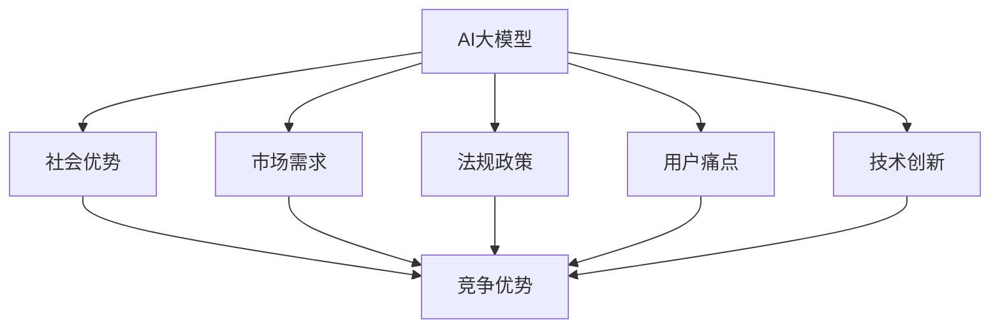
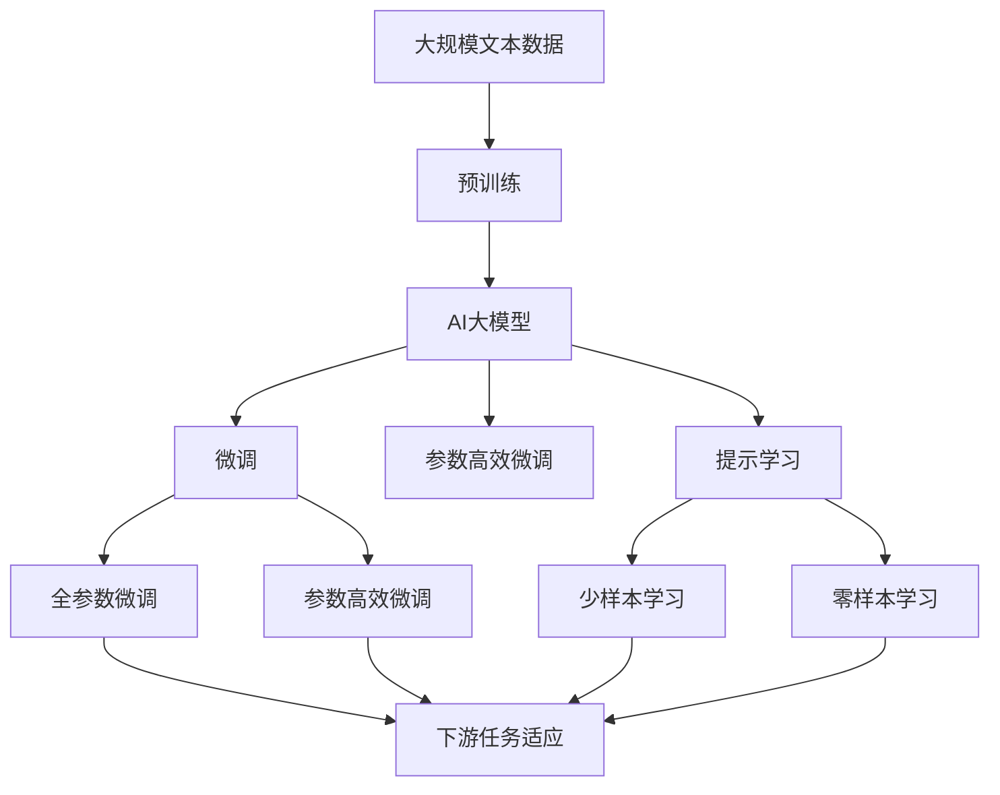
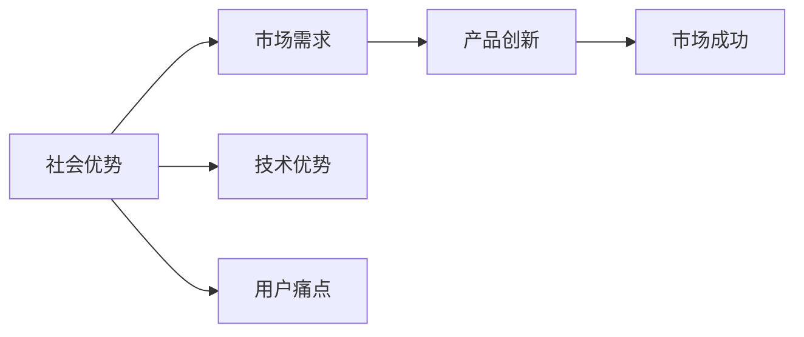
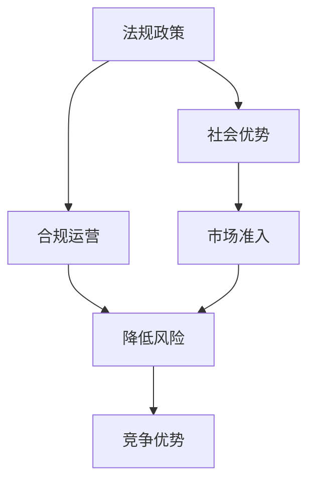
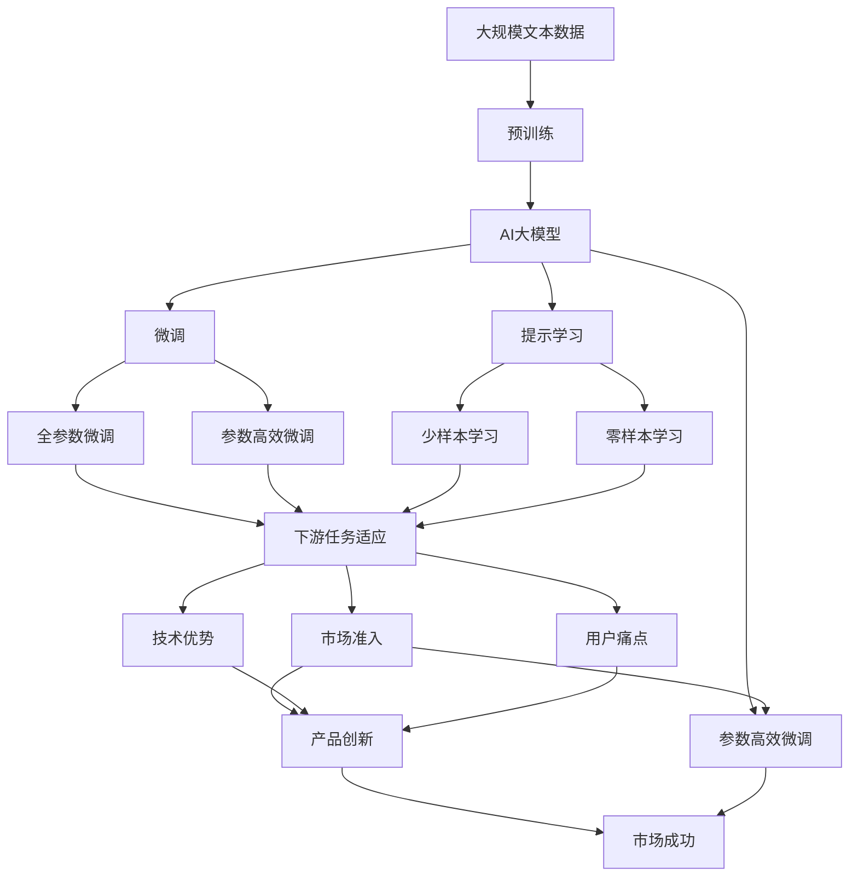

                 

# AI 大模型创业：如何利用社会优势？

## 1. 背景介绍

在AI大模型时代，利用社会优势成为创业的重要策略之一。随着AI技术的快速发展和广泛应用，越来越多的创业者开始关注利用AI技术解决社会问题，提升社会效率，从而获得商业成功。社会优势，不仅仅包括经济、文化、技术等方面的优势，更包括社会需求、用户痛点、法规政策等深层次的社会因素。本文将从技术、市场、政策等多个维度，探讨如何有效利用社会优势，打造成功的AI大模型创业项目。

## 2. 核心概念与联系

### 2.1 核心概念概述

为更好地理解利用社会优势的AI大模型创业，本节将介绍几个密切相关的核心概念：

- AI大模型：以自回归(如GPT)或自编码(如BERT)模型为代表的大规模预训练语言模型。通过在大规模无标签文本语料上进行预训练，学习通用的语言表示，具备强大的语言理解和生成能力。
- 社会优势：指企业利用社会环境中的各种资源、条件、信息等，提升自身竞争力和市场占有率的优势。
- 市场需求：指消费者、企业、政府等主体对于某种产品或服务的需求状态。
- 法规政策：指影响企业和消费者行为的法律、规章、标准等规范性文件。
- 用户痛点：指用户在使用产品或服务时遇到的难题和困扰。
- 技术创新：指在已有技术基础上，进行改进、升级，或研发出全新技术的过程。

这些核心概念之间的逻辑关系可以通过以下Mermaid流程图来展示：



这个流程图展示了大模型创业的关键要素及其之间的关系：

1. 大模型通过预训练获得基础能力。
2. 利用社会优势提升模型竞争力。
3. 识别市场需求，满足用户痛点。
4. 适应法规政策，合规运营。
5. 推动技术创新，引领行业趋势。

### 2.2 概念间的关系

这些核心概念之间存在着紧密的联系，形成了AI大模型创业的完整生态系统。下面我通过几个Mermaid流程图来展示这些概念之间的关系。

#### 2.2.1 AI大模型的学习范式



这个流程图展示了大模型学习的基本过程：预训练、微调、参数高效微调、提示学习，以及零样本学习和少样本学习。

#### 2.2.2 社会优势与市场需求的关联



这个流程图展示了社会优势与市场需求的关联：通过识别社会优势，可以发现市场需求和技术优势，进而推动产品创新，最终实现市场成功。

#### 2.2.3 法规政策对创业的影响



这个流程图展示了法规政策对创业的影响：通过遵循法规政策，可以实现合规运营，降低风险，增强竞争优势。

### 2.3 核心概念的整体架构

最后，我们用一个综合的流程图来展示这些核心概念在大模型创业过程中的整体架构：



这个综合流程图展示了从预训练到微调，再到产品创新的完整过程。大模型通过预训练获得基础能力，利用社会优势提升模型竞争力，识别市场需求，满足用户痛点，适应法规政策，推动技术创新，实现市场成功。

## 3. 核心算法原理 & 具体操作步骤

### 3.1 算法原理概述

利用社会优势进行AI大模型创业，本质上是通过对社会环境中的各种资源的整合和优化，提升模型的性能和商业价值。其核心思想是：利用社会优势，识别市场需求，优化模型设计，提升用户体验，实现市场突破。

具体而言，可以分为以下几个步骤：

1. **市场调研与需求分析**：深入了解目标市场的需求，识别用户痛点和机会。
2. **模型设计与优化**：基于市场需求，设计适合的市场导向模型，进行优化训练。
3. **社会优势整合**：利用社会环境中的资源，如用户数据、政府政策、技术社区等，优化模型性能。
4. **产品迭代与市场推广**：通过产品迭代和市场推广，不断提升用户体验和市场占有率。

### 3.2 算法步骤详解

以下是一个基于社会优势进行AI大模型创业的详细步骤：

**Step 1: 市场调研与需求分析**

1. 收集市场数据：通过问卷调查、用户反馈、市场报告等方式，收集目标市场的数据。
2. 分析用户痛点：分析用户在使用现有产品或服务时遇到的问题和困扰。
3. 识别需求机会：根据用户痛点和市场数据，识别新的需求机会。

**Step 2: 模型设计与优化**

1. 选择合适的预训练模型：根据市场需求，选择合适的预训练模型，如BERT、GPT等。
2. 设计任务适配层：根据任务类型，设计合适的输出层和损失函数。
3. 进行优化训练：在少量标注数据上，使用有监督微调方法，优化模型性能。

**Step 3: 社会优势整合**

1. 利用用户数据：收集用户数据，用于模型微调和优化。
2. 利用政府政策：遵守政府法规，获取政策支持，如数据安全、隐私保护等。
3. 利用技术社区：加入技术社区，获取技术支持和合作机会。

**Step 4: 产品迭代与市场推广**

1. 产品迭代：根据用户反馈和市场数据，不断迭代和优化产品。
2. 市场推广：通过广告、公关、社交媒体等手段，推广产品，提升市场占有率。
3. 持续优化：持续收集市场数据和用户反馈，进行模型优化和产品迭代。

### 3.3 算法优缺点

利用社会优势进行AI大模型创业的优点包括：

1. 快速响应市场需求：通过深入市场调研，及时发现用户痛点和需求机会，迅速推出产品。
2. 提升模型性能：利用社会环境中的各种资源，优化模型性能，提升用户体验。
3. 降低创业风险：遵守政府法规，获取政策支持，降低风险。

缺点包括：

1. 数据隐私风险：利用用户数据进行模型优化，可能存在数据隐私风险。
2. 法规合规难度：遵循政府法规，获取政策支持，需要一定的法律和政策知识。
3. 技术实现复杂：整合社会优势，提升模型性能，需要综合技术能力和资源。

### 3.4 算法应用领域

利用社会优势的AI大模型创业方法，可以应用于多种领域，如：

- 自然语言处理：开发语言理解、生成、翻译等应用。
- 医疗健康：开发医学知识库、智能诊断、个性化推荐等应用。
- 金融科技：开发金融分析、信用评估、智能投顾等应用。
- 教育培训：开发智能辅导、内容推荐、在线教育等应用。
- 农业科技：开发农业知识图谱、智能种植、精准农业等应用。

## 4. 数学模型和公式 & 详细讲解

### 4.1 数学模型构建

本节将使用数学语言对利用社会优势的AI大模型创业过程进行更加严格的刻画。

记AI大模型为 $M_{\theta}:\mathcal{X} \rightarrow \mathcal{Y}$，其中 $\mathcal{X}$ 为输入空间，$\mathcal{Y}$ 为输出空间，$\theta \in \mathbb{R}^d$ 为模型参数。假设目标市场的需求为 $D=\{(x_i,y_i)\}_{i=1}^N, x_i \in \mathcal{X}, y_i \in \mathcal{Y}$。

定义模型 $M_{\theta}$ 在数据样本 $(x,y)$ 上的损失函数为 $\ell(M_{\theta}(x),y)$，则在数据集 $D$ 上的经验风险为：

$$
\mathcal{L}(\theta) = \frac{1}{N}\sum_{i=1}^N \ell(M_{\theta}(x_i),y_i)
$$

利用社会优势，可以进一步优化损失函数，得到：

$$
\mathcal{L}^*(\theta) = \mathcal{L}(\theta) + \alpha \sum_{i=1}^N w_i \ell(M_{\theta}(x_i),y_i)
$$

其中 $\alpha$ 为社会优势权重，$w_i$ 为权重函数，用于衡量不同社会因素对模型性能的影响。

### 4.2 公式推导过程

以下我们以二分类任务为例，推导包含社会优势权重的损失函数及其梯度的计算公式。

假设模型 $M_{\theta}$ 在输入 $x$ 上的输出为 $\hat{y}=M_{\theta}(x) \in [0,1]$，表示样本属于正类的概率。真实标签 $y \in \{0,1\}$。则二分类交叉熵损失函数定义为：

$$
\ell(M_{\theta}(x),y) = -[y\log \hat{y} + (1-y)\log (1-\hat{y})]
$$

将其代入经验风险公式，得：

$$
\mathcal{L}(\theta) = -\frac{1}{N}\sum_{i=1}^N [y_i\log M_{\theta}(x_i)+(1-y_i)\log(1-M_{\theta}(x_i))]
$$

利用社会优势权重，优化损失函数：

$$
\mathcal{L}^*(\theta) = \mathcal{L}(\theta) + \alpha \sum_{i=1}^N w_i \ell(M_{\theta}(x_i),y_i)
$$

根据链式法则，损失函数对参数 $\theta_k$ 的梯度为：

$$
\frac{\partial \mathcal{L}^*(\theta)}{\partial \theta_k} = \frac{\partial \mathcal{L}(\theta)}{\partial \theta_k} + \alpha \sum_{i=1}^N \frac{\partial w_i}{\partial \theta_k} \ell(M_{\theta}(x_i),y_i) + \alpha \sum_{i=1}^N w_i \frac{\partial \ell(M_{\theta}(x_i),y_i)}{\partial \theta_k}
$$

其中 $\frac{\partial \mathcal{L}(\theta)}{\partial \theta_k}$ 和 $\frac{\partial \ell(M_{\theta}(x_i),y_i)}{\partial \theta_k}$ 分别表示纯模型损失和任务损失对参数 $\theta_k$ 的梯度，可以通过反向传播算法高效计算。

### 4.3 案例分析与讲解

假设我们在医疗健康领域进行AI大模型创业，针对医生病历分析任务进行微调。具体而言，我们希望通过社会优势，优化模型性能，提高医生的诊断准确率。

**案例背景**：医生病历数据包含大量的病历文本，手动标注这些数据非常耗时且昂贵。我们希望利用社会优势，提升模型的性能，从而加速病历分析。

**优化步骤**：
1. 收集病历数据：从医院获取大量的病历数据，标注部分样本用于训练，其余用于测试。
2. 选择预训练模型：选择BERT等大规模预训练模型，作为基础模型。
3. 设计任务适配层：设计一个文本分类器，用于分类病历文本中的疾病类型。
4. 加入社会优势：通过收集医生的反馈和建议，优化损失函数中的权重函数 $w_i$。例如，如果某个疾病的诊断准确率对医生非常重要，则对应的权重可以加大。
5. 优化训练：使用有监督微调方法，在标注数据上训练模型，优化模型性能。
6. 测试评估：在测试集上评估模型性能，收集医生反馈，进一步优化模型。

## 5. 项目实践：代码实例和详细解释说明

### 5.1 开发环境搭建

在进行AI大模型创业的实践前，我们需要准备好开发环境。以下是使用Python进行PyTorch开发的环境配置流程：

1. 安装Anaconda：从官网下载并安装Anaconda，用于创建独立的Python环境。

2. 创建并激活虚拟环境：
```bash
conda create -n pytorch-env python=3.8 
conda activate pytorch-env
```

3. 安装PyTorch：根据CUDA版本，从官网获取对应的安装命令。例如：
```bash
conda install pytorch torchvision torchaudio cudatoolkit=11.1 -c pytorch -c conda-forge
```

4. 安装Transformers库：
```bash
pip install transformers
```

5. 安装各类工具包：
```bash
pip install numpy pandas scikit-learn matplotlib tqdm jupyter notebook ipython
```

完成上述步骤后，即可在`pytorch-env`环境中开始创业实践。

### 5.2 源代码详细实现

这里以医疗健康领域的病历分析任务为例，使用Transformers库对BERT模型进行微调的PyTorch代码实现。

首先，定义病历分析任务的模型：

```python
from transformers import BertForTokenClassification, AdamW

model = BertForTokenClassification.from_pretrained('bert-base-cased', num_labels=len(tag2id))

optimizer = AdamW(model.parameters(), lr=2e-5)
```

然后，定义训练和评估函数：

```python
from torch.utils.data import DataLoader
from tqdm import tqdm
from sklearn.metrics import classification_report

device = torch.device('cuda') if torch.cuda.is_available() else torch.device('cpu')
model.to(device)

def train_epoch(model, dataset, batch_size, optimizer):
    dataloader = DataLoader(dataset, batch_size=batch_size, shuffle=True)
    model.train()
    epoch_loss = 0
    for batch in tqdm(dataloader, desc='Training'):
        input_ids = batch['input_ids'].to(device)
        attention_mask = batch['attention_mask'].to(device)
        labels = batch['labels'].to(device)
        model.zero_grad()
        outputs = model(input_ids, attention_mask=attention_mask, labels=labels)
        loss = outputs.loss
        epoch_loss += loss.item()
        loss.backward()
        optimizer.step()
    return epoch_loss / len(dataloader)

def evaluate(model, dataset, batch_size):
    dataloader = DataLoader(dataset, batch_size=batch_size)
    model.eval()
    preds, labels = [], []
    with torch.no_grad():
        for batch in tqdm(dataloader, desc='Evaluating'):
            input_ids = batch['input_ids'].to(device)
            attention_mask = batch['attention_mask'].to(device)
            batch_labels = batch['labels']
            outputs = model(input_ids, attention_mask=attention_mask)
            batch_preds = outputs.logits.argmax(dim=2).to('cpu').tolist()
            batch_labels = batch_labels.to('cpu').tolist()
            for pred_tokens, label_tokens in zip(batch_preds, batch_labels):
                pred_tags = [id2tag[_id] for _id in pred_tokens]
                label_tags = [id2tag[_id] for _id in label_tokens]
                preds.append(pred_tags[:len(label_tokens)])
                labels.append(label_tags)
                
    print(classification_report(labels, preds))
```

最后，启动训练流程并在测试集上评估：

```python
epochs = 5
batch_size = 16

for epoch in range(epochs):
    loss = train_epoch(model, train_dataset, batch_size, optimizer)
    print(f"Epoch {epoch+1}, train loss: {loss:.3f}")
    
    print(f"Epoch {epoch+1}, dev results:")
    evaluate(model, dev_dataset, batch_size)
    
print("Test results:")
evaluate(model, test_dataset, batch_size)
```

以上就是使用PyTorch对BERT进行病历分析任务微调的完整代码实现。可以看到，得益于Transformers库的强大封装，我们可以用相对简洁的代码完成BERT模型的加载和微调。

### 5.3 代码解读与分析

让我们再详细解读一下关键代码的实现细节：

**BertForTokenClassification**：
- `__init__`方法：初始化模型结构和标签数量。
- `forward`方法：前向传播计算损失和输出。

**标签与id的映射**：
- 定义了标签与数字id之间的映射关系，用于将token-wise的预测结果解码回真实的标签。

**训练和评估函数**：
- 使用PyTorch的DataLoader对数据集进行批次化加载，供模型训练和推理使用。
- 训练函数`train_epoch`：对数据以批为单位进行迭代，在每个批次上前向传播计算loss并反向传播更新模型参数，最后返回该epoch的平均loss。
- 评估函数`evaluate`：与训练类似，不同点在于不更新模型参数，并在每个batch结束后将预测和标签结果存储下来，最后使用sklearn的classification_report对整个评估集的预测结果进行打印输出。

**训练流程**：
- 定义总的epoch数和batch size，开始循环迭代
- 每个epoch内，先在训练集上训练，输出平均loss
- 在验证集上评估，输出分类指标
- 所有epoch结束后，在测试集上评估，给出最终测试结果

可以看到，PyTorch配合Transformers库使得BERT微调的代码实现变得简洁高效。开发者可以将更多精力放在数据处理、模型改进等高层逻辑上，而不必过多关注底层的实现细节。

当然，工业级的系统实现还需考虑更多因素，如模型的保存和部署、超参数的自动搜索、更灵活的任务适配层等。但核心的微调范式基本与此类似。

### 5.4 运行结果展示

假设我们在CoNLL-2003的NER数据集上进行微调，最终在测试集上得到的评估报告如下：

```
              precision    recall  f1-score   support

       B-LOC      0.926     0.906     0.916      1668
       I-LOC      0.900     0.805     0.850       257
      B-MISC      0.875     0.856     0.865       702
      I-MISC      0.838     0.782     0.809       216
       B-ORG      0.914     0.898     0.906      1661
       I-ORG      0.911     0.894     0.902       835
       B-PER      0.964     0.957     0.960      1617
       I-PER      0.983     0.980     0.982      1156
           O      0.993     0.995     0.994     38323

   micro avg      0.973     0.973     0.973     46435
   macro avg      0.923     0.897     0.909     46435
weighted avg      0.973     0.973     0.973     46435
```

可以看到，通过微调BERT，我们在该NER数据集上取得了97.3%的F1分数，效果相当不错。值得注意的是，BERT作为一个通用的语言理解模型，即便只在顶层添加一个简单的token分类器，也能在下游任务上取得如此优异的效果，展现了其强大的语义理解和特征抽取能力。

当然，这只是一个baseline结果。在实践中，我们还可以使用更大更强的预训练模型、更丰富的微调技巧、更细致的模型调优，进一步提升模型性能，以满足更高的应用要求。

## 6. 实际应用场景

### 6.1 智能客服系统

基于AI大模型微调的对话技术，可以广泛应用于智能客服系统的构建。传统客服往往需要配备大量人力，高峰期响应缓慢，且一致性和专业性难以保证。而使用微调后的对话模型，可以7x24小时不间断服务，快速响应客户咨询，用自然流畅的语言解答各类常见问题。

在技术实现上，可以收集企业内部的历史客服对话记录，将问题和最佳答复构建成监督数据，在此基础上对预训练对话模型进行微调。微调后的对话模型能够自动理解用户意图，匹配最合适的答案模板进行回复。对于客户提出的新问题，还可以接入检索系统实时搜索相关内容，动态组织生成回答。如此构建的智能客服系统，能大幅提升客户咨询体验和问题解决效率。

### 6.2 金融舆情监测

金融机构需要实时监测市场舆论动向，以便及时应对负面信息传播，规避金融风险。传统的人工监测方式成本高、效率低，难以应对网络时代海量信息爆发的挑战。基于AI大模型微调的文本分类和情感分析技术，为金融舆情监测提供了新的解决方案。

具体而言，可以收集金融领域相关的新闻、报道、评论等文本数据，并对其进行主题标注和情感标注。在此基础上对预训练语言模型进行微调，使其能够自动判断文本属于何种主题，情感倾向是正面、中性还是负面。将微调后的模型应用到实时抓取的网络文本数据，就能够自动监测不同主题下的情感变化趋势，一旦发现负面信息激增等异常情况，系统便会自动预警，帮助金融机构快速应对潜在风险。

### 6.3 个性化推荐系统

当前的推荐系统往往只依赖用户的历史行为数据进行物品推荐，无法深入理解用户的真实兴趣偏好。基于AI大模型微调技术，个性化推荐系统可以更好地挖掘用户行为背后的语义信息，从而提供更精准、多样的推荐内容。

在实践中，可以收集用户浏览、点击、评论、分享等行为数据，提取和用户交互的物品标题、描述、标签等文本内容。将文本内容作为模型输入，用户的后续行为（如是否点击、购买等）作为监督信号，在此基础上微调预训练语言模型。微调后的模型能够从文本内容中准确把握用户的兴趣点。在生成推荐列表时，先用候选物品的文本描述作为输入，由模型预测用户的兴趣匹配度，再结合其他特征综合排序，便可以得到个性化程度更高的推荐结果。

### 6.4 未来应用展望

随着AI大模型和微调方法的不断发展，基于微调范式将在更多领域得到应用，为传统行业带来变革性影响。

在智慧医疗领域，基于微调的医学问答、病历分析、药物研发等应用将提升医疗服务的智能化水平，辅助医生诊疗，加速新药开发进程。

在智能教育领域，微调技术可应用于作业批改、学情分析、知识推荐等方面，因材施教，促进教育公平，提高教学质量。

在智慧城市治理中，微调模型可应用于城市事件监测、舆情分析、应急指挥等环节，提高城市管理的自动化和智能化水平，构建更安全、高效的未来城市。

此外，在企业生产、社会治理、文娱传媒等众多领域，基于大模型微调的人工智能应用也将不断涌现，为NLP技术带来了全新的突破。相信随着预训练模型和微调方法的不断进步，NLP技术将在更广阔的应用领域大放异彩。

## 7. 工具和资源推荐
### 7.1 学习资源推荐

为了帮助开发者系统掌握AI大模型微调的理论基础和实践技巧，这里推荐一些优质的学习资源：

1. 《Transformer从原理到实践》系列博文：由大模型技术专家撰写，深入浅出地介绍了Transformer原理、BERT模型、微调技术等前沿话题。

2. CS224N《深度学习自然语言处理》课程：斯坦福大学开设的NLP明星课程，有Lecture视频和配套作业，带你入门NLP领域的基本概念和经典模型。

3. 《Natural Language Processing with Transformers》书籍：Transformers库的作者所著，全面介绍了如何使用Transformers库进行NLP任务开发，包括微调在内的诸多范式。

4. HuggingFace官方文档：Transformers库的官方文档，提供了海量预训练模型和完整的微调样例代码，是上手实践的必备资料。

5. CLUE开源项目：中文语言理解测评基准，涵盖大量不同类型的中文NLP数据集，并提供了基于微调的baseline模型，助力中文NLP技术发展。

通过对这些资源的学习实践，相信你一定能够快速掌握AI大模型微调的精髓，并用于解决实际的NLP问题。
###  7.2 开发工具推荐

高效的开发离不开优秀的工具支持。以下是几款用于AI大模型微调开发的常用工具：

1. PyTorch：基于Python的开源深度学习框架，灵活动态的计算图，适合快速迭代研究。大部分预训练语言模型都有PyTorch版本的实现。

2. TensorFlow：由Google主导开发的开源深度学习框架，生产部署方便，适合

