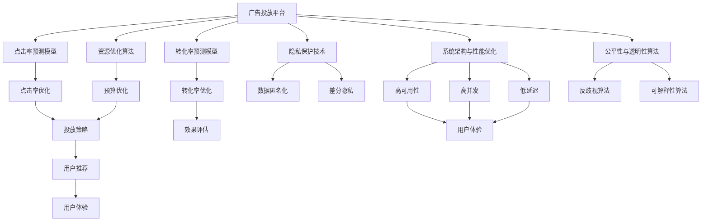
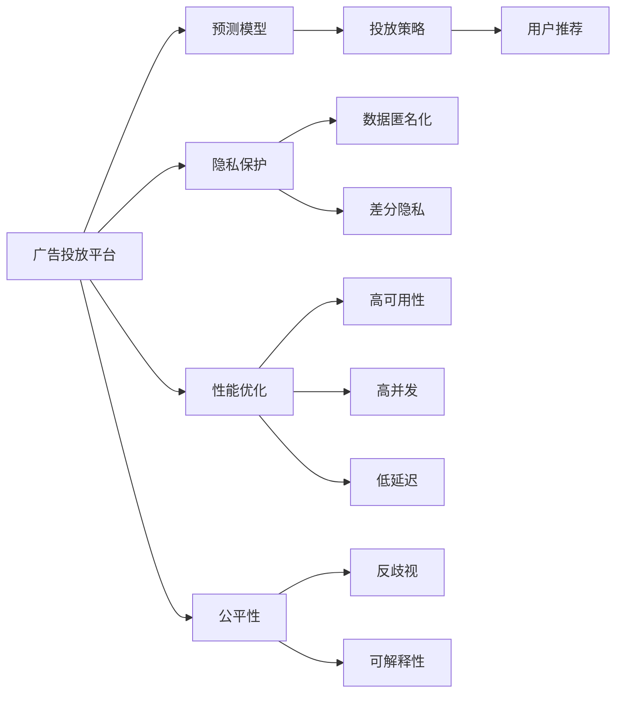
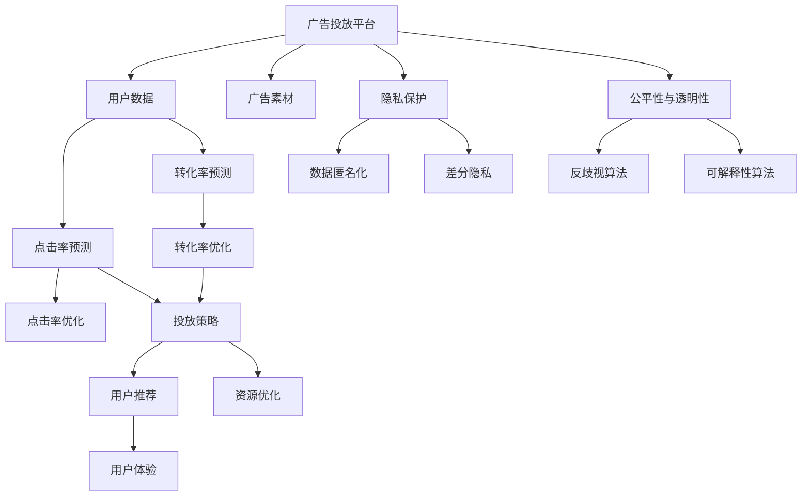
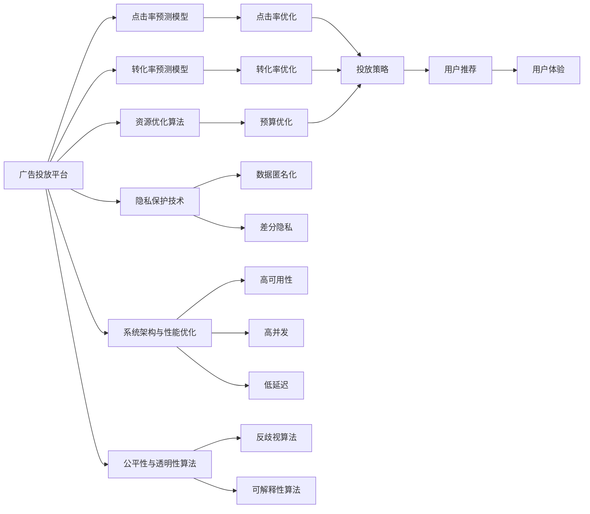

                 

# AI 大模型原理与应用：广告平台的商业模式

> 关键词：大语言模型,广告平台,商业模式,算法,优化,CTR,ROI,点击率,转化率,资源管理,平台优化

## 1. 背景介绍

### 1.1 问题由来

在当前的互联网广告市场中，传统广告投放方式的局限性日益显现。传统广告形式如横幅、文字链、视频广告等，虽然有固定的展示位置，但缺乏与用户互动的能力，广告效果单一。更重要的是，传统的广告投放方式需要耗费大量的资金和资源，且难以精准投放。

为了解决这些问题，广告平台开始探索利用AI技术提升广告投放的精准度和效果。AI广告投放平台利用人工智能技术对用户数据进行分析，预测用户行为，从而实现精准广告投放，提高广告的点击率和转化率。随着AI技术的不断发展，基于深度学习的广告平台开始兴起，这类平台利用深度神经网络模型对广告素材和用户行为进行学习和分析，预测点击率和转化率，以指导广告投放策略。

### 1.2 问题核心关键点

为了有效利用AI技术提升广告投放效果，广告平台需要解决以下几个核心问题：

1. **精准预测广告点击率和转化率**：广告平台需要建立一套预测模型，通过用户数据和广告素材预测广告的点击率和转化率，从而实现精准投放。

2. **优化资源配置**：广告平台需要根据投放效果自动调整广告预算和投放策略，实现资源的高效利用。

3. **提升用户体验**：广告平台需要在不影响用户体验的前提下，提高广告投放效果。

4. **保障数据隐私和安全**：广告平台需要严格保护用户隐私，防止数据泄露和滥用。

5. **增强平台稳定性和鲁棒性**：广告平台需要具备高可用的系统架构和高效的容错能力，以应对大规模流量和高并发场景。

6. **实现算法公平性和透明性**：广告平台需要保证广告投放策略的公平性和透明度，防止任何形式的歧视性广告投放。

### 1.3 问题研究意义

广告平台利用AI技术进行精准投放，可以实现更高的点击率和转化率，减少无效广告的浪费，从而显著提升广告ROI（投资回报率）。此外，AI技术还可以根据用户行为和偏好进行个性化广告推荐，提升用户体验，进一步优化广告效果。因此，基于AI的广告平台商业模式具有显著的市场潜力和经济效益。

然而，广告平台也需要面对技术、业务、伦理等诸多挑战，如如何确保广告投放的公平性和透明性、如何保护用户隐私、如何优化算法以提升投放效果等。广告平台的成功不仅取决于技术的先进性，还需要对商业模式、用户需求、市场环境等多方面因素进行综合考虑和优化。

## 2. 核心概念与联系

### 2.1 核心概念概述

为更好地理解基于AI的广告平台商业模式，本节将介绍几个密切相关的核心概念：

- **广告投放平台**：利用AI技术，通过分析和预测用户行为和广告素材，实现精准广告投放的互联网平台。
- **点击率预测模型**：预测广告点击率的模型，通常使用深度神经网络实现。
- **转化率预测模型**：预测广告转化率的模型，用于评估广告效果和指导投放策略。
- **资源优化算法**：根据投放效果自动调整广告预算和投放策略的算法，提升资源利用率。
- **用户体验优化**：通过个性化广告推荐和投放策略优化，提升用户体验，减少对用户正常浏览的干扰。
- **隐私保护技术**：保护用户隐私的技术，如数据匿名化、差分隐私等。
- **系统架构与性能优化**：高可用、高并发、低延迟的系统架构设计和性能优化方法。
- **公平性与透明性算法**：保证广告投放公平性和透明性的算法，如反歧视算法、可解释性算法等。

这些核心概念之间的逻辑关系可以通过以下Mermaid流程图来展示：



这个流程图展示了大模型在广告平台中的核心概念及其之间的关系：

1. 广告平台利用点击率预测模型和转化率预测模型进行广告效果预测。
2. 资源优化算法根据预测效果自动调整投放策略，实现资源的高效利用。
3. 用户推荐系统根据用户行为进行个性化广告推荐，提升用户体验。
4. 隐私保护技术保护用户数据，防止数据泄露和滥用。
5. 系统架构和性能优化确保广告平台的高可用性和稳定性。
6. 公平性与透明性算法保证广告投放的公平性和透明性。

这些核心概念共同构成了广告平台商业模式的基础框架，使其能够实现精准投放、资源优化、用户体验提升等目标。

### 2.2 概念间的关系

这些核心概念之间存在着紧密的联系，形成了广告平台商业模式的完整生态系统。下面我通过几个Mermaid流程图来展示这些概念之间的关系。

#### 2.2.1 广告平台的基础架构



这个流程图展示了广告平台的基础架构及其组件间的相互关系：

1. 广告平台利用预测模型进行投放效果预测。
2. 预测结果指导投放策略，优化资源配置。
3. 用户推荐系统提升用户体验。
4. 隐私保护技术保护用户数据安全。
5. 系统架构优化确保高可用性和高并发。
6. 公平性算法保障投放策略的公平性和透明性。

#### 2.2.2 广告平台的核心算法流程



这个流程图展示了广告平台的核心算法流程及其相互关系：

1. 用户数据和广告素材输入到平台。
2. 点击率预测模型和转化率预测模型对广告效果进行预测。
3. 预测结果用于点击率优化和转化率优化。
4. 优化后的预测结果指导投放策略，提升用户体验。
5. 资源优化算法调整资源配置。
6. 隐私保护技术保护用户数据安全。
7. 公平性与透明性算法保证投放策略的公平性和透明性。

#### 2.2.3 广告平台的资源管理



这个流程图展示了广告平台资源管理及其相互关系：

1. 广告平台利用预测模型进行投放效果预测。
2. 预测结果用于点击率优化和转化率优化。
3. 预测结果用于资源优化和预算优化。
4. 优化后的预测结果指导投放策略，提升用户体验。
5. 隐私保护技术保护用户数据安全。
6. 系统架构优化确保高可用性和高并发。
7. 公平性算法保障投放策略的公平性和透明性。

## 3. 核心算法原理 & 具体操作步骤
### 3.1 算法原理概述

基于AI的广告平台商业模式，核心依赖于深度学习模型的预测能力和优化算法的高效资源配置。其核心算法原理主要包括以下几个方面：

1. **深度学习模型**：利用深度神经网络模型对用户行为和广告素材进行学习和分析，预测广告的点击率和转化率。

2. **预测模型训练**：通过大规模标注数据训练预测模型，提高模型对广告投放效果的预测准确性。

3. **投放策略优化**：根据广告投放效果，自动调整投放策略，实现资源的高效利用。

4. **用户推荐系统**：利用个性化推荐算法，提升用户体验，提高广告投放效果。

5. **公平性与透明性算法**：通过反歧视算法和可解释性算法，确保广告投放的公平性和透明性。

### 3.2 算法步骤详解

基于AI的广告平台商业模式，一般包括以下几个关键步骤：

**Step 1: 数据准备**

- 收集用户行为数据（如浏览记录、点击行为等）和广告素材数据（如图片、视频、文本等）。
- 对数据进行预处理，如去噪、归一化、特征工程等。
- 划分训练集、验证集和测试集，确保数据分布的一致性。

**Step 2: 模型选择与训练**

- 选择适合的深度学习模型，如CTR预测模型、召回率优化模型等。
- 在训练集上进行模型训练，使用合适的优化器和损失函数。
- 在验证集上调整模型参数，防止过拟合。
- 在测试集上评估模型效果，确定最佳模型。

**Step 3: 策略优化**

- 根据预测结果，自动调整广告投放策略。
- 对投放效果进行评估，如点击率、转化率、ROI等指标。
- 根据评估结果，调整投放策略和预算分配。

**Step 4: 用户推荐**

- 利用用户行为数据，预测用户对广告的偏好。
- 根据用户偏好进行个性化广告推荐，提升用户体验。
- 定期更新推荐算法，以适应用户行为变化。

**Step 5: 系统优化**

- 对广告平台进行系统架构优化，确保高可用性和高并发性。
- 对广告平台进行性能优化，如缓存、负载均衡、异步处理等。
- 对广告平台进行监控和告警，确保系统稳定运行。

**Step 6: 隐私保护**

- 对用户数据进行匿名化和差分隐私处理，保护用户隐私。
- 严格控制用户数据的访问权限，防止数据泄露。
- 定期审计和评估隐私保护措施的有效性。

### 3.3 算法优缺点

基于AI的广告平台商业模式，具有以下优点：

1. **精准投放**：利用深度学习模型进行广告效果预测，实现精准广告投放。
2. **高效资源利用**：通过优化算法自动调整资源配置，实现高效利用。
3. **提升用户体验**：利用个性化推荐系统，提升用户体验。
4. **广告效果显著**：通过预测模型优化投放策略，提升广告ROI。
5. **技术先进性**：利用深度学习和大数据技术，提升广告投放效果。

然而，该方法也存在以下缺点：

1. **数据依赖性强**：广告平台的预测效果依赖于高质量的标注数据，数据获取成本较高。
2. **算法复杂度高**：深度学习模型和优化算法的训练和调优难度较大，需要大量计算资源。
3. **公平性问题**：广告投放策略可能存在歧视性，需要设计公平性算法进行优化。
4. **隐私风险**：用户数据的隐私保护需要严格管控，防止数据泄露和滥用。
5. **系统稳定性**：高并发和高流量的场景下，系统需要具备高可用的架构和容错机制。

### 3.4 算法应用领域

基于AI的广告平台商业模式，主要应用于以下领域：

1. **互联网广告投放**：互联网广告平台，如百度、Google、腾讯等，利用AI技术进行精准投放。
2. **电商广告投放**：电商平台，如京东、淘宝、亚马逊等，利用AI技术优化广告投放效果。
3. **移动广告投放**：移动广告平台，如微博、抖音、快手等，利用AI技术进行个性化推荐。
4. **视频广告投放**：视频平台，如YouTube、爱奇艺、腾讯视频等，利用AI技术进行精准投放和推荐。
5. **社交媒体广告投放**：社交媒体平台，如微信、Facebook、Twitter等，利用AI技术提升广告效果。

除了上述几个领域，基于AI的广告平台商业模式还广泛应用于各类线上线下广告投放场景中，如户外广告、电视广告、广播广告等。

## 4. 数学模型和公式 & 详细讲解  
### 4.1 数学模型构建

基于AI的广告平台商业模式，主要依赖于深度学习模型进行广告效果预测和投放策略优化。这里以CTR（Click-Through Rate）预测模型为例，介绍广告平台的核心数学模型。

假设用户行为数据为 $X$，广告素材数据为 $Y$，广告效果预测模型为 $f(X, Y; \theta)$，其中 $\theta$ 为模型参数。模型的损失函数为 $L(f(X, Y; \theta))$，用于衡量预测结果与真实结果的差距。

模型的训练目标是最小化损失函数：

$$
\hat{\theta} = \mathop{\arg\min}_{\theta} L(f(X, Y; \theta))
$$

在训练过程中，使用梯度下降算法优化模型参数 $\theta$：

$$
\theta \leftarrow \theta - \eta \nabla_{\theta}L(f(X, Y; \theta))
$$

其中 $\eta$ 为学习率，$\nabla_{\theta}L(f(X, Y; \theta))$ 为损失函数对参数 $\theta$ 的梯度。

### 4.2 公式推导过程

以下我们以CTR预测模型为例，推导损失函数及其梯度的计算公式。

假设模型 $f(X, Y; \theta)$ 的输出为广告点击的概率 $p = f(X, Y; \theta)$，真实标签 $y \in \{0, 1\}$。则CTR预测模型的损失函数定义为：

$$
L(f(X, Y; \theta)) = -\frac{1}{N}\sum_{i=1}^N (y_i \log p_i + (1-y_i) \log (1-p_i))
$$

将其代入经验风险公式，得：

$$
\mathcal{L}(\theta) = -\frac{1}{N}\sum_{i=1}^N [y_i \log f(X_i, Y_i; \theta) + (1-y_i) \log (1-f(X_i, Y_i; \theta))]
$$

根据链式法则，损失函数对参数 $\theta$ 的梯度为：

$$
\frac{\partial \mathcal{L}(\theta)}{\partial \theta} = -\frac{1}{N}\sum_{i=1}^N \left[ \frac{y_i}{f(X_i, Y_i; \theta)} - \frac{1-y_i}{1-f(X_i, Y_i; \theta)} \right] \frac{\partial f(X_i, Y_i; \theta)}{\partial \theta}
$$

其中 $\frac{\partial f(X_i, Y_i; \theta)}{\partial \theta}$ 为模型 $f(X, Y; \theta)$ 对参数 $\theta$ 的梯度，可通过反向传播算法高效计算。

在得到损失函数的梯度后，即可带入参数更新公式，完成模型的迭代优化。重复上述过程直至收敛，最终得到适应广告投放效果的最佳模型参数 $\hat{\theta}$。

## 5. 项目实践：代码实例和详细解释说明
### 5.1 开发环境搭建

在进行广告平台算法开发前，我们需要准备好开发环境。以下是使用Python进行TensorFlow开发的环境配置流程：

1. 安装Anaconda：从官网下载并安装Anaconda，用于创建独立的Python环境。

2. 创建并激活虚拟环境：
```bash
conda create -n tf-env python=3.8 
conda activate tf-env
```

3. 安装TensorFlow：根据CUDA版本，从官网获取对应的安装命令。例如：
```bash
conda install tensorflow tensorflow-cpu=cuda101 tensorflow-gpu=cuda101 -c conda-forge
```

4. 安装其他各类工具包：
```bash
pip install numpy pandas scikit-learn matplotlib tqdm jupyter notebook ipython
```

完成上述步骤后，即可在`tf-env`环境中开始广告平台算法的开发。

### 5.2 源代码详细实现

这里我们以一个简单的CTR预测模型为例，使用TensorFlow实现广告平台的核心算法。

首先，定义CTR预测模型的输入和输出：

```python
import tensorflow as tf

# 定义CTR预测模型的输入和输出
input_size = 20
num_classes = 1
output_size = input_size
model = tf.keras.Sequential([
    tf.keras.layers.Dense(units=64, activation='relu', input_shape=(input_size,)),
    tf.keras.layers.Dense(units=num_classes, activation='sigmoid')
])
```

接着，定义模型训练的优化器和损失函数：

```python
# 定义优化器和损失函数
optimizer = tf.keras.optimizers.Adam(learning_rate=0.001)
loss_fn = tf.keras.losses.BinaryCrossentropy()
```

然后，定义模型训练的训练集和验证集：

```python
# 定义训练集和验证集
train_data = ... # 这里假设已经生成了训练集
val_data = ... # 这里假设已经生成了验证集
```

最后，进行模型训练和评估：

```python
# 定义训练循环
def train(model, optimizer, loss_fn, train_data, val_data, epochs=10, batch_size=64):
    for epoch in range(epochs):
        for i, (x, y) in enumerate(train_data):
            with tf.GradientTape() as tape:
                predictions = model(x)
                loss = loss_fn(y, predictions)
            gradients = tape.gradient(loss, model.trainable_variables)
            optimizer.apply_gradients(zip(gradients, model.trainable_variables))
            if i % 100 == 0:
                val_loss, val_predictions = model.predict(val_data)
                print(f"Epoch {epoch+1}/{epochs}, Step {i}, Train Loss: {loss:.4f}, Val Loss: {val_loss:.4f}")
```

运行上述代码，即可在TensorFlow环境中进行广告平台核心算法的开发。

### 5.3 代码解读与分析

让我们再详细解读一下关键代码的实现细节：

**CTR预测模型定义**：
- `input_size` 和 `num_classes` 分别为输入和输出的维度，这里假设输入特征有20个，输出为二分类（点击与否）。
- `Sequential` 表示一个线性堆叠的神经网络，这里定义了一个包含两个全连接层的神经网络。

**优化器和损失函数定义**：
- `Adam` 优化器使用自适应学习率，训练效果稳定。
- `BinaryCrossentropy` 损失函数适用于二分类问题，如广告点击预测。

**数据集定义**：
- 训练集和验证集需通过预处理生成，如特征工程、数据清洗等。
- 数据集以张量形式输入，方便TensorFlow进行高效计算。

**模型训练和评估**：
- 训练循环通过迭代更新模型参数，最小化损失函数。
- 每100个batch输出一次训练和验证集上的损失，监控训练效果。

**运行结果展示**：
- 在运行上述代码后，可以看到训练集和验证集上的损失值变化，评估模型的训练效果。

以上就是使用TensorFlow进行广告平台核心算法开发的完整代码实现。可以看到，TensorFlow提供了强大的深度学习框架，使得广告平台算法的开发变得简单高效。

当然，工业级的系统实现还需考虑更多因素，如模型的保存和部署、超参数的自动搜索、多任务优化等。但核心的广告平台算法基本与此类似。

## 6. 实际应用场景
### 6.1 智能广告投放系统

基于AI的广告平台商业模式，可以广泛应用于智能广告投放系统的构建。传统广告投放系统需要耗费大量人力进行广告创意设计和投放策略优化，效率低、效果差。而使用智能广告投放系统，可以7x24小时不间断服务，快速响应广告主需求，实现精准广告投放。

在技术实现上，可以收集广告主的历史投放数据和用户行为数据，利用深度学习模型预测广告效果，自动调整投放策略。智能广告投放系统还可以接入广告主的产品和内容，实时生成广告素材，动态调整投放策略，优化广告效果。如此构建的智能广告投放系统，能大幅提升广告主的广告投放效果，节省人力和资源。

### 6.2 广告效果评估与优化

广告平台可以基于AI技术进行广告效果评估与优化，提升广告主的投资回报率。广告效果评估主要包括以下几个方面：

1. **点击率预测**：利用深度学习模型预测广告点击率，衡量广告的吸引力。
2. **转化率预测**：利用深度学习模型预测广告转化率，衡量广告的效果。
3. **ROI计算**：根据广告投放效果计算投资回报率，评估广告投放的效益。
4. **A/B测试**：通过对比不同广告策略的效果，优化广告投放策略。
5. **用户行为分析**：利用深度学习模型分析用户行为，发现潜在广告机会。

广告平台通过实时监控和评估广告效果，自动调整广告策略，优化广告投放效果，帮助广告主实现更高的投资回报率。

### 6.3 广告推荐系统

广告平台可以利用AI技术进行广告推荐，提升用户体验，提高广告效果。广告推荐主要包括以下几个方面：

1. **个性化推荐**：根据用户行为和兴趣，推荐个性化的广告内容，提升用户体验。
2. **广告排序**：根据广告效果和用户行为，自动调整广告排序，优化广告效果。
3. **实时推荐**：利用深度学习模型实时生成推荐广告，提升广告点击率。
4. **多渠道推荐**：将广告推荐到多个渠道，如移动端、PC端、社交媒体等，提升广告曝光率。

广告平台通过个性化推荐和实时推荐，提升用户对广告的兴趣和点击率，优化广告效果，提高广告主的投资回报率。

### 6.4 未来应用展望

随着AI技术的不断发展，基于AI的广告平台商业模式将呈现以下几个发展趋势：

1. **个性化推荐提升**：利用深度学习模型进行用户行为分析和个性化推荐，提升广告效果。
2. **实时投放优化**：利用深度学习模型实时优化广告投放策略，提高广告主的投资回报率。
3. **多渠道投放**：将广告投放到多个渠道，提升广告曝光率和点击率。
4. **数据驱动决策**：利用深度学习模型进行数据分析，指导广告投放策略的调整。
5. **隐私保护加强**：利用差分隐私等技术保护用户隐私，防止数据泄露和滥用。
6. **公平性算法优化**：设计公平性算法，保证广告投放的公平性和透明性。

未来，广告平台将更加注重技术创新和用户体验提升，利用AI技术实现广告投放的精准化和智能化，助力广告主实现更高的投资回报率。

## 7. 工具和资源推荐
### 7.1 学习资源推荐

为了帮助开发者系统掌握广告平台算法的基础知识和实践技巧，这里推荐一些优质的学习资源：

1. 《TensorFlow官方文档》：TensorFlow的官方文档，提供了丰富的API和教程，帮助开发者快速上手。

2. 《深度学习实战》书籍：由深度学习专家撰写，详细介绍了深度学习模型和优化算法的实现方法和应用场景。

3. 《广告优化与数据分析》课程：由广告行业专家授课，涵盖广告投放、效果评估、用户行为分析等广告平台的核心知识。

4. 《AI广告优化实战》文章：通过真实案例分析，介绍广告平台算法的实际应用和优化策略。

5. Kaggle广告投放竞赛：通过参与Kaggle广告投放竞赛，实践广告平台算法的开发和优化。

通过对这些资源的学习实践，相信你一定能够快速掌握广告平台算法的精髓，并用于解决实际的广告投放问题。

### 7.2 开发工具推荐

高效的开发离不开优秀的工具支持。以下是几款用于广告平台算法开发的常用工具：

1. TensorFlow：由Google主导开发的深度学习框架，生产部署方便，适合大规模工程应用。

2. PyTorch：基于Python的开源深度学习框架，灵活动态的计算图，适合快速迭代研究。

3. Weights & Biases：模型训练的实验跟踪工具

