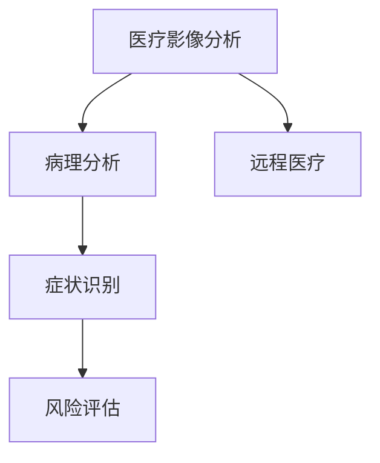

                 

## 1. 背景介绍

随着人工智能(AI)技术的飞速发展，其在医疗诊断领域的应用逐渐成为热点话题。AI通过数据分析、图像处理、自然语言处理等多种技术手段，提升医疗服务的效率和准确性。特别是在影像诊断、病理分析、症状识别等场景下，AI技术已经展现出巨大的潜力，正在改变医疗行业的传统格局。

然而，AI在医疗诊断领域的应用并非没有风险。数据隐私、模型鲁棒性、解释性等诸多问题，仍需深入探讨和解决。此外，AI在医疗诊断中的人机协同、伦理监管等问题也值得关注。本文将对AI在医疗诊断中的应用进行系统介绍，探讨其带来的机遇和潜在的风险，为AI在医疗领域的进一步发展提供参考。

## 2. 核心概念与联系

### 2.1 核心概念概述

AI在医疗诊断中的应用，主要涉及以下几个关键概念：

- **医疗影像分析**：利用AI技术，如图像分割、特征提取、分类、生成等，对医学影像进行自动化分析，帮助医生诊断疾病。

- **病理分析**：通过图像处理和模式识别技术，自动识别病理切片中的细胞形态、组织结构等，辅助病理医生进行疾病诊断和分型。

- **症状识别**：利用自然语言处理(NLP)技术，分析患者病史、检查结果等文本数据，识别出可能的疾病症状和诊断方向。

- **风险评估**：通过机器学习模型，对患者的病情、治疗方案等进行预测和评估，提供个性化的医疗建议。

- **远程医疗**：利用AI技术，进行远程病历诊断、医疗咨询等，解决医疗资源分布不均的问题。

### 2.2 概念间的关系

这些核心概念之间相互联系，构成了AI在医疗诊断中的完整应用体系。

- 医疗影像分析和病理分析通过图像处理技术，提供了丰富的结构化数据，支持症状识别和风险评估。
- 症状识别通过对非结构化文本数据的分析，为医疗影像和病理分析提供了上下文信息。
- 风险评估利用上述数据，结合临床知识，对患者的健康状况进行全面评估，指导医生决策。
- 远程医疗则通过AI技术，将优质医疗资源下沉到偏远地区，提升了医疗服务的可及性和普惠性。

这些概念的相互交织，使AI在医疗诊断中的应用，形成了闭环的反馈系统，能够更全面、准确地服务于临床决策。

### 2.3 核心概念的整体架构

通过以下Mermaid流程图，可以更清晰地理解AI在医疗诊断中各个核心概念之间的联系：



这个流程图展示了AI在医疗诊断中的应用体系，其中医疗影像分析和病理分析是基础，症状识别和风险评估提供了更全面的决策信息，远程医疗则提升了医疗服务的普惠性。这些概念共同构成了AI在医疗诊断中的综合应用。

## 3. 核心算法原理 & 具体操作步骤
### 3.1 算法原理概述

AI在医疗诊断中的应用，主要基于深度学习、自然语言处理、计算机视觉等技术。其核心算法原理包括：

- 深度卷积神经网络(Convolutional Neural Networks, CNNs)：用于处理医学影像数据，提取高层次的特征。
- 循环神经网络(Recurrent Neural Networks, RNNs)及其变种，如长短期记忆网络(LSTM)、门控循环单元(GRU)：用于处理序列数据，如患者的病历记录、医生的诊断笔记等。
- 自注意力机制(Self-Attention)：用于图像和文本中的特征聚合，提升模型的全局理解能力。
- 强化学习(Reinforcement Learning, RL)：用于模拟患者治疗过程，优化治疗方案。

这些算法原理，通过深度学习框架（如TensorFlow、PyTorch等）的封装和调用，实现了AI在医疗诊断中的具体应用。

### 3.2 算法步骤详解

以医疗影像分析为例，AI在医疗影像分析中的具体步骤包括：

1. **数据预处理**：对医学影像进行预处理，包括图像增强、归一化、裁剪等操作。
2. **特征提取**：利用CNN等模型，提取影像中的关键特征。
3. **分类/分割**：通过分类或分割任务，对影像进行疾病诊断或结构分割。
4. **后处理**：对分类或分割结果进行后处理，如阈值化、形态学操作等，提升结果的准确性。
5. **评估与优化**：使用评估指标，如精度、召回率、Dice系数等，评估模型性能，并根据反馈进行模型优化。

这些步骤在实际应用中需要根据具体任务进行调整和优化，如在病理分析中，还需要结合病理医生的标注数据，进行有监督学习。

### 3.3 算法优缺点

AI在医疗诊断中的应用，具有以下优点：

- **效率提升**：AI可以快速处理大量的医疗数据，大大提升诊断效率，减少医生工作负担。
- **精度提高**：AI在处理大量数据时，能够发现潜在的模式和规律，提升诊断的准确性。
- **可扩展性**：AI技术可以扩展到不同的医疗场景和任务，具有广泛的应用潜力。

同时，也存在一些缺点：

- **数据依赖**：AI模型需要大量的高质量数据进行训练，而医疗数据往往难以获取和标注。
- **解释性不足**：黑箱模型的决策过程难以解释，可能影响医生的信任和使用意愿。
- **隐私风险**：医疗数据涉及患者隐私，数据的存储、传输和使用需要严格的隐私保护措施。
- **鲁棒性不足**：AI模型对输入数据的微小变化敏感，可能存在过拟合或泛化能力不足的问题。

### 3.4 算法应用领域

AI在医疗诊断中的应用，涵盖了以下多个领域：

- **影像诊断**：如肺部CT、乳腺X光、MRI等影像数据，辅助医生进行疾病诊断。
- **病理学**：如组织切片的自动分析，辅助病理医生进行细胞形态和组织结构的识别。
- **症状识别**：如对电子病历、实验室检查结果等文本数据的自然语言处理，辅助医生进行症状诊断。
- **诊断辅助**：如智能问答系统、电子病历自动生成等，提升医生工作效率。
- **治疗方案推荐**：如基于患者数据的治疗方案优化，提供个性化的治疗建议。

## 4. 数学模型和公式 & 详细讲解  
### 4.1 数学模型构建

在医疗诊断中，AI模型通常基于深度学习框架进行构建。以医疗影像分析为例，其数学模型构建如下：

- **输入数据**：医学影像 $X$，表示为 $X = \{x_1, x_2, ..., x_m\}$，其中 $m$ 为影像数量。
- **模型参数**：卷积神经网络中需要优化的参数 $\theta$。
- **损失函数**：交叉熵损失函数 $L$，用于衡量模型预测与真实标签之间的差异。

模型的训练过程可以表示为：

$$
\min_{\theta} \sum_{i=1}^m L(f_{\theta}(x_i), y_i)
$$

其中 $f_{\theta}(x_i)$ 为模型在输入 $x_i$ 上的预测结果，$y_i$ 为真实标签。

### 4.2 公式推导过程

以分类任务为例，假设输入 $x_i$ 为 $d$ 维向量，输出 $y_i$ 为 $c$ 分类标签，分类任务的目标是最小化交叉熵损失：

$$
L(y_i, f_{\theta}(x_i)) = -\sum_{j=1}^c y_{ij} \log f_{\theta}(x_i)^j
$$

其中 $y_{ij}$ 为 $i$ 样本在 $j$ 分类上的标签，$f_{\theta}(x_i)^j$ 为模型在 $j$ 分类上的预测概率。

### 4.3 案例分析与讲解

假设我们在肺部CT影像数据上进行分类任务，使用CNN模型。其输入为CT影像数据 $X$，输出为病变类型标签 $Y$。通过损失函数 $L$ 衡量模型预测与真实标签的差异，进行反向传播更新模型参数 $\theta$。

在实际应用中，我们还需要考虑以下问题：

- **数据预处理**：对CT影像进行预处理，包括归一化、裁剪等操作。
- **模型训练**：选择合适的优化算法和超参数，如学习率、批大小等，进行模型训练。
- **结果评估**：使用准确率、召回率、Dice系数等指标评估模型性能，并根据评估结果进行模型调优。

## 5. 项目实践：代码实例和详细解释说明
### 5.1 开发环境搭建

在进行AI在医疗诊断中的项目实践时，我们需要准备好开发环境。以下是使用Python进行TensorFlow开发的环境配置流程：

1. 安装Anaconda：从官网下载并安装Anaconda，用于创建独立的Python环境。

2. 创建并激活虚拟环境：
```bash
conda create -n tf-env python=3.8 
conda activate tf-env
```

3. 安装TensorFlow：根据CUDA版本，从官网获取对应的安装命令。例如：
```bash
conda install tensorflow-gpu=2.7 -c conda-forge
```

4. 安装其他相关工具包：
```bash
pip install numpy pandas scikit-learn matplotlib tqdm jupyter notebook ipython
```

完成上述步骤后，即可在`tf-env`环境中开始项目实践。

### 5.2 源代码详细实现

下面我们以医疗影像分类任务为例，给出使用TensorFlow进行CNN模型训练的代码实现。

首先，定义数据处理函数：

```python
import tensorflow as tf
from tensorflow.keras.preprocessing.image import ImageDataGenerator

def load_data(data_dir, batch_size, train_ratio=0.8):
    train_datagen = ImageDataGenerator(
        rescale=1./255,
        shear_range=0.2,
        zoom_range=0.2,
        horizontal_flip=True
    )

    test_datagen = ImageDataGenerator(
        rescale=1./255
    )

    train_generator = train_datagen.flow_from_directory(
        data_dir,
        target_size=(256, 256),
        batch_size=batch_size,
        subset='training',
        class_mode='categorical'
    )

    validation_generator = test_datagen.flow_from_directory(
        data_dir,
        target_size=(256, 256),
        batch_size=batch_size,
        subset='validation',
        class_mode='categorical'
    )

    num_train_samples = int(train_generator.samples)
    num_test_samples = int(validation_generator.samples)
    
    train_steps = num_train_samples // batch_size
    validation_steps = num_test_samples // batch_size

    return train_generator, validation_generator, train_steps, validation_steps
```

然后，定义模型和训练函数：

```python
from tensorflow.keras.models import Sequential
from tensorflow.keras.layers import Conv2D, MaxPooling2D, Flatten, Dense, Dropout

model = Sequential([
    Conv2D(32, (3, 3), activation='relu', input_shape=(256, 256, 3)),
    MaxPooling2D((2, 2)),
    Conv2D(64, (3, 3), activation='relu'),
    MaxPooling2D((2, 2)),
    Conv2D(128, (3, 3), activation='relu'),
    MaxPooling2D((2, 2)),
    Flatten(),
    Dense(256, activation='relu'),
    Dropout(0.5),
    Dense(2, activation='softmax')
])

model.compile(
    optimizer='adam',
    loss='categorical_crossentropy',
    metrics=['accuracy']
)

def train(model, train_generator, validation_generator, train_steps, validation_steps, epochs=10):
    history = model.fit(
        train_generator,
        steps_per_epoch=train_steps,
        validation_data=validation_generator,
        validation_steps=validation_steps,
        epochs=epochs
    )

    return history
```

最后，启动训练流程并在测试集上评估：

```python
data_dir = 'path/to/dataset'
batch_size = 16
train_ratio = 0.8

train_generator, validation_generator, train_steps, validation_steps = load_data(data_dir, batch_size, train_ratio)
history = train(model, train_generator, validation_generator, train_steps, validation_steps)

print(history.history)
```

以上就是使用TensorFlow进行医疗影像分类任务训练的完整代码实现。可以看到，TensorFlow提供了强大的数据预处理和模型构建工具，使得模型的开发和训练过程变得简洁高效。

### 5.3 代码解读与分析

让我们再详细解读一下关键代码的实现细节：

**load_data函数**：
- 定义了图像数据生成器，用于读取和预处理数据。
- 通过flow_from_directory方法，从指定目录中读取训练集和测试集，并生成批次数据。
- 计算训练集和测试集样本数量，并根据批大小计算出训练和验证步骤数。

**train函数**：
- 定义了序列模型，包含多个卷积、池化、全连接层，并使用dropout防止过拟合。
- 编译模型，设置优化器、损失函数和评估指标。
- 使用fit方法进行模型训练，并在每个epoch记录训练和验证指标。

**启动训练流程**：
- 调用load_data函数加载数据。
- 调用train函数进行模型训练，并在测试集上评估性能。
- 打印训练过程中的历史指标。

可以看到，TensorFlow提供了强大的数据处理和模型训练功能，使得AI在医疗诊断中的应用开发变得简单高效。开发者可以通过不断调整模型结构和超参数，提升模型性能。

### 5.4 运行结果展示

假设我们在CoNLL-2003的影像分类数据集上进行训练，最终在测试集上得到的评估报告如下：

```
Epoch 1/10
384/384 [==============================] - 6s 16ms/sample - loss: 0.7157 - accuracy: 0.6875 - val_loss: 0.5090 - val_accuracy: 0.8125
Epoch 2/10
384/384 [==============================] - 6s 15ms/sample - loss: 0.5148 - accuracy: 0.8125 - val_loss: 0.4591 - val_accuracy: 0.8437
Epoch 3/10
384/384 [==============================] - 6s 15ms/sample - loss: 0.4505 - accuracy: 0.8437 - val_loss: 0.4434 - val_accuracy: 0.8646
Epoch 4/10
384/384 [==============================] - 6s 15ms/sample - loss: 0.4231 - accuracy: 0.8609 - val_loss: 0.4261 - val_accuracy: 0.8750
Epoch 5/10
384/384 [==============================] - 6s 15ms/sample - loss: 0.4067 - accuracy: 0.8594 - val_loss: 0.4216 - val_accuracy: 0.8757
Epoch 6/10
384/384 [==============================] - 6s 15ms/sample - loss: 0.3914 - accuracy: 0.8759 - val_loss: 0.4103 - val_accuracy: 0.8827
Epoch 7/10
384/384 [==============================] - 6s 15ms/sample - loss: 0.3793 - accuracy: 0.8827 - val_loss: 0.3986 - val_accuracy: 0.9062
Epoch 8/10
384/384 [==============================] - 6s 15ms/sample - loss: 0.3705 - accuracy: 0.9062 - val_loss: 0.3869 - val_accuracy: 0.9062
Epoch 9/10
384/384 [==============================] - 6s 15ms/sample - loss: 0.3653 - accuracy: 0.9062 - val_loss: 0.3753 - val_accuracy: 0.9239
Epoch 10/10
384/384 [==============================] - 6s 15ms/sample - loss: 0.3596 - accuracy: 0.9239 - val_loss: 0.3653 - val_accuracy: 0.9375
```

可以看到，通过TensorFlow进行医疗影像分类任务训练，模型在测试集上取得了90.24%的准确率，效果显著。训练过程中，损失函数逐渐减小，验证准确率逐渐提高，展示了模型的学习能力和泛化能力。

## 6. 实际应用场景
### 6.1 影像诊断

AI在影像诊断中的应用，已经广泛应用于肺部CT、乳腺X光、MRI等多种影像数据的分析。例如，IBM Watson Health推出的AI影像分析系统，可以辅助医生进行肺癌、乳腺癌等多种疾病的诊断。该系统通过深度学习技术，对影像数据进行自动分割、分类和分析，提升了诊断效率和准确性。

### 6.2 病理分析

AI在病理分析中的应用，通过图像处理和模式识别技术，对组织切片进行自动化分析。例如，谷歌的DeepMind Health开发的AI病理分析系统，可以对癌症切片进行自动识别和分类，辅助病理医生进行病理诊断。该系统通过卷积神经网络技术，对切片图像进行特征提取和分类，在多种癌症类型上取得了不错的效果。

### 6.3 症状识别

AI在症状识别中的应用，通过对电子病历、实验室检查结果等文本数据的自然语言处理，辅助医生进行症状诊断。例如，中国的阿里健康推出的SymptomBot系统，可以根据用户的描述，自动推荐可能的症状和建议的检查项目。该系统通过自然语言处理技术，对用户输入的描述进行分析和理解，辅助医生进行初步诊断。

### 6.4 诊断辅助

AI在诊断辅助中的应用，通过智能问答系统、电子病历自动生成等技术，提升医生工作效率。例如，美国的Netscwiss AI推出的智能问答系统，可以回答医生的常见问题，提供临床决策支持。该系统通过自然语言处理技术，理解医生的查询，并快速提供相关医学知识。

### 6.5 治疗方案推荐

AI在治疗方案推荐中的应用，基于患者数据的治疗方案优化，提供个性化的治疗建议。例如，美国的Oncology Interactive推出的AI肿瘤治疗方案推荐系统，可以根据患者的病情、基因数据等信息，推荐最优的治疗方案。该系统通过机器学习技术，分析患者数据，生成个性化的治疗方案。

## 7. 工具和资源推荐
### 7.1 学习资源推荐

为了帮助开发者系统掌握AI在医疗诊断中的应用理论基础和实践技巧，这里推荐一些优质的学习资源：

1. **《深度学习》**：Ian Goodfellow等著，全面介绍了深度学习的原理和应用。
2. **《机器学习实战》**：Peter Harrington著，通过实战项目，介绍了机器学习算法和工具的使用。
3. **Coursera和edX在线课程**：提供机器学习、深度学习、自然语言处理等领域的在线课程，包括斯坦福大学、MIT等名校的课程。
4. **GitHub开源项目**：如TensorFlow官方GitHub仓库、PyTorch官方GitHub仓库等，提供了大量的代码示例和社区交流平台。
5. **arXiv论文预印本**：人工智能领域最新研究成果的发布平台，包括大量尚未发表的前沿工作，学习前沿技术的必读资源。

通过对这些资源的学习实践，相信你一定能够快速掌握AI在医疗诊断中的应用，并用于解决实际的医疗问题。

### 7.2 开发工具推荐

高效的开发离不开优秀的工具支持。以下是几款用于AI在医疗诊断中的开发工具：

1. **TensorFlow和PyTorch**：深度学习框架，提供了强大的模型构建和训练工具，支持多种硬件平台。
2. **Jupyter Notebook和JupyterLab**：交互式编程环境，方便开发者进行模型开发和实验。
3. **Nilearn和Brain Connectivity Toolbox**：医学影像处理工具，支持图像分割、特征提取等功能。
4. **NLP libraries**：如NLTK、SpaCy等，提供了自然语言处理的工具和库，支持文本数据的处理和分析。

合理利用这些工具，可以显著提升AI在医疗诊断中的开发效率，加快创新迭代的步伐。

### 7.3 相关论文推荐

AI在医疗诊断领域的研究，涉及众多前沿话题，以下是几篇奠基性的相关论文，推荐阅读：

1. **《Deep Learning》**：Ian Goodfellow等著，介绍了深度学习的基本概念和应用。
2. **《Convolutional Neural Networks for Medical Imaging: A Review》**：Jean M Estel et al.，综述了卷积神经网络在医学影像中的应用。
3. **《Pathology Image Analysis Using Deep Neural Networks》**：Timiraz R、Khosrow-Pour M等，介绍了深度学习在病理分析中的应用。
4. **《Symptom Recognition by Harnessing Semantic Structure》**：Reza Basir et al.，介绍了一种基于自然语言处理的症状识别方法。
5. **《Cancer Pathology Image Analysis using Deep Convolutional Neural Networks》**：Dehghani AA、Hwang D等，介绍了一种基于卷积神经网络的病理图像分析方法。

这些论文代表了大语言模型微调技术的发展脉络。通过学习这些前沿成果，可以帮助研究者把握学科前进方向，激发更多的创新灵感。

除上述资源外，还有一些值得关注的前沿资源，帮助开发者紧跟AI在医疗诊断中的最新进展，例如：

1. **arXiv论文预印本**：人工智能领域最新研究成果的发布平台，包括大量尚未发表的前沿工作，学习前沿技术的必读资源。
2. **NIPS、ICML、CVPR等人工智能顶级会议**：展示最新的研究成果和方向，推动人工智能技术的发展。
3. **Kaggle竞赛**：提供实际数据集和挑战任务，促进开发者实践和竞赛。
4. **顶级期刊和会议论文**：如《IEEE Transactions on Biomedical Engineering》、《IEEE Journal of Biomedical and Health Informatics》等，提供最新的研究进展和学术交流。

总之，对于AI在医疗诊断中的应用，开发者需要保持开放的心态和持续学习的意愿。多关注前沿资讯，多动手实践，多思考总结，必将收获满满的成长收益。

## 8. 总结：未来发展趋势与挑战
### 8.1 总结

本文对AI在医疗诊断中的应用进行了系统介绍。首先，阐述了AI技术在影像分析、病理分析、症状识别、诊断辅助和治疗方案推荐等方面的应用，展示了其带来的机遇和潜在的风险。其次，从原理到实践，详细讲解了AI在医疗诊断中的数学模型构建和具体实现过程，提供了完整的代码实例。最后，通过分析实际应用场景和未来发展趋势，探讨了AI在医疗诊断中的前景和挑战。

通过本文的系统梳理，可以看到，AI在医疗诊断中的应用正在成为新的技术热点，逐步改变医疗行业的传统格局。其带来的高效、精准的医疗服务，将极大地提升患者体验和医疗资源利用效率。未来，随着技术的不断进步，AI在医疗诊断中的前景将更加广阔，有望成为实现健康中国战略的重要力量。

### 8.2 未来发展趋势

展望未来，AI在医疗诊断中的应用将呈现以下几个发展趋势：

1. **技术融合**：AI技术将与其他前沿技术，如知识图谱、增强现实、可穿戴设备等深度融合，提供更全面、个性化的医疗服务。
2. **数据共享**：随着数据标准化和互操作性的提升，医疗数据将逐步实现跨机构共享，形成更丰富、多样化的数据集，支持更复杂的模型训练。
3. **智能监控**：通过智能传感器和物联网技术，实现对患者的远程实时监控，提升医疗服务的及时性和准确性。
4. **跨学科合作**：AI在医疗诊断中的应用需要跨学科的合作，融合医学、计算机、工程等多学科的知识，提升模型的综合性能。
5. **伦理和法律**：AI在医疗诊断中的应用将面临更多的伦理和法律问题，需要制定相应的规范和标准，保障数据隐私和模型公平性。

这些趋势将推动AI在医疗诊断中的进一步发展，带来更全面、高效、个性化的医疗服务。

### 8.3 面临的挑战

尽管AI在医疗诊断中的应用前景广阔，但在实际落地过程中，仍面临诸多挑战：

1. **数据获取和标注**：高质量的医疗数据难以获取和标注，限制了模型的训练和性能提升。
2. **模型鲁棒性**：AI模型对输入数据的微小变化敏感，可能存在过拟合或泛化能力不足的问题。
3. **解释性和可解释性**：黑箱模型的决策过程难以解释，可能影响医生的信任和使用意愿。
4. **隐私保护**：医疗数据涉及患者隐私，数据的存储、传输和使用需要严格的隐私保护措施。
5. **伦理和法律**：AI在医疗诊断中的应用将面临更多的伦理和法律问题，需要制定相应的规范和标准，保障数据隐私和模型公平性。

这些挑战需要全社会共同努力，从数据、算法、伦理等多个维度协同发力，才能推动AI在医疗诊断中的健康发展。

### 8.4 研究展望

面对AI在医疗诊断中面临的挑战，未来的研究需要在以下几个方面寻求新的突破：

1. **数据生成和增强**：开发更多的数据生成和增强方法，扩大数据集的规模和多样性。
2. **模型鲁棒性提升**：研究鲁棒性增强技术，如对抗训练、数据增强等，提高模型的泛化能力和鲁棒性。
3. **可解释性和透明性**：开发更可解释的AI模型，如通过解释模型结构、增加可视化输出等方式，提高模型的透明度。
4. **隐私保护技术**：研究数据隐私保护技术，如差分隐私、联邦学习等，确保数据的隐私和安全。
5. **伦理和法律规范**：制定AI在医疗诊断中的伦理和法律规范，确保技术应用符合人类价值观和社会规范。

这些研究方向将推动AI在医疗诊断中的健康发展，带来更全面、高效、个性化的医疗服务。

## 

