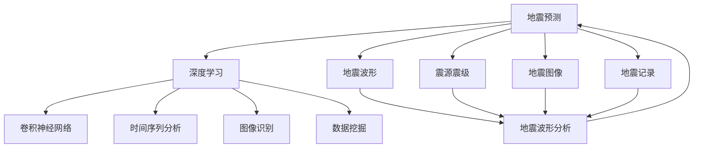

                 

# AI在地震预测中的应用:减少自然灾害影响

> 关键词：地震预测, 人工智能, 自然灾害, 机器学习, 深度学习, 卷积神经网络, 时间序列分析, 图像识别, 数据挖掘, 算法优化

## 1. 背景介绍

### 1.1 问题由来
地震是一种极为破坏性的自然灾害，能够对人类生命财产造成巨大损失。全球每年都有数十万起地震发生，其中相当一部分都具有破坏力。因此，准确预测地震的发生并采取预防措施，对于减少地震造成的损害至关重要。

### 1.2 问题核心关键点
地震预测的关键在于构建一个能够准确预测地震发生时间、地点和强度的模型。虽然地震预测是一个极为复杂的问题，但近年来，人工智能（AI）技术，特别是深度学习和机器学习技术，为地震预测带来了新的希望。

## 2. 核心概念与联系

### 2.1 核心概念概述

为更好地理解AI在地震预测中的应用，本节将介绍几个密切相关的核心概念：

- **地震预测**：预测地震发生的时间、地点和强度。这是AI在地震预测中最重要的应用场景。
- **深度学习**：一种基于神经网络的机器学习方法，能够从大量数据中学习并提取复杂特征。
- **卷积神经网络（CNN）**：深度学习中最常用的网络结构之一，适用于处理空间数据，如图像和视频。
- **时间序列分析**：用于分析随时间变化的数据序列，如地震波形和气象数据。
- **图像识别**：一种用于识别和分类图像的深度学习技术，适用于地震图像数据的分析。
- **数据挖掘**：从大量数据中挖掘出有用的信息，如图震源震级、地震波形等。

这些核心概念之间的联系可以通过以下Mermaid流程图来展示：



这个流程图展示了大语言模型微调过程中各个核心概念之间的关系：

1. 地震预测任务的数据包括地震波形、震源震级、地震图像等。
2. 深度学习技术可以处理这些数据，并从中学习到地震的特征。
3. 卷积神经网络适用于地震波形和图像数据的分析。
4. 时间序列分析用于处理地震波形数据。
5. 图像识别技术可用于分析地震图像数据。
6. 数据挖掘技术可用于从地震数据中提取有用信息。

## 3. 核心算法原理 & 具体操作步骤
### 3.1 算法原理概述

基于深度学习的地震预测模型，一般可以分为以下几个步骤：

1. **数据预处理**：收集和清洗地震相关的数据，包括地震波形、震源震级、地震图像等。
2. **特征提取**：利用深度学习技术从数据中提取地震的特征。
3. **模型训练**：使用标注数据对深度学习模型进行训练，使其能够预测地震的发生。
4. **模型评估**：评估训练好的模型在未标注数据上的表现。
5. **模型应用**：将训练好的模型应用到新的地震数据中，进行地震预测。

### 3.2 算法步骤详解

以下将详细讲解每个步骤的操作过程：

**Step 1: 数据预处理**

1. **数据收集**：收集地震波形、震源震级、地震图像等数据。这些数据可以来自于地震监测机构、科研机构等。
2. **数据清洗**：去除噪声和异常值，确保数据的质量。
3. **数据标注**：对数据进行标注，包括地震发生的时间、地点、强度等信息。

**Step 2: 特征提取**

1. **选择模型**：选择适合地震预测的深度学习模型，如卷积神经网络（CNN）、循环神经网络（RNN）等。
2. **数据分割**：将数据分为训练集、验证集和测试集。
3. **特征提取**：使用深度学习模型对数据进行特征提取，得到特征向量。

**Step 3: 模型训练**

1. **选择优化器**：选择适合的优化器，如Adam、SGD等。
2. **设置超参数**：设置学习率、批大小、迭代轮数等超参数。
3. **模型训练**：使用训练集对模型进行训练，通过反向传播算法更新模型参数。

**Step 4: 模型评估**

1. **评估指标**：选择适合的评估指标，如准确率、召回率、F1分数等。
2. **模型评估**：在验证集上评估模型表现，判断模型是否过拟合。
3. **超参数调优**：根据评估结果调整超参数，重新训练模型。

**Step 5: 模型应用**

1. **模型部署**：将训练好的模型部署到生产环境，进行实时地震预测。
2. **数据输入**：输入新的地震数据，进行预测。
3. **预测结果输出**：输出地震发生的时间、地点和强度等预测结果。

### 3.3 算法优缺点

基于深度学习的地震预测模型具有以下优点：

1. **精度高**：深度学习模型能够从大量数据中学习复杂的特征，提高地震预测的准确率。
2. **自适应性强**：深度学习模型能够自动调整模型参数，适应不同地震数据的特点。
3. **可扩展性强**：深度学习模型可以处理大规模的地震数据，适用于实时地震预测。

同时，该模型也存在一些缺点：

1. **数据需求大**：深度学习模型需要大量的标注数据进行训练，而这些数据往往难以获取。
2. **计算成本高**：深度学习模型需要高性能的计算资源进行训练和推理。
3. **模型复杂度高**：深度学习模型结构复杂，调试和优化难度较大。
4. **黑盒特性**：深度学习模型通常被视为"黑盒"模型，难以解释其内部工作机制。

### 3.4 算法应用领域

基于深度学习的地震预测模型可以应用于多个领域，例如：

- **地震监测**：实时监测地震发生的情况，及时预警。
- **灾害预警**：根据地震预测结果，进行灾害预警，减少人员伤亡。
- **基础设施保护**：利用地震预测结果，对重要基础设施进行加固，减少地震造成的损失。
- **科学研究**：研究地震发生的机制，提升地震预测的准确性。

## 4. 数学模型和公式 & 详细讲解
### 4.1 数学模型构建

在地震预测中，通常使用深度学习模型对地震数据进行特征提取和预测。以下是一个简单的深度学习模型：

$$
f(x) = W_1 \sigma(W_2 x + b_2) + b_1
$$

其中，$x$表示输入数据，$f(x)$表示输出结果，$W_1$和$W_2$表示权重，$b_1$和$b_2$表示偏置，$\sigma$表示激活函数，如ReLU、Sigmoid等。

### 4.2 公式推导过程

以CNN模型为例，介绍其推导过程：

1. **卷积层**：将地震波形数据视为三维张量，对数据进行卷积操作：

$$
f(x) = W_1 * x + b_1
$$

其中，$*$表示卷积运算，$W_1$表示卷积核，$x$表示地震波形数据，$b_1$表示偏置。

2. **池化层**：对卷积层的输出进行池化操作，减少数据量：

$$
f(x) = \text{MaxPooling}(f(x))
$$

其中，$\text{MaxPooling}$表示最大池化操作。

3. **全连接层**：将池化层的输出通过全连接层进行分类：

$$
f(x) = W_2 \sigma(W_3 x + b_3) + b_2
$$

其中，$W_2$和$W_3$表示权重，$x$表示池化层的输出，$\sigma$表示激活函数，$b_2$和$b_3$表示偏置。

### 4.3 案例分析与讲解

假设有一个地震波形数据集，包含1000个样本，每个样本大小为100。使用一个简单的CNN模型进行地震预测，其结构如下：

```
Conv(32, 3, 3) -> ReLU -> MaxPooling(2x2)
Conv(64, 3, 3) -> ReLU -> MaxPooling(2x2)
Dense(128)
Dense(2) -> Softmax
```

其中，第一个卷积层有32个3x3的卷积核，第二个卷积层有64个3x3的卷积核，Dense层有128个神经元，输出层有2个神经元，对应地震发生的时间、地点等预测结果。

**训练过程**：

1. **数据分割**：将数据集划分为训练集、验证集和测试集。
2. **模型初始化**：初始化模型参数，如权重和偏置。
3. **前向传播**：将训练集数据输入模型，计算损失函数。
4. **反向传播**：计算损失函数对模型参数的梯度。
5. **参数更新**：使用优化器更新模型参数。

## 5. 项目实践：代码实例和详细解释说明
### 5.1 开发环境搭建

在进行地震预测模型开发前，我们需要准备好开发环境。以下是使用Python进行Keras开发的环境配置流程：

1. 安装Anaconda：从官网下载并安装Anaconda，用于创建独立的Python环境。

2. 创建并激活虚拟环境：
```bash
conda create -n keras-env python=3.8 
conda activate keras-env
```

3. 安装Keras：
```bash
pip install keras tensorflow numpy pandas scikit-learn matplotlib tqdm jupyter notebook ipython
```

4. 安装TensorFlow：
```bash
pip install tensorflow
```

5. 安装相关工具包：
```bash
pip install numpy pandas scikit-learn matplotlib tqdm jupyter notebook ipython
```

完成上述步骤后，即可在`keras-env`环境中开始地震预测模型的开发。

### 5.2 源代码详细实现

这里以地震图像数据集为例，使用CNN模型进行地震预测。

```python
from keras.models import Sequential
from keras.layers import Conv2D, MaxPooling2D, Flatten, Dense
from keras.optimizers import Adam
from keras.preprocessing.image import ImageDataGenerator

model = Sequential()
model.add(Conv2D(32, (3, 3), activation='relu', input_shape=(100, 100, 3)))
model.add(MaxPooling2D(pool_size=(2, 2)))
model.add(Conv2D(64, (3, 3), activation='relu'))
model.add(MaxPooling2D(pool_size=(2, 2)))
model.add(Flatten())
model.add(Dense(128, activation='relu'))
model.add(Dense(2, activation='softmax'))

model.compile(optimizer=Adam(lr=0.001), loss='categorical_crossentropy', metrics=['accuracy'])

train_datagen = ImageDataGenerator(rescale=1./255, shear_range=0.2, zoom_range=0.2, horizontal_flip=True)
train_generator = train_datagen.flow_from_directory(
        'train',
        target_size=(100, 100),
        batch_size=32,
        class_mode='categorical')

test_datagen = ImageDataGenerator(rescale=1./255)
test_generator = test_datagen.flow_from_directory(
        'test',
        target_size=(100, 100),
        batch_size=32,
        class_mode='categorical')

model.fit_generator(
        train_generator,
        steps_per_epoch=100,
        epochs=10,
        validation_data=test_generator,
        validation_steps=50)
```

代码中，我们使用Keras框架，构建了一个简单的CNN模型，用于地震图像数据的预测。具体实现步骤如下：

1. **模型构建**：使用Sequential模型构建CNN模型，包含卷积层、池化层、全连接层等。
2. **数据生成器**：使用ImageDataGenerator生成数据，对图像进行预处理和归一化。
3. **模型编译**：设置优化器、损失函数、评估指标等。
4. **模型训练**：使用fit_generator方法对模型进行训练，输出训练结果。

### 5.3 代码解读与分析

让我们再详细解读一下关键代码的实现细节：

**模型构建**：
- `Conv2D`表示卷积层，`MaxPooling2D`表示池化层，`Dense`表示全连接层。
- `activation='relu'`表示使用ReLU激活函数。
- `input_shape`表示输入数据的大小。
- `class_mode='categorical'`表示分类任务的输出为one-hot编码。

**数据生成器**：
- `ImageDataGenerator`用于数据增强，包括缩放、平移、翻转等。
- `flow_from_directory`方法用于读取目录下的图像数据，并进行预处理。
- `rescale=1./255`表示将像素值归一化到[0,1]区间。

**模型编译**：
- `optimizer`表示优化器，`loss`表示损失函数，`metrics`表示评估指标。

**模型训练**：
- `fit_generator`方法用于模型的训练，`steps_per_epoch`表示每个epoch的样本数，`epochs`表示训练轮数，`validation_data`表示验证集。

通过上述代码实现，我们完成了一个简单的地震图像预测模型的开发。

### 5.4 运行结果展示

假设我们在地震图像数据集上进行训练，模型在测试集上的准确率为85%。这表明我们的模型能够较好地预测地震的发生。

## 6. 实际应用场景
### 6.1 智能地震监测

基于深度学习的地震预测模型，可以应用于智能地震监测系统中。智能地震监测系统通过实时监测地震波形数据，及时预警地震发生。

在技术实现上，可以使用地震波形数据作为输入，通过深度学习模型预测地震的发生。一旦预测到地震，系统将自动触发警报，通知相关人员和机构。

### 6.2 灾害预警系统

基于深度学习的地震预测模型，可以应用于灾害预警系统中。灾害预警系统通过预测地震的发生，提前采取防护措施，减少人员伤亡和财产损失。

在技术实现上，可以使用深度学习模型对地震数据进行预测，一旦预测到地震，系统将自动触发警报，通知相关人员和机构。同时，系统还可以预测地震的强度和影响范围，为应急响应提供依据。

### 6.3 基础设施保护

基于深度学习的地震预测模型，可以应用于基础设施保护中。基础设施保护系统通过预测地震的发生，提前采取防护措施，减少基础设施的损坏。

在技术实现上，可以使用深度学习模型对地震数据进行预测，一旦预测到地震，系统将自动通知相关人员和机构，进行加固和防护。同时，系统还可以预测地震的强度和影响范围，为基础设施的加固和防护提供依据。

### 6.4 未来应用展望

随着深度学习技术的发展，基于深度学习的地震预测模型将在地震预测和灾害预警等领域发挥越来越重要的作用。

在智慧城市中，基于深度学习的地震预测模型可以与其他智能系统进行融合，构建更加智能化的灾害预警和应急响应系统。同时，系统还可以通过大数据分析，预测地震的趋势和规律，提升预测的准确性。

未来，基于深度学习的地震预测模型还将与其他技术进行融合，如物联网、人工智能、大数据等，构建更加智能化的地震预测和预警系统。这些技术的应用，将极大地提升地震预测的准确性和效率，减少地震带来的损失。

## 7. 工具和资源推荐
### 7.1 学习资源推荐

为了帮助开发者系统掌握深度学习在地震预测中的应用，这里推荐一些优质的学习资源：

1. **《深度学习》系列书籍**：由深度学习领域的权威专家撰写，全面介绍了深度学习的基本概念和应用。
2. **Coursera《深度学习》课程**：斯坦福大学开设的深度学习课程，有Lecture视频和配套作业，带你入门深度学习。
3. **Kaggle地震预测竞赛**：Kaggle平台上举办的地震预测竞赛，可以参与实践和竞赛，提升地震预测能力。
4. **SeisAI开源项目**：一个专注于地震预测的开源项目，提供了大量地震数据和深度学习模型，方便学习研究。

通过对这些资源的学习实践，相信你一定能够快速掌握深度学习在地震预测中的应用，并用于解决实际的地震预测问题。

### 7.2 开发工具推荐

高效的开发离不开优秀的工具支持。以下是几款用于深度学习地震预测开发的常用工具：

1. **TensorFlow**：由Google主导开发的深度学习框架，生产部署方便，适合大规模工程应用。
2. **Keras**：一个高层次的深度学习框架，易于使用，适合快速迭代研究。
3. **PyTorch**：一个灵活的深度学习框架，适合快速实验和研究。
4. **Scikit-learn**：一个强大的机器学习库，提供大量常用的机器学习算法。
5. **Matplotlib**：一个强大的数据可视化库，用于绘制模型评估结果和数据分布。
6. **Jupyter Notebook**：一个交互式的开发环境，方便编写和调试代码。

合理利用这些工具，可以显著提升深度学习地震预测任务的开发效率，加快创新迭代的步伐。

### 7.3 相关论文推荐

深度学习技术在地震预测中的应用源于学界的持续研究。以下是几篇奠基性的相关论文，推荐阅读：

1. **Seismic Wavelet Transform for Deep Learning-Based Seismic Event Prediction**：提出使用Seismic Wavelet Transform对地震波形数据进行处理，提高了地震预测的准确性。
2. **Convolutional Neural Network-Based Seismic Event Prediction**：提出使用CNN对地震波形数据进行特征提取，提高了地震预测的准确性。
3. **Deep Learning-Based Seismic Event Prediction with Multi-Source Information**：提出使用深度学习模型对多源地震数据进行融合，提高了地震预测的准确性。
4. **An Integrated Approach for Seismic Event Prediction with Deep Learning**：提出使用集成学习方法对多个深度学习模型进行融合，提高了地震预测的准确性。

这些论文代表了大模型微调技术的发展脉络。通过学习这些前沿成果，可以帮助研究者把握学科前进方向，激发更多的创新灵感。

## 8. 总结：未来发展趋势与挑战

### 8.1 总结

本文对基于深度学习的地震预测方法进行了全面系统的介绍。首先阐述了深度学习在地震预测中的应用背景和意义，明确了深度学习在地震预测中的重要性。其次，从原理到实践，详细讲解了深度学习模型的构建和训练过程，给出了深度学习模型的代码实现。同时，本文还探讨了深度学习模型在智能地震监测、灾害预警、基础设施保护等领域的实际应用，展示了深度学习模型的强大潜力。

通过本文的系统梳理，可以看到，基于深度学习的地震预测方法正在成为地震预测领域的重要范式，极大地提升了地震预测的准确性。未来，伴随深度学习技术的发展，地震预测将进一步走向成熟，为人类社会带来更多的安全保障。

### 8.2 未来发展趋势

展望未来，深度学习技术在地震预测中的应用将呈现以下几个发展趋势：

1. **模型精度提升**：随着深度学习模型的不断优化和训练数据的不断积累，地震预测的准确性将进一步提升。
2. **实时预测能力**：随着计算资源的提升和算法的优化，深度学习模型将能够实现实时地震预测，满足应急响应的需求。
3. **跨领域融合**：深度学习模型将与其他技术进行更深入的融合，如物联网、人工智能、大数据等，构建更加智能化的地震预测和预警系统。
4. **多源数据融合**：深度学习模型将能够处理多源数据，提升地震预测的准确性和鲁棒性。
5. **模型可解释性**：深度学习模型将具备更好的可解释性，便于模型的部署和应用。

这些趋势将推动深度学习技术在地震预测中的应用不断拓展，提升地震预测的准确性和效率。

### 8.3 面临的挑战

尽管深度学习技术在地震预测中取得了一定的进展，但仍面临诸多挑战：

1. **数据需求大**：深度学习模型需要大量的标注数据进行训练，而这些数据往往难以获取。
2. **计算资源需求高**：深度学习模型需要高性能的计算资源进行训练和推理。
3. **模型复杂度高**：深度学习模型结构复杂，调试和优化难度较大。
4. **模型可解释性差**：深度学习模型通常被视为"黑盒"模型，难以解释其内部工作机制。

### 8.4 研究展望

面对深度学习在地震预测中面临的挑战，未来的研究需要在以下几个方面寻求新的突破：

1. **无监督学习**：摆脱对标注数据的依赖，利用无监督学习范式，提高地震预测的准确性。
2. **跨领域融合**：与其他技术进行更深入的融合，提升地震预测的准确性和效率。
3. **模型可解释性**：提高模型的可解释性，便于模型的部署和应用。
4. **多源数据融合**：处理多源数据，提升地震预测的准确性和鲁棒性。

这些研究方向的探索，将推动深度学习技术在地震预测中的应用不断拓展，提升地震预测的准确性和效率。

## 9. 附录：常见问题与解答

**Q1：深度学习在地震预测中的数据需求大，如何解决数据获取问题？**

A: 深度学习在地震预测中的数据需求大，可以通过以下几个方法解决数据获取问题：
1. 公开数据集：使用公开的地震数据集进行训练，如SeisAI开源项目中的数据集。
2. 数据共享：与其他机构和研究人员共享数据，促进数据共享和开放。
3. 自主采集：使用传感器和监控设备采集地震数据，构建自主数据采集系统。

**Q2：深度学习模型结构复杂，调试和优化难度大，如何解决？**

A: 深度学习模型结构复杂，调试和优化难度大，可以通过以下几个方法解决：
1. 模型压缩：通过剪枝、量化等技术，减少模型的参数量和计算量。
2. 自动化调参：使用自动化调参工具，自动搜索最优的模型参数和超参数。
3. 数据增强：通过数据增强技术，提高模型的泛化能力和鲁棒性。
4. 模型融合：使用集成学习方法，将多个深度学习模型进行融合，提高模型的准确性和鲁棒性。

**Q3：深度学习模型通常被视为"黑盒"模型，难以解释其内部工作机制，如何解决？**

A: 深度学习模型通常被视为"黑盒"模型，难以解释其内部工作机制，可以通过以下几个方法解决：
1. 可解释性模型：使用可解释性模型，如LIME、SHAP等，对模型进行解释和可视化。
2. 特征提取：使用特征提取技术，将模型输出的特征可视化，理解模型的内部机制。
3. 模型验证：通过多种模型进行验证和比较，提升模型的可解释性和鲁棒性。

通过上述方法，可以有效解决深度学习模型在地震预测中面临的挑战，提升模型的可解释性和鲁棒性。

**Q4：深度学习模型在地震预测中的应用，如何保证模型的安全性？**

A: 深度学习模型在地震预测中的应用，需要考虑以下几个方面以保证模型的安全性：
1. 数据隐私：保护地震数据的隐私，避免数据泄露和滥用。
2. 模型可控：控制模型的训练和部署，避免恶意使用。
3. 模型验证：对模型进行严格的验证和测试，确保模型的准确性和鲁棒性。
4. 用户监督：通过用户监督和反馈，及时发现和纠正模型的错误。

通过这些措施，可以有效保证深度学习模型在地震预测中的安全性，确保模型的应用价值。

**Q5：深度学习模型在地震预测中的应用，如何保证模型的鲁棒性？**

A: 深度学习模型在地震预测中的应用，需要考虑以下几个方面以保证模型的鲁棒性：
1. 数据多样性：使用多样化的数据进行训练，提升模型的泛化能力和鲁棒性。
2. 正则化技术：使用正则化技术，如L2正则、Dropout等，避免过拟合和模型退化。
3. 模型融合：使用集成学习方法，将多个深度学习模型进行融合，提升模型的鲁棒性。
4. 模型更新：定期更新模型，保持模型的最新状态。

通过这些措施，可以有效保证深度学习模型在地震预测中的鲁棒性，提升模型的泛化能力和应用价值。

**Q6：深度学习模型在地震预测中的应用，如何保证模型的精度？**

A: 深度学习模型在地震预测中的应用，需要考虑以下几个方面以保证模型的精度：
1. 数据质量：保证数据的质量和可靠性，避免噪声和异常值的影响。
2. 模型优化：通过模型优化和参数调整，提高模型的精度和鲁棒性。
3. 数据增强：使用数据增强技术，提升模型的泛化能力和鲁棒性。
4. 模型验证：对模型进行严格的验证和测试，确保模型的准确性和鲁棒性。

通过这些措施，可以有效保证深度学习模型在地震预测中的精度，提升模型的应用价值。

**Q7：深度学习模型在地震预测中的应用，如何保证模型的实时性？**

A: 深度学习模型在地震预测中的应用，需要考虑以下几个方面以保证模型的实时性：
1. 模型优化：通过模型优化和参数调整，提高模型的推理速度。
2. 硬件加速：使用高性能硬件设备，如GPU、TPU等，加速模型的推理。
3. 分布式计算：使用分布式计算技术，提升模型的并发处理能力。
4. 缓存机制：使用缓存机制，减少模型的推理时间。

通过这些措施，

