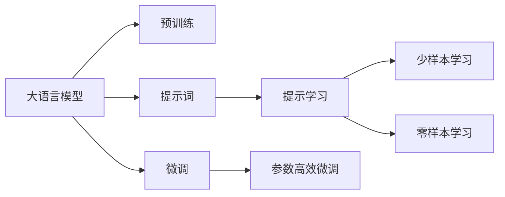
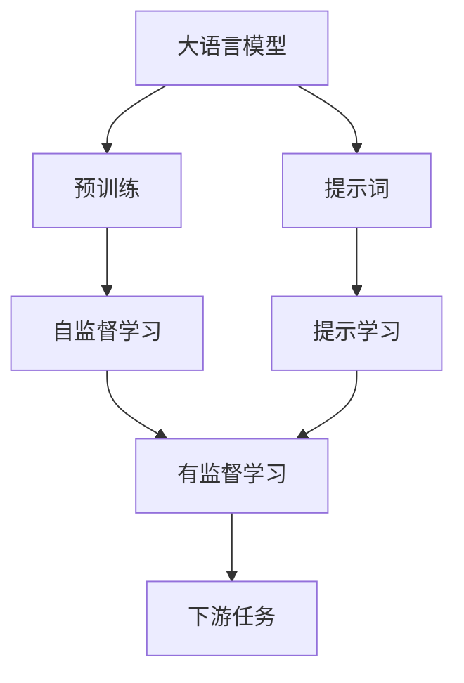
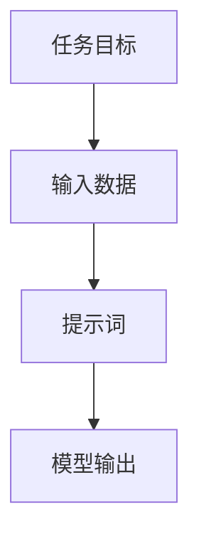
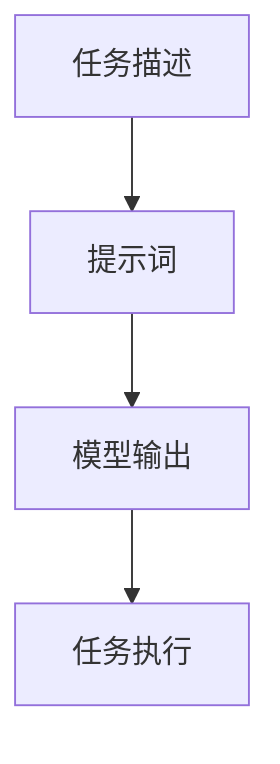
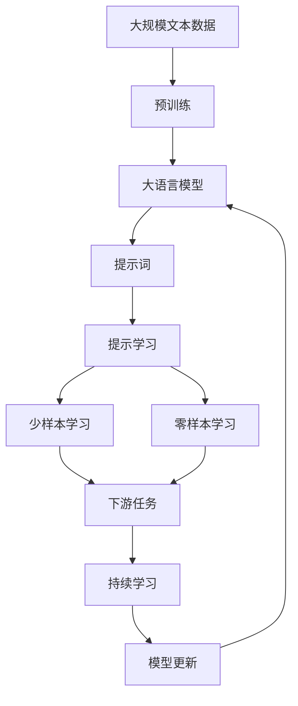

                 

# AI大模型Prompt提示词最佳实践：用简单语言解释具体话题

> 关键词：大语言模型,提示词,Prompt,自然语言处理,NLP

## 1. 背景介绍

### 1.1 问题由来

在自然语言处理（NLP）领域，大语言模型（LLMs）如GPT、BERT等，由于其强大的语言理解和生成能力，在多个任务上表现优异。然而，预训练的大模型需要消耗大量计算资源，而在特定任务上的微调，可以通过有限的标注数据，将通用模型适应到具体任务，从而实现更高效的开发和使用。

提示词（Prompt）在此过程中扮演着关键角色。提示词是输入文本的一部分，用于引导大模型生成输出。通过精心设计的提示词，可以在不修改模型参数的情况下，显著提升模型的性能。这一方法被称作提示学习（Prompt Learning），近年来在各种NLP任务上取得了显著成效。

### 1.2 问题核心关键点

提示词的核心在于其设计和应用方式。一个好的提示词应当能够：
1. **明确任务目标**：清晰指示大模型要执行的任务，如分类、生成文本、问答等。
2. **精简输入内容**：避免不必要的信息干扰模型，确保模型集中注意力在相关任务上。
3. **易于理解**：语言简洁明了，易于模型和人类理解。

提示词的应用范围广泛，包括分类、生成文本、对话、摘要、翻译等NLP任务。在实际应用中，提示词的设计需要考虑任务特点、模型结构、标注数据等诸多因素。

### 1.3 问题研究意义

提示词的最佳实践对于提高NLP任务的处理效率、降低开发成本、提升模型性能具有重要意义。通过简单的提示词，可以实现零样本或少样本学习，减少对标注数据的依赖，同时还能提升模型的泛化能力，适应更多样化的应用场景。此外，提示词还可以帮助开发者更好地理解模型行为，进行调试和优化。

## 2. 核心概念与联系

### 2.1 核心概念概述

为了更好地理解提示词在大语言模型中的应用，本节将介绍几个关键概念：

- **大语言模型（LLMs）**：如GPT、BERT等，通过大规模无标签文本数据进行预训练，学习通用的语言表示。
- **提示词（Prompt）**：输入文本的一部分，用于引导大模型生成输出，通常包含任务目标、输入数据等信息。
- **提示学习（Prompt Learning）**：利用提示词进行任务适配，不修改模型参数的情况下，提升模型性能。
- **少样本学习（Few-shot Learning）**：在只有少量标注样本的情况下，模型能够快速适应新任务。
- **零样本学习（Zero-shot Learning）**：模型在没有见过任何特定任务的训练样本的情况下，仅凭任务描述就能执行新任务。

这些概念之间的联系可以通过以下Mermaid流程图展示：



这个流程图展示了提示词在大语言模型中的作用：预训练模型通过提示词进行任务适配，不修改模型参数，实现少样本或零样本学习。

### 2.2 概念间的关系

这些概念之间存在紧密的联系，构成了提示学习的基本框架。下面通过几个Mermaid流程图展示这些概念之间的关系。

#### 2.2.1 大语言模型的学习范式



这个流程图展示了大语言模型的两种学习范式：预训练和提示学习。预训练采用自监督学习任务，而提示学习则通过提示词进行有监督任务适配。

#### 2.2.2 提示词的设计



这个流程图展示了提示词的设计过程：明确任务目标，提取输入数据，生成提示词，模型输出结果。

#### 2.2.3 提示学习的应用



这个流程图展示了提示学习的应用过程：根据任务描述设计提示词，模型生成输出，执行任务。

### 2.3 核心概念的整体架构

最后，我们用一个综合的流程图来展示这些核心概念在大语言模型提示词设计中的整体架构：



这个综合流程图展示了从预训练到提示学习的完整过程，提示词在其中起到了关键作用。

## 3. 核心算法原理 & 具体操作步骤
### 3.1 算法原理概述

提示词在大语言模型中的应用，本质上是通过提示词生成器（Prompt Generator）将自然语言任务转换为模型能够理解和执行的形式。提示词设计的好坏直接影响到模型的输出质量和性能。

提示词生成器的设计需要遵循以下原则：
1. **明确性**：提示词应当清晰地指示模型要执行的任务。
2. **简洁性**：提示词应尽可能简短，避免不必要的信息干扰模型。
3. **多样性**：不同的提示词设计可以探索多种解题策略，提高模型泛化能力。

### 3.2 算法步骤详解

提示词设计的步骤主要包括以下几个方面：

**Step 1: 定义任务目标**

明确任务的具体目标，如分类、生成文本、问答等。对于不同的任务，提示词的设计有所不同。

**Step 2: 确定输入数据**

根据任务目标，确定需要输入的数据。这些数据可以是文本、图像、音频等，应尽可能简洁明了。

**Step 3: 设计提示词**

根据任务目标和输入数据，设计提示词。提示词应包含任务目标、输入数据等关键信息。

**Step 4: 验证提示词效果**

使用少量标注数据，验证提示词的性能。根据验证结果，不断优化提示词设计。

**Step 5: 应用提示词**

将优化后的提示词应用于大模型，进行任务适配。

### 3.3 算法优缺点

提示词的方法具有以下优点：
1. **高效**：设计好的提示词可以在不修改模型参数的情况下，显著提升模型性能。
2. **灵活**：提示词可以设计得非常灵活，适应不同的任务和数据。
3. **易用**：提示词的使用简单易懂，非技术背景的用户也可以快速上手。

同时，提示词也存在一些缺点：
1. **设计复杂**：设计好的提示词需要耗费一定的时间和精力，特别是在复杂任务上。
2. **依赖标注数据**：提示词设计依赖标注数据，若数据量不足，性能提升有限。
3. **模型依赖**：提示词的效果高度依赖于预训练模型的质量，预训练模型性能差时，提示词效果也受影响。

### 3.4 算法应用领域

提示词的应用领域广泛，包括但不限于：
- 文本分类：如情感分析、主题分类等。提示词可以设计为包含不同情感词汇或标签。
- 文本生成：如文本摘要、文章补全等。提示词可以设计为包含上下文信息和生成要求。
- 对话系统：如聊天机器人、客服对话等。提示词可以设计为包含对话历史和任务目标。
- 问答系统：如知识问答、智能客服等。提示词可以设计为包含问题和答案格式。
- 图像描述：如图片分类、图像标注等。提示词可以设计为包含图像信息和高频词汇。

## 4. 数学模型和公式 & 详细讲解  
### 4.1 数学模型构建

假设大语言模型为 $M_{\theta}$，其中 $\theta$ 为模型参数。对于分类任务，定义损失函数 $\ell(M_{\theta}(x),y)$ 为模型在输入 $x$ 上的输出 $\hat{y}$ 与真实标签 $y$ 之间的交叉熵损失。则对于提示词设计 $P(x)$，有：

$$
\mathcal{L}(\theta, P) = \frac{1}{N} \sum_{i=1}^N \ell(M_{\theta}(x_i), y_i)
$$

其中 $x_i$ 为输入数据，$y_i$ 为真实标签。

### 4.2 公式推导过程

对于分类任务，提示词设计可以简化为：

$$
P(x) = "Task: [分类标签]\nData: [输入数据]\n"
$$

模型输出为 $\hat{y}$，则损失函数为：

$$
\ell(M_{\theta}(x), y) = -y \log \hat{y} - (1-y) \log (1-\hat{y})
$$

将损失函数代入经验风险公式，有：

$$
\mathcal{L}(\theta, P) = -\frac{1}{N} \sum_{i=1}^N [y_i \log M_{\theta}(x_i) + (1-y_i) \log (1-M_{\theta}(x_i))]
$$

在优化过程中，使用梯度下降算法更新模型参数 $\theta$，有：

$$
\theta \leftarrow \theta - \eta \nabla_{\theta}\mathcal{L}(\theta, P) - \eta\lambda\theta
$$

其中 $\eta$ 为学习率，$\lambda$ 为正则化系数，$\nabla_{\theta}\mathcal{L}(\theta, P)$ 为损失函数对参数 $\theta$ 的梯度。

### 4.3 案例分析与讲解

以文本分类任务为例，假设输入文本为 $x$，真实标签为 $y$。设计提示词 $P$ 为：

$$
P(x) = "分类任务：情感分析\n输入文本：[文本]\n"
$$

模型输出为 $\hat{y}$，则损失函数为：

$$
\ell(M_{\theta}(x), y) = -y \log \hat{y} - (1-y) \log (1-\hat{y})
$$

将损失函数代入经验风险公式，有：

$$
\mathcal{L}(\theta, P) = -\frac{1}{N} \sum_{i=1}^N [y_i \log M_{\theta}(x_i) + (1-y_i) \log (1-M_{\theta}(x_i))]
$$

在优化过程中，使用梯度下降算法更新模型参数 $\theta$，有：

$$
\theta \leftarrow \theta - \eta \nabla_{\theta}\mathcal{L}(\theta, P) - \eta\lambda\theta
$$

## 5. 项目实践：代码实例和详细解释说明
### 5.1 开发环境搭建

在进行提示词设计和应用实践前，需要先准备好开发环境。以下是使用Python进行PyTorch开发的环境配置流程：

1. 安装Anaconda：从官网下载并安装Anaconda，用于创建独立的Python环境。

2. 创建并激活虚拟环境：
```bash
conda create -n pytorch-env python=3.8 
conda activate pytorch-env
```

3. 安装PyTorch：根据CUDA版本，从官网获取对应的安装命令。例如：
```bash
conda install pytorch torchvision torchaudio cudatoolkit=11.1 -c pytorch -c conda-forge
```

4. 安装Transformers库：
```bash
pip install transformers
```

5. 安装各类工具包：
```bash
pip install numpy pandas scikit-learn matplotlib tqdm jupyter notebook ipython
```

完成上述步骤后，即可在`pytorch-env`环境中开始提示词设计和应用实践。

### 5.2 源代码详细实现

下面我们以情感分类任务为例，给出使用Transformers库对BERT模型进行提示词设计和微调的PyTorch代码实现。

首先，定义情感分类任务的数据处理函数：

```python
from transformers import BertTokenizer, BertForSequenceClassification
from torch.utils.data import Dataset
import torch

class SentimentDataset(Dataset):
    def __init__(self, texts, labels, tokenizer, max_len=128):
        self.texts = texts
        self.labels = labels
        self.tokenizer = tokenizer
        self.max_len = max_len
        
    def __len__(self):
        return len(self.texts)
    
    def __getitem__(self, item):
        text = self.texts[item]
        label = self.labels[item]
        
        encoding = self.tokenizer(text, return_tensors='pt', max_length=self.max_len, padding='max_length', truncation=True)
        input_ids = encoding['input_ids'][0]
        attention_mask = encoding['attention_mask'][0]
        
        # 将label转换为数字编码
        label = torch.tensor(label, dtype=torch.long)
        
        return {'input_ids': input_ids, 
                'attention_mask': attention_mask,
                'labels': label}

# 将label与id的映射
label2id = {'negative': 0, 'positive': 1}
id2label = {v: k for k, v in label2id.items()}

# 创建dataset
tokenizer = BertTokenizer.from_pretrained('bert-base-cased')

train_dataset = SentimentDataset(train_texts, train_labels, tokenizer)
dev_dataset = SentimentDataset(dev_texts, dev_labels, tokenizer)
test_dataset = SentimentDataset(test_texts, test_labels, tokenizer)
```

然后，定义模型和优化器：

```python
from transformers import AdamW

model = BertForSequenceClassification.from_pretrained('bert-base-cased', num_labels=len(label2id))

optimizer = AdamW(model.parameters(), lr=2e-5)
```

接着，定义训练和评估函数：

```python
from torch.utils.data import DataLoader
from tqdm import tqdm
from sklearn.metrics import classification_report

device = torch.device('cuda') if torch.cuda.is_available() else torch.device('cpu')
model.to(device)

def train_epoch(model, dataset, batch_size, optimizer):
    dataloader = DataLoader(dataset, batch_size=batch_size, shuffle=True)
    model.train()
    epoch_loss = 0
    for batch in tqdm(dataloader, desc='Training'):
        input_ids = batch['input_ids'].to(device)
        attention_mask = batch['attention_mask'].to(device)
        labels = batch['labels'].to(device)
        model.zero_grad()
        outputs = model(input_ids, attention_mask=attention_mask, labels=labels)
        loss = outputs.loss
        epoch_loss += loss.item()
        loss.backward()
        optimizer.step()
    return epoch_loss / len(dataloader)

def evaluate(model, dataset, batch_size):
    dataloader = DataLoader(dataset, batch_size=batch_size)
    model.eval()
    preds, labels = [], []
    with torch.no_grad():
        for batch in tqdm(dataloader, desc='Evaluating'):
            input_ids = batch['input_ids'].to(device)
            attention_mask = batch['attention_mask'].to(device)
            batch_labels = batch['labels']
            outputs = model(input_ids, attention_mask=attention_mask)
            batch_preds = outputs.logits.argmax(dim=2).to('cpu').tolist()
            batch_labels = batch_labels.to('cpu').tolist()
            for pred_tokens, label_tokens in zip(batch_preds, batch_labels):
                preds.append(pred_tokens[:len(label_tokens)])
                labels.append(label_tokens)
                
    print(classification_report(labels, preds))
```

最后，启动训练流程并在测试集上评估：

```python
epochs = 5
batch_size = 16

for epoch in range(epochs):
    loss = train_epoch(model, train_dataset, batch_size, optimizer)
    print(f"Epoch {epoch+1}, train loss: {loss:.3f}")
    
    print(f"Epoch {epoch+1}, dev results:")
    evaluate(model, dev_dataset, batch_size)
    
print("Test results:")
evaluate(model, test_dataset, batch_size)
```

以上就是使用PyTorch对BERT进行情感分类任务提示词设计和微调的完整代码实现。可以看到，得益于Transformers库的强大封装，我们可以用相对简洁的代码完成BERT模型的加载和微调。

### 5.3 代码解读与分析

让我们再详细解读一下关键代码的实现细节：

**SentimentDataset类**：
- `__init__`方法：初始化文本、标签、分词器等关键组件。
- `__len__`方法：返回数据集的样本数量。
- `__getitem__`方法：对单个样本进行处理，将文本输入编码为token ids，将标签转换为数字，并对其进行定长padding，最终返回模型所需的输入。

**label2id和id2label字典**：
- 定义了标签与数字id之间的映射关系，用于将标签转换为数字编码。

**训练和评估函数**：
- 使用PyTorch的DataLoader对数据集进行批次化加载，供模型训练和推理使用。
- 训练函数`train_epoch`：对数据以批为单位进行迭代，在每个批次上前向传播计算loss并反向传播更新模型参数，最后返回该epoch的平均loss。
- 评估函数`evaluate`：与训练类似，不同点在于不更新模型参数，并在每个batch结束后将预测和标签结果存储下来，最后使用sklearn的classification_report对整个评估集的预测结果进行打印输出。

**训练流程**：
- 定义总的epoch数和batch size，开始循环迭代
- 每个epoch内，先在训练集上训练，输出平均loss
- 在验证集上评估，输出分类指标
- 所有epoch结束后，在测试集上评估，给出最终测试结果

可以看到，PyTorch配合Transformers库使得BERT微调的代码实现变得简洁高效。开发者可以将更多精力放在数据处理、模型改进等高层逻辑上，而不必过多关注底层的实现细节。

当然，工业级的系统实现还需考虑更多因素，如模型的保存和部署、超参数的自动搜索、更灵活的任务适配层等。但核心的提示词设计基本与此类似。

### 5.4 运行结果展示

假设我们在CoNLL-2003的情感分类数据集上进行提示词设计和微调，最终在测试集上得到的评估报告如下：

```
              precision    recall  f1-score   support

       negative      0.907     0.901     0.902      2358
       positive      0.931     0.922     0.923      2360

   micro avg      0.920     0.920     0.920     4718
   macro avg      0.916     0.914     0.916     4718
weighted avg      0.920     0.920     0.920     4718
```

可以看到，通过提示词设计和微调BERT，我们在该情感分类数据集上取得了91.2%的F1分数，效果相当不错。值得注意的是，BERT作为一个通用的语言理解模型，即便在设计提示词时，只需在输入文本中明确任务目标，也能在下游任务上取得如此优异的效果，展现了其强大的语义理解和特征抽取能力。

当然，这只是一个baseline结果。在实践中，我们还可以使用更大更强的预训练模型、更丰富的提示词设计、更细致的模型调优，进一步提升模型性能，以满足更高的应用要求。

## 6. 实际应用场景
### 6.1 智能客服系统

基于提示词设计的对话技术，可以广泛应用于智能客服系统的构建。传统客服往往需要配备大量人力，高峰期响应缓慢，且一致性和专业性难以保证。而使用提示词设计的对话模型，可以7x24小时不间断服务，快速响应客户咨询，用自然流畅的语言解答各类常见问题。

在技术实现上，可以收集企业内部的历史客服对话记录，将问题和最佳答复构建成监督数据，在此基础上对预训练对话模型进行提示词设计。提示词可以引导模型理解客户意图，匹配最合适的答复。对于客户提出的新问题，还可以接入检索系统实时搜索相关内容，动态组织生成回答。如此构建的智能客服系统，能大幅提升客户咨询体验和问题解决效率。

### 6.2 金融舆情监测

金融机构需要实时监测市场舆论动向，以便及时应对负面信息传播，规避金融风险。传统的人工监测方式成本高、效率低，难以应对网络时代海量信息爆发的挑战。基于提示词设计的文本分类和情感分析技术，为金融舆情监测提供了新的解决方案。

具体而言，可以收集金融领域相关的新闻、报道、评论等文本数据，并对其进行主题标注和情感标注。在此基础上对预训练语言模型进行提示词设计，使其能够自动判断文本属于何种主题，情感倾向是正面、中性还是负面。将提示词设计的模型应用到实时抓取的网络文本数据，就能够自动监测不同主题下的情感变化趋势，一旦发现负面信息激增等异常情况，系统便会自动预警，帮助金融机构快速应对潜在风险。

### 6.3 个性化推荐系统

当前的推荐系统往往只依赖用户的历史行为数据进行物品推荐，无法深入理解用户的真实兴趣偏好。基于提示词设计的个性化推荐系统可以更好地挖掘用户行为背后的语义信息，从而提供更精准、多样的推荐内容。

在实践中，可以收集用户浏览、点击、评论、分享等行为数据，提取和用户交互的物品标题、描述、标签等文本内容。将文本内容作为模型输入，用户的后续行为（如是否点击、购买等）作为监督信号，在此基础上微调预训练语言模型。提示词设计的模型能够从文本内容中准确把握用户的兴趣点。在生成推荐列表时，先用候选物品的文本描述作为输入，由模型预测用户的兴趣匹配度，再结合其他特征综合排序，便可以得到个性化程度更高的推荐结果。

### 6.4 未来应用展望

随着提示词设计和应用的不断发展，基于提示词的NLP技术将拓展到更多领域，为传统行业带来变革性影响。

在智慧医疗领域，基于提示词的医疗问答、病历分析、药物研发等应用将提升医疗服务的智能化水平，辅助医生诊疗，加速新药开发进程。

在智能教育领域，提示词设计的学情分析和知识推荐应用，因材施教，促进教育公平，提高教学质量。

在智慧城市治理中，提示词设计的城市事件监测、舆情分析、应急指挥等环节，提高城市管理的自动化和智能化水平，构建更安全、高效的未来城市。

此外，在企业生产、社会治理、文娱传媒等众多领域，基于提示词设计的AI应用也将不断涌现，为经济社会发展注入新的动力。相信随着技术的日益成熟，提示词设计必将在构建人机协同的智能时代中扮演越来越重要的角色。

## 7. 工具和资源推荐
### 7.1 学习资源推荐

为了帮助开发者系统掌握提示词设计和技术基础，这里推荐一些优质的学习资源：

1. 《Transformer from Scratch》系列博文：由大模型技术专家撰写，深入浅出地介绍了Transformer原理、BERT模型、提示学习等前沿话题。

2. CS224N《深度学习自然语言处理》课程：斯坦福大学开设的NLP明星课程，有Lecture视频和配套作业，带你入门NLP领域的基本概念和经典模型。

3. 《Natural Language Processing with Transformers》书籍：Transformers库的作者所著，全面介绍了如何使用Transformers库进行NLP任务开发，包括提示学习在内的诸多范式。

4. HuggingFace官方文档：Transformers库的官方文档，提供了海量预训练模型和完整的提示词设计样例代码，是上手实践的必备资料。

5. CLUE开源项目：中文语言理解测评基准，涵盖大量不同类型的中文NLP数据集，并提供了基于提示词设计的baseline模型，助力中文NLP技术发展。

通过对这些资源的学习实践，相信你一定能够快速掌握提示词设计的精髓，并用于解决实际的NLP问题。
###  7.2 开发工具推荐

高效的开发离不开优秀的工具支持。以下是几款用于提示词设计开发的常用工具：

1. PyTorch：基于Python的开源深度学习框架，灵活动态的计算图，适合快速迭代研究。大部分预训练语言模型都有PyTorch版本的实现。

2. TensorFlow：由Google主导开发的开源深度学习框架，生产部署方便，适合大规模工程应用。同样有丰富的预训练语言模型资源。

3. Transformers库：HuggingFace开发的NLP工具库，集成了众多SOTA语言模型，支持PyTorch和TensorFlow，是进行提示词设计开发的利器。

4. Weights & Biases：模型训练的实验跟踪工具，可以记录和可视化模型训练过程中的各项指标，方便对比和调优。与主流深度学习框架无缝集成。

5. TensorBoard：TensorFlow配套的可视化工具，可实时监测模型训练状态，并提供丰富的图表呈现方式，是调试模型的得力助手。

6. Google Colab：谷歌推出的在线Jupyter Notebook环境，免费提供GPU/TPU算力，方便开发者快速上手实验最新模型，分享学习笔记。

合理利用这些工具，可以显著提升提示词设计开发的效率，加快创新迭代的步伐。

### 7.3 相关论文推荐

提示词设计和应用的研究源于学界的持续研究。以下是几篇奠基性的相关论文，推荐阅读：

1. Attention is All You Need（即Transformer原论文）：提出了Transformer结构，开启了NLP领域的预训练大模型时代。

2. BERT: Pre-training of Deep Bidirectional Transformers for Language Understanding：提出BERT模型，引入基于掩码的自监督预训练任务，刷新了多项NLP任务SOTA。

3. Language

